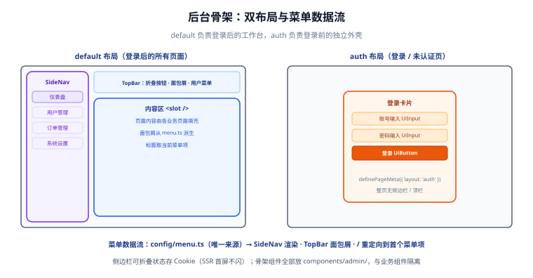

# 后台骨架：双布局与菜单

骨架回答「登录之后用户看到什么」：左侧可折叠的导航、顶部的面包屑与用户菜单、中间的内容区。这一整套由**两个布局**和**一份菜单配置**构成——菜单只有一份事实来源，侧边栏、面包屑、默认重定向全部从它派生。

::: tip 一句话理解
布局解决「页面长什么样」，菜单配置解决「页面之间怎么组织」。把两者都钉死在骨架里，业务页面就只剩「往 `<slot />` 里填内容」一件事。
:::

## 1. 双布局与菜单数据流



| 布局 | 文件 | 用在哪 | 结构 |
| --- | --- | --- | --- |
| `default` | `app/layouts/default.vue` | 登录后的所有页面（工作台） | SideNav + TopBar + 内容区 |
| `auth` | `app/layouts/auth.vue` | 登录页等认证前页面 | 整页居中的一张卡片 |

数据流是单向的：`config/menu.ts`（唯一来源）→ `SideNav` 渲染导航、`TopBar` 派生面包屑、`pages/(admin)/index.vue` 重定向到首个菜单项。**改菜单只改 `menu.ts` 一处**，三处消费自动同步——这是骨架里最重要的单一来源纪律。

## 2. 菜单：config/menu.ts

```typescript [app/config/menu.ts]
export interface MenuItem {
  key: string
  label: string
  /** 图标占位：emoji 或短文字。真图标由业务层自行接入，见技术栈适配层第 6 节 */
  icon?: string
  to?: string
  children?: MenuItem[]
}

export const menu: MenuItem[] = [
  {
    key: 'dashboard',
    label: '工作台',
    icon: '🏠',
    to: '/dashboard',
  },
  {
    key: 'content',
    label: '内容',
    icon: '📄',
    children: [
      { key: 'posts', label: '文章管理', to: '/posts' },
      { key: 'comments', label: '评论管理', to: '/comments' },
    ],
  },
  {
    key: 'settings',
    label: '设置',
    icon: '⚙️',
    children: [
      { key: 'account', label: '账号设置', to: '/settings/account' },
    ],
  },
]

/** 首个可跳转的叶子节点：/ 重定向的目标 */
export function firstLeafPath(items: MenuItem[] = menu): string {
  for (const it of items) {
    if (it.to) return it.to
    const hit = firstLeafPath(it.children ?? [])
    if (hit) return hit
  }
  return '/dashboard'
}

/** 由当前路径反查面包屑：[{ label, to? }, ...]，从顶层到当前项 */
export function breadcrumb(path: string): { label: string; to?: string }[] {
  const out: { label: string; to?: string }[] = []
  const walk = (items: MenuItem[], trail: { label: string; to?: string }[]): boolean => {
    for (const it of items) {
      const next = [...trail, it.to ? { label: it.label, to: it.to } : { label: it.label }]
      if (it.to && path.startsWith(it.to)) { out.push(...next); return true }
      if (it.children && walk(it.children, next)) return true
    }
    return false
  }
  walk(menu, [])
  return out.length ? out : [{ label: '工作台', to: '/dashboard' }]
}
```

三个设计点：

1. **层级只允许两层**。后台导航深过两层几乎一定是信息架构出了问题；`children` 里再嵌 `children` 属于违规，`SideNav` 不渲染第三层。
2. **`to` 是路由事实**。`key` 只做组件 state，不做路由匹配；面包屑与高亮全部以 `to` 与当前路径的 `startsWith` 关系判定。
3. **`breadcrumb` 允许前缀匹配**。`/posts/edit/1` 会命中 `/posts` 的面包屑——详情页、编辑页自动挂在所属菜单下，不用逐页声明。

## 3. default 布局

```vue [app/layouts/default.vue]
<script setup lang="ts">
import { menu, breadcrumb } from '~/config/menu'

/** 折叠状态存 Cookie：SSR 首屏就能读到，刷新不闪（先宽后窄的抖动） */
const collapsed = useCookie('admin-sidenav-collapsed', { default: () => false })
const route = useRoute()
const crumbs = computed(() => breadcrumb(route.path))
</script>

<template>
  <div class="admin-shell">
    <aside class="admin-side" :class="{ 'admin-side--collapsed': collapsed }">
      <div class="admin-side__logo">后台</div>
      <UiMenu :items="menu" :active-key="route.path" :collapsed="collapsed" @select="k => navigateTo(k)" />
    </aside>
    <div class="admin-main">
      <header class="admin-top">
        <button class="admin-top__toggle" @click="collapsed = !collapsed">{{ collapsed ? '☰' : '✕' }}</button>
        <nav class="admin-top__crumbs">
          <template v-for="(c, i) in crumbs" :key="i">
            <span v-if="i" class="admin-top__sep">/</span>
            <NuxtLink v-if="c.to && i < crumbs.length - 1" :to="c.to">{{ c.label }}</NuxtLink>
            <span v-else>{{ c.label }}</span>
          </template>
        </nav>
        <UiDropdown :items="[{ key: 'logout', label: '退出登录' }]" @select="k => k === 'logout' && navigateTo('/logout')">
          <span class="admin-top__user">👤 管理员</span>
        </UiDropdown>
      </header>
      <main class="admin-content">
        <slot />
      </main>
    </div>
  </div>
</template>

<style scoped>
.admin-shell { display: flex; min-height: 100vh; }
.admin-side { width: 220px; border-right: 1px solid #e2e8f0; transition: width 0.2s; }
.admin-side--collapsed { width: 64px; }
.admin-side__logo { height: 48px; display: grid; place-items: center; font-weight: 600; }
.admin-main { flex: 1; display: flex; flex-direction: column; min-width: 0; }
.admin-top { height: 48px; display: flex; align-items: center; gap: 12px; padding: 0 16px; border-bottom: 1px solid #e2e8f0; }
.admin-top__crumbs { flex: 1; display: flex; gap: 6px; align-items: center; }
.admin-content { flex: 1; padding: 16px; }
</style>
```

## 4. 骨架组件的边界

`default.vue` 只做拼装，真正的渲染全部委托给两类组件：

| 组件 | 位置 | 职责 | 为什么这样拆 |
| --- | --- | --- | --- |
| `UiMenu` / `UiDropdown` | `app/ui-impl/<框架>/` | 框架差异（树形菜单、下拉动画、键盘导航） | 进[适配层](../StackAdapter/index.md)，随技术栈切换 |
| 侧边栏折叠、面包屑、用户名 | `layouts/default.vue` 内联 | 与框架无关的骨架逻辑 | 留在布局里，避免「骨架组件」层越积越厚 |

::: warning 不再单独建 SideNav / TopBar 组件
早期设计里 `components/admin/SideNav.vue`、`TopBar.vue` 是独立文件；实际写下来发现布局文件拆出这两个组件后，每个只有十几行且只被一处引用，**拆分反而让「菜单 → 面包屑」的派生关系跨了三个文件**。骨架阶段直接内联在 `default.vue`，等某个组件真的被第二个布局复用时再拆——「骨架组件目录」先留给业务层放公共业务组件。
:::

## 5. auth 布局

```vue [app/layouts/auth.vue]
<template>
  <div class="auth-shell">
    <slot />
  </div>
</template>

<style scoped>
.auth-shell {
  min-height: 100vh;
  display: grid;
  place-items: center;
  background: #f1f5f9;
}
</style>
```

整页只有「居中放一张卡片」一件事，卡片本身由页面（[登录页](../Login/index.md)）提供——布局管环境，页面管内容，职责不互换。

## 6. 页面组织与重定向

```text
app/pages/
├─ login/index.vue              # definePageMeta({ layout: 'auth' })
├─ logout.vue                   # 退出中转页（清登录态，见登录篇）
└─ (admin)/
   ├─ index.vue                 # / → 重定向到首个菜单项
   └─ dashboard/index.vue       # 示例工作台页
```

```vue [app/pages/(admin)/index.vue]
<script setup lang="ts">
import { firstLeafPath } from '~/config/menu'

await navigateTo(firstLeafPath(), { replace: true })
</script>
```

```vue [app/pages/(admin)/dashboard/index.vue]
<template>
  <section>
    <h2>工作台</h2>
    <p>骨架就位。业务页面从这里开始。</p>
  </section>
</template>
```

要点：

- **`(admin)` 是路由分组目录**，圆括号里的名字不进 URL——`/dashboard` 依然是 `/dashboard`。分组的价值是把「需要 default 布局的页面」圈在一起，将来加 `definePageMeta({ layout: 'default' })` 只需在分组内逐页声明，不会漏到登录页上去。
- **`/` 不直接渲染内容**，只负责把用户送到第一个菜单项。后台用户的入口行为是「点侧边栏」，首页是一个抽象地址，内容随菜单配置变化。

## 7. 404 与错误页

```vue [app/error.vue]
<script setup lang="ts">
const props = defineProps<{ error: { statusCode?: number; message?: string } }>()
const goHome = () => clearError({ redirect: '/dashboard' })
</script>

<template>
  <div class="err">
    <h2>{{ props.error.statusCode === 404 ? '页面不存在' : '出错了' }}</h2>
    <p>{{ props.error.message }}</p>
    <UiButton kind="primary" @click="goHome">回到工作台</UiButton>
  </div>
</template>
```

两个易踩的点：

::: danger error.vue 在布局之外
Nuxt 的 `error.vue` 是**顶层错误页，不走任何 layout**——`default` 布局里的侧边栏不会出现在 404 页上，这是设计而不是缺陷。所以 `error.vue` 里的「回到工作台」按钮必须自己处理登录态：未登录时 `/dashboard` 会被[守卫](../Login/index.md)带回 `/login`，闭环仍然成立，不需要在这里重复判断。
:::

1. **`UiButton` 在 error.vue 里可用**，因为它走的是构建期组件注册而非布局作用域——前提是 `error.vue` 放在 `app/` 根（`app/error.vue`），放错层级会导致组件未注册、页面空白。
2. **`clearError` 之后才恢复路由**，重定向目标写成 `/dashboard` 而不是 `route.path`——出错页的来源路由可能就是错误本身。

## 8. 验证方式

```shell
pnpm dev
```

| # | 操作 | 期望 |
| --- | --- | --- |
| 1 | 登录后访问 `/` | 地址栏变成首个菜单项（`/dashboard`），无闪页 |
| 2 | 观察侧边栏 | `menu.ts` 里的分组与叶子逐项出现，当前项高亮 |
| 3 | 点折叠按钮 | 侧边栏宽度动画收窄，**刷新后保持折叠**（Cookie 生效），无先宽后窄闪动 |
| 4 | 进入 `/dashboard` 看面包屑 | 「工作台」单项；进入 `/posts` 后面包屑为「内容 / 文章管理」 |
| 5 | 访问一个不存在的地址 `/nope` | 出现 404 页（无侧边栏），点按钮回到 `/dashboard` |
| 6 | 全程看控制台 | 0 error、0 hydration 警告 |

## 相关页面

- [技术栈适配层](../StackAdapter/index.md)：`UiMenu`、`UiDropdown` 的契约与实现
- [登录与路由守卫](../Login/index.md)：`auth` 布局的第一个使用者，以及进入 default 布局前的检查
- [Nuxt 布局系统](../../../../docs/Frontend/Frame/Nuxt/index.md)：layouts 与路由分组的框架级原理

## 参考资料

- Nuxt layouts：[nuxt.com/docs/guide/directory-structure/layouts](https://nuxt.com/docs/guide/directory-structure/layouts)
- 路由分组（Route Groups）：[nuxt.com/docs/guide/directory-structure/pages](https://nuxt.com/docs/guide/directory-structure/pages)
- `useCookie`：[nuxt.com/docs/api/composables/use-cookie](https://nuxt.com/docs/api/composables/use-cookie)
