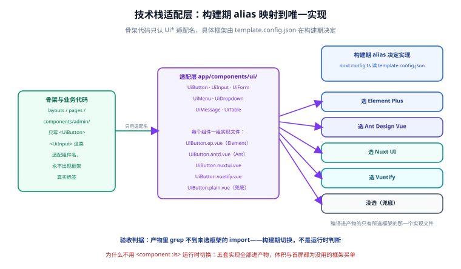

# 技术栈适配层

适配层是本模板能立住「骨架不认识具体框架」这条硬约束的全部机制：骨架代码里只出现 `UiButton`、`UiInput` 这类**适配组件名**，每个适配名在构建期被解析成**所选框架的唯一实现**。选了 Element Plus 就用 Element Plus 渲染，什么都没选就用纯 CSS 兜底——产物里永远只有一个框架的实现。

::: tip 一句话理解
适配层就是一份「编译期查表」：`UiButton` 这个名字不变，查表的结果由 `template.config.json` 决定，表在构建时查完就丢，运行时不存在任何选择逻辑。
:::

## 1. 机制总览



三个设计决定，每个都排除了一个反方向：

| 决定 | 排除的方案 | 理由 |
| --- | --- | --- |
| **构建期查表**（`nuxt.config.ts` 读 `template.config.json`） | 运行时 `<component :is>` 切换 | 运行时切换会让五套实现全部进产物，且丢失 props 类型推导 |
| **实现文件放 `app/ui-impl/`**（`components/` 之外） | 把五份实现都放 `components/ui/` | `components/` 下的组件会被 Nuxt 自动导入注册，五份同名实现会互相打架 |
| **组件名由目录前缀生成**（`prefix: 'Ui'`） | 手写 wrapper 转发组件 | wrapper 每个组件多一个文件、props/slots 转发容易漏，出问题全在运行时 |

## 2. 目录与命名约定

```text
app/
├─ ui-impl/                          # 不在 components/ 下 → 不会被自动导入
│  ├─ types.ts                       # 全部实现的共享 props 契约（框架无关）
│  ├─ element-plus/
│  │  ├─ Button.vue                  # → 注册为 UiButton
│  │  ├─ Input.vue                   # → 注册为 UiInput
│  │  ├─ FormItem.vue                # → 注册为 UiFormItem
│  │  ├─ Menu.vue                    # → 注册为 UiMenu
│  │  ├─ Dropdown.vue                # → 注册为 UiDropdown
│  │  ├─ MessageHost.vue             # → 注册为 UiMessageHost
│  │  └─ Table.vue                   # → 注册为 UiTable
│  ├─ antd/                          # Ant Design Vue，同一组文件名
│  ├─ nuxtui/                        # Nuxt UI，同一组文件名
│  ├─ vuetify/                       # Vuetify，同一组文件名
│  └─ plain/                         # 纯 CSS 兜底，同一组文件名
└─ components/
   ├─ admin/                         # 骨架组件（只使用 Ui* 名）
   └─ (业务组件由你自己添加)
```

命名纪律只有一条：**七个实现目录里的文件名完全一致**。注册逻辑不感知框架，只做「目录 + 前缀」的组合，谁少一个文件谁就在那个组合下白屏。

## 3. 注册：nuxt.config.ts 读快照

在[初始化](../Bootstrap/index.md)给出的 `admin-skeleton` 区间里，注册逻辑是构建期的十几行：

```typescript [nuxt.config.ts（admin 区间完整内容）]
import { readFileSync } from 'node:fs'

// 读初始化快照：这是适配层唯一的数据来源（只读，不写回）
const raw = JSON.parse(readFileSync('./template.config.json', 'utf8'))
const ui = raw?.selection?.ui ?? 'none'

// 目录表：key 与 template.config.json 里 selection.ui 的取值一字不差
const UI_DIRS: Record<string, string> = {
  'element-plus': './app/ui-impl/element-plus',
  'ant-design-vue': './app/ui-impl/antd',
  'nuxt-ui': './app/ui-impl/nuxtui',
  vuetify: './app/ui-impl/vuetify',
  none: './app/ui-impl/plain',
}

// 查不到就报错退出（fail fast），绝不猜默认值继续跑
const implDir = UI_DIRS[ui]
if (!implDir) {
  throw new Error(`[admin] template.config.json 的 selection.ui 取值不在适配层覆盖范围: ${ui}`)
}

export default defineNuxtConfig({
  // ...初始化引擎写好的配置原样保留（此处省略）
  components: [
    '~/components',                                          // 业务与骨架组件照常自动导入
    { path: implDir, prefix: 'Ui' },                         // 适配实现：Button.vue → UiButton
  ],
})
```

::: danger 读不到 ui 字段要「响亮地失败」
`?? 'none'` 兜的是「快照里明确没选框架」这一种合法情况；除此之外任何异常（文件不存在、JSON 损坏、取值超出目录表）都必须直接 `throw`。如果在这里吞掉错误猜一个框架继续跑，后果是**构建成功但页面渲染成另一套框架的样式**——这是适配层唯一可能的静默失败点，必须用报错堵死。
:::

## 4. 共享 props 契约

七个同名实现能互换的前提是**接口先锁死**。`app/ui-impl/types.ts` 用框架无关的 TypeScript 定义契约，每个实现 import 它并严格遵守：

```typescript [app/ui-impl/types.ts]
export interface UiButtonProps {
  /** 语义类型：primary 主操作 / default 常规 / danger 危险操作 */
  kind?: 'primary' | 'default' | 'danger'
  size?: 'small' | 'medium' | 'large'
  loading?: boolean
  disabled?: boolean
  block?: boolean
}

export interface UiInputProps {
  modelValue?: string
  type?: 'text' | 'password'
  placeholder?: string
  disabled?: boolean
}

/** 菜单项结构由骨架的 config/menu.ts 定义，实现只消费 */
export interface UiMenuItemNode {
  key: string
  label: string
  icon?: string
  to?: string
  children?: UiMenuItemNode[]
}
```

契约表（骨架用到的最小集合）：

| 适配名 | 必须支持的 props | 必须支持的 slots / events | 骨架用它做什么 |
| --- | --- | --- | --- |
| `UiButton` | `kind` `size` `loading` `disabled` `block` | 默认 slot、`@click` | 登录按钮、表单提交 |
| `UiInput` | `modelValue` `type` `placeholder` `disabled` | `v-model` | 登录表单、搜索框 |
| `UiFormItem` | `label` `error` | 默认 slot | 表单行布局与错误文案 |
| `UiMenu` | `items` `activeKey` `collapsed` | `@select` | 侧边栏渲染 |
| `UiDropdown` | `items` | 默认 slot、`@select` | 顶栏用户菜单（退出登录） |
| `UiMessageHost` | 无 | 无 | 全局消息渲染（挂一次即可） |
| `UiTable` | `columns` `rows` | 默认 slot、`@row-click` | 业务列表页起步 |

新增适配组件时按同样流程走：**先在 `types.ts` 里定契约 → 七个目录各补一个同名文件 → 再写使用方**。顺序反了，先写的实现会变成「事实契约」，别的框架对不齐。

## 5. 实现示例

同一契约的两种实现，感受一下差异落在哪：

```vue [app/ui-impl/element-plus/Button.vue]
<script setup lang="ts">
import type { UiButtonProps } from '../types'

withDefaults(defineProps<UiButtonProps>(), { kind: 'default', size: 'medium' })
</script>

<template>
  <el-button
    :type="kind === 'primary' ? 'primary' : kind === 'danger' ? 'danger' : 'default'"
    :size="size === 'medium' ? 'default' : size"
  >
    <slot />
  </el-button>
</template>
```

```vue [app/ui-impl/plain/Button.vue]
<script setup lang="ts">
import type { UiButtonProps } from '../types'

withDefaults(defineProps<UiButtonProps>(), { kind: 'default', size: 'medium' })
</script>

<template>
  <button class="ui-btn" :class="[`ui-btn--${kind}`, `ui-btn--${size}`]" :disabled="disabled">
    <slot />
  </button>
</template>

<style scoped>
.ui-btn { border: 1px solid #cbd5e1; border-radius: 8px; padding: 6px 14px; background: #fff; cursor: pointer; }
.ui-btn--primary { background: #2563eb; border-color: #2563eb; color: #fff; }
.ui-btn--danger { background: #dc2626; border-color: #dc2626; color: #fff; }
.ui-btn--block { width: 100%; }
.ui-btn:disabled { opacity: 0.55; cursor: not-allowed; }
</style>
```

::: info 消息提示为什么做成 MessageHost
各框架的命令式消息 API（`ElMessage`、`message.info` 等）调用方式互不兼容，而且命令式调用点（业务代码里 `import` 框架 API）会破坏「不认识框架」的约束。骨架把消息改成**声明式**：`useMessage()` 往一个框架无关的队列里推消息，`UiMessageHost`（注册在 `app.vue`，一次）负责把队列渲染出来——推消息的代码完全框架无关，渲染差异全部关在实现文件里。
:::

```typescript [app/composables/useMessage.ts（框架无关，随骨架提供）]
interface Msg { id: number; text: string; kind: 'info' | 'success' | 'error' }

export function useMessage() {
  const queue = useState<Msg[]>('ui-messages', () => [])
  let seq = 0
  const push = (text: string, kind: Msg['kind'] = 'info') => {
    const id = ++seq
    queue.value.push({ id, text, kind })
    setTimeout(() => { queue.value = queue.value.filter(m => m.id !== id) }, 3000)
  }
  return {
    info: (t: string) => push(t, 'info'),
    success: (t: string) => push(t, 'success'),
    error: (t: string) => push(t, 'error'),
  }
}
```

## 6. 图标与骨架不管的事

- **图标不进适配层**。五个框架的图标组件 API 互不兼容，收进契约表会把适配层撑爆。骨架的菜单图标位用**文本/emoji 占位**（`menu.ts` 的 `icon` 字段填 emoji 或文字），业务层需要真图标时自行接入 `@nuxt/icon` 等模块——那是基线层模块的事，不是骨架的事。
- **表格分页、树形控件、穿梭框**这类重组件不进最小契约集。骨架只保证 `UiTable` 的七项基础契约；业务要用高级能力时，直接在业务层使用框架组件（那时你已经明确知道项目用什么框架了，约束 2 不限制业务层）。
- **框架的按需引入配置**（`unplugin-vue-components`、Nuxt UI 的模块化引入等）属于基线层，初始化时已由 NuxtTemplate 装好，骨架不重复配置。

## 7. 易错点

::: danger 三个高频坑

1. **实现文件放错目录**。放进 `app/components/ui-impl/` 就会被自动导入，五份 `Button.vue` 按目录前缀注册成 `UiImplButton` 系列组件——不报错，但 `UiButton` 解析不到，渲染成未识别元素，**控制台干净、整块空白**。判据：`app/components/` 下永远不出现 `ui-impl`。
2. **目录表与快照取值对不上字**。`selection.ui` 写的是 `element-plus`，目录表 key 却写成 `elementPlus`——`UI_DIRS[ui]` 得到 `undefined`。第 3 节的 fail fast 会把它变成启动报错；如果当时为了「先跑起来」删掉 throw，就变成静默渲染 plain 兜底。
3. **契约漂移**。给 Element Plus 实现单独加了 `plain` 属性却没进 `types.ts`，另一个组合下该属性静默失效。判据：任何实现文件的 `defineProps` 必须只引用 `../types` 里的接口，出现内联接口定义即为违规。
:::

## 8. 验证方式

```shell
# ① 约束 2：框架 import 只允许出现在 ui-impl/
grep -rn "element-plus\|ant-design-vue\|@nuxt/ui\|vuetify" app/ --include="*.vue" --include="*.ts" \
  | grep -v "app/ui-impl/"
# 期望：无输出

# ② 注册正确性：启动后查 Nuxt 生成的组件类型声明
pnpm dev
grep -o "UiButton\b" .nuxt/components.d.ts | head -1
# 期望：命中（说明适配名已注册）；再确认声明文件里没有其余四个目录的组件

# ③ 可移植性：换一个框架组合重新初始化，骨架行为一致
#    （在另一份 clone 上选择 Ant Design Vue 初始化 → 按本文档重放骨架）
pnpm dev
# 期望：骨架布局与交互一致，仅组件样式不同；grep ① 同样无输出
```

## 相关页面

- [初始化：从 NuxtTemplate 拿到基线](../Bootstrap/index.md)：`template.config.json` 与 admin 区间的由来
- [后台骨架](../Skeleton/index.md)：适配组件的第一个大规模使用方
- [Nuxt 通用模板 · 技术栈矩阵](../../NuxtTemplate/StackMatrix/index.md)：`selection.ui` 的合法取值与组合冲突规则

## 参考资料

- Nuxt components 目录配置：[nuxt.com/docs/api/nuxt-config#components](https://nuxt.com/docs/api/nuxt-config#components)
- Nuxt 自动导入：[nuxt.com/docs/guide/concepts/auto-imports](https://nuxt.com/docs/guide/concepts/auto-imports)
- `useState`：[nuxt.com/docs/api/composables/use-state](https://nuxt.com/docs/api/composables/use-state)
