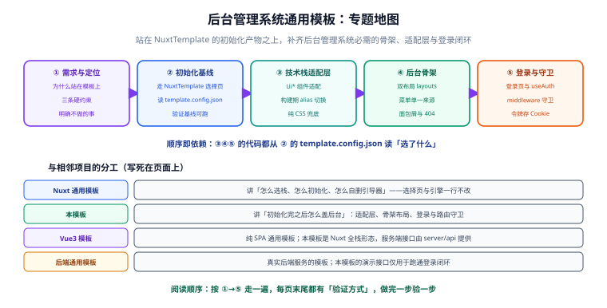

# 后台管理系统通用模板

一套**架在 [Nuxt 通用模板](../NuxtTemplate/index.md) 初始化产物之上**的后台管理系统骨架。NuxtTemplate 的流程原样保留：clone 下来 `pnpm dev`，先在技术栈选择页选好 UI 框架、预处理器、原子化与渲染模式，点「初始化项目」得到一份干净的基线工程；本模板再在这份基线上，补齐后台管理系统**绕不开的那几件事**——登录页、侧边栏 + 顶栏的工作台骨架、路由守卫，以及一层「写代码时不关心选了哪个 UI 框架」的适配层。

::: tip 一句话理解
NuxtTemplate 回答「**这个项目用什么技术栈**」；本模板回答「**选完之后，后台管理系统的第一屏怎么长出来**」。
:::

::: warning 本页只放文档，可运行实现照着文档自己做
`project/Base/AdminTemplate/` 下面只有 Markdown 与配图。所有代码（布局、菜单配置、登录接口、适配组件）都以 `[文件名]` 代码块的形式写在正文里，读者在**自己的工程**里创建这些文件即可得到可运行的项目——仓库不提供可执行副本。
:::



## 项目定位

| 问题 | 这个模板的回答 |
| --- | --- |
| 每个后台项目都要重写一遍登录、菜单、布局？ | 骨架一次成型：登录闭环 + 双布局 + 守卫，开箱即用 |
| 选了 Element Plus 的骨架，换 Ant Design Vue 就废了？ | 骨架代码**只写 `Ui*` 适配组件名**，具体框架由 `template.config.json` 在构建期决定 |
| 没选 UI 框架的纯 CSS 项目怎么办？ | 适配层有 `plain` 兜底实现，骨架在「无 UI 框架」组合下同样可用 |
| 和 NuxtTemplate 是什么关系？ | **只消费、不修改**：选择页、初始化引擎一行不改，边界是读 `template.config.json` |

## 与 NuxtTemplate 的分工

| | Nuxt 通用模板 | 本模板 |
| --- | --- | --- |
| 回答的问题 | 技术栈怎么选、怎么初始化、引导器怎么自删 | 初始化之后，后台骨架怎么搭 |
| 交付物 | 干净的基线工程 + `template.config.json` | 适配层、双布局、菜单、登录与守卫 |
| 改谁 | 初始化时改写配置文件 | **不改 NuxtTemplate 的任何文件** |
| 谁先谁后 | 第 1~3 步（clone → 选择 → 初始化） | 第 4~5 步（叠加骨架 → 验收） |

::: danger 三条硬约束（每一页都要回看）
1. **不改 NuxtTemplate**：选择页、初始化引擎、引导期文件零改动；本模板只读取初始化生成的 `template.config.json`。
2. **骨架代码不 import 任何具体 UI 框架**：页面与布局里只允许出现 `UiButton`、`UiInput` 这类适配组件名。
3. **没选 UI 框架也必须可用**：适配层必须提供纯 CSS 兜底实现，「无 UI 框架」组合是骨架的验收组合之一。
:::

## 文档地图

按「定位 → 初始化 → 适配 → 骨架 → 登录」五步组织：

| 步骤 | 页面 | 回答什么问题 |
| --- | --- | --- |
| 0 | [需求与方案定位](./Requirement/index.md) | 为什么要站在 NuxtTemplate 上，三条硬约束，明确不做什么 |
| 1 | [初始化：从 NuxtTemplate 拿到基线](./Bootstrap/index.md) | 选择页怎么选、`template.config.json` 长什么样、基线怎么验收 |
| 2 | [技术栈适配层](./StackAdapter/index.md) | 骨架怎么做到「不认识任何具体 UI 框架」 |
| 3 | [后台骨架：双布局与菜单](./Skeleton/index.md) | 侧边栏 + 顶栏从哪来，菜单为什么只有一个来源 |
| 4 | [登录与路由守卫](./Login/index.md) | 登录闭环怎么跑通，令牌放哪，守卫怎么写不死循环 |
| — | [进展记录](./Progress/index.md) | 逐日做了什么、如何验证、下一步 |

## 进度跟踪

| 步骤 | 阶段 | 本次产出 | 状态 |
| --- | --- | --- | --- |
| 0 | 需求与定位 | 分层定位、三条硬约束、路线对照 | ✅ 见[需求与方案定位](./Requirement/index.md) |
| 1 | 初始化基线 | 选择策略、快照结构、基线验收 | ✅ 见[初始化基线](./Bootstrap/index.md) |
| 2 | 技术栈适配层 | 构建期 alias、组件映射表、兜底实现 | ✅ 见[技术栈适配层](./StackAdapter/index.md) |
| 3 | 后台骨架 | 双布局、菜单单一来源、面包屑、404 | ✅ 见[后台骨架](./Skeleton/index.md) |
| 4 | 登录与守卫 | 登录闭环、useAuth、路由守卫 | ✅ 见[登录与路由守卫](./Login/index.md) |
| — | 进展记录 | 逐日迭代记录 | ✅ 见[进展记录](./Progress/index.md) |

## 快速上手

```shell
# 环境要求与 NuxtTemplate 一致：Node 24 LTS（最低 22.12）、pnpm 11
node -v      # 期望：v24.x.x
pnpm -v      # 期望：11.x.x

# 第 1~3 步：走 NuxtTemplate 的完整初始化流程
git clone https://github.com/<you>/nuxt-universal.git my-admin
cd my-admin
pnpm install
pnpm dev
# 期望：浏览器打开技术栈选择页 http://localhost:3000/setup

# 选好技术栈 → 点「初始化项目」→ 引导器自删 → 得到基线工程
pnpm verify
# 期望：verify: 12/12 通过，引导器残留 0

# 第 4~5 步：按本文档叠加骨架（适配层 → 布局 → 登录），然后
pnpm dev
# 期望：访问 http://localhost:3000/ 被守卫带到 /login，
#       登录后出现「侧边栏 + 顶栏 + 内容区」的后台骨架，控制台 0 error
```

::: info 技术基线沿用 NuxtTemplate 的口径
版本事实（Nuxt 4.5.x + Node 24 LTS + pnpm 11，2026-10-01 核对）不在本专题重复核对，以 [Nuxt 通用模板 · 技术基线](../NuxtTemplate/index.md) 为准。与 NuxtTemplate 相同，本文按官方文档逐处核对编写，**未实际跑过初始化与登录流程**，请按各页「验证方式」在本地执行。
:::

## 相关专题

- [Nuxt 通用模板](../NuxtTemplate/index.md)：**分工是**——那边讲「怎么选栈、怎么初始化、怎么自删引导器」，本模板讲「**初始化之后怎么盖后台**」，选择页与引擎一行不改。
- [Vue3 模板](../Vue3Template/index.md)：纯 SPA 的通用模板；本模板是 Nuxt 全栈形态，演示接口由 `server/api/` 提供，SPA 分支可参考其权限模块的思路。
- [后端通用模板](../BackendTemplate/index.md)：真实后端服务的模板；本模板的演示登录接口仅用于跑通闭环，接真实后端时只动 `server/api/auth/` 一处。
- [Nuxt 全栈开发](../../../docs/Frontend/Frame/Nuxt/index.md)：框架能力（渲染模式、数据获取、Server Routes）在那边讲，本模板不重复。

## 参考资料

- Nuxt 布局系统：[nuxt.com/docs/guide/directory-structure/layouts](https://nuxt.com/docs/guide/directory-structure/layouts)
- Nuxt 中间件与路由守卫：[nuxt.com/docs/guide/directory-structure/middleware](https://nuxt.com/docs/guide/directory-structure/middleware)
- Nuxt Server Routes：[nuxt.com/docs/guide/directory-structure/server](https://nuxt.com/docs/guide/directory-structure/server)
- `useCookie` 组合式函数：[nuxt.com/docs/api/composables/use-cookie](https://nuxt.com/docs/api/composables/use-cookie)
