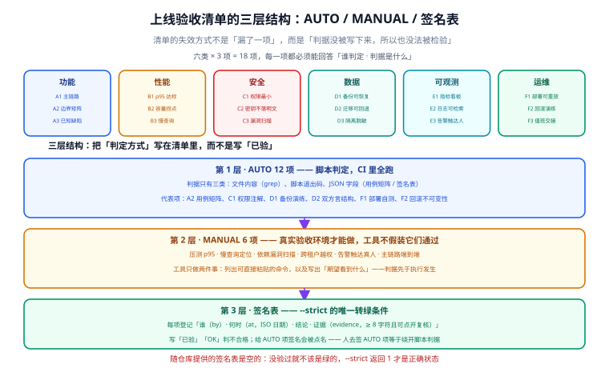
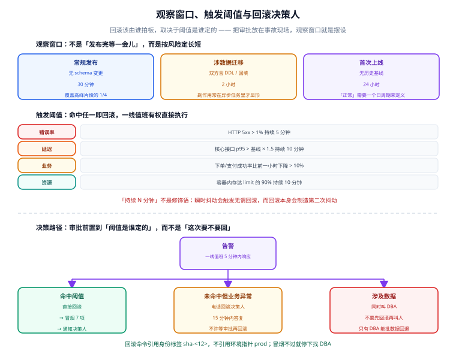

# 上线验收与监控接入

前四天把镜像打出来了、流水线串起来了、发布策略定下来了、主库也能二选一了。剩下的问题只有一个：**凭什么说它「可以上线」？**

这个问题最容易的答法是「都验过了」。而「都验过了」之所以是坏答案，不是因为它不诚实，而是因为**它没有留下任何可复核的东西**——三天后有人问「备份到底恢复过没有」，只能靠回忆。

## 一句话定位

验收清单的本质不是「一张要打勾的表」，而是**把「凭什么说可以上线」这句话拆成一条条可被判定的判据，并且明确每条判据由谁判定**。

判据三条：

1. 每一项都有**可判定的判据**（不是「功能正常」，而是「跨租户访问返回 403」）；
2. 每一项都有**明确的判定方式**（脚本判定 / 人工判定，不含「看情况」）；
3. 人工判定的项必须**登记证据**，且证据能被别人复核。

## 验收清单的两个退化形态

| 退化形态 | 看起来像 | 实际失效点 |
| --- | --- | --- |
| **勾选框表格** | 一张 Word 表，18 行，每行一个「☑」 | 谁勾的都行、什么时候勾的都行，没人能复核；而且**表是空的也能交** |
| **口头承诺** | 「都验过了」「没问题」 | 判据没写下来，所以冲突时无法界定「验过」指什么 |
| **全自动假绿** | 脚本跑完一片绿 | 把「压测 p95 达标」也写成脚本通过——脚本根本没压过，只是没报错 |

三者共同的病根是同一个：**判据没有被写下来，所以也没法被检验**。

:::tip 提示
判断一份验收清单好坏有个一次性的办法：**把它交给一个没参与项目的人，让他照着清单自己跑一遍**。如果他跑完能得出和你一样的结论，清单就是有效的；如果他中途必须问你，那说明判据还留在你脑子里。
:::

## 六类 18 项：清单本体

类别顺序按「出事之后先看什么」排：功能不对是立刻可见的，运维与交接问题要在事故当天才暴露，所以放最后但**不能省**。



| 类别 | 编号 | 检查项 | 验收判据 | 责任人 | 判定方式 |
| --- | --- | --- | --- | --- | --- |
| 功能 | A1 | 主链路端到端通过 | 核心用户旅程逐条走通，无阻断 | 研发 / 产品 | 人工 |
| 功能 | A2 | 边界与异常路径有覆盖 | 「接口 × 场景」矩阵每格有结论，已覆盖数不低于元测试基线 | 研发 | 自动 |
| 功能 | A3 | 已知缺陷有登记与豁免说明 | 遗留缺陷写明影响、规避方式与豁免人 | 研发 / 产品 | 自动 |
| 性能 | B1 | 压测 p95 达标 | 目标并发下 p95 低于约定阈值 | 性能负责人 | 人工 |
| 性能 | B2 | 容量拐点有记录 | TPS 不再线性增长时的资源水位与并发点已记录 | 性能负责人 | 自动 |
| 性能 | B3 | 慢查询与长任务已定位 | 无未处理的慢 SQL、无超时未切分的长任务 | DBA / 研发 | 人工 |
| 安全 | C1 | 权限最小化核对 | 账号与角色只具备必需权限，授权以可审计方式声明 | 安全负责人 | 自动 |
| 安全 | C2 | 密钥不落明文 | 密钥走环境变量注入，缺失即启动失败 | 安全负责人 | 自动 |
| 安全 | C3 | 依赖漏洞扫描无高危 | 依赖与镜像扫描无未修复的高危项 | 安全负责人 | 人工 |
| 数据 | D1 | 备份可恢复（演练过） | 从备份真实恢复一次并逐表校验一致 | DBA | 自动 |
| 数据 | D2 | 迁移可回退 | 反向执行在预发验证通过；双方言结构逐列一致 | DBA / 研发 | 自动 |
| 数据 | D3 | 数据隔离与脱敏符合要求 | 跨租户访问被拒（403），非生产数据已脱敏 | DBA / 安全负责人 | 人工 |
| 可观测 | E1 | 关键指标有看板 | 可用性、性能、资源、业务四类指标可见 | SRE | 自动 |
| 可观测 | E2 | 错误日志可检索 | 关键错误带 traceId，可按请求检索完整链路 | 研发 / SRE | 自动 |
| 可观测 | E3 | 告警能触达人而非只发群 | 告警指向具体值班人，且触发过一次测试告警 | SRE | 人工 |
| 运维 | F1 | 部署脚本可重放 | 同一版本重复部署结果一致，标签分层受机械校验 | 运维 | 自动 |
| 运维 | F2 | 回滚演练过 | 回滚一条命令可完成，且回滚后冒烟通过；引用不可变标签 | 运维 | 自动 |
| 运维 | F3 | 值班与升级路径已交接 | 明确值班人、升级路径与联系方式，交接有记录 | 运维 / 负责人 | 自动 |

这张表就是 `Acceptance/acceptance_check.py` 里的 `ITEMS`，**18 项一一对应**。清单写在代码里而不是写在文档里，是有意的：文档里的表会漂移，代码里的表不会——改了它，自测立刻报红。

## 三层结构：判定方式必须先写下来

### AUTO 12 项：判据只有三类

自动化判定最容易变成「写个脚本 grep 一下」，但只要判据足够具体，`grep` 也可以是有效的门禁。这里限定只有三类判定方式：

| 判定方式 | 判据 | 例子 |
| --- | --- | --- |
| `file` | 文件存在且不小于若干字节 | A3 `known_issues.md`、F3 `rollback_plan.md` |
| `grep` | 同时命中若干关键词，且不命中「不该出现」的词 | C1 命中 `@PreAuthorize`、C2 命中 `JWT_SECRET` |
| `matrix` | JSON 矩阵自洽：每格有结论、覆盖数不低于基线、每行至少一条 | A2 用例矩阵 |
| `script` | 子进程退出码 + stdout 关键字 | D1 备份演练 dry-run、D2 双方言结构、F1 部署自测 |
| `crossrollback` | 跨交付物交叉断言 | F2 回滚标签不可变性 |

:::warning 说明
`grep` 类判据有个必须承认的局限：**它只能证明「这句话被写下来了」，不能证明「这件事被做到了」**。所以 C1 命中 `@PreAuthorize` 只说明授权是声明式的、可审计的，不等于权限真的最小化——后者由 MANUAL 的 D3 越权测试来兜。**别让能自动化的项去替不能自动化的项背书。**
:::

### MANUAL 6 项：工具不假装它们通过

A1、B1、B3、C3、D3、E3 这六项**永远不可能在这个仓库里被自动判定**：它们需要真实集群、真实流量、真实数据库、真实人员被叫醒。工具对它们做且只做两件事：

1. 打印**可直接粘贴执行的命令**；
2. 打印**期望看到什么**。

```text
A1 主链路端到端通过（责任人：研发 / 产品）
    bash scripts/deploy.sh up  # 起环境
    bash scripts/smoke.sh            # 冒烟：7 项断言
    期望：冒烟 7 项全过、退出码 0；失败时脚本已自动打印容器日志
```

「期望」这一栏是关键。没有它，命令跑完输出一大片，人只能凭感觉判断算不算过；有了它，判据在**执行之前**就已经确定——这也是为什么清单要在发布前定，而不是发布后补。

### 签名表：谁拍板的落点

`--strict` 模式下，6 个 MANUAL 项必须在 `manual_signoff.json` 里登记。每条需要四个字段，判据刻意比「字段存在」更严：

| 字段 | 要求 | 为什么这么要求 |
| --- | --- | --- |
| `by` | 姓名 + 角色 | 只写角色不够，出了事要知道找谁 |
| `at` | ISO 日期开头 | 写「上周」「昨天」的时间没法复核 |
| `evidence` | **至少 8 个字符**且可点开复核 | 写「已验」「OK」会被判为不合格 |
| `result` | 结论 | 便于事后统计「哪一类最容易不过」 |

还有一条容易被忽略的检查：**给 AUTO 项签名会被点名**。AUTO 项本就该由脚本判定，人去签它等于绕开判据——这是「假绿」的另一种写法。

:::danger 注意
随仓库提供的 `manual_signoff.json` **是空的，这是刻意的**。所以本地跑：

```shell
python Acceptance/acceptance_check.py --strict   # 期望：退出码 1
```

**返回 1 才是正确状态。** 一份「跑起来全绿」但没人真正验过的验收表格，比一份红色的表格危险得多——红色至少还有人会去处理。
:::

## 两条跨交付物交叉断言

第 76 / 77 天留了一笔待办：**用例矩阵的基线值只写在第 78 天的文档里，没有成为受 `--check` 管辖的生成物**。本日用 `--cross` 结清，顺便把第 80 天的回滚能力也纳入断言。

### CLI `--check` × 用例矩阵基线

基线的链条现在是：`stack.json` 的 `caseBaseline` → `application-stack.yml` 的 `case-baseline` → `STACK.md` 的列示值 → `ErrorPath` 页的元测试断言 → `case_baseline.json` 的矩阵实测覆盖数。任何一环漂移，`--check` 或验收清单就会报红。

```shell
python Acceptance/acceptance_check.py --cross
```

```text
交叉断言 1：CLI --check × 用例矩阵基线
  PASS 5 个预设在 fixture 上全部生成 + --check 自洽；生成物含 case-baseline: 38；
       变异：基线改小一格 → --check 报红（门禁有效）；重新生成后恢复自洽；
       变异：降基线（38 → 30）被拒绝
```

### 回滚命令 × 标签不可变性

回滚能力的判据是「回滚命令引用的是不可变身份标签」——引用环境指针 `prod` 的回滚等于**回滚到一个会变的东西**，那不是回滚。这条由 `Release/tagplan.py --verify` 的 INV4 机械校验，`--cross` 里再补一次变异：

```text
交叉断言 2：回滚命令 × 标签不可变性
  PASS 正常计划 --verify 通过（INV1~INV6）；变异：回滚指向环境指针 → --verify 报红
```

### 为什么必须是变异测试

这两条断言都做了「先证明正常情况通过，再故意改坏一处，确认它一定报红」两件事。这是有意的，因为**只测「正常情况通过」等于什么都没测**：

- 「生成后 `--check` 通过」是**必然成立**的——生成器刚写完生成物，它当然自洽。要么这个断言恒真，要么生成器有 bug，两种情况都不需要跑就能知道。
- 真正要回答的问题是门禁**在有人改坏它的时候会不会拦住**。把基线从 38 改到 37，`--check` 必须报红；把回滚的 `IMAGE_REF` 换成 `prod`，`--verify` 必须报红。只有这样，门禁才算「有效」而不只是「存在」。

## 备份可恢复：判据是「逐表行数一致」

D1 的判据最容易写错。写成「备份命令没报错」几乎等于没判——`mysqldump` 遇到权限问题时可能只打一行警告然后正常退出。真正的判据是四条：

1. 备份文件能生成且**非空**（空备份比没有备份更危险）；
2. 备份能**真实恢复到另一个库**（`<源库>_restore_check`），而不是就地覆盖；
3. 恢复后**表集合完全一致**且**逐表行数完全一致**；
4. 演练结束把演练库删掉。

第 3 条不能简化成「总行数一致」：**A 表少 100 行、B 表多 100 行，总数是相等的。**

```shell
python Acceptance/backup_restore.py --dry-run          # 动作清单（无客户端也能跑）
python Acceptance/backup_restore.py --engine mysql     # 真实演练（需 mysql 客户端）
```

dry-run 输出双方言的动作清单，这也是验收清单 D1 判它「没坏」的方式：

```text
[mysql] 动作清单（目标 127.0.0.1:3306）
  ① 备份源库
      mysqldump --single-transaction --routines --triggers --set-gtid-purged=OFF app \
          --host=127.0.0.1 --port=3306 --user=root > dump.sql
  ② 建演练库 app_restore_check
  ③ 恢复到演练库
  ④ 逐表比对行数
  ⑤ 清理演练库
      比对规则：表集合必须一致，且每张表的 COUNT(*) 必须相等。
```

:::danger 注意
**`mysqldump` 不要加 `--databases`。** 加了它会把 `CREATE DATABASE` / `USE <源库>` 写进 dump，于是「恢复到演练库」这一步会拐回去覆盖源库——备份演练最危险的写法就是这个。本脚本刻意不用它，dump 里只有建表与数据，恢复目标完全由 `mysql <演练库>` 决定。
:::

脚本另有一条自我保护：源库名若已带 `_restore_check` 后缀（说明参数被指错了目标），直接拒绝执行：

```shell
MYSQL_DATABASE=app_restore_check python Acceptance/backup_restore.py --dry-run
# 拒绝执行：源库名 'app_restore_check' 本身就带演练后缀，脚本可能被指错了目标
```

## 观察窗口与回滚决策人

验收通过不代表上线结束。**观察窗口**是「上线动作的最后一段」，而**回滚决策人**是这段窗口内唯一需要提前定好的角色。



| 场景 | 窗口 | 说明 |
| --- | --- | --- |
| 常规发布（无 schema 变更） | 30 分钟 | 覆盖一次业务高峰片段的 1/4，够看清错误率与 p95 |
| 涉及数据迁移 / 双方言 DDL | 2 小时 | 迁移的副作用常在异步任务与批处理里才显现 |
| 首次上线（无历史基线） | 24 小时 | 没有基线可对比时，「正常」需要一个完整日周期来定义 |

触发阈值命中任一即回滚，**不需要再判断**：5xx > 1% 持续 5 分钟；核心接口 p95 > 基线 × 1.5 持续 10 分钟；下单成功率比前一小时下降 > 10%；容器内存达 limit 的 90% 持续 10 分钟。

:::tip 提示
「持续 N 分钟」不是修饰语。瞬时抖动会触发大量无谓回滚，而**回滚本身会制造第二次抖动**（缓存冷启动、连接重建）。阈值带持续时间，是把「情绪判断」换成「可复核事实」的唯一办法。
:::

关键一点：**一线值班有权直接执行既定回滚**。如果回滚还要等人审批，观察窗口就是摆设——等审批下来，错误率早把 SLA 打穿了。审批要前置到「阈值是谁定的」，而不是「这次要不要回」。

完整的值班表、升级路径与交接记录见验收清单 F3 的判据文件 `Acceptance/rollback_plan.md`（随仓库提交，与本文同目录）。

## 监控接入：告警必须触达人

E1 / E2 / E3 三项对应监控接入的三个层次，它们的完成度差别很大，很容易只做第一层就宣布「监控已接入」：

| 层次 | 判据 | 只做到这里的后果 |
| --- | --- | --- |
| E1 有看板 | 可用性 / 性能 / 资源 / 业务四类指标可见 | 出事时有人在看才被发现 |
| E2 日志可检索 | 错误带 traceId，能按请求还原链路 | 能看到「炸了」，看不到「为什么炸」 |
| E3 告警触达人 | 指向具体值班人，且**触发过一次测试告警** | 看板变成了「事后回顾工具」而不是「发现工具」 |

E3 的判据里「触发过一次测试告警」是硬要求：**没被触发过的告警链路等于没有告警**。配置写对了但路由配错、机器人被移出群、手机号换了——这些问题只有在真的推一次时才暴露。触发方式可以很简单：把 readiness 探针临时指向不存在的路径。

:::warning 说明
E3 明确写了「群消息不算通过」。**发到群里的告警约等于没发**：群里没人负责，且消息会被日常讨论淹没。告警必须指向具体的人，并且通知里能直接点到看板与排障手册。
:::

## 用法与本地验证

```shell
# 1) 看清单：六类 18 项的判据、责任人、判定方式、可直接粘贴的命令
python Acceptance/acceptance_check.py --list

# 2) 跑 AUTO 12 项；退出码 0 = 全部通过
python Acceptance/acceptance_check.py

# 3) 机器可读输出（接进 CI 或做看板）
python Acceptance/acceptance_check.py --json

# 4) 跨交付物交叉断言（含变异测试）
python Acceptance/acceptance_check.py --cross

# 5) 严格模式：额外检查 6 个 MANUAL 项的签名是否完备
python Acceptance/acceptance_check.py --strict      # 签名前：退出码 1（这是对的）

# 6) 自测：71 项断言，含 10 处变异测试
python Acceptance/selftest.py                       # 期望：selftest: 71/71 通过
```

本次实跑结果（本机无 Docker / 无数据库客户端）：

| 命令 | 结果 |
| --- | --- |
| `acceptance_check.py` | AUTO **12/12 通过**，退出码 0 |
| `acceptance_check.py --json` | `autoTotal=12, autoPassed=12, manualTotal=6` |
| `acceptance_check.py --cross` | 两条交叉断言 PASS（含 3 处变异测试） |
| `acceptance_check.py --strict` | 退出码 1，点名 A1、B1、B3、C3、D3、E3 未签（**符合预期**） |
| `selftest.py` | **71/71 通过** |
| `backup_restore.py --dry-run` | 退出码 0，输出含 `mysqldump` / `pg_dump` |
| `db/parity_check.py` | `OK: 2 张表 / 22 列 双方言结构一致` |
| `Release/selftest.py` | `selftest: 88/88 通过（全组合扫描 11 组）` |

:::info 信息
`--strict` 的红色不是失败，是这个工具唯一正确的初始状态。它的转绿条件只有一个：**在验收环境里把 6 个 MANUAL 项真的做一遍，并把证据填进签名表。**
:::

## 本次遇到的问题与决策

**① 校验器崩了比校验失败危险。** 自测第一次运行就抓到：往用例矩阵里填一个非法符号（比如把 `✔` 写成 `X`）时，`check_matrix` 的覆盖数统计用 `data["symbols"][c]` 直接下标取值，抛 `KeyError` 崩溃并打出堆栈。而手工维护的矩阵**最容易出的错就是写错符号**。修法是改用 `.get()`：R1 规则本就会把这个符号报出来，覆盖数只需不参与计数。同时给矩阵与签名表都补了 JSON 解析失败的兜底——**校验器崩溃时没人知道该修哪一格，静默通过时没人知道要修**。

**② 脚本类判定被跑了两次。** `run_item` 里原本写成 `run_script(item)[0]` 与 `run_script(item)[1]` 取同一个返回值的前后两项，等于**执行两遍子进程**：既浪费一倍时间，也可能两次结果不同（脚本里有临时目录与时间戳）。自测里用一层计数 spy 把它固化成回归断言。

**③ `grep` 判据写成了正则。** C2 原本写 `patterns=["JWT_SECRET:?", "环境变量"]`，但判定实现是字面子串匹配，`JWT_SECRET:?` 永远匹配不上。这类「以为支持正则其实是 `in`」的错误不会报错，只会让某一项**永远不过**——最终暴露它的是那次 `12 项里挂了 1 项` 的实跑。

**④ 备份演练脚本放弃了 shell。** 最初写成 Python / POSIX sh 双栖（polyglot），想让 `bash backup_restore.py` 与 `python` 都能跑。放弃的理由是**双栖无法在本地验证**（本机 `bash` 指向被拦截的 WSL、无 `python3`），而一个自己都没跑通过的脚本放进验收清单，正是本页要反对的事。最终统一为 Python，与 `db/parity_check.py`、`Release/tagplan.py`、`stack-select/stack-select.py` 保持同一套约定。

**⑤ 容量拐点补进了性能页。** B2 的判据要求「TPS 不再线性增长时的资源水位与并发点已记录」，但第 74 天的性能页只有单档基线，没有拐点。补了一节**阶梯加压五档 + 双证据判定**（TPS 增量衰减 **且** 资源水位触顶，两条单独出现都不算拐点），并说明找到之后要做的三件事：写进容量台账、只对先触顶的那个资源扩容、重跑确认可复现。

## 下一步（第 83 天）

1. **在真实环境执行 6 个 MANUAL 项并回填签名表**，把 `--strict` 从红转绿——这是验收清单存在的意义所在，不做这一步前面全是纸上功夫。
2. **Testcontainers 双库矩阵**：把 `db/parity_check.py` 的静态结构比对升级为「起真实 MySQL 8.4 + PostgreSQL 17 各跑一次迁移」，覆盖静态比对看不见的行为差异（排序规则、`TEXT` 语义、并发下的 DDL 锁）。
3. **`parity_check.py` 接入 CI 静态检查**：目前它靠人工运行，第 79 天的流水线里还没有这一步；与验收清单 D2 的判据是同一个门禁，应当合并成一个来源。
4. **把 `--check` × 用例矩阵基线的交叉断言接进 CI**：本日只是把断言写出来了，还没挂进流水线。

## 参考资料

- 清单模板与「可裁剪的六类 18 项」：[完整项目交付 · 一键部署与上线验收](../../../../docs/Others/ProjectDelivery/Delivery/index.md)
- 用例矩阵与元测试基线：[异常路径联调收口与用例清单](../ErrorPath/index.md)
- 生成物与 `--check` 门禁：[技术栈可插拔：模块边界与选择器脚本](../StackSelect/index.md)
- 回滚命令与标签不可变性：[镜像推送与发布策略](../Release/index.md)
- 双方言结构一致性：[主库可插拔：MySQL / PostgreSQL 双方言](../Database/index.md)
- 流水线门禁串接：[CI 流水线：把门禁串成一条链](../CI/index.md)
- 性能基线与容量拐点：[压测与性能基线](../PerformanceTest/index.md)
- 逐日进展：[进展记录](../Progress/index.md)
- 外部参考：[Google SRE Book · Release Engineering](https://sre.google/sre-book/release-engineering/) / [MySRE · 监控与告警](https://sre.google/workbook/monitoring/)
