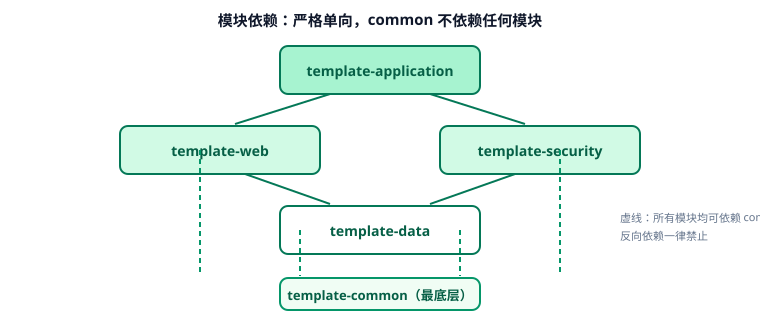

# 需求与架构设计（第 1 周）

本页是周期 3 项目第 1 周的交付物：**把"做一个后端通用模板"拆成可验收的需求、可落地的架构与可执行的目录结构**。



## 要解决的问题

每个新业务项目都要重复搭建这些基础设施，且各家做法不一致，导致：

| 痛点 | 具体表现 | 模板要给出的答案 |
| --- | --- | --- |
| 返回结构五花八门 | 有的直接返回对象，有的 `{code,data}`，有的 `{success,result}` | 统一 `Result<T>` 结构与错误码规范 |
| 异常处理散落各处 | Controller 里到处 `try/catch`，报错信息泄露堆栈 | 全局异常处理 + 统一错误响应 |
| 配置环境混乱 | 改配置要改代码，生产密码写在仓库里 | 多环境 Profile + 环境变量注入 |
| 缺可观测性 | 出问题不知道是哪个版本、哪个请求 | Actuator 健康/信息端点 + TraceId（第 70 天） |
| 部署靠手写命令 | 换机器就报错 | Dockerfile + Compose + 脚本 |
| 缺质量门禁 | 测试覆盖率无人管 | 单元/集成测试 + CI 校验（第 3~4 周） |

## 需求清单（可验收）

| 编号 | 需求 | 验收标准 |
| --- | --- | --- |
| R1 | 多模块骨架 | `mvn clean package` 成功，产物为可执行 jar |
| R2 | 统一响应 | 所有接口返回 `{code, message, data, timestamp}` |
| R3 | 错误码体系 | 错误码集中定义，业务码与 HTTP 状态码映射明确 |
| R4 | 全局异常 | 参数错误→400、认证失败→401、权限不足→403、未找到→404、系统异常→500，均返回统一结构 |
| R5 | 参数校验 | 使用 Bean Validation，校验失败返回字段级错误信息 |
| R6 | 健康检查 | `/actuator/health` 返回 UP；`/api/health/ready` 检查 DB/Redis |
| R7 | 多环境配置 | dev/test/prod 三套 Profile，敏感项走环境变量 |
| R8 | 数据访问 | MyBatis-Plus 接入 + 分页 + 自动填充时间字段 |
| R9 | 认证授权 | JWT 登录、令牌校验、基于注解的权限控制 |
| R10 | 打包部署 | Docker 镜像 + Compose 一键起服务 + 启动脚本 |
| R11 | 质量门禁 | 单测覆盖率 ≥ 60%，CI 通过才允许合并 |

## 技术选型与理由

| 组件 | 选型 | 放弃的方案与原因 |
| --- | --- | --- |
| Web 框架 | Spring MVC | WebFlux 学习成本高、阻塞式排查更直观，团队熟悉度优先 |
| 构建 | Maven 多模块 | Gradle 更灵活但配置门槛高，模板追求"新人 10 分钟上手" |
| ORM | MyBatis-Plus | JPA 对复杂 SQL 与分页控制弱，国内团队与既有经验更匹配 |
| 认证 | Spring Security 7 + JWT | Sa-Token 更简单但生态与 Spring 主线绑定更紧的是 Security |
| 文档 | springdoc-openapi | 与 Spring Boot 3/4 同步，Swagger UI 直接可用 |
| 数据库 | MySQL 8.4 LTS | 8.4 支持到 2032-04，社区与云厂商支持最好 |
| 缓存 | Redis 8.x | 通用缓存、令牌黑名单、限流计数 |

::: warning 选型的判断标准
模板的选型原则是**"新人能看懂、出问题好排查、社区资料多"**，不是"技术上最先进"。例如响应式（WebFlux）在高并发下确有优势，但阻塞模型 + 线程池 + 压测扩容的组合，对多数业务系统已经够用且更容易排障。
:::

## 分层与依赖规则

```text
template-application   ← 启动模块，唯一有 main 方法
        ↓
template-web           ← Controller / 参数校验 / 全局异常 / API 文档
        ↓
template-security      ← 认证过滤器 / JWT / 权限注解
        ↓
template-data          ← Mapper / 分页 / 数据源配置
        ↓
template-common        ← Result / ErrorCode / 常量 / 工具类（不依赖任何模块）
```

规则（评审时逐条检查）：

1. **依赖只能向下**：禁止 `common` 引用 `web`，禁止 `data` 引用 `security`。
2. **common 里不放 Spring Web 依赖**：保证它可被任何模块引用而不引入额外 Web 栈。
3. **跨模块调用只经由接口**：`security` 需要用户信息时，通过 `data` 暴露的接口而不是直接注入 Mapper。
4. **配置集中在 application 模块**：其他模块只提供默认配置（`application-*.yml` 片段），便于覆盖。

## 统一契约（先定契约再写代码）

### 响应结构

```json
{
  "code": 0,
  "message": "success",
  "data": { "id": 1, "name": "示例" },
  "timestamp": 1790000000000,
  "traceId": "8f0c1a2b4d5e6f70"
}
```

| 字段 | 类型 | 说明 |
| --- | --- | --- |
| `code` | int | 业务码，`0` 表示成功；非 0 见错误码表 |
| `message` | string | 面向调用方的提示（不暴露堆栈与内部细节） |
| `data` | any | 业务数据，无数据时为 `null` |
| `timestamp` | long | 服务器时间毫秒值，便于前端判断响应新鲜度 |
| `traceId` | string | 请求追踪 ID（第 70 天接入，先留字段） |

### 错误码分段

| 区间 | 含义 | 示例 |
| --- | --- | --- |
| `0` | 成功 | `0` |
| `10000~19999` | 通用错误（参数、认证、权限） | `10401` 未认证、`10403` 无权限 |
| `20000~29999` | 业务错误（按业务域划分） | `20001` 用户名已存在 |
| `50000~59999` | 系统错误（DB、第三方、未知） | `50001` 数据库异常 |

### 接口清单（第 69 天实现的三个）

| 方法 | 路径 | 说明 | 返回 |
| --- | --- | --- | --- |
| GET | `/api/ping` | 演示成功响应 | `Result<String>` |
| GET | `/api/echo` | 演示参数校验失败 | 校验错误 → `10400` |
| GET | `/api/boom` | 演示系统异常被统一处理 | 异常 → `50000`（不暴露堆栈） |
| GET | `/actuator/health` | 探活 | `{"status":"UP"}` |

## 验证方式

架构的验收标准是"结构可落地"，本文用三条命令确认：

```shell
# 1. 模块依赖无违规（无循环依赖，依赖方向正确）
mvn -q dependency:tree -Dincludes=com.example.template

# 2. 打包成功且产物可执行
mvn -q clean package -DskipTests && ls template-application/target/*.jar

# 3. 契约文档可达（启动后）
curl -s http://localhost:8080/v3/api-docs | head -c 200
```

收尾确认：依赖树中不存在反向依赖、jar 可执行、OpenAPI 文档能返回 JSON。

## 下一步（第 70 天）

1. 接入 TraceId 与日志切面，让 `Result.traceId` 真正有值。
2. 参数校验分组（新增 / 更新）与自定义校验注解。
3. 用 MockMvc 为统一响应与异常处理补集成测试。

## 参考资料

- Spring Boot 官方文档：[Web MVC](https://docs.spring.io/spring-boot/reference/web/servlet.html)
- 相关文档：[Spring Boot 通用指南](../../../../docs/Backend/Java/Frame/SpringBoot/Common/index.md) / [设计模式](../../../../docs/Backend/DesignPatterns/index.md)
