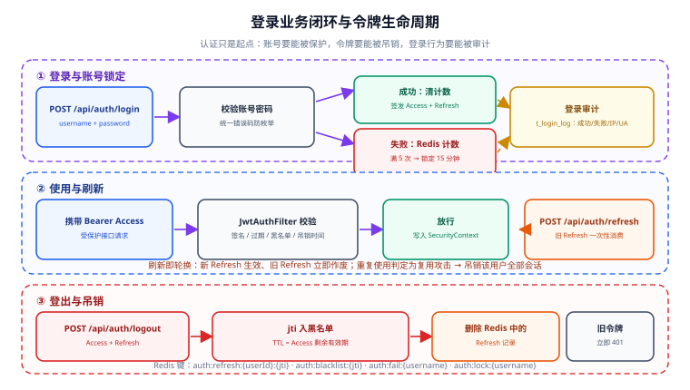

# 登录业务闭环与令牌生命周期

第 72 天我们把模板从"裸接口"变成了"默认安全"——但那条链路只解决了**"令牌能不能验"**，还没解决**"账号能不能被保护、令牌能不能被吊销"**。

本节（第 73 天）进入**第 3 周：联调与测试**，把认证从"技术链路"补成"业务闭环"：账号锁定、密码强度、登录审计、双令牌刷新、登出黑名单，并把它们全部用集成测试锁住。

## 1. 本节目标与验收标准

| 目标 | 验收方式 |
| --- | --- |
| 账号连续失败自动锁定 | 失败 5 次后第 6 次登录返回 423（锁定），等待窗口后可再试 |
| 密码强度校验 | 弱密码注册/改密被拒，返回字段级错误 |
| 登录行为可审计 | `t_login_log` 表记录成功/失败、IP、UA、时间 |
| 访问令牌短期有效 | Access TTL 30 分钟，不可续期 |
| 刷新令牌可吊销 | Refresh 存 Redis，`/api/auth/refresh` 校验有效性 |
| 登出即失效 | `/api/auth/logout` 把 `jti` 写入黑名单，后续用旧 Access 请求返回 401 |
| 刷新令牌防复用 | 已用过的 Refresh 再次使用返回 401 并吊销该用户全部会话 |
| 测试全绿 | `SecurityIT` 从 4 个用例扩到 8 个，覆盖率门禁通过 |

::: info 当前使用的版本
JDK 25 LTS · Spring Boot 4.1.x · Spring Security 7.1.x · jjwt 0.13.0（`api`/`impl`/`jackson` 版本严格一致）· Redis 8.x · MySQL 8.4 LTS。核对时间 2026-09。
:::

## 2. 为什么第 72 天的链路还不够

第 72 天交付的是"无状态认证链路"：签发 → 校验 → 放行。它有三个业务上无法回避的缺口：

| 缺口 | 风险 | 本节对策 |
| --- | --- | --- |
| 没有账号锁定 | 攻击者可无限次爆破密码 | Redis 失败计数 + 锁定窗口 |
| Access Token 无法吊销 | 泄露后在有效期内一直可用 | 双令牌 + `jti` 黑名单 |
| 登录行为无审计 | 无法回答"谁在什么时候从哪登录" | 登录日志表 |
| 密码无强度要求 | 弱口令一撞就中 | 强度校验 + 常见弱口令拦截 |

:::tip 一句话理解
**认证 ≠ 安全。** 认证解决"你是谁"，安全还要解决"你怎么证明不会被人冒充、被冒充了能不能止血"。本节补的就是后半句。
:::

## 3. 令牌与锁定生命周期



上图分三段：**①登录与锁定**（成功签发双令牌，失败累计计数）；**②使用与刷新**（Access 短期、Refresh 换新）；**③登出与吊销**（`jti` 入黑名单、Refresh 从 Redis 删除）。

## 4. Redis 键设计

令牌与计数的状态都放 Redis，键命名要能一眼看出用途与生命周期：

| Key 模式 | 值 | TTL | 用途 |
| --- | --- | --- | --- |
| `auth:refresh:{userId}:{jti}` | Refresh 令牌哈希 / 版本号 | 7 天 | 校验 Refresh 是否仍有效 |
| `auth:blacklist:{jti}` | `1` | 剩余有效期 | Access 令牌黑名单 |
| `auth:fail:{username}` | 失败次数 | 15 分钟 | 连续失败计数 |
| `auth:lock:{username}` | `1` | 15 分钟 | 锁定标记 |

:::warning 说明
`auth:blacklist:{jti}` 的 TTL 必须设为 **Access Token 的剩余有效期**，而不是固定值。设短了会提前失效（令牌还能用），设长了会永久占用内存（令牌早就过期了，黑名单却还在）。计算方式是 `Token.getExpiration() - now`。
:::

## 5. 登录业务闭环实现

### 5.1 登录日志表

```sql [V2__init_login_log.sql]
CREATE TABLE t_login_log (
    id            BIGINT       NOT NULL COMMENT '雪花 ID',
    username      VARCHAR(64)  NOT NULL COMMENT '登录账号',
    user_id       BIGINT       NULL     COMMENT '成功时记录用户 ID',
    login_type    VARCHAR(16)  NOT NULL COMMENT 'LOGIN / LOGOUT / REFRESH',
    success       TINYINT(1)   NOT NULL COMMENT '1=成功 0=失败',
    fail_reason   VARCHAR(64)  NULL     COMMENT '失败原因：BAD_CREDENTIAL / LOCKED / DISABLED',
    ip            VARCHAR(45)  NULL     COMMENT '客户端 IP（兼容 IPv6）',
    user_agent    VARCHAR(255) NULL     COMMENT 'UA 摘要',
    create_time   DATETIME(3)  NOT NULL COMMENT '发生时间',
    PRIMARY KEY (id),
    KEY idx_username_time (username, create_time),
    KEY idx_success (success, create_time)
) ENGINE = InnoDB DEFAULT CHARSET = utf8mb4 COMMENT ='登录审计日志';
```

:::danger 注意
登录日志**只记录失败原因枚举，绝不记录密码（哪怕是加密后的）**。同时在 `user_agent` 上做长度截断（`substring(ua, 0, 255)`），否则超长 UA 会撑爆字段并可能写入异常内容。
:::

### 5.2 账号锁定逻辑

```java [AuthService.java]
@Service
public class AuthService {

    private static final int MAX_FAIL = 5;
    private static final Duration LOCK_WINDOW = Duration.ofMinutes(15);

    private final UserMapper userMapper;
    private final PasswordEncoder passwordEncoder;
    private final StringRedisTemplate redis;
    private final TokenService tokenService;
    private final LoginLogMapper loginLogMapper;

    public TokenPair login(LoginRequest req, String ip, String ua) {
        String key = "auth:fail:" + req.username();

        // 1) 先看是否处于锁定窗口
        if (Boolean.TRUE.equals(redis.hasKey("auth:lock:" + req.username()))) {
            recordFail(req.username(), null, "LOCKED", ip, ua);
            throw new BizException(ErrorCode.ACCOUNT_LOCKED); // 423
        }

        // 2) 校验账号与密码（统一错误信息，不泄露"用户是否存在"）
        User user = userMapper.selectOne(
                Wrappers.<User>lambdaQuery().eq(User::getUsername, req.username()));
        if (user == null || !passwordEncoder.matches(req.password(), user.getPasswordHash())) {
            Long fails = redis.opsForValue().increment(key);
            redis.expire(key, LOCK_WINDOW);
            if (fails != null && fails >= MAX_FAIL) {
                redis.opsForValue().set("auth:lock:" + req.username(), "1", LOCK_WINDOW);
            }
            recordFail(req.username(), user == null ? null : user.getId(), "BAD_CREDENTIAL", ip, ua);
            throw new BizException(ErrorCode.BAD_CREDENTIAL); // 401
        }

        // 3) 成功后清空失败计数
        redis.delete(key);
        TokenPair pair = tokenService.issue(user);
        recordOk(user.getId(), req.username(), ip, ua);
        return pair;
    }

    private void recordFail(String username, Long userId, String reason, String ip, String ua) {
        loginLogMapper.insert(LoginLog.fail(username, userId, reason, ip, truncateUa(ua)));
    }

    private void recordOk(Long userId, String username, String ip, String ua) {
        loginLogMapper.insert(LoginLog.ok(username, userId, ip, truncateUa(ua)));
    }

    private static String truncateUa(String ua) {
        return ua == null ? null : ua.substring(0, Math.min(ua.length(), 255));
    }
}
```

:::tip 为什么要「统一错误信息」
如果用户不存在返回「用户不存在」、密码错误返回「密码错误」，攻击者就能用它**枚举有效账号**。正确做法是两者都返回同一个 `BAD_CREDENTIAL`，把差异只写进**内部审计日志**。
:::

### 5.3 密码强度校验

```java [@StrongPassword.java]
@Documented
@Constraint(validatedBy = StrongPasswordValidator.class)
@Target({ElementType.FIELD, ElementType.PARAMETER})
@Retention(RetentionPolicy.RUNTIME)
public @interface StrongPassword {
    String message() default "密码需 8~64 位，且至少包含大写、小写、数字、符号中的三类";
    Class<?>[] groups() default {};
    Class<? extends Payload>[] payload() default {};
}
```

```java [StrongPasswordValidator.java]
public class StrongPasswordValidator implements ConstraintValidator<StrongPassword, String> {

    // 常见弱口令（真实项目应换成更大的字典或接入 k-anonymity 校验）
    private static final Set<String> WEAK = Set.of(
            "password", "12345678", "qwerty123", "admin123", "passw0rd!");

    @Override
    public boolean isValid(String v, ConstraintValidatorContext ctx) {
        if (v == null || v.length() < 8 || v.length() > 64) return false;
        if (WEAK.contains(v.toLowerCase())) return false;

        int kinds = 0;
        if (v.chars().anyMatch(Character::isUpperCase)) kinds++;
        if (v.chars().anyMatch(Character::isLowerCase)) kinds++;
        if (v.chars().anyMatch(Character::isDigit)) kinds++;
        if (v.chars().anyMatch(c -> "!@#$%^&*()-_=+".indexOf(c) >= 0)) kinds++;
        return kinds >= 3;
    }
}
```

### 5.4 双令牌签发与刷新

```java [TokenService.java]
@Service
public class TokenService {

    private static final Duration ACCESS_TTL = Duration.ofMinutes(30);
    private static final Duration REFRESH_TTL = Duration.ofDays(7);

    private final JwtTokenProvider provider;
    private final StringRedisTemplate redis;

    /** 签发一对令牌，并把 Refresh 的 jti 写入 Redis 白名单 */
    public TokenPair issue(User user) {
        String accessJti = UUID.randomUUID().toString();
        String refreshJti = UUID.randomUUID().toString();

        String access = provider.issue(user, accessJti, ACCESS_TTL);
        String refresh = provider.issueRefresh(user, refreshJti, REFRESH_TTL);

        // 记录 Refresh 有效（值存 accessJti，便于刷新时让旧 Access 立即失效）
        redis.opsForValue().set(
                "auth:refresh:" + user.getId() + ":" + refreshJti,
                accessJti, REFRESH_TTL);
        return new TokenPair(access, refresh, ACCESS_TTL.toSeconds());
    }

    /** 刷新：校验 Refresh 有效 → 旧 Refresh 作废 → 签发新对 */
    public TokenPair refresh(String refreshToken) {
        var claims = provider.parseRefresh(refreshToken);
        String userId = claims.getSubject();
        String refreshJti = claims.getId();
        String refreshKey = "auth:refresh:" + userId + ":" + refreshJti;

        String oldAccessJti = redis.opsForValue().get(refreshKey);
        if (oldAccessJti == null) {
            // Refresh 不存在 = 已登出 / 已用过 / 被吊销 → 判定为复用攻击
            blacklistAllSessions(userId);
            throw new BizException(ErrorCode.REFRESH_REUSED);
        }
        redis.delete(refreshKey);                 // 一次性使用，防重放
        return issue(provider.userOf(claims));
    }

    /** 登出：Access 入黑名单 + 删除本次 Refresh */
    public void logout(String accessToken, String refreshToken) {
        var access = provider.parse(accessToken);
        long ttl = Math.max(0, (access.getExpiration().getTime() - System.currentTimeMillis()) / 1000);
        if (ttl > 0) {
            redis.opsForValue().set("auth:blacklist:" + access.getId(), "1", Duration.ofSeconds(ttl));
        }
        if (refreshToken != null) {
            var r = provider.parseRefresh(refreshToken);
            redis.delete("auth:refresh:" + r.getSubject() + ":" + r.getId());
        }
    }

    private void blacklistAllSessions(String userId) {
        // 简化实现：记录用户级「全量失效时间戳」，JWT 过滤器校验签发时间早于该值即拒绝
        redis.opsForValue().set("auth:revoke-before:" + userId,
                String.valueOf(System.currentTimeMillis()), REFRESH_TTL);
    }
}
```

:::danger 注意
`refresh` 里那句 `redis.delete(refreshKey)` 是**防重放的关键**：Refresh 必须**一次性使用**。攻击者截获已经用过的 Refresh 再来换取 Access 时，因为 Redis 里已经查不到，就会命中「复用」分支——这时要做的是**吊销该用户的全部会话**（因为无法区分是攻击者还是用户本人，宁可全部重登）。
:::

## 6. 联调与测试（第 3 周起点）

第 3 周的核心任务是把"手工 curl"升级为"自动化断言"。本节把 `SecurityIT` 从 4 个用例扩到 8 个：

```java [SecurityIT.java（新增 4 个用例）]
@SpringBootTest
@AutoConfigureMockMvc
@Testcontainers
class SecurityIT {

    @Container
    static final GenericContainer<?> REDIS =
            new GenericContainer<>("redis:8-alpine").withExposedPorts(6379);

    // ...省略第 72 天的 4 个基础用例（匿名 401 / 有效 200 / 越权 403 / 篡改 401）

    @Test
    @DisplayName("过期令牌 → 401")
    void expiredToken_should401() throws Exception {
        String expired = jwtTestHelper.issueWithTtl(Duration.ofSeconds(-1));
        mvc.perform(get("/api/users").header("Authorization", "Bearer " + expired))
           .andExpect(status().isUnauthorized())
           .andExpect(jsonPath("$.code").value(40101));
    }

    @Test
    @DisplayName("黑名单令牌 → 401")
    void blacklistedToken_should401() throws Exception {
        TokenPair pair = authHelper.loginAs("admin", "Admin@123");
        // 登出使 Access 进入黑名单
        mvc.perform(post("/api/auth/logout")
                .header("Authorization", "Bearer " + pair.access())
                .content("{\"refreshToken\":\"" + pair.refresh() + "\"}")
                .contentType(MediaType.APPLICATION_JSON))
           .andExpect(status().isOk());

        mvc.perform(get("/api/users").header("Authorization", "Bearer " + pair.access()))
           .andExpect(status().isUnauthorized());
    }

    @Test
    @DisplayName("刷新令牌复用 → 401 且吊销全部会话")
    void refreshReuse_should401AndRevoke() throws Exception {
        TokenPair first = authHelper.loginAs("admin", "Admin@123");
        // 第一次刷新：成功，返回新的 pair
        authHelper.refresh(first.refresh()).andExpect(status().isOk());
        // 用同一个（已作废的）Refresh 再刷一次：应失败
        authHelper.refresh(first.refresh()).andExpect(status().isUnauthorized());
    }

    @Test
    @DisplayName("连续 5 次失败 → 账号锁定 423")
    void consecutiveFailures_shouldLock() throws Exception {
        for (int i = 0; i < 5; i++) {
            mvc.perform(post("/api/auth/login")
                    .content("{\"username\":\"lockme\",\"password\":\"wrong\"}")
                    .contentType(MediaType.APPLICATION_JSON))
               .andExpect(status().isUnauthorized());
        }
        mvc.perform(post("/api/auth/login")
                .content("{\"username\":\"lockme\",\"password\":\"wrong\"}")
                .contentType(MediaType.APPLICATION_JSON))
           .andExpect(status().isLocked())            // 423
           .andExpect(jsonPath("$.code").value(42301));
    }
}
```

## 7. 验证方式

```shell
# 环境要求：JDK 25、Maven 3.9+、Docker（Testcontainers 拉起 Redis）、MySQL 8.4
cd backend-template
export JWT_SECRET="$(openssl rand -base64 48)"

# 1. 建登录日志表
mysql -uroot -p template < template-application/src/main/resources/db/migration/V2__init_login_log.sql

# 2. 跑完整安全测试（8 个用例）
mvn -q clean test -pl template-security -am
mvn -q test -pl template-web -Dtest=SecurityIT
# 预期：Tests run: 8, Failures: 0, Errors: 0, Skipped: 0

# 3. 覆盖率门禁
mvn -q verify
# 预期：BUILD SUCCESS，template-security 模块覆盖率达标

# 4. 启动后手工复核（联调）
mvn -q -pl template-application -am spring-boot:run &

# 4.1 登录拿双令牌
PAIR=$(curl -s -X POST http://localhost:8080/api/auth/login \
  -H 'Content-Type: application/json' \
  -d '{"username":"admin","password":"Admin@123"}')
ACCESS=$(echo "$PAIR" | jq -r '.data.accessToken')
REFRESH=$(echo "$PAIR" | jq -r '.data.refreshToken')
echo "$PAIR" | jq '.data | {tokenType, expiresIn}'   # 预期 {"tokenType":"Bearer","expiresIn":1800}

# 4.2 刷新令牌可换新对
curl -s -X POST http://localhost:8080/api/auth/refresh \
  -H 'Content-Type: application/json' \
  -d "{\"refreshToken\":\"$REFRESH\"}" | jq .code      # 预期 0

# 4.3 再用同一个 Refresh（已作废）→ 预期 401
curl -s -o /dev/null -w "%{http_code}\n" -X POST http://localhost:8080/api/auth/refresh \
  -H 'Content-Type: application/json' -d "{\"refreshToken\":\"$REFRESH\"}"   # 预期 401

# 4.4 登出后旧 Access 立即失效
curl -s -X POST http://localhost:8080/api/auth/logout \
  -H "Authorization: Bearer $ACCESS" -H 'Content-Type: application/json' \
  -d "{\"refreshToken\":\"$REFRESH\"}" | jq .code     # 预期 0
curl -s -o /dev/null -w "%{http_code}\n" http://localhost:8080/api/users \
  -H "Authorization: Bearer $ACCESS"                  # 预期 401

# 4.5 账号锁定
for i in $(seq 1 6); do
  curl -s -o /dev/null -w "%{http_code} " -X POST http://localhost:8080/api/auth/login \
    -H 'Content-Type: application/json' -d '{"username":"lockme","password":"wrong"}'
done; echo
# 预期：401 401 401 401 401 423

# 5. 登录审计可查
mysql -uroot -p template -e \
  "SELECT username, login_type, success, fail_reason, ip FROM t_login_log ORDER BY create_time DESC LIMIT 10"
# 预期：能看到成功与失败记录，fail_reason 为 BAD_CREDENTIAL / LOCKED
```

验证结果记录（**请在本地执行后填写**，当前编写环境无 JDK / Maven / Docker / MySQL，未实际运行）：

| 检查项 | 期望 | 实测 | 结论 |
| --- | --- | --- | --- |
| `SecurityIT` | 8 passed | 待填写 | ⏳ |
| 过期令牌 | 401 | 待填写 | ⏳ |
| 黑名单令牌 | 401 | 待填写 | ⏳ |
| Refresh 复用 | 401 + 全量失效 | 待填写 | ⏳ |
| 连续 5 次失败 | 第 6 次 423 | 待填写 | ⏳ |
| 密码强度 | 弱密码被拒 | 待填写 | ⏳ |
| 登录审计 | 表内有成功/失败记录 | 待填写 | ⏳ |
| 登出后旧 Access | 401 | 待填写 | ⏳ |

## 8. 常见坑

:::danger 注意
1. **错误信息泄露账号是否存在**——统一返回同一个错误码，差异只进审计日志。
2. **失败计数不设 TTL**——`increment` 之后忘记 `expire`，计数永久累积，用户一旦失败够 5 次就永不解锁。
3. **锁定只看计数不看窗口**——要同时用 `auth:lock:{username}` 显式标记，否则计数过期瞬间可继续爆破。
4. **黑名单 TTL 用固定值**——必须等于 Access 剩余有效期，否则要么提前失效、要么内存泄漏。
5. **Refresh 可重复使用**——不做「一次性消费」，等于给攻击者一把永久钥匙。
6. **刷新时只发新 Access、不复用 Refresh**——正确做法是 Refresh 也轮换（rotate），旧 Refresh 立即作废。
7. **并发刷新竞态**——同一 Refresh 被并发请求时可能双双通过校验。用 Redis `SET NX` 或 Lua 脚本保证「消费」的原子性。
8. **登录日志写进主事务**——审计日志失败不应回滚登录，应异步或独立事务写入（`REQUIRES_NEW`）。
9. **忘记给登录接口开白名单**——`/api/auth/**` 必须在 `SecurityFilterChain` 中 `permitAll()`，否则登录本身需要登录。
10. **锁定窗口无上限**——攻击者可故意用错误密码锁定他人账号（DoS）。生产环境应结合 IP 维度与验证码缓解。
:::

## 9. 下一步（第 74 天）

1. **压测与性能基线**：用 JMeter 或 `wrk` 对 `/api/auth/login` 与受保护接口压测，产出 TPS / P95 基线，确认 JWT 校验与 Redis 查询不成为瓶颈。
2. **覆盖率补齐**：把 `template-security` 模块的覆盖率目标从 60% 提到 75%，新增用例纳入 CI 门禁。
3. **契约测试**：用 `springdoc-openapi` 产出的 OpenAPI 文档做接口契约回归，防止联调期接口悄悄变形。

## 参考资料

- Spring Security 7 官方文档：<https://docs.spring.io/spring-security/reference/index.html>
- OWASP 认证备忘单：<https://cheatsheetseries.owasp.org/cheatsheets/Authentication_Cheat_Sheet.html>
- OWASP ASVS（认证与会话管理章节）：<https://owasp.org/www-project-application-security-verification-standard/>
- jjwt 官方仓库：<https://github.com/jwtk/jjwt>
- 相关专题：[认证与授权](../../../../docs/Backend/Auth/index.md) ｜ [JWT 深入](../../../../docs/Backend/Auth/Jwt/index.md) ｜ [密钥与凭据治理](../../../../docs/Ops/SecurityHardening/SecretGovernance/index.md)
- 项目总览：[后端通用模板](../index.md) ｜ 上一节 [认证授权：Spring Security 7 + JWT](../Security/index.md) ｜ 逐日记录 [进展记录](../Progress/index.md)
