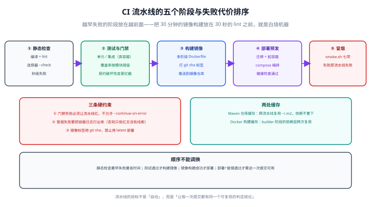

# CI 流水线：把门禁串成一条链

第 3 周与第 4 周陆续立起了四道门禁（覆盖率、契约回归、选择器漂移、用例矩阵基线）。它们目前都要人手动跑——本日的任务是把这四道门禁连同构建、部署、冒烟串成**一条自动流水线**，让每一次提交都得到同一个可复现的判定结论。



## 一句话定位

CI 流水线的目标不是「自动」，而是**让「这次提交能不能用」这件事有唯一答案**。判据一句话：在本地删掉 `target/` 与所有缓存后，流水线仍能独立跑绿。

## 五阶段与失败代价排序

| 阶段 | 内容 | 大致耗时 | 失败时的代价 |
| --- | --- | --- | --- |
| ① 静态检查 | 编译、lint、选择器 `--check`、用例矩阵元测试 | 秒级到 1 分钟 | 最低：立刻知道，不烧机器 |
| ② 测试与门禁 | 单元 + 集成（真实容器）、JaCoCo 阈值、契约破坏性变更 | 3~10 分钟 | 中：拦住问题进入构建 |
| ③ 构建镜像 | 多阶段 Dockerfile，打 `git sha` 标签，推送仓库 | 2~5 分钟 | 较高：镜像白构建 |
| ④ 部署预发 | 迁移 + compose 起服务 + 健康检查 | 2~5 分钟 | 高：占用预发环境 |
| ⑤ 冒烟 | `scripts/smoke.sh` 七项断言 | 10~30 秒 | 最高：说明这次提交不可用 |

::: tip 顺序原则：越早失败的放越前面
把 30 秒的 lint 放在 5 分钟的镜像构建之后，等于每次代码风格错误都白烧一次构建机。**按「失败代价」而不是「逻辑顺序」排阶段**，是流水线提速最省力的一招。
:::

## 三条硬约束

1. **门禁失败必须让流水线红。** 不允许 `continue-on-error`、不允许「警告但通过」。一旦允许，门禁会在两周内退化成装饰。
2. **冒烟失败要打出容器日志。** 只给一个红叉，等于把排障成本全部转给下一个看日志的人。
3. **镜像标签用 `git sha`，禁止用 `latest` 部署。** `latest` 无法回答「线上跑的是哪一次提交」，也就无法回滚到确定版本。本流水线在构建阶段**也不推** `latest`（三道口子：不生成、不推送、不引用），完整的标签分层与供应链校验见 [镜像推送与发布策略](../Release/index.md)。

## 工作流文件

```yaml [.github/workflows/ci.yml]
name: backend-template CI

on:
  push:
    branches: [main]
    paths: ["backend-template/**", ".github/workflows/ci.yml"]
  pull_request:
    branches: [main]

# 同一分支的新提交取消上一次仍在跑的流水线，避免排队
concurrency:
  group: ci-${{ github.ref }}
  cancel-in-progress: true

env:
  APP_DIR: backend-template
  IMAGE: ghcr.io/${{ github.repository }}/backend-template

jobs:
  # ---------- ① 静态检查：最快给出反馈 ----------
  static-checks:
    runs-on: ubuntu-latest
    steps:
      - uses: actions/checkout@v6          # 与本仓库既有工作流保持一致

      - name: Setup JDK 25
        uses: actions/setup-java@v5          # 版本以官方 marketplace 当前主版本为准
        with:
          distribution: temurin
          java-version: "25"
          cache: maven

      - name: Compile
        working-directory: ${{ env.APP_DIR }}
        run: mvn -B -q -DskipTests clean compile

      - name: 选择器漂移检查（第 76 天立的门禁）
        working-directory: ${{ env.APP_DIR }}
        run: python3 stack-select/stack-select.py --root . --check

      - name: 选择器自测（57 项断言）
        working-directory: ${{ env.APP_DIR }}
        run: python3 stack-select/selftest.py

      - name: 用例矩阵元测试（第 77 天立的门禁：用例数只增不减）
        working-directory: ${{ env.APP_DIR }}
        run: mvn -B -q test -Dtest=CaseMatrixMetaTest

  # ---------- ② 测试与门禁 ----------
  tests:
    needs: static-checks
    runs-on: ubuntu-latest
    steps:
      - uses: actions/checkout@v6
      - uses: actions/setup-java@v5
        with:
          distribution: temurin
          java-version: "25"
          cache: maven

      # 预热测试容器镜像：Testcontainers 每次拉取会吃掉 10~20 秒
      - name: Pre-pull test containers
        run: |
          docker pull mysql:8.4
          docker pull redis:8

      - name: 单元 + 集成测试 + JaCoCo 门禁（第 74 天）
        working-directory: ${{ env.APP_DIR }}
        run: mvn -B clean verify

      - name: 契约破坏性变更拦截（第 74 天）
        working-directory: ${{ env.APP_DIR }}
        run: |
          java -jar template-application/target/template-application-*.jar \
            --spring.profiles.active=contract-export &
          sleep 20
          curl -fsS http://127.0.0.1:8080/v3/api-docs > /tmp/openapi.new.json
          docker run --rm -v /tmp:/tmp tufin/oasdiff \
            breaking docs/api/openapi.baseline.yaml /tmp/openapi.new.json

      - name: 上传测试报告（失败时用于定位）
        if: always()
        uses: actions/upload-artifact@v4
        with:
          name: surefire-reports
          path: ${{ env.APP_DIR }}/**/target/surefire-reports/*

  # ---------- ③ 构建并推送镜像 ----------
  build-image:
    needs: tests
    if: github.event_name == 'push'
    runs-on: ubuntu-latest
    permissions:
      contents: read
      packages: write
    steps:
      - uses: actions/checkout@v6

      - uses: docker/setup-buildx-action@v3

      - name: Login to registry
        uses: docker/login-action@v3
        with:
          registry: ghcr.io
          username: ${{ github.actor }}
          password: ${{ secrets.GITHUB_TOKEN }}

      - name: Build and push（标签 = git sha）
        uses: docker/build-push-action@v6
        with:
          context: ${{ env.APP_DIR }}
          file: ${{ env.APP_DIR }}/docker/Dockerfile
          push: true
          # 只推身份标签（git sha）。
          # 不推 latest —— 它在语义上等于「最后被推上来的那个」，任何一次误推都会静默改写它。
          # 也不在这里推版本号 —— 「第几个发布」是发布决策而不是构建产物，由发布环节单独打。
          # 详见 [镜像推送与发布策略](../Release/index.md)
          tags: ${{ env.IMAGE }}:${{ github.sha }}
          # 附带构建来源证明与 SBOM，供部署前 `cosign verify` 使用
          provenance: true
          sbom: true
          cache-from: type=gha            # GitHub Actions 构建缓存
          cache-to: type=gha,mode=max

  # ---------- ④ 部署预发 + ⑤ 冒烟 ----------
  smoke:
    needs: build-image
    runs-on: ubuntu-latest
    environment: staging
    steps:
      - uses: actions/checkout@v6

      - name: Start stack (compose)
        working-directory: ${{ env.APP_DIR }}
        env:
          APP_TAG: ${{ github.sha }}
          DB_PASSWORD: ${{ secrets.STAGING_DB_PASSWORD }}
          REDIS_PASSWORD: ${{ secrets.STAGING_REDIS_PASSWORD }}
          JWT_SECRET: ${{ secrets.STAGING_JWT_SECRET }}
        run: |
          cp .env.example .env
          docker compose -f docker/compose.yaml up -d --build

      - name: 等待健康
        run: |
          for i in $(seq 1 60); do
            curl -fsS http://127.0.0.1:8080/actuator/health | grep -q '"status":"UP"' && break
            [ "$i" -eq 60 ] && { echo "健康检查超时"; exit 1; }
            sleep 2
          done

      - name: 冒烟（第 78 天立的门禁）
        working-directory: ${{ env.APP_DIR }}
        env:
          SMOKE_USER: ${{ secrets.SMOKE_USER }}
          SMOKE_PASS: ${{ secrets.SMOKE_PASS }}
        run: bash scripts/smoke.sh

      - name: 失败时输出容器日志
        if: failure()
        working-directory: ${{ env.APP_DIR }}
        run: docker compose -f docker/compose.yaml logs --tail 200 app
```

## 两处缓存

```yaml
# ① Maven 本地仓库：跨流水线复用，依赖不重下
- uses: actions/setup-java@v5
  with:
    cache: maven            # 等价于缓存 ~/.m2/repository，按 pom 哈希做键

# ② Docker 构建缓存：builder 阶段的依赖层跨次复用
- uses: docker/build-push-action@v6
  with:
    cache-from: type=gha
    cache-to: type=gha,mode=max
```

| 缓存 | 命中后的收益 | 失效条件 |
| --- | --- | --- |
| Maven 仓库 | 首次十几分钟 → 后续 1~2 分钟 | `pom.xml` 变更（这是对的：依赖变了就该重下） |
| Docker 构建缓存 | 镜像构建 2~5 分钟 → 30 秒级 | `Dockerfile` 或依赖层 pom 变更 |

::: warning 缓存省的是时间，不是正确性
缓存命中时更要警惕「本地能过、干净环境过不了」：定期（比如每周）跑一次**禁用缓存的完整流水线**，或用 `mvn -U` 强制更新依赖，确认在没有缓存的情况下也能跑绿。这一步不做，缓存就成了掩盖问题的工具。
:::

## 与既有门禁的对应关系

流水线不是新立门禁，而是把第 74~78 天的四道门禁挂上去：

| 门禁 | 来自 | 挂在哪个阶段 | 失败信号 |
| --- | --- | --- | --- |
| JaCoCo 按模块覆盖率阈值 | 第 74 天 | `tests`（`mvn verify` 内） | `Rule violated for bundle` |
| OpenAPI 契约破坏性变更 | 第 74 天 | `tests` | `oasdiff breaking` 非 0 退出码 |
| 选择器 `--check` 漂移 | 第 76 天 | `static-checks` | 输出漂移详情、退出码非 0 |
| 用例矩阵基线（只增不减） | 第 77 天 | `static-checks` | 元测试断言失败 |
| 部署后冒烟 7 项 | 第 78 天 | `smoke` | `冒烟：通过 X 项，失败 Y 项` |

## 分支保护与必需检查

在仓库设置里把 `main` 设为受保护分支，并要求以下检查通过才能合并：

```text
必需检查（Required status checks）：
  □ static-checks
  □ tests
禁止：
  □ 直接向 main 推送
  □ 自审自合并（至少 1 人评审）
```

::: tip 为什么必需检查要写具体 job 名
保护规则匹配的是 job 名。名字改了而规则没改，会出现「明明有检查，却什么都不拦」的情况——合并按钮亮着，但没人真正验过。
:::

## 时长预算与优化顺序

| 阶段 | 初始耗时 | 优化后 | 优化手段 |
| --- | --- | --- | --- |
| 静态检查 | 2 分钟 | 40 秒 | 只编译不打包；跳过测试；Maven 缓存 |
| 测试与门禁 | 8 分钟 | 3 分钟 | 容器镜像预热；单元与集成分离并行；Testcontainers 复用 |
| 构建镜像 | 5 分钟 | 40 秒 | 多阶段 + 依赖层缓存 + buildx GHA 缓存 |
| 部署 + 冒烟 | 4 分钟 | 1.5 分钟 | 预拉镜像；健康检查用短轮询间隔 |

优化顺序的原则：**先做「减少重复下载」和「提前失败」，再做「并行化」。** 前两项收益大且无副作用；并行化会让日志难读、资源竞争，留到后面。

## 常见坑

::: danger 六个会让流水线不可信的写法
1. **`continue-on-error: true` 兜住门禁**：等于宣布这道门禁不生效，两周后没人再关注它。
2. **测试与集成测试混在一起跑**：单元测试本可 30 秒给出反馈，被集成测试拖到 5 分钟，团队就开始等而不是看。
3. **冒烟失败不输出日志**：红叉没有线索，排障从零开始。
4. **用 `latest` 部署**：无法回答「线上是哪次提交」，回滚也无从下手。
5. **密钥写在工作流文件里**：工作流是公开可见的（尤其在公共仓库），必须走 Secrets。
6. **CI 与本地命令不一致**：本地 `mvn verify`、CI 跑 `mvn test` 加另一套参数，导致「本地绿 CI 红」。**CI 执行的命令要与文档里写的一致**。
:::

## 验证方式

```shell
# ① 本地先跑一遍与 CI 相同的命令（保证一致）
cd backend-template
mvn -B clean verify
python3 stack-select/stack-select.py --root . --check
python3 stack-select/selftest.py

# ② 触发流水线并观察各阶段
gh workflow run ci.yml
gh run watch

# ③ 确认镜像标签是 git sha（不是 latest）
docker pull ghcr.io/<owner>/<repo>/backend-template:$(git rev-parse HEAD)

# ④ 故意制造一次失败，确认门禁真的会红（这是最重要的一次验证）
#    例：把某条测试断言改成必然失败，推送到测试分支，确认流水线红
```

第 ④ 步常被跳过，但它是唯一能证明「门禁有效」的方式。**没有被验证过的门禁，和没有门禁的区别只在于心理安慰。**

| 检查项 | 期望 | 实测 | 结论 |
| --- | --- | --- | --- |
| `static-checks` | 40 秒~2 分钟通过 | 待填写 | ⏳ |
| `tests`（含 JaCoCo 与契约门禁） | 通过 | 待填写 | ⏳ |
| `build-image` | 推送带 git sha 标签的镜像 | 待填写 | ⏳ |
| `smoke` | 7 项全过 | 待填写 | ⏳ |
| 全流水线时长 | ≤ 10 分钟 | 待填写 | ⏳ |
| 故意失败验证 | 流水线变红且给出可定位信息 | 待填写 | ⏳ |
| 禁用缓存重跑 | 仍能跑绿 | 待填写 | ⏳ |

::: info 关于本文的验证环境
本页工作流按 GitHub Actions 语法编写，与本仓库既有 `deploy.yml` 的 action 主版本对齐（`actions/checkout@v6`）。`actions/setup-java`、`docker/*` 等 action 的主版本会持续演进，**请以官方 marketplace 当前主版本为准**。当前编写环境无 CI runner，未实际触发流水线，请按上表在仓库中执行后填写实测列。
:::

## 遇到的问题与决策

| 问题 | 决策 | 原因 |
| --- | --- | --- |
| 门禁失败时是否允许「警告通过」 | **不允许** | 允许一次就会形成惯例，门禁退化成装饰 |
| 用 `latest` 还是 `git sha` 部署 | **`git sha`**，且构建阶段也**不推** `latest` | 必须能回答「线上是哪次提交」才能回滚；`latest` 会被任何一次误推静默改写 |
| 版本号在构建阶段打还是发布阶段打 | **发布阶段** | 「第几个发布」是人的决策而不是构建副产物；构建阶段只产出身份（[发布策略](../Release/index.md)） |
| 镜像构建放在测试前还是后 | **后** | 测试不过就不该烧构建时间与仓库存储 |
| 集成测试放同一 job 还是拆开 | **拆分单元与集成** | 单元测试要快速反馈，不能被容器启动拖慢 |
| 是否用矩阵跑多 JDK 版本 | **暂不** | 模板只承诺 JDK 25；引入矩阵会让时长翻倍而收益有限 |
| 缓存策略 | **Maven 仓库 + Docker GHA 缓存** | 两处是耗时大头；每周一次无缓存跑校验缓存没有掩盖问题 |
| 冒烟放在预发还是只做本地 | **预发环境跑** | 只有预发能同时验证「迁移 + 编排 + 应用」三者一起正确 |
| 契约基线在哪里更新 | **人工确认后更新并提交** | 破坏性变更属于需要决策的变更，不应自动跟随 |

## 下一步（第 80 天）

第 4 周第三步：**镜像仓库与发布策略**。

1. 语义化标签（`1.0.0`、`1.0`）与 `git sha` 的关系：什么时候打哪种标签、如何保证不可变。
2. 镜像保留策略（保留最近 N 个 tag）与回滚时的取用路径。
3. 发布审批门禁：把 `environment: production` 的审批人、观察窗口与回滚决策人写进流程。
4. 备份与恢复演练脚本：数据库备份 + 恢复 + 校验数据一致性的三步命令。

待办承接：模板 CLI 的 `--check` 需与「用例矩阵基线值」做交叉校验（第 77 天记入），本日已把两者放进同一 job（`static-checks`），等 CLI MVP 落地后在此处补交叉断言。

## 参考资料

- [GitHub Actions 官方文档](https://docs.github.com/zh/actions)
- [actions/setup-java（Maven 缓存）](https://github.com/actions/setup-java)
- [docker/build-push-action（GHA 缓存）](https://github.com/docker/build-push-action)
- [oasdiff：OpenAPI 差异与破坏性变更检查](https://github.com/Tufin/oasdiff)
- [JaCoCo：覆盖率门禁规则](https://www.jacoco.org/jacoco/trunk/doc/check-mojo.html)
- 项目相关页：[容器化：多阶段镜像与 Compose 编排](../Deployment/index.md) ｜ [压测与性能基线](../PerformanceTest/index.md) ｜ [异常路径联调收口](../ErrorPath/index.md)
