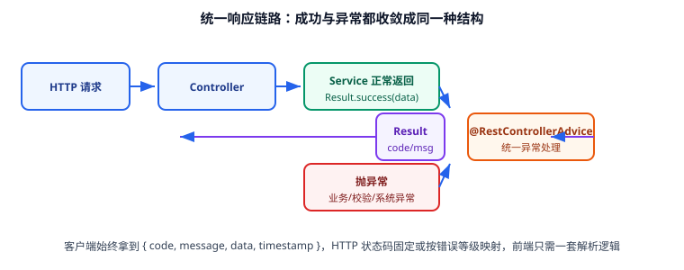

# 统一响应与全局异常（第 69 天 · 步骤 ②③）

同一套接口，如果每个 Controller 各写各的返回结构，前端就要写 N 套解析逻辑。本页交付**统一响应结构 + 错误码体系 + 全局异常处理**三件套，这是模板里最容易被复制到其他项目的一块。



## 统一响应结构

```java [template-common/src/main/java/com/example/template/common/result/Result.java]
package com.example.template.common.result;

import com.fasterxml.jackson.annotation.JsonInclude;

/**
 * 统一响应体：所有 HTTP 接口都返回这个结构。
 * code=0 表示成功，非 0 见 ErrorCode。
 */
@JsonInclude(JsonInclude.Include.NON_NULL)
public record Result<T>(
        int code,
        String message,
        T data,
        long timestamp,
        String traceId
) {

    public static <T> Result<T> success(T data) {
        return new Result<>(0, "success", data, System.currentTimeMillis(), TraceIdHolder.get());
    }

    public static Result<Void> success() {
        return success(null);
    }

    public static <T> Result<T> failure(ErrorCode errorCode) {
        return new Result<>(errorCode.getCode(), errorCode.getMessage(),
                null, System.currentTimeMillis(), TraceIdHolder.get());
    }

    public static <T> Result<T> failure(int code, String message) {
        return new Result<>(code, message, null, System.currentTimeMillis(), TraceIdHolder.get());
    }
}
```

::: tip 为什么用 `record` 而不是 Lombok 类
`record` 是不可变的，天然适配"一次构造、不再修改"的响应对象，也不需要 Lombok 注解处理器（少一个构建期依赖）。若团队需要用传统 JavaBean（如某些序列化框架要求），把它改回 `@Data` 类即可，对外契约不变。
:::

::: warning `traceId` 字段先占位
第 69 天还没有接入请求追踪，`TraceIdHolder.get()` 暂时返回 `null`（第 70 天接入 MDC 后自动有值）。**先定契约后实现**，可以避免前端集成时二次改字段。

先给出占位实现，保证代码可编译：

```java [template-common/src/main/java/com/example/template/common/result/TraceIdHolder.java]
package com.example.template.common.result;

import org.slf4j.MDC;

/** 追踪 ID 持有者：第 69 天先读 MDC（未接入时返回 null），第 70 天在过滤器里写入 MDC。 */
public final class TraceIdHolder {

    public static final String MDC_KEY = "traceId";

    private TraceIdHolder() {
    }

    public static String get() {
        return MDC.get(MDC_KEY);
    }

    public static void set(String traceId) {
        MDC.put(MDC_KEY, traceId);
    }

    public static void clear() {
        MDC.remove(MDC_KEY);
    }
}
```
:::

## 错误码体系

```java [template-common/src/main/java/com/example/template/common/result/ErrorCode.java]
package com.example.template.common.result;

import org.springframework.http.HttpStatus;

/**
 * 错误码规范：0 成功；1xxxx 通用；2xxxx 业务；5xxxx 系统。
 * 每个错误码绑定一个 HTTP 状态码，便于网关与前端统一处理。
 */
public enum ErrorCode {

    SUCCESS(0, "success", HttpStatus.OK),

    // 通用错误
    PARAM_INVALID(10400, "参数校验失败", HttpStatus.BAD_REQUEST),
    UNAUTHORIZED(10401, "未认证或登录已过期", HttpStatus.UNAUTHORIZED),
    FORBIDDEN(10403, "没有访问权限", HttpStatus.FORBIDDEN),
    NOT_FOUND(10404, "资源不存在", HttpStatus.NOT_FOUND),
    METHOD_NOT_ALLOWED(10405, "请求方法不支持", HttpStatus.METHOD_NOT_ALLOWED),

    // 业务错误
    USERNAME_EXISTS(20001, "用户名已存在", HttpStatus.CONFLICT),

    // 系统错误
    DB_ERROR(50001, "数据库操作失败", HttpStatus.INTERNAL_SERVER_ERROR),
    SYSTEM_ERROR(50000, "系统繁忙，请稍后再试", HttpStatus.INTERNAL_SERVER_ERROR);

    private final int code;
    private final String message;
    private final HttpStatus httpStatus;

    ErrorCode(int code, String message, HttpStatus httpStatus) {
        this.code = code;
        this.message = message;
        this.httpStatus = httpStatus;
    }

    public int getCode() { return code; }
    public String getMessage() { return message; }
    public HttpStatus getHttpStatus() { return httpStatus; }
}
```

| 约定 | 说明 |
| --- | --- |
| `code` 是业务码，不是 HTTP 状态码 | 前端判断成功只看 `code == 0` |
| HTTP 状态码按语义映射 | 参数错误 400、未认证 401、无权限 403、系统异常 500 |
| 错误信息面向调用方 | 不返回堆栈、SQL、类名等内部细节（细节进日志） |
| 业务码按业务域分段 | 便于快速定位模块（2xxxx 属业务，5xxxx 属系统） |

## 业务异常

```java [template-common/src/main/java/com/example/template/common/exception/BizException.java]
package com.example.template.common.exception;

import com.example.template.common.result.ErrorCode;

/** 业务异常：由业务代码主动抛出，必须携带 ErrorCode。 */
public class BizException extends RuntimeException {

    private final ErrorCode errorCode;

    public BizException(ErrorCode errorCode) {
        super(errorCode.getMessage());
        this.errorCode = errorCode;
    }

    public BizException(ErrorCode errorCode, String detail) {
        super(detail);
        this.errorCode = errorCode;
    }

    public ErrorCode getErrorCode() {
        return errorCode;
    }
}
```

## 全局异常处理

```java [template-web/src/main/java/com/example/template/web/advice/GlobalExceptionHandler.java]
package com.example.template.web.advice;

import com.example.template.common.exception.BizException;
import com.example.template.common.result.ErrorCode;
import com.example.template.common.result.Result;
import jakarta.validation.ConstraintViolationException;
import org.slf4j.Logger;
import org.slf4j.LoggerFactory;
import org.springframework.http.ResponseEntity;
import org.springframework.validation.FieldError;
import org.springframework.web.bind.MethodArgumentNotValidException;
import org.springframework.web.bind.annotation.ExceptionHandler;
import org.springframework.web.bind.annotation.RestControllerAdvice;

import java.util.stream.Collectors;

/** 全局异常处理：把各类异常统一收敛为 Result 结构。 */
@RestControllerAdvice
public class GlobalExceptionHandler {

    private static final Logger log = LoggerFactory.getLogger(GlobalExceptionHandler.class);

    /** 业务异常：按错误码自带的 HTTP 状态返回。 */
    @ExceptionHandler(BizException.class)
    public ResponseEntity<Result<Void>> handleBiz(BizException ex) {
        log.warn("业务异常 code={} msg={}", ex.getErrorCode().getCode(), ex.getMessage());
        return ResponseEntity.status(ex.getErrorCode().getHttpStatus())
                .body(Result.failure(ex.getErrorCode().getCode(), ex.getMessage()));
    }

    /** @RequestBody 上的 Bean Validation 校验失败。 */
    @ExceptionHandler(MethodArgumentNotValidException.class)
    public ResponseEntity<Result<Void>> handleValidation(MethodArgumentNotValidException ex) {
        String detail = ex.getBindingResult().getFieldErrors().stream()
                .map(f -> f.getField() + ": " + f.getDefaultMessage())
                .collect(Collectors.joining("; "));
        log.warn("参数校验失败 {}", detail);
        return ResponseEntity.status(ErrorCode.PARAM_INVALID.getHttpStatus())
                .body(Result.failure(ErrorCode.PARAM_INVALID.getCode(), detail));
    }

    /** 方法参数上的约束校验失败（如 @RequestParam @Min）。 */
    @ExceptionHandler(ConstraintViolationException.class)
    public ResponseEntity<Result<Void>> handleConstraint(ConstraintViolationException ex) {
        log.warn("参数约束失败 {}", ex.getMessage());
        return ResponseEntity.status(ErrorCode.PARAM_INVALID.getHttpStatus())
                .body(Result.failure(ErrorCode.PARAM_INVALID.getCode(), ex.getMessage()));
    }

    /** 兜底：未预期异常只回统一提示，细节写日志。 */
    @ExceptionHandler(Exception.class)
    public ResponseEntity<Result<Void>> handleUnknown(Exception ex) {
        log.error("系统异常", ex);
        return ResponseEntity.status(ErrorCode.SYSTEM_ERROR.getHttpStatus())
                .body(Result.failure(ErrorCode.SYSTEM_ERROR));
    }
}
```

::: danger 全局异常处理的四个坑
1. **把 `Exception` 的 `message` 直接返回给前端**：会泄露类名、SQL 片段甚至表结构。兜底分支必须返回固定文案，细节写日志。
2. **捕获 `Exception` 却吞掉不记录**：线上问题无法定位。每个分支至少 `log.warn`，兜底分支用 `log.error` 带堆栈。
3. **异常处理返回 200 HTTP 状态**：网关、监控、前端拦截器都依赖状态码判断，必须按错误等级映射（401 就是 401）。
4. **`@RestControllerAdvice` 放在错误模块**：它属于 Web 层逻辑，必须放在能扫到 `@RestController` 的模块（这里是 `template-web`），否则不生效。
:::

## 演示接口

```java [template-web/src/main/java/com/example/template/web/controller/DemoController.java]
package com.example.template.web.controller;

import com.example.template.common.exception.BizException;
import com.example.template.common.result.ErrorCode;
import com.example.template.common.result.Result;
import org.springframework.web.bind.annotation.GetMapping;
import org.springframework.web.bind.annotation.RequestMapping;
import org.springframework.web.bind.annotation.RequestParam;
import org.springframework.web.bind.annotation.RestController;

@RestController
@RequestMapping("/api")
public class DemoController {

    /** 演示：成功响应。 */
    @GetMapping("/ping")
    public Result<String> ping() {
        return Result.success("pong");
    }

    /** 演示：业务异常被统一处理（此处故意抛出用户名已存在）。 */
    @GetMapping("/biz-error")
    public Result<Void> bizError() {
        throw new BizException(ErrorCode.USERNAME_EXISTS, "用户名 alice 已存在");
    }

    /** 演示：系统异常被兜底处理（除数为 0）。 */
    @GetMapping("/boom")
    public Result<Integer> boom(@RequestParam(defaultValue = "0") int divisor) {
        return Result.success(100 / divisor);
    }
}
```

## 验证方式

```shell
# 1. 成功响应：code=0
curl -s http://localhost:8080/api/ping
# {"code":0,"message":"success","data":"pong","timestamp":1790000000000}

# 2. 业务异常：HTTP 409 + code=20001
curl -i -s http://localhost:8080/api/biz-error
# HTTP/1.1 409
# {"code":20001,"message":"用户名 alice 已存在","timestamp":1790000000000}

# 3. 系统异常：HTTP 500 + code=50000，且不暴露堆栈
curl -i -s "http://localhost:8080/api/boom?divisor=0"
# HTTP/1.1 500
# {"code":50000,"message":"系统繁忙，请稍后再试","timestamp":1790000000000}

# 4. 日志里必须有堆栈（响应不暴露、日志要留痕）
grep -A3 "系统异常" logs/app.log
```

收尾确认：三种场景的 HTTP 状态码与业务码符合错误码表、响应体结构一致、堆栈只出现在日志中。

## 下一步

第 70 天在这套结构上补齐：**TraceId 注入**（让 `Result.traceId` 有值、日志里能按请求串联）、**参数校验分组与自定义注解**、**MockMvc 集成测试**（把上面四条 curl 验证变成自动化测试，纳入 CI）。

## 参考资料

- Spring 官方文档：[Exception Handling](https://docs.spring.io/spring-framework/reference/web/webmvc/mvc-controller/ann-exceptionhandler.html)
- Spring 官方文档：[Validation](https://docs.spring.io/spring-boot/reference/io/validation.html)
- 相关文档：[骨架与目录结构](../Skeleton/index.md) / [健康检查与配置](../HealthCheck/index.md)
