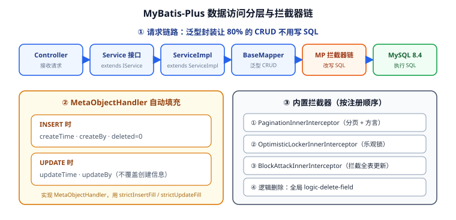

# 数据访问：MyBatis-Plus 接入

本页是**第 71 天**的核心编码产物：给模板接入数据访问层——MyBatis-Plus 分页插件、`BaseEntity` + `MetaObjectHandler` 统一字段填充、逻辑删除、乐观锁与数据层集成测试。目标是让新业务项目"建一张表、写一个继承 `BaseMapper` 的接口，就白拿一套 CRUD + 分页 + 审计字段"。



## 1. 为什么用 MyBatis-Plus 而不是 JPA

| 维度 | MyBatis | MyBatis-Plus | Spring Data JPA |
| --- | --- | --- | --- |
| SQL 控制力 | 完全手写 | 单表自动、多表手写 | 由框架生成 |
| 单表 CRUD 工作量 | 每个方法都要写 | `BaseMapper` 白送 | 接口声明即得 |
| 复杂查询 | 最灵活 | XML / `@Select` 灵活 | `@Query` / Criteria 较绕 |
| 分页 | 手写 `limit` | 插件自动改写 | `Pageable` 自动 |
| 团队上手成本 | 低 | 低（≈MyBatis） | 需要理解持久化上下文 |
| 适合场景 | 遗留系统、超复杂 SQL | **国内业务型后台主流** | 领域模型驱动、以对象为中心 |

本模板的定位是"业务后台基座"，选 **MyBatis-Plus**：写 SQL 的自由度与 MyBatis 一致，但把 80% 的样板代码（单表增删改查、分页、逻辑删除、审计字段）一次性消掉。

::: tip 一句话理解
MyBatis-Plus 是"MyBatis 的增强包，不是替代品"——**已写好的 Mapper XML 完全不受影响**，只是多了一批开箱即用的方法。
:::

## 2. 依赖与版本基线

`template-data/pom.xml` 只加一个 starter：

```xml
<dependency>
  <groupId>com.baomidou</groupId>
  <artifactId>mybatis-plus-spring-boot4-starter</artifactId>
  <version>3.5.17</version>
</dependency>

<!-- 驱动：运行期由 application 模块按环境提供，测试用 Testcontainers 拉起 -->
<dependency>
  <groupId>com.mysql</groupId>
  <artifactId>mysql-connector-j</artifactId>
  <scope>runtime</scope>
</dependency>
```

| 组件 | 当前版本（2026-09 核对） | 说明 |
| --- | --- | --- |
| `mybatis-plus-spring-boot4-starter` | **3.5.17**（2026-07-08） | Spring Boot 4.x 专用 starter；上一版 3.5.16（2026-01） |
| `mybatis-plus-spring-boot3-starter` | 3.5.17 | 存量 Spring Boot 3.x 项目用这个，**别混用** |
| `org.mybatis:mybatis-spring` | 4.0.0 | Boot4 starter 传递依赖（Boot3 线路为 3.0.5） |
| MySQL | 8.4 LTS | 支持到 2032，模板基线 |

::: warning starter 选错是最常见的启动失败原因
- Spring Boot **4.x** → `mybatis-plus-spring-boot4-starter`
- Spring Boot **3.x** → `mybatis-plus-spring-boot3-starter`
- Spring Boot **2.x** → `mybatis-plus-boot-starter`

用错时典型报错是 `NoClassDefFoundError: org/mybatis/spring/SqlSessionFactoryBean` 或自动配置不生效（`@Mapper` 扫描不到）。
:::

::: info 关于依赖里的 Spring Boot 版本
`mybatis-plus-spring-boot4-starter` 的 POM 里声明的是 Spring Boot 4.0.x 的 `spring-boot-dependencies`，但本模板由 `template-application` 的父 POM 统一用 **Spring Boot 4.1.x** 管理版本，实际解析到 4.1.x，无需额外处理。另外 Maven 仓库会给该 starter 标一个 `CVE-2026-41001`——那是它传递依赖的 Spring Boot Artemis 临时目录问题（影响 < 4.0.6.1），本模板的 4.1.x 已不受影响。
:::

## 3. 数据源与 MyBatis-Plus 配置

`template-application/src/main/resources/application-dev.yml`：

```yaml
spring:
  datasource:
    url: jdbc:mysql://localhost:3306/template?useUnicode=true&characterEncoding=utf8&serverTimezone=Asia/Shanghai&allowPublicKeyRetrieval=true&useSSL=false
    username: ${DB_USER:root}
    password: ${DB_PASSWORD:root}
    driver-class-name: com.mysql.cj.jdbc.Driver
    hikari:
      minimum-idle: 5
      maximum-pool-size: 20
      connection-timeout: 3000
      # 连接存活探测，避免 MySQL 8h 空闲断连导致 "Communications link failure"
      max-lifetime: 1740000
      keepalive-time: 60000

mybatis-plus:
  # XML 位置：classpath* 兼容多模块
  mapper-locations: classpath*:/mapper/**/*.xml
  type-aliases-package: com.example.template.data.entity
  configuration:
    # 下划线转驼峰：create_time -> createTime，省掉一堆 resultMap
    map-underscore-to-camel-case: true
    # 开发期打印 SQL；生产建议关掉或用日志级别控制
    log-impl: org.apache.ibatis.logging.slf4j.Slf4jImpl
  global-config:
    banner: false
    db-config:
      id-type: assign_id          # 雪花 ID，分布式下不依赖自增
      logic-delete-field: deleted # 逻辑删除字段（实体里的属性名）
      logic-delete-value: 1
      logic-not-delete-value: 0
      update-strategy: not_null   # 只更新非 null 字段，避免误清空
```

三条容易忽略但很关键的点：

1. **`update-strategy: not_null`**：默认 `NOT_NULL` 下 `updateById` 只写非空字段，能防"前端漏传字段把列清空"；若业务确实要置空，需用 `UpdateWrapper.set("col", null)` 显式表达。
2. **`id-type: assign_id`**：改用 `AUTO`（自增）会让分库分表与数据迁移变得难受，模板统一雪花 ID。
3. **`mapper-locations` 用 `classpath*:`**：多模块打包后 XML 分散在不同 jar，带星号才能全部扫到。

## 4. 实体基类 `BaseEntity`

把审计字段与逻辑删除字段收敛到一个基类，业务实体只声明业务列：

```java
package com.example.template.data.entity;

import com.baomidou.mybatisplus.annotation.*;
import lombok.Data;

import java.io.Serializable;
import java.time.LocalDateTime;

/**
 * 所有业务实体的基类：统一主键、审计字段与逻辑删除。
 * 不要给它加 @TableName —— 它是抽象的，不映射具体表。
 */
@Data
public abstract class BaseEntity implements Serializable {

    /** 雪花 ID；由 MP 的 IdentifierGenerator 生成，无需手工赋值 */
    @TableId(type = IdType.ASSIGN_ID)
    private Long id;

    /** 插入时自动填充 */
    @TableField(fill = FieldFill.INSERT)
    private LocalDateTime createTime;

    @TableField(fill = FieldFill.INSERT)
    private Long createBy;

    /** 插入与更新时都填充 */
    @TableField(fill = FieldFill.INSERT_UPDATE)
    private LocalDateTime updateTime;

    @TableField(fill = FieldFill.INSERT_UPDATE)
    private Long updateBy;

    /** 逻辑删除：1=已删除，0=正常；查询自动追加 deleted = 0 */
    @TableLogic
    @TableField(select = false)   // 查询结果不返回该列，前端看不到
    private Integer deleted;

    /** 乐观锁版本号，配合 OptimisticLockerInnerInterceptor 使用 */
    @Version
    private Integer version;
}
```

业务实体只需一行继承：

```java
@TableName("t_user")
public class UserDO extends BaseEntity {
    private String username;
    private String mobile;
    private String email;
    /** 密码只存 BCrypt 摘要，永不返回 */
    @TableField(select = false)
    private String password;
}
```

::: warning `@TableField(select = false)` 的副作用
被标记的列不会出现在 `select *` 的结果里，所以用 `LambdaQueryWrapper` 也查不出来。若"登录校验"需要读 `password`，必须显式列查询：

```java
userMapper.selectOne(
    Wrappers.<UserDO>lambdaQuery()
        .select(UserDO::getId, UserDO::getPassword)  // 显式带出被隐藏列
        .eq(UserDO::getUsername, username));
```
:::

## 5. 拦截器链：分页、乐观锁、防全表更新

三者必须**注册在同一个 `MybatisPlusInterceptor` 里，且顺序不能乱**：

```java
package com.example.template.data.config;

import com.baomidou.mybatisplus.annotation.DbType;
import com.baomidou.mybatisplus.extension.plugins.MybatisPlusInterceptor;
import com.baomidou.mybatisplus.extension.plugins.inner.*;
import org.springframework.context.annotation.Bean;
import org.springframework.context.annotation.Configuration;

@Configuration
public class MybatisPlusConfig {

    @Bean
    public MybatisPlusInterceptor mybatisPlusInterceptor() {
        MybatisPlusInterceptor interceptor = new MybatisPlusInterceptor();

        // ① 分页：必须最先注册，否则乐观锁/防攻击插件拿到的是未分页 SQL
        PaginationInnerInterceptor page = new PaginationInnerInterceptor(DbType.MYSQL);
        page.setMaxLimit(500L);          // 单页上限，防止 pageSize=100000 拖垮数据库
        page.setOverflow(false);         // 页码超过总页数时不回到首页，直接返回空
        interceptor.addInnerInterceptor(page);

        // ② 乐观锁：@Version 字段生效
        interceptor.addInnerInterceptor(new OptimisticLockerInnerInterceptor());

        // ③ 防全表更新/删除：拦截没有 where 条件的 update/delete
        interceptor.addInnerInterceptor(new BlockAttackInnerInterceptor());

        return interceptor;
    }
}
```

| 插件 | 作用 | 典型误用 |
| --- | --- | --- |
| `PaginationInnerInterceptor` | 把 `Page` 查询改写成 `LIMIT ?`，并额外跑一次 `count` | 忘记注册 → `page.getTotal()` 恒为 0 |
| `OptimisticLockerInnerInterceptor` | `updateById` 自动加 `WHERE version = ?` 并自增 | 实体没查出来（版本号为 null）→ 乐观锁静默失效 |
| `BlockAttackInnerInterceptor` | 无 where 的 update/delete 直接抛异常 | 有意全表更新被拦（此时应写明确条件） |

::: tip `maxLimit` 是性价比最高的一行配置
它把"前端传 `pageSize=999999`"这类事故挡在数据库之外。配合分页封顶（见第 8 节），单页最大值可控。
:::

## 6. `MetaObjectHandler` 统一字段填充

自动填充的实现类必须被 Spring 扫描到：

```java
package com.example.template.data.handler;

import com.baomidou.mybatisplus.core.handlers.MetaObjectHandler;
import com.example.template.web.context.UserContext;
import org.apache.ibatis.reflection.MetaObject;
import org.springframework.stereotype.Component;

import java.time.LocalDateTime;

@Component
public class AuditMetaObjectHandler implements MetaObjectHandler {

    @Override
    public void insertFill(MetaObject metaObject) {
        LocalDateTime now = LocalDateTime.now();
        Long userId = UserContext.currentUserId();   // 未登录时为 null
        // strictInsertFill：字段已有值时【不覆盖】，比 setFieldValByName 安全
        this.strictInsertFill(metaObject, "createTime", LocalDateTime.class, now);
        this.strictInsertFill(metaObject, "updateTime", LocalDateTime.class, now);
        this.strictInsertFill(metaObject, "createBy", Long.class, userId);
        this.strictInsertFill(metaObject, "updateBy", Long.class, userId);
        this.strictInsertFill(metaObject, "version", Integer.class, 0);
        this.strictInsertFill(metaObject, "deleted", Integer.class, 0);
    }

    @Override
    public void updateFill(MetaObject metaObject) {
        // update 只刷新 updateTime/updateBy，绝不覆盖 createTime/createBy
        this.strictUpdateFill(metaObject, "updateTime", LocalDateTime.class, LocalDateTime.now());
        this.strictUpdateFill(metaObject, "updateBy", Long.class, UserContext.currentUserId());
    }
}
```

::: warning 自动填充只对 MP 的方法生效
`insert()` / `insertBatchSomeColumn()` / `updateById()` / `update(entity, wrapper)` 会走填充；
**自己写在 XML 里的 `INSERT` 不会**——那属于 MyBatis 原生语句，MP 没有插手机。自定义 SQL 需要手工写审计字段。
:::

::: details 为什么用 `strictInsertFill` 而不是 `setFieldValByName`
`setFieldValByName` 无条件覆盖字段值，在"数据迁移/回放"场景会把原始 `createTime` 冲掉。
`strictInsertFill` 只在字段为 null 时填充，保留"带审计字段的导入数据"的原值，是更安全的语义。
:::

## 7. 泛型封装：Mapper 与 Service

`template-data` 提供两个基类，业务模块各写一行：

```java
// 1) Mapper：继承 BaseMapper 即获得 17 个单表方法
public interface UserMapper extends BaseMapper<UserDO> { }

// 2) Service 接口：isXxx/xxx 系列方法
public interface UserService extends IService<UserDO> {
    PageResult<UserVO> pageUsers(UserQuery query);
}

// 3) 实现：继承 ServiceImpl，拿 mapper 与批量操作
@Service
public class UserServiceImpl extends ServiceImpl<UserMapper, UserDO> implements UserService {
    // ...
}
```

`BaseMapper` 开箱方法清单（节选）：

| 方法 | 说明 |
| --- | --- |
| `insert(T)` | 插入并回填雪花 ID |
| `deleteById(Serializable)` | 逻辑删除（有 `@TableLogic` 时） |
| `updateById(T)` | 按主键更新非空字段（+ 乐观锁） |
| `selectById(Serializable)` | 查一条，自动排除 `deleted=1` |
| `selectList(Wrapper)` | 条件查询 |
| `selectPage(IPage, Wrapper)` | 物理分页 |
| `selectCount(Wrapper)` | 计数 |

## 8. 分页统一出参 `PageResult<T>`

`IPage` 直接返回给前端会把 `orders`、`optimizeCountSql` 等内部字段暴露出去，模板统一转成 `PageResult`：

```java
package com.example.template.common.model;

import com.baomidou.mybatisplus.core.metadata.IPage;

import java.util.List;
import java.util.function.Function;

/** 统一分页响应：只暴露前端真正需要的 4 个字段 */
public record PageResult<T>(List<T> records, long total, long pageNum, long pageSize) {

    /** 从 IPage 转换，并把 DO 映射成 VO（避免把 password 等敏感字段带出去） */
    public static <E, V> PageResult<V> of(IPage<E> page, Function<E, V> mapper) {
        List<V> rows = page.getRecords().stream().map(mapper).toList();
        return new PageResult<>(rows, page.getTotal(), page.getCurrent(), page.getSize());
    }
}
```

Service 里的分页查询：

```java
@Override
public PageResult<UserVO> pageUsers(UserQuery query) {
    // 1) 入参封顶：pageSize 最大 100，防爬与防误操作
    long current = Math.max(query.pageNum(), 1);
    long size = Math.min(Math.max(query.pageSize(), 1), 100);

    Page<UserDO> page = new Page<>(current, size);
    LambdaQueryWrapper<UserDO> wrapper = Wrappers.<UserDO>lambdaQuery()
            .like(StringUtils.hasText(query.keyword()), UserDO::getUsername, query.keyword())
            .eq(query.status() != null, UserDO::getStatus, query.status())
            .orderByDesc(UserDO::getCreateTime);

    // 2) selectPage 走分页插件，SQL 被改写成 LIMIT
    Page<UserDO> result = this.page(page, wrapper);
    return PageResult.of(result, UserConverter::toVO);
}
```

::: warning `orderByDesc` 不能省
MySQL 的 `LIMIT` 分页在**没有稳定排序**时，翻页可能出现重复行或漏行（同一条记录在两页都出现）。
分页查询务必带一个唯一性强的排序键，通常 `createTime` 再补 `id`：

```java
.orderByDesc(UserDO::getCreateTime).orderByDesc(UserDO::getId)
```
:::

Controller 侧保持统一响应体（第 69 天已定契约），`data` 直接放分页对象：

```java
@GetMapping("/api/users")
public Result<PageResult<UserVO>> page(UserQuery query) {
    return Result.ok(userService.pageUsers(query));
}
```

## 9. 逻辑删除：为什么不用 `DELETE`

| 方案 | 优点 | 代价 |
| --- | --- | --- |
| 物理删除 `DELETE` | 表小、查询干净 | 误删不可恢复、无法审计 |
| 逻辑删除 `deleted` 标记 | 可恢复、可追溯、外键引用不断裂 | 表膨胀、需唯一索引配合 |

模板全局启用逻辑删除后：

```sql
-- 调用 userMapper.deleteById(1L) 实际执行的是：
UPDATE t_user SET deleted = 1 WHERE id = 1 AND deleted = 0;

-- 所有查询自动追加（无需手写）：
SELECT ... FROM t_user WHERE deleted = 0;
```

::: warning 逻辑删除 + 唯一索引会互相"打架"
`uk_username` 这类唯一索引下，被逻辑删除的用户名仍占用索引位，导致"删了却不能重建同名用户"。
常见解法（三选一）：
1. 唯一索引改为 `(username, deleted)` 联合唯一 —— 但同一用户名最多只能删一次；
2. 删除时把 `username` 改写为 `username_deleted_<id>`，释放原名；
3. 用 `deleted` 存**删除时间戳**（0 表示未删），天然唯一。

模板采用方案 3 的变体：`deleted` 保持 0/1，另建 `deleted_at` 列记录删除时刻，唯一索引建在 `(username, deleted_at)` 上。
:::

## 10. 乐观锁：并发更新的兜底

乐观锁适合"读多写少、冲突概率低"的场景（后台管理系统绝大多数字段都属此类）：

```java
// 1) 查询时必须带出 version
UserDO user = userMapper.selectById(1L);   // version = 3

// 2) 业务改字段
user.setEmail("new@example.com");

// 3) updateById 自动追加 version 条件并自增
int rows = userMapper.updateById(user);
// 实际 SQL：UPDATE t_user SET email=?, version=4, ... WHERE id=1 AND version=3 AND deleted=0
if (rows == 0) {
    throw new BizException(ErrorCode.CONCURRENT_MODIFY);  // 已被他人改过
}
```

::: warning 乐观锁失效的三个典型原因
1. **实体没查过就更新**：`new UserDO().setId(1L)` 这种手工构造的实体 `version` 为 null，插件直接跳过；
2. **用 `update(entity, wrapper)` 而非 `updateById`**：`wrapper` 形式默认不触发乐观锁；
3. **中间层把对象转成了 DTO 再转回来**：转换时丢了 `version`。

结论：**乐观锁要求"查—改—存"走同一个实体对象**，跨层传输时 `version` 必须一并携带。
:::

## 11. 数据层集成测试

数据层测试的价值在于真正跑一遍 SQL——用 **Testcontainers 拉起真实 MySQL**，而不是 H2 这种方言差异巨大的内存库：

```java
@DataMybatisPlusTest          // 模板自定义注解：@MybatisPlusTest + @Import(MybatisPlusConfig.class)
class UserMapperTest {

    @Container
    @ServiceConnection
    static MySQLContainer<?> mysql = new MySQLContainer<>("mysql:8.4")
            .withDatabaseName("template_test");

    @Autowired UserMapper userMapper;

    @Test
    @DisplayName("插入自动填充审计字段，并回填雪花 ID")
    void insert_fillsAuditFields() {
        UserDO user = new UserDO();
        user.setUsername("alice");
        user.setMobile("13800138000");

        userMapper.insert(user);

        assertThat(user.getId()).isNotNull();
        assertThat(user.getCreateTime()).isNotNull();
        assertThat(user.getUpdateTime()).isNotNull();
        assertThat(user.getVersion()).isZero();
    }

    @Test
    @DisplayName("分页插件生效：total 正确且 SQL 带 LIMIT")
    void selectPage_works() {
        for (int i = 0; i < 25; i++) {
            UserDO u = new UserDO();
            u.setUsername("user" + i);
            userMapper.insert(u);
        }
        Page<UserDO> page = userMapper.selectPage(new Page<>(2, 10), null);

        assertThat(page.getTotal()).isEqualTo(25);
        assertThat(page.getRecords()).hasSize(10);
    }

    @Test
    @DisplayName("逻辑删除后查不到，但数据仍在表中")
    void logicDelete_hidesRow() {
        UserDO u = new UserDO();
        u.setUsername("bob");
        userMapper.insert(u);

        userMapper.deleteById(u.getId());

        assertThat(userMapper.selectById(u.getId())).isNull();
    }

    @Test
    @DisplayName("乐观锁：并发更新第二个请求影响行数为 0")
    void optimisticLock_rejectsStaleUpdate() {
        UserDO u = new UserDO();
        u.setUsername("carol");
        userMapper.insert(u);

        UserDO first = userMapper.selectById(u.getId());
        UserDO second = userMapper.selectById(u.getId());   // 拿到同一 version

        first.setEmail("a@x.com");
        assertThat(userMapper.updateById(first)).isEqualTo(1);

        second.setEmail("b@x.com");                          // version 已过期
        assertThat(userMapper.updateById(second)).isZero();
    }
}
```

```shell
# 需要本地有 Docker（Testcontainers 会拉 mysql:8.4 镜像）
mvn -q -pl template-data -am test
# 预期：Tests run: 4, Failures: 0, Errors: 0
```

::: tip 没有 Docker 时的降级方案
把 `@Container` 那段换成 H2 内存库（`jdbc:h2:mem:test;MODE=MySQL`），并去掉 MySQL 特有语法。
H2 **能验证 CRUD 与分页**，但**不能验证乐观锁/逻辑删除的真实 SQL 行为差异**——SQL 方言差异正是数据层最需要提前发现的东西，因此 CI 里应优先用 Testcontainers。
:::

## 12. 数据层建表脚本

`template-application/src/main/resources/db/migration/V1__init_user.sql`：

```sql
CREATE TABLE t_user (
    id          BIGINT       NOT NULL COMMENT '雪花 ID',
    username    VARCHAR(64)  NOT NULL COMMENT '登录名',
    mobile      VARCHAR(20)      NULL COMMENT '手机号',
    email       VARCHAR(128)     NULL COMMENT '邮箱',
    password    VARCHAR(100) NOT NULL COMMENT 'BCrypt 摘要',
    status      TINYINT      NOT NULL DEFAULT 1 COMMENT '1 启用 0 禁用',
    version     INT          NOT NULL DEFAULT 0 COMMENT '乐观锁版本',
    deleted     TINYINT      NOT NULL DEFAULT 0 COMMENT '逻辑删除 1 已删',
    deleted_at  BIGINT       NOT NULL DEFAULT 0 COMMENT '删除时间戳；未删为 0',
    create_time DATETIME     NOT NULL,
    create_by   BIGINT           NULL,
    update_time DATETIME     NOT NULL,
    update_by   BIGINT           NULL,
    PRIMARY KEY (id),
    UNIQUE KEY uk_username_deleted (username, deleted_at),
    KEY idx_create_time (create_time)
) ENGINE = InnoDB DEFAULT CHARSET = utf8mb4 COMMENT = '用户表';
```

::: warning 审计字段不要给数据库默认值
`create_time` 用 `DEFAULT CURRENT_TIMESTAMP` 看似省事，但会让"应用层填充"与"数据库填充"两套时间源并存，
出现时区/精度不一致时极难排查。**模板统一由应用层填充**，DDL 里不加默认值（`NOT NULL` 保证不漏）。
:::

## 13. 常见坑清单

1. **starter 用错**：Boot 4 用了 boot3 starter，自动配置不生效，`@Mapper` 扫描不到 → `NoSuchBeanDefinitionException`。
2. **分页插件没注册**：`selectPage` 返回全量数据且 `total=0`——因为没被改写成 `LIMIT`。
3. **`maxLimit` 不设**：前端传 `pageSize=100000`，一次查询把数据库连接池打满。
4. **分页不排序**：翻页出现重复/漏行，用户投诉"数据对不上"。
5. **`@TableLogic` 加在错误的字段**：写在 `deleted_at` 上但全局配置指向 `deleted`，逻辑删除静默失效。
6. **逻辑删除 + 唯一索引**：删掉的登录名占用索引位，无法重建同名账号（见第 9 节）。
7. **自动填充对 XML 无效**：自定义 `INSERT` 语句里 `create_time` 为空，插入报 `Column 'create_time' cannot be null`。
8. **`update-strategy` 默认值误伤**：想置空字段却发现没生效，需用 `UpdateWrapper.set()` 显式赋值。
9. **乐观锁要求实体带 `version`**：DTO ⇄ DO 转换时漏了 `version`，并发冲突无法被发现。
10. **雪花 ID 在 JS 里精度丢失**：`Long` 超过 `2^53` 时前端 `JSON.parse` 会截断，**必须在序列化层把 Long 转字符串**（见下条）。
11. **`select = false` 的列业务层读不到**：需要时显式 `select(...)` 带出。
12. **多模块下 `mapper-locations` 少了 `classpath*:`**：打包后 XML 只扫到一个模块。

::: tip Long 转 String：一处配置解决前端精度问题
Jackson 3 下全局把 `Long`/`long` 序列化为字符串，避免雪花 ID 在浏览器里"末尾变 0"：

```java
@Configuration
public class JacksonConfig {
    @Bean
    Jackson2ObjectMapperBuilderCustomizer longToString() {
        return builder -> builder
            .serializerByType(Long.class, ToStringSerializer.instance)
            .serializerByType(Long.TYPE, ToStringSerializer.instance);
    }
}
```
改为字符串后前端拿到的 `id` 是 `"1856...913"`，比较/传参都按字符串处理即可。
:::

## 14. 验证方式

本页产出属于"数据访问层"，验证分三层——**先用脚本确认结构，再跑集成测试，最后手工冒烟**：

```shell
cd backend-template

# 1. 结构检查：拦截器与填充器都已注册
grep -rn "PaginationInnerInterceptor\|BlockAttackInnerInterceptor" template-data/src/main/java
grep -rn "MetaObjectHandler" template-data/src/main/java
# 预期：两个拦截器在同一 MybatisPlusInterceptor Bean 内；AuditMetaObjectHandler 带 @Component

# 2. 编译 + 数据层测试（Testcontainers，需 Docker）
mvn -q -pl template-data -am test
# 预期：Tests run: 4, Failures: 0, Errors: 0

# 3. 建表（本地有 MySQL 时）
mysql -uroot -p template < template-application/src/main/resources/db/migration/V1__init_user.sql

# 4. 启动 + 冒烟：插入、分页、逻辑删除、乐观锁
mvn -q -pl template-application -am spring-boot:run &

# 4.1 新增（观察审计字段被自动填充）
curl -s -X POST http://localhost:8080/api/users -H 'Content-Type: application/json' \
  -d '{"username":"alice","mobile":"13800138000","email":"alice@example.com"}' | jq
# 预期：code=0；data.id 为 19 位字符串；data.createTime 非空；data.deleted 字段不出现

# 4.2 分页（验证分页插件与最大页大小封顶）
curl -s "http://localhost:8080/api/users?pageNum=1&pageSize=999999" | jq '.data | {total, pageSize}'
# 预期：pageSize 被夹到 100，total 为真实总数

# 4.3 逻辑删除后查询为空
curl -s -X DELETE http://localhost:8080/api/users/1 | jq .code      # 预期：0
curl -s http://localhost:8080/api/users/1 | jq .code                # 预期：业务不存在错误码
mysql -uroot -p template -e "SELECT id,deleted FROM t_user WHERE id=1"
# 预期：行仍在，deleted=1
```

验证结果记录（**请在本地执行后填写**，当前编写环境无 JDK / Maven / Docker，未实际运行）：

| 检查项 | 期望 | 实测 | 结论 |
| --- | --- | --- | --- |
| starter 正确 | boot4 starter 在 `template-data/pom.xml` | 待填写 | ⏳ |
| 拦截器顺序 | 分页 → 乐观锁 → 防全表更新 | 待填写 | ⏳ |
| `mvn -pl template-data -am test` | 4 个用例全过 | 待填写 | ⏳ |
| 自动填充 | `create_time` / `create_by` 非空 | 待填写 | ⏳ |
| 雪花 ID 回填 | 19 位、序列化为字符串 | 待填写 | ⏳ |
| 分页改写 | SQL 日志出现 `LIMIT`，`total` 正确 | 待填写 | ⏳ |
| 页大小封顶 | `pageSize=999999` 被夹到 100 | 待填写 | ⏳ |
| 逻辑删除 | 查不到但表内 `deleted=1` | 待填写 | ⏳ |
| 乐观锁 | 陈旧 `version` 的更新影响行数为 0 | 待填写 | ⏳ |
| 防全表更新 | 无 where 的 `update` 抛异常 | 待填写 | ⏳ |

## 15. 下一步（第 72 天）

1. **Spring Security 7 + JWT**：接入无状态认证链路，`TraceIdFilter` 之后挂 `JwtAuthenticationFilter`，并补 `UserContext`（今天 `AuditMetaObjectHandler` 已预留调用点）。
2. **权限注解**：`@PreAuthorize` + 自定义 `@HasPerm`，让接口级鉴权可声明。
3. **认证集成测试**：MockMvc 覆盖"无 token → 401、过期 token → 401、越权 → 403、正常 → 200"。

以上三项已在 [认证授权：Spring Security 7 + JWT](../Security/index.md) 中落地，本节的 `AuditMetaObjectHandler` 也已接上 `UserContext`。

## 参考资料

- MyBatis-Plus 官方文档：https://baomidou.com/
- MyBatis-Plus 分页插件：https://baomidou.com/plugins/pagination/
- MyBatis-Plus 自动填充：https://baomidou.com/guides/auto-fill-field/
- 逻辑删除：https://baomidou.com/guides/logic-delete/
- Testcontainers for Java：https://java.testcontainers.org/
- 项目总览：[后端通用模板](../index.md) ｜ 上一节 [MockMvc 集成测试](../IntegrationTest/index.md) ｜ 下一节 [认证授权：Spring Security 7 + JWT](../Security/index.md) ｜ 逐日记录 [进展记录](../Progress/index.md)
