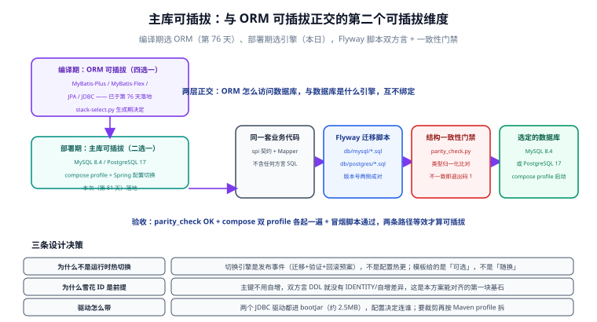

# 主库可插拔：MySQL / PostgreSQL 双方言

**需求来源（2026-09-25，第 81 天）**：模板的主库不再固定 MySQL 8，改为**可选**——同一套业务代码，部署时选择 MySQL 8.4 或 PostgreSQL 17。本页记录设计决策、双方言建表脚本、一致性门禁与验证方式。



## 定位：第二个可插拔维度

第 76 天落地的是**编译期**的可插拔——ORM 四选一（MyBatis-Plus / MyBatis-Flex / JPA / JDBC），由 `stack-select.py` 在生成期决定。本页落地的是**部署期**的可插拔——主库引擎二选一。两层**正交**：

| 维度 | 决定什么 | 何时决定 | 谁负责 |
| --- | --- | --- | --- |
| ORM 可插拔 | 代码怎么访问数据库 | 生成模板时（编译期） | `stack-select.py` |
| 主库可插拔 | 数据库是什么引擎 | 部署时（发布事件） | compose profile + Spring 配置 |

:::warning 为什么不是「运行时热切换」
切换主库引擎是一个**发布事件**（数据迁移 + 双写验证 + 回滚预案），不是改个配置就完事的热更新。模板给的是「可选」，不是「随换」——这正是[完整项目交付](../../../../docs/Others/ProjectDelivery/Delivery/index.md)里「数据结构兼容是回滚前提」的同一件事。
:::

## 设计决策

### ① 雪花 ID 是整个方案的前提

主键不用数据库自增，双方言 DDL 就**没有** `AUTO_INCREMENT` / `GENERATED ALWAYS AS IDENTITY` 的差异——这是两张表的 DDL 能逐列对齐的第一块基石（雪花 ID 方案见[数据访问页](../DataAccess/index.md)）。

### ② 建表脚本双方言双份，Flyway 版本号两侧成对

```text
db/
├─ mysql/
│  ├─ V1__init_user.sql
│  └─ V2__init_login_log.sql
├─ postgres/
│  ├─ V1__init_user.sql
│  └─ V2__init_login_log.sql
├─ docker-compose.databases.yml   # profiles: mysql / postgres
├─ parity_check.py                # 结构一致性门禁
└─ selftest.py                    # 校验器自身的 11 项自测
```

Flyway 社区版同时支持两种引擎，`V1__`/`V2__` 命名两侧一致，应用启动时按当前数据源执行对应目录（Spring 配置 `spring.flyway.locations` 指向 `classpath:db/migration/<dialect>`，或部署期把选定方言目录挂载为 `db/migration`）。

### ③ 结构一致性是门禁，不是约定

双方言脚本最大的风险是**改了一侧忘另一侧**。`parity_check.py` 做机械校验（零第三方依赖）：

- 同名表集合一致；脚本清单（V1/V2）两侧成对；
- 每张表：列名集合一致、**归一化类型**一致、可空性一致、主键/唯一约束/普通索引一致；
- 双方都必须有表注释；
- 任一不一致：列出差异、退出码 1，可直接进 CI。

类型归一化映射：`TINYINT`/`TINYINT(1)` → `smallint`，`INT` → `integer`，`DATETIME(n)` → `timestamp(n)`，其余（`BIGINT`/`VARCHAR(n)`）两侧本来同名。

## 方言翻译规则

| MySQL 8.4 | PostgreSQL 17 | 说明 |
| --- | --- | --- |
| 行内 `COMMENT '...'` | `COMMENT ON TABLE/COLUMN` | PG 不支持行内注释语法 |
| `TINYINT` | `SMALLINT` | PG 无 TINYINT |
| `INT` | `INTEGER` | 同义 |
| `DATETIME` / `DATETIME(3)` | `TIMESTAMP` / `TIMESTAMP(3)` | 精度语义一致 |
| `UNIQUE KEY uk_x (...)` 内联 | `CONSTRAINT uk_x UNIQUE (...)` | PG 约束须命名 |
| `KEY idx_x (...)` 内联 | 表外 `CREATE INDEX idx_x ON ...` | PG 不支持内联索引 |
| `ENGINE=InnoDB DEFAULT CHARSET=utf8mb4` | 删除 | PG 无此概念，编码由库级 `ENCODING` 决定 |

:::tip 注释必须两侧都有
`COMMENT` 在 MySQL 是 DDL 一部分、在 PG 是独立语句——语法不同但**信息必须等价**。一致性门禁会把「缺注释」当差异报出来，防止某一方言的脚本退化成不可读的裸结构。
:::

## 部署期切换

### 数据库侧（docker-compose.databases.yml）

```shell
# 只起 MySQL
docker compose -f db/docker-compose.databases.yml --profile mysql up -d
# 只起 PostgreSQL
docker compose -f db/docker-compose.databases.yml --profile postgres up -d
```

两个 profile 共用 `${DB_PASSWORD:?}`（缺失直接报错而不是给默认值），初始化脚本通过 `/docker-entrypoint-initdb.d` 挂载各自方言目录。

### 应用侧（Spring 配置）

```yaml [application-mysql.yml]
spring:
  datasource:
    url: jdbc:mysql://${DB_HOST:localhost}:3306/template?useUnicode=true&characterEncoding=utf8&serverTimezone=Asia/Shanghai&allowPublicKeyRetrieval=true&useSSL=false
    username: ${DB_USER:root}
    password: ${DB_PASSWORD}
    driver-class-name: com.mysql.cj.jdbc.Driver
```

```yaml [application-postgres.yml]
spring:
  datasource:
    url: jdbc:postgresql://${DB_HOST:localhost}:5432/template
    username: ${DB_USER:postgres}
    password: ${DB_PASSWORD}
    driver-class-name: org.postgresql.Driver
```

```yaml [主库方言对 MyBatis-Plus 分页插件的影响]
mybatis-plus:
  configuration:
    db-type 由配置注入，不从连接推断：
spring:
  # PaginationInnerInterceptor 的 DbType 由下面的配置项决定
app:
  datasource:
    dialect: MYSQL        # 或 POSTGRE_SQL，绑定到拦截器装配代码
```

**驱动策略**：`mysql-connector-j` 与 `postgresql` 两个 JDBC 驱动都进 bootJar（合计约 2.5 MB），部署期由 `spring.profiles.active` 决定连谁，**无需为切换引擎重新构建镜像**；镜像体积敏感的场景再按 Maven profile 裁剪。

:::danger 分页方言不要靠「连接推断」
`PaginationInnerInterceptor` 的 `DbType` 若在启动时依赖数据库连接推断，会把「数据库可用」变成应用启动的前置条件，且连接池初始化顺序会引入隐性耦合。模板约定：**方言由配置项显式注入**，与部署清单（compose profile）保持同一个事实来源。
:::

## 验证方式

```shell
cd db

# ① 校验器自测：11 项断言（解析、归一化、缺列/类型不一致检出）
python selftest.py        # 期望：selftest: 11/11 通过（2026-09-25 实测通过）

# ② 双方言结构一致性（零依赖，不需要 Docker）
python parity_check.py    # 期望：OK: 2 张表 / 22 列 双方言结构一致（实测通过）

# ③ 两条部署路径各起一遍（需 Docker）
DB_PASSWORD=xxx docker compose -f docker-compose.databases.yml --profile mysql up -d
#   等 healthy 后跑 ../scripts/smoke.sh 指向该库；down 后换 --profile postgres 重复
# 期望：两侧冒烟全部通过，行为等效
```

**验收判据**：②③ 全绿。②保证「结构是同一个」，③保证「行为是等效的」——只有②没有③，方言差异（如乐观锁 SQL、时间精度）仍可能漏网。

## 下一步（第 82 天）

- 上线验收与监控接入（原第 81 天计划，因本日按需求插入「主库可插拔」顺延）：六类 18 项验收清单落地、备份恢复演练（本次将按**选定引擎**分别给出 `mysqldump` / `pg_dump` 双版本）、观察窗口与回滚决策人。
- Testcontainers 双库矩阵：数据层集成测试按 `@ParameterizedTest` 对 MySQL/PostgreSQL 各跑一遍（第 75 天的隔离方案直接复用）。

## 参考资料

- [PostgreSQL 17 文档 · CREATE TABLE](https://www.postgresql.org/docs/17/sql-createtable.html)
- [MySQL 8.4 参考手册 · CREATE TABLE](https://dev.mysql.com/doc/refman/8.4/en/create-table.html)
- [Flyway 支持的数据库](https://documentation.red-gate.com/fd/supported-databases-184127578.html)
- 项目内关联：[技术栈可插拔：模块边界与选择器脚本](../StackSelect/index.md)（ORM 维度）｜ [数据访问：MyBatis-Plus 接入](../DataAccess/index.md)（雪花 ID 与建表约定）｜ [容器化：多阶段镜像与 Compose 编排](../Deployment/index.md)（健康检查与启动顺序约定）
