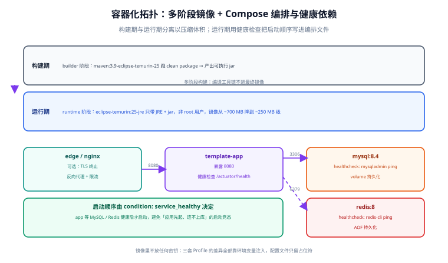

# 容器化：多阶段镜像与 Compose 编排

第 4 周（部署与验收）的第一步是容器化。目标不是「能 build 出镜像」，而是交付一套**本地一条命令起、环境靠变量覆盖、启动顺序不靠 sleep、健康与否可机读**的编排，让「在我机器上能跑」这句话彻底失效。



## 一句话定位

容器化要解决三件事：**镜像里不该有的东西别放**（编译工具链、密钥）、**启动顺序不能靠猜**（健康检查决定依赖）、**环境差异只能靠变量**（一份镜像跑三套环境）。

## 为什么先做这一步

第 77 天为止，模板的验收都是「本地 `mvn verify` 通过」。这有三个缺口：

| 缺口 | 表现 | 容器化怎么补 |
| --- | --- | --- |
| 运行时差异 | 本机 JDK 25、服务器 JDK 21 → 启动即报错 | 镜像内固定 JRE，运行时不再依赖宿主机 |
| 依赖服务差异 | 本机 MySQL 8.0、测试用 8.4 → SQL 行为不一致 | 编排里固定 MySQL 8.4 LTS + Redis 8 |
| 交付物不可信 | 「jar 包 + 一堆配置说明」需要人工拼装 | 一份 `compose.yaml` + 一个 `.env` 就是全部交付 |

时序上，容器化也是后面两件事的前提：CI 流水线要构建镜像，验收清单要在容器环境里跑。

## 第 1 步：多阶段 Dockerfile

```dockerfile [docker/Dockerfile]
# syntax=docker/dockerfile:1.7

# ---------- 构建期：只在这里出现 Maven 与 JDK ----------
FROM maven:3.9-eclipse-temurin-25 AS builder
WORKDIR /build

# 先只拷 pom，让依赖层独立成缓存层：源码改动不会触发重新下载依赖
COPY pom.xml ./
COPY template-common/pom.xml        template-common/
COPY template-spi/pom.xml           template-spi/
COPY template-web/pom.xml           template-web/
COPY template-security-spring/pom.xml      template-security-spring/
COPY template-security-satoken/pom.xml     template-security-satoken/
COPY template-data-jpa/pom.xml             template-data-jpa/
COPY template-data-mybatis/pom.xml         template-data-mybatis/
COPY template-data-mybatis-plus/pom.xml    template-data-mybatis-plus/
COPY template-data-mybatis-flex/pom.xml    template-data-mybatis-flex/
COPY template-cache-redis/pom.xml          template-cache-redis/
COPY template-cache-caffeine/pom.xml       template-cache-caffeine/
COPY template-cache-noop/pom.xml           template-cache-noop/
COPY template-application/pom.xml          template-application/

# 依赖预下载（Maven 本地仓库走缓存挂载，跨构建复用）
RUN --mount=type=cache,target=/root/.m2 \
    mvn -B -q dependency:go-offline -DskipTests || true

COPY . .
RUN --mount=type=cache,target=/root/.m2 \
    mvn -B clean package -DskipTests \
    && cp template-application/target/template-application-*.jar /build/app.jar

# ---------- 运行期：只有 JRE 与 jar ----------
FROM eclipse-temurin:25-jre AS runtime

# 时区与字符集：不设会出现「日志时间差 8 小时」「中文乱码」
ENV TZ=Asia/Shanghai \
    LANG=C.UTF-8

# 非 root 运行：容器逃逸时降低影响面
RUN groupadd -r app && useradd -r -g app -d /app -s /sbin/nologin app

WORKDIR /app
COPY --from=builder --chown=app:app /build/app.jar /app/app.jar
USER app

EXPOSE 8080

# 显式声明挂载点：让「数据写进容器」这件事一眼可见
VOLUME ["/app/logs"]

# 容器感知的堆配置：不用写死 -Xmx，随容器内存上限自适应
ENV JAVA_OPTS="-XX:MaxRAMPercentage=75.0 -XX:+ExitOnOutOfMemoryError -Dfile.encoding=UTF-8"

# 就绪探针走 Actuator（第 69 天已暴露）
HEALTHCHECK --interval=30s --timeout=5s --start-period=40s --retries=3 \
  CMD ["sh", "-c", "wget -qO- http://127.0.0.1:8080/actuator/health | grep -q '\"status\":\"UP\"'"]

ENTRYPOINT ["sh", "-c", "exec java $JAVA_OPTS -jar /app/app.jar"]
```

几个必须讲清的设计点：

| 设计 | 为什么这么做 | 不做会怎样 |
| --- | --- | --- |
| **多阶段构建** | 最终镜像不含 Maven 与 JDK | 镜像 700 MB 级，攻击面大、分发慢 |
| **先拷 pom 再拷源码** | 依赖层可命中缓存 | 改一行代码就重下全部依赖，每次多等几分钟 |
| **`--mount=type=cache` 挂载 `.m2`** | 跨构建复用本地仓库 | 每次构建都从零下载 |
| **非 root 用户** | 降权运行 | 容器内进程拥有 root 权限 |
| **`MaxRAMPercentage`** | 堆随容器内存上限伸缩 | 写死 `-Xmx` 时换机器配置就 OOM 或浪费 |
| **`ExitOnOutOfMemoryError`** | OOM 直接退出，交给编排重启 | JVM 带病运行，看似存活实则所有请求超时 |
| **`ENTRYPOINT` 用 `exec`** | 让 java 成为 PID 1，信号可达 | `docker stop` 会等满超时才强杀，优雅停机失效 |

::: danger 三个容器化高频错误
1. **`.dockerignore` 不写**：`target/`、`.git/`、`.env` 全被送进构建上下文。既拖慢构建，又可能把密钥烤进镜像层。必须写：

```text
# docker/.dockerignore
**/target/
.git/
.idea/
*.iml
.env
*.log
node_modules/
```

2. **拿 `latest` 当基础镜像标签**：今天构建成功、下周重建就变行为。基础镜像必须显式标版本（如 `eclipse-temurin:25-jre`、`mysql:8.4`）。
3. **镜像里塞配置与密钥**：镜像一旦构建完成就无法在不重建的前提下改配置。所有环境差异必须走环境变量（见第 2 步），镜像里只留占位符。
:::

::: info 关于基础镜像标签
Maven 官方镜像的 JDK 变体命名会随上游更新，本文写作时使用 `maven:3.9-eclipse-temurin-25`。**构建前请到 Docker Hub 确认该标签确实存在**；若不存在，退一步用带 JDK 25 的可用标签，或分两个阶段（`eclipse-temurin:25-jdk` 内自行安装 Maven）。运行时镜像 `eclipse-temurin:25-jre` 同理。
:::

### 可选优化：分层 jar

如果镜像层缓存想做得更细，可以让 Spring Boot 把 jar 拆成分层目录，依赖层与业务层分开：

```shell
# 构建期执行，产出 layers 目录
java -Djarmode=tools -jar /build/app.jar extract --layers --destination /build/extracted
```

```dockerfile
# 运行期按「依赖 → 快照 → 应用」的顺序拷贝，改业务代码只让最上层的应用层失效
COPY --from=builder /build/extracted/dependencies/ ./
COPY --from=builder /build/extracted/spring-boot-loader/ ./
COPY --from=builder /build/extracted/snapshot-dependencies/ ./
COPY --from=builder /build/extracted/application/ ./
ENTRYPOINT ["java", "org.springframework.boot.loader.launch.JarLauncher"]
```

::: warning 注意版本差异
`jarmode` 的取值在 Boot 3.3 之后经历过调整（由 `layertools` 演进为 `tools`），`JarLauncher` 的全限定类名也随之变化。**采用分层方案前，请以你所用 Spring Boot 版本的官方文档为准**，先用 `java -Djarmode=tools -jar app.jar --help` 确认支持的命令。
:::

## 第 2 步：配置与镜像分离

三套 Profile（`dev` / `test` / `prod`）的差异**全部通过环境变量注入**，配置文件里只写占位符。

```yaml [template-application/src/main/resources/application.yml]
spring:
  application:
    name: backend-template
  profiles:
    active: ${APP_PROFILE:dev}          # 默认 dev，容器里用环境变量覆盖
  datasource:
    url: jdbc:mysql://${DB_HOST:127.0.0.1}:${DB_PORT:3306}/${DB_NAME:template}?useSSL=false&serverTimezone=Asia/Shanghai&characterEncoding=utf8
    username: ${DB_USERNAME:root}
    password: ${DB_PASSWORD:}           # 容器里必须注入，不许有默认弱口令
    hikari:
      maximum-pool-size: ${DB_POOL_MAX:20}
  data:
    redis:
      host: ${REDIS_HOST:127.0.0.1}
      port: ${REDIS_PORT:6379}
      password: ${REDIS_PASSWORD:}
  security:
    jwt:
      secret: ${JWT_SECRET:}            # 生产必须注入；启动时校验非空
```

```yaml [template-application/src/main/resources/application-prod.yml]
logging:
  level:
    root: info
management:
  endpoints:
    web:
      exposure:
        include: health,info,metrics,prometheus     # 生产只暴露必要端点
  endpoint:
    health:
      show-details: never                            # 不对未授权调用方暴露内部组件名
```

对应地，在配置类里对关键密钥做**启动期校验**——宁可启动失败，也不要以空密钥运行：

```java [config/StartupSecurityCheck.java]
/**
 * 启动期强校验：生产 Profile 下必须显式提供密钥与凭据。
 * 放在 @PostConstruct 里，缺失即抛异常让应用启动失败——比上线后才发现安全漏洞好。
 */
@Component
@Profile("prod")
public class StartupSecurityCheck {

    @Value("${spring.security.jwt.secret:}")
    private String jwtSecret;

    @Value("${spring.datasource.password:}")
    private String dbPassword;

    @PostConstruct
    public void check() {
        List<String> missing = new ArrayList<>();
        if (jwtSecret == null || jwtSecret.length() < 32) {
            missing.add("JWT_SECRET（长度需 ≥ 32）");
        }
        if (dbPassword == null || dbPassword.isBlank()) {
            missing.add("DB_PASSWORD");
        }
        if (!missing.isEmpty()) {
            throw new IllegalStateException("生产环境缺少必要配置：" + String.join("、", missing));
        }
    }
}
```

## 第 3 步：docker-compose 编排

```yaml [docker/compose.yaml]
name: backend-template

services:
  mysql:
    image: mysql:8.4
    command: >
      --character-set-server=utf8mb4
      --collation-server=utf8mb4_0900_ai_ci
      --default-time-zone=+08:00
    environment:
      MYSQL_ROOT_PASSWORD: ${DB_PASSWORD:?DB_PASSWORD 必须设置}
      MYSQL_DATABASE: ${DB_NAME:-template}
    ports:
      - "${DB_EXPOSE_PORT:-3306}:3306"       # 只在需要本机连库时暴露
    volumes:
      - mysql-data:/var/lib/mysql
    healthcheck:
      # 注意：mysqladmin ping 在认证失败时也可能返回 0，因此带上密码并用 --connect-timeout 快速失败
      test: ["CMD-SHELL", "mysqladmin ping -h 127.0.0.1 -uroot -p\"$$MYSQL_ROOT_PASSWORD\" --connect-timeout=3 --silent"]
      interval: 10s
      timeout: 5s
      retries: 10
      start_period: 40s                       # 首次初始化数据目录较慢，给足时间
    networks: [backend]

  redis:
    image: redis:8
    command: >
      redis-server --appendonly yes
      --requirepass ${REDIS_PASSWORD:?REDIS_PASSWORD 必须设置}
    volumes:
      - redis-data:/data
    healthcheck:
      test: ["CMD-SHELL", "redis-cli -a \"$$REDIS_PASSWORD\" --no-auth-warning ping | grep -q PONG"]
      interval: 10s
      timeout: 3s
      retries: 10
    networks: [backend]

  app:
    build:
      context: ..
      dockerfile: docker/Dockerfile
    image: backend-template:${APP_TAG:-1.0.0}
    depends_on:
      # 关键：等健康，而不是等「容器起来了」
      mysql:
        condition: service_healthy
      redis:
        condition: service_healthy
    environment:
      APP_PROFILE: prod
      DB_HOST: mysql
      DB_PORT: 3306
      DB_NAME: ${DB_NAME:-template}
      DB_USERNAME: root
      DB_PASSWORD: ${DB_PASSWORD:?DB_PASSWORD 必须设置}
      REDIS_HOST: redis
      REDIS_PORT: 6379
      REDIS_PASSWORD: ${REDIS_PASSWORD:?REDIS_PASSWORD 必须设置}
      JWT_SECRET: ${JWT_SECRET:?JWT_SECRET 必须设置}
      JAVA_OPTS: "-XX:MaxRAMPercentage=70.0 -XX:+ExitOnOutOfMemoryError"
    ports:
      - "${APP_PORT:-8080}:8080"
    volumes:
      - app-logs:/app/logs
    restart: unless-stopped
    deploy:
      resources:
        limits:
          memory: 1g                            # 与 MaxRAMPercentage 配套：堆约占上限的 70%
    networks: [backend]

volumes:
  mysql-data:
  redis-data:
  app-logs:

networks:
  backend:
    driver: bridge
```

```shell [.env.example —— 入库的是示例，真 .env 不进 Git]
# 复制为 .env 后填写真实值：cp .env.example .env
DB_PASSWORD=change-me-strong-password
REDIS_PASSWORD=change-me-strong-password
JWT_SECRET=change-me-to-a-random-string-at-least-32-chars
APP_PORT=8080
APP_TAG=1.0.0
```

::: danger `depends_on` 的两种写法差别很大
1. **只写 `depends_on: [mysql]`**：只保证「容器已创建」，不保证 MySQL 已经可以接受连接。应用启动快于数据库初始化时会直接连接失败退出。
2. **写 `condition: service_healthy`**：等健康检查通过才启动应用，这才是真正的启动顺序。

即便如此，应用侧仍要保留**连接重试**作为兜底——健康检查存在窗口期，重启场景下也可能撞上数据库短暂不可用。**编排层负责顺序，应用层负责韧性，两者不是二选一。**
:::

::: warning `${VAR:?}` 语法是有意为之
`${DB_PASSWORD:?DB_PASSWORD 必须设置}` 表示「未设置就报错退出」。这比给默认值安全得多——默认值会让编排在缺配置的情况下「成功启动」，跑在一个错误的配置上。
:::

## 第 4 步：部署后冒烟脚本

把第 77 天靠人工执行的 curl 验证提炼成脚本，CI 与上线验收共用同一份。

```bash [scripts/smoke.sh]
#!/usr/bin/env bash
# 部署后冒烟：容器起来之后跑这一份，任何一项失败即退出非 0
set -euo pipefail

BASE="${BASE:-http://127.0.0.1:8080}"
PASS=0
FAIL=0

check() {                       # check <名称> <期望子串> <实际响应>
  local name="$1" expect="$2" body="$3"
  if grep -q "$expect" <<<"$body"; then
    echo "  ✓ $name"; PASS=$((PASS + 1))
  else
    echo "  ✗ $name"; echo "    期望包含：$expect"; echo "    实际响应：$body"; FAIL=$((FAIL + 1))
  fi
}

echo "[1/5] 健康检查"
check "actuator health UP" '"status":"UP"' "$(curl -fsS "$BASE/actuator/health")"

echo "[2/5] 统一响应结构（未认证访问受保护接口）"
body=$(curl -sS -o - -w '\n%{http_code}' "$BASE/api/users/me" || true)
check "401 走统一 Result 出口" '"code":401' "$body"

echo "[3/5] 参数校验：字段级错误明细"
body=$(curl -sS -X POST "$BASE/api/auth/login" -H 'Content-Type: application/json' \
       -d '{"username":"","password":""}' || true)
check "校验失败返回 400 与字段明细" '"code":400' "$body"

echo "[4/5] 登录并拿到双令牌"
body=$(curl -sS -X POST "$BASE/api/auth/login" -H 'Content-Type: application/json' \
       -d "{\"username\":\"${SMOKE_USER:-admin}\",\"password\":\"${SMOKE_PASS:-Admin@12345}\"}" || true)
check "登录成功返回 accessToken" 'accessToken' "$body"
TOKEN=$(sed -n 's/.*"accessToken"[[:space:]]*:[[:space:]]*"\([^"]*\)".*/\1/p' <<<"$body")

echo "[5/5] 带令牌访问受保护接口 + 追踪 ID 透传"
headers=$(curl -sS -D - -o /dev/null "$BASE/api/users/me" -H "Authorization: Bearer ${TOKEN}")
check "受保护接口返回 200" '200' "$headers"
check "响应带 X-Trace-Id" 'X-Trace-Id' "$headers"

echo
echo "冒烟结果：通过 ${PASS} 项，失败 ${FAIL} 项"
[ "$FAIL" -eq 0 ] || exit 1
```

::: tip 为什么用 `grep` 而不是 `jq`
验收环境不一定装 `jq`。用 `grep` 判断子串虽然粗糙，但**零依赖**这一优点在「一台干净的验收机器」上价值更大。要在 CI 里做更严格的结构化断言，再引入 `jq` 或直接写一个 Java/Python 校验脚本。
:::

## 第 5 步：一键脚本

```bash [scripts/deploy.sh]
#!/usr/bin/env bash
# 一键部署：up 起服务 → 等待健康 → 跑冒烟
set -euo pipefail
cd "$(dirname "$0")/.."

case "${1:-up}" in
  up)
    [ -f .env ] || { echo "缺少 .env，请先 cp .env.example .env 并填写"; exit 1; }
    docker compose -f docker/compose.yaml up -d --build
    echo "等待应用健康…"
    for i in $(seq 1 60); do
      if curl -fsS http://127.0.0.1:8080/actuator/health | grep -q '"status":"UP"'; then
        echo "应用已就绪（第 ${i} 次探测）"; break
      fi
      [ "$i" -eq 60 ] && { echo "超时未就绪，输出最近日志："; docker compose -f docker/compose.yaml logs --tail 80 app; exit 1; }
      sleep 2
    done
    bash scripts/smoke.sh
    ;;
  down)   docker compose -f docker/compose.yaml down ;;
  clean)  docker compose -f docker/compose.yaml down -v ;;   # 连数据卷一起删，慎用
  logs)   docker compose -f docker/compose.yaml logs -f app ;;
  smoke)  bash scripts/smoke.sh ;;
  *)      echo "用法：$0 {up|down|clean|logs|smoke}"; exit 1 ;;
esac
```

## 验证方式

```shell
# ① 构建镜像并查看体积（期望：与「单阶段 + JDK」相比明显更小）
docker build -f docker/Dockerfile -t backend-template:1.0.0 .

# ② 一键起服务（含健康等待与冒烟）
bash scripts/deploy.sh up

# ③ 逐个容器健康状态（app / mysql / redis 都应为 healthy）
docker compose -f docker/compose.yaml ps

# ④ 镜像里不该出现的东西，一条条确认
docker run --rm backend-template:1.0.0 sh -c 'whoami; ls /app'
docker history --no-trunc backend-template:1.0.0 | grep -i -E "password|secret" || echo "镜像层无密钥痕迹"
```

| 检查项 | 期望 | 实测 | 结论 |
| --- | --- | --- | --- |
| `docker build` | 构建成功，运行期镜像约 250 MB 级 | 待填写 | ⏳ |
| `docker compose ps` | app / mysql / redis 均 `healthy` | 待填写 | ⏳ |
| 冷启动（先 `down -v` 再 `up`） | 应用等到 MySQL 健康后才启动，无连接失败日志 | 待填写 | ⏳ |
| `scripts/smoke.sh` | 7 项全过，退出码 0 | 待填写 | ⏳ |
| 容器内用户 | 非 root | 待填写 | ⏳ |
| 镜像内无密钥 | `docker history` 无命中 | 待填写 | ⏳ |
| `docker stop` 停机 | 秒级优雅退出，不等满 10 秒 | 待填写 | ⏳ |
| 改配置不改镜像 | 改 `.env` 后 `up -d` 生效 | 待填写 | ⏳ |

::: info 关于本文的验证环境
本页按 Spring Boot 4.1.x + Java 25 编写并核对官方文档，但当前编写环境**没有 JDK / Maven / Docker，未实际构建运行**。请按上表在本地执行后填写「实测」列；基础镜像标签请以 Docker Hub 实际可用标签为准。
:::

## 遇到的问题与决策

| 问题 | 决策 | 原因 |
| --- | --- | --- |
| 单阶段还是多阶段构建 | **多阶段** | 编译工具链不进最终镜像，体积与攻击面同时下降 |
| 依赖层怎么缓存 | **先拷 pom + 缓存挂载 `.m2`** | 改代码不重下依赖，构建时间从分钟级降到秒级 |
| 启动顺序靠 `depends_on` 还是脚本 sleep | **`condition: service_healthy`** | sleep 是猜时间，健康检查是看事实 |
| 应用要不要自带连接重试 | **要** | 健康检查有窗口期、重启场景会撞上短暂不可用；编排管顺序、应用管韧性 |
| 镜像里放配置还是环境变量 | **环境变量，配置只留占位符** | 一份镜像跑三套环境，改配置不必重建镜像 |
| 缺密钥时给默认值还是报错 | **报错退出（`${VAR:?}`）** | 默认值会让错误配置「成功启动」，故障被推迟到运行时 |
| JVM 堆写死还是按比例 | **`MaxRAMPercentage`** | 写死 `-Xmx` 在换机器配置时必然不适配 |
| 冒烟脚本用什么判断响应 | **`grep` 子串** | 验收机器不一定有 `jq`，零依赖优先 |
| 生产环境 Actuator 暴露多少 | **只留 health/info/metrics/prometheus，`show-details: never`** | 全暴露会把内部组件名与依赖状态交给未授权调用方 |
| 健康检查用 Actuator 还是自写探针 | **Actuator** | 第 69 天已暴露，自带数据库与 Redis 的组件级检查，不必重复造 |

## 下一步（第 79 天）

第 4 周第二步是 **CI 流水线**：

1. **构建与测试门禁**：把第 74~75 天的覆盖率门禁（JaCoCo 按模块阈值）、契约回归（`openapi.json` 破坏性变更拦截）、选择器 `--check` 三项串成一条流水线。
2. **镜像构建与推送**：用本日的 Dockerfile，构建带 `git sha` 标签的镜像并推送到镜像仓库。
3. **冒烟作为流水线最后一道**：起 compose 环境跑 `scripts/smoke.sh`，失败即流水线失败。
4. **缓存策略**：Maven 仓库与 Docker 构建缓存跨流水线复用，避免每次全量下载。

另有一处待办承接前几日：模板 CLI 的 `--check` 需与「用例矩阵基线值」做交叉校验（第 77 天记入），待 CLI MVP 落地后一并在流水线里验证。

## 参考资料

- [Docker 多阶段构建官方文档](https://docs.docker.com/build/building/multi-stage/)
- [Compose 文件参考：`depends_on` 与 `condition`](https://docs.docker.com/reference/compose-file/services/#depends_on)
- [Compose 文件参考：`healthcheck`](https://docs.docker.com/reference/compose-file/services/#healthcheck)
- [MySQL 官方镜像文档（初始化与健康检查）](https://hub.docker.com/_/mysql)
- [Redis 官方镜像文档](https://hub.docker.com/_/redis)
- [Eclipse Temurin 镜像](https://hub.docker.com/_/eclipse-temurin)
- 项目相关页：[健康检查与配置](../HealthCheck/index.md) ｜ [压测与性能基线](../PerformanceTest/index.md) ｜ [异常路径联调收口与用例清单](../ErrorPath/index.md)
