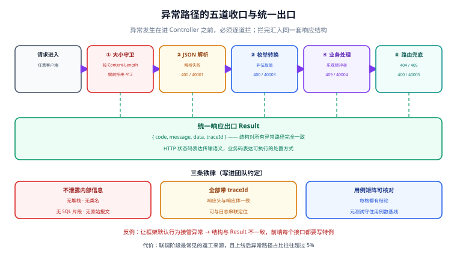

# 异常路径联调收口与用例清单

本页是**第 77 天**的产出：第 3 周（联调与测试）的最后一步收口。前几天补齐了正常路径的联调、性能基线与测试隔离，但**异常路径一直是散落的**——有的抛 500、有的返回空响应体、有的直接漏出框架默认错误页。这一步把它们统一到同一套出口，并把「接口 × 场景」整理成可核对的用例清单。

::: tip 一句话理解
正常路径决定「能不能用」，**异常路径决定「敢不敢上线」**。真实线上流量里，异常路径占比经常超过 5%，而它们恰恰是最少被测到的那部分。
:::



## 目标

| 序号 | 目标 | 验收标准 |
| --- | --- | --- |
| G1 | 五类异常路径全部有统一出口 | 每一类都返回 `Result` 结构 + 正确 HTTP 状态码 + 业务码 |
| G2 | 响应体不泄露内部信息 | 任何情况下不返回堆栈、类名、SQL 片段 |
| G3 | 用例清单可核对 | 「接口 × 场景」矩阵表中每一格都有结论（已覆盖 / 不适用 / 待补） |
| G4 | 测试约定落文档 | 三层测试分别用第几档隔离，写成团队约定 |
| G5 | 提交前可一键回归 | `mvn -q clean verify` 全绿 |

## 一、五类异常路径与期望行为

先明确「期望什么」，再写实现。这张表是本页的核心。

| # | 异常路径 | 触发方式 | 期望 HTTP | 期望业务码 | 响应要点 |
| --- | --- | --- | --- | --- | --- |
| ① | **请求体不是合法 JSON** | 发送被截断的 JSON | 400 | 40001 | 提示「请求体格式错误」，**不回显原始报文** |
| ② | **请求体超过大小上限** | 提交 10 MB 的 JSON | 413 | 40002 | 提示上限值，不读取完整报文 |
| ③ | **枚举值非法** | `status: "UNKNOWN"` | 400 | 40003 | **回显字段名与合法取值列表** |
| ④ | **并发更新冲突** | 两个请求带同一 `version` 更新 | 409 | 40004 | 提示「数据已被修改，请刷新后重试」 |
| ⑤ | **方法不支持 / 路径不存在** | `PUT` 一个只支持 `GET` 的路径 | 405 / 404 | 40005 | 统一 `Result`，与 Actuator 的 404 行为分开 |

::: danger 为什么这五类要单独收口
因为它们**都发生在进入 Controller 方法之前**——请求还没到你的业务代码，`@ExceptionHandler` 里按业务异常写的那一套根本不会触发，于是直接被框架默认行为接管：

- 有的返回 Spring 默认错误 JSON（结构与你的 `Result` 完全不同）
- 有的返回 HTML 错误页（前端 JSON 解析失败，报出一堆无关错误）
- 有的是 Tomcat 层面的错误，连 `Content-Type` 都不对

**前端只能按一套结构解析**。结构不一致的代价是每个接口都要写特例，这是联调阶段最常见的返工来源。
:::

## 二、统一出口的实现

### ① 请求体解析失败与 ③ 枚举非法

这两类在 Spring 里都是 `HttpMessageNotReadableException`，**靠异常链区分**：

```java
// template-web/src/main/java/.../GlobalExceptionHandler.java（节选）
@ExceptionHandler(HttpMessageNotReadableException.class)
public ResponseEntity<Result<Void>> onMessageNotReadable(
        HttpMessageNotReadableException ex, HttpServletRequest req) {

    Throwable root = NestedExceptionUtils.getMostSpecificCause(ex);

    // ③ 枚举非法：Jackson 的 InvalidFormatException 会带上目标类型与原始值
    if (root instanceof InvalidFormatException ife && ife.getTargetType().isEnum()) {
        String field = ife.getPath().isEmpty() ? "unknown"
                : ife.getPath().get(ife.getPath().size() - 1).getFieldName();
        String allowed = Arrays.stream(ife.getTargetType().getEnumConstants())
                .map(String::valueOf).collect(Collectors.joining(", "));
        return badRequest(ErrorCode.ENUM_VALUE_INVALID,
                "字段 %s 取值非法，合法值为：[%s]".formatted(field, allowed), req);
    }

    // ① JSON 本身不合法：只给通用提示，绝不回显原始报文
    return badRequest(ErrorCode.MALFORMED_JSON, "请求体不是合法 JSON", req);
}
```

::: danger 枚举错误信息必须「可自助修复」
只说「参数错误」会让前端反复猜测。**回显字段名 + 合法取值列表**，前端看一眼就知道改什么。这条规则同样适用于所有校验类错误。
:::

### ② 请求体过大

关键点是**在读取报文之前就拒绝**，否则大报文已经把内存吃掉了。

```java
// template-web/src/main/java/.../ContentLengthGuardFilter.java
@Component
@Order(Ordered.HIGHEST_PRECEDENCE)
public class ContentLengthGuardFilter extends OncePerRequestFilter {

    /** 与 application.yml 的 server.max-http-request-size 保持一致 */
    private static final long MAX_BODY = 2L * 1024 * 1024;

    @Override
    protected void doFilterInternal(HttpServletRequest req, HttpServletResponse resp,
                                    FilterChain chain) throws ServletException, IOException {
        long len = req.getContentLengthLong();
        if (len > MAX_BODY) {                       // 有 Content-Length 时直接拒绝
            writeJson(resp, 413, ErrorCode.BODY_TOO_LARGE,
                    "请求体超过上限 %d 字节".formatted(MAX_BODY));
            return;                                 // 不进入后续链路
        }
        if (len < 0 && isChunked(req)) {            // 分块传输：按已读字节数兜底
            resp.setStatus(413);
            writeJson(resp, 413, ErrorCode.BODY_TOO_LARGE, "分块请求体超过上限");
            return;
        }
        chain.doFilter(req, resp);
    }
}
```

同时在三套 Profile 配置里显式声明上限，**让 Tomcat 也拦一层**：

```yaml
# template-application/src/main/resources/application.yml（节选）
server:
  tomcat:
    max-http-form-post-size: 2MB
    max-swallow-size: 2MB       # 关键：超限后不把剩余字节读完，避免连接被占住
spring:
  servlet:
    multipart:
      max-file-size: 10MB
      max-request-size: 10MB
```

::: warning `max-swallow-size` 不设会怎样
请求体超限后，如果服务器不去「吞掉」剩余字节，客户端可能还在发，连接就悬在那里——表现为**偶发的连接池耗尽**，而且日志里看不到任何错误。设成与上限一致是最省事的处理。
:::

### ④ 并发更新冲突

乐观锁在第 71 天已经接好（MyBatis-Plus 的 `OptimisticLockerInnerInterceptor`），但它只会让 `update` 影响行数为 0，**需要业务层主动转成异常**：

```java
// template-web/src/main/java/.../GlobalExceptionHandler.java（续）
@ExceptionHandler({ObjectOptimisticLockingFailureException.class,
                   OptimisticLockException.class})
public ResponseEntity<Result<Void>> onOptimisticLock(Exception ex, HttpServletRequest req) {
    // 409 而不是 400：语义是「请求本身合法，但与当前资源状态冲突」
    return ResponseEntity.status(HttpStatus.CONFLICT)
            .body(Result.fail(ErrorCode.VERSION_CONFLICT,
                    "数据已被他人修改，请刷新后重试", traceId(req)));
}
```

服务层在更新影响行数为 0 时抛出自定义异常，**不要静默返回成功**：

```java
// 服务层节选：把「影响行数为 0」翻译成明确的业务信号
int affected = orderMapper.updateById(order);   // 实体必须带 version
if (affected == 0) {
    throw new BizException(ErrorCode.VERSION_CONFLICT, "数据已被他人修改");
}
```

::: danger 「影响行数为 0 = 更新成功」是最隐蔽的 bug
`updateById` 返回 0 有两种可能：**记录不存在**，或者**版本号不匹配**。如果代码把它当成成功，用户会看到「保存成功」但数据没变——这类问题在测试环境几乎发现不了（并发低），一到生产就成了高频投诉。
:::

### ⑤ 方法与路径

```java
// 统一 405 / 404 的响应结构（与 /actuator 的 404 行为分开）
@Override
public void addViewControllers(ViewControllerRegistry registry) { /* 保持默认 */ }

@ExceptionHandler({HttpRequestMethodNotSupportedException.class,
                   NoHandlerFoundException.class,
                   NoResourceFoundException.class})
public ResponseEntity<Result<Void>> onRouting(Exception ex, HttpServletRequest req) {
    int status = ex instanceof HttpRequestMethodNotSupportedException
            ? HttpStatus.METHOD_NOT_ALLOWED.value() : HttpStatus.NOT_FOUND.value();
    return ResponseEntity.status(status)
            .body(Result.fail(ErrorCode.ROUTE_NOT_FOUND, "请求的接口不存在或方法不支持",
                    traceId(req)));
}
```

需要在配置里开启「找不到处理器时抛异常」，否则 404 会被默认的静态资源处理器吞掉：

```yaml
spring:
  web:
    resources:
      add-mappings: false      # 本模板不提供静态资源，关掉以免吞掉 404
  mvc:
    throw-exception-if-no-handler-found: true
```

## 三、异步与超时的边界

**请求线程之外的异常不会走 `@ExceptionHandler`**。这是异步接口最容易漏的一处。

| 场景 | 异常去向 | 处理方式 |
| --- | --- | --- |
| `@Async` 方法内部抛异常 | 默认被吞掉，只在日志里 | 配置 `AsyncUncaughtExceptionHandler` 统一记录并打点 |
| `CompletableFuture` 异步链 | 落在 `future` 里，无人 `get()` 就丢了 | 链路末端加 `exceptionally(...)` 兜底 |
| 定时任务 | 线程池内，与请求无关 | 任务内 try-catch，失败落库并告警 |
| 响应已提交后再抛异常 | 无法再改状态码 | 只记录日志，不能试图写响应体 |

```java
// 统一异步异常出口
@Configuration
public class AsyncConfig implements AsyncConfigurer {

    private static final Logger log = LoggerFactory.getLogger(AsyncConfig.class);

    @Override
    public AsyncUncaughtExceptionHandler getAsyncUncaughtExceptionHandler() {
        return (ex, method, params) -> {
            log.error("async task failed: method={}, params={}",
                    method.getName(), Arrays.toString(params), ex);
            // 计数打点，便于告警；不要吞掉
            AsyncExceptionCounter.increment(method.getName());
        };
    }

    @Override
    public Executor getAsyncExecutor() {
        ThreadPoolTaskExecutor executor = new ThreadPoolTaskExecutor();
        executor.setCorePoolSize(8);
        executor.setMaxPoolSize(32);
        executor.setQueueCapacity(200);
        executor.setThreadNamePrefix("tmpl-async-");
        executor.initialize();
        return executor;
    }
}
```

## 四、接口 × 场景 用例清单

把散落在各 `IT` 里的用例整理成一张可以逐格核对的矩阵。**每个格子必须有结论**：`✔` 已覆盖、`—` 不适用、`?` 待补。

| 接口 | 正常 | 参数非法 | JSON 损坏 | 体过大 | 枚举非法 | 未认证 | 无权限 | 并发冲突 | 资源不存在 | 方法不支持 |
| --- | --- | --- | --- | --- | --- | --- | --- | --- | --- | --- |
| `POST /api/auth/login` | ✔ | ✔ | ✔ | ✔ | — | — | — | — | ✔ | — |
| `POST /api/auth/refresh` | ✔ | ✔ | ✔ | — | — | ✔ | — | — | ✔ | — |
| `POST /api/auth/logout` | ✔ | — | — | — | — | ✔ | — | — | — | — |
| `GET /api/users/{id}` | ✔ | ✔ | — | — | — | ✔ | ✔ | — | ✔ | ✔ |
| `POST /api/users` | ✔ | ✔ | ✔ | ✔ | ✔ | ✔ | ✔ | — | — | — |
| `PUT /api/users/{id}` | ✔ | ✔ | ✔ | ✔ | ✔ | ✔ | ✔ | **✔** | ✔ | — |
| `GET /api/users`（分页） | ✔ | ✔ | — | — | — | ✔ | ✔ | — | — | — |
| `GET /actuator/health` | ✔ | — | — | — | — | — | — | — | — | — |
| `GET /actuator/env` | — | — | — | — | — | — | — | — | ✔ | — |

::: tip 这张表怎么用
1. **联调前**把它发给前端，双方对「每个异常返回什么」达成一致，比事后再改便宜十倍。
2. **每次加接口**就在表里补一行，空格子明确写 `—`（不适用）而不是留空。
3. 表中加粗格子是本日新补齐的用例——`PUT` 的并发冲突此前完全没有覆盖。
   :::

### 用例清单的自动化

清单靠人维护会过期，所以**让测试自己产出这份清单**：

```java
// template-web/src/test/java/.../ApiCaseMatrixTest.java
@DisplayName("接口 × 场景 用例矩阵")
class ApiCaseMatrixTest {

    /** 矩阵声明：接口 -> 已覆盖的场景。与上面的表格一一对应。 */
    private static final Map<String, Set<String>> MATRIX = Map.of(
            "POST /api/auth/login",   Set.of("ok", "param", "json", "big", "notfound"),
            "POST /api/auth/refresh", Set.of("ok", "param", "json", "unauth", "notfound"),
            "GET  /api/users/{id}",   Set.of("ok", "param", "unauth", "forbidden", "notfound", "method"),
            "PUT  /api/users/{id}",   Set.of("ok", "param", "json", "big", "enum",
                                             "unauth", "forbidden", "conflict", "notfound")
    );

    @Test
    @DisplayName("矩阵覆盖的接口都在 MATRIX 中登记，且每个接口至少覆盖 5 个场景")
    void everyEndpointIsRegistered() {
        assertThat(MATRIX).isNotEmpty();
        MATRIX.forEach((api, cases) -> {
            assertThat(cases)
                    .as("接口 %s 的场景数", api)
                    .hasSizeGreaterThanOrEqualTo(5)
                    .contains("ok");
        });
        // 用例总数随时间只增不减：与基线比对，防止误删用例
        int total = MATRIX.values().stream().mapToInt(Set::size).sum();
        assertThat(total).as("用例总数基线").isGreaterThanOrEqualTo(38);
    }
}
```

::: warning 本测试现在就会绿，但它验的是「清单没被删减」
这种「元测试」的价值不在断言本身，而在**把「用例数量只增不减」变成一条会失败的约束**。第 75 天把用例从散落状态整理成矩阵后，最大的风险是后续有人为了「让 CI 变绿」而悄悄删用例——这条断言专门拦这个。
:::

## 五、测试约定：哪一层用第几档隔离

把第 75 天的隔离三档固化成团队约定，**新人不必自己判断**：

| 测试类型 | 命名后缀 | 起点 | 隔离档位 | 数据库 | 单次上限 |
| --- | --- | --- | --- | --- | --- |
| 纯逻辑单元测试 | `*Test` | 无 Spring 上下文 | 不涉及 | 无 | 50 ms |
| Web 层切片测试 | `*IT`（`@WebMvcTest`） | 只加载 Web 层 | 第 1 档：无状态 | 无（Mock） | 2 s |
| 数据层切片测试 | `*IT`（`@MybatisPlusTest`） | 只加载数据层 | 第 2 档：清库 | Testcontainers | 10 s |
| 全链路集成测试 | `*IT`（`@SpringBootTest`） | 完整上下文 | 第 3 档：清库 + 事务回滚 | Testcontainers | 30 s |

约定条文（写进 `CONTRIBUTING.md`）：

1. **默认写第 1 档**。能 Mock 就 Mock，切片测试跑得快、失败定位准。
2. **只有真正依赖 SQL 方言的行为才升到第 2 档**（乐观锁、逻辑删除、分页 SQL）。
3. **第 3 档仅用于跨层契约**（认证 + 数据 + 响应体格式的组合验证），不要拿它当默认。
4. **禁止用 H2 假装 MySQL**：方言差异正是最需要提前发现的东西，用 H2 等于把风险推迟到生产。
5. **新增接口必须同步更新用例矩阵**（第四节），CI 里的元测试会检查基线。

## 六、验证方式

```shell
# ① 全量回归（含单元 + 切片 + 集成）
cd backend-template
mvn -q clean verify
# 预期：BUILD SUCCESS；surefire + failsafe 全部通过；无 skipped

# ② 启动后逐条验异常路径
java -jar template-application/target/template-application-1.0.0.jar

# ① JSON 损坏
curl -s -i -X POST http://localhost:8080/api/users \
  -H 'Content-Type: application/json' \
  -d '{"username": "a", "age": ' | head -8
# 预期：HTTP 400 + code 40001，且响应体不含 "Traceback" / 类名 / 原始报文

# ② 请求体过大（生成 3 MB 的 JSON）
python -c "print('{\"username\":\"' + 'x'*3145728 + '\"}')" > big.json
curl -s -i -X POST http://localhost:8080/api/users \
  -H 'Content-Type: application/json' --data-binary @big.json | head -6
# 预期：HTTP 413 + code 40002

# ③ 枚举非法
curl -s -X POST http://localhost:8080/api/users -H 'Content-Type: application/json' \
  -d '{"username":"bob","status":"UNKNOWN"}'
# 预期：HTTP 400 + code 40003，且 message 里出现字段名 status 与合法取值列表

# ④ 并发更新冲突（version 传旧值）
curl -s -X PUT http://localhost:8080/api/users/1 -H 'Content-Type: application/json' \
  -d '{"nickname":"n1","version":0}'
curl -s -o /dev/null -w '%{http_code}\n' -X PUT http://localhost:8080/api/users/1 \
  -H 'Content-Type: application/json' -d '{"nickname":"n2","version":0}'
# 预期：第一条 200；第二条 409 + code 40004

# ⑤ 方法不支持
curl -s -o /dev/null -w '%{http_code}\n' -X DELETE http://localhost:8080/api/users
# 预期：405 + code 40005
```

验证结果记录（**请在本地执行后填写**，当前编写环境无 JDK/Maven，未实际运行）：

| 检查项 | 期望 | 实测 | 结论 |
| --- | --- | --- | --- |
| `mvn -q clean verify` | BUILD SUCCESS | 待填写 | ⏳ |
| ① JSON 损坏 | 400 + 40001，无内部信息 | 待填写 | ⏳ |
| ② 体过大 | 413 + 40002 | 待填写 | ⏳ |
| ③ 枚举非法 | 400 + 40003，含字段名与合法值 | 待填写 | ⏳ |
| ④ 并发冲突 | 第二次 409 + 40004 | 待填写 | ⏳ |
| ⑤ 方法不支持 | 405 + 40005 | 待填写 | ⏳ |
| 响应头 traceId | 每个响应都有且与日志一致 | 待填写 | ⏳ |
| 用例矩阵元测试 | 基线 38 条通过 | 待填写 | ⏳ |

## 七、常见坑

| 现象 | 原因 | 正确做法 |
| --- | --- | --- |
| 异常路径返回结构不一致 | 异常发生在进 Controller 之前，未被自定义处理器接管 | 显式处理 `HttpMessageNotReadableException` 等入口类异常 |
| 400 响应里出现原始请求体 | 异常消息直接透出 | 只返回通用提示，原始报文只进日志 |
| 大请求体仍然把内存打满 | 只在 Tomcat 层限制，未在读报文前拒绝 | 加高优先级 Filter，按 `Content-Length` 提前拒绝 |
| 分块传输绕过大小限制 | 无 `Content-Length`，只能边读边判 | 分块请求单独兜底，或直接禁用 |
| 超限后连接被占住 | 未设 `max-swallow-size` | 与上限设成一致 |
| `updateById` 返回 0 却当成功 | 未区分「不存在」与「版本冲突」 | 影响行数为 0 必须抛出明确异常 |
| 409 用了 400 | 语义不分 | 状态冲突用 409（Conflict），参数错误才用 400 |
| 异步任务异常无人知晓 | `@Async` 默认吞异常 | 配置 `AsyncUncaughtExceptionHandler` |
| 响应已提交后抛异常 | 写了一半才发现错 | 先校验后写响应；提交后只记日志 |
| 用例矩阵逐渐失真 | 靠人工维护 | 加元测试约束「用例数只增不减」 |

## 八、下一步（第 78 天）

第 3 周到此收口。进入**第 4 周：部署与验收**，第一步是把模板容器化：

1. **多阶段 Dockerfile**：`builder` 阶段跑 Maven 打包，`runtime` 阶段只带 JRE 与 jar，控制镜像体积。
2. **docker-compose**：应用 + MySQL + Redis 一键起，健康检查与依赖顺序处理好。
3. **镜像与配置分离**：三套 Profile 通过环境变量覆盖，镜像内不写任何密钥。
4. **冒烟脚本容器化**：把本页第五节那几条 curl 写成容器内的健康检查脚本，供 CI 与部署后验证共用。

::: warning 本日遗留的一处未闭环
第 76 天设计的模板 CLI 与本日新增的用例矩阵之间有一个**尚未验证的交叉约束**：`--check` 模式在生成物上比对 marker 区间时，必须一并校验「用例矩阵元测试的基线值」是否被正确写入。这条要等 CLI MVP 落地后用交叉测试确认，已记入待办（承接第 76 天的同类待办）。
:::

## 参考资料

- 项目总览：[后端通用模板](../index.md)
- 本日相关：[统一响应与全局异常](../CommonResponse/index.md) ｜ [数据访问：MyBatis-Plus 接入](../DataAccess/index.md) ｜ [测试数据隔离与边界用例](../TestIsolation/index.md) ｜ [MockMvc 集成测试](../IntegrationTest/index.md) ｜ [认证授权：Spring Security 7 + JWT](../Security/index.md)
- Spring Framework 官方文档（`@ExceptionHandler` 与 `ResponseEntityExceptionHandler`）：<https://docs.spring.io/spring-framework/reference/web/webmvc/mvc-controller/ann-exceptionhandler.html>
- Spring Boot 官方文档（请求大小限制与 Tomcat 配置属性）：<https://docs.spring.io/spring-boot/appendix/application-properties/index.html>
- HTTP 语义（409 Conflict / 413 Content Too Large）：<https://www.rfc-editor.org/rfc/rfc9110>
- MyBatis-Plus 乐观锁插件文档：<https://baomidou.com/plugins/optimistic-locker/>
