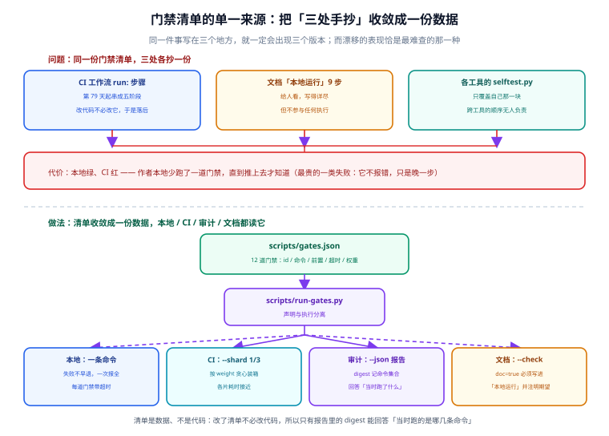
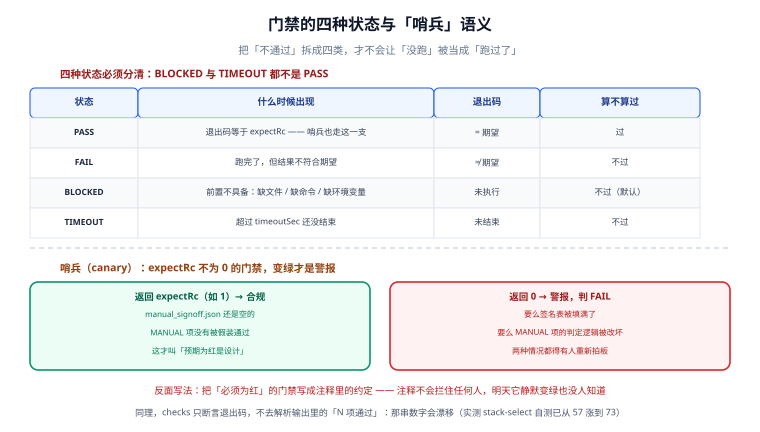

# 统一门禁：把散落的检查收敛成一份清单

到第 82 天为止，这个项目已经立起了不少检查：选择器 `--check`、双方言 `parity_check.py`、标签计划 `tagplan.py`、验收清单 `acceptance_check.py`、CI 里五道门禁……但它们散落在各自的模块页和 CI 配置里。本节解决的问题是：**当「该跑哪些检查」这件事本身也有多个版本时，谁说了算？**

## 一句话定位

把全部门禁收敛成一份机器可读的清单 `scripts/gates.json`，本地、CI、审计三处都读它——**清单只有一份，执行可以有三种方式，但内容不允许出现第二个版本**。

## 问题：同一份清单，三处各抄一份



在这份清单出现之前，同一组命令至少写在了三个地方：

| 位置 | 写法 | 漂移方式 |
| --- | --- | --- |
| 项目总览「本地运行」小节 | 人手抄的命令列表 | 新增门禁忘了更新，新人照着跑漏一步 |
| `.github/workflows/ci.yml` | 步骤里各写一遍命令 | 改了参数没人同步，CI 与本地判据不一致 |
| 验收文档与进展记录 | 引用时凭记忆复述 | 「大致是这样」式转述，越传越偏 |

漂移最阴险的表现不是「报错」，而是**不报错**：三处各自通过，但判据已经不一样了——本地跑的阈值和 CI 跑的阈值不同，最后「本地绿、CI 红」的排查成本远高于当初多花的那五分钟。

## gates.json：清单本体

```json [scripts/gates.json]
{
  "schemaVersion": 1,
  "note": "门禁的唯一来源。本地、CI、审计三处都读这一份文件……",
  "gates": [
    {
      "id": "stack-select-check",
      "name": "选择器漂移门禁",
      "why": "有人改了 stack.json 或 pom 的 marker 区间而没重新生成，这一格必须红。",
      "cmd": "{py} stack-select/stack-select.py --root . --check",
      "owner": "研发",
      "required": true,
      "timeoutSec": 120,
      "weight": 1,
      "requiresFiles": ["pom.xml"],
      "doc": true
    }
  ]
}
```

字段含义：

| 字段 | 必填 | 作用 |
| --- | --- | --- |
| `id` / `name` | 是 | 稳定标识与人读名称；`id` 用于 CI 引用与日志对齐 |
| `why` | 是 | **这道门禁为什么存在**。清单能被审计的前提是每条都答得出「防什么事故」 |
| `cmd` | 是 | 实际命令；`{py}` 占位符由运行器按平台替换为当前 Python 解释器 |
| `owner` | 是 | 责任人角色；红了这个格子该找谁，不写就默认是「提 bug 的人自己修」 |
| `required` | 是 | `true` 表示失败即整体失败；当前 12 条全部为 `true` |
| `timeoutSec` | 是 | 超时时间；超时是**独立于失败**的第三种状态（见下文） |
| `weight` | 是 | 耗时权重，用于排期与「先跑哪个」的参考 |
| `requiresFiles` / `requiresEnv` / `requiresExec` | 否 | 前置条件：缺文件 / 缺环境变量 / 缺可执行文件时判 **BLOCKED** 而不是 FAIL |
| `expectRc` | 否 | 期望退出码。缺省期望 `0`；哨兵类门禁期望 `1`（见下文） |
| `kind` | 否 | `canary` 标记哨兵项 |
| `doc` | 否 | `true` 表示该命令必须出现在总览「本地运行」小节——由防漂移断言强制 |

当前清单共 **12 条**，按「改坏哪一格最危险」赋权重：`mvn-verify`（10）> `acceptance-selftest`（8）> `stack-select-selftest`（6）> `acceptance-cross`（4）> 其余各 1~2。完整清单用 `python3 scripts/run-gates.py --list` 查看。

## run-gates.py：三种执行方式共用一个判定器



运行器把每条门禁的结局拆成**四种状态**，核心动机是：**「没跑」绝不能被当成「跑过了」**。

| 状态 | 含义 | 典型成因 | 退出码贡献 |
| --- | --- | --- | --- |
| `PASS` | 跑了，结果符合期望 | — | 无 |
| `FAIL` | 跑了，结果不符合期望 | 代码或配置真的坏了 | 整体失败 |
| `BLOCKED` | **没跑成**：前置条件不满足 | 本机没有 `pom.xml`、没配 `JAVA_HOME`、缺 `mvn` | 整体失败（与 FAIL 同罪） |
| `TIMEOUT` | 跑了但超时 | 卡死、网络等待 | 整体失败 |

`BLOCKED` 单列的原因：在一台没装 Maven 的机器上，「`mvn verify` 没通过」和「`mvn verify` 根本没跑」是两回事。把后者报成前者，会让人去排查根本不存在的代码问题；把后者报成通过，就是自欺。所以缺前置条件时明确报 BLOCKED 并打印缺的是什么。

### 哨兵项：期望「红」的门禁

`acceptance-strict-canary` 是清单里唯一 `expectRc: 1` 的条目：

```shell
python3 Acceptance/acceptance_check.py --strict   # 期望退出码 1（签名表为空是正确状态）
```

上线验收的 `--strict` 在人工签名填满之前**必须返回 1**（见 [上线验收与监控接入](../Acceptance/index.md)）。这一格如果变绿，不是好消息而是警报——说明签名表被填满了、或 MANUAL 项判定逻辑被改坏了，必须有人重新拍板。把它放进统一清单并断言 `expectRc: 1`，「正确状态是红」这件事才有了自动看护。

## 防漂移断言：文档不许和清单分叉

`run-gates.py --check` 做两件事：

1. **schema 校验**：12 条门禁的必填字段、超时上界、`expectRc` 合法性逐条检查；
2. **文档防漂移**：每条 `doc: true` 的命令必须能在项目总览的「本地运行」小节里找到，且该行写了「期望」结果。找不到就报红，**报红的是文档不是代码**——清单是源头，文档是投影。

这条断言的判据刻意从「人记得同步」改成「机器拒绝不同步」：总览里那条 `mvn -B clean verify` 的注释被改掉、或新增门禁忘了写进总览，`--check` 当场指出第几条对不上。

## 运行器自测：对判定器本身做变异测试

`scripts/selftest.py` 共 **78 项断言**（2026-09-26 实测 78/78 通过），全部围绕「改坏一格必报红」：

- 把一道门禁的 `expectRc` 改坏 → 运行器必须判 FAIL；
- 塞一条必然超时的命令 → 必须判 TIMEOUT 而不是挂死；
- 删掉总览里一条 `doc: true` 的命令 → 防漂移断言必须报红；
- 把 `--strict` 哨兵的期望改成 0 → 哨兵必须由绿变红；
- `--skip` 跳过的门禁 → 结论必须显式标注「跳过」，不得计入通过数。

运行器自己错了，上面十一条全是摆设——所以它排在清单最后一条，且 `nestSafe: false` 防止自我递归执行。

:::danger 注意
清单文件 `gates.json` 本身也在 git 管理下。**不要为了「让流水线先过去」临时把某条的 `required` 改成 `false`**——这等于把门拆了再报告「门没挡路」。要跳过就显式用 `--skip <id>` 并在提交说明里写明原因，让跳过行为留在历史里。
:::

## 与既有各页的分工

| 页面 | 职责 | 本页职责 |
| --- | --- | --- |
| [CI 流水线](../CI/index.md) | 门禁**怎么串成流水线**、阶段排序、缓存 | 门禁**本体是什么**、判据从哪份文件读 |
| [上线验收与监控接入](../Acceptance/index.md) | 验收清单的内容与人工签名机制 | 验收工具作为 12 条门禁之一被统一调度 |
| [技术栈可插拔](../StackSelect/index.md) | 选择器与 `--check` 的原理 | 选择器检查在清单中的位置与前置条件 |

## 验证方式

```shell
# ① 三种执行方式（同一份清单）
python3 scripts/run-gates.py --list    # 期望：打印 12 条门禁的判据 / 责任人 / 权重
python3 scripts/run-gates.py --check   # 期望：OK，schema 12 条 + 防漂移断言通过
python3 scripts/run-gates.py           # 期望：本机缺 pom.xml/JAVA_HOME 时 mvn-verify 判 BLOCKED、退出码 1

# ② 运行器自测
python3 scripts/selftest.py            # 期望：selftest: 78/78 通过

# ③ 变异验证（验证完记得还原）：把清单里任一 expectRc 改坏，再跑 --check，必须报红
```

## 下一步

- CI 侧把 `.github/workflows/ci.yml` 中与清单重复的命令改为按 `id` 引用清单执行，消除最后一处手抄；
- 新增门禁时只改 `gates.json` 与对应工具，总览小节由防漂移断言逼着同步。
