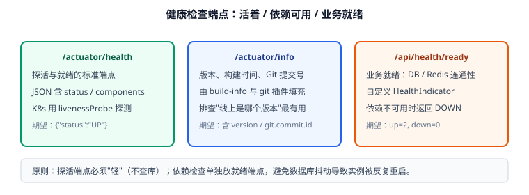

# 健康检查与配置（第 69 天 · 步骤 ④）

服务能不能被安全地重启、扩容、摘流量，取决于有没有可靠的**健康检查**。本页交付 Actuator 端点配置 + 业务就绪检查 + 多环境 Profile，并给出可验证的启动流程。



## 三类端点，各司其职

| 端点 | 用途 | 是否查依赖 | 谁在调用 |
| --- | --- | --- | --- |
| `/actuator/health`（liveness） | 进程是否活着 | ❌ 不查 | K8s `livenessProbe`、负载均衡 |
| `/api/health/ready`（readiness） | 是否可对外服务 | ✅ 查 DB / Redis | K8s `readinessProbe`、发布脚本 |
| `/actuator/info` | 版本、构建时间、Git 提交 | ❌ | 排障时确认"线上跑的是哪版" |

::: danger 把依赖检查放进 liveness 是经典事故
数据库抖动时 `/actuator/health` 返回 DOWN → K8s 判定"进程死了" → **重启所有实例** → 雪崩。正确做法：**liveness 只回进程状态，依赖检查独立放 readiness**，依赖不可用时实例只是被摘流量，不再被重启。
:::

## 暴露端点

```yaml [template-application/src/main/resources/application.yml]
management:
  endpoints:
    web:
      exposure:
        include: health,info,metrics        # 只暴露需要的，不要用 "*"
  endpoint:
    health:
      show-details: when-authorized          # 详情只给已认证用户
      probes:
        enabled: true                        # 开启 /actuator/health/liveness|readiness
  health:
    db:
      enabled: true                          # 自动检查数据源
    redis:
      enabled: true
```

::: warning 端点暴露的安全边界
- **不要暴露 `env`、`heapdump`、`threaddump`**：`env` 会泄露配置与环境变量（含密码），`heapdump` 可能被下载走内存数据。
- 若确实需要，单独放在管理端口（`management.server.port=9090`）并只对内网开放。
- 生产环境建议给 Actuator 加认证（`show-details: when-authorized` + Security 放行规则）。
:::

## 业务就绪检查

```java [template-web/src/main/java/com/example/template/web/health/ReadyHealthIndicator.java]
package com.example.template.web.health;

import org.springframework.boot.actuate.health.Health;
import org.springframework.boot.actuate.health.HealthIndicator;
import org.springframework.jdbc.core.JdbcTemplate;
import org.springframework.stereotype.Component;

/** 业务就绪检查：数据库可用才算 ready。 */
@Component("ready")
public class ReadyHealthIndicator implements HealthIndicator {

    private final JdbcTemplate jdbcTemplate;

    public ReadyHealthIndicator(JdbcTemplate jdbcTemplate) {
        this.jdbcTemplate = jdbcTemplate;
    }

    @Override
    public Health health() {
        try {
            Integer one = jdbcTemplate.queryForObject("SELECT 1", Integer.class);
            if (one != null && one == 1) {
                return Health.up().withDetail("database", "reachable").build();
            }
            return Health.down().withDetail("database", "unexpected result").build();
        } catch (Exception ex) {
            return Health.down(ex).withDetail("database", "unreachable").build();
        }
    }
}
```

暴露为独立接口（便于网关统一探测）：

```java [template-web/src/main/java/com/example/template/web/controller/HealthController.java]
package com.example.template.web.controller;

import com.example.template.common.result.Result;
import org.springframework.boot.actuate.health.HealthComponent;
import org.springframework.boot.actuate.health.HealthEndpoint;
import org.springframework.web.bind.annotation.GetMapping;
import org.springframework.web.bind.annotation.RequestMapping;
import org.springframework.web.bind.annotation.RestController;

import java.util.Map;

@RestController
@RequestMapping("/api/health")
public class HealthController {

    private final HealthEndpoint healthEndpoint;

    public HealthController(HealthEndpoint healthEndpoint) {
        this.healthEndpoint = healthEndpoint;
    }

    /** 就绪检查：可被网关/发布脚本调用，HTTP 200 表示可接收流量。 */
    @GetMapping("/ready")
    public Result<Map<String, Object>> ready() {
        HealthComponent health = healthEndpoint.healthForPath("ready");
        return Result.success(Map.of("status", health.getStatus().getCode()));
    }
}
```

## 多环境配置

```yaml [template-application/src/main/resources/application-prod.yml]
server:
  port: 8080
  tomcat:
    threads:
      max: 400            # 按 CPU 与 IO 等待比调整，不是越大越好
    accept-count: 200

spring:
  datasource:
    hikari:
      maximum-pool-size: 20      # 常见经验值：CPU 核数 × 2 + 磁盘数，再按压测调整
      minimum-idle: 5
      connection-timeout: 3000
      max-lifetime: 1800000

logging:
  level:
    root: info
    com.example.template: info
  file:
    name: /var/log/backend-template/app.log
```

| Profile | 用途 | 关键差异 |
| --- | --- | --- |
| `dev` | 本地开发 | 连本地库、debug 日志、Swagger 全开 |
| `test` | 测试环境 | 连测试库、info 日志、连接池较小 |
| `prod` | 生产 | 环境变量注入密码、info 日志、连接池与线程数按压测定 |

```shell
# 启动时指定环境（两种方式等价）
java -jar app.jar --spring.profiles.active=prod
APP_PROFILE=prod java -jar app.jar
```

## 验证方式

```shell
# 1. 探活端点：不查依赖，必须快速返回
time curl -s http://localhost:8080/actuator/health
# {"status":"UP"}   （耗时应在 50ms 内）

# 2. 就绪端点：含数据库检查
curl -s http://localhost:8080/api/health/ready
# {"code":0,"message":"success","data":{"status":"UP"},"timestamp":...}

# 3. 构建信息端点
curl -s http://localhost:8080/actuator/info
# {"build":{"artifact":"template-application","version":"1.0.0","time":"2026-09-14T00:20:00Z"}}

# 4. 敏感端点确实不可访问（应返回 404）
curl -o /dev/null -s -w "%{http_code}\n" http://localhost:8080/actuator/env
# 404
```

```shell
# 5. 模拟依赖不可用：停掉 MySQL 后 readiness 应变 DOWN，而 liveness 仍 UP
sudo systemctl stop mysqld
curl -s http://localhost:8080/api/health/ready      # {"status":"DOWN"}
curl -s http://localhost:8080/actuator/health       # {"status":"UP"}  ← 不应被连带影响
```

收尾确认：探活 50ms 内返回 UP、就绪端点反映数据库状态、`env` 等敏感端点不可访问、依赖故障时实例不会被误判为死亡。

## 下一步

第 70 天：把 `/actuator/prometheus`（Micrometer）接上，配合日志 TraceId 形成"指标 + 日志"的最小可观测组合；第 79 天在 Compose 里加 healthcheck，让依赖顺序可控。

## 参考资料

- Spring Boot 官方文档：[Actuator Endpoints](https://docs.spring.io/spring-boot/reference/actuator/endpoints.html)、[Health Checks](https://docs.spring.io/spring-boot/reference/actuator/observability.html)
- 相关文档：[统一响应与全局异常](../CommonResponse/index.md) / [监控告警](../../../../docs/Ops/Monitoring/index.md)
