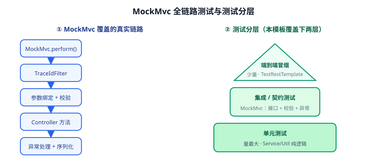

# MockMvc 集成测试（第 70 天 · 步骤 ⑥）

前两页的验证方式都是 `curl`——手工敲一遍没问题，但**没人会在每次提交前手敲 12 条 curl**。本页把这些验证固化成自动化测试：用 `MockMvc` 在"不真正启动 Tomcat"的前提下跑完整 Spring MVC 链路（过滤器、参数绑定、校验、全局异常、响应序列化都在），接入 CI 后每次 PR 自动回归。



## 目标

| 能力 | 验收表现 |
| --- | --- |
| 全链路测试 | 过滤器、校验、异常处理、序列化都真实执行 |
| 契约断言 | 断言 HTTP 状态码 + 业务码 + 字段结构 |
| traceId 覆盖 | 验证透传与生成两条路径 |
| 覆盖率门禁 | JaCoCo 生成报告，核心模块行覆盖率达标 |
| 可 CI 执行 | `mvn test` 一条命令跑完全部用例，无外部依赖 |

## 为什么用 MockMvc 而不是 TestRestTemplate

| 维度 | MockMvc | TestRestTemplate（真启动端口） |
| --- | --- | --- |
| 启动成本 | 不启真实 Servlet 容器，秒级 | 启动完整容器，较慢 |
| 与 Spring 上下文一致性 | `@SpringBootTest + @AutoConfigureMockMvc` 完全一致 | 一致 |
| 过滤器是否执行 | **执行**（`@AutoConfigureMockMvc` 默认注册过滤器） | 执行 |
| 适合 | 接口契约、校验、异常、过滤器回归 | 端到端冒烟、真实网络行为 |

结论：**日常回归用 MockMvc**，端到端冒烟再补少量 `TestRestTemplate` 用例。

## 依赖

`template-application/pom.xml`（测试聚合在启动模块，才能拿到完整上下文）：

```xml [template-application/pom.xml]
<dependency>
    <groupId>org.springframework.boot</groupId>
    <artifactId>spring-boot-starter-test</artifactId>
    <scope>test</scope>
</dependency>
```

`spring-boot-starter-test` 已包含 JUnit 5、AssertJ、MockMvc、JSONPath，无需额外引入。

## 用例一：统一响应与全局异常

```java [template-application/src/test/java/com/example/template/ApiContractTest.java]
package com.example.template;

import org.junit.jupiter.api.DisplayName;
import org.junit.jupiter.api.Test;
import org.springframework.beans.factory.annotation.Autowired;
import org.springframework.boot.test.autoconfigure.web.servlet.AutoConfigureMockMvc;
import org.springframework.boot.test.context.SpringBootTest;
import org.springframework.test.web.servlet.MockMvc;

import static org.springframework.test.web.servlet.request.MockMvcRequestBuilders.get;
import static org.springframework.test.web.servlet.request.MockMvcRequestBuilders.post;
import static org.springframework.test.web.servlet.result.MockMvcResultMatchers.*;

/**
 * 接口契约测试：把第 69~70 天的 curl 验证固化为自动化用例。
 * 断言维度：HTTP 状态码 + 业务 code + 关键字段。
 */
@SpringBootTest
@AutoConfigureMockMvc
class ApiContractTest {

    @Autowired
    private MockMvc mockMvc;

    @Test
    @DisplayName("成功响应：code=0 且 data=pong")
    void ping_shouldReturnSuccess() throws Exception {
        mockMvc.perform(get("/api/ping"))
                .andExpect(status().isOk())
                .andExpect(jsonPath("$.code").value(0))
                .andExpect(jsonPath("$.data").value("pong"))
                .andExpect(jsonPath("$.traceId").isNotEmpty());
    }

    @Test
    @DisplayName("业务异常：HTTP 409 + code=20001")
    void bizError_shouldMapToConflict() throws Exception {
        mockMvc.perform(get("/api/biz-error"))
                .andExpect(status().isConflict())
                .andExpect(jsonPath("$.code").value(20001));
    }

    @Test
    @DisplayName("系统异常：HTTP 500 + code=50000，且响应不暴露堆栈")
    void boom_shouldMapToServerErrorWithoutStacktrace() throws Exception {
        mockMvc.perform(get("/api/boom").param("divisor", "0"))
                .andExpect(status().isInternalServerError())
                .andExpect(jsonPath("$.code").value(50000))
                // 响应里绝不能出现异常类名
                .andExpect(content().string(org.hamcrest.Matchers.not(
                        org.hamcrest.Matchers.containsString("ArithmeticException"))));
    }
}
```

::: danger 用例不隔离会互相污染
`@SpringBootTest` 默认**同一个上下文在多个测试类间复用**，若某个用例改了全局状态（如静态变量、`MDC`、线程池），会影响其他用例。本模板的 `TraceIdFilter` 在 `finally` 里清理 MDC，天然隔离；但你新增的用例若持有静态可变状态，务必在 `@AfterEach` 里复位。
:::

## 用例二：参数校验字段级明细

```java [template-application/src/test/java/com/example/template/ValidationTest.java]
package com.example.template;

import org.junit.jupiter.api.DisplayName;
import org.junit.jupiter.api.Test;
import org.springframework.beans.factory.annotation.Autowired;
import org.springframework.boot.test.autoconfigure.web.servlet.AutoConfigureMockMvc;
import org.springframework.boot.test.context.SpringBootTest;
import org.springframework.http.MediaType;
import org.springframework.test.web.servlet.MockMvc;

import static org.springframework.test.web.servlet.request.MockMvcRequestBuilders.get;
import static org.springframework.test.web.servlet.request.MockMvcRequestBuilders.post;
import static org.springframework.test.web.servlet.result.MockMvcResultMatchers.jsonPath;
import static org.springframework.test.web.servlet.result.MockMvcResultMatchers.status;

@SpringBootTest
@AutoConfigureMockMvc
class ValidationTest {

    @Autowired
    private MockMvc mockMvc;

    @Test
    @DisplayName("新增：多字段不合法 → 400 + 字段级明细")
    void addUser_invalidPayload_shouldReturnFieldErrors() throws Exception {
        String body = """
                {"username":"ab","password":"123","mobile":"12345","email":"not-an-email"}
                """;
        mockMvc.perform(post("/api/users").contentType(MediaType.APPLICATION_JSON).content(body))
                .andExpect(status().isBadRequest())
                .andExpect(jsonPath("$.code").value(10400))
                .andExpect(jsonPath("$.data.fields.username").exists())
                .andExpect(jsonPath("$.data.fields.password").exists())
                .andExpect(jsonPath("$.data.fields.mobile").value("手机号格式不正确"))
                .andExpect(jsonPath("$.data.fields.email").value("邮箱格式不正确"));
    }

    @Test
    @DisplayName("新增：传了 ID → 命中 @Null(Add 组)")
    void addUser_withId_shouldReject() throws Exception {
        String body = """
                {"id":"u-1","username":"alice","password":"passw0rd"}
                """;
        mockMvc.perform(post("/api/users").contentType(MediaType.APPLICATION_JSON).content(body))
                .andExpect(status().isBadRequest())
                .andExpect(jsonPath("$.data.fields.id").value("新增时不能指定 ID"));
    }

    @Test
    @DisplayName("方法参数校验：id=0 触发 @Min")
    void detail_withZeroId_shouldReject() throws Exception {
        mockMvc.perform(get("/api/users/0"))
                .andExpect(status().isBadRequest())
                .andExpect(jsonPath("$.data.fields.id").value("ID 必须大于 0"));
    }
}
```

## 用例三：TraceId 透传与生成

```java [template-application/src/test/java/com/example/template/TraceIdTest.java]
package com.example.template;

import org.junit.jupiter.api.DisplayName;
import org.junit.jupiter.api.Test;
import org.springframework.beans.factory.annotation.Autowired;
import org.springframework.boot.test.autoconfigure.web.servlet.AutoConfigureMockMvc;
import org.springframework.boot.test.context.SpringBootTest;
import org.springframework.test.web.servlet.MockMvc;

import static org.springframework.test.web.servlet.request.MockMvcRequestBuilders.get;
import static org.springframework.test.web.servlet.result.MockMvcResultMatchers.header;
import static org.springframework.test.web.servlet.result.MockMvcResultMatchers.jsonPath;
import static org.springframework.test.web.servlet.result.MockMvcResultMatchers.status;

@SpringBootTest
@AutoConfigureMockMvc
class TraceIdTest {

    @Autowired
    private MockMvc mockMvc;

    @Test
    @DisplayName("上游带 X-Trace-Id：原样透传（响应头 + 响应体一致）")
    void withTraceIdHeader_shouldEcho() throws Exception {
        mockMvc.perform(get("/api/ping").header("X-Trace-Id", "test-trace-0001"))
                .andExpect(status().isOk())
                .andExpect(header().string("X-Trace-Id", "test-trace-0001"))
                .andExpect(jsonPath("$.traceId").value("test-trace-0001"));
    }

    @Test
    @DisplayName("上游不带：服务端生成非空 traceId")
    void withoutTraceIdHeader_shouldGenerate() throws Exception {
        mockMvc.perform(get("/api/ping"))
                .andExpect(status().isOk())
                .andExpect(header().exists("X-Trace-Id"))
                .andExpect(jsonPath("$.traceId").isNotEmpty());
    }
}
```

## 覆盖率门禁

在 `template-application/pom.xml` 挂 JaCoCo，让覆盖率不达标时构建失败：

```xml [template-application/pom.xml]
<build>
    <plugins>
        <plugin>
            <groupId>org.jacoco</groupId>
            <artifactId>jacoco-maven-plugin</artifactId>
            <version>0.8.13</version>
            <executions>
                <execution>
                    <id>prepare-agent</id>
                    <goals><goal>prepare-agent</goal></goals>
                </execution>
                <execution>
                    <id>report</id>
                    <phase>test</phase>
                    <goals><goal>report</goal></goals>
                </execution>
                <execution>
                    <id>check</id>
                    <phase>verify</phase>
                    <goals><goal>check</goal></goals>
                    <configuration>
                        <rules>
                            <rule>
                                <element>BUNDLE</element>
                                <limits>
                                    <!-- 行覆盖率低于 60% 直接构建失败 -->
                                    <limit>
                                        <counter>LINE</counter>
                                        <value>COVEREDRATIO</value>
                                        <minimum>0.60</minimum>
                                    </limit>
                                </limits>
                            </rule>
                        </rules>
                    </configuration>
                </execution>
            </executions>
        </plugin>
    </plugins>
</build>
```

::: warning 覆盖率不是越高越好
盲目追求 90% 覆盖率会催生大量"只为跑过行数"的断言。**合理做法**：核心模块（common、web 的异常与校验）要求较高门槛，DTO、常量类等不纳入统计（JaCoCo 支持 `<excludes>`）。门禁要"防退化"，不是"冲数字"。
:::

## 验证方式

```shell
# 1. 跑全部测试
cd backend-template
mvn -q test
# 预期：Tests run: N, Failures: 0, Errors: 0, Skipped: 0

# 2. 生成并查看覆盖率报告
mvn -q verify
# 预期：target/site/jacoco/index.html 可打开，行覆盖率 ≥ 60%

# 3. 只跑某个测试类（开发时快速反馈）
mvn -q test -Dtest=TraceIdTest
```

收尾确认：

| 检查项 | 期望 |
| --- | --- |
| `mvn test` | 全部用例通过，无跳过 |
| 契约断言 | 状态码 + 业务码 + 字段结构均被覆盖 |
| 校验用例 | 字段级明细断言通过 |
| traceId 用例 | 透传与生成两条路径都有覆盖 |
| 覆盖率门禁 | 低于阈值时 `mvn verify` 失败 |
| 无外部依赖 | 不依赖真实 MySQL/Redis，纯内存上下文 |

## 下一步

第 71 天进入**数据访问**：接入 MyBatis-Plus、分页插件、公共字段自动填充（创建人/时间/更新人），并为数据层补集成测试。

## 参考资料

- Spring 官方文档：[MockMvc](https://docs.spring.io/spring-framework/reference/testing/spring-mvc-test-framework.html)
- Spring Boot 官方文档：[Testing](https://docs.spring.io/spring-boot/reference/testing/index.html)
- JUnit 5 用户指南：https://junit.org/junit5/docs/current/user-guide/
- JaCoCo：https://www.jacoco.org/jacoco/trunk/doc/maven.html
- JSONPath 语法：https://github.com/json-path/JsonPath
- 相关文档：[统一响应与全局异常](../CommonResponse/index.md) / [参数校验增强](../Validation/index.md) / [请求追踪 ID 与日志切面](../TraceId/index.md)
