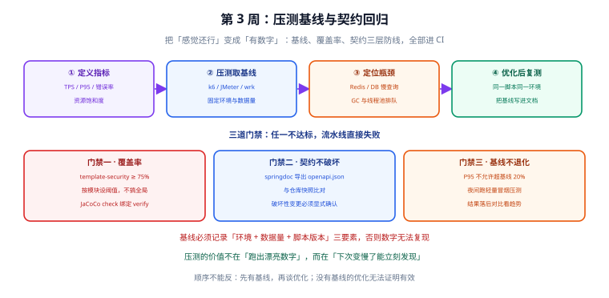
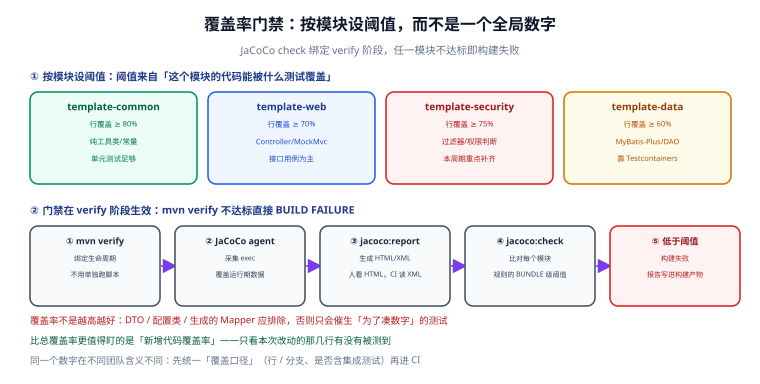
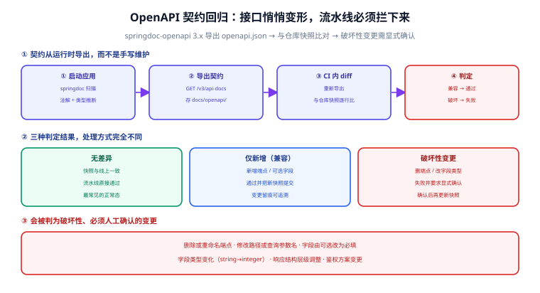

# 压测与性能基线

前 73 天我们把模板从"能跑"做到了"默认安全、有测试"——但还没有任何一个**数字**能回答"这套基座撑得住多少请求"。

本节（第 74 天）进入**第 3 周：联调与测试**的第二阶段，做三件事：给接口**压出一条性能基线**、把 `template-security` 的覆盖率从 60% **补齐到 75%** 并纳入门禁、用 springdoc-openapi 导出的契约做**接口契约回归**。三件事的共同点：都是"把说不清的东西变成 CI 能判定的东西"。

## 1. 本节目标与验收标准

| 目标 | 验收方式 |
| --- | --- |
| 接口有可复现的性能基线 | `docs/perf/baseline-*.json` 记录 TPS / P95 / 错误率，附环境与数据量 |
| 压测脚本可版本化、可进 CI | `scripts/perf/login-and-api.js`（k6）可直接 `k6 run` |
| 覆盖率达标并门禁化 | `mvn verify` 在 `template-security` 行覆盖 < 75% 时 **BUILD FAILURE** |
| 覆盖率报告可读 | `template-*/target/site/jacoco/index.html` 能按类看红黄绿 |
| 契约可回归 | `docs/openapi/openapi.json` 快照入库，CI 内重新导出并 diff |
| 破坏性变更拦得住 | 删端点 / 改字段类型时 CI 失败，且失败信息指出具体路径 |
| 两道门禁进流水线 | CI 中 `verify` + 契约比对两步均为必过项 |

::: info 本节使用的版本（2026-09 核对）
JDK 25 LTS · Spring Boot 4.1.x · JaCoCo **0.8.15**（2026-06-04 发布，官方支持到 Java 26；Java 25 需 ≥ 0.8.14）· springdoc-openapi **3.1.x**（Boot 4.x 必须用 3.x 线）· k6 **2.2.0**（若要长期支持线可选 k6 1.8.x）· Apache JMeter **5.6.3**（2024-01 发布，仍是当前稳定版，要求 Java 17+）· MySQL 8.4 LTS · Redis 8.x。
:::

## 2. 为什么联调期就要压，而不是上线前再压

"等上线前统一压测"是国内项目最常见的排期方式，也正是压测最容易失效的方式。三个现实原因：

| 误区 | 实际后果 | 本项目的做法 |
| --- | --- | --- |
| 上线前才压 | 此时接口形状全定、索引与缓存策略都写死了，改造成本最高 | 联调期压，此时改一行 SQL / 加一个索引最便宜 |
| 只用"感觉不慢"当结论 | 接口数量一多，"感觉"会被单个慢接口掩盖 | 每个关键接口一条 P95 记录，写进文档 |
| 压完不记录环境 | 换台机器数字差 3 倍，基线等于没有 | 基线必须带"环境 + 数据量 + 脚本版本"三要素 |

:::tip 一句话理解
压测的价值不在"跑出漂亮数字"，而在**"下次变慢了能立刻发现"**。所以它的产物不是一个报告，而是一条**可重复执行的脚本 + 一份记录下来的基线**。
:::

## 3. 压测闭环四步



图中这条链有一个**不可逆的顺序**：先定义指标 → 再压出基线 → 才谈定位瓶颈 → 优化后再复测。跳过第①②步直接"优化"，等于无法证明优化有效。

对应到命令层面：

```shell
# ① 指标定义：写在脚本的 thresholds 里（见第 7 节），不是写在 PPT 里
# ② 压基线：固定环境 + 固定数据量，跑三次取稳定值
k6 run --summary-export=docs/perf/baseline-k6-login.json scripts/perf/login-and-api.js
# ③ 定位瓶颈：压测同时采集应用与中间件指标（见第 9 节的判定方法）
# ④ 优化后复测：同一脚本、同一环境、同一数据量，再跑一次做对比
```

## 4. 指标先定义清楚

压测报告里最容易出错的不是数字，而是**数字的含义**。本项目统一用下面这套口径：

| 指标 | 定义 | 本项目目标（单实例本地/测试环境） | 读法 |
| --- | --- | --- | --- |
| **TPS** | 每秒完成的**事务**数（一次登录 = 1 事务） | 登录 ≥ 300，受保护查询 ≥ 800 | 业务视角的核心产能 |
| **RPS / QPS** | 每秒请求数，一个事务含多次请求时高于 TPS | 仅作参考 | 与 TPS 混用会导致结论错位 |
| **并发数（VU）** | 同时"在发请求"的虚拟用户数 | 20 / 50 / 100 三档 | 是**输入**，不是结果 |
| **P50 / P95 / P99** | 响应耗时百分位：95% 的请求快于该值 | P95 < 300ms，P99 < 800ms | 只看平均值会被长尾骗 |
| **错误率** | `非 2xx / 期望状态码外 / 校验失败` 的比例 | < 0.5% | 压测中错误率飙升通常是限流或连接池打满 |
| **饱和度** | CPU / 连接池使用率 / Redis 内存与 QPS | CPU < 70% | 判断"还有多少余量"的关键 |

:::danger 注意：下面三种写法都是错的
1. **把并发数当 TPS 汇报**。"支持 1000 并发"在没说响应时间时**没有任何信息量**——1000 并发下 P95 是 50ms 还是 5s，是两个完全不同的系统。正确写法：`100 VU 下 TPS 580、P95 210ms、错误率 0%`。
2. **只报平均响应时间**。均值 80ms 可能是 95% 请求 20ms、5% 请求 1.2s 的结果，用户体感由后者决定。**必须报 P95 及以上**。
3. **在压测机上开 GUI / IDE 跑压测**。客户端自身成了瓶颈，压出来的数字是"压测机能跑多快"而不是"服务能扛多少"。正确做法：`k6 run` / `jmeter -n` 无界面运行，并观察压测机 CPU。
:::

## 5. 基线三要素与记录格式

同一条接口，换环境、换数据量、换脚本都会得到不同数字。所以基线文件必须自带上下文，否则一个月后没人敢用它判断"有没有退化"。

| 要素 | 必须记录的内容 | 为什么 |
| --- | --- | --- |
| **环境** | CPU/内存核数、JDK 版本、容器配额、MySQL/Redis 版本与连接池配置 | 4C8G 与 16C32G 的数字不可比 |
| **数据量** | 用户表行数、单用户会话数、目标接口涉及表的行数 | 10 万行和 1000 万行的 P95 不是一回事 |
| **脚本版本** | 脚本文件 Git 提交号、VU 档位、持续时间、思考时间（sleep） | 去掉 sleep 等于把并发放大数倍 |

模板（真实项目中建议按接口一个文件）：

```yaml [docs/perf/baseline-login.yaml]
endpoint: POST /api/auth/login
script: scripts/perf/login-and-api.js
commit: a1b2c3d            # 脚本所在提交
tool: k6 2.2.0
env:
  host: 4C8G / JDK 25.0.1 / Spring Boot 4.1.x
  mysql: 8.4.4, max-pool 20
  redis: 8.2.1, maxmemory 512mb
dataset:
  users: 100000
  login_logs: 2000000
scenario:
  vus: 50
  duration: 3m
  sleep: 1s                # 每个 VU 每轮请求后的思考时间
result:
  tps: 0                   # ← 待本地执行后填写
  p95_ms: 0
  p99_ms: 0
  error_rate: 0
```

:::warning 说明
`docs/perf/` 与 `docs/openapi/` 都是**与代码一起提交的产物**，不是"测试临时文件"。它们的价值在于可 diff：数字和契约一旦变化，Git 提交历史就是最可靠的证据链。
:::

## 6. 工具选型：k6 / JMeter / wrk

三个工具都在用，但**分工不同**，不要用"哪个更好"的思路去选。

| 维度 | **k6 2.x** | **JMeter 5.6.3** | **wrk / wrk2** |
| --- | --- | --- | --- |
| 脚本形式 | JavaScript（可提交、可 diff、可 review） | XML `.jmx`（diff 可读性差，需 GUI 生成） | C + Lua（能力最弱） |
| 并发模型 | goroutine，单机可压数万 VU | 线程/用户，单机约 1000 VU，再往上要分布式 | epoll + 线程，极高吞吐 |
| 资源占用 | 单进程百 MB 级 | 单实例数百 MB 起 | 极低 |
| 断言与阈值 | 内置 `thresholds`，**不达标直接退出码非 0** | 断言需配组件，结果判定较绕 | 基本没有 |
| CI 友好度 | 极好（单二进制 + 退出码） | 一般（需 JVM + 插件 + GUI 设计） | 好，但只适合裸压 |
| 协议广度 | HTTP / gRPC / WebSocket / 浏览器 | HTTP / JDBC / JMS / LDAP / FTP / TCP 等 | HTTP 为主 |
| 适合场景 | **本项目**：接口基线 + CI 门禁 | 存量团队、多协议、JDBC/JMS 场景 | 快速验证"极限吞吐在哪" |

选型结论：

1. **基线脚本用 k6**：能提交、能在 CI 里以退出码判定、`thresholds` 就是门禁本身。k6 2.x 还提供了 JSON summary 输出，CI 可直接读结构化结果而不用抓屏解析。
2. **极限吞吐初筛用 wrk**：`wrk -t4 -c200 -d30s` 三秒钟就能看出"这台机器大概能压多少"，但它没有业务断言，只做粗筛。
3. **JMeter 用于存量与多协议**：如果团队已有大量 `.jmx`，没必要重写；用 `jmeter -n -t plan.jmx -l result.jtl` 无界面跑，再用 `-e -o report/` 出 HTML 报告即可。

## 7. 压测脚本：k6 实现

脚本放在 `scripts/perf/`，一次登录 + 复用令牌打受保护接口，覆盖认证与数据访问两条关键路径：

```javascript [scripts/perf/login-and-api.js]
import http from 'k6/http';
import { check, sleep } from 'k6';
import { Rate, Trend } from 'k6/metrics';

const BASE = __ENV.BASE_URL || 'http://localhost:8080';

const loginFail = new Rate('login_fail_rate');
const apiDuration = new Trend('api_duration', true); // true = 记录为时间序列

export const options = {
  scenarios: {
    // 场景一：登录（含 Redis 写、密码校验、审计落库）
    login: {
      executor: 'constant-vus',
      vus: 20,
      duration: '1m',
      exec: 'loginScenario',
      tags: { scenario: 'login' },
    },
    // 场景二：携带 JWT 打受保护接口（含 JWT 校验、Redis 黑名单查询、分页查询）
    protected_api: {
      executor: 'ramping-vus',
      startVUs: 0,
      stages: [
        { duration: '30s', target: 50 },
        { duration: '2m', target: 50 },
        { duration: '30s', target: 0 },
      ],
      startTime: '1m5s', // 等登录场景跑完再起，避免互相干扰
      exec: 'protectedScenario',
      tags: { scenario: 'protected' },
    },
  },
  thresholds: {
    // 不达标 → k6 以非 0 退出码结束，CI 直接失败
    'http_req_duration{scenario:login}': ['p(95)<300', 'p(99)<800'],
    'http_req_duration{scenario:protected}': ['p(95)<200', 'p(99)<600'],
    login_fail_rate: ['rate<0.005'],
    http_req_failed: ['rate<0.005'],
  },
};

// setup 只跑一次：拿一个长期可用的令牌，避免每轮都登录
export function setup() {
  const res = http.post(`${BASE}/api/auth/login`,
    JSON.stringify({ username: __ENV.PERF_USER, password: __ENV.PERF_PASS }),
    { headers: { 'Content-Type': 'application/json' } });
  check(res, { 'setup login ok': (r) => r.status === 200 });
  return { token: res.json('data.accessToken') };
}

export function loginScenario() {
  const res = http.post(`${BASE}/api/auth/login`,
    JSON.stringify({ username: __ENV.PERF_USER, password: __ENV.PERF_PASS }),
    { headers: { 'Content-Type': 'application/json' }, tags: { api: 'login' } });
  // 423 = 账号被锁定。压测中途出现锁定说明失败计数生效了，要单独看
  const ok = check(res, {
    'login 200': (r) => r.status === 200,
    'has accessToken': (r) => typeof r.json('data.accessToken') === 'string',
  });
  loginFail.add(!ok);
  sleep(1);
}

export function protectedScenario(data) {
  const res = http.get(`${BASE}/api/users?page=1&size=20`, {
    headers: { Authorization: `Bearer ${data.token}` },
    tags: { api: 'users' },
  });
  check(res, {
    'users 200': (r) => r.status === 200,
    'body has records': (r) => Array.isArray(r.json('data.records')),
  });
  apiDuration.add(res.timings.duration);
  sleep(1);
}
```

运行与预期输出：

```shell
# 环境要求：k6 2.x（Windows 可用 winget/ choco 安装，或用官方镜像跑）
k6 version          # 期望：k6 v2.x.x

PERF_USER=perfuser PERF_PASS='Perf@12345' \
  k6 run --summary-export=docs/perf/baseline-k6-login.json scripts/perf/login-and-api.js

# 期望输出（节选）
#   ✓ login 200
#   http_req_duration{scenario:login}......... p(95)=—ms
#   ✓ thresholds 全部通过，进程退出码 0
```

:::tip 压测专用账号要隔离
不要用 `admin` 压测：登录审计表会被压测流量淹没，账号锁定策略也可能在压测中途把压测账号锁掉（这正是第 73 天的机制在生效）。建议单独建 `perfuser`，并在压测环境把它的失败计数与锁定策略临时放宽或加白名单。
:::

## 8. JMeter 的等价做法

存量团队已有 `.jmx` 时不必重写，关键是**无界面 + 报告落盘**：

```shell
# 非 GUI 模式（-n），结果写入 jtl，并生成 HTML 报告到 report/
jmeter -n -t scripts/perf/login-and-api.jmx -l target/perf/result.jtl -e -o target/perf/report

# 只看聚合指标（TPS / 平均 / P95 / 错误率）
cat target/perf/result.jtl | head -1     # 表头含 elapsed / label / responseCode
```

若想跟着 Maven 生命周期一起跑，用 `jmeter-maven-plugin` 绑定 `integration-test` 阶段即可；但要注意 JMeter 默认**不因指标不达标而让构建失败**，门禁判定需要自己解析 jtl（这是本项目基线选 k6 的核心原因之一）。

## 9. 本次基线结果（待本地执行后填写）

当前编写环境没有 JDK / Maven / MySQL / Redis / k6，**未实际压测**。请按第 7 节脚本在本地执行后填写下表：

| 接口 | VU | TPS | P50 | P95 | P99 | 错误率 | 结论 |
| --- | --- | --- | --- | --- | --- | --- | --- |
| `POST /api/auth/login` | 20 | 待填 | 待填 | 待填 | 待填 | 待填 | ⏳ |
| `GET /api/users`（带 JWT） | 50 | 待填 | 待填 | 待填 | 待填 | 待填 | ⏳ |
| `GET /actuator/health`（对照） | 50 | 待填 | 待填 | 待填 | 待填 | 待填 | ⏳ |

**怎么判断"JWT 校验与 Redis 查询不是瓶颈"**——靠三条对照，而不是靠感觉：

| 判定方法 | 做法 | 结论含义 |
| --- | --- | --- |
| 接口对照 | 对比 `GET /api/ping`（无认证）与 `GET /api/users`（含 JWT + 黑名单查询 + 分页）的 P95 | 两者差距 < 20ms → 认证链路开销可忽略 |
| 中间件对照 | 压测同时看 Redis `INFO stats` 的 `instantaneous_ops_per_sec` 与 MySQL `SHOW FULL PROCESSLIST` | Redis QPS 远低于单实例上限、MySQL 无堆积 → 不是瓶颈 |
| 打点对照 | 把 `JwtAuthenticationFilter` 前后加 `System.nanoTime()` 打点，输出到日志采样 | 单次校验耗时 < 1ms → 计算开销不是瓶颈 |

:::warning 说明
上表第三行的打点**只在排查时临时加**，压测完必须移除——`System.nanoTime()` + 日志在 5000 TPS 下自身就是瓶颈。
:::

## 10. 门禁一：覆盖率补齐到 75%



覆盖率从 60% 提到 75%，容易做成"到处加 `assertNotNull`"。正确做法是**先看报告找红色，再决定补哪块**：

```shell
# 1. 生成报告并打开
mvn -q verify
# 报告位置（每个模块各一份）
#   template-security/target/site/jacoco/index.html
#   template-common/target/site/jacoco/index.html

# 2. 从 XML 里找"最该补"的类（CI 读的就是这份 XML）
grep -o 'class name="[^"]*"[^>]*' template-security/target/site/jacoco/jacoco.xml | head -20
```

JaCoCo 插件的三段配置（父 POM `pluginManagement` 中统一声明，子模块按需启用）：

```xml [pom.xml（父 POM，节选）]
<plugin>
  <groupId>org.jacoco</groupId>
  <artifactId>jacoco-maven-plugin</artifactId>
  <version>0.8.15</version>
  <executions>
    <!-- ① 测试前挂 agent，采集执行数据 -->
    <execution>
      <id>prepare-agent</id>
      <goals><goal>prepare-agent</goal></goals>
    </execution>
    <!-- ② 测试后出报告（人看 HTML，CI 读 XML） -->
    <execution>
      <id>report</id>
      <phase>verify</phase>
      <goals><goal>report</goal></goals>
    </execution>
    <!-- ③ 门禁：不达标直接失败 -->
    <execution>
      <id>check</id>
      <phase>verify</phase>
      <goals><goal>check</goal></goals>
      <configuration>
        <rules>
          <rule>
            <element>BUNDLE</element>
            <limits>
              <limit>
                <counter>LINE</counter>
                <value>COVEREDRATIO</value>
                <minimum>75%</minimum>   <!-- 每个模块自己的阈值 -->
              </limit>
            </limits>
          </rule>
        </rules>
      </configuration>
    </execution>
  </executions>
</plugin>
```

**按模块设阈值**的理由写在图里：`template-data` 的代码大部分是 MyBatis-Plus 生成的 Mapper，硬堆到 75% 只会产生无意义测试；而 `template-security` 是权限判断，漏一行就是一个越权漏洞，所以它最高。

排除项配置（把"不该被测的"排除掉，否则数字失真）：

```xml [pom.xml（jacoco report 配置，节选）]
<configuration>
  <excludes>
    <exclude>**/dto/**</exclude>
    <exclude>**/vo/**</exclude>
    <exclude>**/config/**</exclude>
    <exclude>**/entity/**</exclude>
    <exclude>**/*Application.class</exclude>
    <exclude>**/generated/**</exclude>      <!-- MyBatis-Plus 生成物 -->
  </excludes>
</configuration>
```

:::danger 注意：覆盖率门禁的三个常见坑
1. **只配 `report` 不配 `check`**：报告再漂亮也不会让构建失败，等于没门禁。必须把 `check` 绑定到 `verify` 阶段。
2. **一个全局阈值管所有模块**：会用"高覆盖模块"去补"低覆盖模块"，最终谁也没被约束。正确做法是**每个模块一套阈值**。
3. **用 JaCoCo 行覆盖代替业务断言**：`assertEquals(0, result.getCode())` 能刷出覆盖率，但刷不出正确性。覆盖率是"漏测的报警器"，不是"测好了的证明"。
:::

## 11. 门禁二：OpenAPI 契约回归



联调期最大的隐形成本是**接口悄悄变形**：后端改了字段名、把可选字段改成必填，前端直到联调报错才发现。springdoc 的产出自带答案——把运行时的真实契约导出、入库、在 CI 里 diff。

先接依赖（Spring Boot 4.x 对应 springdoc **3.x** 线，用 2.x 会直接启动失败）：

```xml [template-web/pom.xml（节选）]
<dependency>
  <groupId>org.springdoc</groupId>
  <artifactId>springdoc-openapi-starter-webmvc-ui</artifactId>
  <version>3.1.0</version>
</dependency>
```

导出脚本：

```shell [scripts/export-openapi.sh]
#!/usr/bin/env bash
set -euo pipefail

BASE="${1:-http://localhost:8080}"
OUT="${2:-docs/openapi/openapi.json}"   # 第二个参数可指定输出路径，便于比对时导出到临时目录
mkdir -p "$(dirname "$OUT")"

# 等应用就绪（最多 60s）
for i in $(seq 1 60); do
  curl -sf "$BASE/actuator/health" >/dev/null && break || sleep 1
done

# jq -S 排序后再落盘，避免字段顺序变化造成无意义 diff
curl -sf "$BASE/v3/api-docs" | jq -S . > "$OUT"
echo "exported -> $OUT  ($(wc -c < "$OUT") bytes)"
```

CI 内比对脚本（这是门禁本体）：

```shell [scripts/check-openapi-contract.sh]
#!/usr/bin/env bash
set -euo pipefail

SNAPSHOT="docs/openapi/openapi.json"     # 仓库内的快照，只读
CURRENT="target/openapi.current.json"    # 本次运行时真实契约
mkdir -p target

./scripts/export-openapi.sh http://localhost:8080 "$CURRENT"

if diff -q "$SNAPSHOT" "$CURRENT" >/dev/null; then
  echo "contract OK: 与仓库快照一致"
  exit 0
fi

echo "contract CHANGED: 发现契约差异，逐条如下"
diff -u "$SNAPSHOT" "$CURRENT" | head -80
echo
echo "→ 若为「仅新增」：确认后用 scripts/export-openapi.sh 结果更新快照并提交"
echo "→ 若为「删除/改名/改类型/可选改必填」：属于破坏性变更，必须显式确认后再更新"
exit 1
```

:::tip 把 diff 当 review 材料
`openapi.json` 排序后入库，PR 里就能直接看到"这次改了哪些接口字段"。这比让前端去翻后端代码快得多，也让"接口变更未通知"这件事从口头约定变成仓库事实。
:::

## 12. 把两道门禁接进 CI

```yaml [.github/workflows/ci.yml（节选）]
jobs:
  verify:
    runs-on: ubuntu-latest
    services:
      mysql: { image: mysql:8.4, ports: ['3306:3306'] }
      redis: { image: redis:8-alpine, ports: ['6379:6379'] }
    steps:
      - uses: actions/checkout@v4
      - uses: actions/setup-java@v4
        with: { java-version: '25', distribution: temurin }
      - name: Build & test & coverage gate
        run: mvn -B verify        # jacoco:check 不达标即失败
      - name: Upload coverage
        if: always()
        uses: actions/upload-artifact@v4
        with: { name: jacoco, path: '**/target/site/jacoco/' }
      - name: Start app for contract check
        run: |
          java -jar template-application/target/template-application-1.0.0.jar &
          ./scripts/check-openapi-contract.sh
```

三道防线的分工与豁免方式：

| 门禁 | 触发时机 | 失败后果 | 什么时候可以豁免 |
| --- | --- | --- | --- |
| 覆盖率（JaCoCo check） | 每次 `mvn verify` | 构建失败，PR 不能合 | 新增模块首日可临时下调，但必须在 PR 里写明补测计划 |
| 契约（openapi diff） | 每次 PR | 构建失败，需人工确认 | 确认为"仅新增且后端已通知前端"时，更新快照并提交 |
| 性能基线（P95 不退化） | 夜间定时 / 发版前 | 告警（默认不阻断日常 PR） | 环境变更（换机器/换配额）时必须重新取基线，否则不比对 |

:::warning 说明
性能门禁**默认不放在 PR 里**。压测耗时且受机器噪声影响大，放在每个 PR 上会让"红"变成常态，最后没人看。推荐：PR 只跑轻量冒烟（1 VU / 30s，只看错误率），完整体检放在夜间定时任务里跑并把结果落后对比。
:::

## 13. 验证方式

```shell
# 1. 覆盖率门禁（关键：故意把阈值改到 99% 应失败，改回 60% 应成功）
mvn -q verify
# 期望：BUILD SUCCESS；报告在 template-security/target/site/jacoco/index.html
# 反向验证：临时把 minimum 改成 99% → 期望 BUILD FAILURE 且提示 BUNDLE 覆盖率不足

# 2. 契约导出与比对
mvn -q -pl template-application -am spring-boot:run &
./scripts/export-openapi.sh                    # 首次：生成快照并提交入库
ls -l docs/openapi/openapi.json                # 期望：文件存在且 > 5KB
git add docs/openapi/openapi.json && git commit -m "chore: 新增 OpenAPI 契约快照"
./scripts/check-openapi-contract.sh            # 期望 exit 0（快照与运行时一致）

# 3. 反向验证契约门禁真的能拦住破坏性变更
#    手动把某个 @GetMapping("/api/users") 改成 "/api/user" 后重新导出比对
./scripts/check-openapi-contract.sh  # 期望 exit 1，且 diff 中出现被删除的路径

# 4. 压测基线
k6 run --summary-export=docs/perf/baseline-k6-login.json scripts/perf/login-and-api.js
# 期望：thresholds 全部通过，退出码 0

# 5. Swagger UI 可访问（契约的人读入口）
curl -s -o /dev/null -w "%{http_code}\n" http://localhost:8080/swagger-ui.html   # 期望 302/200
```

验证结果记录（**请在本地执行后填写**，当前编写环境无 JDK / Maven / MySQL / Redis / k6，未实际运行）：

| 检查项 | 期望 | 实测 | 结论 |
| --- | --- | --- | --- |
| `mvn verify` 覆盖率门禁 | BUILD SUCCESS | 待填写 | ⏳ |
| 阈值改 99% 反向验证 | BUILD FAILURE | 待填写 | ⏳ |
| `docs/openapi/openapi.json` 生成 | 存在且 > 5KB | 待填写 | ⏳ |
| 契约比对（入库后） | exit 0 | 待填写 | ⏳ |
| 改路径后契约比对 | exit 1 且指出删除路径 | 待填写 | ⏳ |
| k6 thresholds | 全部通过、退出码 0 | 待填写 | ⏳ |
| Swagger UI | 可访问 | 待填写 | ⏳ |

## 14. 遇到的问题与决策

| 问题 | 决策 | 原因 |
| --- | --- | --- |
| 压测工具选哪个 | 基线脚本用 k6，极限初筛用 wrk，存量 JMeter 保留 | 只有 k6 能把"不达标"变成非 0 退出码，门禁才自动化 |
| 一个全局覆盖率阈值行不行 | 不行，按模块设 | 各模块代码性质不同，全局值会被高低互相抵消 |
| 覆盖率报告要不要入库 | 只入库 XML/摘要，HTML 不入库 | HTML 体积大且每次构建都变，没必要进 Git |
| 契约快照要不要排序 | 要（`jq -S`） | 不排序会因字段顺序抖动产生假 diff |
| 契约比对放 PR 还是夜间 | 放 PR，但只比对"是否有变化" | 契约变化必须当场可见，性能反而可以滞后 |
| 性能门禁放 PR 吗 | 不放 | 机器噪声会让告警常态红，最终被无视 |
| 压测用 admin 账号吗 | 不用，专用 `perfuser` | 审计表被淹没、锁定策略会把压测账号锁掉 |
| 基线存哪 | 仓库内 `docs/perf/`，带环境与数据量 | 数字脱离上下文就不可复现 |
| 打点日志能常驻吗 | 不能，排查完移除 | 高 TPS 下日志本身成为瓶颈 |

## 15. 下一步（第 75 天）

1. **Docker 化**：`template-application` 的多阶段 Dockerfile（构建层用 JDK 25、运行层用 JRE 25 slim），产出镜像并确认体积与启动时间。
2. **Compose 一键起**：把应用 + MySQL 8.4 + Redis 8 编成一个 `docker compose up` 可跑的编排文件，健康检查与依赖顺序用 `depends_on: condition: service_healthy` 表达。
3. **配置外置**：把数据库/Redis 连接、令牌密钥全部改为环境变量注入，为下一周的 CI 流水线与验收清单做准备。

## 参考资料

- Grafana k6 官方文档：[grafana.com/docs/k6](https://grafana.com/docs/k6/latest/)
- k6 2.0 发布说明：[grafana.com/blog/k6-2-0-release](https://grafana.com/blog/k6-2-0-release/)
- Apache JMeter 官方文档：[jmeter.apache.org](https://jmeter.apache.org/usermanual/index.html)
- JaCoCo Maven 插件文档：[jacoco.org/jacoco/trunk/doc/maven.html](https://www.jacoco.org/jacoco/trunk/doc/maven.html)
- JaCoCo 版本变更记录：[jacoco.org/jacoco/trunk/doc/changes](https://www.jacoco.org/jacoco/trunk/doc/changes)
- springdoc-openapi 官方文档（兼容矩阵）：[springdoc.org](https://springdoc.org/)
- 相关文档：[MockMvc 集成测试](../IntegrationTest/index.md) / [Linux 性能调优](../../../../docs/Ops/Linux/Advanced/PerformanceTuning/index.md) / [Redis 性能](../../../../docs/DB/NoRelational/Redis/Advanced/Performance/index.md) / [监控体系](../../../../docs/Ops/Monitoring/index.md) / [CI/CD](../../../../docs/Tools/CICD/index.md)
