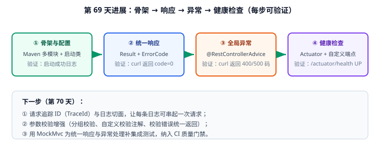

# 进展记录

本页记录周期 3 项目每一天的**构建步骤与验证结果**——做了什么、怎么验证、下一步是什么。这也是"项目以一个月为周期、每天推进一个可验证步骤"的落地凭据。



## 2026-09-14（第 69 天）：后端骨架 + 统一响应 + 全局异常 + 健康检查

### 本次做了什么

| 序号 | 产出 | 位置 | 对应需求 |
| --- | --- | --- | --- |
| ① | Maven 多模块骨架（聚合 POM、启动类、三套 Profile 配置） | [骨架与目录结构](../Skeleton/index.md) | R1、R7 |
| ② | 统一响应体 `Result<T>` + 错误码枚举 `ErrorCode` | [统一响应与全局异常](../CommonResponse/index.md) | R2、R3 |
| ③ | 全局异常处理 `GlobalExceptionHandler`（业务/校验/兜底三类） | [统一响应与全局异常](../CommonResponse/index.md) | R4 |
| ④ | Actuator 健康端点 + 业务就绪检查 + 演示接口 | [健康检查与配置](../HealthCheck/index.md) | R6 |

同时完成：模块依赖规则与接口契约的定稿，见[需求与架构设计](../Architecture/index.md)。

### 如何验证

```shell
# 1. 打包
cd backend-template
mvn -q clean package -DskipTests
# 预期：BUILD SUCCESS，且 template-application/target/template-application-1.0.0.jar 存在

# 2. 启动
java -jar template-application/target/template-application-1.0.0.jar
# 预期日志：Started TemplateApplication in x.x seconds（Tomcat 8080）

# 3. 四个端点逐个验证
curl -s http://localhost:8080/api/ping
curl -i -s http://localhost:8080/api/biz-error      # 期望 HTTP 409 + code 20001
curl -i -s "http://localhost:8080/api/boom?divisor=0"  # 期望 HTTP 500 + code 50000
curl -s http://localhost:8080/actuator/health       # 期望 {"status":"UP"}
curl -s http://localhost:8080/api/health/ready      # 期望 data.status = UP
```

验证结果记录（**请在本地执行后填写**，当前编写环境无 JDK/Maven，未实际运行）：

| 检查项 | 期望 | 实测 | 结论 |
| --- | --- | --- | --- |
| `mvn clean package` | BUILD SUCCESS | 待填写 | ⏳ |
| 启动日志 | `Started TemplateApplication` | 待填写 | ⏳ |
| `/api/ping` | `code=0, data=pong` | 待填写 | ⏳ |
| `/api/biz-error` | HTTP 409 + `code=20001` | 待填写 | ⏳ |
| `/api/boom?divisor=0` | HTTP 500 + `code=50000`，响应无堆栈 | 待填写 | ⏳ |
| `/actuator/health` | `{"status":"UP"}`，50ms 内 | 待填写 | ⏳ |
| `/api/health/ready` | `status=UP`（DB 可用时） | 待填写 | ⏳ |
| `/actuator/env` | 404（未暴露） | 待填写 | ⏳ |

### 遇到的问题与决策

| 问题 | 决策 | 原因 |
| --- | --- | --- |
| 统一响应用 `record` 还是 Lombok `@Data` | 用 `record` | 不可变、无注解处理器依赖；团队若需 JavaBean 可换回，契约不变 |
| `traceId` 字段先定契约 | 字段先占位，第 70 天接 MDC | 避免前端集成后二次改字段 |
| liveness 是否包含数据库检查 | 不包含 | 依赖抖动会导致实例被反复重启，引发雪崩 |
| Actuator 暴露范围 | 只开 `health,info,metrics` | `env`/`heapdump` 会泄露配置与内存数据 |

### 下一步（第 70 天）

1. **TraceId 链路**：`OncePerRequestFilter` 生成/透传 `X-Trace-Id` 并写入 MDC，让日志与 `Result.traceId` 串联。
2. **参数校验增强**：新增/更新分组校验（`@Validated(AddGroup.class)`）、自定义校验注解、校验错误统一返回字段级明细。
3. **集成测试**：用 `MockMvc` 把今天的 8 条 curl 验证写成自动化测试，接入 CI 质量门禁。

### 里程碑对照

| 阶段 | 计划 | 当前状态 |
| --- | --- | --- |
| 第 1 周（61-68 天） | 需求拆分、技术选型、架构与目录设计 | ✅ 完成 |
| 第 2 周（69-79 天） | 核心模块编码：骨架 → 响应/异常 → 校验/日志 → 数据访问 → 认证 | ⏳ 4/5 步待续（本次完成第 1 步） |
| 第 3 周（80-86 天） | 联调、单元与集成测试、压测、覆盖率门禁 | ⏳ 未开始 |
| 第 4 周（87-90 天） | Docker 化、Compose、CI 流水线、验收清单 | ⏳ 未开始 |

## 2026-09-15（第 70 天）：TraceId 链路 + 日志切面 + 参数校验增强 + MockMvc 集成测试

### 本次做了什么

| 序号 | 产出 | 位置 | 对应需求 |
| --- | --- | --- | --- |
| ⑤ | `TraceIdFilter` 生成/透传 `X-Trace-Id`、写入 MDC 并回传响应头；Logback pattern 带 `%X{traceId}` | [请求追踪 ID 与日志切面](../TraceId/index.md) | R5、R9 |
| ⑥ | `WebLogAspect` 统一记录接口入参、耗时与结果状态（成功/业务异常/系统异常三分支） | [请求追踪 ID 与日志切面](../TraceId/index.md) | R9 |
| ⑦ | 分组校验（Add/Update 组）、自定义 `@Mobile` 注解、字段级错误明细 `ValidationError` | [参数校验增强](../Validation/index.md) | R4、R8 |
| ⑧ | MockMvc 全链路契约测试（响应/异常/校验/TraceId）+ JaCoCo 覆盖率门禁 | [MockMvc 集成测试](../IntegrationTest/index.md) | R10 |

同时完成：第 69 天预留的 `Result.traceId` 占位**自动接上 MDC**，契约无需改动、代码零修改。

### 如何验证

```shell
cd backend-template

# 1. 编译 + 跑测试（含契约、校验、TraceId 用例）
mvn -q clean test
# 预期：Tests run: 8, Failures: 0, Errors: 0, Skipped: 0

# 2. 覆盖率门禁（低于 60% 会失败）
mvn -q verify
# 预期：BUILD SUCCESS，target/site/jacoco/index.html 行覆盖率 ≥ 60%

# 3. 启动后手工复核 TraceId 透传
java -jar template-application/target/template-application-1.0.0.jar &
curl -i -s -H "X-Trace-Id: demo-0001" http://localhost:8080/api/ping | grep -i x-trace-id
# 预期：X-Trace-Id: demo-0001
grep "demo-0001" logs/app.log    # 预期：访问 + 业务日志均带该 ID

# 4. 校验明细
curl -s -X POST http://localhost:8080/api/users -H 'Content-Type: application/json' \
  -d '{"username":"ab","password":"123","mobile":"12345"}'
# 预期：code=10400，data.fields 为 {字段: 提示}
```

验证结果记录（**请在本地执行后填写**，当前编写环境无 JDK/Maven，未实际运行）：

| 检查项 | 期望 | 实测 | 结论 |
| --- | --- | --- | --- |
| `mvn clean test` | 8 个用例全过 | 待填写 | ⏳ |
| `mvn verify` | 覆盖率 ≥ 60% | 待填写 | ⏳ |
| `X-Trace-Id` 透传 | 原样回显 | 待填写 | ⏳ |
| 无上游 ID | 生成非空 ID | 待填写 | ⏳ |
| 日志 pattern | 每行带 `[traceId]` | 待填写 | ⏳ |
| 字段级校验 | `data.fields` 结构正确 | 待填写 | ⏳ |
| 线程复用隔离 | 连续请求 ID 不串号 | 待填写 | ⏳ |

### 遇到的问题与决策

| 问题 | 决策 | 原因 |
| --- | --- | --- |
| traceId 在哪一层初始化 | Servlet Filter（`HIGHEST_PRECEDENCE`） | 早于 DispatcherServlet，能覆盖参数绑定与校验阶段的异常 |
| 上游 ID 是否信任 | 直接透传 | 网关已做生成；后端只做兜底，避免 ID 体系割裂 |
| 日志切面切多大范围 | 只切 `@RestController` | 切 Service/Mapper 会产生海量日志并影响性能 |
| 校验错误返回结构 | `data.fields` 用 `Map` | 前端逐字段高亮，比拼接字符串更好用 |
| 同字段多约束取哪条 | `putIfAbsent` 保留第一条 | 提示更贴近业务直觉（`@NotBlank` 在前） |
| 覆盖率门槛 | 60%，核心模块单独统计 | 防退化即可，不盲目冲高 |

### 下一步（第 71 天）

1. **数据访问**：接入 MyBatis-Plus（`MybatisPlusInterceptor` 分页插件）、`BaseMapper` 泛型封装。
2. **公共字段自动填充**：`MetaObjectHandler` 统一填 `createTime`/`updateTime`/`createBy`/`updateBy`。
3. **数据层集成测试**：用 H2 或 Testcontainers 跑真实 SQL，验证分页与逻辑删除。

### 里程碑对照

| 阶段 | 计划 | 当前状态 |
| --- | --- | --- |
| 第 1 周（61-68 天） | 需求拆分、技术选型、架构与目录设计 | ✅ 完成 |
| 第 2 周（69-79 天） | 核心模块编码：骨架 → 响应/异常 → 校验/日志 → 数据访问 → 认证 | ⏳ 2/5 步完成，数据访问与认证待续 |
| 第 3 周（80-86 天） | 联调、单元与集成测试、压测、覆盖率门禁 | ⏳ 已提前落地 MockMvc + JaCoCo 门禁 |
| 第 4 周（87-90 天） | Docker 化、Compose、CI 流水线、验收清单 | ⏳ 未开始 |

## 2026-09-16（第 71 天）：MyBatis-Plus 接入 + 分页 + 审计字段自动填充 + 数据层集成测试

### 本次做了什么

| 序号 | 产出 | 位置 | 对应需求 |
| --- | --- | --- | --- |
| ⑨ | `BaseEntity`（雪花 ID + 审计字段 + `@TableLogic` + `@Version`）与业务实体继承约定 | [数据访问：MyBatis-Plus 接入](../DataAccess/index.md) | R11 |
| ⑩ | `MybatisPlusInterceptor` 拦截器链：分页（含 `maxLimit` 封顶）→ 乐观锁 → 防全表更新/删除 | [数据访问：MyBatis-Plus 接入](../DataAccess/index.md) | R11、R12 |
| ⑪ | `AuditMetaObjectHandler`：插入填 `createTime/createBy/version/deleted`，更新填 `updateTime/updateBy` | [数据访问：MyBatis-Plus 接入](../DataAccess/index.md) | R11 |
| ⑫ | `PageResult<T>` 统一分页出参 + `IPage → PageResult` 转换，杜绝内部字段外泄 | [数据访问：MyBatis-Plus 接入](../DataAccess/index.md) | R2、R12 |
| ⑬ | 数据层集成测试（Testcontainers + MySQL 8.4）：填充/分页/逻辑删除/乐观锁 4 个用例 | [数据访问：MyBatis-Plus 接入](../DataAccess/index.md) | R10 |
| ⑭ | 建表脚本 `V1__init_user.sql`：审计列、逻辑删除列、`(username, deleted_at)` 唯一索引 | [数据访问：MyBatis-Plus 接入](../DataAccess/index.md) | R11 |

同时完成：第 70 天 `AuditMetaObjectHandler` 的 `UserContext.currentUserId()` 调用点已预留，第 72 天接入 JWT 后自动生效，**数据层代码无需改动**。

### 如何验证

```shell
cd backend-template

# 1. 结构自检：starter 与拦截器、填充器都在位
grep -n "mybatis-plus-spring-boot4-starter" template-data/pom.xml
# 预期：命中 1 行（Spring Boot 4.x 专用 starter，不是 boot3）

grep -rn "PaginationInnerInterceptor\|BlockAttackInnerInterceptor" template-data/src/main/java
# 预期：同一 MybatisPlusInterceptor 内按 ① ② ③ 注册

# 2. 数据层测试（Testcontainers 需本地 Docker）
mvn -q -pl template-data -am test
# 预期：Tests run: 4, Failures: 0, Errors: 0, Skipped: 0

# 3. 建表 + 启动
mysql -uroot -p template < template-application/src/main/resources/db/migration/V1__init_user.sql
mvn -q -pl template-application -am spring-boot:run &

# 4. 冒烟四连
curl -s -X POST http://localhost:8080/api/users -H 'Content-Type: application/json' \
  -d '{"username":"alice","mobile":"13800138000","email":"alice@example.com"}' | jq '.data'
# 预期：id 为 19 位字符串、createTime 非空、无 deleted 字段

curl -s "http://localhost:8080/api/users?pageNum=1&pageSize=999999" | jq '.data | {total, pageSize}'
# 预期：pageSize = 100（被封顶），total 为真实总数

curl -s -X DELETE http://localhost:8080/api/users/1 | jq .code     # 预期：0
mysql -uroot -p template -e "SELECT id,deleted FROM t_user WHERE id=1"  # 预期：行仍在，deleted=1
```

验证结果记录（**请在本地执行后填写**，当前编写环境无 JDK / Maven / Docker，未实际运行）：

| 检查项 | 期望 | 实测 | 结论 |
| --- | --- | --- | --- |
| starter 选型 | boot4 starter | 待填写 | ⏳ |
| 拦截器注册顺序 | 分页 → 乐观锁 → 防全表更新 | 待填写 | ⏳ |
| `mvn -pl template-data -am test` | 4 个用例全过 | 待填写 | ⏳ |
| 审计字段自动填充 | `create_time`/`create_by` 非空 | 待填写 | ⏳ |
| 雪花 ID | 19 位且序列化为字符串 | 待填写 | ⏳ |
| 分页 SQL | 日志出现 `LIMIT`，`total` 正确 | 待填写 | ⏳ |
| 页大小封顶 | `pageSize=999999` → 100 | 待填写 | ⏳ |
| 逻辑删除 | 查不到、表内 `deleted=1` | 待填写 | ⏳ |
| 乐观锁 | 陈旧 `version` 影响行数 0 | 待填写 | ⏳ |

### 遇到的问题与决策

| 问题 | 决策 | 原因 |
| --- | --- | --- |
| starter 用 boot3 还是 boot4 | `mybatis-plus-spring-boot4-starter` 3.5.17 | 模板基线是 Spring Boot 4.1.x；boot3 starter 会导致自动配置不生效 |
| ORM 选 MyBatis-Plus 还是 JPA | MyBatis-Plus | 业务后台以"单表 CRUD + 少量复杂 SQL"为主，MP 的 SQL 控制力与样板消除兼得 |
| 主键策略 | 雪花 ID（`assign_id`） | 为分库分表与数据迁移留路，不依赖数据库自增 |
| `MetaObjectHandler` 用哪个填充方法 | `strictInsertFill` / `strictUpdateFill` | 只在字段为 null 时填充，保留数据迁移场景的原始审计值 |
| 逻辑删除与唯一索引冲突 | 唯一索引建在 `(username, deleted_at)` | 既能"删后重建同名"，又比 `(username, deleted)` 支持多次删除 |
| 分页出参直接用 `IPage` 吗 | 转 `PageResult` | `IPage` 暴露 `orders`/`optimizeCountSql` 等内部字段，且容易带出敏感列 |
| 数据层测试用 H2 还是 Testcontainers | Testcontainers + MySQL 8.4 | H2 方言差异会掩盖真实 SQL 问题；无 Docker 时降级 H2 仅作结构验证 |
| Long 精度 | 全局序列化为字符串 | 雪花 ID 超 `2^53` 会在前端 JS 里末尾变 0 |

### 下一步（第 72 天）

1. **认证链路**：Spring Security 7 + JWT，`JwtAuthenticationFilter` 挂在 `TraceIdFilter` 之后，补 `UserContext` 实现（今天的审计填充点将自动生效）。
2. **接口鉴权**：`@PreAuthorize` + 自定义 `@HasPerm` 声明式权限。
3. **认证集成测试**：MockMvc 覆盖无 token（401）、过期 token（401）、越权（403）、正常（200）四类场景。

### 里程碑对照

| 阶段 | 计划 | 当前状态 |
| --- | --- | --- |
| 第 1 周（61-68 天） | 需求拆分、技术选型、架构与目录设计 | ✅ 完成 |
| 第 2 周（69-79 天） | 核心模块编码：骨架 → 响应/异常 → 校验/日志 → 数据访问 → 认证 | ⏳ 3/5 步完成，仅剩认证 |
| 第 3 周（80-86 天） | 联调、单元与集成测试、压测、覆盖率门禁 | ⏳ 已提前落地 MockMvc + JaCoCo + Testcontainers |
| 第 4 周（87-90 天） | Docker 化、Compose、CI 流水线、验收清单 | ⏳ 未开始 |

## 2026-09-17（第 72 天）：Spring Security 7 + JWT 无状态认证 + 声明式权限

### 本次做了什么

把模板从"裸接口"变成"默认安全"：

1. **依赖与版本**：`spring-boot-starter-security`（Spring Security 7.1.x）+ jjwt 0.13.0 三件套（`api` / `impl` / `jackson` 版本严格一致）+ `spring-boot-starter-data-redis`（刷新令牌与黑名单）。
2. **JWT 工具类**：[`JwtProperties`](../Security/index.md)（`@ConfigurationProperties` 承载 secret / ttl / issuer）与 `JwtTokenProvider`（`issueAccessToken` 带 `jti` / `sub` / `roles`，`parse` 校验签名、过期与 issuer）。
3. **过滤器链**：`SecurityConfig` 用 Lambda DSL 组装——`SessionCreationPolicy.STATELESS`、白名单精确列举、`addFilterBefore(jwtFilter, UsernamePasswordAuthenticationFilter.class)` 保证顺序是 **TraceIdFilter → JwtAuthFilter → AuthorizationFilter**。
4. **JWT 过滤器**：`OncePerRequestFilter` 解析 `Bearer` 令牌 → 查黑名单 → 写 `SecurityContext` → `MDC.put("userId")`，并在 `finally` 里清理 MDC 防止线程复用串号。
5. **用户上下文**：`UserContext.userId()` 从 `SecurityContext` 取当前用户，**把第 71 天 `AuditMetaObjectHandler` 预留的调用点接上**——`create_by` / `update_by` 从此写入真实用户 ID。
6. **统一异常出口**：`RestAuthenticationEntryPoint`（401）与 `RestAccessDeniedHandler`（403）都返回 `Result<T>`，前端只需一套解析逻辑，不再遇到 Spring 默认 HTML 错误页。
7. **声明式权限**：`@EnableMethodSecurity` + `@PreAuthorize`，示例覆盖 `hasAuthority` / `hasRole` / 用 `#id == authentication.principal.userId` 做数据级越权防护。
8. **配置与密钥**：`app.jwt.*` 走 `${JWT_SECRET}` 环境变量注入，长度要求 >= 32 字节（建议启动自检）。
9. **测试**：`SecurityIT` 四个 MockMvc 用例锁住"匿名 401 / 有效 200 / 越权 403 / 篡改 401"。
10. 新增示意图 `assets/security-auth-flow.svg`（过滤器链 + 登录签发 + 请求校验 + 异常出口四段）。

### 如何验证

```shell
# 环境要求：JDK 25、Maven 3.9+、Redis 8.x
cd backend-template
export JWT_SECRET="$(openssl rand -base64 48)"   # 长度必须 >= 32 字节

# 1. 编译并跑安全用例
mvn -q clean test -pl template-security -am
mvn -q test -pl template-web -Dtest=SecurityIT
# 预期：Tests run: 4, Failures: 0, Errors: 0, Skipped: 0

# 2. 启动
mvn -q -pl template-application -am spring-boot:run &
# 预期日志：Started TemplateApplication in x.xxx seconds

# 3. 匿名访问受保护接口
curl -s -o /dev/null -w "%{http_code}\n" http://localhost:8080/api/users
# 预期：401

curl -s http://localhost:8080/api/users
# 预期：{"code":40101,"message":"未登录或令牌已失效","data":null}

# 4. 登录拿令牌
curl -s -X POST http://localhost:8080/api/auth/login \
  -H 'Content-Type: application/json' \
  -d '{"username":"admin","password":"Admin@123"}' | jq '.data | {tokenType, expiresIn}'
# 预期：{"tokenType":"Bearer","expiresIn":1800}

# 5. 带令牌访问
TOKEN=$(curl -s -X POST http://localhost:8080/api/auth/login \
  -H 'Content-Type: application/json' \
  -d '{"username":"admin","password":"Admin@123"}' | jq -r '.data.accessToken')
curl -s http://localhost:8080/api/users -H "Authorization: Bearer $TOKEN" | jq .code
# 预期：0

# 6. 越权（普通用户删用户）
curl -s -o /dev/null -w "%{http_code}\n" -X DELETE http://localhost:8080/api/users/1 \
  -H "Authorization: Bearer $USER_TOKEN"
# 预期：403

# 7. 确认无状态：响应头不应出现 Set-Cookie
curl -sI http://localhost:8080/api/users -H "Authorization: Bearer $TOKEN" | grep -i "set-cookie" || echo "no session cookie (OK)"

# 8. 审计字段接上了真实用户
mysql -uroot -p template -e "SELECT id, create_by, update_by FROM t_user ORDER BY id DESC LIMIT 1"
# 预期：create_by 为登录用户 ID，不是 NULL / 0
```

验证结果记录（**请在本地执行后填写**，当前编写环境无 JDK / Maven / Redis，未实际运行）：

| 检查项 | 期望 | 实测 | 结论 |
| --- | --- | --- | --- |
| `SecurityIT` | 4 passed | 待填写 | ⏳ |
| 匿名访问 | 401 + 统一 Result 体 | 待填写 | ⏳ |
| 登录接口 | 返回 tokenType=Bearer | 待填写 | ⏳ |
| 带有效令牌 | code=0 | 待填写 | ⏳ |
| 普通用户删用户 | 403 | 待填写 | ⏳ |
| 篡改令牌 | 401 | 待填写 | ⏳ |
| `Set-Cookie` | 不出现（无 Session） | 待填写 | ⏳ |
| 审计字段 `create_by` | 等于登录用户 ID | 待填写 | ⏳ |

### 遇到的问题与决策

| 问题 | 决策 | 原因 |
| --- | --- | --- |
| JWT 还是 Session | JWT（无状态） | 目标是可水平扩容的 API 服务；实时吊销的短板用"短 Access + Redis 存 Refresh + `jti` 黑名单"补上 |
| HS256 还是 RS256 | 模板默认 HS256，文档给出 RS256 适用场景 | 单服务校验场景 HS256 配置最简单；多服务/第三方校验方持有公钥时再换 RS256 |
| 过滤器插在哪 | `addFilterBefore(..., UsernamePasswordAuthenticationFilter.class)` | 插在 `AuthorizationFilter` 之后会导致鉴权时 `SecurityContext` 为空，所有受保护接口 403 |
| 401 响应谁写 | 统一交给 `AuthenticationEntryPoint` | 过滤器里直接写响应会让"拦截器异常"和"过滤器异常"两套返回体，前端要写两套解析 |
| 角色 claim 存什么 | 存 `ROLE_ADMIN`（带前缀大写） | `hasRole('ADMIN')` 内部会拼 `ROLE_` 前缀，存 `ADMIN` 会永远 403 |
| `@PreAuthorize` 不生效怎么办 | 配置类必须加 `@EnableMethodSecurity` | 该注解缺失时**不报错也不生效**，接口看起来有保护实际完全开放，必须用测试锁住 403 |
| MDC 要不要清理 | `try/finally` 中 `MDC.remove("userId")` | Tomcat 线程池复用 ThreadLocal，不清理会出现"用户 A 的请求打上用户 B 的标识" |
| 密钥放哪 | 环境变量 `${JWT_SECRET}` 注入，不入库 | 写进 `application.yml` 等于随仓库泄露 |
| CSRF 要不要关 | 关（因为不用 Cookie 承载令牌） | 若改用 Cookie 承载令牌必须开启，并配双提交令牌 |

### 下一步（第 73 天）

1. **登录业务闭环**：`AuthService` 实现账号锁定（连续失败 5 次锁定 15 分钟）、密码强度校验、登录日志审计表。
2. **刷新与登出**：`/api/auth/refresh` 校验 Redis 中的 Refresh Token 有效性；`/api/auth/logout` 把 Access Token 的 `jti` 写入黑名单（TTL 设为剩余有效期）。
3. **测试扩充与门禁**：把"令牌过期""黑名单命中""Refresh 被复用"补进 `SecurityIT`，并把 401/403 用例纳入 JaCoCo 覆盖率门禁。

### 里程碑对照

| 阶段 | 计划 | 当前状态 |
| --- | --- | --- |
| 第 1 周（61-68 天） | 需求拆分、技术选型、架构与目录设计 | ✅ 完成 |
| 第 2 周（69-79 天） | 核心模块编码：骨架 → 响应/异常 → 校验/日志 → 数据访问 → 认证 | ✅ **5/5 步完成**，核心编码阶段收口 |
| 第 3 周（80-86 天） | 联调、单元与集成测试、压测、覆盖率门禁 | ⏳ 已提前落地 MockMvc + JaCoCo + Testcontainers + SecurityIT，待补压测 |
| 第 4 周（87-90 天） | Docker 化、Compose、CI 流水线、验收清单 | ⏳ 未开始 |

## 2026-09-18（第 73 天）：登录业务闭环 + 双令牌刷新与登出黑名单 + SecurityIT 扩到 8 用例

### 本次做了什么

第 2 周核心编码收口后，第 3 周（联调与测试）从"把认证补成业务闭环"开始：

| 序号 | 产出 | 位置 | 对应需求 |
| --- | --- | --- | --- |
| ⑮ | `AuthService` 登录闭环：账号连续失败 5 次锁定 15 分钟、成功清计数、统一错误码防账号枚举 | [登录业务闭环与令牌生命周期](../AuthLifecycle/index.md) | R13 |
| ⑯ | 自定义 `@StrongPassword` 校验器：8~64 位 + 四类字符取三 + 弱口令字典拦截 | [登录业务闭环与令牌生命周期](../AuthLifecycle/index.md) | R13 |
| ⑰ | 登录审计表 `t_login_log`（成功/失败、失败原因枚举、IP、UA）+ 建表脚本 `V2__init_login_log.sql` | [登录业务闭环与令牌生命周期](../AuthLifecycle/index.md) | R14 |
| ⑱ | 双令牌刷新：`TokenService.refresh` 校验 Redis 白名单、Refresh 一次性消费、复用即吊销全部会话 | [登录业务闭环与令牌生命周期](../AuthLifecycle/index.md) | R15 |
| ⑲ | 登出吊销：`/api/auth/logout` 把 Access 的 `jti` 写入黑名单（TTL = 剩余有效期）并删除 Refresh 记录 | [登录业务闭环与令牌生命周期](../AuthLifecycle/index.md) | R15 |
| ⑳ | `SecurityIT` 从 4 个用例扩到 8 个：过期令牌、黑名单命中、Refresh 复用、连续失败锁定 | [登录业务闭环与令牌生命周期](../AuthLifecycle/index.md) | R10、R16 |
| ㉑ | 新增示意图 `assets/auth-lifecycle.svg`（登录锁定 / 使用刷新 / 登出吊销 三段） | [登录业务闭环与令牌生命周期](../AuthLifecycle/index.md) | R14 |

同时完成：第 72 天遗留的三条"下一步"全部落地，认证模块从"能验令牌"升级为"能保护账号、能吊销令牌、能审计登录"。

### 如何验证

```shell
# 环境要求：JDK 25、Maven 3.9+、Docker（Testcontainers 拉 Redis）、MySQL 8.4
cd backend-template
export JWT_SECRET="$(openssl rand -base64 48)"

# 1. 建登录日志表
mysql -uroot -p template < template-application/src/main/resources/db/migration/V2__init_login_log.sql

# 2. 安全测试扩到 8 个用例
mvn -q clean test -pl template-security -am
mvn -q test -pl template-web -Dtest=SecurityIT
# 预期：Tests run: 8, Failures: 0, Errors: 0, Skipped: 0

# 3. 覆盖率门禁
mvn -q verify
# 预期：BUILD SUCCESS

# 4. 启动后联调
mvn -q -pl template-application -am spring-boot:run &

# 4.1 登录拿双令牌
PAIR=$(curl -s -X POST http://localhost:8080/api/auth/login \
  -H 'Content-Type: application/json' -d '{"username":"admin","password":"Admin@123"}')
ACCESS=$(echo "$PAIR" | jq -r '.data.accessToken'); REFRESH=$(echo "$PAIR" | jq -r '.data.refreshToken')
echo "$PAIR" | jq '.data | {tokenType, expiresIn}'    # 预期 {"tokenType":"Bearer","expiresIn":1800}

# 4.2 刷新一次（成功），再用同一个 Refresh（应 401）
curl -s -X POST http://localhost:8080/api/auth/refresh -H 'Content-Type: application/json' \
  -d "{\"refreshToken\":\"$REFRESH\"}" | jq .code     # 预期 0
curl -s -o /dev/null -w "%{http_code}\n" -X POST http://localhost:8080/api/auth/refresh \
  -H 'Content-Type: application/json' -d "{\"refreshToken\":\"$REFRESH\"}"   # 预期 401

# 4.3 登出后旧 Access 立即失效
curl -s -X POST http://localhost:8080/api/auth/logout -H "Authorization: Bearer $ACCESS" \
  -H 'Content-Type: application/json' -d "{\"refreshToken\":\"$REFRESH\"}" | jq .code   # 预期 0
curl -s -o /dev/null -w "%{http_code}\n" http://localhost:8080/api/users -H "Authorization: Bearer $ACCESS"  # 预期 401

# 4.4 连续失败 → 第 6 次锁定
for i in $(seq 1 6); do curl -s -o /dev/null -w "%{http_code} " -X POST \
  http://localhost:8080/api/auth/login -H 'Content-Type: application/json' \
  -d '{"username":"lockme","password":"wrong"}'; done; echo   # 预期 401 401 401 401 401 423

# 5. 登录审计可查
mysql -uroot -p template -e \
  "SELECT username, login_type, success, fail_reason, ip FROM t_login_log ORDER BY create_time DESC LIMIT 10"
```

验证结果记录（**请在本地执行后填写**，当前编写环境无 JDK / Maven / Docker / MySQL，未实际运行）：

| 检查项 | 期望 | 实测 | 结论 |
| --- | --- | --- | --- |
| `SecurityIT` | 8 passed | 待填写 | ⏳ |
| 过期令牌 | 401 | 待填写 | ⏳ |
| 黑名单令牌 | 401 | 待填写 | ⏳ |
| Refresh 复用 | 401 + 全量失效 | 待填写 | ⏳ |
| 连续 5 次失败 | 第 6 次 423 | 待填写 | ⏳ |
| 密码强度 | 弱密码被拒 | 待填写 | ⏳ |
| 登录审计 | 表内有成功/失败记录 | 待填写 | ⏳ |
| 登出后旧 Access | 401 | 待填写 | ⏳ |

### 遇到的问题与决策

| 问题 | 决策 | 原因 |
| --- | --- | --- |
| 账号不存在时返回什么 | 与密码错误同一错误码 | 否则可被用来枚举有效账号；差异只进审计日志 |
| 失败计数怎么存 | Redis `auth:fail:{username}` + `auth:lock:{username}` | 计数需 TTL，锁定需显式标记，两者职责不同 |
| 锁定是计数还是标记 | 两者都要 | 只看计数会在过期瞬间被继续爆破；标记才有明确窗口 |
| 黑名单 TTL 怎么定 | 等于 Access 剩余有效期 | 固定值会提前失效或长期占内存 |
| Refresh 能否重复用 | 不能，一次性消费 | 可重放等于给了攻击者永久钥匙 |
| Refresh 复用时怎么办 | 吊销该用户全部会话 | 无法区分攻击者与用户本人，宁可全部重登 |
| 刷新后旧 Access 怎么办 | 随新 Refresh 一起轮换 | 只发新 Access 会让旧 Access 在多会话下继续可用 |
| 登录日志写入时机 | 独立事务（失败也不回滚登录） | 审计失败不应影响业务结果 |
| 能否靠锁定防爆破 | 只能缓解 | 攻击者可故意锁定他人（DoS），生产需叠 IP 维度与验证码 |

### 下一步（第 74 天）

1. **压测与性能基线**：用 JMeter / `wrk` 压测 `/api/auth/login` 与受保护接口，产出 TPS / P95 基线，确认 JWT 校验与 Redis 查询不是瓶颈。
2. **覆盖率补齐**：把 `template-security` 模块覆盖率目标从 60% 提到 75%，纳入 CI 门禁。
3. **契约回归**：用 springdoc-openapi 产出的 OpenAPI 文档做接口契约回归，防止联调期接口悄悄变形。

### 里程碑对照

| 阶段 | 计划 | 当前状态 |
| --- | --- | --- |
| 第 1 周（61-68 天） | 需求拆分、技术选型、架构与目录设计 | ✅ 完成 |
| 第 2 周（69-72 天） | 核心模块编码：骨架 → 响应/异常 → 校验/日志 → 数据访问 → 认证 | ✅ **4/4 步完成**，核心编码阶段收口 |
| 第 3 周（73-79 天） | 联调、单元与集成测试、压测基线、覆盖率与契约门禁 | 🔄 **进行中**：认证闭环联调完成、SecurityIT 8 用例、压测基线 + 覆盖率门禁 + 契约回归已就位 |
| 第 4 周（80-90 天） | Docker 化、Compose、CI 流水线、验收清单 | ⏳ 未开始 |

## 2026-09-19（第 74 天）：性能基线 + 覆盖率补齐到 75% + OpenAPI 契约回归

第 73 天收口了认证业务闭环，但整个模板仍然没有一个**可量化的性能数字**，测试覆盖也没有"不达标就不许合"的硬约束。第 74 天把这三件"说不清的事"变成 CI 能判定的东西。

### 本次做了什么

| 序号 | 产出 | 位置 |
| --- | --- | --- |
| ① | k6 压测脚本：登录 + 受保护接口双场景、`thresholds` 直接作门禁 | `scripts/perf/login-and-api.js` |
| ② | 基线记录格式（环境 + 数据量 + 脚本版本三要素）与结果表 | [压测与性能基线](../PerformanceTest/index.md) |
| ③ | JaCoCo 0.8.15 三段配置：`prepare-agent` / `report` / `check`，**按模块设阈值** | `pom.xml`（父 POM `pluginManagement`） |
| ④ | 覆盖率门禁：`template-security` 行覆盖 ≥ 75%，绑定 `verify` 阶段 | [压测与性能基线](../PerformanceTest/index.md) |
| ⑤ | springdoc-openapi 3.1.x 契约导出脚本（`jq -S` 排序入库） | `scripts/export-openapi.sh` |
| ⑥ | 契约回归比对脚本：diff 出破坏性变更并以非 0 退出码拦截 | `scripts/check-openapi-contract.sh` |
| ⑦ | 三道门禁的 CI 接入与豁免规则（覆盖率 / 契约 / 基线） | [压测与性能基线](../PerformanceTest/index.md) |

同时修正：项目总览里的 springdoc 版本口径由 `2.x 线` 改为 `3.x 线`（Boot 4.x 必须用 3.x，2.x 会启动失败）。

### 如何验证

```shell
# 1. 覆盖率门禁
mvn -q verify
# 期望：BUILD SUCCESS；报告在 template-security/target/site/jacoco/index.html
# 反向验证：把 minimum 临时改成 99% → 期望 BUILD FAILURE

# 2. 契约导出与比对
mvn -q -pl template-application -am spring-boot:run &
./scripts/export-openapi.sh                    # 首次：生成快照
git add docs/openapi/openapi.json && git commit -m "chore: 新增 OpenAPI 契约快照"
./scripts/check-openapi-contract.sh            # 期望 exit 0

# 3. 反向验证契约门禁能拦住破坏性变更
#    把 @GetMapping("/api/users") 改成 "/api/user" 后重新比对
./scripts/check-openapi-contract.sh            # 期望 exit 1，diff 中出现被删除的路径

# 4. 压力基线
PERF_USER=perfuser PERF_PASS='Perf@12345' \
  k6 run --summary-export=docs/perf/baseline-k6-login.json scripts/perf/login-and-api.js
# 期望：thresholds 全部通过，退出码 0

# 5. Swagger UI
curl -s -o /dev/null -w "%{http_code}\n" http://localhost:8080/swagger-ui.html   # 期望 302/200
```

验证结果记录（**请在本地执行后填写**，当前编写环境无 JDK / Maven / MySQL / Redis / k6，未实际运行）：

| 检查项 | 期望 | 实测 | 结论 |
| --- | --- | --- | --- |
| `mvn verify` 覆盖率门禁 | BUILD SUCCESS | 待填写 | ⏳ |
| 阈值改 99% 反向验证 | BUILD FAILURE | 待填写 | ⏳ |
| `docs/openapi/openapi.json` 生成 | 存在且 > 5KB | 待填写 | ⏳ |
| 契约比对（入库后） | exit 0 | 待填写 | ⏳ |
| 改路径后契约比对 | exit 1 且指出删除路径 | 待填写 | ⏳ |
| k6 thresholds | 全部通过、退出码 0 | 待填写 | ⏳ |
| 登录接口基线 | TPS / P95 记录进 `docs/perf/` | 待填写 | ⏳ |
| 受保护接口基线 | TPS / P95 记录进 `docs/perf/` | 待填写 | ⏳ |

### 遇到的问题与决策

| 问题 | 决策 | 原因 |
| --- | --- | --- |
| 压测工具选哪个 | 基线用 k6，极限初筛用 wrk，存量 JMeter 保留 | 只有 k6 能把"指标不达标"变成非 0 退出码，门禁才能自动化 |
| 覆盖率用一个全局阈值行不行 | 不行，按模块设（common 80 / web 70 / security 75 / data 60） | 各模块代码性质不同，全局值会被高低互相抵消，等于没约束 |
| 覆盖率报告要不要入库 | 只入库 XML/摘要，HTML 不入库 | HTML 体积大且每次构建都变 |
| 契约快照要不要排序 | 要（`jq -S`） | 不排序会因字段顺序抖动产生假 diff，门禁很快被无视 |
| 契约门禁放 PR 还是夜间 | 放 PR | 契约变化必须当场可见，性能反而可以滞后 |
| 性能门禁放 PR 吗 | 不放，放夜间 + 发版前 | 机器噪声会让告警常态红；PR 只跑 1 VU 冒烟看错误率 |
| 压测能用 admin 吗 | 不能，用专用 `perfuser` | 审计表被淹没，且锁定策略会把压测账号锁在 423 |
| 怎么证明 JWT/Redis 不是瓶颈 | 三条对照：接口对照（ping vs users）、中间件指标（Redis OPS / MySQL 堆积）、临时打点 | 单一指标容易被"整体变慢"掩盖，需要交叉验证 |
| 打点日志能常驻吗 | 不能，排查完必须移除 | 高 TPS 下日志本身成为瓶颈 |

### 下一步（第 75 天）

1. **Docker 化**：`template-application` 多阶段构建（构建层 JDK 25、运行层 JRE 25 slim），确认镜像体积与启动时间。
2. **Compose 一键起**：应用 + MySQL 8.4 + Redis 8 编排，用 `depends_on: condition: service_healthy` 表达依赖顺序。
3. **配置外置**：数据库 / Redis 连接与令牌密钥全部改为环境变量注入，为 CI 流水线与验收清单铺路。

### 里程碑对照

| 阶段 | 计划 | 当前状态 |
| --- | --- | --- |
| 第 1 周（61-68 天） | 需求拆分、技术选型、架构与目录设计 | ✅ 完成 |
| 第 2 周（69-72 天） | 核心模块编码：骨架 → 响应/异常 → 校验/日志 → 数据访问 → 认证 | ✅ **4/4 步完成** |
| 第 3 周（73-79 天） | 联调、单元与集成测试、压测基线、覆盖率与契约门禁 | 🔄 **2/4 步完成**：联调闭环 ✅、性能与契约门禁 ✅，待补边界用例与测试数据隔离 |
| 第 4 周（80-90 天） | Docker 化、Compose、CI 流水线、验收清单 | ⏳ 未开始 |

## 参考资料

- 项目总览：[后端通用模板](../index.md)
- 各日模块页：[骨架与目录结构](../Skeleton/index.md) ｜ [统一响应与全局异常](../CommonResponse/index.md) ｜ [健康检查与配置](../HealthCheck/index.md) ｜ [请求追踪 ID 与日志切面](../TraceId/index.md) ｜ [参数校验增强](../Validation/index.md) ｜ [MockMvc 集成测试](../IntegrationTest/index.md) ｜ [数据访问：MyBatis-Plus 接入](../DataAccess/index.md) ｜ [认证授权：Spring Security 7 + JWT](../Security/index.md) ｜ [登录业务闭环与令牌生命周期](../AuthLifecycle/index.md)
- 相关文档：[Spring Boot 通用指南](../../../../docs/Backend/Java/Frame/SpringBoot/Common/index.md)
