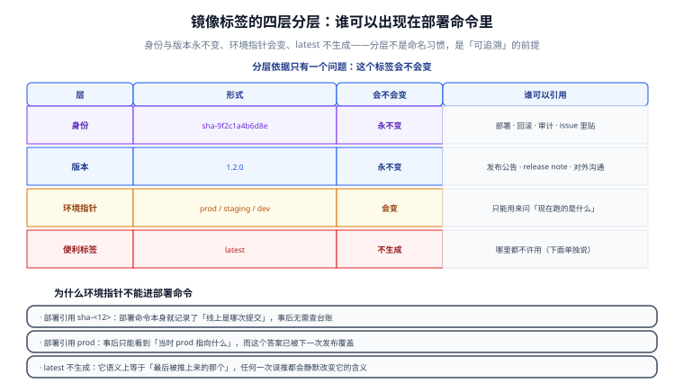
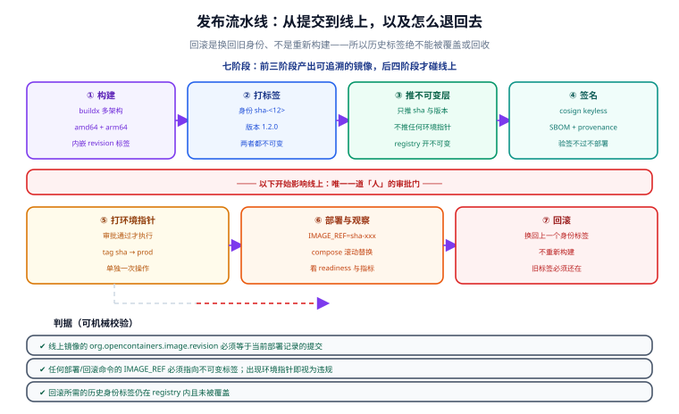

# 镜像推送与发布策略：从「构建成功」到「能退回去」

第 79 天把门禁串成了流水线，镜像能被构建出来了。但**「镜像构建成功」离「可以发布」还隔着一整套约定**：镜像从哪个仓库拉、对应哪一次提交、出事之后怎么退回去。这一步听起来像是运维细节，实际上它决定了事故发生时你手里有没有牌。

## 一句话定位

发布的本质是**把「线上跑的是哪一次提交」这个问题的答案固化下来**。判据一句话：随便挑一个线上实例，从它运行的镜像身上就能读出提交号，不需要查任何台账。

## 发布要回答的五个问题

| 提问 | 由谁回答 | 答不上来的后果 |
| --- | --- | --- |
| 这是哪一次提交？ | 镜像内嵌的 `org.opencontainers.image.revision` | 只能靠人回忆「昨天下午那次是谁发的」 |
| 这个镜像从哪来？ | 带完整 registry 前缀的镜像名 | 默认 registry 会拉错仓库，尤其是内网多 registry 时 |
| 是谁构建的？ | `provenance` 证明（buildx 生成） | 无法区分「CI 构建的」和「某人笔记本上构建的」 |
| 改动过没有？ | `cosign` 签名与验签 | 中间人替换镜像不会被发现 |
| 出事退到哪？ | 上一个身份标签仍在 registry 里 | 只能「重新构建一版假装是旧的」，等价性无法证明 |

::: tip 一句话理解
发布策略不是「怎么把镜像推上去」，而是**「事后能不能证明推上去的是你以为的那个东西」**。前半句是操作，后半句才是需求。
:::

## 镜像命名与仓库模型

镜像名的结构是 `<registry>/<namespace>/<repo>:<tag>`。三段各有归属：

| 段 | 例子 | 谁决定 | 常见错误 |
| --- | --- | --- | --- |
| registry | `reg.example.com` | 公司基础设施 | 不写 registry，靠 docker 默认值，内网直接拉错 |
| namespace | `team` / `backend` | 团队或产品线 | 所有服务挤在同一个 namespace 下，权限无法分级 |
| repo | `backend-template` | 一个可独立部署的应用 | 一个 repo 装多个应用，标签含义被迫复用 |
| tag | `sha-9f2c1a4b6d8e` | **本页的主角** | 见下一节 |

一条实践约定：**一个可独立部署的应用一个 repo**。把「Web 层」和「Worker 层」打进同一个 repo 的不同标签，会让「这个标签对应哪一次提交」立刻变得需要解释——而需要解释的东西，事故现场没人有空解释。

## 标签分四层，依据只有一个问题：它会不会变



| 层 | 形式 | 会不会变 | 谁可以引用 |
| --- | --- | --- | --- |
| 身份 | `sha-9f2c1a4b6d8e` | 永不变 | 部署、回滚、审计、issue 里贴 |
| 版本 | `1.2.0` | 永不变 | 发布公告、release note、对外沟通 |
| 环境指针 | `prod` / `staging` / `dev` | **会变** | 只能用来问「现在跑的是什么」 |
| 便利标签 | `latest` | **不生成** | 哪里都不许用 |

层数不多，但**分层依据必须是「会不会变」而不是「名字好不好看」**。这个依据一旦站住，后面所有规则都是推论。

### 为什么环境指针不能出现在部署命令里

看两条命令的差别：

```shell
# 写法一：部署引用环境指针
IMAGE_REF=reg.example.com/team/backend-template:prod docker compose up -d

# 写法二：部署引用身份标签
IMAGE_REF=reg.example.com/team/backend-template:sha-9f2c1a4b6d8e docker compose up -d
```

写法一执行成功后，「线上跑的是什么」这个问题的答案变成了「**当时 `prod` 指向什么**」。而 `prod` 在下一次发布时会被覆盖——也就是说，**答案的有效期只到下一次发布为止**。出事之后想复盘「当时上线的是哪次提交」，已经查不到了，只能去翻发布记录、聊天记录、CI 日志，然后祈祷有人记对了。

写法二把这个答案**写进了部署命令本身**：命令里就是提交号，谁来读都读得到。

### 为什么 `latest` 干脆不生成

`latest` 在语义上等于「最后被推上来的那个」。它不是「最新版本」，它只是「推送顺序的副产品」。两个后果：

1. **任何一次误推都会静默改变它的含义。** 某人在本地 build 了一版调试镜像顺手 `--push`，`latest` 就指过去了，而集群下次拉取时才会发现。
2. **它不能回答任何问题。** 问它「是哪次提交」，它答不上来；问它「是不是测试过的版本」，也答不上来。

所以本项目的约定是：**工具不生成 `latest`，流水线不推送 `latest`，部署配置不引用 `latest`**——三道都堵上，最后一道由 `tagplan.py` 的 INV3 机械校验。

### 「不可变」不能只是约定，得由 registry 强制

身份标签之所以能当身份，前提是它**真的覆盖不了**。默认情况下 Docker registry 允许用同名标签覆盖推送，这意味着：

```shell
# 灾难现场：有人用同一个身份标签推了不同的镜像
docker tag my-local-build reg.example.com/team/backend-template:sha-9f2c1a4b6d8e
docker push reg.example.com/team/backend-template:sha-9f2c1a4b6d8e
```

此刻起，**同一个标签在不同节点上可能对应不同镜像**。滚动重启时旧节点拉到的和线上跑的不是一个东西，「这个镜像经过了测试」这句话也随之失效。

::: danger 必须开启 registry 的标签不可变策略
不同 registry 的开关名字不同（Harbor 是项目级的「镜像不可变」规则，ECR 是 tag immutability，在 Artifact Registry 上是 tag immutability policy），但要做的事一样：**对 `sha-*` 与版本号这类标签，拒绝覆盖推送**。

开启后上面那条 `docker push` 会直接返回 409，事故被拦在推送这一步，而不是在半夜的滚动重启里。**约定要落成配置，否则它只是意愿。**
:::

## 发布流水线七阶段



七阶段里，**前四个阶段只产出「可追溯的镜像」，第五阶段才开始碰线上**。这条分界线很重要：前三阶段全部失败也不影响线上，第五阶段之后每一次操作都要有回滚路径。

### ① 构建：多架构、内嵌提交号、附带证明

```shell
docker buildx build \
    --platform linux/amd64,linux/arm64 \
    --provenance=true --sbom=true \
    --label org.opencontainers.image.revision=9f2c1a4b6d8e0f1a2b3c4d5e6f708192a3b4c5d6 \
    -t reg.example.com/team/backend-template:sha-9f2c1a4b6d8e \
    -t reg.example.com/team/backend-template:1.2.0 \
    --push .
```

三点值得单独说：

- **多架构不是加分项而是必需品**：开发机是 arm64（Apple Silicon、部分云主机），生产是 amd64。只推 amd64 会导致开发机上 `docker run` 报 `no matching manifest`，然后有人开始用 `--platform` 乱压。
- **`org.opencontainers.image.revision` 是镜像自证身份的唯一手段**。它写在镜像配置里，`docker image inspect` 就能读出来，不依赖任何外部台账。
- **`--provenance=true --sbom=true` 产出的是证明文件**（谁构建的、从哪个提交、用了什么基座），配合第 ④ 步的签名，才构成「镜像没被替换过」的完整证据链。

### ② 打标签：身份与版本一起打，环境指针先不动

身份标签回答「哪次提交」，版本标签回答「第几个发布」。两者都在这一步打上，且都不可变。环境指针**不在这时打**——因为此时还没审批。

### ③ 只推不可变层

推送阶段只推 `sha-*` 与版本号两个标签。环境指针留给第 ⑤ 步单独推。这么拆的收益是**权限可以分开**：CI 的角色有推 `sha-*` 的权限，但推 `prod` 需要另一条审批链路。混在一起推的话，任何能跑 CI 的人都能直接改生产指针。

### ④ 签名与验签

```shell
cosign sign --yes reg.example.com/team/backend-template:sha-9f2c1a4b6d8e
cosign sign --yes reg.example.com/team/backend-template:1.2.0
```

使用 keyless 模式（基于 CI 的 OIDC 身份签发短期证书，不需要长期私钥）。**关键在于验证侧**：部署前必须验签，否则签名只是仪式。

```shell
# 部署前的验签：不通过就不部署
cosign verify \
    --certificate-identity-regexp '^https://github.com/example/.+$' \
    --certificate-oidc-issuer https://token.actions.githubusercontent.com \
    reg.example.com/team/backend-template:sha-9f2c1a4b6d8e
```

::: warning 验签的两条纪律
1. **`--certificate-identity-regexp` 必须收窄到自己的仓库**。留空或写成 `.+` 等于「任何人的签名都算数」。
2. **验签失败要阻断部署，而不是打警告**。签名体系的价值 100% 来自「验不过就不让上」这一条。
:::

### ⑤ 审批后才推环境指针

```shell
docker tag reg.example.com/team/backend-template:sha-9f2c1a4b6d8e \
           reg.example.com/team/backend-template:prod
docker push reg.example.com/team/backend-template:prod
```

这是整条流水线里**唯一一次会改变线上语义的操作**，也是唯一需要人工审批的环节。把「有权限改 prod 指针」收窄到最少的人，同时保留「有权限推 sha 镜像」给所有能跑 CI 的人——风险与便利分开了。

### ⑥ 部署与观察

```shell
IMAGE_REF=reg.example.com/team/backend-template:sha-9f2c1a4b6d8e \
  docker compose -f compose.yaml -f compose.prod.yaml up -d
```

部署命令里显式给出 `IMAGE_REF`，而不是让 compose 自己去读某个环境指针。这样部署动作与它对应用的信息**在同一条命令里**，日志滚动过去也还在。

### ⑦ 回滚：换回旧身份，不是重新构建

```shell
IMAGE_REF=reg.example.com/team/backend-template:sha-0123456789ab \
  docker compose -f compose.yaml -f compose.prod.yaml up -d
```

回滚是**把引用换回上一个身份标签**。这里有一个容易被忽略的推论：

::: danger 回滚能力取决于旧标签还在不在
如果有人觉得「历史镜像占空间」而清理掉旧标签，回滚能力随之消失。**「重新构建一版当时的代码」不叫回滚**——因为重新构建还要重新拉当时的基础镜像、重新解析依赖，产出的东西是否等价于出事时线上那个镜像，谁也证明不了。

所以镜像清理策略必须给**至少 N 个历史版本**留位置（N 取「上一个稳定版本 + 当前版本 + 若干回滚候选」），不能按「最近一次」保留。
:::

## 发布策略三档：滚动 / 蓝绿 / 金丝雀

| 策略 | 怎么切流量 | 优点 | 代价 | 适用 |
| --- | --- | --- | --- | --- |
| 滚动替换 | 逐个替换实例，新旧并存一段时间 | 资源开销最小、无需额外环境 | 发布过程中两个版本同时服务，**必须向前向后兼容** | 无状态服务、接口变更向后兼容 |
| 蓝绿 | 新环境全量部署好，一次性切换入口 | 回滚就是切回旧环境，秒级 | 需要两套资源 | 资源充足、要求秒级回滚 |
| 金丝雀 | 先放少量实例/少量流量，观察后再扩 | 风险面最小，问题只影响少量用户 | 链路最复杂，需要按比例分流与自动判定 | 大流量、变更风险高 |

本模板选择**滚动替换**，理由是它不需要额外基础设施，代价是必须守住接口兼容性——这与第 77 天异常路径收口、第 79 天契约破坏性变更拦截在逻辑上是一件事：**滚动发布的兼容性要求，正是契约门禁存在的理由**。

### 滚动发布必须配 readiness 探针

滚动替换能安全进行的前提是「编排层知道新实例什么时候真的能收流量」。这要求两者分开：

| 探针 | 回答的问题 | 配错了会怎样 |
| --- | --- | --- |
| `livenessProbe` / healthcheck | 进程还活着吗？ | 配成「能对外服务吗」，会导致依赖抖动时**进程被反复重启**，越重越慢 |
| `readinessProbe` | 能收流量了吗？ | 配错了（或用同一个端点），会在预热未完成时就放流量进来，表现为**发布瞬间的 5xx 尖刺** |

::: tip 为什么两个探针要分开
应用启动时要建连接池、预热缓存、拉配置，这段过程可能持续几秒到几十秒。这段时间里进程**活着但还不能服务**——这正是 readiness 存在的原因。用 liveness 承担这个职责，会让「还没准备好」被误判成「已经坏了」。
:::

## 回滚的前提条件

回滚不只是把镜像换回去。有三件事必须先确认，否则「回滚成功」只是个假象：

1. **数据结构兼容**。如果本次发布带了破坏性数据库变更（删列、改类型），换回旧镜像后旧代码读新结构可能直接报错。这正是第 79 天迁移六步法里「破坏性变更拆两次发布」的由来——**回滚能力是发布前设计的，不是事后补救的**。
2. **旧配置还在**。配置走环境变量的代价是：回滚时变量也要一起退回。配置项改名属于**破坏性变更**，同样要按两次发布处理。
3. **外部副作用不随镜像回滚**。已发出的消息、已写的外部系统记录不会跟着退回去。对这类操作，回滚是「止血」而不是「复原」，需要单独的人工处置流程。

## 可执行交付物：`Release/tagplan.py`

发布策略里最容易错的那部分（标签分层与「谁可以出现在部署命令里」）**与 Docker、registry 都无关**，因此可以完全离线验证。这一部分被抽成了工具：

```text
project/Base/BackendTemplate/
├─ Release/
│  ├─ index.md       # 本页
│  ├─ tagplan.py     # 标签计划生成与校验（零第三方依赖）
│  └─ selftest.py    # 88 项断言
```

### 六条不变量

| 编号 | 不变量 | 违反了会发生什么 |
| --- | --- | --- |
| INV1 | 身份层**恰好一个** `sha-<12位小写hex>`，且等于传入 sha 的前 12 位 | 两个身份标签等于没有身份；回滚会指错镜像 |
| INV2 | 版本标签符合严格语义化版本（不接受 `1.2`、`v1.2.0`、`1.2.0+build9`） | 版本号无法排序，无法回答「上一版是哪个」 |
| INV3 | 命令里**任何位置**不出现 `:latest` | 不可追溯，且会被误推静默改写 |
| INV4 | `deploy` / `rollback` 的 `IMAGE_REF` 必须落在可引用的不可变集合内 | 引用环境指针 = 事后查不到当时跑的是哪次提交 |
| INV5 | 环境指针必须是枚举值之一，且不得与不可变层重名 | 三套写法指向同一环境却互不知情；重名会原地覆盖身份层 |
| INV6 | 预发布版本不得生成 `prod` 指针 | 「生产在跑 rc」这件事无人察觉 |

::: warning INV4 为什么不要求「必须是本次构建的产物」
回滚**必须**能指向不是本次构建产出的镜像，否则回滚只能靠重新构建"实现"，那不叫回滚。因此 INV4 的可引用集合是「本次的身份/版本标签 ∪ 上一个发布的身份标签」，而不是「本次的标签」——这条在自测里被抓出来过一次（见下方「过程中的两次修正」）。
:::

### 用法

```shell
cd project/Base/BackendTemplate/Release

# 生成计划（人读）
python tagplan.py --version 1.2.0 \
  --sha 9f2c1a4b6d8e0f1a2b3c4d5e6f708192a3b4c5d6 \
  --previous-sha 0123456789abcdef0123456789abcdef01234567 \
  --channel prod

# 生成计划（机器读，喂给流水线）
python tagplan.py --version 1.2.0 --sha <40位hex> --channel prod --json

# 校验一份既有计划（CI 门禁：任何人改过计划都要过这一关）
python tagplan.py --verify plan.json

# 自测：88 项断言 + 11 组全组合扫描
python selftest.py
```

### 实测输出（节选）

```text
镜像前缀 : reg.example.com/team/backend-template
提交     : 9f2c1a4b6d8e0f1a2b3c4d5e6f708192a3b4c5d6  →  身份标签 sha-9f2c1a4b6d8e
版本     : 1.2.0
环境指针 : prod

标签计划：
  [不可变] reg.example.com/team/backend-template:sha-9f2c1a4b6d8e   (identity)
  [不可变] reg.example.com/team/backend-template:1.2.0   (version)
  [会变  ] reg.example.com/team/backend-template:prod   (channel)

命令：
  # deploy
  IMAGE_REF=reg.example.com/team/backend-template:sha-9f2c1a4b6d8e docker compose -f compose.yaml -f compose.prod.yaml up -d

  # rollback
  IMAGE_REF=reg.example.com/team/backend-template:sha-0123456789ab docker compose -f compose.yaml -f compose.prod.yaml up -d
```

违规输入会被拒绝并给出退出码 1：

```text
$ python tagplan.py --version 1.3.0-rc.1 --sha <40位hex> --channel prod
FAIL: 预发布版本 1.3.0-rc.1 不得打 prod 环境指针：预发布与生产是两种发布，用同一个指针会让「生产在跑 rc」这件事无人察觉
$ echo $?
1
```

### 过程中的两次修正（工具与自测互相纠错）

写自测时抓出两个真问题，两次都是**改工具而不是改测试**：

1. **INV3 原先只看命令的首个 token。** `docker run <base>:latest` 的首个 token 是 `docker`，真正的镜像引用在第三个 token 上——恰恰是事故现场最常见的写法，却检不出来。改为逐 token 扫描。
2. **INV4 原先要求引用的标签必须属于本次计划。** 这让回滚命令永远违规：回滚本来就该指向上一个发布的身份标签，它不是本次构建的产物。改为「本次标签 ∪ 上一个发布的身份标签」。

第 2 条是一个值得记住的类型：**当一个校验规则让「正确的操作」永远违规时，要怀疑规则而不是操作**。

## 验证方式

| 检查 | 命令 | 预期 | 状态 |
| --- | --- | --- | --- |
| 自测全过 | `python selftest.py` | `selftest: 88/88 通过（全组合扫描 11 组）`，退出码 0 | ✅ 已实测 |
| 正常计划生成 | `python tagplan.py --version 1.2.0 --sha <40位hex> --channel prod` | 输出三层标签与 7 组命令，退出码 0 | ✅ 已实测 |
| 预发布打 prod 被拒 | 同上但 `--version 1.3.0-rc.1` | `FAIL: ... 不得打 prod 环境指针`，退出码 1 | ✅ 已实测 |
| 计划校验 | `python tagplan.py --verify plan.json` | `OK: plan.json 通过全部不变量（INV1~INV6）` | ⏳ 待填写 |
| registry 标签不可变已开启 | 重复推同一 `sha-*` 标签 | 返回 409 而非覆盖成功 | ⏳ 待填写 |
| 部署镜像自证身份 | `docker image inspect <ref>` 读出 revision 注解 | 输出等于当前部署记录的提交号 | ⏳ 待填写 |
| 验签阻断 | 用未签名镜像尝试部署 | 流水线在验签步骤失败，不进入部署 | ⏳ 待填写 |
| 回滚可执行 | 用上一个身份标签重新部署 | 服务恢复，且日志中出现旧提交号 | ⏳ 待填写 |

## 常见坑

::: danger 六个会让「可追溯」失效的写法
1. **部署引用 `latest` 或环境指针。** 当下能跑，但事后无法回答「当时是哪个提交」。改用身份标签。
2. **用同一个 `sha-*` 标签推两次不同的镜像。** 直接摧毁标签的语义。开启 registry 的标签不可变策略，让它在推送层就失败。
3. **清理历史镜像时按「时间最近」保留。** 回滚能力随之消失。保留策略要按「上一稳定版 + 当前版 + 回滚候选」定。
4. **`cosign verify` 的 `--certificate-identity-regexp` 留空或过宽。** 等于「任何人的签名都算数」，签名体系形同虚设。
5. **把 `livenessProbe` 指向一个依赖数据库的端点。** 数据库抖动会让健康检查失败，编排层认为进程坏了开始重启，**雪上加霜**。liveness 只问「进程还在吗」。
6. **发布时同时带上破坏性数据库变更。** 一旦回滚，旧镜像读新结构直接报错。破坏性变更必须拆两次发布。
:::

::: tip 三个顺手能做的小事
1. 把构建出的 `sha-*` 标签贴进 PR 评论或 issue，让「这个改动对应的镜像」一眼可查。
2. 在 CI 里打印 `docker image inspect` 读出的 `revision` 标签，与 `github.sha` 比对——一条断言就防住「标签与内容不符」。
3. 每次发布后在 `Progress/index.md` 记一行「提交 → 身份标签 → 环境指针」，这是最便宜的可追溯台账。
:::

## 参考资料

- [Docker · Build attestations（provenance 与 SBOM）](https://docs.docker.com/build/attestations/)
- [Docker · Multi-platform builds](https://docs.docker.com/build/building/multi-platform/)
- [OCI Image Format Specification · Annotations](https://github.com/opencontainers/image-spec/blob/main/annotations.md)
- [Sigstore Cosign · Verifying signatures](https://docs.sigstore.dev/cosign/verifying/verify/)
- [Kubernetes · Configure Liveness, Readiness and Startup Probes](https://kubernetes.io/docs/tasks/configure-pod-container/configure-liveness-readiness-startup-probes/)
- 本库相关：[CI 流水线：把门禁串成一条链](./../CI/index.md) ｜ [容器化：多阶段镜像与 Compose 编排](./../Deployment/index.md) ｜ [进展记录](./../Progress/index.md)
