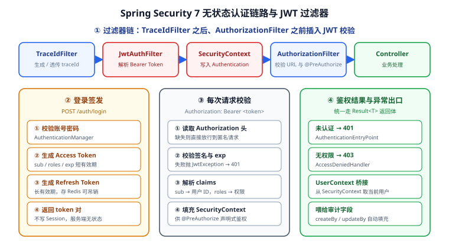

# 认证授权：Spring Security 7 + JWT

本节为后端通用模板接上**无状态认证链路**：登录签发 JWT、每次请求校验令牌、把当前用户写入 `SecurityContext`，并用声明式注解做接口级鉴权。做完这一步，模板就具备了"新接口默认受保护"的安全基线。



## 1. 本节目标与验收标准

| 目标 | 验收方式 |
| --- | --- |
| 无状态认证（不建 Session） | 重启服务后旧 token 仍可用；响应头不出现 `Set-Cookie` |
| 令牌可校验、可过期 | 过期/篡改 token → 401，且返回统一 `Result` 结构 |
| 权限可声明 | `@PreAuthorize` 生效，越权访问 → 403 |
| 当前用户可获取 | `UserContext.userId()` 在任意层可用 |
| 审计字段自动填充 | `createBy` / `updateBy` 写入真实用户 ID（接上一节 `MetaObjectHandler`） |
| 白名单可配置 | 登录、健康检查、文档等路径无需 token |

## 2. 为什么用 JWT 而不是 Session

| 维度 | Session（服务端状态） | JWT（无状态） |
| --- | --- | --- |
| 状态存放 | 服务端内存 / Redis | 令牌自包含 |
| 水平扩容 | 需要共享存储（Redis）或粘性会话 | 任意实例都可校验 |
| 吊销 | 删 Session 即失效，**实时** | 需额外黑名单 / 短有效期，**有延迟** |
| 跨服务 | 需要网关统一鉴权 | 下游服务自行校验即可 |
| 携带信息 | 只有 sessionId | 可带 `sub` / `roles` / 自定义 claim |
| 风险 | 会话固定攻击、需 CSRF 防护 | 令牌泄露即身份泄露、payload 可读（仅签名防篡改） |

::: tip 模板的选择与边界
本模板选 **JWT（无状态）**，因为目标是"可水平扩容的 API 服务"。但要明确它的短板并补上：

1. **Access Token 有效期要短**（如 15~30 分钟），把"泄露后的可用时间窗"压到最小；
2. **Refresh Token 存 Redis**，换来"可吊销"能力（刷新时校验存在性）；
3. **不把敏感信息放进 payload**——payload 只是 Base64，任何人可读；
4. 纯浏览器 + Cookie 场景若更看重"实时吊销"，**Session 反而更简单**，见 [认证与授权 · 会话与 Cookie](../../../../docs/Backend/Auth/Session/index.md)。
:::

## 3. 依赖与版本

```xml [template-security/pom.xml]
<dependencies>
  <!-- Spring Security 7.x：与 Spring Boot 4.x 主线匹配 -->
  <dependency>
    <groupId>org.springframework.boot</groupId>
    <artifactId>spring-boot-starter-security</artifactId>
  </dependency>

  <!-- JWT：jjwt 0.13.0（api / impl / jackson 三件套版本必须完全一致） -->
  <dependency>
    <groupId>io.jsonwebtoken</groupId>
    <artifactId>jjwt-api</artifactId>
    <version>0.13.0</version>
  </dependency>
  <dependency>
    <groupId>io.jsonwebtoken</groupId>
    <artifactId>jjwt-impl</artifactId>
    <version>0.13.0</version>
    <scope>runtime</scope>
  </dependency>
  <dependency>
    <groupId>io.jsonwebtoken</groupId>
    <artifactId>jjwt-jackson</artifactId>
    <version>0.13.0</version>
    <scope>runtime</scope>
  </dependency>

  <!-- 令牌黑名单 / 刷新令牌需要 Redis -->
  <dependency>
    <groupId>org.springframework.boot</groupId>
    <artifactId>spring-boot-starter-data-redis</artifactId>
  </dependency>
</dependencies>
```

::: info 版本基线（2026-09 核对）
Spring Security **7.1.1**（2026-08-20）、Spring Boot **4.1.x** 主线、jjwt **0.13.0**。Spring Security 7 相对 6 的要点是：`requestMatchers` 全面取代 `antMatchers`、`SecurityFilterChain` 走 Lambda DSL，老的 `WebSecurityConfigurerAdapter` 早已移除。相关版本状态见仓库 [Spring Security 7 版本页](../../../../docs/Backend/Java/Frame/SpringSecurity/v7/index.md)。
:::

## 4. JWT 工具类

```java [template-security/src/main/java/com/example/security/jwt/JwtProperties.java]
@ConfigurationProperties(prefix = "app.jwt")
public record JwtProperties(
        String secret,          // HS256 密钥，至少 32 字节
        Duration accessTtl,     // 如 30m
        Duration refreshTtl,    // 如 7d
        String issuer           // 如 backend-template
) {}
```

```java [template-security/src/main/java/com/example/security/jwt/JwtTokenProvider.java]
@Component
@RequiredArgsConstructor
public class JwtTokenProvider {

    private final JwtProperties props;
    private SecretKey key;

    @PostConstruct
    void init() {
        // HS256 要求密钥 >= 256 bit（32 字节），过短会抛 WeakKeyException
        this.key = Keys.hmacShaKeyFor(props.secret().getBytes(StandardCharsets.UTF_8));
    }

    /** 签发 Access Token：sub 放用户 ID，roles 放权限码 */
    public String issueAccessToken(Long userId, String username, List<String> roles) {
        Instant now = Instant.now();
        return Jwts.builder()
                .id(UUID.randomUUID().toString())        // jti：黑名单按它匹配
                .issuer(props.issuer())
                .subject(String.valueOf(userId))
                .claim("username", username)
                .claim("roles", roles)
                .issuedAt(Date.from(now))
                .expiration(Date.from(now.plus(props.accessTtl())))
                .signWith(key)
                .compact();
    }

    /** 解析并校验；签名错误 / 过期 / 格式非法都会抛 JwtException */
    public Claims parse(String token) {
        return Jwts.parser()
                .verifyWith(key)
                .requireIssuer(props.issuer())
                .build()
                .parseSignedClaims(token)
                .getPayload();
    }

    public Long userId(Claims claims) {
        return Long.valueOf(claims.getSubject());
    }

    @SuppressWarnings("unchecked")
    public List<String> roles(Claims claims) {
        Object raw = claims.get("roles");
        return raw instanceof List<?> list ? (List<String>) list : List.of();
    }
}
```

::: danger 密钥管理的三个硬性要求
1. **不能硬编码在 `application.yml` 里入库**：用环境变量 `${JWT_SECRET}` 注入，或从 Vault / AWS Secrets Manager 读取。
2. **必须 >= 32 字节**：HS256 的密钥强度直接等于签名安全性。短密钥 jjwt 会直接抛异常；更糟的是很多老教程用 `"secret"` 这种 6 字节字符串。
3. **生产建议 RS256（非对称）**：签发方持私钥，校验方只需公钥，适合多服务场景；HS256 要求所有校验方共享同一把密钥，泄露面更大。
:::

## 5. 过滤器链配置

关键点是**不要禁用 Spring Security 的默认链，而是往链里插一个 JWT 过滤器**：

```java [template-security/src/main/java/com/example/security/config/SecurityConfig.java]
@Configuration
@EnableWebSecurity
@EnableMethodSecurity                  // 开启 @PreAuthorize
@RequiredArgsConstructor
public class SecurityConfig {

    private final JwtAuthenticationFilter jwtFilter;
    private final RestAuthenticationEntryPoint entryPoint;     // 401
    private final RestAccessDeniedHandler deniedHandler;       // 403

    /** 无需认证的路径（登录、刷新、健康检查、接口文档） */
    private static final String[] WHITE_LIST = {
            "/api/auth/login",
            "/api/auth/refresh",
            "/actuator/health/**",
            "/v3/api-docs/**",
            "/swagger-ui/**",
            "/swagger-ui.html"
    };

    @Bean
    SecurityFilterChain filterChain(HttpSecurity http) throws Exception {
        http
            // 无状态：不创建、不使用 Session
            .sessionManagement(s -> s.sessionCreationPolicy(SessionCreationPolicy.STATELESS))
            // 前后端分离 + 不用 Cookie 认证，可关闭 CSRF；若用 Cookie 承载令牌必须开启
            .csrf(AbstractHttpConfigurer::disable)
            .cors(Customizer.withDefaults())
            .authorizeHttpRequests(auth -> auth
                    .requestMatchers(WHITE_LIST).permitAll()
                    .requestMatchers(HttpMethod.OPTIONS, "/**").permitAll()
                    .anyRequest().authenticated())
            // 把 JWT 过滤器插在 UsernamePasswordAuthenticationFilter 之前
            .addFilterBefore(jwtFilter, UsernamePasswordAuthenticationFilter.class)
            .exceptionHandling(ex -> ex
                    .authenticationEntryPoint(entryPoint)
                    .accessDeniedHandler(deniedHandler))
            // 关闭表单登录与 Basic 认证（纯 API 服务不需要）
            .formLogin(AbstractHttpConfigurer::disable)
            .httpBasic(AbstractHttpConfigurer::disable);
        return http.build();
    }

    @Bean
    PasswordEncoder passwordEncoder() {
        // BCrypt 是当前默认推荐；不要用 MD5 / SHA1
        return new BCryptPasswordEncoder();
    }
}
```

::: warning 过滤器顺序错了会怎样
`.addFilterBefore(jwtFilter, UsernamePasswordAuthenticationFilter.class)` 保证 **`TraceIdFilter`（第 70 天加的，注册在最外层）→ `JwtAuthenticationFilter` → `AuthorizationFilter`** 的顺序。如果写成 `addFilterAfter(..., AuthorizationFilter.class)`，鉴权时 `SecurityContext` 还是空的，**所有受保护接口都会 403**——这是最常见的"配置看起来对但就是 403"的原因。
:::

## 6. JWT 过滤器

```java [template-security/src/main/java/com/example/security/jwt/JwtAuthenticationFilter.java]
@Component
@RequiredArgsConstructor
@Slf4j
public class JwtAuthenticationFilter extends OncePerRequestFilter {

    private static final String HEADER = "Authorization";
    private static final String PREFIX = "Bearer ";

    private final JwtTokenProvider provider;
    private final TokenBlacklist blacklist;      // 基于 Redis

    @Override
    protected void doFilterInternal(HttpServletRequest request,
                                    HttpServletResponse response,
                                    FilterChain chain) throws ServletException, IOException {
        String token = resolveToken(request);

        if (token != null && SecurityContextHolder.getContext().getAuthentication() == null) {
            try {
                Claims claims = provider.parse(token);
                // 已登出的令牌：从黑名单里查到就直接不认证
                if (!blacklist.contains(claims.getId())) {
                    Long userId = provider.userId(claims);
                    List<String> roles = provider.roles(claims);

                    var authorities = roles.stream()
                            .map(SimpleGrantedAuthority::new)
                            .toList();

                    var authentication = new UsernamePasswordAuthenticationToken(
                            new LoginUser(userId, claims.get("username", String.class), roles),
                            token, authorities);

                    SecurityContextHolder.getContext().setAuthentication(authentication);
                    MDC.put("userId", String.valueOf(userId));   // 与 traceId 一起进日志
                }
            } catch (ExpiredJwtException e) {
                log.debug("token 已过期: {}", e.getMessage());
                // 不在这里写响应：交给 entryPoint 统一处理，保持返回体一致
            } catch (JwtException | IllegalArgumentException e) {
                log.debug("token 非法: {}", e.getMessage());
            }
        }

        try {
            chain.doFilter(request, response);
        } finally {
            MDC.remove("userId");       // 必须清理，线程池复用会串号
        }
    }

    private String resolveToken(HttpServletRequest request) {
        String header = request.getHeader(HEADER);
        return (header != null && header.startsWith(PREFIX))
                ? header.substring(PREFIX.length())
                : null;
    }
}
```

::: danger `MDC.remove` 漏掉的后果
Filter 跑在 Tomcat 线程池里，`MDC` 是 **ThreadLocal**。如果只 `put` 不 `remove`，线程被复用时会带着上一个请求的 `userId`，日志里就会出现"用户 A 的请求打上了用户 B 的标识"——排查线上问题时极具误导性。用 `try/finally` 保证清理。
:::

## 7. 当前用户上下文

```java [template-security/src/main/java/com/example/security/context/UserContext.java]
public final class UserContext {

    private UserContext() {}

    /** 取当前登录用户；未登录返回 null（匿名请求） */
    public static LoginUser current() {
        Authentication auth = SecurityContextHolder.getContext().getAuthentication();
        return (auth != null && auth.getPrincipal() instanceof LoginUser user) ? user : null;
    }

    /** 取当前用户 ID；供审计字段自动填充调用 */
    public static Long userId() {
        LoginUser user = current();
        return user == null ? null : user.userId();
    }

    public static Long requireUserId() {
        Long id = userId();
        if (id == null) throw new BizException(ErrorCode.UNAUTHORIZED);
        return id;
    }
}
```

把上一节留下的"调用点"接上：

```java [template-data/src/main/java/com/example/data/handler/AuditMetaObjectHandler.java]
@Component
public class AuditMetaObjectHandler implements MetaObjectHandler {

    @Override
    public void insertFill(MetaObject metaObject) {
        LocalDateTime now = LocalDateTime.now();
        Long userId = UserContext.userId();          // ← 从 SecurityContext 取

        strictInsertFill(metaObject, "createTime", LocalDateTime.class, now);
        strictInsertFill(metaObject, "updateTime", LocalDateTime.class, now);
        strictInsertFill(metaObject, "createBy", Long.class, userId);
        strictInsertFill(metaObject, "deleted", Integer.class, 0);
    }

    @Override
    public void updateFill(MetaObject metaObject) {
        // 只覆盖 updateTime / updateBy，不动创建信息
        strictUpdateFill(metaObject, "updateTime", LocalDateTime.class, LocalDateTime.now());
        strictUpdateFill(metaObject, "updateBy", Long.class, UserContext.userId());
    }
}
```

## 8. 统一异常出口（401 / 403）

关键是**让安全框架的异常也走 `Result<T>`**，否则前端会收到 Spring 默认的 HTML 错误页：

```java [template-security/src/main/java/com/example/security/handler/RestAuthenticationEntryPoint.java]
@Component
@RequiredArgsConstructor
public class RestAuthenticationEntryPoint implements AuthenticationEntryPoint {

    private final ObjectMapper objectMapper;

    @Override
    public void commence(HttpServletRequest request,
                         HttpServletResponse response,
                         AuthenticationException ex) throws IOException {
        write(response, HttpStatus.UNAUTHORIZED, "未登录或令牌已失效");
    }

    void write(HttpServletResponse response, HttpStatus status, String message) throws IOException {
        response.setStatus(status.value());
        response.setContentType(MediaType.APPLICATION_JSON_VALUE);
        response.setCharacterEncoding(StandardCharsets.UTF_8.name());
        // 复用全局 Result 结构，前端只需一套解析逻辑
        Result<Void> body = Result.fail(status == HttpStatus.UNAUTHORIZED
                ? ErrorCode.UNAUTHORIZED : ErrorCode.FORBIDDEN, message);
        response.getWriter().write(objectMapper.writeValueAsString(body));
    }
}
```

```java [template-security/src/main/java/com/example/security/handler/RestAccessDeniedHandler.java]
@Component
@RequiredArgsConstructor
public class RestAccessDeniedHandler implements AccessDeniedHandler {

    private final ObjectMapper objectMapper;

    @Override
    public void handle(HttpServletRequest request,
                       HttpServletResponse response,
                       AccessDeniedException ex) throws IOException {
        response.setStatus(HttpStatus.FORBIDDEN.value());
        response.setContentType(MediaType.APPLICATION_JSON_VALUE);
        response.setCharacterEncoding(StandardCharsets.UTF_8.name());
        Result<Void> body = Result.fail(ErrorCode.FORBIDDEN, "没有访问该资源的权限");
        response.getWriter().write(objectMapper.writeValueAsString(body));
    }
}
```

| 场景 | 触发者 | HTTP | 错误码 |
| --- | --- | --- | --- |
| 无 token / token 非法 / 已过期 | `AuthenticationEntryPoint` | 401 | `UNAUTHORIZED` |
| 已登录但权限不足 | `AccessDeniedHandler` | 403 | `FORBIDDEN` |
| 令牌在登出后被使用（黑名单命中） | `AuthenticationEntryPoint` | 401 | `UNAUTHORIZED` |

::: danger 401 与 403 别搞混
**401 = "你是谁我不知道"**，**403 = "我知道你是谁，但你不能干这个"**。前端依赖这个区分做不同处理：收到 401 应跳登录页并清理本地令牌；收到 403 应提示"无权限"而不是把用户踢出去。把 403 当 401 处理会导致"用户只是点了个没权限的菜单就被登出"。
:::

## 9. 声明式权限

鉴权可以从"按路径"下沉到"按方法"：

```java [template-web/src/main/java/com/example/web/UserController.java]
@RestController
@RequestMapping("/api/users")
@RequiredArgsConstructor
public class UserController {

    private final UserService userService;

    /** 有 user:list 权限才能查列表 */
    @GetMapping
    @PreAuthorize("hasAuthority('user:list')")
    public Result<PageResult<UserVO>> page(@Validated UserQuery query) {
        return Result.ok(userService.page(query));
    }

    /** 只有 ADMIN 角色可删 */
    @DeleteMapping("/{id}")
    @PreAuthorize("hasRole('ADMIN')")
    public Result<Void> delete(@PathVariable Long id) {
        userService.removeById(id);
        return Result.ok();
    }

    /** 只能改自己：'#id' 引用方法参数 */
    @PutMapping("/{id}")
    @PreAuthorize("#id == authentication.principal.userId or hasAuthority('user:update')")
    public Result<Void> update(@PathVariable Long id, @RequestBody @Validated UserUpdateDTO dto) {
        userService.update(id, dto);
        return Result.ok();
    }
}
```

| 表达式 | 含义 | 备注 |
| --- | --- | --- |
| `hasAuthority('user:list')` | 权限码精确匹配 | 与 JWT 里 `roles` 的值一致 |
| `hasRole('ADMIN')` | 角色匹配 | 内部会自动加 `ROLE_` 前缀 |
| `hasAnyAuthority('a','b')` | 任一满足 | 适合"多个角色都能访问" |
| `#id == authentication.principal.userId` | 用方法参数做数据级判断 | 防越权改他人数据 |
| `@ss.hasPerm('user:list')` | 调自定义 Bean | 适合需要查库的动态权限 |

::: warning `hasRole('ADMIN')` 与 `hasAuthority('ROLE_ADMIN')` 等价，但 claim 里存什么要一致
`hasRole('ADMIN')` 会在内部拼成 `ROLE_ADMIN` 去比对权限集合。所以签发令牌时，`roles` 数组里应放 **`ROLE_ADMIN`**（大写、带前缀），否则永远匹配不上。这类"配置没错但就是 403"的问题，十有八九是这里的命名不一致。
:::

## 10. 配置与密钥

```yaml [template-application/src/main/resources/application-dev.yml]
app:
  jwt:
    secret: ${JWT_SECRET:}          # 从环境变量注入，绝不写死
    access-ttl: 30m
    refresh-ttl: 7d
    issuer: backend-template
```

```shell
# 本地与 CI 都通过环境变量注入（长度必须 >= 32 字节）
export JWT_SECRET="$(openssl rand -base64 48)"
mvn -q spring-boot:run -pl template-application
```

::: info 把密钥纳入启动自检
建议在 `@PostConstruct` 里加一句断言：密钥为空或长度不足 32 字节时**直接启动失败**。这比"上线才发现签名用了空密钥"要好得多——配置错误应该在启动时就暴露。
:::

## 11. 验证方式

```shell
# 环境要求：JDK 25、Maven 3.9+、Redis 8.x（刷新令牌与黑名单）
cd backend-template
export JWT_SECRET="$(openssl rand -base64 48)"
mvn -q clean package -DskipTests
java -jar template-application/target/template-application-1.0.0.jar
# 预期日志：Started TemplateApplication in x.xxx seconds
```

**① 登录拿令牌**

```shell
curl -s -X POST http://localhost:8080/api/auth/login \
  -H "Content-Type: application/json" \
  -d '{"username":"admin","password":"Admin@123"}'
# 预期：
# {"code":0,"message":"ok","data":{"accessToken":"eyJ...","refreshToken":"eyJ...","tokenType":"Bearer","expiresIn":1800}}
```

**② 不带令牌访问受保护接口 → 401**

```shell
curl -s -o /dev/null -w "%{http_code}\n" http://localhost:8080/api/users
# 预期：401

curl -s http://localhost:8080/api/users
# 预期：{"code":40101,"message":"未登录或令牌已失效","data":null}
#       （不是 Spring 默认的 HTML 错误页）
```

**③ 带令牌访问 → 200**

```shell
TOKEN=$(curl -s -X POST http://localhost:8080/api/auth/login \
  -H "Content-Type: application/json" \
  -d '{"username":"admin","password":"Admin@123"}' \
  | python -c "import sys,json;print(json.load(sys.stdin)['data']['accessToken'])")

curl -s http://localhost:8080/api/users -H "Authorization: Bearer $TOKEN"
# 预期：{"code":0,"message":"ok","data":{"records":[...],"total":N}}
```

**④ 无权限 → 403（用普通用户访问管理员接口）**

```shell
USER_TOKEN=$(curl -s -X POST http://localhost:8080/api/auth/login \
  -H "Content-Type: application/json" \
  -d '{"username":"tom","password":"User@123"}' \
  | python -c "import sys,json;print(json.load(sys.stdin)['data']['accessToken'])")

curl -s -o /dev/null -w "%{http_code}\n" -X DELETE http://localhost:8080/api/users/1 \
  -H "Authorization: Bearer $USER_TOKEN"
# 预期：403
```

**⑤ 篡改令牌 → 401**

```shell
curl -s -o /dev/null -w "%{http_code}\n" http://localhost:8080/api/users \
  -H "Authorization: Bearer ${TOKEN}x"
# 预期：401（签名校验失败）
```

**⑥ 审计字段确实写入了当前用户**

```sql
-- 用登录用户创建一条记录后查询
SELECT id, create_by, create_time, update_by, update_time, deleted
FROM sys_user ORDER BY id DESC LIMIT 1;
-- 预期：create_by 为登录用户 ID，而非 NULL 或 0
```

**⑦ 把上述验证固化为 MockMvc 用例**（与第 70 天的测试基建合流）：

```java [template-web/src/test/java/com/example/web/SecurityIT.java]
@SpringBootTest
@AutoConfigureMockMvc
class SecurityIT {

    @Autowired MockMvc mvc;
    @Autowired JwtTokenProvider provider;

    @Test
    void anonymous_should_get_401_with_unified_body() throws Exception {
        mvc.perform(get("/api/users"))
           .andExpect(status().isUnauthorized())
           .andExpect(jsonPath("$.code").value(40101));
    }

    @Test
    void valid_token_should_get_200() throws Exception {
        String token = provider.issueAccessToken(1L, "admin", List.of("ROLE_ADMIN", "user:list"));
        mvc.perform(get("/api/users").header("Authorization", "Bearer " + token))
           .andExpect(status().isOk())
           .andExpect(jsonPath("$.code").value(0));
    }

    @Test
    void insufficient_permission_should_get_403() throws Exception {
        String token = provider.issueAccessToken(2L, "tom", List.of("ROLE_USER"));
        mvc.perform(delete("/api/users/1").header("Authorization", "Bearer " + token))
           .andExpect(status().isForbidden())
           .andExpect(jsonPath("$.code").value(40301));
    }

    @Test
    void tampered_token_should_get_401() throws Exception {
        mvc.perform(get("/api/users").header("Authorization", "Bearer abc.def.ghi"))
           .andExpect(status().isUnauthorized());
    }
}
```

```shell
mvn -q test -pl template-web -Dtest=SecurityIT
# 预期：Tests run: 4, Failures: 0, Errors: 0, Skipped: 0
```

**验证结果记录**（本文按 Spring Boot 4.1.x + Spring Security 7.1.x + jjwt 0.13.0 官方文档编写；当前编写环境无 JDK / Maven / Redis，**未实际编译运行**，请在你的环境执行后填写）：

| 检查项 | 期望 | 实测 | 结论 |
| --- | --- | --- | --- |
| 服务启动 | Started TemplateApplication | 待填写 | ⏳ |
| 登录接口 | 返回 accessToken / refreshToken | 待填写 | ⏳ |
| 匿名访问 `/api/users` | 401 + 统一 Result 体 | 待填写 | ⏳ |
| 带有效令牌 | 200 + code=0 | 待填写 | ⏳ |
| 普通用户删用户 | 403 | 待填写 | ⏳ |
| 篡改令牌 | 401 | 待填写 | ⏳ |
| 审计字段 `create_by` | 等于登录用户 ID | 待填写 | ⏳ |
| `SecurityIT` | 4 passed | 待填写 | ⏳ |
| 响应头无 `Set-Cookie` | 确实无 Session | 待填写 | ⏳ |

## 12. 常见坑清单

| # | 坑 | 现象 | 正确做法 |
| --- | --- | --- | --- |
| 1 | 过滤器插到 `AuthorizationFilter` 之后 | 所有受保护接口 403 | `addFilterBefore(jwtFilter, UsernamePasswordAuthenticationFilter.class)` |
| 2 | `roles` claim 存 `ADMIN` 却用 `hasRole('ADMIN')` | 永远 403 | claim 里存 `ROLE_ADMIN`，或改用 `hasAuthority('ADMIN')` |
| 3 | HS256 密钥少于 32 字节 | 启动或签发时抛 `WeakKeyException` | 长度 >= 32 字节，用 `openssl rand -base64 48` 生成 |
| 4 | 密钥写进 `application.yml` 并提交入库 | 密钥泄露 | 环境变量 / 密钥管理服务注入 |
| 5 | 不清理 MDC | 日志里的 userId 串号 | `try/finally` 里 `MDC.remove("userId")` |
| 6 | 直接返回 401 而不走 `EntryPoint` | 返回体与业务不一致，前端要写两套解析 | 统一交给 `EntryPoint` / `DeniedHandler` |
| 7 | Access Token 有效期设成 7 天 | 泄露后长时间可用且无法吊销 | Access 短（15~30m）+ Refresh 长（存 Redis 可吊销） |
| 8 | payload 里放手机号 / 身份证 / 密码 | 令牌被 Base64 解出即泄露 | payload 只放 ID 与权限码 |
| 9 | 用 Cookie 承载令牌却关了 CSRF | CSRF 攻击面打开 | 用 Cookie 就必须开 CSRF 或加双提交令牌 |
| 10 | 白名单写通配（如 `/api/**/public`） | 意外放行了不该放的接口 | 白名单逐个精确列出，并写测试锁住 |
| 11 | `csrf().disable()` 无脑复制到 Cookie 场景 | 同第 9 条 | 按认证载体决定是否关闭 |
| 12 | 忘记 `@EnableMethodSecurity` | `@PreAuthorize` 静默不生效 | 配置类加该注解，并用测试验证 403 确实发生 |

::: danger 第 12 条是最危险的
`@PreAuthorize` 在没有 `@EnableMethodSecurity` 时**不报错、不生效**——接口看起来"配了权限"，实际完全开放。这是典型的"看起来安全的漏洞"。**必须用测试断言 403 确实发生**，而不是靠肉眼检查注解。
:::

## 13. 下一步（第 73 天）

1. **登录业务闭环**：`AuthService` 的账号锁定（连续失败 5 次锁定 15 分钟）、密码强度校验、登录日志审计。
2. **刷新与登出**：`/api/auth/refresh` 校验 Redis 中的 Refresh Token；`/api/auth/logout` 把 Access Token 的 `jti` 写入黑名单。
3. **测试扩充**：把"令牌过期""黑名单命中""刷新令牌被复用"补进 `SecurityIT`，并把 401/403 用例纳入覆盖率门禁。

## 参考资料

- Spring Security 官方文档：https://docs.spring.io/spring-security/reference/index.html
- Spring Security 7 迁移指南：https://docs.spring.io/spring-security/reference/migration-7/index.html
- `SecurityFilterChain` 与过滤器顺序：https://docs.spring.io/spring-security/reference/servlet/architecture.html
- 方法级鉴权 `@PreAuthorize`：https://docs.spring.io/spring-security/reference/servlet/authorization/method-security.html
- jjwt 官方仓库：https://github.com/jwtk/jjwt
- OWASP JWT 安全清单：https://cheatsheetseries.owasp.org/cheatsheets/JSON_Web_Token_for_Java_Cheat_Sheet.html
- 相关专题：[认证与授权](../../../../docs/Backend/Auth/index.md) ｜ [Spring Security 7](../../../../docs/Backend/Java/Frame/SpringSecurity/v7/index.md) ｜ [JWT 深入](../../../../docs/Backend/Auth/Jwt/index.md)
- 项目总览：[后端通用模板](../index.md) ｜ 上一节 [数据访问：MyBatis-Plus 接入](../DataAccess/index.md) ｜ 逐日记录 [进展记录](../Progress/index.md)
