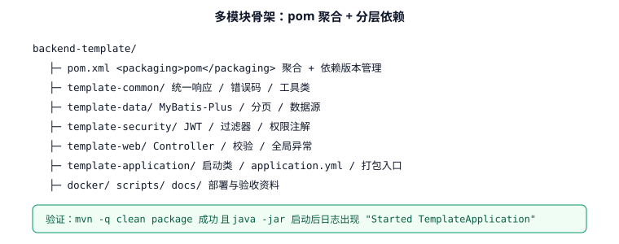
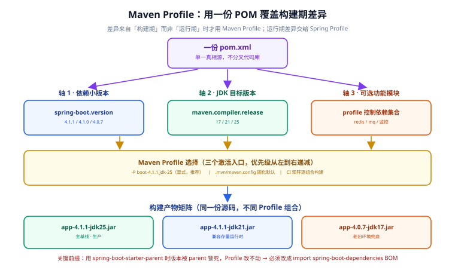
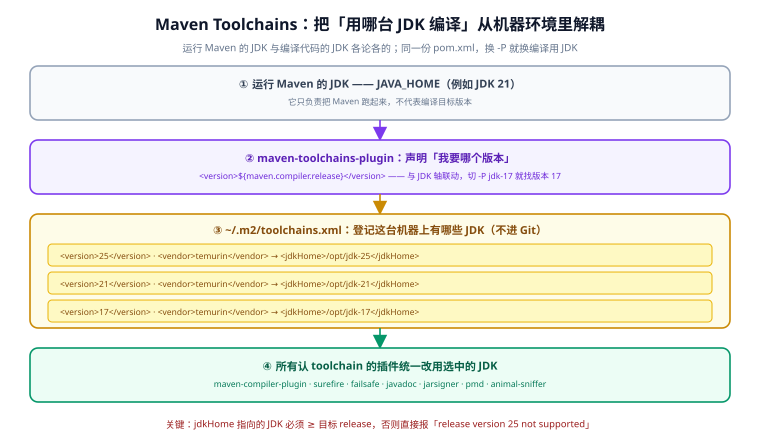

# 骨架与目录结构（第 69 天 · 步骤 ①）

本页交付第一个**可运行**的骨架：多模块 Maven 工程、启动类、配置文件。目标是"拉下代码就能跑起来"，这是后续所有模块的基座。



## 工程结构

```text
backend-template/
├─ pom.xml                        # 聚合 POM：模块列表 + 依赖版本管理（dependencyManagement）
├─ .mvn/maven.config              # 默认 Maven Profile 组合（见下文「Maven Profile」小节）
├─ template-common/               # 无 Web 依赖的基础模块
│  ├─ pom.xml
│  └─ src/main/java/com/example/template/common/
│     ├─ result/Result.java
│     ├─ result/ErrorCode.java
│     └─ exception/BizException.java
├─ template-data/
├─ template-security/
├─ template-web/
├─ template-application/          # 唯一可启动模块
│  ├─ pom.xml
│  └─ src/main/
│     ├─ java/com/example/template/TemplateApplication.java
│     └─ resources/
│        ├─ application.yml
│        ├─ application-dev.yml
│        └─ application-prod.yml
├─ docker/
├─ scripts/
└─ docs/
```

## 根 POM（聚合与版本管理）

```xml [pom.xml]
<?xml version="1.0" encoding="UTF-8"?>
<project xmlns="http://maven.apache.org/POM/4.0.0"
         xmlns:xsi="http://www.w3.org/2001/XMLSchema-instance"
         xsi:schemaLocation="http://maven.apache.org/POM/4.0.0 https://maven.apache.org/xsd/maven-4.0.0.xsd">
  <modelVersion>4.0.0</modelVersion>

  <!-- Spring Boot 4.1.x 为当前稳定版（2026-06 发布，基于 Spring Framework 7） -->
  <parent>
    <groupId>org.springframework.boot</groupId>
    <artifactId>spring-boot-starter-parent</artifactId>
    <version>4.1.1</version>
    <relativePath/>
  </parent>

  <groupId>com.example</groupId>
  <artifactId>backend-template</artifactId>
  <version>1.0.0</version>
  <packaging>pom</packaging>

  <modules>
    <module>template-common</module>
    <module>template-data</module>
    <module>template-security</module>
    <module>template-web</module>
    <module>template-application</module>
  </modules>

  <properties>
    <java.version>25</java.version>
    <mybatis-plus.version>3.5.17</mybatis-plus.version>
    <springdoc.version>3.1.0</springdoc.version>
  </properties>

  <dependencyManagement>
    <dependencies>
      <!-- 各子模块版本统一在此声明 -->
      <dependency>
        <groupId>com.example</groupId>
        <artifactId>template-common</artifactId>
        <version>${project.version}</version>
      </dependency>
      <dependency>
        <groupId>com.example</groupId>
        <artifactId>template-data</artifactId>
        <version>${project.version}</version>
      </dependency>
      <dependency>
        <groupId>com.example</groupId>
        <artifactId>template-security</artifactId>
        <version>${project.version}</version>
      </dependency>
      <dependency>
        <groupId>com.example</groupId>
        <artifactId>template-web</artifactId>
        <version>${project.version}</version>
      </dependency>
    </dependencies>
  </dependencyManagement>
</project>
```

::: danger 版本号写法的三个坑
1. **子模块重复声明 `<version>` 与父版本**：应由 `dependencyManagement` 统一管理，否则升级版本要改 N 处，漏一处就出现版本不一致。
2. **父 POM 用 `<relativePath/>` 指向空**：这表示"父 POM 只从仓库解析"，如果本地私服没有该版本会直接失败；内网环境建议先把父 POM 部署到私服，或显式指向本地路径。
3. **`java.version` 与本地 JDK 不一致**：模板要求 JDK 25（Spring Boot 4.x 最低 Java 17、推荐 25），用 17 编译出的产物在部分特性上行为不同，团队要统一 JDK。
:::

## Maven Profile：同一大版本下的小版本与 JDK 差异

模板基线是 **Spring Boot 4.1.x + JDK 25**，但真实团队总会遇到「同一大版本里要并行出几个小版本」或「编译目标 JDK 不一样」的需求：存量服务跑在 JDK 21、新项目要求 JDK 25、某个下游环境只能到 Spring Boot 4.0.x。**这些差异都发生在构建期**，应当用 **Maven Profile** 管理，而不是复制几份代码库。



::: warning 先分清「构建期」与「运行期」
- **Maven Profile（构建期）**：决定编译到哪个 JDK 目标、依赖哪个小版本、打进哪些可选模块。差异**在打包那一刻就固化了**。
- **Spring Profile（运行期）**：决定同一个 jar 在不同环境连哪个库、开哪些开关。**同一个产物可以跑在不同环境**。

把「切换数据库地址」写成 Maven Profile、或把「切换编译目标 JDK」写成 Spring Profile，都是典型错配——前者会让每个环境单独出一个包，后者根本做不到（编译目标在打包时就定死了）。
:::

### 三条差异轴

| 轴 | 承载属性 | 典型取值 | 是否适合 Profile |
| --- | --- | --- | --- |
| 依赖小版本 | `spring-boot.version` | 4.1.1 / 4.1.0 / 4.0.7 | ✅ 构建期，产物不同 |
| 编译目标 JDK | `maven.compiler.release` | 17 / 21 / 25 | ✅ 构建期，字节码不同 |
| 可选功能模块 | 依赖集合 / 模块列表 | redis / mq / 监控 | ✅ 构建期，产物不同 |
| 环境地址与开关 | `application-*.yml` | dev / test / prod | ❌ 用 **Spring Profile** |
| 数据库账号密码 | 环境变量 | — | ❌ 用**环境变量**，不入库 |

### 前提：让「版本值」本身可被覆盖

这是整个方案最容易踩空的一步：**`<parent>` 的 `<version>` 是字面量，Profile 改不动它。**

```xml
<!-- ✗ 这样写，Profile 永远无法切换 Spring Boot 小版本 -->
<parent>
  <groupId>org.springframework.boot</groupId>
  <artifactId>spring-boot-starter-parent</artifactId>
  <version>4.1.1</version>      <!-- 写死的字面量 -->
</parent>
```

因为 `starter-parent` 把 Spring Boot 版本锁在 parent 链上，要让它可切换，必须**放弃 parent、改用 import 方式引入 `spring-boot-dependencies` BOM**：

```xml [pom.xml（可切换版本版根 POM）]
<project xmlns="http://maven.apache.org/POM/4.0.0"
         xmlns:xsi="http://www.w3.org/2001/XMLSchema-instance"
         xsi:schemaLocation="http://maven.apache.org/POM/4.0.0 https://maven.apache.org/xsd/maven-4.0.0.xsd">
  <modelVersion>4.0.0</modelVersion>

  <groupId>com.example</groupId>
  <artifactId>backend-template</artifactId>
  <version>1.0.0</version>
  <packaging>pom</packaging>

  <properties>
    <!-- ① 依赖小版本：由 profile 覆盖 -->
    <spring-boot.version>4.1.1</spring-boot.version>
    <!-- ② 编译目标 JDK：由 profile 覆盖；脱离 parent 后必须自己写 maven.compiler.release -->
    <maven.compiler.release>25</maven.compiler.release>
    <project.build.sourceEncoding>UTF-8</project.build.sourceEncoding>
    <!-- ③ 用于产物追溯：不再维护「组合 id」，直接用上面两个真实属性拼出（原因见文末评审） -->
    <mybatis-plus.version>3.5.17</mybatis-plus.version>
  </properties>

  <modules>
    <module>template-common</module>
    <module>template-data</module>
    <module>template-security</module>
    <module>template-web</module>
    <module>template-application</module>
  </modules>

  <dependencyManagement>
    <dependencies>
      <!-- 用 BOM 导入替代 parent：版本变成 ${spring-boot.version}，可被 profile 切换 -->
      <dependency>
        <groupId>org.springframework.boot</groupId>
        <artifactId>spring-boot-dependencies</artifactId>
        <version>${spring-boot.version}</version>
        <type>pom</type>
        <scope>import</scope>
      </dependency>
      <dependency>
        <groupId>com.example</groupId>
        <artifactId>template-common</artifactId>
        <version>${project.version}</version>
      </dependency>
      <!-- template-data / template-security / template-web 同上，此处省略 -->
    </dependencies>
  </dependencyManagement>

  <build>
    <pluginManagement>
      <plugins>
        <!-- 关键：脱离 parent 后插件版本不再被托管，必须显式给版本 -->
        <plugin>
          <groupId>org.springframework.boot</groupId>
          <artifactId>spring-boot-maven-plugin</artifactId>
          <version>${spring-boot.version}</version>
          <executions>
            <!-- 脱离 parent 后也失去默认的 repackage 绑定，必须自己声明 -->
            <execution>
              <goals>
                <goal>repackage</goal>
              </goals>
            </execution>
          </executions>
        </plugin>
        <plugin>
          <groupId>org.apache.maven.plugins</groupId>
          <artifactId>maven-compiler-plugin</artifactId>
          <version>3.15.0</version>
        </plugin>
      </plugins>
    </pluginManagement>
  </build>
</project>
```

::: danger 放弃 parent 会丢哪些东西
`spring-boot-starter-parent` 不只是「依赖版本表」，它同时提供了插件管理。改用 BOM import 后**只保留依赖管理，不保留插件管理**，以下能力需要你自己补回来：

1. **`spring-boot-maven-plugin` 的版本与默认执行**：必须显式写 `<version>` 并手动加 `repackage` execution，否则 `mvn package` 产出的不是可执行 fat jar。
2. **`maven-compiler-plugin` 的默认配置**：`starter-parent` 会把 `java.version` 自动映射成 `maven.compiler.release`；脱离后要自己设 `maven.compiler.release`。
3. **预配置的 `git-commit-id-maven-plugin`**：`git.properties` 不再自动生成。
4. **预配置的 `cyclonedx-maven-plugin`**：SBOM 不再自动产出。
5. **资源过滤分隔符 `@..@`**：`starter-parent` 把 `maven-resources-plugin` 的分隔符从 `${..}` 改成了 `@..@`（避免与 Spring 占位符冲突），脱离后需自行配置。

所以**取舍原则**是：若团队不需要从同一仓库并行出多条 Spring Boot 小版本线，就用回 `starter-parent` + Profile 只管 JDK 与可选模块（省心）；只有在确实要「一仓多小版本」时，才付出上面这些代价切换到 BOM 方案。
:::

### 定义 Profile

三条轴各自独立，一个 Profile 只负责一件事，靠 `-P` 组合使用：

```xml [pom.xml（profiles 片段）]
<profiles>
  <!-- ============ 轴 1：依赖小版本 ============ -->
  <profile>
    <id>boot-4.1.1</id>
    <properties>
      <spring-boot.version>4.1.1</spring-boot.version>
    </properties>
  </profile>
  <profile>
    <id>boot-4.0.7</id>
    <properties>
      <spring-boot.version>4.0.7</spring-boot.version>
    </properties>
  </profile>

  <!-- ============ 轴 2：编译目标 JDK ============ -->
  <profile>
    <id>jdk-25</id>
    <properties>
      <maven.compiler.release>25</maven.compiler.release>
    </properties>
  </profile>
  <profile>
    <id>jdk-21</id>
    <properties>
      <maven.compiler.release>21</maven.compiler.release>
    </properties>
  </profile>
  <profile>
    <id>jdk-17</id>
    <properties>
      <maven.compiler.release>17</maven.compiler.release>
    </properties>
    <!-- 这里刻意不再约束「本机 JDK 必须是 17」：
         目标 JDK 由 toolchains 负责（见下文），Maven 自身跑在哪台 JDK 上无关紧要。
         写成 requireJavaVersion [17,18) 会把「Maven 跑在 JDK 25、编译目标 17」这种完全正常的场景误杀。 -->
  </profile>

  <!-- ============ 轴 3：可选功能模块 ============ -->
  <profile>
    <id>with-redis</id>
    <dependencies>
      <dependency>
        <groupId>org.springframework.boot</groupId>
        <artifactId>spring-boot-starter-data-redis</artifactId>
      </dependency>
    </dependencies>
  </profile>
  <profile>
    <id>with-mq</id>
    <dependencies>
      <dependency>
        <groupId>org.springframework.boot</groupId>
        <artifactId>spring-boot-starter-amqp</artifactId>
      </dependency>
    </dependencies>
  </profile>
</profiles>
```

::: tip Profile 命名约定
统一用 `<轴>-<取值>` 的形式（`boot-4.1.1`、`jdk-25`、`with-redis`），好处是：`-P` 参数一眼能读出意图、便于在 CI 里用矩阵批量展开、不会出现 `prod` / `production` 这类同义不同名的混乱。**加可选模块统一用 `with-` 前缀**，与版本轴在视觉上区分开。
:::

### JDK 差异：编出什么版本 vs 用谁去编

JDK 这条轴其实藏着**两个互相独立的问题**，混在一起想就会写出漏风的配置：

| # | 问题 | 该用什么 | 管的是什么 | 搞错了会怎样 |
| --- | --- | --- | --- | --- |
| 1 | **编出哪个版本的目标字节码** | `maven.compiler.release` | `class` 文件版本 + 编译期可见的 API 集合 | 旧 JDK 上直接 `UnsupportedClassVersionError` |
| 2 | **用哪一台 JDK 去编译** | Maven Toolchains | 真正执行 `javac` 的那个 `jdkHome` | 产物随构建机环境漂移，同一 commit 出不同包 |

一句话区分：**`release` 是「造什么规格」，Toolchains 是「用哪台机床造」**。前者写进 POM、进 Git、人人一致；后者记录「我这台机器 JDK 装在哪」，天然属于个人环境，不进 Git。

::: tip 一句话理解
`<release>` 决定要造哪种规格的零件，Toolchains 决定用哪台机床去造。机床规格低于零件要求，直接造不出来；机床人人不同，就会造出规格漂移的零件。
:::

#### 第一件事：目标字节码用 `release` 声明

在 JDK 9 之前只有 `-source` / `-target` 两个参数，它们**只管字节码版本，不管 API 面**，于是留下一个非常隐蔽的坑：

```xml
<!-- ✗ 旧写法：在 JDK 25 上编出 JDK 17 的字节码 -->
<properties>
  <maven.compiler.source>17</maven.compiler.source>
  <maven.compiler.target>17</maven.compiler.target>
</properties>
```

这段配置在 JDK 25 上编译**完全能过**，因为编译器仍然看得见 JDK 25 的完整 API。于是你顺手用了 `List.getFirst()`、`String.formatted()` 这些 JDK 21+ 才有的方法——编译成功、打包成功、测试也过（本机就是 JDK 25），一上 JDK 17 的生产环境立刻 `NoSuchMethodError`。**编译期不报错、运行期才炸**，这是最难排查的一类事故。

`release` 就是为堵这个洞而生的：它同时约束字节码版本**和**编译期可见的 API 面。

```xml
<!-- ✓ 正确写法：单一参数，双重约束 -->
<properties>
  <!-- 17 / 21 / 25 由 Maven Profile 覆盖 -->
  <maven.compiler.release>25</maven.compiler.release>
</properties>
```

| 参数 | 约束字节码版本 | 约束编译期可见 API | 建议 |
| --- | --- | --- | --- |
| `maven.compiler.source` + `maven.compiler.target` | ✅ | ❌ | 只在必须兼容 JDK 8 时使用 |
| `maven.compiler.release` | ✅ | ✅ | **默认选它**，JDK 9+ 全部支持 |

::: warning 旧项目迁移注意
`source`/`target` 和 `release` **不要同时写**。同时出现时 `release` 生效、另外两个被静默忽略，但留在 POM 里会误导后来的维护者。迁移时统一删掉 `source`/`target`，只留 `release`。
:::

产物可以自己验证：`class` 文件的 major version 就是 **release + 44**（17→61、21→65、25→69）。

```shell
# 编译后查看主类的字节码版本
javap -v template-common/target/classes/com/example/template/common/result/Result.class \
  | grep "major version"
# release=25 时预期：major version: 69
```

#### 第二件事：真正用哪台 JDK 编译 —— Maven Toolchains

##### 为什么需要它

假设团队约定 `release=17`。看起来只要本机装个 JDK 17 就行——但现实里每个人的 `JAVA_HOME` 都不一样：老同事机器上是 JDK 11，新同事装的是 JDK 25，CI runner 默认又是另一台。如果「用哪台 JDK」完全由 `JAVA_HOME` 决定，就会遇到三类问题：

- **本机能编、CI 编不过**：CI 上的 JDK 比代码要求的低，直接报「找不到符号」或 `invalid target release`。
- **同一 commit 产出不同产物**：装了 JDK 25 的机器编出 `release=25` 的包，装了 JDK 21 的编出 `release=21` 的包，线上出问题无法对账。
- **切版本只能改环境变量**：切一次 JDK 就得改 `JAVA_HOME` 或 IDE 设置，而且是全局生效，会连带影响别的项目。

**Toolchains 的思路**：把「这台机器上有哪些 JDK、分别装在哪」这份纯环境信息从 POM 里剥离出去，单独放进一个 `toolchains.xml`；POM 里只声明「我要一个版本 17 的 JDK」。构建时 Maven 读清单、按声明匹配，把选中的 JDK 交给所有认 toolchain 的插件。

带来的好处：

1. **POM 保持跨平台**：里面没有任何绝对路径，Windows / macOS / Linux 同事共用同一份 POM。
2. **构建可复现**：同一个 `-P` 组合，只要机器上装了对应 JDK，产出就一致。
3. **切换零成本**：不动 `JAVA_HOME`，`-P jdk-17` 就是切换开关。
4. **一人一份清单**：`toolchains.xml` 记录的是个人机器环境，天然不进 Git。

##### 两个组成部分

要用起来必须同时具备两样东西，缺一不可：

| 组成 | 位置 | 作用 | 是否进 Git |
| --- | --- | --- | --- |
| **`toolchains.xml`** | 构建机上（默认 `~/.m2/`） | 登记「本机有哪些 JDK、各自装在哪」 | ❌ 含机器绝对路径 |
| **`maven-toolchains-plugin`** | 项目 `pom.xml` | 声明「我要哪个版本」，并把选中的 toolchain 放进构建上下文 | ✅ 团队共用 |

完整链路如下：运行 Maven 的那台 JDK 不参与决策，插件读清单匹配出版本，再把选中的 JDK 交给后续所有插件。



##### `toolchains.xml` 放在哪

Maven 支持两级 toolchains 文件，都可以用命令行覆盖：

| 级别 | 默认路径 | 覆盖参数 | 适用场景 |
| --- | --- | --- | --- |
| **用户级** | `~/.m2/toolchains.xml`<br/>（Windows：`%USERPROFILE%\.m2\toolchains.xml`） | `-t <file>` / `--toolchains <file>` | 个人开发机，最常用 |
| **全局级** | `${maven.conf}/toolchains.xml` | `-gt <file>` / `--global-toolchains <file>` | 公司统一镜像、CI 基础镜像 |

::: danger 不要把 `toolchains.xml` 提交到仓库
它写的是**当前这台机器**的 JDK 安装路径（`/opt/jdk-17`、`D:\Java\jdk-17`……），提交上去只会让同事的构建失败。正确分工是：**POM 进 Git，`toolchains.xml` 各人自己维护**，新同事入职时按 README 说明建一份自己的。

同理，也不要把它塞进 `src/main/resources/` 之类的项目目录「假装」是项目配置——Maven 默认只从上面两级路径读，放别处必须靠 `-t` 显式指定，等于给每个人加了额外心智负担。
:::

##### `toolchains.xml` 字段详解

```xml [~/.m2/toolchains.xml]
<?xml version="1.0" encoding="UTF-8"?>
<toolchains>
  <!-- ① Java 25（当前主基线） -->
  <toolchain>
    <type>jdk</type>
    <provides>
      <version>25</version>
      <vendor>temurin</vendor>
    </provides>
    <configuration>
      <jdkHome>/opt/jdk-25</jdkHome>
    </configuration>
  </toolchain>
  <!-- ② Java 21（存量运行时兼容） -->
  <toolchain>
    <type>jdk</type>
    <provides>
      <version>21</version>
      <vendor>temurin</vendor>
    </provides>
    <configuration>
      <jdkHome>/opt/jdk-21</jdkHome>
    </configuration>
  </toolchain>
  <!-- ③ Java 17（老旧环境兜底） -->
  <toolchain>
    <type>jdk</type>
    <provides>
      <version>17</version>
      <vendor>temurin</vendor>
    </provides>
    <configuration>
      <jdkHome>/opt/jdk-17</jdkHome>
    </configuration>
  </toolchain>
</toolchains>
```

各字段含义：

| 字段 | 必填 | 说明 |
| --- | --- | --- |
| `<type>` | ✅ | 工具类型。JDK 固定写 `jdk`；Maven 还支持 `netbeans`、`paths` 等其它类型 |
| `<provides><version>` | ✅ | 版本号，用于与 POM 里的声明做匹配；也支持范围写法（见下文匹配规则） |
| `<provides><vendor>` | ❌ | 供应商标识，如 `temurin`、`oracle`、`zulu`、`openjdk`。<br/>**只有 POM 里也写了 vendor 才参与匹配**；写错是最常见的「找不到 toolchain」原因 |
| `<configuration><jdkHome>` | ✅ | JDK 安装根目录（即 `JAVA_HOME` 指向的那个目录） |

Windows 机器上的写法（注意路径分隔符）：

```xml [C:\Users\you\.m2\toolchains.xml]
<toolchain>
  <type>jdk</type>
  <provides>
    <version>17</version>
    <vendor>temurin</vendor>
  </provides>
  <configuration>
    <!-- 正斜杠可直接用；写成反斜杠则必须转义为 D:\\Java\\jdk-17 -->
    <jdkHome>D:/Java/jdk-17</jdkHome>
  </configuration>
</toolchain>
```

##### POM 里怎么声明需求

项目侧只声明「要什么」，不关心「装在哪」：

```xml [pom.xml（toolchains 绑定到 JDK 轴）]
<plugin>
  <groupId>org.apache.maven.plugins</groupId>
  <artifactId>maven-toolchains-plugin</artifactId>
  <version>3.3.0</version>
  <executions>
    <execution>
      <goals>
        <!-- 把选中的 toolchain 放进构建上下文，供后续插件取用 -->
        <goal>toolchain</goal>
      </goals>
    </execution>
  </executions>
  <configuration>
    <toolchains>
      <jdk>
        <!-- 与 JDK 轴联动：-P jdk-17 时 release=17，这里就去找版本 17 的 JDK -->
        <version>${maven.compiler.release}</version>
        <!-- 一般不要写 vendor：写了就会因机器上装的是 Zulu / Corretto 而匹配失败 -->
      </jdk>
    </toolchains>
  </configuration>
</plugin>
```

::: tip 版本用属性引用，不要写死
把 `<version>` 写成 `${maven.compiler.release}`，Toolchains 就自动跟着 JDK 轴走：`-P jdk-17` 时 `release` 被覆盖成 17，这里也就去找版本 17 的 JDK。写死 `<version>17</version>` 的话，每加一条 JDK 轴都要回来改这个插件配置，早晚会漏。

另外注意：**匹配是按你在 `toolchains.xml` 里声明的值来比的，不是去探测 JDK 的真实版本**。声明 `25.0.1` 而这里要 `25`，就匹配不上。两侧写法必须一致——细节见文末「方案评审」。
:::

##### 匹配规则与常见报错

匹配过程是「POM 提要求 → 清单里找」：

1. Maven 读 `toolchains.xml`，筛出 `<type>jdk</type>` 的全部条目。
2. 用 POM 里声明的 `version` / `vendor` 逐条比对，**两个条件都满足才算命中**。
3. 命中唯一一条 → 使用它；命中多条 → 取第一条，所以清单里不要放重复版本。
4. 一条都没命中 → 构建直接失败，不会退化成「用本机 JDK 凑合」。

| 报错信息 | 原因 | 处理方式 |
| --- | --- | --- |
| `Cannot find matching toolchain definitions for the following toolchain types` | 清单里没有符合要求的条目 | 检查版本号是否写成纯数字、vendor 是否多写 |
| `Could not find matching toolchain` | 同上，或 `toolchains.xml` 路径不对 | 确认文件在 `~/.m2/`，或用 `-t` 指定 |
| `Non-resolvable parent POM` 等无关报错 | `toolchains.xml` 本身 XML 语法错误，Maven 解析失败 | 用 `mvn -X` 看详细解析错误 |

::: danger 高频坑：`jdkHome` 版本低于目标 `release`
Toolchains 只负责「用你指定的这台 JDK 去编」，它**不会**帮你检查这台 JDK 够不够新。

```text
# 反例：清单里版本写 25，但 /opt/jdk-25 实际指向的是 JDK 17
mvn -P jdk-25 clean package
# → 实际仍用 JDK 17 去编 release=25，直接失败：
#   error: release version 25 not supported
```

正确做法是让「清单里声明的版本」和「目录里的真实 JDK」严格对应，并用 `maven-enforcer-plugin` 提前拦住：

```xml [pom.xml（提前校验本机 JDK）]
<plugin>
  <groupId>org.apache.maven.plugins</groupId>
  <artifactId>maven-enforcer-plugin</artifactId>
  <version>3.6.3</version>
  <executions>
    <execution>
      <id>enforce-jdk</id>
      <goals>
        <goal>enforce</goal>
      </goals>
      <configuration>
        <rules>
          <!-- 只校验「运行 Maven 的 JDK」；注意 requireJavaVersion 看的是 Maven 进程本身，
               不是 toolchain 选中的那台 JDK，所以不要拿它来替代 toolchain 校验 -->
          <requireJavaVersion>
            <version>[17,)</version>
          </requireJavaVersion>
        </rules>
      </configuration>
    </execution>
  </executions>
</plugin>
```
:::

##### 哪些插件会用到选中的 JDK

Toolchains 不是「设一个全局环境变量」，它把选中的 JDK 写进构建上下文，**只有声明自己 toolchain-aware 的插件才会去取**。主流插件基本都已支持：

| 插件 | 支持 toolchain 起始版本 | 受影响的动作 |
| --- | --- | --- |
| `maven-compiler-plugin` | 2.1 | 编译主代码与测试代码 |
| `maven-surefire-plugin` | 2.5 | 跑单元测试用的 JVM |
| `maven-failsafe-plugin` | 2.5 | 跑集成测试用的 JVM |
| `maven-javadoc-plugin` | 2.5 | 生成 Javadoc |
| `maven-jarsigner-plugin` | 1.3 | 签名 jar |
| `maven-pmd-plugin` | 3.14.0 | 静态检查 |
| `animal-sniffer-maven-plugin` | 1.3 | API 兼容性校验 |
| `exec-maven-plugin` | 1.1.1 | 执行外部命令 |

::: warning 测试跑在哪台 JDK 上同样关键
Toolchains 生效时，Surefire / Failsafe 会用选中的 JDK 起测试 JVM——这正是我们想要的：用 JDK 17 编、也用 JDK 17 跑，才能真正暴露 API 兼容问题。如果发现测试 JVM 还是别的版本，先检查是不是某个子模块用旧版本覆盖了 `maven-surefire-plugin`。
:::

##### 3.2.0 之后：JDK 自动发现

从 `maven-toolchains-plugin` **3.2.0** 起新增了一套 JDK 自动发现机制：插件会扫描常见安装目录（SDKMAN、`/usr/lib/jvm`、Windows 默认安装位置等）和 `JAVA{xx}_HOME` 环境变量，自动得到一份可用 JDK 清单。**这种模式下可以完全不维护 `toolchains.xml`**。

配套的 goal：

| Goal | 作用 |
| --- | --- |
| `toolchains:select-jdk-toolchain` | 自动发现并选择匹配的 JDK toolchain（3.2.0 新增，推荐） |
| `toolchains:display-discovered-jdk-toolchains` | 打印当前发现到的所有 JDK，排查问题用 |
| `toolchains:generate-jdk-toolchains-xml` | 把发现结果导出成 `toolchains.xml` 格式，可直接复制粘贴 |
| `toolchains:toolchain` | 原有 goal：从 `toolchains.xml` 里按声明匹配 |

先看看机器上到底发现了什么：

```shell
mvn org.apache.maven.plugins:maven-toolchains-plugin:3.3.0:display-discovered-jdk-toolchains
# [INFO] Discovered 3 JDK toolchains:
# [INFO] - /opt/jdk-25   provides: version: 25.0.1  vendor: Eclipse Temurin  lts: true  env: JAVA_HOME,JAVA25_HOME
# [INFO] - /opt/jdk-21   provides: version: 21.0.6  vendor: Eclipse Temurin  lts: true
# [INFO] - /opt/jdk-17   provides: version: 17.0.14 vendor: Eclipse Temurin  lts: true
```

POM 里换成新 goal，约束改成版本范围：

```xml [pom.xml（自动发现模式）]
<plugin>
  <groupId>org.apache.maven.plugins</groupId>
  <artifactId>maven-toolchains-plugin</artifactId>
  <version>3.3.0</version>
  <executions>
    <execution>
      <goals>
        <goal>select-jdk-toolchain</goal>
      </goals>
    </execution>
  </executions>
  <configuration>
    <!-- 版本范围：要求 JDK ≥ 17；也可用 vendor / env 约束 -->
    <version>${maven.compiler.release}</version>
  </configuration>
</plugin>
```

也可以完全不改 POM，只在命令行传参（适合临时排查）：

```shell
# 要求 JDK ≥ 17，交给插件自己挑
mvn toolchains:select-jdk-toolchain -Dtoolchain.jdk.version="[17,)" clean verify

# 只用 JAVA17_HOME 环境变量指向的那台
mvn toolchains:select-jdk-toolchain -Dtoolchain.jdk.env=JAVA17_HOME clean verify
```

::: warning 本项目为什么不用自动发现
我们的诉求是「`-P jdk-17` 就必须真的用 JDK 17」，不允许插件按启发式规则自行挑选（自动发现默认会优先 LTS、优先当前 JDK）。所以这里**继续用显式的 `toolchain` goal + `toolchains.xml`**。自动发现更适合「本机装了哪台就用哪台」的松散场景。

如果在 CI 上想用它省掉清单文件，注意发现结果会缓存到 `~/.m2/discovered-jdk-toolchains-cache.xml`；要强制只用显式清单，加 `<discoverToolchains>false</discoverToolchains>`。
:::

##### 三种「指定 JDK」方案对比

| 方案 | 配置位置 | 跨平台 | 可复现 | 评价 |
| --- | --- | --- | --- | --- |
| 只设 `maven.compiler.release` | POM | ✅ | ⚠️ 依赖本机 `JAVA_HOME` 版本够新 | 最低保障，必须做但不充分 |
| `maven-compiler-plugin` 的 `<fork>` + `<executable>` | POM | ❌ 写死绝对路径 | ⚠️ | 老写法，多平台必冲突，不要用 |
| **Maven Toolchains** | POM + 机器本地清单 | ✅ | ✅ | **团队项目的正解** |

`<fork>` / `<executable>` 的写法长这样，**仅作反面对照**：

```xml
<!-- ✗ 反例：把 JDK 路径写死在 POM 里，Windows / macOS 同事直接崩 -->
<plugin>
  <groupId>org.apache.maven.plugins</groupId>
  <artifactId>maven-compiler-plugin</artifactId>
  <configuration>
    <fork>true</fork>
    <executable>/usr/lib/jvm/jdk-17/bin/javac</executable>
  </configuration>
</plugin>
```

Toolchains 本质上就是把这两个路径参数**搬出 POM**，换成「版本号声明 + 机器本地清单」——POM 因此干净、跨平台、可复现。

##### CI 上要怎么准备

CI runner 是临时容器，不存在你的 `~/.m2/toolchains.xml`，所以每次构建都得**现生成一份**。具体做法（先用 `actions/setup-java` 装好 JDK，再写清单，最后用 `javap` 反查字节码版本）见本章末尾的「CI 矩阵：每个组合都要构建」一节。

::: danger 不要用 `<activation><jdk>` 来选目标版本
看起来很方便，实际是个陷阱：

```xml
<!-- ✗ 反例：用本机 JDK 自动决定编译目标 -->
<activation>
  <jdk>[21,)</jdk>
</activation>
```

问题在于**构建结果依赖了「跑构建的那台机器的 JDK」**：同一个 commit，在装了 JDK 25 的机器上产出 `release=25` 的包，在 JDK 21 的机器上产出 `release=21` 的包，产物不可复现，出了问题无法对账。正确做法是**目标版本永远由 `-P` 显式指定**，本机 JDK 是否满足则由 `maven-enforcer-plugin` 或 toolchains 去校验/切换。
:::

### 激活与组合

```shell
# 单组合：显式指定（推荐，构建结果完全可复现）
mvn -P boot-4.1.1,jdk-25 clean verify

# 带可选模块
mvn -P boot-4.1.1,jdk-21,with-redis clean package

# 排除已激活的 Profile（如 settings.xml 里默认开了某个）
mvn -P '!boot-4.0.7' -P jdk-21 clean verify
```

想把默认组合固化下来，避免每个人手打参数，用 `.mvn/maven.config`：

```text [.mvn/maven.config]
-P boot-4.1.1,jdk-25
```

```text
backend-template/
├─ .mvn/
│  └─ maven.config        # 默认 Profile 组合，团队成员无需记忆参数
├─ pom.xml
├─ template-common/
...
```

| 激活方式 | 优先级 | 适用场景 |
| --- | --- | --- |
| `-P` 命令行 | 最高 | CI 矩阵、发布构建（结果必须可复现） |
| `-P '!xxx'` 排除 | 高 | 临时关掉默认开启的 Profile |
| `.mvn/maven.config` | 中 | 团队默认基线组合 |
| `<activeByDefault>true</activeByDefault>` | 低 | **不推荐**，见下方坑清单 |
| `<activation><property>` / `<jdk>` | — | **不推荐**用于选择目标版本 |

::: danger 激活机制的四个必知行为
1. **`activeByDefault` 会被整体关掉**：只要同一个 POM 里有**任意一个** Profile 被命令行或 `activation` 激活，所有 `activeByDefault` 的 Profile **全部失效**。这是设计行为（MNG-4917 已明确为 not a problem），所以「默认组合 + 一个可选 Profile」的思路用 `activeByDefault` 实现不了，请改用 `.mvn/maven.config`。
2. **属性覆盖按 POM 里 `<profile>` 的声明顺序，而不是 `-P` 的顺序**：两个激活的 Profile 定义了同名属性时，**声明在后面的覆盖前面的**。所以「同一轴只能激活一个」，跨轴才可组合。
3. **Profile 不会被继承**：父 POM 的 `<profiles>` 不会传给子模块，只有「已激活 Profile 的效果」会随继承生效。因此 Profile 定义统一写在根 POM，不要分散到子模块。
4. **`-P` 不会叠加到已激活项上**：`-P` 指定的是「本次要激活的集合」，它会与 `settings.xml` 的 `<activeProfiles>` 及 `activation` 命中的 Profile **合并**（取并集），但不会替你**取消**别处的激活——要取消得显式写 `!profileId`。
:::

### 让产物可追溯

同一条流水线会产出多个 `jar`，一旦线上出问题，第一句话一定是「这个包是用哪套参数编的」。把 Profile 写进构建元数据：

```xml [template-application/pom.xml（记录构建参数）]
<plugin>
  <groupId>org.springframework.boot</groupId>
  <artifactId>spring-boot-maven-plugin</artifactId>
  <executions>
    <execution>
      <id>build-info</id>
      <goals>
        <goal>build-info</goal>
      </goals>
      <configuration>
        <additionalProperties>
          <compilerRelease>${maven.compiler.release}</compilerRelease>
          <springBootVersion>${spring-boot.version}</springBootVersion>
        </additionalProperties>
      </configuration>
    </execution>
  </executions>
</plugin>
```

产物文件名也带上轴取值，避免混淆：

```xml [template-application/pom.xml（产物命名）]
<build>
  <finalName>template-application-${project.version}-sb${spring-boot.version}-jdk${maven.compiler.release}</finalName>
</build>
```

### CI 矩阵：每个组合都要构建

**不构建的组合一定会腐烂**。让 CI 把每个受支持的组合都跑一遍：

```yaml [.github/workflows/build-matrix.yaml]
name: build-matrix
on: [push, pull_request]
jobs:
  build:
    runs-on: ubuntu-latest
    strategy:
      fail-fast: false        # 一个组合失败不影响其它组合的结论
      matrix:
        include:
          - profiles: boot-4.1.1,jdk-25
            java: 25
          - profiles: boot-4.1.1,jdk-21
            java: 21
          - profiles: boot-4.0.7,jdk-17
            java: 17
    steps:
      - uses: actions/checkout@v4

      # ① 装好本组合需要的 JDK，setup-java 会把它写进 JAVA_HOME
      - uses: actions/setup-java@v4
        with:
          distribution: temurin
          java-version: ${{ matrix.java }}

      # ② 生成 toolchains.xml —— CI runner 是临时容器，没有你本机那份清单
      - name: Generate toolchains.xml
        run: |
          mkdir -p "$HOME/.m2"
          cat > "$HOME/.m2/toolchains.xml" <<EOF
          <?xml version="1.0" encoding="UTF-8"?>
          <toolchains>
            <toolchain>
              <type>jdk</type>
              <provides>
                <version>${{ matrix.java }}</version>
                <vendor>temurin</vendor>
              </provides>
              <configuration>
                <jdkHome>${JAVA_HOME}</jdkHome>
              </configuration>
            </toolchain>
          </toolchains>
          EOF

      # ③ -P 显式传参，构建结果可复现；不做任何本机 JDK 推断
      - run: mvn -B -P${{ matrix.profiles }} clean verify

      # ④ 反查字节码版本，防止「Profile 没生效但构建绿了」
      - name: Verify bytecode version
        run: |
          javap -v template-common/target/classes/com/example/template/common/result/Result.class \
            | grep "major version"
```

::: tip CI 上为什么还必须生成 `toolchains.xml`
POM 里一旦绑定了 `maven-toolchains-plugin` 的 `toolchain` goal，**构建就会强制要求存在一份可匹配的清单**——找不到就直接失败，不会退化成「用本机 JDK 凑合」。所以 CI 上那一步不是可选项：哪怕 runner 上只装了一台 JDK，也得把它登记进清单。

另外，第 ④ 步的 `javap` 校验很值钱：矩阵构建最容易骗人的地方是「Profile 写了但没生效，构建照样成功」。加一步字节码版本反查，就能把「看起来绿了」变成「明确报错」。
:::

### 验证方式

```shell
# 1. 确认版本确实被 Profile 切动了
mvn -q -P boot-4.1.1,jdk-25 help:evaluate -Dexpression=spring-boot.version -DforceStdout; echo
# 预期：4.1.1
mvn -q -P boot-4.0.7,jdk-17 help:evaluate -Dexpression=spring-boot.version -DforceStdout; echo
# 预期：4.0.7

# 2. 确认编译目标随之变化（class 文件版本号是关键证据）
mvn -q -P boot-4.1.1,jdk-21 clean package -DskipTests
javap -v template-common/target/classes/com/example/template/common/result/Result.class \
  | grep -E "major version"
# 预期：major version: 65   （Java 21 = 65；Java 17 = 61，Java 25 = 69）

# 3. 确认当前激活了哪些 Profile（排查"为什么参数没生效"的第一条命令）
mvn -P boot-4.1.1,jdk-25 help:active-profiles

# 4. 确认默认组合生效（不传 -P 也能得到 jdk-25）
cat .mvn/maven.config
mvn -q help:evaluate -Dexpression=maven.compiler.release -DforceStdout; echo
# 预期：25

# 5. 确认产物命名与构建元数据带上了参数
ls template-application/target/template-application-1.0.0-sb4.1.1-jdk25.jar
unzip -p template-application/target/*-sb4.1.1-jdk25.jar \
  BOOT-INF/classes/META-INF/build-info.properties | grep -E "compilerRelease|springBootVersion"
# 预期：compilerRelease=25 与 springBootVersion=4.1.1（都取自真实生效的属性，不会说谎）

# 6. 反例验证：故意让 jdk-17 profile 在本机 JDK 25 上跑，应被 enforcer 拦下
JAVA_HOME=/opt/jdk-25 mvn -P boot-4.0.7,jdk-17 clean verify
# 预期：BUILD FAILURE，提示需要本机 JDK 17（证明约束真的生效，而不是只写在文档里）
```

::: danger 六个高频坑
1. **用 `starter-parent` 却想切 Spring Boot 小版本**：parent 的 `<version>` 是字面量，Profile 改不动。要么改用 BOM import（见上文取舍），要么承认「parent 锁大版本线」。
2. **用 `source`/`target` 代替 `release`**：只约束字节码版本、不约束 API 可见性，编译过但运行时 `NoSuchMethodError`。统一用 `maven.compiler.release`。
3. **用 `<activation><jdk>` 选目标版本**：产物随构建机 JDK 漂移，不可复现。目标版本必须由 `-P` 显式给。
4. **`activeByDefault` + 另一个 Profile 组合使用**：一旦有别的 Profile 被激活，默认 Profile 全部失效，参数"莫名消失"。默认组合用 `.mvn/maven.config`。
5. **同名属性在两个 Profile 里都写了，还指望 `-P` 顺序决定**：覆盖顺序取决于 **POM 声明顺序**。规则是「同一轴只激活一个」。
6. **只在 CI 构建主组合**：`jdk-17`、`boot-4.0.7` 这些分支长期不构建，等真要用时才发现编不过。必须上矩阵（`fail-fast: false`）。
:::

## 启动模块 POM

```xml [template-application/pom.xml]
<project xmlns="http://maven.apache.org/POM/4.0.0"
         xmlns:xsi="http://www.w3.org/2001/XMLSchema-instance"
         xsi:schemaLocation="http://maven.apache.org/POM/4.0.0 https://maven.apache.org/xsd/maven-4.0.0.xsd">
  <modelVersion>4.0.0</modelVersion>
  <parent>
    <groupId>com.example</groupId>
    <artifactId>backend-template</artifactId>
    <version>1.0.0</version>
  </parent>

  <artifactId>template-application</artifactId>

  <dependencies>
    <dependency>
      <groupId>com.example</groupId>
      <artifactId>template-web</artifactId>
    </dependency>
    <dependency>
      <groupId>org.springframework.boot</groupId>
      <artifactId>spring-boot-starter-actuator</artifactId>
    </dependency>
    <dependency>
      <groupId>org.springframework.boot</groupId>
      <artifactId>spring-boot-starter-test</artifactId>
      <scope>test</scope>
    </dependency>
  </dependencies>

  <build>
    <finalName>${project.artifactId}-${project.version}-sb${spring-boot.version}-jdk${maven.compiler.release}</finalName>
    <plugins>
      <plugin>
        <groupId>org.springframework.boot</groupId>
        <artifactId>spring-boot-maven-plugin</artifactId>
        <configuration>
          <mainClass>com.example.template.TemplateApplication</mainClass>
        </configuration>
        <executions>
          <!-- 让 /actuator/info 能读到构建信息 -->
          <execution>
            <goals>
              <goal>build-info</goal>
            </goals>
          </execution>
        </executions>
      </plugin>
    </plugins>
  </build>
</project>
```

## 启动类

```java [template-application/src/main/java/com/example/template/TemplateApplication.java]
package com.example.template;

import org.springframework.boot.SpringApplication;
import org.springframework.boot.autoconfigure.SpringBootApplication;

/**
 * 模板启动类。
 * scanBasePackages 指向 com.example.template，覆盖 common/data/security/web 各模块。
 */
@SpringBootApplication(scanBasePackages = "com.example.template")
public class TemplateApplication {

    public static void main(String[] args) {
        SpringApplication.run(TemplateApplication.class, args);
    }
}
```

::: warning 多模块下扫描不到 Bean 是最常见的问题
子模块的包路径如果不是启动类的子包（例如启动类在 `com.example.template`，而某模块在 `com.example` 下），默认扫描会漏掉。模板统一约定：**所有模块的根包都为 `com.example.template.*`**，并在启动类显式写出 `scanBasePackages`，双保险。
:::

## 配置文件

```yaml [template-application/src/main/resources/application.yml]
server:
  port: 8080
  shutdown: graceful          # 优雅停机，避免 kill 时丢请求

spring:
  application:
    name: backend-template
  profiles:
    active: ${APP_PROFILE:dev} # 环境变量优先，默认 dev
  jackson:
    default-property-inclusion: non_null   # 空字段不输出，减小响应体
    time-zone: Asia/Shanghai

management:
  endpoints:
    web:
      exposure:
        include: health,info,metrics
  endpoint:
    health:
      show-details: when-authorized

logging:
  level:
    root: info
    com.example.template: debug
  pattern:
    console: "%d{HH:mm:ss.SSS} %-5level [%X{traceId:-}] %logger{36} - %msg%n"
```

```yaml [template-application/src/main/resources/application-dev.yml]
spring:
  datasource:
    url: jdbc:mysql://127.0.0.1:3306/template?useUnicode=true&characterEncoding=utf8&serverTimezone=Asia/Shanghai
    username: ${DB_USER:root}
    password: ${DB_PASSWORD:root}
```

::: danger 配置文件的三条红线
1. **密码写死在仓库里**：必须用 `${DB_PASSWORD}` 这类环境变量占位，仓库里只放占位符。
2. **生产开启 debug 日志**：`logging.level.root: debug` 在生产会拖慢性能并可能打印敏感数据，生产用 `info`。
3. **`spring.profiles.active` 硬编码**：硬编码成 `prod` 会导致本地也连生产库，必须用 `${APP_PROFILE:dev}` 形式。
:::

## 验证方式

```shell
# 1. 编译打包（跳过测试先验证骨架）；默认 Profile 组合来自 .mvn/maven.config
mvn -q clean package -DskipTests
ls template-application/target/template-application-1.0.0-sb4.1.1-jdk25.jar

# 2. 启动（默认 dev Profile）
java -jar template-application/target/template-application-1.0.0-sb4.1.1-jdk25.jar
```

预期输出（关键行）：

```text
2026-09-14 08:20:11.512 INFO  [           ] c.e.template.TemplateApplication - Starting TemplateApplication using Java 25
2026-09-14 08:20:13.884 INFO  [           ] o.s.b.w.embedded.tomcat.TomcatWebServer - Tomcat started on port 8080 (http)
2026-09-14 08:20:13.902 INFO  [           ] c.e.template.TemplateApplication - Started TemplateApplication in 3.2 seconds
```

```shell
# 3. 确认端口与进程正常
curl -i -s http://localhost:8080/actuator/health
# 预期：HTTP/1.1 200，body 含 {"status":"UP"}
```

收尾确认：打包成功、日志出现 `Started TemplateApplication`、健康端点返回 200。

## 完整 pom.xml 参考（可直接复制）

前文各节是按主题拆解的片段，这里把**可直接落地的完整清单**聚在一处，避免拼装时漏项。共 5 个文件：3 个进 Git，2 个属于本机环境。

| 文件 | 是否进 Git | 作用 |
| --- | --- | --- |
| `pom.xml` | ✅ | 根 POM：聚合、BOM 导入、插件管理、三条差异轴的 Profile |
| `template-application/pom.xml` | ✅ | 启动模块：依赖装配、`repackage`、构建信息与产物追溯 |
| `template-common/pom.xml` | ✅ | 基础模块（`template-data` / `template-security` / `template-web` 同构，不重复列出） |
| `.mvn/maven.config` | ✅ | 团队默认 Profile 组合，成员无需记忆参数 |
| `~/.m2/toolchains.xml` | ❌ | 本机 JDK 安装路径清单，含机器绝对路径 |

### 根 pom.xml（完整版）

全量版本：**不继承 `spring-boot-starter-parent`**，用 BOM 导入让 Spring Boot 小版本可被 Profile 切换，因此插件管理全部自行补齐。

```xml [pom.xml]
<?xml version="1.0" encoding="UTF-8"?>
<project xmlns="http://maven.apache.org/POM/4.0.0"
         xmlns:xsi="http://www.w3.org/2001/XMLSchema-instance"
         xsi:schemaLocation="http://maven.apache.org/POM/4.0.0 https://maven.apache.org/xsd/maven-4.0.0.xsd">
  <modelVersion>4.0.0</modelVersion>

  <!--
    刻意不继承 spring-boot-starter-parent：
    parent 的 <version> 是字面量，Profile 无法覆盖它。
    改用 import spring-boot-dependencies BOM，版本变成 ${spring-boot.version}，可被 Profile 切换。
    代价：parent 带来的「插件管理」全部失效，下面 build 段必须自己补齐。
  -->
  <groupId>com.example</groupId>
  <artifactId>backend-template</artifactId>
  <version>1.0.0</version>
  <packaging>pom</packaging>
  <name>backend-template</name>

  <modules>
    <module>template-common</module>
    <module>template-data</module>
    <module>template-security</module>
    <module>template-web</module>
    <module>template-application</module>
  </modules>

  <properties>
    <!-- ===== 三条差异轴的默认值：都会被 profile 覆盖 ===== -->
    <spring-boot.version>4.1.1</spring-boot.version>
    <maven.compiler.release>25</maven.compiler.release>

    <!-- ===== 编码：脱离 parent 后必须自己声明 ===== -->
    <project.build.sourceEncoding>UTF-8</project.build.sourceEncoding>
    <project.reporting.outputEncoding>UTF-8</project.reporting.outputEncoding>

    <!-- ===== 第三方依赖版本 ===== -->
    <mybatis-plus.version>3.5.17</mybatis-plus.version>
    <springdoc.version>3.1.0</springdoc.version>

    <!-- ===== 插件版本：脱离 parent 后不再被托管，集中定义便于统一升级 ===== -->
    <maven-clean-plugin.version>3.5.0</maven-clean-plugin.version>
    <maven-resources-plugin.version>3.5.0</maven-resources-plugin.version>
    <maven-compiler-plugin.version>3.15.0</maven-compiler-plugin.version>
    <maven-surefire-plugin.version>3.5.6</maven-surefire-plugin.version>
    <maven-failsafe-plugin.version>3.5.6</maven-failsafe-plugin.version>
    <maven-jar-plugin.version>3.5.1</maven-jar-plugin.version>
    <maven-install-plugin.version>3.1.4</maven-install-plugin.version>
    <maven-deploy-plugin.version>3.1.4</maven-deploy-plugin.version>
    <maven-enforcer-plugin.version>3.6.3</maven-enforcer-plugin.version>
    <maven-toolchains-plugin.version>3.3.0</maven-toolchains-plugin.version>
    <git-commit-id-plugin.version>10.0.1</git-commit-id-plugin.version>
    <cyclonedx-plugin.version>2.9.3</cyclonedx-plugin.version>
  </properties>

  <dependencyManagement>
    <dependencies>
      <!-- ① 用 BOM 导入替代 parent：Profile 一改 ${spring-boot.version} 就切换小版本 -->
      <dependency>
        <groupId>org.springframework.boot</groupId>
        <artifactId>spring-boot-dependencies</artifactId>
        <version>${spring-boot.version}</version>
        <type>pom</type>
        <scope>import</scope>
      </dependency>

      <!-- ② 第三方依赖：版本集中在根 POM，子模块只写 groupId + artifactId -->
      <dependency>
        <groupId>com.baomidou</groupId>
        <artifactId>mybatis-plus-spring-boot4-starter</artifactId>
        <version>${mybatis-plus.version}</version>
      </dependency>
      <dependency>
        <groupId>org.springdoc</groupId>
        <artifactId>springdoc-openapi-starter-webmvc-ui</artifactId>
        <version>${springdoc.version}</version>
      </dependency>

      <!-- ③ 内部模块：版本统一由 ${project.version} 管，子模块不再重复声明 -->
      <dependency>
        <groupId>com.example</groupId>
        <artifactId>template-common</artifactId>
        <version>${project.version}</version>
      </dependency>
      <dependency>
        <groupId>com.example</groupId>
        <artifactId>template-data</artifactId>
        <version>${project.version}</version>
      </dependency>
      <dependency>
        <groupId>com.example</groupId>
        <artifactId>template-security</artifactId>
        <version>${project.version}</version>
      </dependency>
      <dependency>
        <groupId>com.example</groupId>
        <artifactId>template-web</artifactId>
        <version>${project.version}</version>
      </dependency>
    </dependencies>
  </dependencyManagement>

  <build>
    <!-- ===== 插件管理：只锁版本与默认配置，是否生效由各模块声明决定 ===== -->
    <pluginManagement>
      <plugins>
        <plugin>
          <groupId>org.apache.maven.plugins</groupId>
          <artifactId>maven-clean-plugin</artifactId>
          <version>${maven-clean-plugin.version}</version>
        </plugin>

        <plugin>
          <groupId>org.apache.maven.plugins</groupId>
          <artifactId>maven-resources-plugin</artifactId>
          <version>${maven-resources-plugin.version}</version>
          <configuration>
            <!-- 与 Spring 的 ${...} 占位符区分开，避免配置文件被 Maven 误过滤 -->
            <delimiters>
              <delimiter>@</delimiter>
            </delimiters>
            <useDefaultDelimiters>false</useDefaultDelimiters>
          </configuration>
        </plugin>

        <plugin>
          <groupId>org.apache.maven.plugins</groupId>
          <artifactId>maven-compiler-plugin</artifactId>
          <version>${maven-compiler-plugin.version}</version>
          <configuration>
            <!-- 同时约束字节码版本与可见 API 面；不要改用 source/target -->
            <release>${maven.compiler.release}</release>
            <!-- 保留方法参数名，便于 Spring 的按名注入与排查 -->
            <parameters>true</parameters>
          </configuration>
        </plugin>

        <plugin>
          <groupId>org.apache.maven.plugins</groupId>
          <artifactId>maven-surefire-plugin</artifactId>
          <version>${maven-surefire-plugin.version}</version>
        </plugin>

        <plugin>
          <groupId>org.apache.maven.plugins</groupId>
          <artifactId>maven-failsafe-plugin</artifactId>
          <version>${maven-failsafe-plugin.version}</version>
          <executions>
            <execution>
              <goals>
                <goal>integration-test</goal>
                <goal>verify</goal>
              </goals>
            </execution>
          </executions>
        </plugin>

        <plugin>
          <groupId>org.apache.maven.plugins</groupId>
          <artifactId>maven-jar-plugin</artifactId>
          <version>${maven-jar-plugin.version}</version>
        </plugin>

        <plugin>
          <groupId>org.apache.maven.plugins</groupId>
          <artifactId>maven-install-plugin</artifactId>
          <version>${maven-install-plugin.version}</version>
        </plugin>

        <plugin>
          <groupId>org.apache.maven.plugins</groupId>
          <artifactId>maven-deploy-plugin</artifactId>
          <version>${maven-deploy-plugin.version}</version>
        </plugin>

        <!-- Spring Boot 插件：脱离 parent 后版本与 repackage execution 都要自己写 -->
        <plugin>
          <groupId>org.springframework.boot</groupId>
          <artifactId>spring-boot-maven-plugin</artifactId>
          <version>${spring-boot.version}</version>
          <executions>
            <execution>
              <goals>
                <goal>repackage</goal>
              </goals>
            </execution>
          </executions>
        </plugin>
      </plugins>
    </pluginManagement>

    <!-- ===== 所有模块都生效的插件 ===== -->
    <plugins>
      <!-- ① Toolchains：按 ${maven.compiler.release} 选出本机对应版本的 JDK -->
      <plugin>
        <groupId>org.apache.maven.plugins</groupId>
        <artifactId>maven-toolchains-plugin</artifactId>
        <version>${maven-toolchains-plugin.version}</version>
        <executions>
          <execution>
            <goals>
              <goal>toolchain</goal>
            </goals>
          </execution>
        </executions>
        <configuration>
          <toolchains>
            <jdk>
              <version>${maven.compiler.release}</version>
            </jdk>
          </toolchains>
        </configuration>
      </plugin>

      <!-- ② Enforcer：校验「跑构建的 JDK」不低于目标版本，并约束 Maven 版本 -->
      <plugin>
        <groupId>org.apache.maven.plugins</groupId>
        <artifactId>maven-enforcer-plugin</artifactId>
        <version>${maven-enforcer-plugin.version}</version>
        <executions>
          <execution>
            <id>enforce-build-env</id>
            <goals>
              <goal>enforce</goal>
            </goals>
            <configuration>
              <rules>
                <requireMavenVersion>
                  <version>[3.9.0,)</version>
                </requireMavenVersion>
                <requireJavaVersion>
                  <!-- 只校验「运行 Maven 的 JDK」底线；编译目标由 toolchains 保证。
                       写成 [${maven.compiler.release},) 会把「Maven 跑 21、编译目标 17」这类正常场景误杀。 -->
                  <version>[17,)</version>
                  <message>运行 Maven 的 JDK 至少需要 17</message>
                </requireJavaVersion>
              </rules>
            </configuration>
          </execution>
        </executions>
      </plugin>

      <!-- ③ 构建溯源：把 commit 信息写进 META-INF/git.properties -->
      <plugin>
        <groupId>io.github.git-commit-id</groupId>
        <artifactId>git-commit-id-maven-plugin</artifactId>
        <version>${git-commit-id-plugin.version}</version>
        <executions>
          <execution>
            <id>get-the-git-infos</id>
            <goals>
              <goal>revision</goal>
            </goals>
          </execution>
        </executions>
        <configuration>
          <!-- 非 Git 环境（例如导出的源码包）不报错 -->
          <failOnNoGitDirectory>false</failOnNoGitDirectory>
          <generateGitPropertiesFile>true</generateGitPropertiesFile>
          <includeOnlyProperties>
            <includeOnlyProperty>^git.commit.id.abbrev$</includeOnlyProperty>
            <includeOnlyProperty>^git.branch$</includeOnlyProperty>
            <includeOnlyProperty>^git.build.time$</includeOnlyProperty>
          </includeOnlyProperties>
        </configuration>
      </plugin>

      <!-- ④ SBOM：每次构建产出 CycloneDX 依赖清单，供安全审计使用 -->
      <plugin>
        <groupId>org.cyclonedx</groupId>
        <artifactId>cyclonedx-maven-plugin</artifactId>
        <version>${cyclonedx-plugin.version}</version>
        <executions>
          <execution>
            <phase>package</phase>
            <goals>
              <goal>makeAggregateBom</goal>
            </goals>
          </execution>
        </executions>
        <configuration>
          <projectType>application</projectType>
          <outputFormat>json</outputFormat>
          <outputName>bom</outputName>
        </configuration>
      </plugin>
    </plugins>

    <!-- ===== 资源过滤：脱离 parent 后需自己配，且只过滤 application*.yml ===== -->
    <resources>
      <resource>
        <directory>${project.basedir}/src/main/resources</directory>
        <filtering>true</filtering>
        <includes>
          <include>**/application*.yml</include>
          <include>**/application*.yaml</include>
          <include>**/application*.properties</include>
        </includes>
      </resource>
      <resource>
        <directory>${project.basedir}/src/main/resources</directory>
        <filtering>false</filtering>
        <excludes>
          <exclude>**/application*.yml</exclude>
          <exclude>**/application*.yaml</exclude>
          <exclude>**/application*.properties</exclude>
        </excludes>
      </resource>
    </resources>
  </build>

  <!-- ================= 三条差异轴的 Profile ================= -->
  <profiles>
    <!-- 轴 1：依赖小版本 -->
    <profile>
      <id>boot-4.1.1</id>
      <properties>
        <spring-boot.version>4.1.1</spring-boot.version>
      </properties>
    </profile>
    <profile>
      <id>boot-4.0.7</id>
      <properties>
        <spring-boot.version>4.0.7</spring-boot.version>
      </properties>
    </profile>

    <!-- 轴 2：编译目标 JDK（同一轴只能激活一个） -->
    <profile>
      <id>jdk-25</id>
      <properties>
        <maven.compiler.release>25</maven.compiler.release>
      </properties>
    </profile>
    <profile>
      <id>jdk-21</id>
      <properties>
        <maven.compiler.release>21</maven.compiler.release>
      </properties>
    </profile>
    <profile>
      <id>jdk-17</id>
      <properties>
        <maven.compiler.release>17</maven.compiler.release>
      </properties>
    </profile>

    <!-- 轴 3：可选功能模块（可跨轴任意组合） -->
    <profile>
      <id>with-redis</id>
      <dependencies>
        <dependency>
          <groupId>org.springframework.boot</groupId>
          <artifactId>spring-boot-starter-data-redis</artifactId>
        </dependency>
      </dependencies>
    </profile>
    <profile>
      <id>with-mq</id>
      <dependencies>
        <dependency>
          <groupId>org.springframework.boot</groupId>
          <artifactId>spring-boot-starter-amqp</artifactId>
        </dependency>
      </dependencies>
    </profile>
  </profiles>
</project>
```

::: danger 依赖坐标必须真的支持 Spring Boot 4
这一版里有两类坐标**特别容易踩错**，写错不是编译警告，而是构建直接失败或运行期才炸：

1. **starter 的 artifactId 随 Spring Boot 大版本换名**。MyBatis-Plus 就是典型：Boot 2 用 `mybatis-plus-boot-starter`、Boot 3 用 `mybatis-plus-spring-boot3-starter`、Boot 4 用 `mybatis-plus-spring-boot4-starter`——**后者自 3.5.13 起才提供**，所以版本号不能低于 3.5.13（本模板用 `3.5.17`）。照抄旧文章的 `3.5.9` 会直接报「找不到依赖」。
2. **第三方库有独立的「Boot 版本 ↔ 库版本」对应关系**，不能只看「是不是最新」。springdoc-openapi 官方兼容矩阵明确：**Boot 4.x 对应 springdoc 3.x**，`2.8.x` 系列只对应 Boot 3.5.x。在 Boot 4 项目里写 `2.8.9`，能编译但自动配置不会生效，表现为「Swagger 页面打不开」——属于最难查的那类问题。

判断方法：**先查该库官方的兼容矩阵（或 release notes 里那句 "Upgrade to Spring Boot X"），再定版本号**，不要凭「版本号看起来新」下结论。
:::

### template-application/pom.xml（完整版）

```xml [template-application/pom.xml]
<?xml version="1.0" encoding="UTF-8"?>
<project xmlns="http://maven.apache.org/POM/4.0.0"
         xmlns:xsi="http://www.w3.org/2001/XMLSchema-instance"
         xsi:schemaLocation="http://maven.apache.org/POM/4.0.0 https://maven.apache.org/xsd/maven-4.0.0.xsd">
  <modelVersion>4.0.0</modelVersion>

  <parent>
    <groupId>com.example</groupId>
    <artifactId>backend-template</artifactId>
    <version>1.0.0</version>
  </parent>

  <artifactId>template-application</artifactId>
  <packaging>jar</packaging>
  <name>template-application</name>

  <dependencies>
    <!-- 内部模块：版本由根 POM 的 dependencyManagement 提供，这里不写 <version> -->
    <dependency>
      <groupId>com.example</groupId>
      <artifactId>template-web</artifactId>
    </dependency>

    <!-- Spring Boot 官方组件：版本由 BOM 提供 -->
    <dependency>
      <groupId>org.springframework.boot</groupId>
      <artifactId>spring-boot-starter-actuator</artifactId>
    </dependency>

    <!-- 测试 -->
    <dependency>
      <groupId>org.springframework.boot</groupId>
      <artifactId>spring-boot-starter-test</artifactId>
      <scope>test</scope>
    </dependency>
  </dependencies>

  <build>
    <!-- 产物名用「真实生效的属性」拼出，多组合并存时一眼可分辨；不要用自己拼的组合 id，原因见文末评审 -->
    <finalName>${project.artifactId}-${project.version}-sb${spring-boot.version}-jdk${maven.compiler.release}</finalName>
    <plugins>
      <plugin>
        <groupId>org.springframework.boot</groupId>
        <artifactId>spring-boot-maven-plugin</artifactId>
        <configuration>
          <mainClass>com.example.template.TemplateApplication</mainClass>
        </configuration>
        <executions>
          <execution>
            <id>build-info</id>
            <goals>
              <goal>build-info</goal>
            </goals>
            <configuration>
              <!-- 让 /actuator/info 能读到「这个包是用哪套参数编的」 -->
              <additionalProperties>
                <compilerRelease>${maven.compiler.release}</compilerRelease>
                <springBootVersion>${spring-boot.version}</springBootVersion>
              </additionalProperties>
            </configuration>
          </execution>
        </executions>
      </plugin>
    </plugins>
  </build>
</project>
```

### template-common/pom.xml（完整版）

```xml [template-common/pom.xml]
<?xml version="1.0" encoding="UTF-8"?>
<project xmlns="http://maven.apache.org/POM/4.0.0"
         xmlns:xsi="http://www.w3.org/2001/XMLSchema-instance"
         xsi:schemaLocation="http://maven.apache.org/POM/4.0.0 https://maven.apache.org/xsd/maven-4.0.0.xsd">
  <modelVersion>4.0.0</modelVersion>

  <parent>
    <groupId>com.example</groupId>
    <artifactId>backend-template</artifactId>
    <version>1.0.0</version>
  </parent>

  <artifactId>template-common</artifactId>
  <packaging>jar</packaging>
  <name>template-common</name>

  <dependencies>
    <!-- 基础模块刻意不引 Web 依赖，保证任何模块都能安全复用 -->
    <dependency>
      <groupId>org.springframework.boot</groupId>
      <artifactId>spring-boot-starter-validation</artifactId>
    </dependency>
    <dependency>
      <groupId>org.projectlombok</groupId>
      <artifactId>lombok</artifactId>
      <scope>provided</scope>
    </dependency>

    <dependency>
      <groupId>org.springframework.boot</groupId>
      <artifactId>spring-boot-starter-test</artifactId>
      <scope>test</scope>
    </dependency>
  </dependencies>
</project>
```

`template-data` / `template-security` / `template-web` 与 `template-common` 结构完全同构，只是依赖不同：`template-data` 加 MyBatis-Plus 与数据源、`template-security` 加 Spring Security、`template-web` 聚合前三个并加 Web 依赖。三者的 `<parent>`、`<artifactId>`、`<packaging>`、测试依赖写法都照抄即可。

### .mvn/maven.config

```text [.mvn/maven.config]
-P boot-4.1.1,jdk-25
```

### ~/.m2/toolchains.xml（不进 Git）

```xml [~/.m2/toolchains.xml]
<?xml version="1.0" encoding="UTF-8"?>
<toolchains>
  <toolchain>
    <type>jdk</type>
    <provides>
      <version>25</version>
      <vendor>temurin</vendor>
    </provides>
    <configuration>
      <jdkHome>/opt/jdk-25</jdkHome>
    </configuration>
  </toolchain>
  <toolchain>
    <type>jdk</type>
    <provides>
      <version>21</version>
      <vendor>temurin</vendor>
    </provides>
    <configuration>
      <jdkHome>/opt/jdk-21</jdkHome>
    </configuration>
  </toolchain>
  <toolchain>
    <type>jdk</type>
    <provides>
      <version>17</version>
      <vendor>temurin</vendor>
    </provides>
    <configuration>
      <jdkHome>/opt/jdk-17</jdkHome>
    </configuration>
  </toolchain>
</toolchains>
```

Windows 下 `jdkHome` 写成 `D:/Java/jdk-25` 这样的正斜杠路径即可（反斜杠需转义为 `\\`）。

### 一次完整的落地流程

```shell
# 0. 前置：本机装好 JDK 17 / 21 / 25，并按上面的模板建好 ~/.m2/toolchains.xml
mvn org.apache.maven.plugins:maven-toolchains-plugin:3.3.0:display-discovered-jdk-toolchains
# 预期：能列出你机器上发现到的 JDK（用于确认 toolchains.xml 里填的路径对不对）

# 1. 默认组合构建（读 .mvn/maven.config → boot-4.1.1 + jdk-25）
mvn -B clean verify
ls template-application/target/template-application-1.0.0-sb4.1.1-jdk25.jar

# 2. 换小版本 + 换 JDK 目标，改 -P 即可，不动代码
mvn -B -P boot-4.0.7,jdk-17 clean verify
javap -v template-common/target/classes/com/example/template/common/result/Result.class \
  | grep "major version"
# 预期：major version: 61   （Java 17 = 61）

# 3. 叠加可选模块
mvn -B -P boot-4.1.1,jdk-25,with-redis clean verify

# 4. 确认实际激活了哪些 Profile（排查参数未生效的第一条命令）
mvn -P boot-4.1.1,jdk-25 help:active-profiles
```

::: danger 直接复制时最容易漏的三处
1. **漏建 `~/.m2/toolchains.xml`**：根 POM 里 `maven-toolchains-plugin` 绑定了 `toolchain` goal，构建会**强制要求存在可匹配的清单**——找不到直接失败，不会退化成「用本机 JDK 凑合」。新同事第一次拉代码必然踩这个坑，建议写进 README。
2. **只复制了根 POM，忘了补插件版本**：脱离 `spring-boot-starter-parent` 后，插件管理不再被托管。如果只写了 BOM import 而没补 `pluginManagement`，`mvn package` 产出的**不是可执行 fat jar**（缺 `repackage`），且各处插件版本随 Maven 默认值漂移、不可复现。
3. **误以为命令行 `-P` 会替换 `.mvn/maven.config` 里的配置**：两者是**求并集**。命令行只增加激活项，不会取消 `maven.config` 里的项。如果两处放了**同一轴**的 Profile（例如 `maven.config` 里是 `jdk-25`，命令行又传 `jdk-17`），两个都会激活，最终取值取决于 POM 里的 **`<profile>` 声明顺序**而非 `-P` 顺序——排查起来极其费时。正确做法是：同一轴只在一处指定，命令行要覆盖就显式写 `-P '!jdk-25'`。
:::

## 方案评审：这版设计是否最优

本节记录对前面方案的复核结论——**哪些是真错误（已修掉）、哪些只是取舍（要自己判断）**。

### 已修正的六个问题

| # | 问题 | 为什么是错的 | 修正 |
| --- | --- | --- | --- |
| 1 | `mybatis-plus-spring-boot4-starter` 配 `3.5.9` | 这个 artifact **自 3.5.13 起才提供**，3.5.9 版本根本不存在该坐标，构建会直接报「找不到依赖」 | 改为 `3.5.17` |
| 2 | Spring Boot 4.x 配 `springdoc-openapi` 2.8.x | springdoc 官方兼容矩阵写明：**Boot 4.x → springdoc 3.x**，2.8.x 只对应 Boot 3.5.x | 改为 `3.1.0` |
| 3 | 用 `build.profile.id` 记录「当前组合」 | 三条轴各自独立激活，**Maven 属性无法跨 Profile 拼字符串**。`-P boot-4.1.1,jdk-21` 时它仍然写着 `boot-4.1.1,jdk-25`——**构建元数据在说谎**，线上出问题按它排查会被带偏 | 删除该属性；产物名与 `build-info` 一律用 `${spring-boot.version}` 和 `${maven.compiler.release}` 这两个**真实生效**的属性拼 |
| 4 | 产物名带逗号（`...-boot-4.1.1,jdk-25.jar`） | 逗号在 shell、Docker `COPY`、CI 变量、HTTP 头里都要转义，纯属自找麻烦 | 改为 `-sb4.1.1-jdk25.jar` |
| 5 | `requireJavaVersion` 写成 `[${maven.compiler.release},)` | `requireJavaVersion` 校验的是**运行 Maven 的那台 JDK**，不是 toolchain 选中的 JDK。要求它 ≥ 目标版本，等于把「Maven 跑在 JDK 21、编译目标是 17」这种 **toolchain 存在的意义**直接封死，逻辑自相矛盾 | 改成 Maven 运行时底线 `[17,)`，目标 JDK 的正确性交给 toolchains |
| 6 | `jdk-17` Profile 内用 `requireJavaVersion [17,18)` 锁本机 JDK | 同上；而且它会把「一台机器装了多台 JDK」这种正常情况判为构建失败 | 删除该约束并写明理由 |

### 仍然存在、但属于「取舍」的四件事

**① 放弃 `spring-boot-starter-parent` 改用 BOM import 的代价不小。**

插件管理、资源过滤分隔符 `@..@`、`git.properties`、SBOM 全都要自己补回来（清单见上文）。而且 BOM 只管依赖、**不管插件**——漏补的后果往往是「构建成功但产物不是可执行 fat jar」这类难察觉的问题。

**如果团队并不需要「一个仓库并行出多条 Spring Boot 小版本线」，更省心的做法是留用 `starter-parent`，Profile 只管 JDK 目标与可选模块。** 建议把 BOM 方案当作「确有需要时再切」的进阶路径，而不是默认选择。

**② 「用 Profile 并行多个 Spring Boot 小版本」本身性价比最低。**

4.0.7 与 4.1.1 的差异不只体现在版本号上——配置项、弃用 API、starter 拆分都可能不同，而 **Profile 只能切版本、切不了代码**。真需要长期并行维护多个小版本，更稳的是分支或独立模块，而不是靠 Profile。

**③ toolchains 的版本匹配是「按声明值比较」，不是「按实际版本比较」。**

```xml
<!-- toolchains.xml 里若声明 <version>25.0.1</version>，而 POM 要 <version>25</version>，
     两者不相等 → 匹配失败 → 构建直接失败（不会退化用本机 JDK） -->
```

所以 POM 与 `toolchains.xml` 两侧的写法必须一致。稳妥的写法是在 POM 里用**范围**，这样只装了 `25.0.1` 这种小数点版本的机器也能匹配上：

```xml [pom.xml（范围匹配写法）]
<toolchains>
  <jdk>
    <!-- 只要求「JDK 主版本 ≥ 目标」；字节码与 API 面仍由 <release> 严格约束 -->
    <version>[${maven.compiler.release},)</version>
  </jdk>
</toolchains>
```

代价是「`-P jdk-17` 未必真的落在 17 那台上」。如果特定 JDK 的行为差异对你重要（要求严格复现），就保留精确匹配，并把 `toolchains.xml` 里的 `version` 统一写成主版本号（`25` 而不是 `25.0.1`）。

**④ `.mvn/maven.config` 与命令行 `-P` 是求并集，不是替换。**

同一轴在两个地方都指定会**同时激活**，最终取哪个由 POM 里 `<profile>` 的**声明顺序**决定，而不是 `-P` 的先后。团队约定要写清楚：`maven.config` 只放默认组合，要覆盖就显式取消——`-P '!jdk-25' -P jdk-17`。

### 结论

**「按轴拆 Profile」的方向是对的，用 toolchains 固定编译期 JDK 也是正解**；上面六处修完之后，这套配置是自洽且能跑通的。

但要留意整套方案里性价比最低的一环是**「用 Profile 并行 Spring Boot 小版本」**。如果你的真实诉求只是「编译目标 JDK 不同」+「可选模块不同」，建议退回 `starter-parent`、Profile 只保留这两条轴——维护成本会低很多。

## 参考资料

- Spring Boot 官方文档：[Build Systems / Maven 多模块](https://docs.spring.io/spring-boot/maven-plugin/index.html)
- Spring Boot 官方文档：[Build · 自定义依赖版本 / 脱离 parent 使用](https://docs.spring.io/spring-boot/how-to/build.html)
- Maven 官方指南：[Introduction to Build Profiles](https://maven.apache.org/guides/introduction/introduction-to-profiles.html)
- Maven 官方文档：[Guide to Configuring for JDK Toolchains](https://maven.apache.org/guides/mini/guide-using-toolchains.html)
- Maven 插件：[maven-toolchains-plugin](https://maven.apache.org/plugins/maven-toolchains-plugin/)（含 [3.2.0+ 的 JDK 自动发现机制](https://maven.apache.org/plugins/maven-toolchains-plugin/toolchains/jdk-discovery.html)）
- Maven 插件：[maven-compiler-plugin](https://maven.apache.org/plugins/maven-compiler-plugin/) / [maven-enforcer-plugin](https://maven.apache.org/enforcer/maven-enforcer-plugin/)
- Maven 官方文档：[CLI 参考（`-t` / `-gt` 指定 toolchains 文件位置）](https://maven.apache.org/ref/current/maven-embedder/cli.html)
- 相关文档：[需求与架构设计](../Architecture/index.md) / [统一响应与全局异常](../CommonResponse/index.md)
