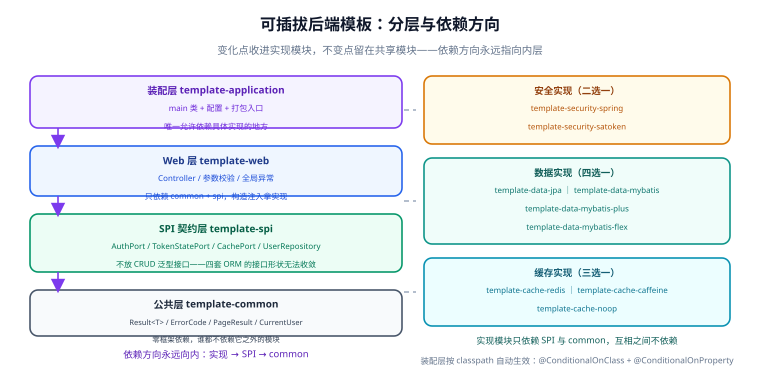
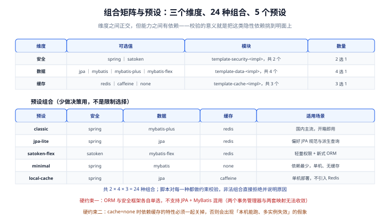
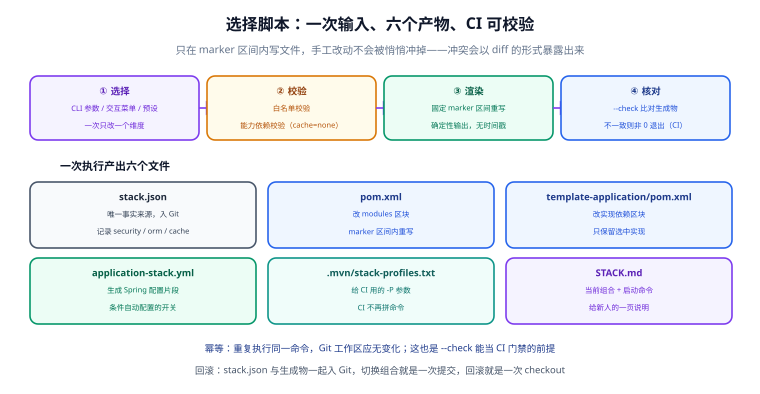

# 技术栈可插拔：模块边界与选择器脚本（第 76 天 · 步骤 ⑧）

前七步把一套完整工程基座做出来了，但它是**焊死的一套**：安全框架是 Spring Security、数据访问是 MyBatis-Plus、缓存是 Redis。换一个团队过来，只要有一处技术偏好不同（比如他们用 Sa-Token、用 JPA），整个基座就只能 fork 之后手工改——改 `pom.xml`、删实现类、换配置，改到最后没人敢确认自己删干净了。

本页做的事是把"一套焊死的基座"变成**一套可参数化的基座**：安全 / 数据 / 缓存三个维度各自可插拔，并在工程里放一个**幂等、可校验、零依赖**的选择器脚本，负责把选择结果确定性写回工程文件。



## 目标

| 能力 | 验收表现 |
| --- | --- |
| 真可换 | 换安全框架只需改一处配置 + 重跑脚本，**业务代码零改动** |
| 依赖单向 | 实现模块之间互不引用；依赖方向永不成环 |
| 换得安全 | 缺少共享存储时，依赖它的能力**必须显式降级**，不能悄悄失效 |
| 可校验 | `--check` 在不一致时非 0 退出，能直接当 CI 门禁 |
| 幂等 | 同一条命令跑两遍，`git status` 干净 |
| 零依赖 | 只用 Python 标准库，不需要 `pip install` |
| 自证 | 有一份可运行的回归测试，覆盖 24 种组合与边界行为 |

## 1. 先想清楚：什么可以插拔，什么不能

这是本页最容易被做错的地方。常见的错误做法是：在 `template-spi` 里定义一个 `BaseRepository<T, ID>`，然后让 JPA、MyBatis-Plus、MyBatis-Flex 各自去实现它。

看起来很优雅，实际会得到**最弱能力集的交集**：

| 想统一的 CRUD 方法 | JPA | MyBatis | MyBatis-Plus | MyBatis-Flex | 统一后的问题 |
| --- | --- | --- | --- | --- | --- |
| `save(entity)` | 有 | 无 | 有 | 有 | MyBatis 侧要手写 |
| `findById(id)` | 有 | 无 | 有 | 有 | 同上 |
| 分页 | `Pageable` | 需自己实现 | `Page<T>` | `Page<T>` | 三套分页模型无法归一 |
| 条件构造 | Specification / Derived | 手写 SQL | `LambdaQueryWrapper` | `QueryWrapper` | **能力差异最大的地方** |
| 多表 join | 支持 | 手写 SQL | 不支持 | 支持 | 直接决定业务能不能写 |

把这张表取交集，得到的接口既不能用 JPA 的派生查询，也不能用 MyBatis-Flex 的多表查询——**为了"统一"付出的代价是所有人都只能用到最差的那一种**。

所以本模板的定位调整为：

> **不统一框架的 CRUD 接口，只统一"业务需要什么"。**

具体说：

- `template-spi` 里只放**跨技术栈的横切契约**，不放任何 ORM 抽象。
- 业务真正需要的仓储接口（如 `UserRepository`）**按业务语义**定义，由各数据实现模块去实现。
- 业务模块（`template-web`）只依赖接口，**从头到尾不知道 ORM 是哪个**。

### 三个维度的可插拔性分级

| 维度 | 可插拔性 | 依据 |
| --- | --- | --- |
| 安全框架 | **高** | 业务侧需要的就 4 件事：登录、注销、当前用户、权限判定。差异被 `AuthPort` 吸收后，业务无感 |
| 缓存 | **高** | 接口窄（读 / 写 / 删 / 计数 / 过期）。但**共享性**是语义差异，不是接口差异——见第 6 节 |
| 数据访问 | **中** | 仓储接口可以统一，但**实现**必须各自重写；且换 ORM **不是加依赖，是改代码**。所以数据维度**只支持生成期选择，不支持运行期切换** |

::: warning 说明
数据维度的"中"必须落到工程约束上，否则就是自欺欺人：

- **支持**：`stack-select.py --orm jpa` 重新生成装配（pom + 配置）。
- **不支持**：在已写完业务的工程上换 ORM 并期望业务代码不改——实体注解、Mapper 接口、分页调用、条件构造全都要动。

第 4 节会把这条边界写成脚本里的硬约束。
:::

## 2. 模块划分：四层，依赖单向

```text
backend-template/
├─ template-common/                    # 工具、常量、错误码（不依赖任何模块）
├─ template-spi/                       # 契约层：AuthPort / TokenStatePort / CachePort + 仓储接口
│                                      #   ↑ 只依赖 common，什么框架都不依赖
├─ template-web/                       # 业务层：Controller、校验、全局异常、日志
│                                      #   ↑ 只依赖 spi + common
│
├─ template-security-spring/     ┐     # 实现层：安全
├─ template-security-satoken/    ┘
├─ template-data-jpa/            ┐     # 实现层：数据
├─ template-data-mybatis/        │
├─ template-data-mybatis-plus/   │
├─ template-data-mybatis-flex/   ┘
├─ template-cache-redis/         ┐     # 实现层：缓存
├─ template-cache-caffeine/      │
├─ template-cache-noop/          ┘
│   ↑ 实现层只依赖 spi + common，彼此之间零引用
│
└─ template-application/               # 装配层：唯一依赖具体实现的模块
                                       #   负责 main、配置、打包
```

依赖方向一句话：**`application → web / 实现层 → spi → common`，永不反向。**

四个关键约定：

1. **`template-common` 不依赖任何模块**，否则立刻成环。
2. **实现层之间零引用**。`template-security-spring` 不允许 import `template-data-mybatis-plus` 的任何类型——它们只通过 `template-spi` 的契约通信。
3. **`template-web` 不依赖任何实现层**。它能编译通过，靠的是 `spi` 里的接口。这是"业务代码零改动"能成立的**唯一原因**。
4. **`template-application` 是唯一的汇合点**。它是唯一知道"当前用的是哪套实现"的模块，而它里面**没有业务代码**，只有 `main` 和配置。

::: tip 怎么验证第 2 条真的成立
不要靠人盯。加一条 `maven-enforcer-plugin` 的禁止依赖规则，或在 CI 上跑一次依赖树检查：

```shell
# 断言实现层没有互相引用（输出为空即通过）
mvn -q dependency:tree -Dincludes=com.example.template:template-data-* \
    -pl template-security-spring
```

依赖方向这件事，**写在文档里会被遗忘，写成构建期断言才有人遵守**。
:::

## 3. SPI 契约：只定义"业务需要什么"

`template-spi` 里放三类接口。设计它们的唯一标准是：**接口的措辞应该来自业务，而不是来自框架。**

### 3.1 `AuthPort`——认证与授权

```java [template-spi/src/main/java/com/example/template/spi/auth/AuthPort.java]
package com.example.template.spi.auth;

import java.util.Set;

/**
 * 业务侧需要的认证能力。刻意**不含**任何框架概念：
 *   · 不出现 Authentication / SecurityContext / StpUtil
 *   · 不出现 Filter / Interceptor
 *   · 不出现 JWT / Session / Token 的具体形态
 *
 * 这些差异由各实现模块吸收。业务代码只认这个接口。
 */
public interface AuthPort {

    /** 登录；失败时抛 AuthException（错误码由 common 定义） */
    LoginResult login(String username, String rawPassword);

    /** 注销当前会话 */
    void logout(String accessToken);

    /** 当前登录用户；未登录返回 empty 而不是抛异常（便于匿名接口调用） */
    java.util.Optional<Principal> currentPrincipal();

    /** 权限判定：注解式鉴权的实现方内部会调到这里，也可被业务直接调用 */
    boolean hasPermission(String permission);

    /** 当前用户的角色集合 */
    Set<String> rolesOf(long userId);

    record LoginResult(String accessToken, String refreshToken, long expiresInSeconds) {}

    record Principal(long userId, String username, Set<String> roles) {}
}
```

### 3.2 `TokenStatePort`——令牌状态（降级边界就在这里）

这是整个设计里最关键的一个接口。它把"需要共享存储的三件事"**显式建模成一个类型**：

```java [template-spi/src/main/java/com/example/template/spi/auth/TokenStatePort.java]
package com.example.template.spi.auth;

import java.time.Duration;

/**
 * 令牌状态存储。三件事的共同点：**都是状态，都要在多个实例之间取得一致**。
 *
 * 这就是能力降级边界：
 *   · Redis 实现  → 真共享，多实例一致
 *   · 本地实现    → 单实例正确，多实例会各算各的
 *   · 空实现      → 能力关闭
 */
public interface TokenStatePort {

    /** 撤销：注销后未过期的 access token 必须失效 */
    void revoke(String tokenId, Duration ttl);
    boolean isRevoked(String tokenId);

    /** 连续登录失败计数（用于锁定策略） */
    long incrementFailCount(String username, Duration ttl);
    void resetFailCount(String username);

    /** 账号锁定标记 */
    void lock(String username, Duration duration);
    boolean isLocked(String username);

    /** 让实现方自报家门：当前实现能否跨实例共享 */
    boolean sharedAcrossInstances();
}
```

::: tip 为什么把 `sharedAcrossInstances()` 放进接口
它看起来"不属于业务能力"，但它让**降级这件事可以被程序读到**，而不是只写在文档里。

有了它，启动时就能做这样一件事：读到 `shared=false` 且配置了 `app.auth.account-lock-enabled=true`，**直接启动失败并说清楚原因**——比线上两个实例各锁各的要好得多。这就是把口头约定变成可执行断言。
:::

### 3.3 `CachePort`——通用业务缓存

```java [template-spi/src/main/java/com/example/template/spi/cache/CachePort.java]
package com.example.template.spi.cache;

import java.time.Duration;
import java.util.Optional;
import java.util.function.Supplier;

/**
 * 通用缓存。**刻意不做泛型序列化**：get(key, Class<T>) 这种签名会把
 * "谁能序列化谁"的实现差异泄漏到接口上（Jackson / Fastjson2 / 内部二进制格式各不一样），
 * 于是接口就不再中立了。
 *
 * 解决办法：让调用方用 lambda 表达"怎么造出这个值"。命中就返回缓存，
 * 未命中就调 loader 并写回。这对本地缓存和 Redis 都成立。
 */
public interface CachePort {

    <T> Optional<T> get(String key, Class<T> type);

    void put(String key, Object value, Duration ttl);

    void evict(String key);

    /** 读穿透保护：未命中时调 loader 并写回 */
    <T> T getOrLoad(String key, Class<T> type, Duration ttl, Supplier<T> loader);
}
```

### 3.4 仓储接口：按业务语义定义

```java [template-spi/src/main/java/com/example/template/spi/repository/UserRepository.java]
package com.example.template.spi.repository;

import com.example.template.spi.model.User;
import java.util.Optional;

/**
 * 按**业务语义**定义的仓储接口。注意它和"通用 CRUD"的区别：
 *   · 方法名来自业务（findByUsername / countActive），不是 save/update/delete 的模板抄写
 *   · 不用 Optional<User> findById(ID id) 这种泛型骨架
 *
 * 每个实现模块各自提供实现（JPA / MyBatis / MyBatis-Plus / MyBatis-Flex），
 * 各自用最顺手的写法，不需要互相妥协。
 */
public interface UserRepository {

    Optional<User> findByUsername(String username);

    User insert(User user);

    void updateLoginInfo(long userId, java.time.Instant at, String ip);

    long countActive();
}
```

::: warning 这个选择的代价要讲清楚
把仓储接口按业务语义定义，代价是：**换 ORM 时要重写仓储实现**（`UserRepository` 的 4 个方法）。

换来的是：**业务逻辑（Service / Controller）一行不用改**，且每个实现都能用自己框架最擅长的写法。

如果换成"通用 `BaseRepository<T,ID>`"，代价是所有人都只能用最弱能力（第 1 节），收益是换实现时少写几十行。**在模板场景下，前者明显更划算**——因为模板的价值就是承载业务，不是替你省那几十行。

业务规模上来后，`spi` 里的仓储接口会膨胀，届时按业务域拆成 `user-api` / `order-api` 模块即可，接口本身不用改。
:::

## 4. 两层可插拔：Maven profile 选模块，Spring 条件选 Bean

只做一层是不够的。两层各解决一个不同的问题：

| 层 | 机制 | 解决什么 | 失效时的表现 |
| --- | --- | --- | --- |
| 第一层 | **Maven profile 决定哪些模块进入 reactor** | 不该编译的实现根本不编译；不引入无关依赖（JPA 的存在不会污染 MyBatis 工程） | 两个实现同时出现在 classpath |
| 第二层 | **Spring 条件装配决定哪个 Bean 生效** | 万一 classpath 上真有两个实现，谁赢是**确定**的，不是看扫描顺序 | 启动报「找到多个候选 Bean」或随机生效 |

配置与开关：

```text
.mvn/stack-profiles.txt          # 三个 -P 参数，供 CI 拼接
stack.json                       # 唯一事实来源（三个取值）
template-application/src/main/resources/application-stack.yml   # 生成出来的功能开关
```

第二层的写法：

```java [template-security-spring/src/main/java/com/example/template/security/spring/SpringSecurityAutoConfiguration.java]
package com.example.template.security.spring;

import org.springframework.boot.autoconfigure.AutoConfiguration;
import org.springframework.boot.autoconfigure.condition.ConditionalOnClass;
import org.springframework.boot.autoconfigure.condition.ConditionalOnMissingBean;
import org.springframework.boot.autoconfigure.condition.ConditionalOnProperty;
import org.springframework.context.annotation.Bean;
import org.springframework.security.config.annotation.web.builders.HttpSecurity;

/**
 * 安全实现的自装配入口。
 *
 * 双保险的用意：
 *   · @ConditionalOnClass  → 依赖不在就不装（Maven profile 已经把不该编译的挡在外面）
 *   · @ConditionalOnProperty → classpath 上真有两个实现时，由 stack.security 决定谁生效
 *   · @ConditionalOnMissingBean → 业务方自定义了实现就不要再覆盖他
 */
@AutoConfiguration
@ConditionalOnClass(HttpSecurity.class)
@ConditionalOnProperty(name = "stack.security", havingValue = "spring", matchIfMissing = true)
public class SpringSecurityAutoConfiguration {

    @Bean
    @ConditionalOnMissingBean(AuthPort.class)
    public AuthPort springSecurityAuthPort(/* ... */) {
        return new SpringSecurityAuthPort(/* ... */);
    }
}
```

::: danger 注意：Spring Boot 4 里自动配置的注册方式变了
老写法 `META-INF/spring.factories` 里的 `EnableAutoConfiguration` 键**在 Boot 3 起就已废弃、Boot 4 不再支持**。正确位置是：

```text
template-security-spring/src/main/resources/META-INF/spring/
    org.springframework.boot.autoconfigure.AutoConfiguration.imports
```

文件内容就是一行类名（每行一个）：

```text
com.example.template.security.spring.SpringSecurityAutoConfiguration
```

顺带一句：**不要用 `@ComponentScan` 满包扫实现类**。扫描会绕过上面三道条件，让"谁生效"重新变成不可控。
:::

## 5. 组合矩阵与预设



三个维度相乘：安全 2 × 数据 4 × 缓存 3 = **24 种组合**。脚本内置 5 个预设覆盖常见诉求：

| 预设 | security | orm | cache | 适用 |
| --- | --- | --- | --- | --- |
| `classic` | spring | mybatis-plus | redis | 国内主流，开箱即用 |
| `jpa-lite` | spring | jpa | redis | 偏好 JPA 规范与派生查询 |
| `satoken-flex` | satoken | mybatis-flex | redis | 轻量权限 + 新式 ORM |
| `minimal` | spring | mybatis | none | 依赖最少，单机、无缓存 |
| `local-cache` | spring | jpa | caffeine | 单机部署，不引入 Redis |

两条**硬约束**（脚本会拒绝，不是提示）：

1. **安全与数据各自单选。** 一个工程只能有一个安全实现、一个数据实现。禁止 Spring Security + Sa-Token 并存，也禁止 JPA + MyBatis 混用——混用的结果是两套事务管理、两套实体注解在同一个上下文里互相干扰，排查成本远超收益。**需要多个数据源是另一回事**（一个 ORM + 多数据源），那是数据源配置问题，不是多 ORM 问题。
2. **缓存可以多态但不能多实现。** `redis` / `caffeine` / `none` 三选一；`none` 与 `caffeine` 都会触发降级门禁（第 6 节）。

## 6. 能力降级门禁：缺共享存储时必须显式接受

这是本模板里"把口头约定变成可执行断言"的第二个例子。

有三项能力**天然依赖共享存储**。用本地缓存或没有缓存时，它们在单实例上跑得通，一旦部署两个副本就会出现最难查的一类 bug：

| 降级项 | 单实例 | 多实例（cache != redis） |
| --- | --- | --- |
| 令牌黑名单 / 撤销 | 正常 | A 实例注销，B 实例仍认这个 token → **注销失效** |
| 登录失败计数 | 正常 | 两个实例各数各的 → 攻击者轮询打，永远不触发锁定 |
| 账号锁定 | 正常 | 同上 → **锁定形同虚设** |

所以脚本的策略是：**默认拒绝，必须显式接受。**

```shell
$ python3 scripts/stack-select.py --security spring --orm jpa --cache caffeine
ERROR 组合 cache=caffeine 会让以下能力降级，脚本默认拒绝：
  - 令牌黑名单 / 撤销
  - 登录失败计数
  - 账号锁定

原因：这三项能力都需要多实例共享的状态。用本地缓存或没有缓存时，
      单实例能跑通，但一旦部署两个副本，撤销与锁定就会各算各的。

处理方式二选一：
  a) 换回共享缓存：    --cache redis
  b) 明确接受降级：    --allow-degraded-cache（生成物会把这些开关置为 false）
$ echo $?
1
```

::: tip 为什么不做成"自动降级"
自动降级是个很自然的想法：检测到没有 Redis，就把这三项关掉、打个日志。

问题是**日志没人看**。而这三项里有两个是**安全能力**：一个静默失效的账号锁定，比一个明确报错的账号锁定危险得多。

所以本模板坚持：**降级必须是人的决定，且要留下痕迹。** 显式接受后，脚本会把开关写进生成物：

```yaml [template-application/src/main/resources/application-stack.yml]
app:
  auth:
    # 以下三项依赖共享存储；cache != redis 时会降级关闭（值变为 false）
    token-revocation-enabled: false
    fail-counter-enabled: false
    account-lock-enabled: false
  audit:
    # 登录审计与缓存无关，始终启用
    login-log-enabled: true
```

注意 `login-log-enabled` 保持 `true`——**它写的是数据库表，不是缓存**，所以不受影响。降级判定必须按"是否真的依赖共享存储"逐项判断，不能一刀切。
:::

## 7. 选择器脚本



脚本在 `project/Base/BackendTemplate/stack-select/stack-select.py`，只用 Python 标准库。

### 7.1 用法

```shell
cd backend-template

python3 scripts/stack-select.py                          # 交互式菜单
python3 scripts/stack-select.py --preset classic         # 用预设
python3 scripts/stack-select.py --security satoken --orm mybatis-flex --cache redis
python3 scripts/stack-select.py --list                   # 列出可选值与预设
python3 scripts/stack-select.py --dry-run --preset jpa-lite   # 只打印，不写文件
python3 scripts/stack-select.py --print-mvn              # 只输出当前组合对应的 mvn 命令
python3 scripts/stack-select.py --check                  # CI 门禁：不一致则非 0 退出
```

### 7.2 三条设计性质

**① 幂等。** 同一条命令跑两遍，6 个生成物字节级不变，`git status` 干净。这不是靠"小心"实现的，而是靠一条硬规则：

> **生成物是 (security, orm, cache) 三个取值的纯函数。**

不含时间戳、不含用户名、不含生成时用的预设名。

预设名不进 `stack.json` 是刻意的：一旦写进去，`--check` 就得知道当初用的是哪个预设才能复现期望结果，CI 里必然出错；而且人手改过 `stack.json` 的取值之后，那个预设名会变成一句谎话。**预设只是"怎么选"的便捷入口，不属于"选成了什么"。**

**② 可校验。** `--check` 从 `stack.json` 读出三个取值，重新算一遍期望结果，与磁盘逐字节比对：

```shell
$ python3 scripts/stack-select.py --check
OK    --check 通过：6 个生成物与 stack.json 完全一致
$ echo $?
0
```

有人手改了 `pom.xml` 的 marker 区间，或者改了 `stack.json` 却忘了重跑脚本，都会在这里以**非 0 退出**暴露出来。这让它可以放进 CI，防止"配置与构建文件漂移"。

同时 `--check` 与 `--print-mvn` **永不进入交互**——它们完全以 `stack.json` 为准。这一点很实际：在分配了 PTY 的环境里 `sys.stdin.isatty()` 会是 `true`，指望它兜底会挂住 CI。

**③ 只写 marker 区间。** 脚本只改这两个区间的内部，**区间外一个字符都不碰**（连缩进和换行风格都保持原样）：

```text
pom.xml                          <!-- stack:modules:begin --> ... <!-- stack:modules:end -->
template-application/pom.xml     <!-- stack:deps:begin -->    ... <!-- stack:deps:end -->
```

由此得到两个有用的性质：

- **手工改动与脚本改动不互相覆盖。** 你在 `pom.xml` 里给自己的业务模块加一行 `<module>my-business</module>`，只要放在 marker 区间**外面**，脚本永远不碰它，`--check` 也不会报红。
- **手改区间内内容会被发现而不是被冲掉。** 下次执行或 `--check` 会以 diff 形式把差异摆出来。

区间不存在时脚本**拒绝执行**并指明缺哪个 marker，不会猜位置自己创建。

### 7.3 六个生成物

| 文件 | 作用 |
| --- | --- |
| `pom.xml` | marker 区间内写入 `<modules>`：3 个基础模块 + 3 个选中实现 + `template-application` |
| `template-application/pom.xml` | marker 区间内写入 3 个实现模块的依赖 |
| `stack.json` | 三个取值 + 模块映射 + `degraded` 列表。**唯一事实来源** |
| `application-stack.yml` | 功能开关（含降级后的 `false`） |
| `.mvn/stack-profiles.txt` | 拼好的 `-P` 参数，供 CI 读取 |
| `STACK.md` | 给人看的组合摘要与启动命令 |

### 7.4 为什么不用一个 `-D` 属性搞定

想到过更简单的方案：不做 profile，只在构建时传一个属性，让 Spring 条件去选。放弃的原因是**它把不该编译的模块也编译了**：

- 选了 MyBatis，JPA 与 Hibernate 的 jar 仍会下载、仍在 classpath 上 → 依赖审计、漏洞扫描、镜像体积全都被污染；
- IDE 里会出现两套实体注解的自动补全，新人很容易混用；
- "当前工程到底用了什么"这件事在 `pom.xml` 里看不出来，只能靠传参复现。

**Maven profile 层的价值就是"不选的东西根本不存在"。** 这一层的成本（改 pom）是很小的，收益（依赖树干净）很大。

## 8. 自测：把"幂等 / 可校验"变成可执行的断言

`stack-select/selftest.py` 是一份可提交的回归测试，**不依赖 Maven、不联网、不动 fixture**（每次拷到临时目录跑）：

```shell
cd project/Base/BackendTemplate/stack-select
python3 selftest.py          # 或 selftest.py -v 打印每个用例细节
```

当前 **57 项断言全部通过**，覆盖：

| 类别 | 断言数 | 覆盖的性质 |
| --- | --- | --- |
| 取值与列表 | 4 | 非法取值被拦（退出码 2）、`--list` 覆盖全部取值 |
| 生成正确性 | 8 | `<modules>` 顺序与内容、注入依赖、`stack.json` 字段、`stack-profiles.txt`、`STACK.md` |
| 幂等性 | 4 | 重复执行 6 个文件字节不变；`--check` 不改文件；`--check` 通过 |
| 幂等实现细节 | 1 | `stack.json` **不含** `preset` 字段（纯函数的守卫） |
| 降级门禁 | 6 | 未接受时退出码 1 且不写文件；接受后三个开关置 `false`、`login-log` 仍为 `true` |
| 唯一事实来源 | 4 | 只手改 `stack.json` → `--check` 报红；跑一次脚本即收敛 |
| marker 边界 | 6 | 区间内篡改被报红并收敛；**区间外**手加模块不报红也不被删 |
| 区间之外不变 | 2 | 切换组合后 marker 前后内容逐字节不变 |
| 缺 marker | 3 | 退出码 1、文案点名缺失的 marker、不创建 marker |
| 换行风格 | 3 | CRLF 仓库写回后仍是 CRLF；`--check` 在 CRLF 下也通过 |
| 非交互 | 3 | `--print-mvn` 输出正确且不写文件 |
| 全矩阵 | 3 | 24 种组合全部可生成且自洽；`degraded` 计数正确（redis 0、caffeine 3、none 3） |
| 预设 | 5 | 5 个预设全部可生成且自洽 |

::: tip 为什么"区间外不变"值得单独断言
这条断言看起来过度，实际是本设计最容易被后续改动破坏的性质。

只要有人把 `replace_block` 改成"重新渲染整个文件"或"顺手格式化一下 XML"，区间外的用户内容就会被吃掉——而**这种破坏很难在代码评审里看出来**，因为 diff 通常只显示改动的行。把它写进断言，破坏的当天就会红。
:::

## 9. 验证方式

```shell
cd backend-template

# 1. 选一套组合（会写到工程文件里）
python3 scripts/stack-select.py --preset classic

# 2. 确认生效的 profile
mvn help:active-profiles
# 期望：列出 security-spring / orm-mybatis-plus / cache-redis 三个 profile

# 3. 确认 reactor 里只有选中的实现模块
mvn -q validate | grep -E "template-(security|data|cache)-"
# 期望：只出现 template-security-spring / template-data-mybatis-plus / template-cache-redis
#       不出现 satoken / jpa / mybatis-flex / caffeine

# 4. 确认依赖方向没被破坏（输出为空即通过）
mvn -q dependency:tree -Dincludes=com.example.template:template-data-* -pl template-security-spring

# 5. 幂等：跑第二遍后 git 应当干净
python3 scripts/stack-select.py --preset classic
git status --short
# 期望：无输出

# 6. CI 门禁
python3 scripts/stack-select.py --check
# 期望：OK ... 退出码 0

# 7. 幂等与边界的完整回归
cd stack-select && python3 selftest.py
# 期望：共 57 项断言，通过 57，失败 0

# 8. 换一套组合，确认业务代码没被碰过
cd ../.. && python3 scripts/stack-select.py --preset satoken-flex
git status --short
# 期望：只有 pom.xml / template-application/pom.xml 与 4 个生成物变化，
#       template-web 下的业务代码一行未变
```

验证结果记录（**请在本地执行后填写**；脚本部分已实际运行，Maven 部分当前环境无 JDK / Maven）：

| 检查项 | 期望 | 实测 | 结论 |
| --- | --- | --- | --- |
| `selftest.py` | 57/57 通过 | 57/57 | ✅ |
| `--check` 幂等 | 退出码 0 | 退出码 0 | ✅ |
| 降级未接受 | 退出码 1 且不写文件 | 退出码 1，`pom.xml` 哈希未变 | ✅ |
| 24 种组合全生成 | 全部退出码 0 | 24/24 | ✅ |
| `mvn help:active-profiles` | 三个 profile 生效 | 待填写 | ⏳ |
| reactor 只含选中实现 | 无多余实现模块 | 待填写 | ⏳ |
| 换组合后业务代码不变 | `template-web` 无 diff | 待填写 | ⏳ |

## 10. 常见坑

| 现象 | 原因 | 解决 |
| --- | --- | --- |
| IDE 里能 import 到另一套 ORM 的类 | 某个实现模块被别的模块传递依赖了 | 实现层只依赖 `spi` + `common`；用 enforcer 断言 |
| 启动报「找到多个候选 Bean」 | 两个实现同时进了 classpath | 检查 Maven profile；确认 `stack.*` 属性与 `@ConditionalOnProperty` 一致 |
| 自动配置不生效 | 放在 `spring.factories` 里了 | Boot 3+ 用 `META-INF/spring/...AutoConfiguration.imports` |
| `--check` 在 CI 上红，本地绿 | 有人手改了 pom 的 marker 区间 | 跑一次生成命令收敛，再检查是谁改的 |
| 手改的 pom 内容被脚本吃掉 | 改动写在 marker 区间**内** | 移到区间外（区间外脚本完全不碰） |
| 脚本报"缺少 marker 区间" | pom 被格式化工具重写、注释丢了 | 补回 `<!-- stack:modules:begin/end -->` 两行，脚本不猜位置 |
| 本地缓存部署两个副本后注销失效 | 令牌黑名单在本地 | 这是设计已知降级项；多实例必须用 Redis 或补齐网关层共享状态 |
| CI 上脚本进入交互卡住 | 用了交互路径而不是 `--check` | `--check` / `--print-mvn` 永不交互；其余情况给全参数或 `--yes` |
| 改完 `stack.json` 没生效 | 忘了重跑脚本 | `stack.json` 是输入，不是产物；改它之后必须跑一次 |

## 11. 下一步

本页是**第 3 周（联调与测试）之后的第 4 步**——严格说它已经越出了"联调与测试"的边界，属于模板**产品化**的第一块砖。

之所以插在这里做，是因为它决定了一件事：**后面所有交付物的形态**。如果模板是"一套焊死的基座"，那么第 4 周要交付的就是一份 Dockerfile 加一个 Compose 文件；如果模板是"可参数化的基座"，那么交付物里还要包含"参数怎么组合、组合怎么验证"。

第 76 天的第二块，是把这套能力从"脚本"推进到"CLI"：

1. **`TemplateCli`**：把选择逻辑从脚本升级为命令行工具，同时解决另一个完全不同的问题——**从零生成一个新项目**（而不是在已有项目上换栈）。这两件事的约束完全不同，见 [模板 CLI](../TemplateCli/index.md)。

## 12. 参考资料

- [测试数据隔离与边界用例](../TestIsolation/index.md)：第 75 天交付，本页的测试风格延续它
- [进展记录](../Progress/index.md)：逐日做了什么、如何验证、下一步
- [数据访问：MyBatis-Plus 接入](../DataAccess/index.md)：`template-data-mybatis-plus` 的前身
- [认证授权：Spring Security 7 + JWT](../Security/index.md)：`template-security-spring` 的前身
- [登录业务闭环与令牌生命周期](../AuthLifecycle/index.md)：`TokenStatePort` 三项能力的业务出处
- [后端通用模板 · 模块划分](../index.md)：更新后的模块结构

官方文档：

- Apache Maven · Profiles：[maven.apache.org/guides/introduction/introduction-to-profiles.html](https://maven.apache.org/guides/introduction/introduction-to-profiles.html)
- Spring Boot · 自动配置与条件注解：[docs.spring.io/spring-boot/reference/using/auto-configuration.html](https://docs.spring.io/spring-boot/reference/using/auto-configuration.html)
- Spring Boot 4.0 迁移指南（`spring.factories` → `AutoConfiguration.imports`）：[github.com/spring-projects/spring-boot/wiki/Spring-Boot-4.0-Migration-Guide](https://github.com/spring-projects/spring-boot/wiki/Spring-Boot-4.0-Migration-Guide)
- Maven Enforcer · 禁止依赖：[maven.apache.org/enforcer/enforcer-rules/bannedDependencies.html](https://maven.apache.org/enforcer/enforcer-rules/bannedDependencies.html)
