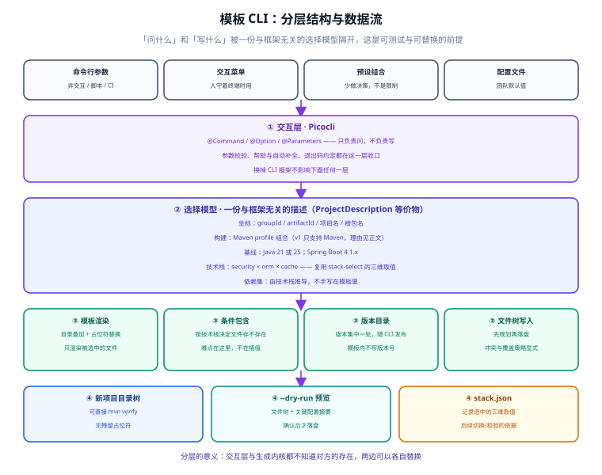
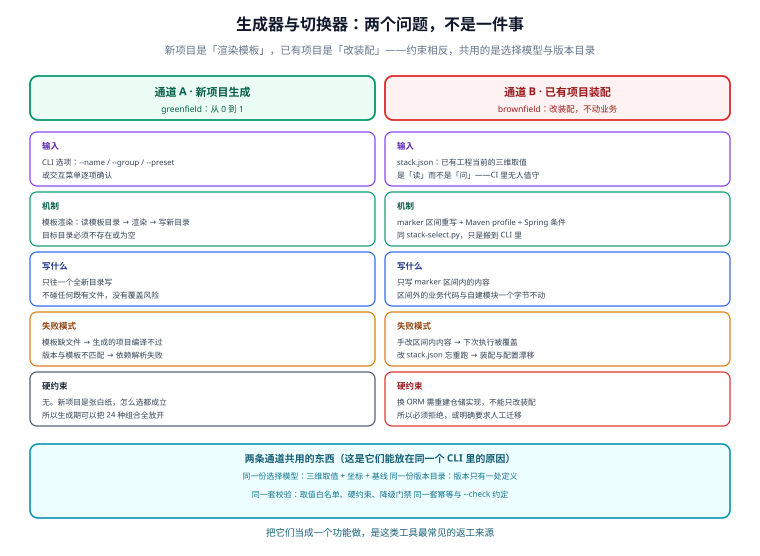

# 模板 CLI：从 0 到 1 的设计评审与路线图（第 76 天 · 步骤 ⑨）

[上一页](../StackSelect/index.md)把模板从"一套焊死的基座"变成了"一套可参数化的基座"，但开新项目的方式还是没变：**fork 一份，手工改名、改包名、删掉不要的实现模块**。这一步做 CLI，目标是把基座变成**可参数化的生成器**。

本页是一份**设计评审 + 落地路线**：先说清楚哪些设计要采纳、哪些必须改，再给出从 0 到 1 的项目形态、关键选型依据，以及 MVP 的验收标准和不做的事。



## 0. 结论先行

| 结论 | 条目 |
| --- | --- |
| **采纳** | 定制 CLI + 可扩展模板的思路；Picocli 作为交互层；Mustache 作为模板引擎；预设（Presets）；生成前预览与确认；配置外部化用环境变量占位；离线可用 |
| **修正** | ① Java 版本基线（21 不是当前 LTS）；② Shiro 的定位与是否进矩阵；③"总是取最新稳定版"与"可复现"冲突，要拆成两件事；④"集成 Initializr API 取元数据"应改为"复用其生成内核 + 元数据随包发布" |
| **补充** | ⑤ 生成器与切换器是两个不同问题，不能用一套约束做；⑥ 支持矩阵要先收窄，不能"24 组合全放开"；⑦ starter 坐标随 Boot 线变化，必须进版本目录；⑧ Boot 4 模块化带来两个必须显式声明的依赖；⑨ 模板自身要有 golden file 回归测试 |

第 1 节逐条说明为什么要改——这几条都是**时间敏感**的，写方案时成立、现在不成立。

## 1. 三处必须纠正的事实

### 1.1 Java：21 不是"当前最新 LTS"，25 才是

方案里写"Java 21 (LTS)，当前最新的长期支持版本"。按 2026-09 的实际发布节奏，这句话已经过期：

| 版本 | 发布 | 类型 | 支持到 | 备注 |
| --- | --- | --- | --- | --- |
| Java 17 | 2021-09 | LTS | 2027-10 | Spring Boot 4 的**最低**基线 |
| Java 21 | 2023-09 | LTS | 2029-12 | 虚拟线程 GA；仍有大量存量项目在用 |
| **Java 25** | 2025-09 | **LTS** | **2030-09** | **当前 LTS**；Scoped Values 正式 |
| Java 26 | 2026-03 | 非 LTS | 2026-09 | 已停止服务 |
| Java 27 | 2026-09 | 非 LTS | 2027-03 | 刚发布 |

**本项目的口径是 Java 25 LTS**（见[技术选型](../index.md)），CLI 生成物默认取 25，提供 `--java 21` 降级。

为什么默认 25 而不是更保守的 21：

1. **Spring Boot 4 的官方表述是"requires Java 17 or later, first-class support for Java 25"**——25 是它一等公民的目标版本，不是"能跑但没测"。
2. 25 支持到 2030-09，比 21 的 2029-12 长一年，对"生成出来要用三五年的工程基座"更有意义。
3. 21 相对 17 的核心收益（虚拟线程）在 25 上完全保留，25 只是超集。

什么时候该选 21：目标环境有 JDK 版本管控（公司统一镜像只到 21），或依赖链里有只在 21 上验证过的 APM agent / 中间件探针。这时 `--java 21`，**模板骨架不需要任何改动**。

::: warning 注意：「最新版本」和「最新 LTS」是两个词
Java 26（2026-03 发布，非 LTS）在 2026-09 已经停止服务——**非 LTS 版本的生命周期只有 6 个月**。而 Java 27 是 2026-09 刚发布的非 LTS 版本。

把它们和 LTS 混在一起谈"最新"，是版本选型出错最常见的原因。这条对 Java 成立，对 Spring Boot 同样成立（见 1.3）。
:::

### 1.2 Shiro 不是"传统项目之选"，但也不该进 v1 矩阵

方案里把 Shiro 描述为"传统项目之选，适合非 Spring 生态的老旧系统维护，但在分布式场景下支持有限"。前两句需要更新，第三句成立：

| 方案里的说法 | 2026 年的实际情况 |
| --- | --- |
| 适合非 Spring 生态的老旧系统 | Shiro **3.0**（2026-06 GA，最新 3.0.1）明确支持 **Spring 6/7+ 与 Spring Boot 3/4+**；它是"能用在 Spring 生态里"的框架，不是只能用在非 Spring 项目 |
| 传统项目之选 | Shiro **1.x 与 2.x 已 EOL**。3.0 是全新基线：JDK 17+、Jakarta EE 9/10/11+、在 JDK 25+ 上用 Scoped Values 替代 ThreadLocal |
| 分布式场景支持有限 | **这条成立**：分布式会话需要自己接 Redis 等外部实现，不像 Sa-Token 有开箱方案 |

社区动能确实弱。ASF 董事会 2026-06 的项目状态记录里写得很直白：

- 状态 "Ongoing with **moderate** activity"；**邮件列表流量低**（"Mailing list traffic is low"）
- 16 名 committer、12 名 PMC；**最近一位新增 PMC 成员是 2022-12-04**（近四年没有新 PMC）
- "安全漏洞报告显著增加"，同期修复 5 个安全问题、发布 4 个 CVE

所以本项目的结论**不是"Shiro 不能用"**，而是：

> **v1 不纳入支持矩阵——理由是可插拔成本，不是框架优劣。**

本模板已经把认证抽象成 [`AuthPort`](../StackSelect/index.md)。Spring Security 版已经实现，Sa-Token 版差异可控；而 Shiro 的领域模型（`Realm` / `Subject` / `SecurityManager`）与前两者差别最大，**第三个实现的边际成本高于它带来的选择价值**。

如果确实需要支持 Shiro，优先级排在"把已有组合的回归测试做扎实"**之后**。先把两个实现做到真能用，比铺三个半成品有价值。

### 1.3 "总是用最新稳定版"与"可复现"不可兼得

方案里写："不要在模板中硬编码依赖版本……从 Spring Initializr API 动态获取，确保生成的项目总是使用最新稳定版。"

后半句必须改。**动态取最新版会让同一个 CLI 版本在不同日期生成出不同的项目**：

- 昨天生成的项目能编译，今天生成的多了一个依赖的大版本跳跃，编译不过 → 用户会认为是 CLI 的 bug；
- CI 里"`template init` + `mvn verify`"这个矩阵不可复现，**"同样的输入得到同样的输出"这条最基本的性质没了**；
- `pom.xml` 的 diff 里混入大量与本次需求无关的版本变化，评审成本上升。

正确做法是把它拆成两个关注点、两套机制：

| 关注点 | 时期 | 做法 |
| --- | --- | --- |
| **可复现** | 生成期 | 依赖版本集中在**一处**版本目录（随 CLI 发布）；模板里的模块 pom **完全不写版本号**，靠 BOM 的 `dependencyManagement` 继承 |
| **新鲜度** | 维护期 | 模板仓库自己接 Renovate / Dependabot，定期提 PR 升版本 → CI 全绿 → 发新版 CLI |

网络只在显式执行 `--check-update` 时使用，**生成路径完全离线**。

::: tip 这也是"离线可用"能成立的前提
方案里同时要求"从 API 动态获取最新版本"和"离线可用"——这两条是互相矛盾的：前者要求联网，后者要求不联网。

把元数据**随包发布**（vendored），矛盾就消失了：CLI 本地有全套版本信息（够生成），联网只用于"告知有新版本"（可选增强）。**先满足离线，再考虑联网增强**，而不是反过来。
:::

### 1.4 关于 Boot 版本的一个补充

Spring Boot 的两条线需要区分清楚，否则 CLI 的默认值会选错：

| 分支 | 发布 | OSS 支持到 | 结论 |
| --- | --- | --- | --- |
| 3.x | — | **2026-06 已全部结束** | 不要作为新项目的落点 |
| 4.0.x | 2025-11 | 2026-12 | 落在这里意味着年底要再升一次 |
| **4.1.x** | 2026-06 | **2027-07** | **推荐落点** |

所以 CLI 的 Boot 基线取 **4.1.x**（与本项目的[技术选型](../index.md)一致），而不是"最新补丁版"这种说法——因为 4.0.x 也是"最新补丁版"，但它 2026-12 就失去免费安全补丁了。

**判断"该落在哪个版本"，要看支持窗口，不是看版本号大小。**

## 2. 两个问题，不是一件事

这是本页最想强调的一条，也是最容易被做错的地方。



| 维度 | 通道 A · 新项目生成 | 通道 B · 已有项目装配 |
| --- | --- | --- |
| 场景 | greenfield：从 0 到 1 | brownfield：改装配，不动业务 |
| 输入 | CLI 选项 / 交互菜单 | `stack.json`（**读**，不是问） |
| 机制 | 模板渲染 → 写新目录 | marker 区间重写 + Maven profile + Spring 条件 |
| 写入范围 | 一个全新目录 | **只有 marker 区间内** |
| 覆盖风险 | 无（目标是空目录） | 有（区间外是用户的手工改动） |
| 约束 | 基本没有，24 组合可以全放开 | **必须分档**，不是所有变更都能做 |
| 失败模式 | 模板缺文件 → 生成的项目编译不过 | 手改区间内内容被覆盖 / 装配与配置漂移 |

### 已有项目里，变更必须按成本分档

| 变更类型 | 例子 | 代价 | CLI 应有的行为 |
| --- | --- | --- | --- |
| **可增量** | 加缓存实现、加监控、加 API 文档 | 只改 marker 区间 + 加依赖，业务代码零改动 | 直接执行 |
| **需重建装配** | 换安全框架（Spring Security ↔ Sa-Token） | 重跑生成 + 改少量配置；`AuthPort` 挡住了业务侧 | 执行并打印影响清单 |
| **禁止** | 换 ORM、换构建工具 | 实体注解 / Mapper / 分页调用 / 事务语义全要动 | **拒绝执行，并说明原因** |

::: warning 为什么"禁止"这一档是必须的
一个"什么都能改"的工具，比一个"明确告诉你什么改不了"的工具**危险得多**。

反例：用户执行 `template stack use --orm jpa` 把 MyBatis-Plus 换成 JPA，CLI 老老实实改了 pom 和配置，启动成功——然后运行时在第一个 `LambdaQueryWrapper` 调用处崩掉，因为那个类已经不在 classpath 上了。用户会认为"CLI 说成功了，所以是框架的问题"，而真实原因是**这个变更本来就不该被默默执行**。

所以第二档打印影响清单、第三档直接拒绝。这和[上一页](../StackSelect/index.md)里"降级必须显式接受"是同一条原则：**把口头约定变成可执行断言。**
:::

由此得到本页的核心判断：

> **`stack-select.py` 不是 CLI 的雏形，它是 CLI 的另一半。**

两者不是重复建设：

- **脚本**的价值是"任何有 Python 的环境都能跑"，零依赖，适合 CI 和最小容器；
- **CLI** 的价值是"交互 + 生成"，解决脚本做不了的事（新项目生成、多文件树、预览）。

它们的**接口是同一份契约**：marker 区间约定 + `stack.json` schema。所以 `template stack check` 与 `python3 stack-select.py --check` 的判定必须**逐字节一致**——这是两份实现能并存的前提，也是回归测试要守住的边界。

## 3. CLI 项目本身的形态

从 0 到 1 的目录结构。关键是**把可测试的部分和不可测试的部分隔开**：

```text
template-cli/
├─ cli-core/                    # 选择模型 + 校验 + 生成编排
│   │                           #   ★ 不依赖 Picocli，不依赖任何 CLI 框架
│   ├─ model/ProjectRequest.java        # 坐标 + 基线 + 三维取值
│   ├─ model/StackSelection.java        # 与 stack-select 的三维取值同构
│   ├─ validate/StackValidator.java     # 白名单 + 硬约束 + 降级门禁
│   ├─ generate/ProjectGenerator.java   # 模板渲染 + 文件树写入
│   └─ render/TemplateRenderer.java     # 目录叠加 + 占位符替换
│
├─ cli-versions/                # 版本目录与坐标映射
│   └─ src/main/resources/versions.toml
│
├─ cli-templates/               # 模板资源（打进 jar）
│   └─ src/main/resources/templates/
│       ├─ base/                        # 与栈无关的骨架：目录、.gitignore、application.yml
│       ├─ security/{spring,satoken}/
│       ├─ orm/{jpa,mybatis,mybatis-plus,mybatis-flex}/
│       └─ cache/{redis,caffeine,noop}/
│
├─ cli-app/                     # Picocli 入口：命令定义、参数解析、退出码
│   └─ src/main/java/.../cli/
│       ├─ TemplateCli.java             # 根命令
│       ├─ InitCommand.java
│       ├─ ListCommand.java
│       ├─ StackCommand.java
│       └─ DoctorCommand.java
│
└─ cli-test/                    # golden file 快照测试 + 矩阵测试
```

::: tip 为什么 `cli-core` 不能依赖 Picocli
这是让"生成逻辑可测试"能成立的结构性前提。

如果命令类里直接写生成逻辑，那么每一项测试都要"起一个命令行进程 → 传参数 → 检查文件"，慢、脆、错误信息难读。把生成逻辑放在 `cli-core` 之后，测试可以直接调 `ProjectGenerator`：

```java
var request = ProjectRequest.builder()
        .name("demo").group("com.acme").preset("classic").build();
var result = new ProjectGenerator().generate(request, tempDir);
assertThat(result.files()).contains("pom.xml", ".gitignore");
```

顺带得到两个好处：`cli-core` 可以被别的程序当库用（CI 脚本、IDEA 插件、Web 服务），而且**换掉 Picocli 不影响生成逻辑**。
:::

### 子命令与退出码

| 命令 | 作用 | 关键参数 | 退出码 |
| --- | --- | --- | --- |
| `template init` | 生成新项目 | `--name --group --package --preset --java --out --dry-run --force` | 0 成功 / 1 校验失败 / 2 用法错误 / **3 目标目录非空** |
| `template list` | 列出取值、预设与矩阵 | `--json`（给脚本消费） | 0 |
| `template stack use` | 在已有项目里切换装配 | `--dir --security --orm --cache --allow-degraded-cache --dry-run` | 0 / 1 拒绝或校验失败 / 2 用法错误 |
| `template stack check` | CI 门禁：装配与配置是否漂移 | `--dir` | 0 一致 / 1 漂移 |
| `template doctor` | 自检：模板与版本目录完整性、外部依赖可用性 | `--json` | 0 / 1 |
| `template --version` | 版本信息（含内置的 Boot 基线与版本目录指纹） | `--json` | 0 |

两个设计细节：

1. **`--json` 开关。** 每个查询类命令都提供机器可读输出。CLI 的消费者不只是人，还有 CI 脚本和 IDE 插件——别让它们去正则解析人类的帮助文本。
2. **退出码要预留区分度。** "目标目录非空"用 3 而不是 1，是因为这两种失败的处理方式完全不同：校验失败要改参数，目录非空要么换目录要么 `--force`。脚本靠退出码分流时，这个区分是必要的。

## 4. 生成内核：自研还是复用 Spring Initializr

这是整个方案里最需要想清楚的一个选型。

| 方案 | 做法 | 优势 | 成本与风险 |
| --- | --- | --- | --- |
| **A · 全自研** | 自己设计选择模型、模板组织、条件包含、文件树写入 | 完全可控，不受任何上游约束 | **成本被严重低估**——见下方清单 |
| **B · 复用 `initializr-generator`** | 用 Spring Initializr 的生成内核，只替换自己的 conventions | 站在成熟实现上；Maven + Gradle、Java + Kotlin + Groovy 都已支持 | 需要学它的模型；上游仍是 **pre-1.0**，可能有重构 |
| **C · 混合（推荐）** | 骨架用 Initializr 生成，技术栈装配用自己的 marker 方案 | 两边的强项都用上，且与[已有实现](../StackSelect/index.md)连续 | 需要在两个模型间做一次映射 |

### 为什么推荐 C

**因为 Spring Initializr 已经把这件事做成产品了**，而且它的模型跟我们想要的几乎是一一对应：

| 我们要的东西 | Initializr 里的对应物 |
| --- | --- |
| 用户选择 | `ProjectDescription`（坐标 + 构建系统 + 语言 + 依赖集 + 平台版本 + 根包名 + 基目录） |
| 分层解耦 | `ProjectGenerator` 只依赖 `ProjectDescription` + `ProjectAssetGenerator` |
| 插件式产文件 | `ProjectContributor`（拿到项目根路径，可写任意文件） |
| 按组合选贡献者 | `@ProjectGenerationConfiguration` + `META-INF/spring.factories` 注册 |
| 条件适用 | `@ConditionalOnBuildSystem` / `@ConditionalOnPackaging` / `@ConditionalOnRequestedDependency`，也可继承 `ProjectGenerationCondition` 自定义 |
| 生成前裁决（如单选互斥） | `ProjectDescriptionCustomizer`（可 `Ordered` 排序） |
| 模板渲染 | `MustacheTemplateRenderer` |
| 每个请求独立上下文 | `ProjectGenerationContext`（每次生成一个子上下文） |

更重要的是**有生产级先例**：阿里云 `start.aliyun.com` 就是一个定制实例，通过注册自定义 `ProjectGenerationConfiguration` 来扩展 Spring Cloud Alibaba 的选项与示例代码。这说明"基于 Initializr 做自己的生成器"是被验证过的路径，不是理论推演。

**风险也要说清楚**：Initializr 官方明确写着它仍在 pre-1.0 状态、可能发生较大重构。所以方案 C 的落地方式是——**把它当依赖用，不要 fork 它的源码改**；版本锁定在版本目录里，升级时跑一次 golden file 回归。这样上游重构的影响被限制在"升级一次依赖"的范围。

### 如果坚持全自研，成本清单

这条不是为了劝退，是为了让"自研"这个决定建立在完整的成本认知上：

| 成本项 | 具体是什么 |
| --- | --- |
| 多构建工具的产物数量 | 支持 Maven + Gradle 意味着**每个文件都要有两套**：`pom.xml` vs `build.gradle.kts` + `settings.gradle.kts` + `gradle/libs.versions.toml`。产物数量直接翻倍 |
| 条件包含要自己设计 | 见第 5 节——这才是模板引擎的真正难点 |
| 版本元数据要自己维护 | BOM 解析、传递依赖冲突、版本区间校验 |
| 语言变体 | Java / Kotlin / Groovy 各一套源码模板 |
| 矩阵测试 | 组合数 × 构建工具 × 语言，CI 时间与维护成本按乘法增长 |

**结论：自研的收益主要在"完全可控"，而这个收益在 MVP 阶段用不上；成本却立刻发生。** 所以先走方案 C，把精力留给真正差异化的地方——**技术栈三维装配与降级门禁**，那是 Initializr 本身不提供的能力。

## 5. 模板组织与条件包含

### 5.1 真正的难点不是插值

直觉上会认为"模板引擎的难点是把用户输入填进占位符"。实际做起来会发现：**插值是最简单的一步**，难的是**决定哪些文件应该存在**。

举例：选了 JPA 就不该生成 `UserMapper.java` 和 `UserMapper.xml`；选了 MyBatis-Flex 就该生成 `UserTableDef.java`（APT 产物）；选了 `cache=none` 就不该生成 Redis 配置类。这些都不是"文件内容不同"，而是"文件有没有"。

所以模板体系的组织方式应该是**目录叠加 + 条件包含**：

```text
templates/
├─ base/                                 # 所有组合都有的骨架（无条件渲染）
│   ├─ .gitignore.mustache
│   ├─ README.md.mustache
│   ├─ pom.xml.mustache                  # 只含 modules 与 marker 区间
│   └─ src/main/resources/application.yml.mustache
├─ security/
│   ├─ spring/                           # 选了 spring 才叠加这一层
│   │   ├─ pom-fragment.xml              # 追加依赖（合并进 app pom 的 marker 区间）
│   │   └─ src/main/java/.../SpringSecurityAuthPort.java.mustache
│   └─ satoken/
└─ orm/
    ├─ jpa/  ├─ mybatis/  ├─ mybatis-plus/  └─ mybatis-flex/
```

渲染流程：**先渲染 `base`，再按三个维度依次叠加对应目录**。同路径的文件后叠加的覆盖先叠加的（或明确报冲突，见下）。

**"文件级条件"用 Mustache 的 Lambda 实现。** Initializr 就是这么做的——它不是靠"给每个文件加 if 判断"，而是靠"这个文件在不在被叠加的目录里"。对于确实需要文件内条件的情况（比如一份配置里只有几行跟缓存有关），用 Lambda 表达：

```text
# application.yml.mustache（片段示意）
app:
  auth:
    # 只有共享缓存时才打开这三项；条件由 Lambda 求值，模板里不写逻辑
    token-revocation-enabled: {{#sharedCache}}true{{/sharedCache}}{{^sharedCache}}false{{/sharedCache}}
```

### 5.2 为什么不用 FreeMarker

方案里给了 Mustache 或 FreeMarker 两个选项。选 Mustache，理由是**逻辑无能力是特性**：

| | Mustache | FreeMarker |
| --- | --- | --- |
| 模板内能写逻辑吗 | 基本不能（只有 section 与 Lambda） | 能（`<#if>`、`<#list>`、方法调用、字符串函数） |
| 后果 | 复杂判断被**逼回 Java 侧**，可测试、可调试 | 判断散落在模板里，改一处要读整个模板 |
| 出错时的表现 | 渲染结果错（易定位到模板） | 模板本身抛异常（栈里全是模板行号） |
| 谁在用 | Spring Initializr 的模板渲染器 | 传统 Java Web 页面渲染 |

**判断依据不是"哪个更强"，而是"哪个把复杂度放在了可测试的地方"。** 一个模板文件应该在评审时一眼能看懂——如果它里面出现三层嵌套的条件判断，那这段逻辑就放错了位置：它应该是生成器里一个有单元测试的方法。

### 5.3 同路径文件的冲突策略要显式

目录叠加会带来冲突：`base` 和 `orm/jpa` 都想写 `application.yml`。三种策略，选哪种要**明说并写进测试**：

| 策略 | 行为 | 适用 |
| --- | --- | --- |
| **报错**（推荐） | 两份都想写同一路径 → 生成失败并指出冲突 | 骨架类文件；强迫设计者把差异放进片段 |
| **覆盖** | 后叠加的赢 | 明确知道层级顺序的场合 |
| **合并** | 按文件类型合并（XML / YAML / properties） | 依赖清单、配置项 |

本项目倾向"**报错 + 用 fragment 表达差异**"：差异通过 `pom-fragment.xml`、`application-<dim>.yml` 这类**独立文件**表达，而不是两个模板抢同一个路径。这样任何一个文件都只有一个来源，调试时不需要推理"现在生效的是哪一层"。

## 6. 交互层：为什么是 Picocli

| 方案 | 优势 | 代价 | 适用 |
| --- | --- | --- | --- |
| **Picocli** | 注解驱动、子命令、颜色、自动补全；**可编译为 GraalVM native image**；单文件即可内联，零运行时依赖 | 需要自己组织 DI（或直接手工装配） | **生成器类 CLI（本项目的选择）** |
| Spring Shell | 天然整合 Spring 依赖注入，适合复杂交互式应用 | 引入 Spring 上下文；启动开销大；对"一次执行就退出"的工具是负担 | 交互式运维控制台 |
| Commander.js / Inquirer.js | 生态丰富、开发快 | **要求目标环境有 Node.js** | 面向前端团队的场景 |

选 Picocli 的两条理由都很具体：

1. **不需要 Spring 上下文。** 生成器 CLI 的执行模型是"解析参数 → 干活 → 退出"，生命周期不到一秒。为它启动一个 Spring 容器（还要处理扫描、AOT、生命周期回调）是纯粹的负担。Initializr 的 **web** 服务确实需要 Spring，但**生成内核**不需要。
2. **native image 对一个"每次开发新项目才跑一次"的工具收益很大。**

| 启动方式 | 冷启动耗时 |
| --- | --- |
| JVM（`java -jar`） | 约 0.4~0.5 秒 |
| GraalVM native image | 约 3 毫秒 |

::: warning native image 的一个坑：模板资源不会自动打包
`picocli-codegen` 注解处理器会生成 `META-INF/native-image/picocli-generated/${project}/` 下的配置（反射、资源、动态代理），让 **picocli 自身**在 native image 下可用。

但它**只管 picocli 的反射**，管不了你自己的模板文件。模板打在 jar 里、运行时用 `getResourceAsStream` 读——native image 需要在构建时显式把这些资源包含进去：

```shell
native-image \
  -H:IncludeResources='templates/.*' \
  -H:IncludeResources='versions\.toml' \
  -jar template-cli.jar
```

忘了这一步的表现是：**native image 下报"模板找不到"，而 JVM 下一切正常**——因为 JVM 版能读 jar 里的任意资源。这是本方案里最典型的"两种分发方式行为不一致"的坑，必须写进测试。
:::

## 7. 适配层的实证坑：坐标随 Boot 线变化

这是**只有在真正对齐官方文档时才会发现**的一类问题：数据访问与安全框架的 starter 坐标**不是一个固定值，而是随 Spring Boot 大版本变化**。

| 技术栈 | Spring Boot 2.x | Spring Boot 3.x | Spring Boot **4.x** |
| --- | --- | --- | --- |
| Sa-Token | `sa-token-spring-boot-starter` | `sa-token-spring-boot3-starter` | **`sa-token-spring-boot4-starter`** |
| MyBatis-Plus | `mybatis-plus-boot-starter` | `mybatis-plus-spring-boot3-starter` | **`mybatis-plus-spring-boot4-starter`**（3.5.13 起） |
| MyBatis-Flex | `mybatis-flex-spring-boot-starter` | `mybatis-flex-spring-boot3-starter` | **`mybatis-flex-spring-boot4-starter`** |

三家都还提供 BOM（`sa-token-bom` / `mybatis-plus-bom` / `mybatis-flex-dependencies`），所以版本可以靠导入 BOM 统一，**但 artifactId 没法靠 BOM 解决**——它必须由版本目录按 Boot 线映射。

这正是第 1.3 节"版本目录"要承载的东西：

```toml [cli-versions/src/main/resources/versions.toml]
[boot]
# 目标 Boot 线：4.1.x（4.0.x 的 OSS 支持 2026-12 到期，不作为新项目落点）
bootBaseline = "4.1.x"

# starter 坐标随 Boot 大版本变化，因此按线映射，不在模板里写死
[boot4]
saTokenStarter      = "sa-token-spring-boot4-starter"
mybatisPlusStarter  = "mybatis-plus-spring-boot4-starter"
mybatisFlexStarter  = "mybatis-flex-spring-boot4-starter"

[boot3]
saTokenStarter      = "sa-token-spring-boot3-starter"
mybatisPlusStarter  = "mybatis-plus-spring-boot3-starter"
mybatisFlexStarter  = "mybatis-flex-spring-boot3-starter"

[versions]
saToken     = "1.46.0"
mybatisPlus = "3.5.17"
mybatisFlex = "1.11.7"
picocli     = "4.7.7"
testcontainers = "2.0.4"
```

### Boot 4 模块化带来的两个"必须显式声明"

Spring Boot 4 把大 jar 拆成了小模块，副作用是**一些过去靠传递依赖获得的自动配置，现在要显式引入**：

| 现象 | 原因 | 必须加的依赖 |
| --- | --- | --- |
| MyBatis-Flex 在 Boot 4 下启动报"没有 DataSource" | starter 的 `spring-boot-autoconfigure` **不再默认包含 jdbc/datasource 的自动配置** | `spring-boot-starter-jdbc` |
| MyBatis-Plus 的 `LambdaQueryWrapper` / 分页在 3.5.13+ 报 SQL 解析相关错误 | 自 3.5.13 起 `jsqlparser` 被**解耦**出 starter（因为 jsqlparser 5.0+ 不再支持 JDK 8） | `mybatis-plus-jsqlparser`（JDK 8 场景用 `mybatis-plus-jsqlparser-4.9`） |

这两条都来自官方文档的明确说明，不是经验推测。**它们说明一件事：适配层的依赖清单不能凭记忆写，必须对着官方安装页核一次。** 这也是模板适配层需要 golden file 回归的原因——上游一个小版本的依赖调整就会让生成的项目启动失败。

### Jackson 3：Boot 4 的包名迁移

Boot 4 默认使用 **Jackson 3**，包名从 `com.fasterxml.jackson` 迁到 `tools.jackson`（**只有 `jackson-annotations` 保留在 `com.fasterxml.jackson.annotation`**）。

对模板生成器来说是硬伤：任何"照抄 Boot 3 教程"生成的代码都可能编译不过。

| 旧（Boot 3） | 新（Boot 4） |
| --- | --- |
| `com.fasterxml.jackson.databind.ObjectMapper` | `tools.jackson.databind.json.JsonMapper` |
| `com.fasterxml.jackson.databind.Module` | `tools.jackson.databind.JacksonModule` |
| `com.fasterxml.jackson.core.JsonGenerator` | `tools.jackson.core.JsonGenerator` |
| `Jackson2ObjectMapperBuilder`（Spring 提供） | **已移除**，改用 `JsonMapper.builder()` |

同类需要留意的还有测试侧：`@MockBean` / `@MockSpyBean` 已被 `@MockitoBean` / `@MockitoSpyBean` 取代，`@SpringBootTest` 不再自动配置 MockMvc（要显式加 `@AutoConfigureMockMvc`）。生成集成测试骨架时如果沿用旧写法，**用户第一次 `mvn verify` 就会失败**。

## 8. 支持矩阵：先收窄，再放开

如果按方案里的选项全放开：构建工具 2 × 安全框架 3 × ORM 3 × Java 版本 2 = **36 种组合**；再加上数据库、缓存、API 文档……组合数会迅速变成三位数。

**组合数不是关键，关键是每个组合都要有"生成 → 构建 → 测试"的 CI 覆盖**。否则你只是产出了一堆"看起来能生成、实际能不能跑没人知道"的配置。

所以 v1 明确收窄：

| 维度 | v1 支持 | 不收 | 不收的理由 |
| --- | --- | --- | --- |
| 构建工具 | Maven | Gradle | 产物数量翻倍；且 Gradle **没有与 Maven profile 等价的"选模块进 reactor"机制**，两层可插拔要在 Gradle 里重做一遍。收益是覆盖用 Gradle 的团队，成本是矩阵直接 ×2 |
| 安全框架 | Spring Security、Sa-Token | Shiro | 见 1.2——领域模型差异最大，第三个实现的边际成本最高 |
| ORM | JPA、MyBatis、MyBatis-Plus、MyBatis-Flex | 其他 | 与已实现的数据模块一一对应 |
| 缓存 | redis、caffeine、none | 其他 | 与已实现的缓存模块一一对应 |
| Java | 25（默认）、21 | 17 / 26 / 27 | 17 是 Boot 4 的最低线但不是好落点；26/27 是非 LTS |
| 语言 | Java | Kotlin、Groovy | 源码模板要各写一套 |

收窄后是 **2 × 4 × 3 × 2 = 48 种**——仍然不少，但每一个都能被 CI 真实覆盖。这比"支持 36 种但只测 3 种"要有价值得多。

::: danger 注意：不支持时必须在生成前报错
"不支持"的实现方式很重要。**绝不能让 CLI 接受一个不支持的组合然后生成一个跑不起来的项目**——用户拿到的是一个看起来正常、实际有问题的目录，排查成本极高。

正确行为：

```shell
$ template init --name demo --build gradle
ERROR 不支持构建工具 gradle。v1 仅支持 Maven。
      原因：Gradle 没有与 Maven profile 等价的模块选择机制，
            两层可插拔需要重新实现，排期在 v1.1。
      v1 可用的构建工具：maven
$ echo $?
1
```

**报错要给出"为什么"和"什么时候会有"**，而不是只说"不支持"。用户能接受边界，不能接受黑盒。
:::

## 9. 生成物的配置与安全约定

### 9.1 敏感信息：环境变量占位 + fail fast

```yaml [application.yml（生成物片段）]
spring:
  datasource:
    url: ${DB_URL:jdbc:mysql://localhost:3306/demo?useSSL=false}
    username: ${DB_USERNAME}
    # 刻意不给默认值：没配启动就失败，而不是连上一个空密码的库
    password: ${DB_PASSWORD}
  data:
    redis:
      host: ${REDIS_HOST:localhost}
      port: ${REDIS_PORT:6379}

app:
  auth:
    jwt:
      # 不设默认值：缺了直接启动失败
      secret: ${JWT_SECRET}
```

::: tip 不给默认值是特性，不是缺陷
`${DB_PASSWORD}` 不带 `:` 默认值时，Spring 在启动阶段就会抛出"无法解析占位符"——**这是期望行为**。

反过来，如果写成 `${DB_PASSWORD:root}`，生产环境忘了配环境变量时会**静默连上一个用 root/root 的库**，这种问题可能几个月都不会被发现。

同理 `JWT_SECRET` 不给默认值：一个硬编码在模板里的默认密钥，等于所有用这个模板的项目共用同一个签名密钥——比配置缺失严重得多。
:::

生成物必须自带的配套：

| 文件 | 内容 | 为什么 |
| --- | --- | --- |
| `.env.example` | 所有占位符的清单（值留空） | 告诉使用者"要配哪些"，同时不入库真实值 |
| `.gitignore` | 含 `.env`、`application-local.yml`、`application-*.local.yml` | 本地覆盖配置文件最容易带着密钥被提交 |
| `README.md` | "首次运行三步"：填环境变量 → 建库 → `mvn verify` | 生成的工程要能自助上手 |

### 9.2 输入校验：包名与坐标

这类错误必须在**生成之前**拦住，因为它们会生成一个"编译不过的工程"：

| 校验项 | 规则 | 常见错误 |
| --- | --- | --- |
| 包名合法性 | 每段以字母/下划线开头，只含字母数字下划线 | `com.2acme`（数字开头） |
| Java 关键字 | 包名各段不能是关键字 | `com.acme.new`、`com.acme.class` |
| `groupId` 与包名一致 | `groupId` 应能反推包名 | `groupId=com.acme` 但包名 `org.demo` |
| 项目名 | 只含字母数字与 `-`，不能是关键字 | `my project`（含空格） |
| 保留包名 | 不能落在 `java.*`、`javax.*`、`jakarta.*` 下 | `java.mytool` |
| 目录状态 | 目标目录必须不存在或为空（除非 `--force`） | 直接写进已有目录，覆盖用户文件 |

::: warning 保留字校验要用"列表 + 持续更新"，不要靠感觉
Java 的关键字表会随版本变化（`record`、`sealed`、`permits`、`yield` 都是在较新版本里加入的限定关键字）。这类校验应该维护一份显式列表，并在 `doctor` 命令里输出当前列表的版本——而不是在代码里散写几个 `if`。

Initializr 已经有一份 `validatePackageName` 实现（含保留字列表），方案 C 下可以直接复用，不必自己从头攒。
:::

### 9.3 预览与确认

`--dry-run` 输出两样东西，然后**不落盘**：

1. **文件树**（按目录分组，标注哪些来自 `base`、哪些来自叠加层）
2. **关键配置摘要**：`groupId` / `artifactId` / 根包名 / Boot 基线 / Java 版本 / 三维技术栈 / 会引入的 starter 清单 / 是否会触发降级

摘要里**必须包含降级提示**——如果用户选了 `cache=none`，摘要里要明确写出来：

```text
⚠ 降级提示
   cache=none 将使以下能力关闭（多实例部署时不可用）：
     · 令牌黑名单 / 撤销
     · 登录失败计数
     · 账号锁定
   单实例部署可接受；多实例请改用 --cache redis。
```

这与[上一页](../StackSelect/index.md)的降级门禁是同一套判定逻辑——**`cli-core` 里的 `StackValidator` 应该就是 `stack-select.py` 判定逻辑的 Java 版**，两边共用同一份规则说明。

## 10. MVP 验收标准与明确不做

### 10.1 验收标准

MVP 的唯一硬标准是：**生成出来的项目，能直接构建并测试通过。**

| 标准 | 判据 |
| --- | --- |
| **能构建** | `template init --name demo --group com.acme --preset classic && cd demo && mvn -q clean verify` **退出码 0** |
| **幂等** | 同一 CLI 版本、同一参数生成两次，两个目录树的内容哈希一致 |
| **矩阵覆盖** | CI 对**每一个受支持组合**都跑"生成 → 构建 → 测试"（48 个 job，可用矩阵并行） |
| **无残留占位符** | 生成物中不存在未替换的占位符、也不含模板源里的示例包名（用 `grep -rn` 断言） |
| **装配可校验** | 生成物自带 `stack.json`，`template stack check` 通过 |
| **离线可用** | 断网环境下 `init` 成功 |
| **预览可用** | `--dry-run` 打印文件树与关键配置摘要，且**不产生任何文件** |
| **降级显式** | 选了非共享缓存且未加 `--allow-degraded-cache` 时，以非 0 退出并说明三项降级能力 |

::: tip 为什么把"退出码 0"当唯一硬标准
因为它把前面所有约定一次性都验证了。

`mvn -q clean verify` 能过，意味着：pom 依赖解析成功（版本目录对）、自动配置生效（条件装配对）、Java 版本兼容（基线对）、starter 坐标正确（Boot 线映射对）、测试骨架可编译（旧 API 都换过了）。**一条命令覆盖这么多性质，值得把它设为门禁。**
:::

### 10.2 明确不做（MVP 边界）

工程判断的一半是"不做什么"。v1 明确不做：

| 不做 | 原因 |
| --- | --- |
| Gradle | 见第 8 节——矩阵翻倍，且两层可插拔要在 Gradle 里重做 |
| Shiro | 见 1.2——第三个实现边际成本最高 |
| Kotlin / Groovy 语言变体 | 源码模板要各写一套，收益排后 |
| 任意能力的 `add` | 只有"真可增量"的变更才做（缓存、监控、API 文档）；换 ORM 应该拒绝 |
| 远端模板仓库 / 模板热更新 | 版本目录随包发布才能保证可复现；远端模板会让"同样的 CLI 版本生成不同结果" |
| 自建 Web UI / HTTP 服务 | Initializr 本身就有 `initializr-web`，真有需要时直接用，不要自己写 |
| Spring Boot 3.x 生成支持 | 3.x 的 OSS 支持 2026-06 已结束；生成一个新项目就落在过期分支上不合理 |

## 11. 路线图

| 阶段 | 内容 | 完成判据 |
| --- | --- | --- |
| **阶段 0 · 已完成** | 选择逻辑与生成逻辑解耦：marker 契约、`stack.json` schema、[选择器脚本与自测](../StackSelect/index.md)（57 项断言） | `--check` 幂等、24 组合自洽 |
| **MVP** | `init` / `list` / `stack check`；3 个预设；Maven only；Java 25/21；2×4×3 全矩阵；golden file 测试；离线 | 48 个组合的 CI 全绿；`init && mvn verify` 退出码 0 |
| **功能完善** | `stack use`（含变更成本分档与拒绝逻辑）；`doctor`；更多预设；新增技术栈维度（数据库 MySQL/PG、API 文档、消息队列）；`--dry-run` 摘要增强 | 每个新维度都有对应 CI job |
| **生态集成** | Gradle 支持；Kotlin 语言变体；生成 Dockerfile / Compose / CI 流水线文件；`--check-update` 联网提示；native image 分发 | 分发耗时与启动耗时达标；离线仍可用 |

注意路线图的顺序逻辑：**阶段 0 不是"准备工作"，它本身就是一次交付**——marker 契约与 `stack.json` schema 是整个 CLI 的对外接口，先把它做出来并用测试锁住，后面 CLI 的实现才有参照物。这也是为什么本页能紧接着上一页写，而不是从一张白纸开始。

## 12. 验证方式

MVP 落地后，按下列顺序验证（当前环境无 JDK / Maven，命令为设计预期）：

```shell
# 0. CLI 自检：模板与版本目录完整性、外部依赖可用性
template doctor
# 期望：模板目录完整、versions.toml 可解析、JDK/Maven 满足要求

# 1. 看清单
template list
template list --json | jq '.presets | length'
# 期望：预设数量与文档一致

# 2. 预览（必须不落盘）
template init --name demo --group com.acme --preset classic --dry-run
ls demo 2>/dev/null && echo "FAIL: dry-run 落盘了" || echo "ok: 未落盘"

# 3. 生成 + 构建（MVP 唯一硬标准）
template init --name demo --group com.acme --preset classic
cd demo && mvn -q clean verify; echo "exit=$?"
# 期望：exit=0

# 4. 无残留占位符
grep -rnE '\{\{|@project\.|TODO|FIXME' . --include='*.java' --include='*.xml' --include='*.yml'
# 期望：无输出

# 5. 幂等：两次生成的目录树哈希一致
cd .. && template init --name demo2 --group com.acme --preset classic
diff <(cd demo && find . -type f | sort | xargs sha256sum) \
     <(cd demo2 && find . -type f | sort | xargs sha256sum)
# 期望：无差异（项目名不同时需先归一化项目名再比）

# 6. 装配可校验
cd demo && template stack check; echo "exit=$?"
# 期望：exit=0

# 7. 禁止的变更必须被拒绝
template stack use --dir . --orm mybatis-plus; echo "exit=$?"
# 期望：exit=1，且输出说明"换 ORM 需要重建仓储实现"

# 8. 降级必须显式接受
template init --name demo3 --group com.acme --cache none; echo "exit=$?"
# 期望：exit=1，列出三项降级能力
template init --name demo3 --group com.acme --cache none --allow-degraded-cache; echo "exit=$?"
# 期望：exit=0

# 9. 不支持的能力要报"为什么"
template init --name demo4 --group com.acme --build gradle; echo "exit=$?"
# 期望：exit=1，说明 Gradle 不在 v1 范围及原因

# 10. 离线可用
# （断网后重跑第 3 步）
```

验证结果记录（**待 MVP 落地后填写**）：

| 检查项 | 期望 | 实测 | 结论 |
| --- | --- | --- | --- |
| `template doctor` | 全部通过 | 待填写 | ⏳ |
| `--dry-run` 不落盘 | 未生成目录 | 待填写 | ⏳ |
| `init` + `mvn verify` | 退出码 0 | 待填写 | ⏳ |
| 无残留占位符 | 无输出 | 待填写 | ⏳ |
| 两次生成一致 | 无差异 | 待填写 | ⏳ |
| `stack check` | 退出码 0 | 待填写 | ⏳ |
| 换 ORM 被拒绝 | 退出码 1 + 原因 | 待填写 | ⏳ |
| 降级门禁 | 未接受时退出码 1 | 待填写 | ⏳ |
| 48 组合 CI 矩阵 | 全部通过 | 待填写 | ⏳ |
| native image 读得到模板 | 非 JVM 下也成功 | 待填写 | ⏳ |

## 13. 常见坑

| 现象 | 原因 | 解决 |
| --- | --- | --- |
| 生成物编译不过，报 `com.fasterxml.jackson` 找不到 | Boot 4 用 Jackson 3，包名迁到 `tools.jackson` | 模板里改用 `tools.jackson.*`；`jackson-annotations` 仍是 `com.fasterxml.jackson.annotation` |
| 测试骨架编译不过，`@MockBean` 未找到 | Boot 4 已移除 | 改用 `@MockitoBean` / `@MockitoSpyBean` |
| `@SpringBootTest` 下 MockMvc 注入失败 | Boot 4 不再自动配置 MockMvc | 测试类显式加 `@AutoConfigureMockMvc` |
| Flex 工程启动报没有 DataSource | Boot 4 模块化后 starter 不含 jdbc 自动配置 | 显式加 `spring-boot-starter-jdbc` |
| MyBatis-Plus 分页/条件构造报 SQL 解析错误 | 3.5.13 起 `jsqlparser` 已解耦出 starter | 显式加 `mybatis-plus-jsqlparser` |
| 生成的项目启动时自动配置未生效 | starter 坐标仍是 Boot 3 线的 | 按第 7 节的映射表取 Boot 4 线坐标 |
| native image 下报"模板找不到" | 模板资源未打进 native image | 构建时加 `-H:IncludeResources`，并加非 JVM 环境测试 |
| 用户跑 `init` 覆盖了自己的文件 | 目标目录非空却继续写 | 目录非空默认拒绝（退出码 3），`--force` 才允许 |
| 生成的工程里带着示例包名 | 模板占位符没全部替换 | golden file 测试 + `grep` 断言无残留 |
| 生成的 `.gitignore` 漏了本地配置 | 只写了 `target/` | 必须含 `.env`、`application-local.yml` |
| 生产环境连上了 root/root 的库 | 占位符给了默认值 | 敏感项不给默认值，缺了就启动失败 |
| CI 里 `init` 卡住不动 | 交互菜单在无 tty 环境下等输入 | 无 tty 或给了任一参数即走非交互；`--yes` 兜底 |
| 换 ORM 后运行时才炸 | CLI 允许了不该允许的变更 | 按第 2 节分档，第三档直接拒绝 |
| 两份模板抢同一个文件，结果随机 | 叠加冲突未定义策略 | 冲突默认报错，差异改用 fragment 表达 |
| 上游依赖升级后生成物编译不过 | 适配层依赖清单凭记忆写的 | 版本目录 + golden file 回归 + 定期对着官方安装页核对 |

## 14. 参考资料

- [技术栈可插拔：模块边界与选择器脚本](../StackSelect/index.md)：本页的"另一通道"与阶段 0 交付
- [需求与架构设计](../Architecture/index.md)：模板本身的架构与模块约定
- [认证授权：Spring Security 7 + JWT](../Security/index.md)：`AuthPort` 的 Spring Security 实现
- [数据访问：MyBatis-Plus 接入](../DataAccess/index.md)：`template-data-mybatis-plus` 实现
- [测试数据隔离与边界用例](../TestIsolation/index.md)：golden file 之外，生成物的集成测试沿用这套隔离方案
- [进展记录](../Progress/index.md)：逐日做了什么、如何验证、下一步

官方文档与版本依据：

- Spring Initializr 参考指南（`initializr-generator` / `ProjectContributor` / `@ProjectGenerationConfiguration`）：[docs.spring.io/initializr/docs/current/reference/html](https://docs.spring.io/initializr/docs/current/reference/html/)
- Spring Initializr 源码与模块划分：[github.com/spring-io/initializr](https://github.com/spring-io/initializr)
- Spring Boot 4.0 迁移指南（Jackson 3、`@MockBean`、模块化 starter）：[github.com/spring-projects/spring-boot/wiki/Spring-Boot-4.0-Migration-Guide](https://github.com/spring-projects/spring-boot/wiki/Spring-Boot-4.0-Migration-Guide)
- Spring Boot 系统要求（Java 17+，推荐最新 LTS）：[docs.spring.io/spring-boot/system-requirements.html](https://docs.spring.io/spring-boot/system-requirements.html)
- OpenJDK 版本与 LTS 时间线：[javaalmanac.io/jdk](https://javaalmanac.io/jdk)
- Sa-Token 安装与多 Boot 线 starter：[github.com/dromara/Sa-Token](https://github.com/dromara/Sa-Token)
- MyBatis-Plus 安装（Boot 4 starter 自 3.5.13 起 / jsqlparser 解耦）：[baomidou.com/getting-started/install](https://baomidou.com/getting-started/install)
- MyBatis-Flex 快速开始（Boot 4 需显式加 `spring-boot-starter-jdbc`）：[mybatis-flex.com/zh/intro/getting-started.html](https://mybatis-flex.com/zh/intro/getting-started.html)
- Apache Shiro 3.0 发布说明（JDK 17+、Spring Boot 3/4+、1.x/2.x EOL）：[shiro.apache.org/blog/2026/06/apache-shiro-300-released.html](https://shiro.apache.org/blog/2026/06/apache-shiro-300-released.html)
- Apache Shiro 项目状态（董事会记录）：[whimsy.apache.org/board/minutes/Shiro.html](https://whimsy.apache.org/board/minutes/Shiro.html)
- Picocli 官方文档与 GraalVM 支持：[picocli.info](https://picocli.info/)
- Picocli on GraalVM（启动耗时对比）：[picocli.info/picocli-on-graalvm.html](https://picocli.info/picocli-on-graalvm.html)
