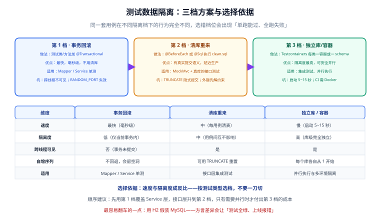
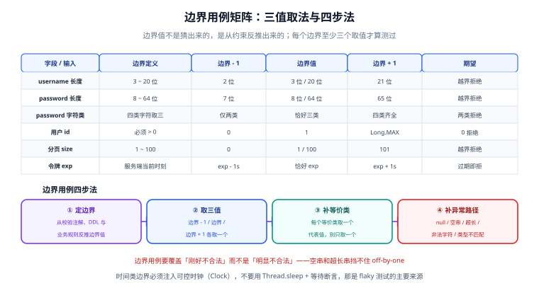

# 测试数据隔离与边界用例（第 75 天 · 步骤 ⑦）

第 73 天把认证业务闭环联调通了，第 74 天补上了性能基线、覆盖率与契约三道门禁，但整套测试还有一个**结构性问题**没解决：所有集成测试共用同一个数据库，谁先跑谁后跑结果不一样；边界用例几乎全是"明显合法"和"明显非法"两种，**off-by-one 一个都没碰到**。

本页做两件事：把测试数据隔离讲清楚并落到工程里，把边界用例从"凭感觉写"变成"按矩阵补"。



## 目标

| 能力 | 验收表现 |
| --- | --- |
| 真实依赖 | MySQL / Redis 用容器起，**不再用 H2 假装 MySQL** |
| 用例隔离 | 单个方法单独跑、全类跑、随机顺序跑，结果一致 |
| 可并行 | 类内方法可并行；类间需要并行时有明确的加锁方式 |
| 隔离有档位 | 事务回滚 / 清库 / 独立库三档，按测试类型选，不"一刀切" |
| 边界可追溯 | 每个字段的边界值来自约束（校验注解 + DDL），不是猜的 |
| 无 flaky | 时间相关用例注入可控时钟，不用 `Thread.sleep` 等结果 |

## 1. 先看症状：不隔离会怎样

下面三种失败，几乎都是"数据没隔离"而不是"代码有 bug"：

| 现象 | 真实原因 |
| --- | --- |
| 单个方法跑能过，整个类跑就失败 | 前一个用例留下的数据让后一个用例的唯一约束 / 计数断言失效 |
| 换台机器 CI 上失败，本地能过 | CI 上用例执行顺序不同（JUnit 默认顺序不保证） |
| 第二次 `mvn test` 通过，第一次失败 | 自增序列没回退，断言了具体 id |
| 加了并行执行后大面积飘红 | 多个测试类同时 `TRUNCATE` 同一张表 |

## 2. 隔离三档：按测试类型选，不要一刀切

第 1 档速度最快但隔离度最低，第 3 档反之。**把测试分层，再按层选档**，比"全部上容器"或"全部靠回滚"都合理。

| 维度 | 第 1 档 · 事务回滚 | 第 2 档 · 清库重来 | 第 3 档 · 独立库 / 容器 |
| --- | --- | --- | --- |
| 做法 | 测试类或方法加 `@Transactional` | `@BeforeEach` / `@Sql` 执行 `clean.sql` | Testcontainers，每类一容器或一 schema |
| 速度 | 最快（毫秒级） | 中（每用例清表） | 慢（容器启动 5~15 秒） |
| 隔离度 | 低（仅当前事务内） | 中（用例之间互不影响） | 高（库级完全独立） |
| **跨线程可见** | **否**（事务未提交） | 是 | 是 |
| 自增序列 | 不回退，会留空洞 | 可用 `TRUNCATE` 重置 | 每个库各自从 1 开始 |
| 适用 | Mapper / Service 单元级测试 | 接口层集成测试（MockMvc） | 需要并行、或需要多环境隔离 |
| 主要坑 | 多线程用例必失效；`RANDOM_PORT` 下失效；无法验证真实提交语义 | `TRUNCATE` 会隐式提交；有外键时需先关闭约束检查 | 资源开销大；CI 需要 Docker；镜像要预热 |

::: danger 注意：第 1 档有个致命限制
`@Transactional` 的隔离原理是"把测试方法包在一个事务里，结束后回滚"。这意味着：

1. **测试线程之外看不到这些数据**。任何跨线程的用例（并发刷新令牌、异步任务）会读不到刚插入的记录，表现为"明明插了却查不到"。
2. **`webEnvironment = RANDOM_PORT` 下完全失效**。请求由真实 Tomcat 线程处理，与测试线程不是同一个事务，回滚不回来。
3. **无法验证真实提交语义**。唯一索引冲突、`ON DUPLICATE KEY UPDATE`、触发器、外键级联这些行为在"从不提交"的事务里可能根本不触发。

所以：**第 1 档只用于 Mapper / Service 层；接口层一律升到第 2 档。**
:::

## 3. 不要用 H2 假装 MySQL

这是本模板最想强调的一条。H2 的 MySQL 兼容模式能让 `SELECT` 语句跑通，但**方言差异集中在最危险的地方**——你测试没覆盖到的那些语法：

| 差异点 | H2（MySQL 兼容模式） | 真实 MySQL 8.4 | 后果 |
| --- | --- | --- | --- |
| 原生 `JSON` 列与 `->>` 取值 | 需手动映射，语义不同 | 原生支持 | 生产环境 SQL 报错 |
| `INSERT ... ON DUPLICATE KEY UPDATE` | 不支持 | 支持 | Mapper 里的 upsert 全挂 |
| 字符集与排序规则 | 默认与 MySQL 不同 | 默认 `utf8mb4_0900_ai_ci` | 大小写敏感语义不同，`WHERE username = 'Alice'` 命中与否不一致 |
| `DATETIME(3)` 毫秒精度 | 处理方式不同 | 支持 | 时间断言随机失败 |
| `SELECT ... FOR UPDATE` 行锁 | 近似实现 | 真实行锁 / 间隙锁 | **并发用例在 H2 上必然"通过"，上线才炸** |
| 自增回退与空洞 | 与 MySQL 不一致 | `TRUNCATE` 重置 | 断言具体 id 的用例假绿 |

::: warning 说明
**H2 不是不能用，是别用来测 MySQL。** 如果项目主库是 PostgreSQL，同理不要用 H2 测 PG。**只有"与主库同一镜像、同一大版本"的容器，才有资格做集成测试的数据库。**
:::

## 4. 接入 Testcontainers

### 4.1 依赖

```xml [template-application/pom.xml]
<properties>
    <!-- 核对时间 2026-09：Testcontainers Java 当前主线为 2.0.x（最新 2.0.4） -->
    <testcontainers.version>2.0.4</testcontainers.version>
</properties>

<dependencies>
    <!-- Testcontainers 2.0 起所有模块统一加 testcontainers- 前缀：
         org.testcontainers:mysql → org.testcontainers:testcontainers-mysql
         同时容器类迁到 org.testcontainers.<模块名> 包下（如 org.testcontainers.mysql.MySQLContainer） -->
    <dependency>
        <groupId>org.testcontainers</groupId>
        <artifactId>testcontainers</artifactId>
        <version>${testcontainers.version}</version>
        <scope>test</scope>
    </dependency>
    <dependency>
        <groupId>org.testcontainers</groupId>
        <artifactId>junit-jupiter</artifactId>
        <version>${testcontainers.version}</version>
        <scope>test</scope>
    </dependency>
    <dependency>
        <groupId>org.testcontainers</groupId>
        <artifactId>testcontainers-mysql</artifactId>
        <version>${testcontainers.version}</version>
        <scope>test</scope>
    </dependency>
</dependencies>
```

::: danger 注意：Testcontainers 2.0 是破坏性升级
从 1.21.x 升到 2.0 时，下面三件事都会变：

1. **模块名加前缀**：`org.testcontainers:mysql` → `org.testcontainers:testcontainers-mysql`。
2. **包名迁移**：`MySQLContainer` 从 `org.testcontainers.containers` 迁到 **`org.testcontainers.mysql`**，照抄 1.x 教程会直接编译不过。
3. **移除 JUnit 4 支持**：`testcontainers-junit4` 不再提供。

不打算迁移就留在 `1.21.x`（最新补丁 1.21.4，官方仍会为它适配新 Docker Engine）；新项目直接用 2.x。**具体坐标用 IDE 补全确认一次，别凭记忆写。**
:::

### 4.2 容器基类（singleton container 模式）

```java [template-application/src/test/java/com/example/template/support/IntegrationTestBase.java]
package com.example.template.support;

import org.springframework.boot.test.context.SpringBootTest;
import org.springframework.test.context.ActiveProfiles;
import org.springframework.test.context.DynamicPropertyRegistry;
import org.springframework.test.context.DynamicPropertySource;
import org.testcontainers.containers.GenericContainer;
import org.testcontainers.mysql.MySQLContainer;

/**
 * 集成测试基类：真实 MySQL 8.4 + Redis 8。
 *
 * 容器声明为 static 并显式 start()，这是 singleton container 模式：
 *   · 整个 JVM 生命周期只启动一次，所有测试类共享同一个容器
 *   · 不会因为每个测试类各起一个容器把 test 阶段拖到几分钟
 * 代价是「类之间共享同一个库」，因此类之间默认不能并行（见第 6 节）。
 */
@SpringBootTest
@ActiveProfiles("test")
public abstract class IntegrationTestBase {

    protected static final MySQLContainer<?> MYSQL = new MySQLContainer<>("mysql:8.4")
            .withDatabaseName("template")
            .withUsername("test")
            .withPassword("test")
            .withReuse(true);            // 本地复用；需在 ~/.testcontainers.properties 打开开关

    protected static final GenericContainer<?> REDIS = new GenericContainer<>("redis:8-alpine")
            .withExposedPorts(6379)
            .withReuse(true);

    static {
        // 注意：这里是顺序启动，两个容器各花几秒。
        // 想并行启动可以评估 Testcontainers 的 Startables 工具类（2.x 下需确认包名）。
        MYSQL.start();
        REDIS.start();
    }

    @DynamicPropertySource
    static void overrideProperties(DynamicPropertyRegistry registry) {
        registry.add("spring.datasource.url", MYSQL::getJdbcUrl);
        registry.add("spring.datasource.username", MYSQL::getUsername);
        registry.add("spring.datasource.password", MYSQL::getPassword);
        registry.add("spring.data.redis.host", REDIS::getHost);
        registry.add("spring.data.redis.port", () -> REDIS.getMappedPort(6379));
    }
}
```

为什么用 `@DynamicPropertySource` 而不是 `application-test.yml` 写死端口：容器端口是**随机映射**的（避免与本机 3306 冲突），只能在运行时注入。

::: tip 容器复用
在用户目录建 `~/.testcontainers.properties`（Windows 是 `%USERPROFILE%\.testcontainers.properties`）：

```properties
testcontainers.reuse.enable=true
```

配合 `.withReuse(true)`，本地第二次跑测试时容器**还在运行就直接复用**，省掉十几秒启动。**但不要把这个开关用在 CI 上**——CI 的机器每次都是干净的，复用没有意义，反而会因残留数据造成难查的失败。
:::

### 4.3 测试专用 Profile

```yaml [template-application/src/test/resources/application-test.yml]
spring:
  datasource:
    # 真实地址由 IntegrationTestBase 的 @DynamicPropertySource 覆盖
    driver-class-name: com.mysql.cj.jdbc.Driver
  data:
    redis:
      # 测试专用库号，避免和本机开发用的库互相污染
      database: 15
  sql:
    init:
      mode: always              # 让 schema.sql 在每次容器启动后执行
      schema-locations: classpath:sql/schema.sql

logging:
  level:
    com.example.template: debug
    org.testcontainers: info
```

## 5. 实现隔离：清库（第 2 档）

### 5.1 清理脚本

```sql [template-application/src/test/resources/sql/clean.sql]
-- 外键检查必须临时关闭：TRUNCATE 不能作用于被外键引用的表
SET FOREIGN_KEY_CHECKS = 0;
TRUNCATE TABLE t_login_log;
TRUNCATE TABLE t_user;
SET FOREIGN_KEY_CHECKS = 1;
```

::: warning 说明
`TRUNCATE` 在 MySQL 里是**隐式提交**的 DDL 语义：它不受事务控制，所以
① 加在 `@Transactional` 的用例里也照样生效（回滚不回来）；
② 用在第 1 档的用例里会破坏"回滚"的预期。

有外键引用时**必须先 `SET FOREIGN_KEY_CHECKS = 0`**，否则报 `Cannot truncate a table referenced in a foreign key constraint`。
:::

### 5.2 在用例上声明

```java [template-application/src/test/java/com/example/template/UserApiIT.java]
package com.example.template;

import com.example.template.support.IntegrationTestBase;
import org.junit.jupiter.api.DisplayName;
import org.junit.jupiter.api.Test;
import org.springframework.beans.factory.annotation.Autowired;
import org.springframework.boot.test.autoconfigure.web.servlet.AutoConfigureMockMvc;
import org.springframework.test.context.jdbc.Sql;
import org.springframework.test.web.servlet.MockMvc;

import static org.springframework.test.web.servlet.request.MockMvcRequestBuilders.get;
import static org.springframework.test.web.servlet.result.MockMvcResultMatchers.jsonPath;
import static org.springframework.test.web.servlet.result.MockMvcResultMatchers.status;

/**
 * 每个用例前把 t_user / t_login_log 清空。
 * 关键点：这个类**不加** @Transactional —— 接口层要真实提交，才能验证唯一约束与审计字段。
 */
@AutoConfigureMockMvc
@Sql(scripts = "/sql/clean.sql", executionPhase = Sql.ExecutionPhase.BEFORE_TEST_METHOD)
class UserApiIT extends IntegrationTestBase {

    @Autowired
    private MockMvc mockMvc;

    @Test
    @DisplayName("查询不存在的用户：HTTP 404 + 业务码 10404")
    void detail_notFound() throws Exception {
        mockMvc.perform(get("/api/users/999999"))
                .andExpect(status().isNotFound())
                .andExpect(jsonPath("$.code").value(10404));
    }
}
```

### 5.3 当 `@Sql` 不够用时：动态清库

表变多以后维护 `clean.sql` 会成为负担（每次加表都要改）。用一个按前缀扫描的清理组件：

```java [template-application/src/test/java/com/example/template/support/DatabaseCleaner.java]
package com.example.template.support;

import org.springframework.context.annotation.Profile;
import org.springframework.jdbc.core.JdbcTemplate;
import org.springframework.stereotype.Component;

import java.util.List;

/**
 * 只清业务表（t_ 前缀），不动 Flyway / 审计等框架表。
 * 表名来自 information_schema（数据库自己的元数据），不是用户输入，不存在注入面。
 */
@Component
@Profile("test")
public class DatabaseCleaner {

    private final JdbcTemplate jdbcTemplate;

    public DatabaseCleaner(JdbcTemplate jdbcTemplate) {
        this.jdbcTemplate = jdbcTemplate;
    }

    public void clean() {
        jdbcTemplate.execute("SET FOREIGN_KEY_CHECKS = 0");
        List<String> tables = jdbcTemplate.queryForList(
                "SELECT table_name FROM information_schema.tables "
                        + "WHERE table_schema = DATABASE() AND table_name LIKE 't\\_%'",
                String.class);
        tables.forEach(t -> jdbcTemplate.execute("TRUNCATE TABLE " + t));
        jdbcTemplate.execute("SET FOREIGN_KEY_CHECKS = 1");
    }
}
```

配合一个最小的基类钩子：

```java
@Autowired
private DatabaseCleaner cleaner;

@BeforeEach
void resetDatabase() {
    cleaner.clean();
    // Redis 也必须清：令牌黑名单、失败计数、锁定标记都住在 Redis 里
    redisTemplate.getConnectionFactory().getConnection().serverCommands().flushDb();
}
```

::: danger 注意：只清 MySQL 不清 Redis，一定会出玄学失败
本项目有四个键族住在 Redis 里：`auth:refresh`、`auth:blacklist`、`auth:fail`、`auth:lock`。

如果只清库不清 Redis：
- 上一个用例制造的 **失败计数** 会让这个用例的第一次登录就被锁定（423）；
- 上一个用例登出的 **jti 黑名单** 会让这个用例用同一令牌拿到 401。

**规则：清库和清缓存必须成对出现。** 为测试单独分配一个 Redis 库号（如 `database: 15`）也是好习惯，一次 `flushDb` 不会误伤开发数据。
:::

## 6. 并行执行：先想清楚能不能并行

### 6.1 配置

```properties [template-application/src/test/resources/junit-platform.properties]
# 打开并行执行
junit.jupiter.execution.parallel.enabled=true

# 类内方法并行，类之间不并行
junit.jupiter.execution.parallel.mode.default=concurrent
junit.jupiter.execution.parallel.mode.classes.default=same_thread

# 线程数按 CPU 动态决定，不写死
junit.jupiter.execution.parallel.config.strategy=dynamic
junit.jupiter.execution.parallel.config.dynamic.factor=1
```

**为什么类之间默认不并行**：本模板所有集成测试共享同一个 MySQL 容器、同一个 `template` 库。两个类同时 `TRUNCATE` 同一张表，结果必然是随机的失败。

### 6.2 需要类间并行时的正确做法

要么给每个类独立的库（第 3 档完整形态），要么用 JUnit 的**资源锁**显式声明互斥：

```java
import org.junit.jupiter.api.parallel.Execution;
import org.junit.jupiter.api.parallel.ExecutionMode;
import org.junit.jupiter.api.parallel.ResourceLock;

@Execution(ExecutionMode.CONCURRENT)
@ResourceLock("db:t_user")     // 与所有声明同一把锁的类串行
class UserApiIT extends IntegrationTestBase { /* ... */ }

@ResourceLock("db:t_login_log")
class LoginApiIT extends IntegrationTestBase { /* ... */ }
```

::: tip 一句话理解
**并行不是"打开开关"，而是"证明用例之间没有共享状态"。** 先跑通隔离，再打开并行；顺序反了，你会在几百个随机失败里找不着北。
:::

## 7. 边界用例：从"凭感觉"到"按矩阵"



### 7.1 四步法

| 步骤 | 做什么 | 本项目的出处 |
| --- | --- | --- |
| **① 定边界** | 从约束反推边界值 | `@Size(min=3,max=20)`、DDL 的 `VARCHAR(20)`、`@Min(1)` |
| **② 取三值** | 边界 − 1 / 边界 / 边界 + 1 | 长度 2 / 3 / 20 / 21；`id` 取 0 / 1 |
| **③ 补等价类** | 每个等价类取一个代表 | 合法类、空值类、格式非法类、越界类 |
| **④ 补异常路径** | `null` / 空串 / 纯空格 / 超长 / 非法字符 / 类型不匹配 | Jackson 反序列化失败也是一条路径 |

### 7.2 本项目已覆盖的边界矩阵

| 字段 / 输入 | 边界定义 | 边界 − 1 | 边界值 | 边界 + 1 | 期望 |
| --- | --- | --- | --- | --- | --- |
| `username` 长度 | 3 ~ 20 位 | 2 位 | 3 位 / 20 位 | 21 位 | 越界拒绝 |
| `password` 长度 | 8 ~ 64 位 | 7 位 | 8 位 / 64 位 | 65 位 | 越界拒绝 |
| `password` 字符类 | 四类取三 | 仅两类 | 恰好三类 | 四类齐全 | 两类拒绝 |
| 用户 `id` | 必须 > 0 | 0 | 1 | `Long.MAX_VALUE` | 0 拒绝 |
| 分页 `size` | 1 ~ 100 | 0 | 1 / 100 | 101 | 越界拒绝 |
| 排序字段 | 白名单内 | — | `created_at` | 白名单外字段 | 拒绝（防注入） |
| 令牌 `exp` | 服务端当前时刻 | `exp − 1s` | 恰好 `exp` | `exp + 1s` | 过期即拒 |
| 登录失败次数 | 5 次锁定 | 第 4 次 | 第 5 次 | 第 6 次（锁定中） | 423 |
| 分页 `page` | ≥ 1 | 0 | 1 | 极大值 | 0 拒绝 / 极大值返回空 |

### 7.3 参数字面量与参数化测试

长度边界最容易写错的就是"字符串到底几位"。**不要手敲字符串**，用 `"a".repeat(n)` 生成：

```java [template-application/src/test/java/com/example/template/BoundaryIT.java]
package com.example.template;

import com.example.template.support.IntegrationTestBase;
import org.junit.jupiter.api.DisplayName;
import org.junit.jupiter.params.ParameterizedTest;
import org.junit.jupiter.params.provider.Arguments;
import org.junit.jupiter.params.provider.CsvSource;
import org.junit.jupiter.params.provider.MethodSource;
import org.springframework.beans.factory.annotation.Autowired;
import org.springframework.boot.test.autoconfigure.web.servlet.AutoConfigureMockMvc;
import org.springframework.http.MediaType;
import org.springframework.test.context.jdbc.Sql;
import org.springframework.test.web.servlet.MockMvc;

import java.util.stream.Stream;

import static org.springframework.test.web.servlet.request.MockMvcRequestBuilders.post;
import static org.springframework.test.web.servlet.result.MockMvcResultMatchers.status;

@AutoConfigureMockMvc
@Sql(scripts = "/sql/clean.sql", executionPhase = Sql.ExecutionPhase.BEFORE_TEST_METHOD)
class BoundaryIT extends IntegrationTestBase {

    @Autowired
    private MockMvc mockMvc;

    static Stream<Arguments> usernameLengthCases() {
        return Stream.of(
                Arguments.of(2, false, "小于下界"),
                Arguments.of(3, true, "恰好下界"),
                Arguments.of(20, true, "恰好上界"),
                Arguments.of(21, false, "超过上界"));
    }

    @ParameterizedTest(name = "username 长度 {0} → 通过={1}（{2}）")
    @MethodSource("usernameLengthCases")
    void usernameLengthBoundary(int len, boolean shouldPass, String desc) throws Exception {
        String body = """
                {"username":"%s","password":"Passw0rd!","mobile":"13800138000",
                 "email":"a@example.com"}
                """.formatted("a".repeat(len));

        var result = mockMvc.perform(post("/api/users")
                .contentType(MediaType.APPLICATION_JSON).content(body));

        if (shouldPass) {
            result.andExpect(status().isCreated());
        } else {
            result.andExpect(status().isBadRequest());
        }
    }

    @DisplayName("password 字符类：恰好三类通过，仅两类拒绝")
    @ParameterizedTest(name = "{0} → 通过={1}")
    @CsvSource({
            "abcABC12,     true",    // 小写 + 大写 + 数字 = 三类
            "abc12345,     false",   // 只有小写 + 数字 = 两类
            "abcABC!!,     true",    // 小写 + 大写 + 符号 = 三类
    })
    void passwordCharClassBoundary(String password, boolean shouldPass) throws Exception {
        String body = """
                {"username":"alice","password":"%s","mobile":"13800138000",
                 "email":"a@example.com"}
                """.formatted(password);
        var result = mockMvc.perform(post("/api/users")
                .contentType(MediaType.APPLICATION_JSON).content(body));
        if (shouldPass) {
            result.andExpect(status().isCreated());
        } else {
            result.andExpect(status().isBadRequest());
        }
    }
}
```

### 7.4 时间边界：注入可控时钟，不要 `Thread.sleep`

```java
@DisplayName("Access 令牌过期边界：尚未过期 / 恰好到期 / 已过期")
@ParameterizedTest(name = "exp = now {0}s → 期望 HTTP {1}")
@CsvSource({
        " 1, 200",     // 尚未过期
        " 0, 401",     // 临界：RFC 7519 规定「到期时刻本身即不可接受」
        "-1, 401",     // 已过期
})
void accessTokenExpiryBoundary(long expOffsetSeconds, int expectedStatus) throws Exception {
    // 直接把「到期时刻」构造出来，绕开「签发 → 等待 → 请求」的时间依赖
    String token = tokens.issueWithExpiry(Instant.now().plusSeconds(expOffsetSeconds));

    mockMvc.perform(get("/api/auth/me").header("Authorization", "Bearer " + token))
            .andExpect(status().is(expectedStatus));
}
```

::: danger 注意：`Thread.sleep` 是 flaky 测试的头号来源
"签发一个 1 秒过期的令牌 → `Thread.sleep(1500)` → 断言 401" 这种写法，在 CI 上会被 GC、容器 CPU 抢占、时钟漂移反复干扰，最终变成"重跑一次就过"的假象。

**正确做法**：把时钟变成可注入的依赖。

```java
@Configuration
@Profile("test")
class TestClockConfig {
    @Bean
    Clock clock() {
        // 测试里用固定时钟：需要「时间前进」时显式推进它
        return Clock.fixed(Instant.parse("2026-09-20T00:00:00Z"), ZoneOffset.UTC);
    }
}
```

业务代码统一用注入的 `Clock` 取当前时间（`Instant.now(clock)`），测试里想验证"三小时后过期"就把时钟往前拨，**零等待、零随机**。
:::

### 7.5 并发边界：必须走真实端口

```java
@SpringBootTest(webEnvironment = SpringBootTest.WebEnvironment.RANDOM_PORT)
@AutoConfigureMockMvc
class RefreshConcurrencyIT extends IntegrationTestBase {

    @LocalServerPort
    private int port;

    private static final HttpClient HTTP = HttpClient.newHttpClient();

    @DisplayName("同一个 Refresh 并发消费两次：恰好一次成功")
    @Test
    void concurrentRefresh_exactlyOneWins() throws Exception {
        String refresh = loginAndGetRefresh();

        CountDownLatch ready = new CountDownLatch(2);
        CountDownLatch go = new CountDownLatch(1);
        ExecutorService pool = Executors.newFixedThreadPool(2);
        List<Future<Integer>> futures = new ArrayList<>();
        try {
            for (int i = 0; i < 2; i++) {
                futures.add(pool.submit(() -> {
                    ready.countDown();
                    go.await(5, TimeUnit.SECONDS);
                    return refreshStatus(refresh);     // 真实 HTTP 请求
                }));
            }
            ready.await(5, TimeUnit.SECONDS);
            go.countDown();                            // 两个线程同时发出

            long ok = futures.stream()
                    .map(f -> {
                        try { return f.get(10, TimeUnit.SECONDS); }
                        catch (Exception e) { throw new IllegalStateException(e); }
                    })
                    .filter(code -> code == 200)
                    .count();

            assertThat(ok).isEqualTo(1);               // 恰好一次成功，另外一次 401
        } finally {
            pool.shutdownNow();
        }
    }

    private int refreshStatus(String refreshToken) throws Exception {
        HttpRequest req = HttpRequest.newBuilder()
                .uri(URI.create("http://localhost:" + port + "/api/auth/refresh"))
                .header("Content-Type", "application/json")
                .POST(HttpRequest.BodyPublishers.ofString(
                        "{\"refreshToken\":\"" + refreshToken + "\"}"))
                .build();
        return HTTP.send(req, HttpResponse.BodyHandlers.ofString()).statusCode();
    }
}
```

三个要点：

1. **必须用 `RANDOM_PORT`**。MockMvc 不走网络，测不出"两个请求同时到达"这件事。
2. **用 `CountDownLatch` 对齐起跑线**，不要 `for` 循环里直接提交——那往往是串行的，测了个寂寞。
3. **这个类不能加 `@Transactional`**。请求由 Tomcat 线程处理，与测试线程不是同一个事务（第 2 节讲的第 1 档限制）。

::: tip Spring Boot 4 的测试客户端
`TestRestTemplate` 在 Spring Boot 4 已被标记为废弃，官方推荐 `RestTestClient`：

```java
@SpringBootTest(webEnvironment = WebEnvironment.RANDOM_PORT)
@AutoConfigureRestTestClient
class OrderIT {
    @Autowired
    private RestTestClient restClient;
}
```

本页的并发用例刻意用 JDK 自带的 `java.net.http.HttpClient`：**它零框架依赖，不会因为测试客户端换代而失效**，也更能说明"测的是真实 HTTP"。
:::

## 8. 验证方式

```shell
cd backend-template

# 0. 先确认 Docker 在跑（Testcontainers 必须有 Docker 守护进程）
docker info > /dev/null && echo "docker ok"

# 1. 全量测试
mvn -q test
# 期望：Tests run: N, Failures: 0, Errors: 0, Skipped: 0

# 2. 确认连的是真 MySQL，不是 H2
mvn -q test -Dtest=UserApiIT -Dlogging.level.com.zaxxer.hikari=debug | grep -i "jdbc:mysql"
# 期望：输出里出现 jdbc:mysql://localhost:<随机端口>/template

# 3. 隔离性反向验证：单个方法单独跑也必须通过
mvn -q test -Dtest='BoundaryIT#usernameLengthBoundary'
# 期望：通过。若只在这个场景下失败，说明用例之间有隐藏的顺序依赖

# 4. 顺序无关反向验证：随机顺序跑三遍，结果必须一致
mvn -q test -Djunit.jupiter.testmethod.order.default=org.junit.jupiter.api.MethodOrderer\$Random
mvn -q test -Djunit.jupiter.testmethod.order.default=org.junit.jupiter.api.MethodOrderer\$Random
mvn -q test -Djunit.jupiter.testmethod.order.default=org.junit.jupiter.api.MethodOrderer\$Random

# 5. 并行开关（类内方法并行）
mvn -q test -Djunit.jupiter.execution.parallel.enabled=true

# 6. 容器复用是否生效：本地第二次跑应该几乎不等待
docker ps --filter "label=org.testcontainers" --format "table {{.Names}}\t{{.Image}}\t{{.Status}}"
```

验证结果记录（**请在本地执行后填写**，当前编写环境无 JDK / Maven / Docker，未实际运行）：

| 检查项 | 期望 | 实测 | 结论 |
| --- | --- | --- | --- |
| `docker info` | 守护进程可用 | 待填写 | ⏳ |
| `mvn test` 全量 | Failures: 0, Errors: 0 | 待填写 | ⏳ |
| Hikari 日志出现 `jdbc:mysql` | 真 MySQL，非 H2 | 待填写 | ⏳ |
| 单个方法单独跑 | 通过 | 待填写 | ⏳ |
| 随机顺序跑 3 遍 | 3 次结果一致 | 待填写 | ⏳ |
| 并行开关打开 | 仍全部通过 | 待填写 | ⏳ |
| 边界用例条数 | ≥ 25 条参数化用例 | 待填写 | ⏳ |
| 容器复用 | 第二次跑无容器启动日志 | 待填写 | ⏳ |

## 9. 常见坑

| 现象 | 原因 | 解决 |
| --- | --- | --- |
| 单跑能过、全跑失败 | 数据未隔离（第 1 档用在接口层） | 接口层升到第 2 档：`@Sql` + `clean.sql` |
| 加了 `@Transactional` 后并发用例读不到数据 | 事务未提交，其他线程不可见 | 并发用例去掉 `@Transactional`，改 `RANDOM_PORT` |
| `TRUNCATE` 报外键约束错误 | 被外键引用的表不能直接截断 | 先 `SET FOREIGN_KEY_CHECKS = 0`，清完再开回来 |
| 清库了还是随机失败 | Redis 里的失败计数 / 黑名单没清 | 清库与 `flushDb` 成对出现；测试用独立库号 |
| 断言具体 `id` 的用例时通时不通 | 自增序列不回退 | 不断言具体 id；或 `TRUNCATE` 重置 |
| 登录相关用例第二次跑就被锁 | 上一轮的失败计数留在 Redis | 每用例前清 `auth:fail` / `auth:lock` |
| `mvn test` 卡在拉镜像 | 首次运行需下载 `mysql:8.4` / `redis:8-alpine` | 预热镜像；CI 上做镜像缓存 |
| CI 上 Testcontainers 起不来 | 无 Docker 或用了 DinD 未配 `DOCKER_HOST` | 用带 Docker 的 runner，或远程 Docker 并设 `DOCKER_HOST` |
| 容器端口冲突 | 写死了 3306 / 6379 | 用随机映射，通过 `getMappedPort()` 取真实端口 |
| 复用容器后数据是脏的 | `reuse.enable=true` 复用了上次的库 | CI 关闭复用；本地跨分支切换时手动 `docker rm` 旧容器 |
| 并行后大量失败 | 多个类清同一张表 | 类间保持 `same_thread`，或用 `@ResourceLock` |
| 并行把内存跑爆 | 线程数 × Spring 上下文 | `dynamic.factor` 调小；合并测试上下文配置 |

## 10. 下一步

本页是**第 3 周（联调与测试）的第 3 步**，做完之后第 3 周还剩最后一步。

为什么把 Docker 化往后放（第 74 天的「下一步」原本写的是第 75 天做 Docker）：**第 3 周的定义是"联调与测试"，隔离与边界用例属于本周的核心交付，先把测试地基打牢，再进容器化**——否则 Docker 化之后还要回头改测试，等于同一段路走两遍。这个调整已记录在 [进展记录](../Progress/index.md) 的决策表里。

第 76 天（第 3 周 · 第 4 步）要做的是：

1. **联调问题收口**：把前三步暴露出的异常路径（JSON 反序列化失败、超大请求体、非法枚举值、并发冲突）补齐用例并统一出口。
2. **用例清单化**：把散落在各 `IT` 里的用例整理成一张「接口 × 场景」对照表，标注已覆盖与待覆盖。
3. **测试约定落文档**：把"哪一层用第几档隔离"写进团队约定，避免后来者随手加 `@Transactional` 又把并发用例弄坏。

第 80 天（第 4 周 · 部署验收）第一步再回到容器化：

1. **Docker 化**：`template-application` 多阶段构建（构建层 JDK 25、运行层 JRE 25 slim），记录镜像体积与启动时间。
2. **Compose 一键起**：应用 + MySQL 8.4 + Redis 8 编排，用 `depends_on: condition: service_healthy` 表达依赖顺序。
3. **配置外置**：数据库 / Redis 连接与令牌密钥全部改为环境变量注入，为 CI 流水线与验收清单铺路。

## 11. 参考资料

- [MockMvc 集成测试](../IntegrationTest/index.md)：测试分层与契约断言的起点
- [数据访问：MyBatis-Plus 接入](../DataAccess/index.md)：被测试的数据层实现
- [登录业务闭环与令牌生命周期](../AuthLifecycle/index.md)：Redis 四个键族与锁定策略的出处
- [压测与性能基线](../PerformanceTest/index.md)：覆盖率门禁与契约回归
- [进展记录](../Progress/index.md)：逐日做了什么、如何验证、下一步
- [效率工具 · 桌面与任务自动化](../../../../docs/Tools/Efficiency/Automation/index.md)：把 `mvn verify` 这类固定动作交给本地/CI 自动化

官方文档：

- Testcontainers Java 官方文档：[java.testcontainers.org](https://java.testcontainers.org/)
- Testcontainers 容器生命周期（singleton 模式）：[docs.docker.com/guides/testcontainers-java-lifecycle](https://docs.docker.com/guides/testcontainers-java-lifecycle/)
- JUnit 并行执行：[docs.junit.org/user-guide/current/writing-tests/parallel-execution.html](https://docs.junit.org/current/user-guide/#writing-tests-parallel-execution)
- JUnit 参数化测试：[docs.junit.org/user-guide/current/writing-tests/parameterized-tests.html](https://docs.junit.org/current/user-guide/#writing-tests-parameterized-tests)
- Spring Framework 测试上下文：[docs.spring.io/spring-framework/reference/testing.html](https://docs.spring.io/spring-framework/reference/testing.html)
- RFC 7519（JWT 的 `exp` 语义）：[datatracker.ietf.org/doc/html/rfc7519#section-4.1.4](https://datatracker.ietf.org/doc/html/rfc7519#section-4.1.4)
