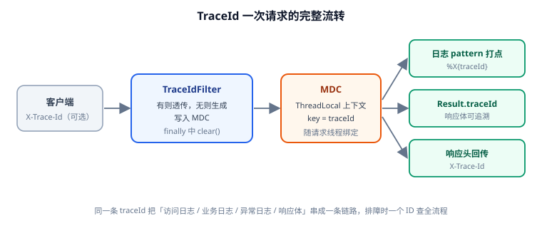

# 请求追踪 ID 与日志切面（第 70 天 · 步骤 ④）

线上排查最痛苦的不是"报错"，而是"**不知道这次报错对应哪次请求**"。本页给模板装上"身份证"：每次请求生成一个 `traceId`，自动贯穿访问日志、业务日志、异常日志与响应体；再配一个轻量日志切面，把"哪个接口、什么参数、耗时多久、成功还是失败"统一打出来。



## 目标

| 能力 | 验收表现 |
| --- | --- |
| traceId 生成与透传 | 上游带 `X-Trace-Id` 则沿用，不带则生成 |
| 上下文绑定 | 请求线程内 `MDC.get("traceId")` 有值，请求结束自动清理 |
| 日志串联 | 所有日志行前缀带 `[traceId]`，一次请求一个 ID |
| 响应体可追溯 | `Result.traceId` 有值，前端报错可回传给后端定位 |
| 响应头回传 | 响应头带 `X-Trace-Id`，便于网关/前端归档 |
| 日志切面 | 每个接口自动打印入参、耗时、结果状态，无需手写 |

## 第一块：TraceId 过滤器

Servlet Filter 在请求进入 DispatcherServlet 之前执行，最适合做上下文初始化：

```java [template-web/src/main/java/com/example/template/web/filter/TraceIdFilter.java]
package com.example.template.web.filter;

import com.example.template.common.result.TraceIdHolder;
import jakarta.servlet.Filter;
import jakarta.servlet.FilterChain;
import jakarta.servlet.ServletException;
import jakarta.servlet.ServletRequest;
import jakarta.servlet.ServletResponse;
import jakarta.servlet.http.HttpServletRequest;
import jakarta.servlet.http.HttpServletResponse;
import org.slf4j.MDC;
import org.springframework.core.Ordered;
import org.springframework.core.annotation.Order;
import org.springframework.stereotype.Component;

import java.io.IOException;
import java.util.UUID;

/**
 * 请求追踪过滤器：
 * 1. 优先沿用上游传入的 X-Trace-Id（网关/前端已生成）；没有则生成一个。
 * 2. 写入 MDC，供日志 pattern、业务代码、异常处理读取。
 * 3. 响应头回传，便于客户端与网关归档。
 * 4. finally 中清理，避免线程复用（Tomcat 线程池）导致 ID 串号。
 */
@Component
@Order(Ordered.HIGHEST_PRECEDENCE)
public class TraceIdFilter implements Filter {

    public static final String TRACE_ID_HEADER = "X-Trace-Id";

    @Override
    public void doFilter(ServletRequest request, ServletResponse response, FilterChain chain)
            throws IOException, ServletException {
        HttpServletRequest req = (HttpServletRequest) request;
        HttpServletResponse resp = (HttpServletResponse) response;

        String traceId = req.getHeader(TRACE_ID_HEADER);
        if (traceId == null || traceId.isBlank()) {
            traceId = UUID.randomUUID().toString().replace("-", "");
        }

        TraceIdHolder.set(traceId);
        resp.setHeader(TRACE_ID_HEADER, traceId);
        try {
            chain.doFilter(request, response);
        } finally {
            // 关键：线程池会复用线程，必须清理，否则下一个请求会"继承"上一个的 ID
            TraceIdHolder.clear();
        }
    }
}
```

`TraceIdHolder` 是第 69 天已定义的占位类（读/写 MDC），本页只是把它真正接上，**契约不变**。

::: danger 不清理 MDC 的后果
Tomcat 的请求线程来自线程池，处理完一个请求后会被复用。如果 `finally` 里不 `MDC.remove()`，下一个请求在过滤器写入新值之前的日志会**沿用上一个请求的 traceId**，排障时就会看到"两个请求共用一个 ID"的诡异现象。**写入与清理必须成对出现。**
:::

## 第二块：日志 pattern 带上 traceId

MDC 的值要通过日志框架的 pattern 输出。改 `logback-spring.xml`（Spring Boot 默认用 Logback）：

```xml [template-application/src/main/resources/logback-spring.xml]
<?xml version="1.0" encoding="UTF-8"?>
<configuration>
    <springProperty scope="context" name="APP_NAME" source="spring.application.name" defaultValue="app"/>

    <appender name="CONSOLE" class="ch.qos.logback.core.ConsoleAppender">
        <encoder>
            <!-- %X{traceId} 读取 MDC；取不到时用 - 占位，避免出现空白 -->
            <pattern>%d{yyyy-MM-dd HH:mm:ss.SSS} [%thread] %-5level [%X{traceId:--}] %logger{36} - %msg%n</pattern>
            <charset>UTF-8</charset>
        </encoder>
    </appender>

    <appender name="FILE" class="ch.qos.logback.core.rolling.RollingFileAppender">
        <file>logs/app.log</file>
        <rollingPolicy class="ch.qos.logback.core.rolling.SizeAndTimeBasedRollingPolicy">
            <fileNamePattern>logs/app.%d{yyyy-MM-dd}.%i.log.gz</fileNamePattern>
            <maxFileSize>100MB</maxFileSize>
            <maxHistory>30</maxHistory>
            <totalSizeCap>3GB</totalSizeCap>
        </rollingPolicy>
        <encoder>
            <pattern>%d{yyyy-MM-dd HH:mm:ss.SSS} [%thread] %-5level [%X{traceId:--}] %logger{36} - %msg%n</pattern>
            <charset>UTF-8</charset>
        </encoder>
    </appender>

    <root level="INFO">
        <appender-ref ref="CONSOLE"/>
        <appender-ref ref="FILE"/>
    </root>
</configuration>
```

::: warning `%X{traceId:--}` 的写法
`%X{traceId}` 在 MDC 无值时输出空字符串，日志会变成 `[]`；用 `%X{traceId:--}` 指定默认值 `--`，一眼能看出"这条日志不在请求上下文里"（如定时任务、启动日志）。**注意用 `logback-spring.xml` 而不是 `logback.xml`**——只有前者才能用 `springProperty` 读取 `application.yml` 里的配置。
:::

验证日志是否生效：

```shell
# 启动后发一个请求，观察控制台/日志文件
curl -s http://localhost:8080/api/ping
# 预期日志行类似：
# 2026-09-15 10:20:31.412 [http-nio-8080-exec-1] INFO  [3f2a9c8e7b1d4f60a5c2] c.e.t.web.filter.TraceIdFilter - ...
```

## 第三块：日志切面（入参 / 耗时 / 结果）

手写 `log.info("开始处理...")` 既啰嗦又容易漏。用 AOP 在 Controller 层统一埋点：

```java [template-web/src/main/java/com/example/template/web/aspect/WebLogAspect.java]
package com.example.template.web.aspect;

import com.example.template.common.exception.BizException;
import com.example.template.common.result.TraceIdHolder;
import org.aspectj.lang.ProceedingJoinPoint;
import org.aspectj.lang.annotation.Around;
import org.aspectj.lang.annotation.Aspect;
import org.aspectj.lang.annotation.Pointcut;
import org.slf4j.Logger;
import org.slf4j.LoggerFactory;
import org.springframework.stereotype.Component;
import org.springframework.web.context.request.RequestContextHolder;
import org.springframework.web.context.request.ServletRequestAttributes;

import java.util.Arrays;

/** Web 层日志切面：统一记录接口入参、耗时与结果状态。 */
@Aspect
@Component
public class WebLogAspect {

    private static final Logger log = LoggerFactory.getLogger(WebLogAspect.class);

    /** 只切带 @RestController 的类：Controller 层埋点足够。 */
    @Pointcut("@within(org.springframework.web.bind.annotation.RestController)")
    public void webLayer() {
    }

    @Around("webLayer()")
    public Object around(ProceedingJoinPoint joinPoint) throws Throwable {
        String method = joinPoint.getSignature().toShortString();
        String uri = currentUri();
        // traceId 已在 MDC 中，这里仅显式带入参数便于单测断言
        String traceId = TraceIdHolder.get();

        String args = safeArgs(joinPoint.getArgs());
        long start = System.currentTimeMillis();
        try {
            Object result = joinPoint.proceed();
            long cost = System.currentTimeMillis() - start;
            log.info("<<< uri={} method={} cost={}ms traceId={}", uri, method, cost, traceId);
            return result;
        } catch (BizException ex) {
            long cost = System.currentTimeMillis() - start;
            log.warn("<<< uri={} method={} cost={}ms code={} traceId={} args={}",
                    uri, method, cost, ex.getErrorCode().getCode(), traceId, args);
            throw ex;
        } catch (Throwable ex) {
            long cost = System.currentTimeMillis() - start;
            log.error("<<< uri={} method={} cost={}ms traceId={} args={}", uri, method, cost, traceId, args, ex);
            throw ex;
        }
    }

    private String currentUri() {
        ServletRequestAttributes attrs =
                (ServletRequestAttributes) RequestContextHolder.getRequestAttributes();
        return attrs == null ? "-" : attrs.getRequest().getMethod() + " " + attrs.getRequest().getRequestURI();
    }

    /** 入参里可能有大对象/文件流，只保留可读摘要。 */
    private String safeArgs(Object[] args) {
        if (args == null || args.length == 0) {
            return "[]";
        }
        return Arrays.stream(args)
                .map(a -> {
                    if (a == null) {
                        return "null";
                    }
                    String s = String.valueOf(a);
                    return s.length() > 200 ? s.substring(0, 200) + "..." : s;
                })
                .toList()
                .toString();
    }
}
```

引入切面的依赖（`template-web/pom.xml`）：

```xml [template-web/pom.xml]
<dependency>
    <groupId>org.springframework.boot</groupId>
    <artifactId>spring-boot-starter-aop</artifactId>
</dependency>
```

::: danger 日志切面的三个坑
1. **把整个入参无过滤地打出来**：文件流、大 JSON、密码字段都会进日志。必须截断长度，并对敏感字段脱敏（如 `password`、`idCard`）。
2. **在切面里吞掉异常**：`try { proceed() } catch (Exception e) { return null; }` 会让外层收不到异常，全局异常处理形同虚设。**必须 `throw` 出去**。
3. **切得太宽**：切 `execution(* com.example..*(..))` 会把 Service、Mapper 全部拦下，日志爆炸且影响性能。只切 `@RestController` 类层级。
:::

## 第四块：让 `Result.traceId` 自动有值

第 69 天的 `Result` 已经调用 `TraceIdHolder.get()`，本页接上 MDC 后**无需改任何代码**，`traceId` 自动填值：

```shell
curl -s http://localhost:8080/api/ping
# {"code":0,"message":"success","data":"pong","timestamp":...,"traceId":"3f2a9c8e7b1d4f60a5c2"}
```

## 验证方式

```shell
# 1. 不带 X-Trace-Id：服务端生成，响应头返回
curl -i -s http://localhost:8080/api/ping | grep -i "x-trace-id"
# 预期：X-Trace-Id: <32 位十六进制>

# 2. 带 X-Trace-Id：沿用上游的值
curl -i -s -H "X-Trace-Id: demo-trace-0001" http://localhost:8080/api/ping | grep -i "x-trace-id"
# 预期：X-Trace-Id: demo-trace-0001

# 3. 响应体里也能看到 traceId
curl -s -H "X-Trace-Id: demo-trace-0001" http://localhost:8080/api/ping
# 预期：..."traceId":"demo-trace-0001"

# 4. 用同一个 ID 在日志里把整条链路捞出来
grep "demo-trace-0001" logs/app.log
# 预期：访问日志 + 业务日志多行，traceId 一致

# 5. 线程复用不串号：连续发两个不同 ID 的请求，确认日志不交叉
curl -s -H "X-Trace-Id: t-A" http://localhost:8080/api/ping >/dev/null
curl -s -H "X-Trace-Id: t-B" http://localhost:8080/api/ping >/dev/null
grep -c "t-A" logs/app.log && grep -c "t-B" logs/app.log
```

收尾确认：

| 检查项 | 期望 |
| --- | --- |
| 无上游 ID | 服务端生成，响应头与响应体一致 |
| 有上游 ID | 原样透传，不改写 |
| 日志前缀 | 每条请求日志都带 `[traceId]` |
| 线程复用 | 连续请求 ID 不串号 |
| 非请求上下文（启动/定时任务） | 日志显示 `--` 占位 |

## 下一步

第 70 天的第三块（**参数校验增强**）与第四块（**MockMvc 集成测试**）见：[参数校验增强](../Validation/index.md)、[集成测试](../IntegrationTest/index.md)。

## 参考资料

- Spring 官方文档：[Servlet Filters](https://docs.spring.io/spring-boot/reference/web/servlet.html#web.servlet.embedded-container.servlets-filters-listeners)
- Spring 官方文档：[Aspect Oriented Programming](https://docs.spring.io/spring-framework/reference/core/aop.html)
- SLF4J：[MDC](https://www.slf4j.org/manual.html#mdc)
- Logback：[Pattern Layout](https://logback.qos.ch/manual/layouts.html#mdc)
- 相关文档：[统一响应与全局异常](../CommonResponse/index.md) / [骨架与目录结构](../Skeleton/index.md)
