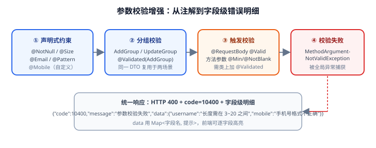

# 参数校验增强（第 70 天 · 步骤 ⑤）

第 69 天的校验只做到"能拦住错误参数"，返回的是一整串字符串。本页把校验补齐到生产可用：**同一 DTO 按新增/更新分组校验**、**自定义校验注解**、**字段级错误明细**（前端能逐字段高亮），以及方法参数的约束校验。



## 目标

| 能力 | 解决的问题 |
| --- | --- |
| 分组校验 | 新增要"密码必填"、更新要"密码可空"，一个 DTO 两套规则 |
| 自定义注解 | `@Mobile`、`@EnumValue` 等业务规则复用，不散落在 Service |
| 字段级明细 | 前端能拿到 `{字段: 提示}` 直接高亮，不用解析字符串 |
| 方法参数校验 | `@RequestParam`、`@PathVariable` 上的约束也生效 |
| 快速失败 | 校验不过直接 400，不进业务逻辑，省资源 |

## 第一块：分组校验

先定义两个空接口作为"分组标记"（也叫校验组）：

```java [template-web/src/main/java/com/example/template/web/validation/ValidationGroups.java]
package com.example.template.web.validation;

/** 校验组：新增与更新共用同一 DTO，但约束不同。 */
public final class ValidationGroups {

    /** 新增场景：ID 必须为空，字段全必填。 */
    public interface Add {
    }

    /** 更新场景：ID 必须存在，部分字段可空。 */
    public interface Update {
    }

    private ValidationGroups() {
    }
}
```

在 DTO 上用 `groups` 指定约束生效的场景：

```java [template-web/src/main/java/com/example/template/web/dto/UserDTO.java]
package com.example.template.web.dto;

import com.example.template.web.validation.ValidationGroups;
import com.example.template.web.validation.Mobile;
import jakarta.validation.constraints.Email;
import jakarta.validation.constraints.NotBlank;
import jakarta.validation.constraints.Null;
import jakarta.validation.constraints.Size;

public record UserDTO(

        /** 新增时必须为空（由后端生成），更新时必须非空。 */
        @Null(groups = ValidationGroups.Add.class, message = "新增时不能指定 ID")
        @NotBlank(groups = ValidationGroups.Update.class, message = "更新时 ID 必填")
        String id,

        @NotBlank(message = "用户名不能为空")
        @Size(min = 3, max = 20, message = "用户名长度需在 3~20 之间")
        String username,

        /** 新增必填，更新可空（不传表示不改密码）。 */
        @NotBlank(groups = ValidationGroups.Add.class, message = "新增时密码必填")
        @Size(min = 8, max = 64, groups = ValidationGroups.Add.class, message = "密码长度需在 8~64 之间")
        String password,

        @Mobile
        String mobile,

        @Email(message = "邮箱格式不正确")
        String email
) {
}
```

::: tip 没标 `groups` 的约束属于 `Default` 组
`@NotBlank(message = "用户名不能为空")` 没写 `groups`，它属于默认组 `Default`。一旦 Controller 用 `@Validated(ValidationGroups.Add.class)` 指定了组，**默认组的约束不会执行**。想让"永远都要校验"的约束在任何场景都生效，需要显式写出所有组，或用 `jakarta.validation.groups.Default` 一起声明：

```java
@NotBlank(message = "用户名不能为空",
          groups = {ValidationGroups.Add.class, ValidationGroups.Update.class,
                    jakarta.validation.groups.Default.class})
String username;
```

**新手最常踩的坑**就是在 DTO 上加了分组、结果发现部分约束"不生效了"。根因就是漏了 `Default`。
:::

Controller 上按场景选择分组：

```java [template-web/src/main/java/com/example/template/web/controller/UserController.java]
package com.example.template.web.controller;

import com.example.template.common.result.Result;
import com.example.template.web.dto.UserDTO;
import com.example.template.web.validation.ValidationGroups;
import jakarta.validation.constraints.Min;
import org.springframework.validation.annotation.Validated;
import org.springframework.web.bind.annotation.*;

/** 注意：类上必须有 @Validated，方法参数（@RequestParam 等）上的约束才会生效。 */
@Validated
@RestController
@RequestMapping("/api/users")
public class UserController {

    /** 新增：走 Add 组校验。 */
    @PostMapping
    public Result<String> add(@RequestBody @Validated(ValidationGroups.Add.class) UserDTO dto) {
        return Result.success("created:" + dto.username());
    }

    /** 更新：走 Update 组校验。 */
    @PutMapping
    public Result<String> update(@RequestBody @Validated(ValidationGroups.Update.class) UserDTO dto) {
        return Result.success("updated:" + dto.id());
    }

    /** 方法参数校验：需要类上的 @Validated 才会触发。 */
    @GetMapping("/{id}")
    public Result<Integer> detail(@PathVariable @Min(value = 1, message = "ID 必须大于 0") Long id) {
        return Result.success(id.intValue());
    }
}
```

## 第二块：自定义校验注解

业务规则（手机号、身份证、枚举值）用自定义注解封装，避免在 Service 里写一堆 `if`：

```java [template-web/src/main/java/com/example/template/web/validation/Mobile.java]
package com.example.template.web.validation;

import jakarta.validation.Constraint;
import jakarta.validation.Payload;

import java.lang.annotation.*;

/** 手机号校验注解（中国大陆号段，简化版）。 */
@Documented
@Constraint(validatedBy = MobileValidator.class)
@Target({ElementType.FIELD, ElementType.PARAMETER})
@Retention(RetentionPolicy.RUNTIME)
public @interface Mobile {

    String message() default "手机号格式不正确";

    /** 分组支持——不写这一项，自定义注解无法参与分组校验。 */
    Class<?>[] groups() default {};

    Class<? extends Payload>[] payload() default {};

    /** 是否允许为空（空值是否跳过校验）。 */
    boolean required() default false;
}
```

```java [template-web/src/main/java/com/example/template/web/validation/MobileValidator.java]
package com.example.template.web.validation;

import jakarta.validation.ConstraintValidator;
import jakarta.validation.ConstraintValidatorContext;

import java.util.regex.Pattern;

/** 手机号校验器：正则命中即通过。 */
public class MobileValidator implements ConstraintValidator<Mobile, String> {

    private static final Pattern CN_MOBILE = Pattern.compile("^1[3-9]\\d{9}$");

    private boolean required;

    @Override
    public void initialize(Mobile annotation) {
        this.required = annotation.required();
    }

    @Override
    public boolean isValid(String value, ConstraintValidatorContext context) {
        // 约定：null 交给 @NotBlank 处理，这里只校验"有值时的格式"
        if (value == null || value.isBlank()) {
            return !required;
        }
        return CN_MOBILE.matcher(value).matches();
    }
}
```

::: warning 自定义校验器里不要做数据库查询
`isValid` 可能在一次请求里被调用多次，且**默认不在事务里**。用它查库判断"用户名是否重复"会让校验变得不可控（脏读、性能、并发）。**格式类规则用注解，唯一性/存在性这类依赖状态的规则放到 Service 里用业务异常抛。**
:::

## 第三块：字段级错误明细

第 69 天的 `handleValidation` 把错误拼成了一个字符串。改成 `Map<字段, 提示>`，前端可以直接逐字段高亮：

```java [template-common/src/main/java/com/example/template/common/result/ValidationError.java]
package com.example.template.common.result;

import java.util.Map;

/** 字段级校验错误：key 为字段名，value 为提示。 */
public record ValidationError(Map<String, String> fields) {
}
```

更新全局异常处理里的两个分支：

```java [template-web/src/main/java/com/example/template/web/advice/GlobalExceptionHandler.java]
package com.example.template.web.advice;

import com.example.template.common.exception.BizException;
import com.example.template.common.result.ErrorCode;
import com.example.template.common.result.Result;
import com.example.template.common.result.TraceIdHolder;
import com.example.template.common.result.ValidationError;
import jakarta.validation.ConstraintViolation;
import jakarta.validation.ConstraintViolationException;
import org.slf4j.Logger;
import org.slf4j.LoggerFactory;
import org.springframework.http.ResponseEntity;
import org.springframework.web.bind.MethodArgumentNotValidException;
import org.springframework.web.bind.annotation.ExceptionHandler;
import org.springframework.web.bind.annotation.RestControllerAdvice;

import java.util.LinkedHashMap;
import java.util.Map;

@RestControllerAdvice
public class GlobalExceptionHandler {

    private static final Logger log = LoggerFactory.getLogger(GlobalExceptionHandler.class);

    @ExceptionHandler(BizException.class)
    public ResponseEntity<Result<Void>> handleBiz(BizException ex) {
        log.warn("业务异常 code={} msg={}", ex.getErrorCode().getCode(), ex.getMessage());
        return ResponseEntity.status(ex.getErrorCode().getHttpStatus())
                .body(Result.failure(ex.getErrorCode().getCode(), ex.getMessage()));
    }

    /** @RequestBody 上的分组校验失败：返回字段级明细。 */
    @ExceptionHandler(MethodArgumentNotValidException.class)
    public ResponseEntity<Result<ValidationError>> handleValidation(MethodArgumentNotValidException ex) {
        Map<String, String> fields = new LinkedHashMap<>();
        ex.getBindingResult().getFieldErrors().forEach(fe ->
                // 同一字段多条约束时保留第一条（通常是最贴近业务的提示）
                fields.putIfAbsent(fe.getField(), fe.getDefaultMessage()));
        log.warn("参数校验失败 {}", fields);
        return ResponseEntity.status(ErrorCode.PARAM_INVALID.getHttpStatus())
                .body(new Result<>(ErrorCode.PARAM_INVALID.getCode(),
                        ErrorCode.PARAM_INVALID.getMessage(), new ValidationError(fields),
                        System.currentTimeMillis(), TraceIdHolder.get()));
    }

    /** 方法参数（@RequestParam / @PathVariable）上的约束失败。 */
    @ExceptionHandler(ConstraintViolationException.class)
    public ResponseEntity<Result<ValidationError>> handleConstraint(ConstraintViolationException ex) {
        Map<String, String> fields = new LinkedHashMap<>();
        for (ConstraintViolation<?> cv : ex.getConstraintViolations()) {
            // propertyPath 形如 detail.id，取最后一段作为字段名
            String path = cv.getPropertyPath().toString();
            String field = path.contains(".") ? path.substring(path.lastIndexOf('.') + 1) : path;
            fields.putIfAbsent(field, cv.getMessage());
        }
        log.warn("参数约束失败 {}", fields);
        return ResponseEntity.status(ErrorCode.PARAM_INVALID.getHttpStatus())
                .body(new Result<>(ErrorCode.PARAM_INVALID.getCode(),
                        ErrorCode.PARAM_INVALID.getMessage(), new ValidationError(fields),
                        System.currentTimeMillis(), TraceIdHolder.get()));
    }

    @ExceptionHandler(Exception.class)
    public ResponseEntity<Result<Void>> handleUnknown(Exception ex) {
        log.error("系统异常", ex);
        return ResponseEntity.status(ErrorCode.SYSTEM_ERROR.getHttpStatus())
                .body(Result.failure(ErrorCode.SYSTEM_ERROR));
    }
}
```

::: warning 用 `putIfAbsent` 而不是 `put`
同一个字段可能同时违反多条约束（如用户名既太短又不匹配 pattern）。用 `put` 会让后一条覆盖前一条，前端看到的是"最后一个错误"；用 `putIfAbsent` 保留**第一条**，通常是 `@NotBlank`→`@Size`→`@Pattern` 的声明顺序，提示更符合直觉。若要用 `@GroupSequence` 控制顺序，也可在 DTO 上声明。
:::

## 第四块：校验失败不进业务逻辑

Spring MVC 的校验发生在**参数绑定阶段**，校验失败直接抛异常、根本进不了 Controller 方法体——所以业务代码里不需要 `if (dto.password() == null)` 之类的防御。可以在启动日志或压测里确认：

```shell
# 参数不合法时，日志只到 GlobalExceptionHandler，不出现业务方法里的日志
curl -s -X POST http://localhost:8080/api/users \
  -H 'Content-Type: application/json' \
  -d '{"username":"ab","password":"123","mobile":"12345"}'
```

## 验证方式

```shell
# 1. 新增：多字段同时不合法 → 400 + 字段级明细
curl -i -s -X POST http://localhost:8080/api/users \
  -H 'Content-Type: application/json' \
  -d '{"username":"ab","password":"123","mobile":"12345","email":"not-an-email"}'
# 预期：HTTP 400
# {"code":10400,"message":"参数校验失败","data":{"fields":{
#   "username":"用户名长度需在 3~20 之间","password":"密码长度需在 8~64 之间",
#   "mobile":"手机号格式不正确","email":"邮箱格式不正确"}},"traceId":"..."}

# 2. 新增时传了 ID → 命中 @Null(Add 组)
curl -s -X POST http://localhost:8080/api/users \
  -H 'Content-Type: application/json' \
  -d '{"id":"u-1","username":"alice","password":"passw0rd"}'
# 预期：data.fields.id = 新增时不能指定 ID

# 3. 更新场景：不传密码应通过，不传 ID 应失败
curl -s -X PUT http://localhost:8080/api/users \
  -H 'Content-Type: application/json' \
  -d '{"username":"alice"}'
# 预期：data.fields.id = 更新时 ID 必填

# 4. 方法参数校验：id=0 触发 @Min
curl -i -s http://localhost:8080/api/users/0
# 预期：HTTP 400，data.fields.id = ID 必须大于 0

# 5. 合法请求通过
curl -s -X POST http://localhost:8080/api/users \
  -H 'Content-Type: application/json' \
  -d '{"username":"alice","password":"passw0rd","mobile":"13800138000","email":"a@b.com"}'
# 预期：{"code":0,"data":"created:alice",...}
```

收尾确认：

| 检查项 | 期望 |
| --- | --- |
| 分组隔离 | 新增/更新场景约束不同且互不干扰 |
| 默认组不丢 | 未标 `groups` 的约束在指定组时仍按需生效 |
| 自定义注解 | `@Mobile` 在合法/非法值上表现正确 |
| 字段级明细 | `data.fields` 是 `{字段: 提示}` 结构 |
| 方法参数校验 | `@PathVariable` / `@RequestParam` 约束生效 |
| 无堆栈泄露 | 校验失败响应不含堆栈，日志有记录 |

## 下一步

第 70 天的收尾：把这些 curl 验证写成 MockMvc 自动化测试，接入 CI 质量门禁。见[集成测试](../IntegrationTest/index.md)。

## 参考资料

- Jakarta Bean Validation：[Specification](https://jakarta.ee/specifications/bean-validation/)
- Spring 官方文档：[Validation](https://docs.spring.io/spring-boot/reference/io/validation.html)
- Spring 官方文档：[Method Validation](https://docs.spring.io/spring-framework/reference/core/validation/beanvalidation.html#validation-method-validation)
- Hibernate Validator：[Custom constraints](https://docs.jboss.org/hibernate/stable/validator/reference/en-US/html_single/#validator-customconstraints)
- 相关文档：[统一响应与全局异常](../CommonResponse/index.md) / [请求追踪 ID 与日志切面](../TraceId/index.md)
