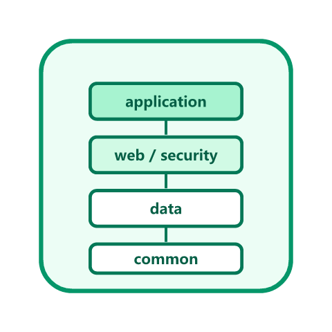

# 后端通用模板

<p style="text-align:center;"></p>

周期 3（第 61~90 天）的月度项目：从 0 到 1 构建一套**可直接复用的后端通用模板**。目标不是"跑通一个 Hello World"，而是交付一个具备统一响应、全局异常、参数校验、认证授权、多环境配置、数据访问、日志与健康检查、容器化部署的**完整工程基座**——新业务项目 fork 后改配置即可开工。

## 项目目标与验收标准

| 维度 | 具体目标 | 验收方式 |
| --- | --- | --- |
| 广度 | 覆盖工程结构、配置、Web、校验、异常、数据访问、认证、日志、监控、部署 | 每块都有可运行代码与文档 |
| 深度 | 每块都讲清"为什么这么设计"，不是抄一份配置 | 关键决策有对比与取舍说明 |
| 完整性 | 一键启动 + 一键打包 + 一键部署脚本 | 按文档从零可在 15 分钟内跑起来 |
| 可验证 | 每一步都有 curl / 命令 / 预期输出 | 验收清单逐条打勾 |

## 技术选型

| 组件 | 选型 | 版本基线 | 选型理由 |
| --- | --- | --- | --- |
| 语言 | Java | 25 LTS | 当前 LTS（Spring Boot 4.x 最低 Java 17，推荐 25） |
| 框架 | Spring Boot | 4.1.x | 2026 年当前稳定版（基于 Spring Framework 7、默认 Jackson 3） |
| 构建 | Maven | 3.9+ | 生态成熟、模板化程度高，多模块支持好 |
| Web | Spring MVC | 随 Boot | 团队熟悉度高，同步阻塞模型易排查 |
| 校验 | Jakarta Bean Validation | 随 Boot | 声明式校验，错误统一收集 |
| 文档 | springdoc-openapi | 2.x 线 | 注解即文档，配合 Knife4j 可观感更好 |
| 安全 | Spring Security | 7.x | 与 Spring Boot 4.x 主线匹配 |
| 数据库 | MySQL + MyBatis-Plus | MySQL 8.4 LTS | 国内团队主流组合，8.4 支持到 2032 |
| 缓存 | Redis | 8.x | 通用缓存与会话/令牌存储 |
| 监控 | Spring Boot Actuator + Micrometer | 随 Boot | 零侵入暴露健康、指标、端点 |
| 部署 | Docker + Compose | — | 环境一致性最好的落地方式 |

::: info 版本说明（2026-09 核对）
Spring Boot 4.1 于 2026-06 发布，为当前稳定版；**3.5.x 的 OSS 支持已于 2026-06-30 结束**，新项目不建议再以 3.x 为基线。Spring Security 7.x 对应 Spring Boot 4.x。若团队存量仍在 3.x，模板结构不变，只需把依赖与 `jakarta` 包名按 3.x 调整（详见仓库 Spring Boot 版本页）。
:::

## 模块划分

```text
backend-template/
├─ template-common/       # 统一响应、错误码、工具类、常量（不依赖 Web）
├─ template-web/          # Web 层：Controller、参数校验、全局异常、Swagger
├─ template-security/     # 认证授权：JWT、过滤器、权限注解
├─ template-data/         # 数据访问：MyBatis-Plus、分页、多数据源预留
├─ template-application/  # 启动模块：main、配置文件、打包入口
├─ docker/                # Dockerfile、compose 文件
├─ scripts/               # 启动、打包、部署脚本
└─ docs/                  # 模块设计与验收记录
```

模块依赖方向严格单向：`application → web → security → data → common`，**common 不依赖任何模块**，避免循环依赖。

## 进度跟踪

| 日期 | 阶段 | 本次产出 | 状态 |
| --- | --- | --- | --- |
| 第 61-68 天 | 第 1 周：需求与设计 | 需求清单、技术选型、模块划分、目录结构、接口契约 | ✅ 见[需求与架构设计](./Architecture/index.md) |
| 第 69 天 | 第 2 周：核心编码 ① | 可运行骨架 + 统一响应 + 全局异常 + 健康检查 | ✅ 见下方模块页 |
| 第 70 天 | 第 2 周：核心编码 ② | 请求追踪 ID + 日志切面 + 参数校验增强 + MockMvc 集成测试 | ✅ 见下方模块页 |
| 第 71 天 | 第 2 周：核心编码 ③ | MyBatis-Plus 接入 + 分页插件 + 审计字段自动填充 + 逻辑删除/乐观锁 + 数据层集成测试 | ✅ 见下方模块页 |
| 第 72 天（计划） | 第 2 周：核心编码 ④ | Spring Security 7 + JWT 认证链路 | ⏳ |
| 第 73-79 天 | 第 3 周：联调与测试 | 单元测试、集成测试、压测、覆盖率门禁 | ⏳ |
| 第 80-90 天 | 第 4 周：部署与验收 | Docker 镜像、Compose、CI 流水线、验收清单 | ⏳ |

## 各阶段交付内容

**第 69 天（骨架与基础能力）**：

1. [骨架与目录结构](./Skeleton/index.md)：Maven 多模块骨架、启动类、配置文件，可 `mvn spring-boot:run` 启动。
2. [统一响应与全局异常](./CommonResponse/index.md)：`Result<T>` 统一返回结构、`ErrorCode` 错误码、`@RestControllerAdvice` 全局异常处理。
3. [健康检查与配置](./HealthCheck/index.md)：Actuator 暴露健康与指标端点、多环境配置、启动验证。

**第 70 天（可观测性与校验）**：

4. [请求追踪 ID 与日志切面](./TraceId/index.md)：`TraceIdFilter` 生成/透传 `X-Trace-Id` 并写入 MDC，Logback 日志串联，`WebLogAspect` 统一切面埋点。
5. [参数校验增强](./Validation/index.md)：分组校验、自定义 `@Mobile` 注解、字段级错误明细。
6. [MockMvc 集成测试](./IntegrationTest/index.md)：把 curl 验证固化为自动化用例，并接入 JaCoCo 覆盖率门禁。

**第 71 天（数据访问）**：

7. [数据访问：MyBatis-Plus 接入](./DataAccess/index.md)：`BaseEntity` + 拦截器链（分页/乐观锁/防全表更新）、`MetaObjectHandler` 审计字段自动填充、逻辑删除、`PageResult` 统一分页出参、Testcontainers 数据层集成测试。

8. [进展记录](./Progress/index.md)：逐日做了什么、如何验证、下一步是什么。

## 本地运行（快速上手）

```shell
# 环境要求：JDK 25、Maven 3.9+
java -version     # 期望：openjdk version "25"
mvn -v            # 期望：Apache Maven 3.9.x

cd backend-template
mvn -q clean package -DskipTests
java -jar template-application/target/template-application-1.0.0.jar
```

::: info 关于本文的验证环境
本文代码按 **Spring Boot 4.1.x + Java 25** 编写并逐处核对官方文档，但当前编写环境没有 JDK / Maven，**未在本地实际编译运行**。请按各页「验证方式」在本地执行，若版本号与官方最新补丁不一致，以 Spring Boot 官方发布的当前补丁版本为准。
:::

## 参考资料

- Spring Boot 官方文档：[docs.spring.io/spring-boot](https://docs.spring.io/spring-boot/index.html)
- Spring Boot 4.0 发布公告：[spring.io/blog](https://spring.io/blog/2025/11/20/spring-boot-4-0-0-available-now)
- 相关文档：[Spring Boot 通用指南](../../../docs/Backend/Java/Frame/SpringBoot/Common/index.md) / [Spring Security 7](../../../docs/Backend/Java/Frame/SpringSecurity/v7/index.md) / [数据建模](../../../docs/DB/DataModeling/index.md)
