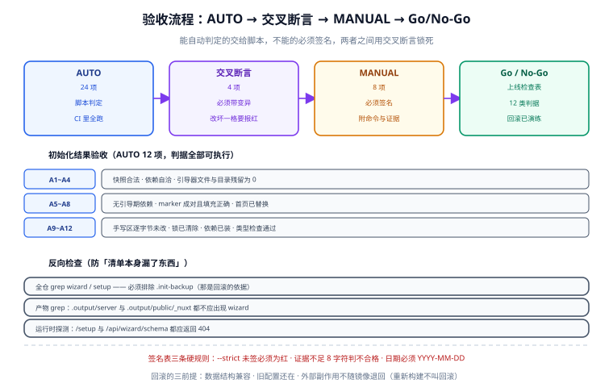

# 验收与上线检查

验收清单最容易退化成两样东西：**一张只有勾选框的表格**，和一句「都验过了」。两者的共同问题是判据没被写下来，因此也无法被检验。这一篇把清单做成三层结构：能自动判定的交给脚本，不能自动判定的必须签名，两者之间的关联用交叉断言锁死。



## 1. 三层结构

| 层 | 数量 | 谁来判 | 能否在 CI 里跑 | 判据形态 |
| --- | --- | --- | --- | --- |
| **AUTO** | 24 项 | 脚本 | ✅ 全部可跑 | 文件内容 / 退出码 / JSON 字段 |
| **交叉断言** | 4 项 | 脚本 + 变异 | ✅ | 改坏一格必须报红 |
| **MANUAL** | 8 项 | 人 | ❌ | 必须有命令、期望输出、签名与证据 |

::: tip 为什么 AUTO 项要分成「初始化验收」和「应用验收」
它们检查的是**不同的承诺**：前者检查「引擎做到了它说的事」（删干净、装对了、可复现），后者检查「产物是一个能用的 Nuxt 应用」（能构建、能渲染、无 hydration 错误）。混在一张表里会让人以为勾完就万事大吉。
:::

## 2. 初始化结果验收（AUTO，12 项）

与 `scripts/verify.mjs` 一一对应，判据全部是机械的：

| # | 检查项 | 判据（可执行） |
| --- | --- | --- |
| A1 | 快照存在且合法 | `node -e "JSON.parse(require('fs').readFileSync('template.config.json'))"` 退出码 0 |
| A2 | 选择与依赖自洽 | `verify.mjs` 断言 `plan.deps` = 各选项声明依赖的去重并集 |
| A3 | 引导器文件残留 0 | `verify.mjs` 逐项 `existsSync`；异常项计数为 0 |
| A4 | 引导器目录已清空 | `test ! -d app/pages/setup && test ! -d app/components/wizard && test ! -d server/api/wizard` |
| A5 | 无引导期专用依赖 | `node -e "const p=require('./package.json');if((p.dependencies['h3'])\|\|(p.devDependencies?.unbuild))process.exit(1)"` |
| A6 | marker 区间成对且已填充 | `grep -c 'TEMPLATE:MODULES' nuxt.config.ts` 为 2；内容与 `plan.modules` 一致 |
| A7 | 样式入口与选择一致 | `plan.cssEntries` 全部出现在 `TEMPLATE:CSS` 区间内 |
| A8 | 首页已替换 | `! grep -q "navigateTo('/setup')" app/pages/index.vue` |
| A9 | 手写区未被改动 | 与 `.init-backup/*/nuxt.config.ts` 中 `app:` 段落逐字节相同 |
| A10 | 锁文件已清除 | `test ! -f template.init.lock` |
| A11 | 依赖已安装 | `node -e "require.resolve('<首个依赖>/package.json')"` 退出码 0 |
| A12 | 类型检查通过 | `nuxi typecheck` 退出码 0（`--fast` 时跳过） |

```shell
node scripts/verify.mjs
# 期望
#   PASS  A1 快照存在且合法
#   PASS  A2 选择与依赖自洽
#   ...
#   verify: 12/12 通过，引导器残留 0
```

## 3. 引导器残留的反向检查（AUTO，6 项）

`verify.mjs` 检查的是**已知清单**（A3/A4）。为防止「清单本身漏了东西」，再加一条**反向检查**：在整个仓库里搜索引导器的痕迹。

```shell
# A13 全仓搜索（排除备份与依赖目录）
grep -rn --exclude-dir={node_modules,.nuxt,.output,.init-backup,.git} \
  -E 'wizard|/setup' . | grep -v '^\./README' | head -20
# 期望：无输出（README 里对流程的说明除外，那是有意保留的）

# A14 服务端产物不含引导器
grep -rn 'wizard' .output/server 2>/dev/null | head -3
# 期望：无输出

# A15 客户端产物不含引导器
grep -rn 'wizard' .output/public/_nuxt 2>/dev/null | head -3
# 期望：无输出

# A16 路由表里没有 /setup
curl -s -o /dev/null -w '%{http_code}\n' http://localhost:3000/setup
# 期望：404

# A17 接口已消失
curl -s -o /dev/null -w '%{http_code}\n' http://localhost:3000/api/wizard/schema
# 期望：404

# A18 样式文件无悬空引用
grep -rn 'wizard.css' --exclude-dir={node_modules,.nuxt,.output} . | head -3
# 期望：无输出
```

::: danger 反向检查必须排除备份目录
`.init-backup/` 里**故意保留**着初始化前的引导器文件（那是回滚的依据）。不排除它，A13 永远有输出，检查就失去了意义——而如果因此把备份也删了，回滚能力就没了。排除项写进脚本而不是靠人记得加 `--exclude`。
:::

## 4. 应用验收（AUTO，6 项）

```shell
# B1 生产构建通过
pnpm build && test -f .output/server/index.mjs
# 期望：退出码 0，入口存在

# B2 生产产物可跑（预览）
pnpm preview & sleep 8
curl -s -o /dev/null -w '%{http_code}\n' http://localhost:3000
# 期望：200

# B3 SSR 直出（选了 SSR / 混合时）
curl -s http://localhost:3000 | grep -c '<h1'
# 期望：≥ 1（HTML 里有真实内容，不是空壳）

# B4 健康检查
curl -s http://localhost:3000/api/health
# 期望：{"status":"ok",...}

# B5 入口 JS 在预算内
node scripts/check-budget.mjs
# 期望：entry JS / 全局 CSS 均在预算内，退出码 0

# B6 类型检查与 lint
pnpm lint && pnpm dlx nuxi typecheck
# 期望：0 error
```

## 5. 人工验收项（MANUAL，8 项）

**这些项永远不可能在本仓库里被自动判定**，工具只列出可直接粘贴的命令与期望输出，不假装它们通过了。

| # | 项目 | 命令 | 期望 | 责任人 |
| --- | --- | --- | --- | --- |
| M1 | 浏览器无 console error | 打开首页 → F12 | Console 面板 0 error；无 hydration mismatch 警告 | 前端 |
| M2 | 首屏性能 | Lighthouse（移动端） | Performance ≥ 90，LCP < 2.5s | 前端 |
| M3 | 真实设备表现 | 手机打开部署环境 | 布局不溢出、点击无延迟、深色模式正常 | 前端 |
| M4 | 依赖漏洞扫描 | `pnpm audit --prod` | 无 high / critical | 安全 |
| M5 | 密钥未泄漏 | 检查产物与镜像 | `grep -r NUXT_API_SECRET .output` 无输出；镜像 env 中不含构建期密钥 | 安全 |
| M6 | 缓存策略生效 | `curl -sI` 检查 `/_nuxt/*` | 含 `immutable` | 运维 |
| M7 | 回滚演练 | 用上一个身份标签部署一次再切回 | 两次切换后站点均可用 | 运维 |
| M8 | 告警触达 | 手动停掉容器 | 5 分钟内收到告警通知 | 运维 |

### 5.1 签名表

```json [acceptance/manual_signoff.json]
{
  "M1": { "by": "张三", "at": "2026-10-01", "result": "pass", "evidence": "console-error-0.png" },
  "M4": { "by": "李四", "at": "2026-10-01", "result": "pass", "evidence": "pnpm-audit-prod.txt" }
}
```

::: danger 签名表的三条硬规则
1. **`--strict` 模式下 MANUAL 项未登记即失败**，退出码 1。这是设计，不是缺陷——没在验收环境验过之前，`--strict` 返回 0 才是问题。
2. **证据不足 8 字符判不合格**。写「ok」「已验」不算证据；要写文件名、截图名或命令输出的路径。
3. **日期写「上周」「昨天」判不合格**。必须是 `YYYY-MM-DD`。
:::

## 6. 交叉断言（4 项，必须带变异测试）

交叉断言检查的是「两个交付物之间是否自洽」，单看任何一边都发现不了问题：

| # | 断言 | 变异测试（必须报红） |
| --- | --- | --- |
| C1 | `--check` 能抓出依赖漂移 | 从 `package.json` 删掉一个已选依赖 → `--check` 退出码必须为 1 |
| C2 | `--check` 能抓出手写区被改 | 往 `nuxt.config.ts` 的 marker 区间内插一行 → `--check` 必须报红 |
| C3 | `verify.mjs` 能抓出引导器残留 | 手动创建一个 `app/pages/setup/index.vue` → A3/A4 必须报红 |
| C4 | 部署命令只能用身份标签 | 把 `IMAGE_TAG` 换成 `prod` → 标签校验脚本必须报红 |

```shell
node scripts/acceptance.mjs --cross
# 期望
#   PASS  C1 依赖漂移可检出（含变异）
#   PASS  C2 手写区改动可检出（含变异）
#   PASS  C3 引导器残留可检出（含变异）
#   PASS  C4 标签策略可校验（含变异）
#   cross: 4/4 通过
```

::: info 为什么每条都要变异
「跑一遍通过」必然成立——生成物当然自洽。**只有把被测对象改坏一格、确认检查报红，才证明这条断言真的在拦东西。**本仓库在后端模板的经验是：改坏一处派生函数恒真化后，失败断言从 0 变成十几个；如果改成 0 个，说明那批断言是装饰。
:::

## 7. 冒烟脚本

上线后立刻跑，判据是**退出码**：

```bash [scripts/smoke.sh]
#!/usr/bin/env bash
set -euo pipefail
BASE="${1:?用法: smoke.sh <base-url>}"
fail=0
check() { # name expected actual
  if [ "$2" = "$3" ]; then echo "  PASS  $1"; else echo "  FAIL  $1（期望 $2，实际 $3）"; fail=1; fi
}

code() { curl -s -o /dev/null -w '%{http_code}' "$1"; }

check "首页 200"            200 "$(code "$BASE/")"
check "health ok"           200 "$(code "$BASE/api/health")"
check "不存在引导器接口"      404 "$(code "$BASE/api/wizard/schema")"
check "不存在引导器页面"      404 "$(code "$BASE/setup")"
check "404 页面正常渲染"      404 "$(code "$BASE/definitely-not-here")"

if curl -s "$BASE/" | grep -q '<div id="__nuxt"'; then echo "  PASS  SSR 挂载点存在"; else echo "  FAIL  SSR 挂载点缺失"; fail=1; fi

exit "$fail"
```

```shell
bash scripts/smoke.sh http://127.0.0.1:3000
# 期望：6/6 PASS，退出码 0
```

## 8. 上线检查表（Go / No-Go）

| 类别 | 项 | 判据 | Go 条件 |
| --- | --- | --- | --- |
| 代码 | 门禁全绿 | `run-gates.mjs` 全 PASS | 必须 |
| 代码 | 无 `--no-verify` 提交 | `git log` 检查 | 必须 |
| 产物 | 生产预览通过 | `pnpm preview` 首屏正常 | 必须 |
| 产物 | 体积在预算内 | `check-budget.mjs` 退出码 0 | 必须 |
| 配置 | 生产变量齐备 | `${VAR:?}` 均已提供 | 必须 |
| 配置 | 密钥不在产物中 | M5 | 必须 |
| 数据 | 无需迁移或已迁移 | 本次变更说明 | 视情况 |
| 部署 | 镜像用身份标签 | `docker inspect` 的 image tag | 必须 |
| 部署 | 健康检查通过 | `/api/health` 200 | 必须 |
| 部署 | 冒烟 6/6 | `smoke.sh` | 必须 |
| 观测 | 日志有 traceId | 抽样一条请求日志 | 建议 |
| 回滚 | 上一个身份标签可用 | M7 已演练 | 必须 |

::: warning 回滚的能力取决于「旧身份标签还在不在」
**重新构建一版当时的代码不叫回滚**——等价性无法证明（依赖可能已经变了）。所以 registry 必须开启标签不可变策略，历史身份标签永久保留。这条是 Go/No-Go 里唯一「没演练过就不许上线」的项。
:::

## 9. 回滚预案

```shell
# 触发条件（任一）
#   冒烟失败 / 错误率 > 1% / 首屏 LCP 翻倍 / 关键接口 5xx

# 步骤
IMAGE_TAG=sha-<上一个稳定提交> docker compose up -d
docker compose ps                      # 期望：healthy
bash scripts/smoke.sh http://127.0.0.1:3000   # 期望：6/6
```

| 边界 | 说明 |
| --- | --- |
| 只能回到「打过身份标签」的版本 | 环境指针 `prod` 不能作为回滚目标 |
| 外部副作用不随镜像退回 | 已发出的邮件、已写入第三方系统的数据不会回来 |
| 数据结构需兼容 | 若本次变更含不兼容的接口改动，回滚会失败——这正是接口契约必须向后兼容的原因 |
| 回滚后要更新指针 | 别忘了把 `prod` 指针指回旧身份标签，否则下次查版本会得到错答案 |

## 10. 验证方式

```shell
# AUTO 全量（不需要部署环境）
node scripts/verify.mjs            # 12/12
node scripts/acceptance.mjs        # AUTO 24 项
node scripts/acceptance.mjs --cross # 交叉断言 4/4（含变异）

# MANUAL 未签到时必须是红的（这是设计）
node scripts/acceptance.mjs --strict
# 期望：退出码 1，点名 M1、M4、M5、M7、M8 未签

# 签名后
node scripts/acceptance.mjs --strict
# 期望：退出码 0

# 冒烟（需要已部署的地址）
bash scripts/smoke.sh https://your-domain.example.com
```

## 易错点与最佳实践

::: danger 五个让验收退化成形式主义的写法

1. **只有勾选框，没有命令与期望输出。**勾完什么也证明不了。
2. **把 MANUAL 项硬凑成 AUTO。**「浏览器 console 无 error」不能被 `curl` 判定，硬凑会让这一项永远「通过」。
3. **交叉断言不做变异。**C1~C4 如果不做变异测试，它们就是必然通过的装饰。
4. **签名表允许「上周」这种日期。**日期与证据是签名的全部价值，放宽等于取消。
5. **回滚不演练。**没演练过的回滚是承诺，不是能力。
:::

::: tip 三条经验
1. AUTO 项的判据优先用**退出码**，其次用 **JSON 字段**，最后才用文本匹配——文本匹配最容易因格式变化而误报。
2. 反向检查（全仓搜索）要写进脚本，且**排除备份目录**。
3. 验收清单本身要进版本库（`acceptance/` 目录），和代码一起评审——清单的改动比代码的改动更值得 review。
:::

## 相关页面

- [初始化引擎](../InitEngine/index.md)：被验收的对象与它的自检脚本
- [质量门禁与自测](../Quality/index.md)：变异测试的通用做法
- [部署与上线](../Deployment/index.md)：上线流程与回滚命令
- [后端通用模板 · 上线验收与监控接入](../../BackendTemplate/Acceptance/index.md)：同一套三层结构的服务端版本

## 参考资料

- Nuxt 部署与预览：[nuxt.com/docs/getting-started/deployment](https://nuxt.com/docs/getting-started/deployment)
- Lighthouse 性能指标口径：[web.dev/vitals](https://web.dev/articles/vitals)
- 十二要素应用（配置与发布）：[12factor.net/zh_cn](https://12factor.net/zh_cn/)
