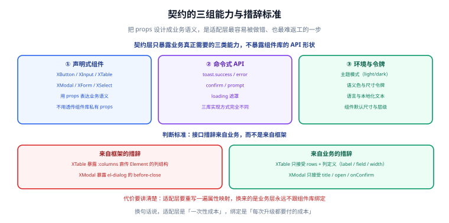
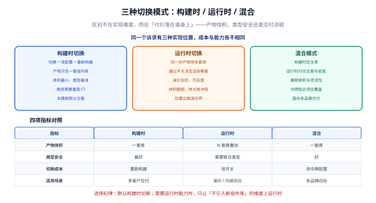

# 第 2 步：UI 适配层设计

这一步决定「业务代码零改动」这句话能不能成立。它要回答三个问题：**契约长什么样**、**契约组件怎么找到当前实现**、**哪些差异必须承认**。



## 一、契约的三条设计规则

| 规则 | 说明 | 反例 |
| --- | --- | --- |
| **props 用业务语义** | 业务关心的是「主按钮」而不是「type=primary 的 el-button」 | `type="primary"` 可以，`effect="dark"` 不行（那是 Element 的私有概念） |
| **不透传私有结构** | 契约的 props 类型里不出现任何组件库的类型 | `:columns` 不能接受 Element 的 `TableColumnCtx` |
| **只承诺共同子集** | 四个实现都能做到的能力才进契约 | 「虚拟滚动」不进契约（各库支持程度不同） |

::: tip 判断方法
把契约的 props 读给一个**没用过任何组件库**的人听：

> 「这个按钮支持 主/次/危险/文字 四种外观，支持加载中、禁用，有 小/中/大 三档尺寸。」

他能听懂 → 契约合格。如果要说「它的 type 传 primary、danger 要单独传一个 danger 布尔」，说明你在描述某个实现，而不是描述契约。
:::

## 二、契约组件如何找到当前实现

这是整套设计的核心机制。链路一共三层，**换库时只有第三层换**：

```text
业务代码 <XButton>                     ← 永远不变
   ↓
app/components/x/XButton.vue           ← 手写一次，四个库共用
   ↓  import Impl from '#ui-impl/XButton.vue'
app/ui/impl/antd/XButton.vue           ← 唯一 import ant-design-vue 的地方
```

`#ui-impl` 是一个**构建期别名**，由切换脚本生成（见[第 5 步](../SwitchTooling/index.md)）：

```javascript [app/ui/generated/nuxt-ui.config.mjs（生成物片段）]
export const uiAlias = {"#ui-impl":"./app/ui/impl/antd"}
```

```typescript [nuxt.config.ts（手写区，只写一次）]
import { uiAlias } from './app/ui/generated/nuxt-ui.config.mjs'

export default defineNuxtConfig({
  alias: uiAlias,
  // ...
})
```

::: info 为什么用别名，而不是在契约组件里写死 import
如果把契约组件写成 `import Impl from '~/ui/impl/antd/XButton.vue'`，那么「换库」就变成了「改 N 个契约组件文件」——抽象层瞬间失效。

别名方案把「当前用哪个实现」收敛成**生成物里的一行**，契约组件本身完全不知道有多个实现存在。

用 `#` 前缀是为了与 npm 包名区分：构建器看到 `#ui-impl` 会走 alias，看到 `element-plus` 会走 node_modules。
:::

### 契约组件：手写一次，四库共用

```vue [app/components/x/XButton.vue]
<script setup lang="ts">
import Impl from '#ui-impl/XButton.vue'

/** 契约：所有实现都必须支持这四个 props，语义含义完全一致 */
withDefaults(defineProps<{
  type?: 'primary' | 'default' | 'danger' | 'text'
  loading?: boolean
  disabled?: boolean
  size?: 'small' | 'default' | 'large'
}>(), { type: 'default', loading: false, disabled: false, size: 'default' })

// 不继承 attrs，由我们把 props 与 attrs 一起交给实现，避免属性落到外层包装元素上
defineOptions({ inheritAttrs: false })
</script>

<template>
  <Impl v-bind="{ ...$props, ...$attrs }">
    <slot />
  </Impl>
</template>
```

这个文件里**没有任何组件库的影子**，它只认识 `#ui-impl`。

### 实现层：Ant Design Vue 版

```vue [app/ui/impl/antd/XButton.vue]
<script setup lang="ts">
import { Button } from 'ant-design-vue'

const props = withDefaults(defineProps<{
  type?: 'primary' | 'default' | 'danger' | 'text'
  loading?: boolean
  disabled?: boolean
  size?: 'small' | 'default' | 'large'
}>(), { type: 'default', loading: false, disabled: false, size: 'default' })

// antd 的按钮没有 danger 这个 type，危险态用独立的 danger 布尔属性表达；
// 文字按钮在 antd 里叫 link。这类差异正是需要适配层的原因。
const antType = computed(() =>
  props.type === 'danger' ? 'default' : props.type === 'text' ? 'link' : props.type)

const isDanger = computed(() => props.type === 'danger')
</script>

<template>
  <Button
    :type="antType"
    :danger="isDanger"
    :loading="loading"
    :disabled="disabled"
    :size="size"
  >
    <slot />
  </Button>
</template>
```

对照 Element Plus 版，能看到同样是「危险按钮」，两家的表达方式确实不同：

```vue [app/ui/impl/element/XButton.vue]
<script setup lang="ts">
import { ElButton } from 'element-plus'

const props = withDefaults(defineProps<{
  type?: 'primary' | 'default' | 'danger' | 'text'
  loading?: boolean
  disabled?: boolean
  size?: 'small' | 'default' | 'large'
}>(), { type: 'default', loading: false, disabled: false, size: 'default' })

// Element 的 type 直接支持 danger，不需要额外的布尔属性
const elType = computed(() => (props.type === 'default' ? '' : props.type))
</script>

<template>
  <ElButton :type="elType" :loading="loading" :disabled="disabled" :size="size">
    <slot />
  </ElButton>
</template>
```

::: tip 适配层的成本就在这里
上面两个文件就是「一次性的适配成本」：**每个契约组件、每个实现，写一个二三十行的映射文件**。

换来的是：业务页面永远只写 `<XButton type="danger">`，而 `danger` 在 Element 里是 type 值、在 antd 里是布尔属性、在 Nuxt UI 里是 color 值——这些差异**只存在于实现层**。
:::

## 三、组件能力清单

契约一旦定下，就要有一张表说清楚「哪个实现支持到什么程度」。这张表不是文档装饰，它是**门禁的依据**：实现层缺一个文件，别名就会指向不存在的路径，构建直接失败。

| 契约项 | element | antd | nuxtui | vuetify | 备注 |
| --- | --- | --- | --- | --- | --- |
| `XButton` | ✅ | ✅ | ✅ | ✅ | 四家都有按钮，映射规则不同 |
| `XInput` | ✅ | ✅ | ✅ | ✅ | 需统一 `v-model` 与 `size` 语义 |
| `XSelect` | ✅ | ✅ | ✅ | ✅ | 选项结构统一为 `{ label, value }` |
| `XForm` + 校验 | ✅ | ✅ | ✅ | ✅ | **只承诺必填/长度/正则**，复杂校验下沉业务 |
| `XTable`（分页） | ✅ | ✅ | ✅ | ✅ | 列定义统一为 `{ label, field, width }` |
| `XModal` | ✅ | ✅ | ✅ | ✅ | Nuxt UI 依赖 `UApp` 包裹，见下节 |
| `XMessage`（命令式） | ✅ | ✅ | ✅ | ✅ | 走 `feedback.ts` 统一出口 |
| 虚拟滚动表格 | ❌ | ❌ | ⚠️ | ❌ | **不进契约**，需要时走逃生口 |
| 富文本编辑器 | ❌ | ❌ | ⚠️ | ❌ | 同上 |

::: danger 不要在契约里「假装支持」
典型错误：为了让表格看起来统一，在契约里加一个 `:columns`，类型写成 `any[]`，然后每个实现各自解释——`any` 让类型检查失效，差异被藏进运行时。

正确做法有两条，二选一：

1. **明确降级**：把该能力从契约移除，在能力清单里标 ❌，需要它的页面走逃生口。
2. **定义共同子集**：如果只是「列定义结构不同」，就定义一个自己的 `XColumn` 类型（`label` / `field` / `width` / `align` 四个字段），让各实现负责转换——但**绝不接受 `any`**。
:::

## 四、命令式 API：同样需要适配

`toast.success()` 这类调用没有模板，无法靠别名替换组件，所以要单独做一层：

```typescript [app/ui/feedback.ts（契约层，手写）]
export { toast, confirm, loading } from '#ui-impl/feedback'
```

```typescript [app/ui/impl/element/feedback.ts（实现层）]
import { ElLoading, ElMessage, ElMessageBox } from 'element-plus'

export const toast = {
  success: (msg: string) => ElMessage.success(msg),
  error: (msg: string) => ElMessage.error(msg),
}

export const confirm = (msg: string, title = '提示') =>
  ElMessageBox.confirm(msg, title, { type: 'warning' })

export const loading = (text = '加载中…') =>
  ElLoading.service({ text, background: 'rgba(0,0,0,.3)' })
```

```typescript [app/ui/impl/nuxtui/feedback.ts（实现层）]
// Nuxt UI 的 toast 必须通过 composable 取到，所以实现层导出的是「工厂」
export const toast = {
  success: (msg: string) => useToast().add({ title: msg, color: 'success' }),
  error: (msg: string) => useToast().add({ title: msg, color: 'error' }),
}
```

::: warning 注意这里的形态差异
Element / antd 的 Message 是**函数式**的，Nuxt UI 的 toast 是**composable** 的（依赖组件上下文，且必须被 `<UApp>` 包裹）。契约因此只能承诺 `toast.success(msg)` 这个**调用形状**，而不能承诺它可以在任何位置调用——在 Nuxt UI 实现下，它必须在组件 setup 内调用。
:::

## 五、三种切换模式的取舍



| 指标 | 构建时切换（本模板默认） | 运行时切换 | 混合 |
| --- | --- | --- | --- |
| 产物体积 | 只含一套组件库 | 多套叠加，明显变大 | 只含一套 |
| 类型安全 | 最好 | 需要联合类型，容易退化成 `any` | 好 |
| 切换成本 | 改配置 + 重跑构建 | 改一个开关 | 改令牌配置 |
| 适用场景 | 多客户交付 | 演示、内部对比 | 多品牌白标 |

::: danger 为什么本模板不做运行时切换
1. **体积**：四套组件库同时进产物，几百 KB 起跳，而这部分代码 99% 的请求都用不到。
2. **样式冲突**：四套库都带全局重置与 CSS 变量，同时加载必然互相覆盖。
3. **类型失效**：要让同一份代码接受四种 props 形状，只能退化成联合类型或 `any`，契约测试也就失去了约束力。

**运行时切换唯一合理的场景是「演示壳」**——给人看「同一套业务能长成四种样式」。这种场景请单独做一个演示项目，不要污染交付模板。
:::

## 六、逃生口：承认差异的出口

再好的契约也覆盖不了组件库的全部能力。与其让业务偷偷 `import`，不如给它一个**正当出口**：

```vue [app/pages/advanced/editor.vue]
<script setup lang="ts">
// 【逃生口】本页使用 Ant Design Vue 的富文本能力，已在能力清单登记为「仅 antd 支持」。
// 使用条件：本页只在 ui=antd 的交付形态中存在，其他形态下本页由路由规则屏蔽。
import { Editor } from 'some-antd-only-package'
</script>
```

三条纪律：

1. **必须写在文件顶部的注释里**，说明用了哪一家的什么能力。
2. **必须登记进能力清单**，说明它在其他实现下的处置方式（屏蔽 / 降级 / 用替代方案）。
3. **范围要可控**：逃生口只能出现在页面级（`app/pages/`）或独立的业务组件里，**不能出现在契约组件里**——契约组件一旦有逃生口，契约本身就破了。

## 七、验证方式

```shell
# 1. 业务与契约层里不该出现任何组件库的名字（输出为空即通过）
grep -rnE "element-plus|ant-design-vue|@nuxt/ui|vuetify" app/pages app/components app/ui/*.ts

# 2. 实现层里应当出现组件库（四个目录各有一处，属正常）
grep -rln "element-plus" app/ui/impl/element

# 3. 换库前后，业务页面字节不变
sha256sum app/pages/index.vue
node scripts/ui-select.mjs --ui antd --render ssr
sha256sum app/pages/index.vue        # 与上面一致
```

预期结果：

1. 第 1 条命令**没有任何输出**（退出码为 1，这是好事）。
2. 第 3 条命令两次哈希完全相同。
3. 故意删掉 `app/ui/impl/antd/XButton.vue` 后跑 `pnpm build`，**构建失败并指出找不到模块**——这是能力清单门禁在起作用。

## 八、下一步

契约与别名机制就位，接下来把四个实现层真正写出来——每个组件一个小文件，并处理 SSR 与水合上的差异。

- [第 3 步：三套内置适配器](../Adapters/index.md)

## 参考资料

- [Vue 3 组件与 `v-bind`](https://cn.vuejs.org/api/built-in-directives.html#v-bind)
- [Nuxt `alias` 配置](https://nuxt.com/docs/4.x/api/nuxt-config#alias)
- [Nuxt 自动导入组件](https://nuxt.com/docs/4.x/guide/directory-structure/app/components)
- [后端通用模板 · 技术栈可插拔](../../BackendTemplate/StackSelect/index.md)：同样的「契约 + 实现 + 装配」三层结构
