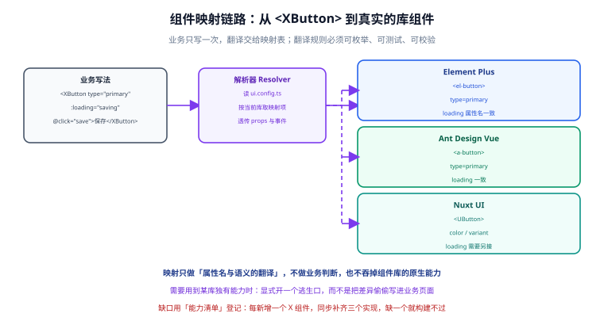
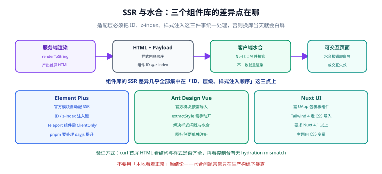

# 第 3 步：三套内置适配器

上一页把机制讲清楚了，这一页把它填满：四个实现层各自怎么写、依赖装什么、SSR 上有什么坑要填。



## 一、实现层的包结构

四个实现层的目录形态完全一致，只是名字不同：

```text
app/ui/impl/
├─ element/                  # @app/ui-element
│  ├─ XButton.vue
│  ├─ XInput.vue
│  ├─ XTable.vue
│  ├─ XModal.vue
│  ├─ feedback.ts            # toast / confirm / loading
│  └─ index.ts               # 统一出口（可选，便于整体替换）
├─ antd/
├─ nuxtui/
└─ vuetify/
```

::: warning 实现层之间零引用
`app/ui/impl/antd/` 下的文件不允许 import 任何来自 `element/` 或 `nuxtui/` 的东西。它们只通过契约（`app/components/x/`、`app/ui/feedback.ts`）通信。

这条纪律的验证方式很机械：

```shell
grep -rn "impl/element" app/ui/impl/antd        # 输出为空即通过
```
:::

## 二、Element Plus

```shell
pnpm add element-plus @element-plus/icons-vue
pnpm add -D @element-plus/nuxt
```

它由官方模块 `@element-plus/nuxt` 负责装配，**不需要手工配 unplugin**：

```typescript [app/ui/generated/nuxt-ui.config.mjs（生成物片段）]
export const uiModules = ["@element-plus/nuxt"]
export const uiBuild = {"transpile":["element-plus"]}
```

```vue [app/ui/impl/element/XTable.vue]
<script setup lang="ts">
import { computed } from 'vue'

interface Column { label: string, field: string, width?: number, align?: string }

const props = withDefaults(defineProps<{
  rows: Record<string, unknown>[]
  columns: Column[]
  loading?: boolean
  page?: number
  pageSize?: number
  total?: number
}>(), { loading: false, page: 1, pageSize: 10, total: 0 })

const emit = defineEmits<{ 'update:page': [number], 'page-size-change': [number] }>()

// Element 的分页组件用 v-model:current-page / v-model:page-size，
// 契约侧只承诺 update:page 与 page-size-change 两个事件。
const currentPage = computed({
  get: () => props.page,
  set: value => emit('update:page', value),
})
</script>

<template>
  <ElTable v-loading="loading" :data="rows" border stripe>
    <ElTableColumn
      v-for="col in columns"
      :key="col.field"
      :prop="col.field"
      :label="col.label"
      :width="col.width"
      :align="col.align"
    />
  </ElTable>
  <ElPagination
    v-model:current-page="currentPage"
    :page-size="pageSize"
    :total="total"
    layout="total, prev, pager, next"
    @size-change="emit('page-size-change', $event)"
  />
</template>
```

::: danger pnpm 环境的 dayjs 坑（必读）
Element Plus 内部依赖 `dayjs`，而 `dayjs` 不是标准 ESM 包。在 pnpm 的严格 node_modules 结构下，它可能加载失败，表现为**启动即报模块解析错误**。

两种解法，选一种：

```shell
# 方案 A：显式把 dayjs 装成直接依赖（推荐，影响面最小）
pnpm add dayjs
```

```ini [.npmrc]
# 方案 B：提升依赖（影响整个工程，仅在方案 A 无效时使用）
# pnpm 10.6 及以上请改用 pnpm-workspace.yaml 的 shamefullyHoist: true
shamefully-hoist=true
node-linker=hoisted
```
:::

## 三、Ant Design Vue

```shell
pnpm add ant-design-vue @ant-design/icons-vue
pnpm add -D @ant-design-vue/nuxt
```

```typescript [app/ui/generated/nuxt-ui.config.mjs（生成物片段）]
export const uiModules = ["@ant-design-vue/nuxt"]
export const uiBuild = {"transpile":["ant-design-vue"]}
```

官方模块支持按需导入与图标自动引入，还有一个专门解决首屏样式闪烁的开关：

```typescript [app/ui/impl/antd/options.ts]
// 交给 @ant-design-vue/nuxt 模块读取的选项
export const antdOptions = {
  // 打开样式提取：把按需样式在服务端渲染阶段收集后注入，
  // 避免「先渲染无样式 HTML、再补样式」造成的首屏闪烁
  extractStyle: true,
}
```

::: tip 关于 `extractStyle`
antd 的组件样式是运行时注入的，SSR 下会出现「服务端产出的 HTML 没有样式 → 客户端接管后才补上」的闪烁。`extractStyle` 让样式在服务端渲染时就被收集并内联，这是 SSR 场景下**必须打开**的选项。

打开后按官方文档在外层套一个 `<a-extract-style>` 容器即可。
:::

## 四、Nuxt UI

Nuxt UI 是 Nuxt 团队自己的组件库，与框架的融合度最高，但安装步骤也最多——**少一步就静默失效**。

```shell
pnpm add @nuxt/ui tailwindcss
```

```typescript [app/ui/generated/nuxt-ui.config.mjs（生成物片段）]
export const uiModules = ["@nuxt/ui"]
export const uiCss = ["~/assets/styles/main.css"]
```

```css [app/assets/styles/main.css]
/* Tailwind 4 是 CSS-first 配置，没有 tailwind.config.js */
@import "tailwindcss";
@import "@nuxt/ui";
```

```vue [app/app.vue]
<template>
  <!-- UApp 是 Toast / Tooltip / Overlay 的宿主，缺了它这些组件静默不工作 -->
  <UApp>
    <NuxtLayout>
      <NuxtPage />
    </NuxtLayout>
  </UApp>
</template>
```

::: danger 两个静默失效点
1. **忘了 `css: ['~/assets/styles/main.css']`**：页面能渲染，但样式全无——因为 Tailwind 从未被引入。
2. **忘了 `<UApp>` 包裹**：`useToast()` 不报错，但 toast 永远不显示。

这两个都不会在构建时报错，属于「必须写进验收清单」的项目。
:::

::: info Nuxt UI 4 的版本约束
- 要求 **Nuxt 4.1 及以上**（本模板基线 4.5 满足）。
- 依赖 **Tailwind CSS 4**（peerDependencies 为 `^4.0.0`），CSS-first 配置方式，不再有 `tailwind.config.js` 的 `content` 数组。
- Nuxt UI 4 把此前的免费版与 Pro 版**合并为一个 MIT 包**（125+ 组件），`@nuxt/ui-pro` 停留在 3.x 不再有 v4 线，新项目不需要再考虑 Pro。
:::

## 五、Vuetify（实验性）

```shell
pnpm add vuetify
pnpm add -D vuetify-nuxt-module@1.0.0-rc.5
```

```typescript [app/ui/generated/nuxt-ui.config.mjs（生成物片段）]
export const uiModules = ["vuetify-nuxt-module"]
```

```typescript [nuxt.config.ts（手写区补充）]
export default defineNuxtConfig({
  vuetify: {
    moduleOptions: { /* 模块选项 */ },
    vuetifyOptions: { /* Vuetify 选项，如 theme、defaults */ },
  },
})
```

::: danger 为什么它被标为实验性
`vuetify-nuxt-module` 当前版本仍是 **1.0.0-rc.5**，尚未发布正式版。rc 阶段的模块在小版本之间可能调整 SSR 行为，而 UI 层一旦出问题就是全站级别的。

所以模板把它设为**默认拒绝**：必须显式加 `--allow-experimental` 才生成，且生成物里会留下 `experimental: true` 的痕迹，`UI.md` 也会写明「生产使用需锁死精确版本」。

注意 `dependencies` 里锁的是精确版本 `1.0.0-rc.5`，不是 `^1.0.0-rc.5`——**rc 版本不允许自动升级**。
:::

## 六、SSR 与水合：四个库的差异点



组件库在 SSR 上的差异，几乎全部集中在**组件 ID、层级（z-index）、样式注入顺序**这三件事上。服务端渲染出的 HTML 与客户端首次渲染的结果必须逐字节一致，否则水合失败。

| 实现层 | 官方模块是否处理 | 需要额外做的事 |
| --- | --- | --- |
| Element Plus | 是（ID 与 z-index 注入已内置） | Teleport 类组件用 `<ClientOnly>` 包一层 |
| Ant Design Vue | 部分（样式提取需手动开） | 打开 `extractStyle`；图标包单独注册 |
| Nuxt UI | 是 | 必须用 `<UApp>` 包裹根组件 |
| Vuetify | 是（自动 SSR 检测） | 生产需锁死模块版本 |

如果不用官方模块、自己手写 SSR 集成，Element Plus 需要显式注入两个键——这也是官方模块帮我们省掉的工作：

```typescript [自定义 SSR 集成的写法（仅作原理说明）]
import { ID_INJECTION_KEY, ZINDEX_INJECTION_KEY } from 'element-plus'

app.provide(ID_INJECTION_KEY, { prefix: 1024, current: 0 })
app.provide(ZINDEX_INJECTION_KEY, { current: 0 })
```

::: danger 不要用「本地看着正常」作为水合通过的判据
水合问题经常**只在生产构建下暴露**：开发模式会做一些容错处理，把不一致静默修复。

验证方式必须是：

```shell
pnpm build && pnpm preview
curl -s http://localhost:3000/ | head -50
```

看两件事：① 首屏 HTML 里结构与样式是否齐全；② 浏览器控制台有没有 `Hydration completed but contains mismatches` 之类的告警。
:::

## 七、依赖与安装

每个实现层的依赖由生成物 `deps.json` 描述（第 5 步的脚本产出）：

```json [app/ui/generated/deps.json（以 antd 为例）]
{
  "ui": "antd",
  "render": "ssr",
  "personalize": true,
  "dependencies": {
    "ant-design-vue": "^4.2.0",
    "@ant-design/icons-vue": "^7.0.0"
  },
  "devDependencies": {
    "@ant-design-vue/nuxt": "^1.4.0"
  }
}
```

换库后的安装流程：

```shell
node scripts/ui-select.mjs --ui antd --render ssr
pnpm install                # 按新的 deps.json 增减依赖
pnpm dev
```

::: tip 旧库的依赖要记得清掉
`pnpm install` 不会自动移除不再需要的包。换库后建议：

```shell
pnpm remove element-plus @element-plus/icons-vue @element-plus/nuxt
```

或者干脆删掉 `node_modules` 与 lockfile 重新安装——**换库是一次低频操作，宁可慢一点也要干净**。残留的旧组件库会出现在依赖审计与镜像体积里。
:::

## 八、验证方式

对每个实现层逐一验证（把 `antd` 换成另外三个即可）：

```shell
# 1. 切换并安装
node scripts/ui-select.mjs --ui antd --render ssr
pnpm install

# 2. 启动并检查
pnpm dev
# 期望：http://localhost:3000 正常渲染，控制台无水合告警

# 3. 生产构建下再验一次水合
pnpm build && pnpm preview
curl -s http://localhost:3000/ | grep -c "<button"
# 期望：大于 0，说明按钮在服务端就渲染出了结构

# 4. 类型检查
pnpm typecheck
```

四个实现层的「验收通过」标准一致：**页面渲染正常、控制台无告警、首屏 HTML 含真实结构（而不是空壳）**。

## 九、下一步

四个实现层都能跑了，但此刻换个库，**品牌色、圆角、字号会全变**——因为视觉还没有被抽出来。第 4 步处理这件事。

- [第 4 步：设计令牌与主题桥接](../DesignToken/index.md)

## 参考资料

- [Element Plus · Nuxt 集成](https://element-plus.org/zh-CN/guide/quickstart.html)
- [Ant Design Vue · Nuxt 模块](https://nuxt.com/modules/ant-design-vue)
- [Nuxt UI 官方文档](https://ui.nuxt.com/)
- [vuetify-nuxt-module](https://github.com/vuetifyjs/nuxt-module)
- [Nuxt · SSR 与水合](https://nuxt.com/docs/4.x/guide/concepts/rendering)
