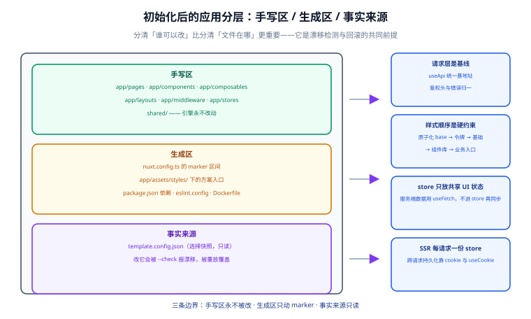

# 初始化后的应用基线

初始化跑完，仓库就交给你了。这一篇定义「交给你的时候长什么样」——目录怎么分区、路由怎么写、状态与请求层怎么定、样式入口按什么顺序拼。这些是**跨技术栈组合不变**的部分；变化的只有依赖与样式入口的具体内容。



## 1. 初始化那一刻发生了什么

| | 之前 | 之后 |
| --- | --- | --- |
| `app/pages/index.vue` | `navigateTo('/setup')` 的重定向页 | 基线首页（含标题、令牌演示区、下一步提示） |
| `app/pages/setup/` | 选择页与进度页 | **不存在** |
| `app/components/wizard/` | 5 个表单组件 | **不存在** |
| `server/` | 4 个接口 + 4 个工具 | `api/health.get.ts`（示例健康检查） |
| `app/assets/styles/` | `tokens.css` + `base.css` + `wizard.css` | `tokens.css` + `base.css` + 所选方案的入口文件 |
| 根目录 | 无快照 | `template.config.json` + `.init-backup/`（已进 `.gitignore`） |
| `package.json` | 1 个依赖 | 所选方案的依赖集合 |

::: tip 基线首页不放「欢迎使用」这种占位内容
首页展示三样东西：**令牌演示**（一屏色板与间距刻度，用来肉眼确认样式链路通了）、**当前技术栈摘要**（从 `template.config.json` 读，显示选了哪些库）、**下一步清单**（删掉示例、建自己的页面、配置 `runtimeConfig`）。占位文案会被永远留着，能自证的首页会被立刻删掉——后者才是有用的。
:::

## 2. 目录规约：三个区

初始化后的目录按**谁可以改**分成三个区：

| 区 | 路径 | 谁维护 | 引擎是否改动 |
| --- | --- | --- | --- |
| **手写区** | `app/pages/`、`app/components/`（除 `wizard/`）、`app/composables/`、`app/layouts/`、`app/middleware/`、`app/stores/`、`shared/` | 开发者 | ❌ 永不改动 |
| **生成区** | `nuxt.config.ts` 的 marker 区间、`app/assets/styles/` 下的方案入口文件、`package.json` 的依赖与脚本、`eslint.config.mjs`、`vitest.config.ts`、`Dockerfile` | 引擎（按选择生成） | ✅ 只在 marker 区间内或整文件覆盖 |
| **事实来源** | `template.config.json`；`server/utils/wizard/` 与 `options.json`（已在初始化时删除） | 引擎 | 只读 |

```text
app/
├─ app.vue                    # 手写区（基线提供，可改）
├─ layouts/
│  └─ default.vue             # 手写区
├─ pages/
│  ├─ index.vue               # 手写区（初始化时被引擎覆盖一次）
│  └─ about.vue               # 手写区（示例页，可删）
├─ components/
│  └─ AppHeader.vue           # 手写区（基线组件）
├─ composables/
│  └─ useApi.ts               # 手写区（请求层基线）
├─ stores/
│  └─ app.ts                  # 手写区（Pinia 开关打开时生成）
├─ middleware/
│  └─ track.global.ts         # 手写区（示例中间件，可删）
└─ assets/styles/
   ├─ tokens.css              # 生成区（方案决定文件名与语法）
   ├─ base.css                # 生成区
   └─ main.css                # 生成区（原子化/组件库入口，按方案生成）
server/
└─ api/health.get.ts          # 生成区（示例接口）
shared/
└─ types/api.ts               # 手写区（前后端共享类型）
template.config.json          # 事实来源（只读，改它用 --check 会报漂移）
```

::: danger 生成区的文件不要手改
改了不会被立刻发现，但下一次 `--check` 会报漂移，`--template-config` 重放会**覆盖**你的改动。需要长期保留的自定义配置请写到 `nuxt.config.ts` 的 marker **之外**（手写区），或另建 `app.config.ts`（不在引擎管辖范围）。
:::

## 3. 应用根与布局

```vue [app/app.vue]
<script setup lang="ts">
// 应用根保持极简：只负责挂布局与页面。
// 全局 head、全局样式注入等交给 nuxt.config.ts 与 app.config.ts。
</script>

<template>
  <NuxtLayout>
    <NuxtPage />
  </NuxtLayout>
</template>
```

```vue [app/layouts/default.vue]
<script setup lang="ts">
const { appName } = useRuntimeConfig().public;
</script>

<template>
  <div class="shell">
    <header class="shell__head">
      <strong>{{ appName }}</strong>
      <nav>
        <NuxtLink to="/">首页</NuxtLink>
        <NuxtLink to="/about">关于</NuxtLink>
      </nav>
    </header>

    <main class="shell__main">
      <slot />
    </main>

    <footer class="shell__foot">
      <span>由 Nuxt 通用模板初始化</span>
    </footer>
  </div>
</template>

<style scoped>
.shell {
  display: flex;
  flex-direction: column;
  min-height: 100dvh;
}

.shell__head {
  display: flex;
  justify-content: space-between;
  align-items: center;
  gap: var(--sp-4);
  padding: var(--sp-3) var(--sp-6);
  border-bottom: 1px solid var(--border);
}

.shell__main {
  flex: 1;
  padding: var(--sp-6);
}

.shell__foot {
  padding: var(--sp-4) var(--sp-6);
  border-top: 1px solid var(--border);
  color: var(--fg-muted);
  font-size: var(--text-sm);
}
</style>
```

::: tip 布局里的样式只用令牌与原生 CSS
即使选了 Tailwind 或 Element Plus，**基线布局依然用 `.shell` 这类语义类名 + 令牌变量**。原因是：布局是「不随方案变化」的骨架，让它依赖具体方案会导致换方案时布局崩掉——而布局崩掉是最难被测试发现的一类问题。
:::

## 4. 页面与路由

Nuxt 的路由是**约定的**：`app/pages/` 下的文件路径就是路由。基线的三件事：

| 约定 | 写法 | 说明 |
| --- | --- | --- |
| 页面元信息 | `definePageMeta({ layout: 'default', middleware: 'track' })` | 不用手写路由表 |
| 动态路由 | `app/pages/post/[slug].vue` | 参数用 `const { slug } = useRoute().params` 取 |
| 预渲染 / 缓存规则 | `routeRules`（写在 `nuxt.config.ts` 手写区） | 混合渲染模式靠它 |

```vue [app/pages/about.vue]
<script setup lang="ts">
definePageMeta({ layout: 'default' });

useSeoMeta({
  title: '关于',
  description: '基线示例页面，确认路由、布局与 SEO 链路可用。',
});
</script>

<template>
  <section>
    <h1>关于</h1>
    <p>这是一个示例页面，用来验证路由与布局。可以直接删掉。</p>
  </section>
</template>
```

::: info 渲染模式在代码上的区别只有一个开关
SSR / SPA / SSG 的**代码写法完全相同**，区别只在 `nuxt.config.ts` 与构建命令：

| 模式 | 配置 | 构建命令 |
| --- | --- | --- |
| SSR | `ssr: true` | `pnpm build` |
| SPA | `ssr: false` | `pnpm build`（产出静态壳） |
| SSG | `nitro: { preset: 'static' }` | `pnpm generate` |
| 混合 | `routeRules: { '/': { prerender: true }, '/admin/**': { ssr: false } }` | `pnpm build` |

所以初始化后想改渲染模式，**不需要重跑引擎**，改 `nuxt.config.ts` 即可。这也是为什么渲染模式被放在「右侧配置区」而不是「左侧技术栈区」。
:::

## 5. 状态管理

选了 Pinia 才生成 `app/stores/`，约定三条：

```ts [app/stores/app.ts]
export const useAppStore = defineStore('app', () => {
  const theme = ref<'light' | 'dark'>('light');
  const sidebarOpen = ref(false);

  const isDark = computed(() => theme.value === 'dark');
  function toggleTheme() {
    theme.value = isDark.value ? 'light' : 'dark';
  }

  return { theme, sidebarOpen, isDark, toggleTheme };
});
```

| 约定 | 说明 |
| --- | --- |
| 组合式写法 | 用 `defineStore('name', () => {...})`，与 `<script setup>` 心智一致 |
| store 只放「跨页面共享的 UI 状态与缓存」 | 页面内状态用 `ref`；服务端数据用 `useFetch`（不要塞进 store 再同步） |
| 不在 store 里直接发起请求 | 请求放 composables，store 只接受结果——否则 SSR 下容易出现「同一数据请求两次」 |

::: warning SSR 下的 store 是「每请求一份」
`useAppStore()` 在服务端每次请求都会新建实例，因此**不能在 store 顶层写 `window` 相关逻辑**，也不能假设 store 在两次请求间保持状态。需要跨请求持久化的内容（如登录态）请用 cookie + `useCookie`。
:::

## 6. 数据请求层

请求层是**基线能力**（不随选择变化），因为它决定「所有业务代码怎么写」。

```ts [app/composables/useApi.ts]
/**
 * 统一请求层：把「基地址、鉴权头、错误归一化」三件事收在一处。
 * 业务代码只写 useApi<Resp>('/users')，不重复拼 baseURL 与判断 res.ok。
 */
export interface ApiEnvelope<T> {
  code: number;
  message: string;
  data: T;
}

export function useApi<T>(path: string, options: Parameters<typeof useFetch>[1] = {}) {
  const config = useRuntimeConfig();
  const baseURL = config.public.apiBase;

  return useFetch<ApiEnvelope<T>>(path, {
    baseURL,
    // 关键：SSR 期间透传当前请求的 cookie 与 traceId
    headers: useRequestHeaders(['cookie', 'x-trace-id']),
    onResponseError({ response }) {
      // 归一化：把 HTTP 层与业务层的错误收敛到同一个出口
      const message = (response._data as { message?: string } | undefined)?.message
        ?? `请求失败（${response.status}）`;
      throw createError({ statusCode: response.status, statusMessage: message });
    },
    ...options,
  });
}
```

| 能力 | 做法 | 为什么 |
| --- | --- | --- |
| 基地址可配 | `runtimeConfig.public.apiBase` + `.env` | 环境差异不写死在代码里 |
| SSR 带上 cookie | `useRequestHeaders(['cookie'])` | 服务端请求是「代表用户」发的，丢了 cookie 会拿到未登录响应 |
| 错误归一 | `onResponseError` 统一 `createError` | 页面只需处理一种错误形态 |
| 类型安全 | 泛型 `ApiEnvelope<T>` | 与后端约定统一响应结构（见 [后端通用模板](../../BackendTemplate/CommonResponse/index.md)） |

::: danger 三个 SSR 特有的请求坑

1. **不要在 `onMounted` 里发首屏数据请求。**那样 SSR 出的 HTML 里没有数据，首屏会闪一次。首屏数据一律用 `useFetch` / `useAsyncData`。
2. **同一个数据不要在父子组件各请求一次。**`useFetch` 的 `key` 默认由 URL 推导，同 URL 会复用；自定义 `key` 时务必保持一致，否则会请求两次。
3. **不要在请求层里读 `localStorage`。**服务端没有这个对象。需要持久化的凭据走 cookie。
:::

## 7. 样式入口与优先级

样式链路的**顺序是唯一的硬约束**，引擎按固定顺序拼 `TEMPLATE:CSS` 区间：

```text
① 原子化引擎的 base（Tailwind 的 @import "tailwindcss" 或 UnoCSS 的 virtual:uno.css）
② tokens —— 设计令牌（语义色/间距/圆角）
③ base —— 重置与基础排版
④ UI 组件库样式（Element Plus 的 dist/index.css / Nuxt UI 的 @import "@nuxt/ui"）
⑤ 业务入口 main.css（业务自己追加）
```

| 选择 | `css` 区间最终形态 |
| --- | --- |
| 纯 CSS | `['~/assets/styles/tokens.css', '~/assets/styles/base.css']` |
| + Sass | `['~/assets/styles/_tokens.scss'... 经 main.css 汇入, '~/assets/styles/main.css']` |
| + Tailwind | `['~/assets/styles/main.css']`（main.css 内 `@import "tailwindcss"` 在最前） |
| + Element Plus | 追加 `'element-plus/dist/index.css'`（或按需引入的样式） |

::: tip 为什么要固定这个顺序
CSS 的层叠只看**加载顺序 + 选择器权重**。原子化框架的 reset 必须在你的样式**之前**，否则它会覆盖你的标题、列表、按钮样式；UI 组件库的样式必须在你的业务样式**之前**，否则你会覆盖不掉它们的默认外观。这个顺序在所有主流组合里都成立，所以可以写死。
:::

## 8. 环境变量与运行时配置

```ts [nuxt.config.ts（生成后的 RUNTIME 区间）]
runtimeConfig: {
  // 服务端专用：不会下发到浏览器
  apiSecret: '',
  public: {
    appName: 'Nuxt Universal',
    apiBase: '/api',
    siteUrl: '',
  },
},
```

```shell [.env.example]
# 复制为 .env.local 后按需填写；不要提交 .env.local
NUXT_API_SECRET=
NUXT_PUBLIC_API_BASE=https://api.example.com
NUXT_PUBLIC_SITE_URL=https://example.com
```

| 规则 | 说明 |
| --- | --- |
| 前缀固定 | 只有 `public` 子树的内容会下发到浏览器；其余仅供服务端读取 |
| 命名映射 | `runtimeConfig.public.apiBase` ← `NUXT_PUBLIC_API_BASE` |
| 敏感值不落代码 | 密钥只放环境变量；`.env*` 已在 `.gitignore` 里 |
| 构建期 vs 运行期 | `runtimeConfig` 是**运行期**读取的，同一个构建产物可以部署到多套环境 |

::: danger 两种「环境变量」不要混
`NUXT_PUBLIC_*` 是 **runtimeConfig**，可以在构建后覆盖；而 `VITE_*` 是 **Vite 构建期**变量，会被**内联进客户端产物**——改了必须重新构建，而且值会出现在源码里。需要保密的、需要按环境切换的，一律走 `runtimeConfig`。
:::

## 9. 错误处理与 SEO

```vue [app/error.vue]
<script setup lang="ts">
const props = defineProps<{ error: { statusCode: number; statusMessage?: string } }>();
</script>

<template>
  <div class="error">
    <h1>{{ props.error.statusCode }}</h1>
    <p>{{ props.error.statusMessage ?? '页面出错了' }}</p>
    <button @click="clearError({ redirect: '/' })">
      返回首页
    </button>
  </div>
</template>
```

| 场景 | 做法 |
| --- | --- |
| 路由级错误 | `app/error.vue` 统一承接（含 404） |
| 请求错误 | `useApi` 抛 `createError`，页面无需重复处理 |
| 全局 head / SEO | `app.config.ts` 配 `head` 默认值；页面级用 `useSeoMeta` |
| 站点地图 | 选了 SEO 模块时生成 `sitemap.xml`，依赖 `runtimeConfig.public.siteUrl` |

## 10. 验证方式

```shell
# ① 首页自证：令牌色板、技术栈摘要、下一步清单都在
pnpm dev
# 打开 http://localhost:3000
# 期望：能看到色板与技术栈摘要；控制台 0 error；不存在任何指向 /setup 的链接

# ② 路由与布局
curl -s http://localhost:3000/about | grep -c '关于'
# 期望：≥ 1（SSR 直出，说明服务端渲染生效）

# ③ 请求层
curl -s http://localhost:3000/api/health
# 期望：{"status":"ok"} 或统一响应结构

# ④ 环境变量生效
NUXT_PUBLIC_API_BASE=https://example.org pnpm dev
# 期望：页面上的接口基地址变为 https://example.org

# ⑤ 类型检查
pnpm dlx nuxi typecheck
# 期望：0 error
```

## 易错点与最佳实践

::: danger 初始化后最容易犯的五个错

1. **直接改生成区文件。**`nuxt.config.ts` 的 marker 区间、方案入口 CSS 都是生成区，`--check` 会报漂移。自定义内容写到手写区。
2. **把示例页当成「以后会用到」留着。**`about.vue`、`track.global.ts` 这类示例会污染路由与全局行为，第一时间删掉。
3. **在 `useApi` 里硬编码完整的第三方地址。**基地址走 `runtimeConfig`，否则部署到预发环境时改不动。
4. **在 store 里 `useFetch`。**会出现「服务端取一次、客户端再取一次」，且 SSR 下 store 实例不共享。
5. **忘记 `.gitignore` 里的 `.init-backup/`。**快照目录有几十个文件，提交进去会污染仓库。
:::

::: tip 三条建议
1. 把 `template.config.json` 提交进仓库，并在 README 里说明「技术栈由它记录」——半年后的新人能直接从文件读到答案。
2. 在 CI 里加一条 `node scripts/init.mjs --check`，防止有人悄悄破坏模板约定。
3. 首页的技术栈摘要读 `template.config.json`，初始化后第一次 `pnpm dev` 就能确认「选什么装什么」真的生效了。
:::

## 相关页面

- [初始化引擎](../InitEngine/index.md)：上面这些变更由谁执行、怎么回滚
- [技术栈矩阵与组合兼容](../StackMatrix/index.md)：`main.css` 与依赖清单怎么随选择变化
- [质量门禁与自测](../Quality/index.md)：基线之上的 lint / 类型 / 测试三层
- [后端通用模板 · 统一响应与全局异常](../../BackendTemplate/CommonResponse/index.md)：`ApiEnvelope` 对应的服务端形态

## 参考资料

- Nuxt 数据获取：[nuxt.com/docs/getting-started/data-fetching](https://nuxt.com/docs/getting-started/data-fetching)
- Nuxt `runtimeConfig`：[nuxt.com/docs/guide/going-further/runtime-config](https://nuxt.com/docs/guide/going-further/runtime-config)
- Nuxt 错误处理：[nuxt.com/docs/getting-started/error-handling](https://nuxt.com/docs/getting-started/error-handling)
- Pinia 组合式写法：[pinia.vuejs.org/core-concepts](https://pinia.vuejs.org/core-concepts/)
