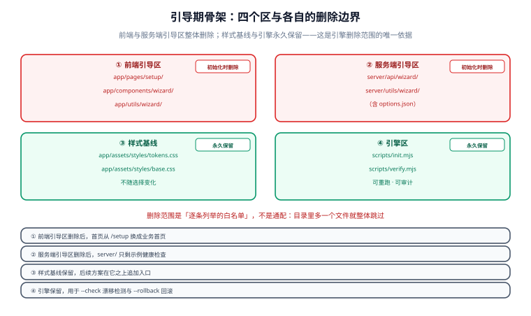
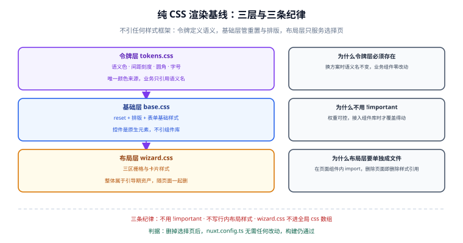

# 零依赖引导期骨架

这一步的目标很反直觉：**先把一个「什么样式框架都不用」的 Nuxt 工程搭起来，而且要求它看起来不难看**。因为引导期的选择页本身就是靠这套纯 CSS 基线渲染的——它既是骨架的演示，也是骨架的验收。



## 1. 引导期与初始化后的双形态

同一份仓库在初始化前后是**两个不同的工程**，这是理解后面所有设计的前提：

| | 引导期（初始化前） | 初始化后 |
| --- | --- | --- |
| 首页 | `app/pages/setup/index.vue`（技术栈选择页） | `app/pages/index.vue`（业务首页） |
| `server/` | `api/wizard/*` + `utils/wizard/*` | 空骨架（仅 `.gitkeep` 与示例接口） |
| `app/components/` | `wizard/*`（表单控件） | 空目录（仅基线组件） |
| `app/assets/styles/` | `tokens.css` + `base.css` + `wizard.css` | `tokens.css` + `base.css` + 所选方案入口 |
| 依赖 | `nuxt` | 所选方案的依赖集合 |
| 配置文件 | 只有 `nuxt.config.ts` + `package.json` | 追加模块配置、lint、测试、容器化文件 |
| 事实来源 | `server/utils/wizard/options.json` | `template.config.json`（选择快照） |

::: tip 两份「事实来源」的分工
`options.json` 描述**可以选什么**（候选集合与冲突规则），初始化后它随选择页一起删除；`template.config.json` 记录**实际选了什么**（选择快照与产物指纹），初始化后永久保留。前者是「菜单」，后者是「小票」。
:::

## 2. 目录结构

```text
nuxt-universal/
├─ app/                                  # ① 前端
│  ├─ app.vue                            #   Nuxt 4 的应用根（只放 NuxtLayout / NuxtPage）
│  ├─ pages/
│  │  ├─ index.vue                       #   引导期：重定向到 /setup
│  │  └─ setup/
│  │     ├─ index.vue                    #   选择页主界面（三区布局）
│  │     └─ progress.vue                 #   初始化进度面板（SSE 消费端）
│  ├─ components/
│  │  └─ wizard/                         #   选择页专用控件（随选择页一起删除）
│  │     ├─ OptionGroup.vue              #     单选/多选分组
│  │     ├─ NuxtConfigPanel.vue          #     右侧 Nuxt 配置面板
│  │     ├─ ConflictHint.vue             #     冲突与冗余提示
│  │     └─ ProgressStream.vue           #     进度流渲染
│  ├─ assets/styles/
│  │  ├─ tokens.css                      #   ② 令牌层：颜色/间距/圆角/字号/动效
│  │  ├─ base.css                        #   ③ 基础层：reset + 排版 + 表单基础样式
│  │  └─ wizard.css                      #   ④ 选择页布局（唯一允许被整体删除的样式）
│  └─ utils/
│     └─ wizard/
│        ├─ option-model.ts              #   与 server 共享的类型（仅类型，无运行时逻辑）
│     └─ useWizard.ts                    #   选择页状态机（选择 → 计划 → 执行 → 进度）
├─ server/                               # ⑤ 服务端（Nuxt 的 Nitro 运行时）
│  ├─ api/wizard/
│  │  ├─ schema.get.ts                   #   返回候选清单
│  │  ├─ plan.post.ts                    #   校验 + 出计划（不落盘）
│  │  └─ init.post.ts                    #   执行初始化（SSE）
│  └─ utils/wizard/
│     ├─ options.json                    #   唯一事实来源：候选与冲突规则
│     └─ validate.ts                     #   白名单 + 兼容矩阵校验
├─ scripts/                              # ⑥ 引擎（零依赖 Node 脚本）
│  ├─ init.mjs                           #   初始化引擎
│  └─ verify.mjs                         #   初始化后自检
├─ nuxt.config.ts                        # 含 marker 区间
├─ package.json                          # 含 marker 区间
├─ pnpm-workspace.yaml                   # pnpm 11 的 allowBuilds 等
└─ .npmrc                                # 关闭自动安装可选依赖等
```

四个「区」的边界，决定了引擎的删除范围：

| 区 | 目录 | 初始化后 | 谁负责 |
| --- | --- | --- | --- |
| 前端引导区 | `app/pages/setup/`、`app/components/wizard/`、`app/utils/wizard/useWizard.ts` | **整个删除** | [引擎白名单](../InitEngine/index.md) |
| 服务端引导区 | `server/api/wizard/`、`server/utils/wizard/` | **整个删除** | 同上 |
| 样式基线 | `tokens.css`、`base.css` | **保留**（后续方案在此基础上追加） | [应用基线](../AppBaseline/index.md) |
| 引擎区 | `scripts/init.mjs`、`scripts/verify.mjs` | **保留**（可重跑、可审计） | [初始化引擎](../InitEngine/index.md) |

## 3. 纯 CSS 渲染基线

不用任何样式框架，靠三层 CSS 把页面撑起来。这三层是本模板**唯一不随选择变化**的样式资产。



### 3.1 令牌层 `app/assets/styles/tokens.css`

```css [app/assets/styles/tokens.css]
/* 设计令牌：唯一的颜色/尺寸来源。初始化后由所选预处理器按需改写为 .scss/.less/.styl 版本。 */
:root {
  /* 品牌色阶（与 Nuxt 品牌绿对齐，便于视觉对照） */
  --brand-50: #effdf5;
  --brand-500: #00dc82;
  --brand-600: #00c16a;
  --brand-700: #007f45;

  /* 语义色 */
  --bg: #ffffff;
  --bg-subtle: #f8fafc;
  --fg: #0f172a;
  --fg-muted: #64748b;
  --border: #e2e8f0;
  --danger: #dc2626;
  --warn: #d97706;

  /* 间距与圆角：8px 基准，避免散落魔法数字 */
  --sp-1: 4px;
  --sp-2: 8px;
  --sp-3: 12px;
  --sp-4: 16px;
  --sp-6: 24px;
  --sp-8: 32px;
  --radius: 8px;
  --radius-lg: 12px;

  /* 排版 */
  --font-sans: system-ui, -apple-system, "Segoe UI", "Microsoft YaHei", sans-serif;
  --font-mono: ui-monospace, "Cascadia Code", Consolas, monospace;
  --text-sm: 0.875rem;
  --text-base: 1rem;
  --text-lg: 1.125rem;

  /* 动效 */
  --ease: cubic-bezier(0.16, 1, 0.3, 1);
}
```

::: tip 为什么令牌层必须存在，哪怕只有纯 CSS
它是**让后续可插拔变得便宜**的关键。选了 Sass，这层变成 `_tokens.scss`；选了 Tailwind，这层的颜色搬进 `@theme` 块——但语义名（`--bg`、`--fg`、`--brand-500`）不变。业务组件永远只引用语义名，于是换方案时业务代码零改动。
:::

### 3.2 基础层 `app/assets/styles/base.css`

```css [app/assets/styles/base.css]
*,
*::before,
*::after {
  box-sizing: border-box;
}

html {
  -webkit-text-size-adjust: 100%;
}

body {
  margin: 0;
  background: var(--bg);
  color: var(--fg);
  font-family: var(--font-sans);
  font-size: var(--text-base);
  line-height: 1.6;
}

/* 表单基础样式：选择页的所有控件都靠这几条，不引组件库 */
button {
  font: inherit;
  cursor: pointer;
  border: 1px solid var(--border);
  border-radius: var(--radius);
  background: var(--bg);
  color: var(--fg);
  padding: var(--sp-2) var(--sp-4);
  transition: background 0.15s var(--ease), border-color 0.15s var(--ease);
}

button:hover:not(:disabled) {
  border-color: var(--brand-600);
}

button[data-primary] {
  background: var(--brand-600);
  border-color: var(--brand-600);
  color: #fff;
}

button:disabled {
  opacity: 0.5;
  cursor: not-allowed;
}

:focus-visible {
  outline: 2px solid var(--brand-600);
  outline-offset: 2px;
}

@media (prefers-reduced-motion: reduce) {
  * {
    transition: none !important;
  }
}
```

### 3.3 布局层 `app/assets/styles/wizard.css`

只放选择页的两栏栅格与三种控件形态（横向单选按钮组 / 「新增 + 可滑动列表」面板 / 模态弹窗）外加计划清单的样式，**它整体属于引导期资产**：

```css [app/assets/styles/wizard.css]
.wizard {
  display: grid;
  /* 两侧接近等分：单选按钮组改成横向之后，左右都在「一行里数候选」，
     宽度需求不再有量级差；左栏略多留一点（1.15 : 1）是因为 UI 框架那组有 5 个候选 */
  grid-template-columns: minmax(0, 1.15fr) minmax(0, 1fr);
  gap: var(--sp-6);
  max-width: 1240px;
  margin: 0 auto;
  padding: var(--sp-8) var(--sp-4);
}

.wizard__footer {
  grid-column: 1 / -1;
  display: flex;
  justify-content: flex-end;
  gap: var(--sp-3);
}

@media (max-width: 860px) {
  .wizard {
    grid-template-columns: 1fr;
  }
}
```

::: danger 三条纯 CSS 基线的纪律

1. **不许用 `!important`。**它会让后续接入组件库时的样式覆盖变成猜谜。选择页只有三层，选择器权重完全可控。
2. **不许在组件里写行内 `style` 表达布局。**行内样式无法被样式方案（预处理器/原子化）接管，是「换方案时删不干净」的主要来源。
3. **不许让 `wizard.css` 出现在 `nuxt.config.ts` 的全局 `css` 数组里。**正确做法是在选择页的组件里 `import '~/assets/styles/wizard.css'`——这样删除页面时样式引用一起消失，不需要额外改配置。全局 `css` 数组只保留 `tokens.css` 与 `base.css`。
:::

## 4. 最小 Nuxt 配置

配置文件从一开始就带 **marker 区间**，让引擎知道「哪里可以写」：

```ts [nuxt.config.ts]
export default defineNuxtConfig({
  compatibilityDate: '2026-10-01',
  devtools: { enabled: true },

  // >>> TEMPLATE:MODULES
  modules: [],
  // <<< TEMPLATE:MODULES

  // >>> TEMPLATE:CSS
  css: ['~/assets/styles/tokens.css', '~/assets/styles/base.css'],
  // <<< TEMPLATE:CSS

  // >>> TEMPLATE:RUNTIME
  runtimeConfig: {
    public: {
      appName: 'Nuxt Universal',
    },
  },
  // <<< TEMPLATE:RUNTIME

  // 手写区：引擎永不改动，用户自己的配置写在这里
  app: {
    head: {
      title: 'Nuxt Universal',
    },
  },
});
```

四条约定：

| 约定 | 含义 |
| --- | --- |
| marker 成对出现 | 形如 `// >>> TEMPLATE:KEY` 与 `// <<< TEMPLATE:KEY`，缺一个引擎直接报错退出，不做「尽力而为」 |
| 只写区间内 | 引擎替换两个 marker **之间的全部内容**（含缩进对齐），区间外的字符逐字节不动 |
| 键名固定 | 目前只有 `MODULES` / `CSS` / `RUNTIME` / `SCRIPTS` 四个区间；新增要同步 `scripts/init.mjs` 的 `SECTIONS` 常量 |
| 手写区在最后 | 用户追加配置时写在 marker 之外，`--check` 会把它算作「预期外改动」但**不报错**，只提示 |

## 5. `package.json` 的三种依赖分层

```json [package.json]
{
  "name": "nuxt-universal",
  "private": true,
  "type": "module",
  "engines": {
    "node": ">=22.12.0"
  },
  "scripts": {
    "dev": "nuxt dev",
    "build": "nuxt build",
    "preview": "nuxt preview",
    "postinstall": "nuxt prepare",
    "init": "node scripts/init.mjs",
    "verify": "node scripts/verify.mjs"
  },
  "dependencies": {
    "nuxt": "^4.5.0"
  }
}
```

::: warning 为什么 `dependencies` 里只有 `nuxt`
Nuxt 本身必须放 `dependencies`（生产构建要在 `node_modules` 里能找到它）；其余一切——UI 库、预处理器、原子化引擎、测试工具——都由初始化引擎在**阶段 4** 按选择结果写入。引导期多装一个包，就等于给所有用户强加一个他们可能不需要的依赖。
:::

引擎接线时会在这个文件里追加两个 marker 区间：

```json
{
  "scripts": {
    "// >>> TEMPLATE:SCRIPTS": ""
  }
}
```

实际的写法是由 `scripts/init.mjs` 插入一段注释包裹的 JSON 片段，再由 `JSON.parse` 复核合法性——**先改文本再校验语法**，避免手写 JSON 时漏逗号。细节见 [初始化引擎](../InitEngine/index.md)。

## 6. pnpm 11 的两个新坑

pnpm 11 改变了配置的读取位置，这两条不处理就会在 `pnpm install` 阶段直接失败：

```yaml [pnpm-workspace.yaml]
# ① pnpm 11 起不再读取 package.json 的 "pnpm" 字段
#    安全相关的 overrides / allowBuilds 等必须写在这里
onlyBuiltDependencies:
  - '@parcel/watcher'
  - esbuild

# ② 需要允许执行安装脚本的包要在 allowBuilds 里显式列出
allowBuilds:
  - '@parcel/watcher'
  - esbuild
```

::: danger pnpm 11 的两个必须处理的差异

1. **`package.json` 里的 `pnpm` 字段被忽略。**迁移过来的模板如果把 `pnpm.overrides` 留在 `package.json`，pnpm 11 会**静默忽略**它——安全覆盖失效而你毫无察觉。必须整体搬到 `pnpm-workspace.yaml`。
2. **`strictDepBuilds` 默认为真。**有 `postinstall` 的包（`esbuild`、`@parcel/watcher`、`vue-demi` 等）默认不再执行安装脚本，表现为「装完了但二进制缺失」。处理方式是在 `allowBuilds` 里显式列出，**不要**用 `--ignore-scripts` 绕过去。
:::

## 7. 引导期首页：`/setup` 而不是 `/`

引导期的 `app/pages/index.vue` 只做一件事——把用户送到选择页，并留下「这是一个未初始化的模板」的信号：

```vue [app/pages/index.vue]
<script setup lang="ts">
// 引导期首页：只做重定向。初始化时本文件会被替换为业务首页。
await navigateTo('/setup', { replace: true });
</script>

<template>
  <div />
</template>
```

::: tip 为什么留一个重定向页而不是直接把选择页放在 `/`
两个理由：① 初始化后 `app/pages/index.vue` 的语义是「业务首页」，引擎可以直接**覆盖**它，不需要先删再建；② 引导期访问 `/` 会跳到 `/setup`，而访问任意业务路由（如 `/about`）会落到 Nuxt 的 404——**这个 404 在初始化前出现是正确行为**，说明还没初始化。
:::

## 8. 验证方式

```shell
# ① 依赖树只有一行（约束：默认什么都不装）
pnpm list --prod --depth 0
# 期望：只列出 nuxt

# ② 引导期能独立跑起来
pnpm dev
# 打开 http://localhost:3000 → 应重定向到 /setup
# 浏览器控制台期望：0 error（hydration 警告也算不通过）

# ③ 样式基线生效（不依赖任何框架）
# 在 DevTools 里检查 body 的 background 是否解析为 --bg 的值
# 期望：computed 值 = rgb(255, 255, 255)，字体为 system-ui 系列

# ④ 类型检查通过
pnpm dlx nuxi typecheck
# 期望：0 error
```

## 易错点与最佳实践

::: danger 引导期最常见的四个错误

1. **把 `wizard.css` 写进全局 `css` 数组。**症状是初始化后样式引用悬空报错，或者残留一条指向已删文件的配置。改为在选择页组件内 `import`。
2. **在 `app/utils/wizard/` 里放运行时逻辑。**那目录下的代码会随引导器一起删除；共享的类型放在这里没问题（编译期擦除），但只要有实际逻辑，删除后就会留下断掉的 import。运行时的共享逻辑放 `shared/`（Nuxt 4 的共享层）或直接放服务端。
3. **用 `dir: 'src'` 之类的自定义目录结构。**Nuxt 4 的 `app/` + `server/` 约定是引擎删除范围的依据，改了目录就得到处打补丁。
4. **忘了 `compatibilityDate`。**不写会有构建警告，且 Nuxt 无法判断该用哪些兼容开关。写一个当前日期即可。
:::

::: tip 三条可以省事的地方
1. `postinstall: nuxt prepare` 不用自己写 `nuxt prepare`——这行是 Nuxt 官方推荐的可持续方案，保证类型提示在 `pnpm install` 后立刻可用。
2. 令牌层不需要分「亮/暗」两套文件，用 `@media (prefers-color-scheme: dark)` 在 `tokens.css` 内覆盖即可，选择页的暗色适配同样只需这一处。
3. `app.vue` 保持极简（只有 `<NuxtLayout><NuxtPage /></NuxtLayout>`），布局文件别在引导期就建——布局属于业务基线，见 [初始化后的应用基线](../AppBaseline/index.md)。
:::

## 相关页面

- [引导页：信息架构与选择模型](../WizardFrontend/index.md)：在上面这套骨架上把选择界面做出来
- [技术栈矩阵与组合兼容](../StackMatrix/index.md)：每一种选择对应哪些依赖与文件
- [初始化后的应用基线](../AppBaseline/index.md)：初始化后这里会变成什么样子

## 参考资料

- Nuxt 目录结构：[nuxt.com/docs/guide/directory-structure](https://nuxt.com/docs/guide/directory-structure/app)
- Nuxt 配置参考（`modules` / `css` / `runtimeConfig`）：[nuxt.com/docs/api/nuxt-config](https://nuxt.com/docs/api/nuxt-config)
- pnpm 11 发布说明与配置迁移：[pnpm.io/blog/releases/11.0](https://pnpm.io/blog/releases/11.0)
- 现代 CSS 重置基线：[modern-normalize](https://github.com/sindresorhus/modern-normalize)
