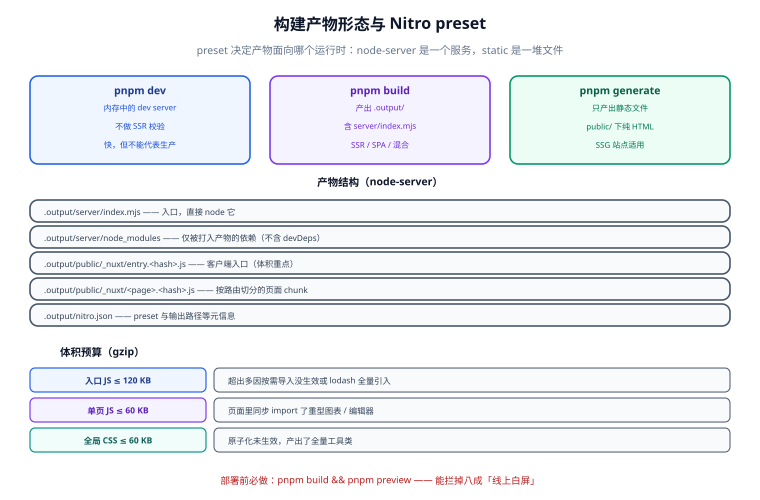

# 构建与产物形态

Nuxt 的构建和纯 Vite 项目不同：它产出的是**一份可以直接跑的服务**，而不是一堆静态文件。理解 `.output/` 里有什么，是决定「怎么部署」的前提；而体积预算则决定了「选哪个 UI 库代价多大」。



## 1. 三条命令，三种产物

| 命令 | 产物 | 用途 | 何时用 |
| --- | --- | --- | --- |
| `pnpm dev` | 无（内存中的 dev server） | 开发 | 日常 |
| `pnpm build` | `.output/`（服务端可跑） | 生产部署（SSR / SPA / 混合） | 默认 |
| `pnpm generate` | `.output/public/`（纯静态） | 静态托管（SSG） | 内容站、文档站 |
| `pnpm preview` | — | 本地验证**生产产物** | 部署前必做 |

::: danger `dev` 能跑 ≠ 生产能跑
开发模式下 Nuxt 会做很多宽容处理（自动安装缺失依赖、按需编译、跳过部分 SSR 校验）。有大量问题是只在生产构建后才暴露的：动态 import 路径拼错、`window` 在服务端被引用、第三方库只提供 CJS。**部署前必须跑一次 `pnpm build && pnpm preview`**，这是本模板的硬性验收项之一。
:::

## 2. Nitro preset

Nitro 是 Nuxt 的服务端引擎，`preset` 决定产物面向哪个运行时：

| preset | 产物 | 部署方式 | 适用 |
| --- | --- | --- | --- |
| `node-server`（默认） | `.output/server/index.mjs` + `public/` | `node .output/server/index.mjs` | 自有服务器、Docker |
| `static` | 纯 HTML/JS/CSS | 任意静态托管 | SSG 站点 |
| `node-cluster` | 多进程 Node 服务 | 同上，吃满多核 | 单机高并发 |
| `vercel` / `netlify` / `cloudflare-pages` | 平台专用产物 | 平台托管 | Serverless 部署 |
| `cloudflare-module` / `deno-server` / `bun` | 边缘运行时产物 | 边缘平台 | 低延迟边缘渲染 |
| `aws-lambda` | Lambda handler | AWS | 已有 AWS 体系 |

```ts [nuxt.config.ts（手写区追加）]
export default defineNuxtConfig({
  nitro: {
    preset: 'node-server',          // 部署到自有服务器 / Docker 时保持默认
    compressPublicAssets: true,     // 预压缩静态资源，交给 CDN
    // 把与部署平台相关的差异放在这里，而不是散落在代码里
  },
});
```

::: tip preset 是「部署形态」而不是「技术栈选择」
它可以在初始化后随时改，不需要重跑引擎。模板把渲染模式做成选项、把 preset 放在手写区，就是因为：**渲染模式影响你写代码的方式（数据获取时机），preset 只影响部署**。
:::

## 3. 产物结构

```text
.output/
├─ server/
│  ├─ index.mjs                 # 服务端入口（node-server 时直接 node 它）
│  ├─ chunks/                   # 服务端代码分包
│  ├─ node_modules/             # 仅被打进产物的运行时依赖（Nuxt 会内联）
│  └─ public/                   # 静态资源（SSR 时由服务端直接吐出）
├─ public/
│  ├─ _nuxt/
│  │  ├─ entry.<hash>.js        # 客户端入口
│  │  ├─ <page>.<hash>.js       # 按路由切分的页面 chunk
│  │  └─ *.css                  # 提取出的样式（含原子化生成的工具类）
│  ├─ _ipx/                     # 图片优化中间件（选了 Image 模块时）
│  └─ favicon.ico / robots.txt
└─ nitro.json                   # 产物元信息（preset、输出路径）
```

| 关注点 | 判据 |
| --- | --- |
| 入口 JS 大小 | `.output/public/_nuxt/entry.*.js` 的 gzip 体积（预算见下） |
| 页面是否按需切分 | 每个 `app/pages/**` 对应一个独立 chunk |
| 样式是否只含用到的工具类 | Tailwind / UnoCSS 产出的 CSS 应随页面变化，而不是固定几 MB |
| 服务端是否含不该有的东西 | `.output/server` 里不应出现 `.env`、测试文件、`wizard` 相关代码 |

::: warning 服务端产物里最容易混进的东西
构建时把仓库整个 `.output/server/node_modules` 一起打进镜像，会把 devDependencies 也带进去。判据是镜像里 `node_modules` 的条目数——正确做法是**只复制 `.output/` 与必要文件**，而不是复制整个 `node_modules`。这是模板 Dockerfile 采用「多阶段 + 只拷 `.output`」的原因，见 [部署与上线](../Deployment/index.md)。
:::

## 4. 体积预算

预算是为了**让「换 UI 库」这个决策有代价可衡量**，不是为了追求最小：

| 资源 | 预算（gzip） | 超出的常见原因 |
| --- | --- | --- |
| 入口 JS（`entry.*.js`） | ≤ 120 KB | 引入了未按需导入的组件库、`lodash` 全量引入 |
| 单页 JS（首屏页） | ≤ 60 KB | 页面里同步 import 了重型图表/编辑器 |
| 全局 CSS | ≤ 60 KB | 原子化未生效（产出了全量工具类）、主题变量重复 |
| 首屏字体 | ≤ 2 个字重 | 引了整套中文字体 |

各选项对体积的典型影响：

| 选项 | 全局 CSS | 入口 JS | 说明 |
| --- | --- | --- | --- |
| 无 UI + 无原子化 | 最小（几 KB） | 最小 | 纯 CSS |
| Element Plus（按需） | 中 | 中 | 必须走 `@element-plus/nuxt` 的自动导入，否则全量引入 |
| Ant Design Vue | 中（CSS-in-JS 运行时注入） | 中偏大 | 带 `dayjs`；样式在运行时注入，SSR 下需抽取 |
| Nuxt UI + Tailwind | 取决于用到的类 | 中 | Tailwind 只产用到的类，但组件库本身有体积 |
| UnoCSS | 取决于用到的类 | 中 | 按需生成，通常比 Tailwind 略小 |
| Vuetify | 偏大 | 中 | 组件与主题体系较大，靠 tree-shaking 控制 |

::: danger 按需导入是「默认打开」而不是「记得打开」
`Element Plus` 全量引入会让入口 JS 直接超预算。模板在生成配置时就写入自动导入模块；如果你在业务里写了 `import { ElButton } from 'element-plus'` 的**完整路径以外的**导入（例如从 `element-plus/es/components/...` 引入），按需导入会失效。正确做法是**不要手写 import**，直接用组件名（由自动导入处理）。
:::

## 5. 构建优化清单

| 项 | 做法 | 效果 |
| --- | --- | --- |
| 预压缩 | `nitro.compressPublicAssets: true` | CDN 直接返回 `.gz` / `.br`，省一次压缩 |
| Sourcemap | 生产关闭（`sourcemap: false`），排障时单独构建一版 | 体积与源码泄漏 |
| 按需引入 | UI 库走官方 Nuxt 模块的自动导入 | 入口 JS 常见降幅 30%~50% |
| 组件懒加载 | 非首屏组件用 `defineAsyncComponent` / `<LazyXxx>` | 首屏 JS 减小 |
| 图片 | 选了 Image 模块则统一走 `<NuxtImg>` | 自动 `webp` 与尺寸 |
| 第三方分析工具 | 只在客户端加载（`client-only` / `import.meta.client`） | 不影响首屏 |

```shell
# 构建并查看产物构成（Nuxt 4.4 起支持 build profiling）
pnpm build --profile
# 期望：生成构建分析产物；重点看「哪个依赖占了最大 chunk」
```

## 6. 构建耗时与缓存

| 场景 | 典型耗时 | 说明 |
| --- | --- | --- |
| 首次构建 | 1~4 分钟 | 取决于依赖数量与页面数 |
| 增量构建 | 20~60 秒 | 有 `.nuxt` 与 `node_modules/.vite` 缓存 |
| CI 无缓存 | 3~8 分钟 | 装依赖占大头 |

::: tip CI 里两处缓存必须配
① **pnpm store**（按 lockfile 哈希），避免每次重下依赖；② **`.nuxt` 目录**（按源码哈希），跳过重复的类型生成与编译。缓存键写错会让缓存永不命中（表现为耗时一直没变），也可能会命中过期缓存（表现为改了代码但产物没变）——后者更危险，所以**每周跑一次无缓存构建**校验缓存没掩盖问题。写法见 [部署与上线](../Deployment/index.md)。
:::

## 7. 验证方式

```shell
# ① 生产构建 + 本地预览（必做）
pnpm build
pnpm preview
# 期望：控制台打印 http://localhost:3000；打开页面与 dev 下一致，无 hydration 警告

# ② 产物结构核对
ls .output/server/index.mjs .output/public/_nuxt/ && ls .output/server/node_modules | wc -l
# 期望：入口存在；node_modules 条目数远小于仓库（不应含 devDeps）

# ③ 引导器不应出现在产物里（初始化后）
grep -r "wizard" .output/server .output/public | head -3
# 期望：无输出

# ④ 体积预算
node -e "const fs=require('fs');const p='.output/public/_nuxt';const f=fs.readdirSync(p).filter(x=>/^entry\..*\.js$/.test(x))[0];const b=fs.readFileSync(p+'/'+f);console.log(f, (b.length/1024).toFixed(1)+' KB (raw)')"
# 期望：raw 体积低于预算的 3~4 倍（gzip 后约为 1/3）

# ⑤ 静态产物（选了 SSG 时）
pnpm generate && ls .output/public/index.html
# 期望：index.html 存在，内容含首屏 HTML（不是空壳）
```

## 易错点与最佳实践

::: danger 六个构建期最容易踩的坑

1. **`window` / `document` 出现在服务端执行路径上。**SSR 构建会通过，运行时报 `window is not defined`。客户端专属逻辑必须放 `onMounted` 或 `import.meta.client` 分支里。
2. **动态 import 用变量拼路径。**把文件名拼进 import 的字符串里，会让打包器无法静态分析，产物缺 chunk。要用 `import.meta.glob` 的显式模式。
3. **第三方库只有 CJS 版本。**表现为构建成功但运行时报 `require is not defined`。解法是把它加进 `build.transpile`。
4. **把 `.env` 提交进仓库或打进镜像。**密钥必须由环境注入。
5. **`ssr: false` 却仍然依赖 `useAsyncData` 的 SSR 缓存。**SPA 下这些缓存不存在，`getCachedData` 会失效。
6. **构建产物目录被当成源码提交。**`.output/` 与 `.nuxt/` 必须在 `.gitignore` 里。
:::

::: tip 三条经验
1. 部署前的那次 `pnpm preview` 能拦掉 80% 的「线上白屏」，成本只有两分钟。
2. 体积预算不设阈值就等于没有预算——把它写成 `gates.json` 里的一条门禁（用脚本解析产物大小并断言）。
3. UI 库的体积问题几乎全出在「按需导入没生效」，排查顺序：先看产物 CSS 大小，再看是否手写了 `import`。
:::

## 相关页面

- [部署与上线](../Deployment/index.md)：把 `.output/` 变成可访问的服务
- [技术栈矩阵与组合兼容](../StackMatrix/index.md)：各选项对产物的影响来源
- [质量门禁与自测](../Quality/index.md)：体积预算如何变成门禁
- [Nuxt 全栈开发 · 部署与实战](../../../../docs/Frontend/Frame/Nuxt/Deployment/index.md)：框架层的部署形态矩阵

## 参考资料

- Nuxt 构建与部署：[nuxt.com/docs/getting-started/deployment](https://nuxt.com/docs/getting-started/deployment)
- Nitro 部署预设：[nitro.build/deploy](https://nitro.build/deploy)
- Nuxt 构建分析（profiling）：[nuxt.com/blog/v4-4](https://nuxt.com/blog/v4-4)
- Element Plus 按需导入：[element-plus.org/zh-CN/guide/quickstart](https://element-plus.org/zh-CN/guide/quickstart)
