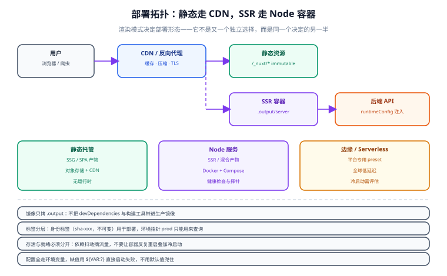

# 第 7 步：部署与交付

模板到此已经能跑、能切、能测。最后一步要回答的是：**这些东西怎么变成线上能访问的产物，以及在换库之后，部署流程为什么一个字都不用改。**



## 一、为什么部署要单独写一步

有个常见误会：既然换库只改 `ui.config.json`，那部署这件事应该与本文档无关。

恰恰相反——**换库会改产物，而部署流程必须不变**。这两句话同时成立，才是「模板真的把复杂度封装住了」的证明。

具体来说：

| 换库时**会**变的 | 换库时**不该**变的 |
| --- | --- |
| 客户端 bundle 的体积与文件名 | 构建命令（还是 `pnpm build`） |
| 需要预渲染的页面集合（SSG 下） | 产物目录结构（还是 `.output/`） |
| 依赖树（`deps.json` 驱动的 `pnpm install`） | 环境变量清单（还是那几个 `NUXT_*`） |
| CSS 里被映射的变量名（`--el-*` → `--ant-*`） | 健康检查路径与探针协议 |
| 镜像里多/少的几十 MB | 回滚方式（还是切回上一个 tag） |

所以这一步的目标不是「教你怎么部署 Nuxt」——那是框架的事。目标是**把「与 UI 库无关」这条边界，在部署层面也钉死**。

## 二、产物形态由 `render` 决定

`render` 只有一个取值的二元选择，但它决定了产物的**根本形态**：

| `render` | Nitro preset | 产物目录 | 里面有 Node 进程吗 |
| --- | --- | --- | --- |
| `ssr` | `node-server` | `.output/server/index.mjs` | **有**，跑的是一个 Node 服务 |
| `ssg` | `static` | `.output/public/` | **没有**，只有一堆 HTML/CSS/JS |

这条链路在第 5 步是自动打通的：脚本把 `uiNitroPreset` 写进 `nuxt-ui.config.mjs`，
`nuxt.config.ts` 的 marker 区间把它接进 `nitro.preset`。所以你不需要手工改 preset：

```shell
node scripts/ui-select.mjs --preset element-admin    # ssr → node-server
pnpm build
ls .output/server/index.mjs                          # 存在

node scripts/ui-select.mjs --preset static-demo      # ssg → static
pnpm build
ls .output/public/index.html                         # 存在，且没有 .output/server
```

::: danger SSG 产物里没有 Node 服务
最常见的错误是在 `render: ssg` 下照抄 SSR 的启动命令：

```shell
node .output/server/index.mjs    # 报错：文件不存在
```

SSG 的 `.output/public/` 是**纯静态资源**，交给 Nginx、对象存储或 CDN 就行（见 §五）。
如果确实需要一个 Node 进程，那就说明这个项目应该用 `ssr`——这不是部署问题，是 `render` 选错了。
:::

## 三、五种交付形态

同一份代码、同一条构建命令，能落到五种形态。**它们与 UI 库无关**，这也是本文想证明的事：

| 形态 | Nitro preset | 适合 | 需要留意 |
| --- | --- | --- | --- |
| **Node 服务** | `node-server` | 自建服务器；SSR 与接口同机 | 进程管理、端口与内存上限 |
| **静态产物** | `static` | 对象存储 + CDN，零 Node 运行时 | 没有「按请求个性化」能力 |
| **容器镜像** | `node-server` | 编排平台（K8s / Compose） | 多阶段构建控制体积 |
| **边缘运行时** | `cloudflare-pages` / `netlify-edge` 等 | 就近响应 | 运行时限制：无 Node 原生模块、体积上限 |
| **Serverless** | `aws-lambda` / `vercel` 等 | 流量波动大 | 冷启动需要实测评估 |

::: info 边缘与 Serverless 的 preset 名以官方为准
上表里的 preset 名只是常见写法，Nitro 的 preset 列表会随版本增减。
落地前请对着 Nitro 部署文档确认当前版本支持的取值，别照抄一份过期的表。
:::

## 四、交付流程的四个动作

不管落到哪种形态，流程都是这四步——**每一步都不关心 UI 库是什么**。

### 4.1 构建：先验生成物，再构建

```shell
node scripts/ui-select.mjs --check   # ① 生成物与 ui.config.json 一致
pnpm install                         # ② 依赖按 deps.json 对齐
pnpm build                           # ③ 出产物
```

顺序不能反。先构建再 `--check`，检查的就不再是「源码有没有漂移」，而是「产物的时间戳」——没有意义。

### 4.2 变量注入：环境相关项走 runtimeConfig

`nuxt.config.ts` 里**除 marker 区间外**都是手写区（第 5 步的测试专门证明了这点：换库时这个文件一个字节都不变）。
所以环境相关配置就直接加在手写区：

```typescript [nuxt.config.ts（手写区节选）]
export default defineNuxtConfig({
  compatibilityDate: '2026-09-01',
  future: { compatibilityVersion: 4 },

  // ui:modules:begin
  modules: [...baseModules, ...uiModules],
  // ui:modules:end

  runtimeConfig: {
    apiBase: '',                    // → NUXT_API_BASE
    public: {
      ...uiRuntimeConfigPublic,     // 脚本生成：这个产物挂的是哪个库、哪种渲染
      siteName: 'Nuxt 通用模板',      // → NUXT_PUBLIC_SITE_NAME
    },
  },

  // …其余配置
})
```

```shell
NUXT_API_BASE=https://api.example.com \
NUXT_PUBLIC_SITE_NAME=订单中心 \
node .output/server/index.mjs
```

::: danger 不要用环境变量覆盖 `ui` / `render`
`NUXT_PUBLIC_UI` 看起来能覆盖生成物里的取值，但这和手工改 `personalize` 是同一类错误：

**`ui` / `render` 描述的是「这个产物是什么」，而不是「这次部署想要什么」。**

一旦允许环境变量覆盖，就会立刻出现自相矛盾的状态——镜像里打包的是 Element Plus，
环境变量却写着 `antd`，而 `--check` 还会一路绿灯（因为它只看源码生成物）。
变量注入只应该管「连哪个接口、叫什么名字、上报到哪里」。
:::

### 4.3 健康检查：一个不依赖 UI 的探针

探针接口**不要渲染任何组件**。UI 库出问题时，探针如果也跟着挂，编排层会误判为「进程死了」然后不停重启——把一个渲染问题升级成可用性事故。

```typescript [server/api/health.get.ts]
export default defineEventHandler(() => {
  const cfg = useRuntimeConfig()
  return {
    status: 'ok',
    // 顺手把「这个实例挂的是哪个库」报出来：多形态并行部署时一眼能分辨
    ui: cfg.public.ui,
    render: cfg.public.render,
    personalize: cfg.public.personalize,
    uptime: Math.round(process.uptime()),
  }
})
```

```shell
curl -s localhost:3000/api/health
# {"status":"ok","ui":"element","render":"ssr","personalize":true,"uptime":37}
```

这个接口的更多设计取舍（就绪与存活探针的区别、探针不该查外部依赖等）见
[健康检查与配置](../../BackendTemplate/HealthCheck/index.md)。

### 4.4 回滚：产物按变体命名

因为「一个库 × 一种渲染 = 一条独立构建线」，产物天然带两个维度。把它编进名字里，回滚就不需要重新构建：

```shell
# 镜像 / 制品命名：<ui>-<render>-<sha>
docker build -t registry.example.com/app:element-ssr-a1b2c3d .
docker build -t registry.example.com/app:antd-ssr-a1b2c3d .

# 回滚 = 把 tag 指回上一版，不需要重新构建
docker tag registry.example.com/app:element-ssr-9f8e7d6 registry.example.com/app:element-ssr-current
```

## 五、两种典型落地

### 5.1 SSR：多阶段容器镜像

```dockerfile [Dockerfile]
# syntax=docker/dockerfile:1.7

# ---------- 构建期：只有这里出现 pnpm 与源码 ----------
FROM node:22-alpine AS build
WORKDIR /app
RUN corepack enable
# 先只拷清单文件，让依赖层独立成缓存层：改业务代码不会重新装依赖
COPY package.json pnpm-lock.yaml ./
RUN pnpm install --frozen-lockfile
COPY . .
# 生成物必须与 ui.config.json 一致，否则镜像里的 UI 层和配置是两回事
RUN node scripts/ui-select.mjs --check
RUN pnpm build

# ---------- 运行期：只有 Node 与产物 ----------
FROM node:22-alpine AS runtime
WORKDIR /app
ENV NODE_ENV=production
COPY --from=build /app/.output ./.output
USER node
EXPOSE 3000
CMD ["node", ".output/server/index.mjs"]
```

```text [.dockerignore]
node_modules
.output
.nuxt
.git
.github
test
```

::: warning `.dockerignore` 里别把 `scripts/` 排掉
构建期要跑 `node scripts/ui-select.mjs --check`，所以 `scripts/` 必须进镜像的构建阶段。
只在**运行期**不需要它——多阶段构建天然把这一点分开了。
:::

### 5.2 SSG：对象存储 + CDN

```shell
node scripts/ui-select.mjs --preset nuxtui-content   # ssg
pnpm build
# 产物就是 .output/public/，整目录同步走
aws s3 sync .output/public/ s3://my-bucket/ --delete --cache-control "public,max-age=31536000,immutable"
aws s3 cp .output/public/index.html s3://my-bucket/index.html --cache-control "no-cache"
```

两个要点：

1. **带哈希的静态资源可以长缓存**（`immutable`），`index.html` 必须不缓存——否则换库重新部署后，用户还在用旧 HTML 去请求已经不存在的旧 chunk。
2. **SSG 下没有 `/api/health` 这种东西**。要探活就用「取一个静态文件看 200」，别指望服务端逻辑。

## 六、把模板本身交付出去

前面六节讲的是「用模板做出来的项目怎么上线」。这一节讲**模板自己怎么发出去**——毕竟它是个通用模板，不是一次性脚手架。

| 方式 | 命令 | 适合 |
| --- | --- | --- |
| **克隆后去历史** | `git clone --depth 1 <repo> my-app && rm -rf my-app/.git && git init` | 最直接，无额外依赖 |
| **Template Repository** | 仓库设置里勾选 Template，页面上「Use this template」 | 团队内统一起点 |
| **degit** | `pnpm dlx degit <repo> my-app` | 只要快照，不要 git 历史 |
| **发布 create 包** | `pnpm create nuxt-universal` | 需要维护多个项目、想统一升级 |

::: danger 交付模板时的三个必踩坑
1. **生成物要和 `ui.config.json` 一起提交**。否则别人克隆下来第一件事就是 `--check` 报红，第一印象直接毁掉。
   初始化流程固定为：克隆 → `node scripts/ui-select.mjs --preset <预设>` → `git add -A` → 首次提交。
2. **不要删 `scripts/`**。切换器、自测、fixture 都在里面；删了之后「换库」就退化成手工改八个文件。
3. **不要把某个库的补丁打进业务代码**。需要绕过某个库的 bug 时，写在实现层的逃生口里（第 2 步），
   并把原因写成注释——否则换库时这段「先绕过」会变成永远没人敢删的诅咒。
:::

## 七、验收清单

第 6 步的验收标准是「行为没坏」，这一步的验收标准是「换库之后交付链路没坏」。逐条对：

| # | 动作 | 期望 |
| --- | --- | --- |
| 1 | `node scripts/ui-select.mjs --check` | 退出码 0 |
| 2 | `pnpm build` | 产物目录与 `render` 对应（`ssr` → `.output/server`，`ssg` → `.output/public`） |
| 3 | `curl /api/health` | `ui` 字段与 `ui.config.json` 一致 |
| 4 | 换一个库，重跑 1~3 | 仍然全部通过，**且部署脚本一个字都没改** |
| 5 | 换回原库，重跑 1~3 | 产物回到同一状态（幂等，与第 5 步同源） |
| 6 | 页面功能与视觉 | 与换库前一致；控制台无 `hydration` 错误 |

第 4 条是这一步的核心。如果它需要你改部署脚本，说明某个环节漏了封装——通常是两种情况：

- **业务代码里出现了组件库名字**：被 §六 的边界门禁拦住，修业务代码，不要改部署脚本。
- **部署脚本里手工指定了 preset 或产物路径**：说明它绕过了 `uiNitroPreset`，把这层重新交给脚本。

## 八、验证方式

```shell
# ① SSR：起服务并确认健康检查报出了正确的 UI 层
node scripts/ui-select.mjs --ui element --render ssr
pnpm build
PORT=3000 node .output/server/index.mjs &
curl -s localhost:3000/api/health | grep '"ui":"element"' && echo "OK ssr/element"

# ② SSG：产物必须是纯静态的
node scripts/ui-select.mjs --ui nuxtui --render ssg --allow-degraded-personalize
pnpm build
test -f .output/public/index.html && test ! -e .output/server && echo "OK ssg/nuxtui"

# ③ 换库后重新部署，部署脚本零改动（对比两次的构建命令）
node scripts/ui-select.mjs --ui antd --render ssr
pnpm build
PORT=3001 node .output/server/index.mjs &
curl -s localhost:3001/api/health | grep '"ui":"antd"' && echo "OK 换库后交付链路未变"
```

三条全部打印 `OK` 即可交付。

## 九、下一步

七步走下来，模板已经能切、能测、能交付。但真正落地时，卡住人的往往不是这些主干路径，而是某个下午三点钟的怪异报错。

常见问题与反模式整理在最后一页，建议在踩坑之前先扫一遍。

- [常见问题与反模式](../FAQ/index.md)

## 参考资料

- [Nuxt · Deployment](https://nuxt.com/docs/getting-started/deployment)：产物形态与托管建议
- [Nitro · Deployment](https://nitro.build/deployment)：preset 列表与各平台的部署说明（本文 §三 的取值以此为准）
- [Nuxt · Runtime Config](https://nuxt.com/docs/guide/features/runtime-config)：`NUXT_` 前缀环境变量的覆盖规则
- [Docker · 多阶段构建](https://docs.docker.com/build/building/multi-stage/)：构建期与运行期分离
