# 第 4 步：设计令牌与主题桥接

上一步结束时有个遗留问题：四个实现层都能跑了，但**换一个库，品牌色、圆角、字号全变**。因为视觉还散落在组件库的默认值里。这一步把视觉抽成三层令牌，让「换库不换外观」成立。



## 一、三层令牌

| 层 | 位置 | 回答什么 | 谁维护 |
| --- | --- | --- | --- |
| **① 品牌令牌** | `app/assets/styles/tokens.css` | 我们是谁（原始值：`#2563eb`、`8px`） | 人（设计规范） |
| **② 语义令牌** | 同上 | 这里是什么用途（`--ui-color-primary`、`--ui-radius-control`） | 人 |
| **③ 组件库变量** | `app/assets/styles/generated-tokens.css` | 某个库怎么实现（`--el-color-primary`） | 脚本生成 |

关键点：**业务与契约组件只使用第 ② 层**，从第 ② 层往下的映射由生成文件负责。

## 二、手写：品牌层与语义层

```css [app/assets/styles/tokens.css]
:root {
  /* ---- 第 ① 层：品牌令牌（原始值，唯一事实来源） ---- */
  --brand-500: #2563eb;
  --brand-400: #3b82f6;
  --brand-danger: #dc2626;
  --radius-sm: 4px;
  --radius-md: 8px;
  --font-size-base: 14px;

  /* 组件库变量未必接受 hex：Vuetify 的主题变量是 RGB 分量，
     所以品牌层同时提供「分量」形态，避免在映射层做颜色转换 */
  --brand-500-rgb: 37 99 235;
  --brand-danger-rgb: 220 38 38;

  /* ---- 第 ② 层：语义令牌（业务与契约组件只认这一层） ---- */
  --ui-color-primary: var(--brand-500);
  --ui-color-danger: var(--brand-danger);
  --ui-radius-control: var(--radius-md);
  --ui-font-body: var(--font-size-base);
}
```

::: tip 为什么第 ① 层和第 ② 层写在同一个文件里
因为它们都是**人手维护的设计决策**，改动的时机也一致（设计规范变了才改）。分开文件只会增加「改了一个忘了另一个」的风险。

真正的分界线在**手写与生成之间**：`tokens.css` 手写，`generated-tokens.css` 生成。
:::

## 三、生成：第 ③ 层映射

```css [app/assets/styles/generated-tokens.css（以 antd 为例，脚本生成）]
:root {
  /* ---- 第 ② 层：语义令牌（由第 ① 层品牌令牌派生） ---- */
  --ui-color-primary: var(--brand-500);
  --ui-color-danger: var(--brand-danger);
  --ui-radius-control: var(--radius-md);
  --ui-font-body: var(--font-size-base);

  /* ---- 第 ③ 层：Ant Design Vue 变量映射 ---- */
  --ant-color-primary: var(--ui-color-primary);
  --ant-color-error: var(--ui-color-danger);
  --ant-border-radius: var(--ui-radius-control);
  --ant-font-size: var(--ui-font-body);
}
```

注意第 ③ 层用的是 `var(...)` **引用**而不是字面量。这带来一个免费的好处：

::: tip 明暗主题切换时，映射层不需要改
因为 `--el-color-primary: var(--ui-color-primary)` 是「别名」，不是「值拷贝」。所以只要在 `.dark` 作用域里重新定义 `--ui-color-primary`，所有组件库变量会自动跟着变——**映射文件不用写第二份**。
:::

## 四、四个库的变量映射对照

| 语义令牌 | Element Plus | Ant Design Vue | Nuxt UI | Vuetify |
| --- | --- | --- | --- | --- |
| `--ui-color-primary` | `--el-color-primary` | `--ant-color-primary` | `--ui-primary` | `--v-theme-primary` |
| `--ui-color-danger` | `--el-color-danger` | `--ant-color-error` | `--ui-error` | `--v-theme-error` |
| `--ui-radius-control` | `--el-border-radius-base` | `--ant-border-radius` | `--ui-radius` | `--v-border-radius` |
| `--ui-font-body` | `--el-font-size-base` | `--ant-font-size` | `--ui-text-base` | `--v-font-size` |

::: danger Vuetify 的变量形态与众不同
Vuetify 的主题变量存的是 **RGB 分量**而不是完整颜色值：

```css
/* Vuetify 期望的形态：三个数字，交给 rgb() 去组合 */
--v-theme-primary: 37 99 235;

/* 错误写法：直接把 hex 塞进去，Vuetify 会渲染出透明或黑色 */
--v-theme-primary: #2563eb;
```

所以品牌层要额外提供 `--brand-500-rgb` 这类分量令牌。**这类「形态差异」正是映射层必须由脚本生成、而不能靠人记忆维持的原因。**
:::

## 五、暗色主题

用 CSS 类切换（`html.dark`），而不是 `prefers-color-scheme` 媒体查询——因为用户需要**手动覆盖系统设置**的能力。

```css [app/assets/styles/dark.css]
.dark {
  /* 只覆盖语义层的「值」，映射层自动跟随 */
  --ui-color-primary: var(--brand-400);
  --ui-surface-1: #0b1220;
  --ui-surface-2: #111a2b;
  --ui-text-1: #e2e8f0;
}
```

```typescript [app/composables/useTheme.ts]
// 用 cookie 记住用户选择，服务端渲染时就能拿到，避免首屏闪烁
export function useTheme() {
  const mode = useCookie<'light' | 'dark' | 'system'>('theme', {
    default: () => 'system',
    maxAge: 60 * 60 * 24 * 365,
  })

  const resolved = computed(() =>
    mode.value === 'system'
      ? (usePreferredDark().value ? 'dark' : 'light')
      : mode.value)

  useHead({
    htmlAttrs: { class: () => (resolved.value === 'dark' ? 'dark' : '') },
    meta: [{ name: 'color-scheme', content: () => resolved.value }],
  })

  return { mode, resolved }
}
```

::: danger 暗色模式在 SSR 下最容易踩的两个坑
1. **用 `localStorage` 存主题**：服务端读不到，首屏一定是亮色，然后客户端切换 → 用户看到一次闪烁。用 `useCookie` 让它跟着请求一起到服务端。
2. **只写媒体查询不用类**：用户无法覆盖系统设置。正确做法是「默认跟随系统，但允许手动指定」，两者都要支持。
:::

## 六、业务代码里禁止出现组件库变量

令牌层的价值取决于「有没有人绕过它」。这需要一条机械规则：

```javascript [eslint.config.mjs（自定义规则片段）]
// 禁止在 app/pages 与 app/components 下出现组件库的变量前缀
const FORBIDDEN_VAR = /--(el|ant|antd|v)-[a-z-]+/
const FORBIDDEN_IMPORT = /from\s+['"](element-plus|ant-design-vue|vuetify|@nuxt\/ui)['"]/
```

检查方式（放进 CI）：

```shell
# 1. 业务与契约层里不该出现组件库变量（输出为空即通过）
grep -rnE "\-\-(el|ant|antd|v)-[a-z-]+" app/pages app/components app/ui/impl/../*.ts

# 2. 不该直接 import 组件库
grep -rnE "from ['\"](element-plus|ant-design-vue|vuetify|@nuxt/ui)['\"]" app/pages app/components
```

::: warning 唯一允许出现组件库变量的地方
`app/ui/impl/<库名>/` 下的文件。因为那里就是**翻译层**，不谈组件库的变量反而是错的。

判定规则一句话：**变量前缀出现在 `impl/` 下是工作，出现在 `pages/` 下是漏洞。**
:::

## 七、验证方式

```shell
# 1. 换库，观察品牌色是否保持不变
node scripts/ui-select.mjs --ui element --render ssr && pnpm dev
# 记录主按钮的颜色（浏览器取色器）

node scripts/ui-select.mjs --ui antd --render ssr && pnpm dev
# 期望：主按钮仍是 --brand-500，圆角仍是 8px，字号仍是 14px
```

预期结果：

| 检查项 | 期望 | 判据 |
| --- | --- | --- |
| 主色 | 换库前后一致 | 浏览器取色器取到同一个 hex |
| 圆角 | 换库前后一致 | 按钮圆角均为 8px |
| 字号 | 换库前后一致 | 正文均为 14px |
| 明暗切换 | 换库前后都能正常工作 | 切换后组件库配色跟随 |
| 首次加载 | 无主题闪烁 | 首屏就是正确主题（SSR 生效） |

::: tip 用取色器而不是「看着差不多」
不同组件库的按钮在**内边距、阴影**上天然有差异，肉眼看整体「感觉不一样」是正常的。令牌层只承诺 **主色、圆角、字号、语义色**一致，不承诺像素级对齐——这个边界要在第 1 步的验收标准里就写清楚，否则会被当成 bug 反复讨论。
:::

## 八、下一步

到这里，机制、实现、视觉都齐了。剩下的问题是：**「换库」这件事本身怎么执行**——把改配置、生成产物、安装依赖、跑门禁串成一条命令。这是第 5 步。

- [第 5 步：切换工具链与多形态构建](../SwitchTooling/index.md)

## 参考资料

- [CSS 自定义属性（MDN）](https://developer.mozilla.org/zh-CN/docs/Web/CSS/Using_CSS_custom_properties)
- [Element Plus · 自定义主题](https://element-plus.org/zh-CN/guide/theming.html)
- [Ant Design Vue · 定制主题](https://antdv.com/docs/vue/customize-theme-cn)
- [Nuxt UI · 主题](https://ui.nuxt.com/getting-started/theme)
- [Vuetify · 主题变量](https://vuetifyjs.com/en/features/theme/)
