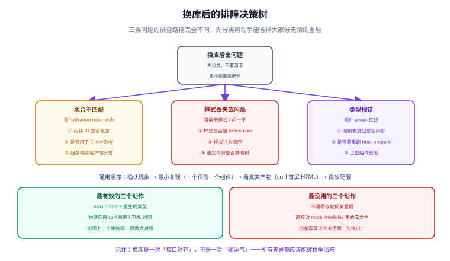

# 常见问题与反模式

七步走完，主干路径都能跑通了。这一页收集的是**真正会卡住人的地方**——不按「问题列表」组织，按「症状 → 分类 → 排查顺序」组织，因为换库之后最常见的错误动作就是**对着症状乱试**。



## 一、先分类，再动手

换库之后出问题，第一件事不是回滚，更不是重装依赖，而是**把症状归到三类之一**。三类的根因完全不重叠，混在一起排查只会浪费时间。

| 症状 | 类别 | 根因在 | 通常几分钟能定位 |
| --- | --- | --- | --- |
| 控制台 `hydration mismatch`、点击偶发失效 | **水合不匹配** | 服务端与客户端渲染出了不同的 DOM | 是（看首屏 HTML 就能定位） |
| 首屏没样式 / 闪一下 / 暗色主题错位 | **样式问题** | 样式被 tree-shake、注入顺序、令牌缺映射 | 是（看 `--check` 与生成的 CSS） |
| 组件 props 报红线、泛型推断不出来 | **类型问题** | 生成类型过期、映射表类型不同步 | 是（重跑 prepare / 脚本） |

::: tip 一句话记住
**换库是一次「接口对齐」，不是一次「碰运气」。**

如果一个问题排查了两小时还说不清根因，那基本可以确定：你在用一个不完整的信息做判断。
先把「现象 → 最小复现 → 真实产物」这三步补上，再动手。
:::

## 二、排障的通用顺序

这四步能覆盖上面三类问题的绝大多数：

```text
① 确认现象      控制台有没有报错？是首屏就有还是交互后才出现？
② 最小复现      缩到一个页面、一个组件、一个 props 组合
③ 看真实产物    curl 首屏 HTML —— 服务端到底吐出了什么
④ 再改配置      前三步做完之前，一行配置都不要改
```

第 ③ 步是绝大多数人跳过、也最不该跳过的一步。因为 SSR 的问题**不在你的肉眼所见里**——你看到的是水合之后的 DOM，而问题出在水合之前的 HTML：

```shell
# 起服务，取「没有 JS 执行过」的原始首屏
node .output/server/index.mjs &
curl -s localhost:3000/ > before.html
grep -o 'id="[^"]*"' before.html | sort | uniq -c | sort -rn | head   # 有没有重复 id
grep -c 'el-' before.html                                             # 还在引用旧库的类名？
```

## 三、水合不匹配

**症状**：控制台出现 `Hydration completed but contains mismatches` / `Hydration node mismatch`，并伴随「点了没反应」。

**根因**：服务端渲染出的 DOM 与客户端首次渲染出的 DOM 不一致。三个检查点按顺序看：

### 3.1 组件 ID 是否稳定

有些实现会在客户端生成随机的 ID（弹层、表单控件、把 `label` 和输入框用 `aria-labelledby` 关联起来的场景）。服务端和客户端各生成一次 → 必然不匹配。

```typescript [app/components/x/XField.vue（节选）]
// 反例：随机源在服务端与客户端各跑一次，ID 一定不同
const inputId = `field-${Math.random().toString(36).slice(2)}`

// 正例：用框架提供的、SSR 安全的 useId()
const inputId = useId()
```

判断方法很直接——拿首屏 HTML 里的 `id` 列表去查有没有重复或对不上的引用：

```shell
curl -s localhost:3000/form > form.html
grep -o 'id="[^"]*"' form.html | sort | uniq -c | sort -rn | head
grep -o 'aria-labelledby="[^"]*"' form.html
```

如果 `aria-labelledby` 指向的 ID 在 HTML 里找不到，就是这里的问题。

### 3.2 弹层类组件是否包了 `<ClientOnly>`

`Dialog` / `Drawer` / `Tooltip` / `Select` 的下拉面板几乎都走 `Teleport`，而服务端没有真实的 `document.body` 目标节点：

```vue [app/components/x/XDialog.vue（节选）]
<template>
  <!-- 弹层只在客户端渲染：这一层落在契约组件里，业务永远不用管 -->
  <ClientOnly>
    <slot />
    <template #fallback>
      <span />
    </template>
  </ClientOnly>
</template>
```

### 3.3 有没有在服务端与客户端走不同分支

`import.meta.server` / `import.meta.client`、`process.client`、`Date.now()`、`window` 存在性判断——这些一旦影响**渲染出的结构**（而不只是数据），就会不匹配。

```vue
<!-- 反例：服务端渲染 A，客户端渲染 B -->
<div v-if="import.meta.client && isMobile">…</div>
<div v-else>…</div>
```

正确做法是把「宽高 / 时区 / 随机」这类信息，要么固定成构建期常量，要么推迟到 `onMounted` 之后再切换。

## 四、样式丢失或闪烁

**症状**：首屏白板、刷新时闪一下、暗色主题下颜色对不上。

按这三个检查点顺序排查：

### 4.1 样式是不是被 tree-shake 掉了

不同库的样式引入方式不同，这是**换库时最容易漏的一处**：

| 库 | 样式怎么进来 | 最容易漏的地方 |
| --- | --- | --- |
| Element Plus | 官方模块按需注入 | 手工再配一次 `unplugin` 反而会打架 |
| Ant Design Vue | 打开 `extractStyle` 做样式提取 | 没开就会「首屏无样式，随后补上」 |
| Nuxt UI | `css` 数组指向 `~/assets/styles/main.css` | 漏了这行 = 全站没样式 |
| Vuetify | 官方模块注入（SASS 构建期） | 运行时改主题只能改 CSS 变量那部分 |

生成物里的 `uiCss` / `uiBuild` 已经把这些差异封装好了。**所以第一件事是确认生成物没漂移**：

```shell
node scripts/ui-select.mjs --check    # 报红就说明有人在手改，先收敛
```

### 4.2 样式注入顺序

同一个 CSS 属性被两处定义时，**后加载的赢**。SSR 与 CSR 的注入顺序可能不同，于是首屏闪一下。

处理原则：**顺序问题靠单一定义源解决，不靠调顺序**。也就是第 4 步那套三层令牌——业务只写第 ② 层（`--ui-*`），第 ③ 层由生成物负责映射，从根本上不存在「两处定义同一个属性」。

### 4.3 语义令牌缺映射

换了库但忘了重跑脚本，`generated-tokens.css` 里还是上一个库的变量名（比如残留 `--el-color-primary`），而新库读的是 `--ant-color-primary` → 令牌全部落空。

这属于「生成物漂移」，`--check` 会直接报红并指出文件名。

## 五、类型报错

**症状**：组件的 props 报红线、`XTable` 的列定义推断不出来、`#ui-impl` 别名找不到。

三件事按顺序做：

```shell
# ① 重跑脚本：让映射表与生成类型同步
node scripts/ui-select.mjs --ui antd --render ssr

# ② 重生成 Nuxt 类型（.nuxt/ 下的自动导入与别名声明）
pnpm nuxt prepare

# ③ 再跑类型检查
pnpm typecheck
```

::: danger 两个高频误判
1. **`.nuxt/` 过期被当成代码问题**。`nuxt.config.ts` 改动后类型不会自动同步；
   报错信息看起来像「别名不存在」，其实只是没重新生成。先 `pnpm nuxt prepare`，再判断。
2. **把泛型签名差异当成 bug**。不同库的表格列定义类型确实不同——
   这正是契约层存在的理由：差异在 `app/ui/impl/<lib>/XTable.vue` 里对齐，
   而不是让业务代码去适配两个签名。
:::

## 六、最有效与最没用的动作

| ✅ 最有效的三个动作 | 为什么有效 |
| --- | --- |
| `pnpm nuxt prepare` 重生成类型 | 排除掉「类型世界与代码世界不同步」这种假问题 |
| 构建后 `curl` 首屏 HTML 做对照 | 直接看见服务端真实输出，绕开「浏览器已水合」的干扰 |
| 切回上一个库跑同一页面做对照 | 一次对照就能把「换库引起」与「本来就坏」分开 |

| ❌ 最没用的三个动作 | 为什么没用 |
| --- | --- |
| 不清缓存就反复重启 | 每次重启都在同一份不确定状态上重试，信息量为零 |
| 直接改 `node_modules` 里的库文件 | 下次 `pnpm install` 就没了，还会让你误以为「修好了」 |
| 把差异写进业务页面「先绕过」 | 绕过的是症状，留下的是一个永远没人敢删的分支 |

## 七、反模式清单

这十条是这类模板落地时最容易走偏的地方。它们共同的特征是：**当下省了十分钟，之后每次换库都要还债。**

1. **在业务页面里按库分叉**：`v-if="uiKey === 'element'"`。这是契约层失守最典型的症状。
2. **在业务里直接写组件库的 props**：`size="large"` 这类命名各库不同，必须由契约层翻译。
3. **手工修改生成物**：改了会被 `--check` 抓住，但更糟的是有人改完不提交，整个团队的基线就悄悄漂了。
4. **手工改 `personalize`**：它由 `render` 派生，描述的是「当前具备什么能力」，不是开关。
5. **同时装两个组件库**：见 §八 的对应问答，模板明确不支持。
6. **用 `!important` 覆盖组件库样式去抹平差异**：这会把差异从「一行映射」变成「一堆选择器优先级」。
7. **把「先绕过」的补丁留在契约层却不写原因**：三个月后没人敢删，等于永久放弃了那个库。
8. **删掉 `scripts/`**：切换器与自测都在里面，删了就退化成手工改八个文件。
9. **换库和升框架一起做**：两个变量同时变，出问题时无法归因。一次只推进一件事。
10. **用「镜像变大 / 构建变慢」当回归判据**：不同库的体积本来就不同，这不是 bug。

## 八、速查问答

| 问题 | 答案 |
| --- | --- |
| **能同时装两个库、按页面切换吗？** | 不能，模板明确不支持。同时装之后「这个页面到底用了谁」不可判定，边界门禁也失效。真的要灰度迁移，用两个产物分两条构建线，而不是一个产物里装两套。 |
| **换一个库要多久？** | 一条命令加一次 `pnpm install`；工作量全在 `pnpm install` 与重新构建上，业务代码零改动。 |
| **换库后旧库的 CSS 会残留吗？** | 不会。`generated-tokens.css` 整文件被覆盖，`uiCss` / `uiBuild` 也随之重建。唯一要手动做的是从 `package.json` 里移除不再需要的依赖（`pnpm install` 不会自动删）。 |
| **能只换一部分页面吗？** | 不能，模板刻意按「整个应用一个实现」设计。部分替换会让两个库的样式与主题同时存在，令牌体系立刻失效。 |
| **契约组件要写多少个？** | 按业务真实用到的来：通常 8~15 个能覆盖 90% 场景。关键是**别一次写完**——先写用到的那几个，`frozen.json` 会逼你每加一个就补齐用例。 |
| **业务里能直接用库自己的组件吗？** | 能，但只有一处：`app/ui/impl/<lib>/` 里。业务与契约层出现组件库名字会被 CI 边界门禁拦住。 |
| **某个库缺一个能力怎么办？** | 走实现层的逃生口（第 2 步的三条纪律）：在实现层内部适配，写清原因，契约层的对外形态不变。 |
| **大版本升级（比如 Element Plus 3）怎么办？** | 按仓库的「大版本管理」规则：新建实现层目录（如 `impl/element3`），旧的不删不覆盖，`ui.config.json` 的取值扩展成三选一并说明差异。 |
| **Vuetify 能用吗？** | 能，但它是实验性实现（模块仍是 rc），必须显式加 `--allow-experimental`，生成物会留下 `experimental: true`，且不进默认测试矩阵。生产使用要锁死精确版本。 |
| **SSG 下能有动态内容吗？** | 能取数据，但不能「按请求个性化」。SSG 在构建期把 HTML 定死，服务端没有「按这次请求」的机会——所以脚本对 `render: ssg` 设了门禁。 |
| **怎么知道线上挂的是哪个库？** | `curl /api/health`，返回里带 `ui` / `render`（第 7 步的探针接口）。多形态并行部署时一眼可辨。 |
| **生成物报红了，但我没改过它？** | 大概率是换了 git 分支或合并了别人的改动。跑一次 `node scripts/ui-select.mjs --ui <当前值> --render <当前值>` 收敛，再确认 `ui.config.json` 的取值是不是你想要的。 |

## 九、七步回顾

| 步 | 页面 | 这一步把什么变成了事实 |
| --- | --- | --- |
| 0 | [第 0 步：需求与可插拔边界](../Requirement/index.md) | 哪些能换、哪些不能换，以及验收清单 |
| 1 | [第 1 步：脚手架与工程规约](../Scaffold/index.md) | 目录纪律：手写区 / 生成区 / 事实来源 |
| 2 | [第 2 步：适配层设计](../AdapterDesign/index.md) | 契约、实现、`#ui-impl` 别名三条链路 |
| 3 | [第 3 步：三套内置适配器](../Adapters/index.md) | 四个实现层各自的接入方式与坑 |
| 4 | [第 4 步：设计令牌与主题桥接](../DesignToken/index.md) | 品牌 → 语义 → 组件库变量，三层桥接 |
| 5 | [第 5 步：切换工具链与多形态构建](../SwitchTooling/index.md) | 换库 = 一条命令，且幂等、可校验、可回溯 |
| 6 | [第 6 步：测试与门禁](../Testing/index.md) | 换完之后「功能没坏」由机器判断 |
| 7 | [第 7 步：部署与交付](../Deployment/index.md) | 换库改了产物，但交付链路零改动 |

::: tip 这份文档的骨架只有一句话
**把「会变的」和「不该变的」分开，然后让机器替你守住这条边界。**

组件库会变（四个实现、未来还会有第五个），业务代码不该变；令牌取值会变，语义命名不该变；产物会变，交付流程不该变。七步都是这一句话在不同层面上的落地。
:::

## 参考资料

- [Nuxt · 水合（Hydration）](https://nuxt.com/docs/guide/concepts/rendering)：SSR 与水合的机制说明
- [Vue · SSR 与水合不匹配](https://vuejs.org/guide/scaling-up/ssr#hydration-mismatch)：常见成因与排查思路
- [Nuxt · `<ClientOnly>`](https://nuxt.com/docs/api/components/client-only)：只在客户端渲染的官方方案
- [Nitro · 部署](https://nitro.build/deployment)：探针接口与各平台限制的出处
