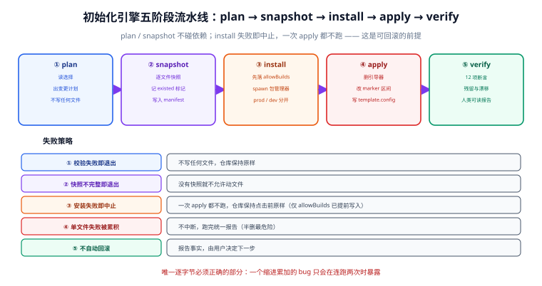
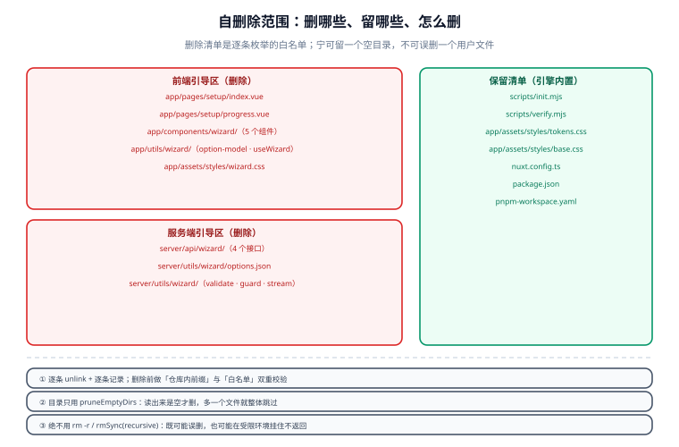

# 初始化引擎：自删除与依赖安装

引擎是整个模板里**唯一逐字节必须正确**的部分。UI 写丑了能改，接口写错了能修，但引擎一次误删就可能把用户已经写好的业务文件带走——而且这种事故往往在跑完、重启、开发半小时之后才被发现。



## 1. 五条设计原则

| 原则 | 具体含义 | 不遵守的后果 |
| --- | --- | --- |
| **零依赖** | 只用 `node:fs` / `node:path` / `node:child_process` / `node:process` | 引擎要在「还没装依赖」的仓库里跑，用第三方包会形成鸡生蛋问题 |
| **幂等** | 同一选择跑两次，产物逐字节相同；`--check` 第二次返回 0 | 重试会累积改动，无法判断仓库状态 |
| **可预演** | `--dry-run` 输出将发生的一切，不写任何文件 | 用户不敢点按钮 |
| **可回滚** | 阶段 2 的快照能完整还原到「初始化前」 | 失败即报废 |
| **只动标记区** | 配置文件只在 marker 区间内替换，手写区逐字节不动 | 用户的自定义配置被吞掉 |

::: tip 引擎为什么不能只用 CLI 参数
引擎支持两种输入：`--selection <file>`（接口写入的临时 JSON）与 `--template-config <file>`（已有快照，用于 CI 复现）。后者让「从一次初始化复现出完全相同的产物」成为可能——CI 里不需要跑网页，直接拿快照重放即可，这是 [约束 2「选择结果可复现」](../Requirement/index.md) 的落地方式。
:::

## 2. 五阶段流水线

| 阶段 | 名称 | 输入 | 输出 | 失败是否可继续 |
| --- | --- | --- | --- | --- |
| 1 | `plan` | 选择（文件 / 快照） | 变更计划（内存对象） | ❌ 校验失败即退出，**不写任何文件** |
| 2 | `snapshot` | 待修改 / 待删除文件清单 | `.init-backup/<timestamp>/` 下的完整副本 + `manifest.json` | ❌ 快照不完整即退出 |
| 3 | `apply` | 计划 + 快照 | 引导器已删除、配置文件已改写、`template.config.json` 已写入、锁文件已写 | ⚠️ 单文件失败被累积，最后统一报告 |
| 4 | `install` | 计划里的依赖清单 | `package.json` 依赖区已更新、`node_modules` 已安装、lockfile 已更新 | ⚠️ 失败保留锁与快照 |
| 5 | `verify` | 产物 | 12 项断言结果 + 人类可读报告 | ⚠️ 失败不自动回滚，由用户决定 |

::: info 为什么快照放在「仓库内」而不是 `/tmp`
`.init-backup/` 放在仓库根目录（并加进 `.gitignore`），而不是系统临时目录。理由：① 用户可能跨天排查，临时目录会被清；② 出问题时用户可以直接 `diff` 快照与现状，比任何日志都直观；③ 引擎的 `--rollback` 只需读仓库内路径，没有跨盘权限问题。
:::

## 3. 阶段 1：`plan`

计划的计算与接口共用同一份算法（`shared/wizard/plan.ts`），引擎只是换了一个输入源：

```js [scripts/init.mjs（阶段 1 节选）]
import { readFileSync } from 'node:fs';
import { resolve } from 'node:path';

function loadSelection(argv) {
  const file = argv.selection ?? argv.templateConfig;
  if (!file) {
    // 无参数时读仓库内的临时选择文件（由接口写入）
    return JSON.parse(readFileSync(resolve(root, '.wizard-selection.json'), 'utf8'));
  }
  const raw = JSON.parse(readFileSync(resolve(root, file), 'utf8'));
  // 快照模式：template.config.json 里嵌套了 selection
  return raw.selection ?? raw;
}
```

计划的四个关键字段决定了后面所有动作：

| 字段 | 谁产生 | 谁消费 |
| --- | --- | --- |
| `deleteFiles` | 引擎内置白名单 ∪ 各选项声明的 `files` | 阶段 3 |
| `deps` / `devDeps` | 各选项声明的依赖去重排序后 | 阶段 4 |
| `modules` / `cssEntries` | 各选项声明的模块与样式入口 | 阶段 3（写 marker 区间） |
| `keepFiles` | 引擎内置的保留清单 | 阶段 5（残留检查的对照物） |

::: danger 白名单必须是「枚举」而不是「模式」
`deleteFiles` 的每一项都是一个**具体的相对路径**，例如 `app/pages/setup/index.vue`。不要出现 `app/pages/setup/**` 这种模式匹配——模式匹配在有人往目录里放过一个文件时就会误伤。引擎对每一项做三件事：① 校验路径在仓库内（`resolve` 后前缀检查）；② 校验路径与 `fileWhitelist` 中的某项完全相等；③ 删除后记录进 `removed` 列表。三条缺一不可。
:::

## 4. 阶段 2：`snapshot`

```js [scripts/init.mjs（阶段 2 节选）]
import { cpSync, mkdirSync, writeFileSync } from 'node:fs';

function snapshot(files) {
  const stamp = new Date().toISOString().replace(/[:.]/g, '-');
  const dir = resolve(root, '.init-backup', stamp);
  mkdirSync(dir, { recursive: true });
  const manifest = [];

  for (const rel of files) {
    const from = resolve(root, rel);
    if (!existsSync(from)) {
      manifest.push({ path: rel, existed: false });
      continue;                                  // 文件本来就不存在：记录但不报错
    }
    const to = resolve(dir, rel);
    mkdirSync(dirname(to), { recursive: true });
    cpSync(from, to);                            // 逐文件复制，不用整目录递归
    manifest.push({ path: rel, existed: true });
  }

  writeFileSync(resolve(dir, 'manifest.json'), JSON.stringify(manifest, null, 2), 'utf8');
  return dir;
}
```

要点：

- **只快照「将被改动或删除的文件」**，不复制整个仓库。规模可控（通常 20 个文件以内），几毫秒完成。
- **文件清单包含配置文件本身**（`nuxt.config.ts`、`package.json`、`pnpm-workspace.yaml`）。
- **`existed: false` 也要记录**。回滚时要知道「这个文件当时不存在」，才能正确地再次删除它。

## 5. 阶段 3：`apply`——自删除与改写

这是全流程最关键的一步，也是唯一有破坏性的一步。



### 5.1 删除清单（引导器白名单）

```js [scripts/init.mjs（内置白名单）]
const WIZARD_FILES = [
  // 前端引导区
  'app/pages/setup/index.vue',
  'app/pages/setup/progress.vue',
  'app/components/wizard/OptionGroup.vue',
  'app/components/wizard/NuxtConfigPanel.vue',
  'app/components/wizard/ConflictHint.vue',
  'app/components/wizard/DependencyPreview.vue',
  'app/components/wizard/ProgressStream.vue',
  'app/utils/wizard/option-model.ts',
  'app/utils/wizard/useWizard.ts',
  'app/assets/styles/wizard.css',
  // 服务端引导区
  'server/api/wizard/schema.get.ts',
  'server/api/wizard/plan.post.ts',
  'server/api/wizard/init.post.ts',
  'server/api/wizard/status.get.ts',
  'server/utils/wizard/options.json',
  'server/utils/wizard/validate.ts',
  'server/utils/wizard/guard.ts',
  'server/utils/wizard/stream.ts',
];

const KEEP_FILES = [
  // 引擎自身与基线：初始化后必须还在
  'scripts/init.mjs',
  'scripts/verify.mjs',
  'app/assets/styles/tokens.css',
  'app/assets/styles/base.css',
  'nuxt.config.ts',
  'package.json',
  'pnpm-workspace.yaml',
];
```

### 5.2 删除动作：逐条、可失败、有记录

```js [scripts/init.mjs（阶段 3 删除节选）]
import { unlinkSync, rmdirSync } from 'node:fs';

function removeFiles(files, report) {
  for (const rel of files) {
    const abs = safeJoin(root, rel);            // ① 前缀校验，越界直接抛错
    if (!fileWhitelist.has(rel)) {              // ② 白名单校验
      throw new Error(`拒绝删除未在白名单内的文件：${rel}`);
    }
    try {
      unlinkSync(abs);
      report.removed.push(rel);
    }
    catch (err) {
      // ③ Windows 下文件被占用是常见情况：记录失败，不中断
      report.failed.push({ path: rel, reason: err.code });
    }
  }
  pruneEmptyDirs(files, report);                // ④ 只清理「删空了的目录」
}
```

::: danger `pruneEmptyDirs` 只能删「读起来是空的」目录

```js
function pruneEmptyDirs(files, report) {
  const dirs = [...new Set(files.map(f => dirname(f)))].sort((a, b) => b.length - a.length);
  for (const rel of dirs) {
    const abs = safeJoin(root, rel);
    try {
      if (readdirSync(abs).length === 0) {      // 目录里还有东西就跳过
        rmdirSync(abs);
        report.prunedDirs.push(rel);
      }
    }
    catch { /* 目录不存在或被占用：忽略 */ }
  }
}
```

**绝不要用 `rm(dir, { recursive: true })`**。用户完全可能在 `app/pages/setup/` 里临时放过一个草稿文件，递归删除会一起带走。上面这段只删「自己读出来是空的」目录，多一个文件就整体跳过——宁可留一个空目录，不可误删一个文件。

另外：在部分受限环境（容器、CI 沙箱）里 `rmSync(..., { recursive: true })` 可能挂住不返回。用 `unlinkSync` + `rmdirSync` 的显式组合还可以规避这一类问题。
:::

### 5.3 marker 区间改写

```js [scripts/init.mjs（改写节选）]
const SECTIONS = {
  MODULES: m => `modules: [${m.join(', ')}],`,
  CSS: entries => `css: [${entries.map(e => `'${e}'`).join(', ')}],`,
  RUNTIME: () => `runtimeConfig: {\n    public: { appName: 'Nuxt Universal' },\n  },`,
};

function rewriteSection(text, key, render, next) {
  const begin = `// >>> TEMPLATE:${key}`;
  const end = `// <<< TEMPLATE:${key}`;
  const b = text.indexOf(begin);
  const e = text.indexOf(end);
  if (b === -1 || e === -1) throw new Error(`缺少 marker 区间：${key}`);

  const head = text.slice(0, b);
  const tail = text.slice(e + end.length);
  // 关键：从「含缩进的行首」接回，避免每跑一次多一层缩进
  return `${head}${begin}\n  ${render(next)}\n  ${end}${tail}`;
}
```

::: danger 缩进累加是这类脚本最经典的 bug
从 marker 关键字位置（`text.indexOf(begin)`）而不是**行首**拼接时，`begin` 之前的缩进会被保留一次，而新内容又带一层缩进——结果就是「跑一次正常、跑两次报错」。实测症状极具迷惑性：单次执行全绿，连跑两次 `--check` 立刻报红，CI 上表现为「第一次构建就失败」。修法是上面这段：从 marker 行的行首替换，并在 `end` 之后原样接回尾部。
:::

### 5.4 覆盖首页与生成快照

```js [scripts/init.mjs（收尾节选）]
// ① 用基线首页覆盖引导期首页
writeFileSync(
  resolve(root, 'app/pages/index.vue'),
  readFileSync(resolve(root, 'scripts/templates/index.vue.tpl'), 'utf8'),
  'utf8',
);

// ② 写入选择快照（唯一事实来源的交接）
const config = {
  schemaVersion: '1.0.0',
  templateVersion: readTemplateVersion(),
  initializedAt: new Date().toISOString(),
  selection,
  plan: { deps, devDeps, modules, cssEntries },
  removed: report.removed,
  kept: KEEP_FILES,
};
writeFileSync(resolve(root, 'template.config.json'), JSON.stringify(config, null, 2), 'utf8');
```

::: tip 顺序不能反
先在内存里算好 `report.removed`，**再**写 `template.config.json`，**最后**删锁。这样 `template.config.json` 是「初始化已完成」的唯一凭证：它存在 = 引导器已经清干净了。`verify.mjs` 正是靠这个文件判断「该不该检查残留」。
:::

## 6. 阶段 4：`install`

```js [scripts/init.mjs（阶段 4 节选）]
import { spawn } from 'node:child_process';

function run(cmd, args) {
  return new Promise((resolve, reject) => {
    const child = spawn(cmd, args, { cwd: root, stdio: 'inherit', shell: false });
    child.on('close', code => code === 0 ? resolve() : reject(new Error(`${cmd} 退出码 ${code}`)));
  });
}

async function install(plan, lockfile) {
  const bin = lockfile === 'npm' ? 'npm' : 'pnpm';
  if (plan.deps.length) {
    await run(bin, lockfile === 'npm'
      ? ['install', '--save', ...plan.deps]
      : ['add', ...plan.deps]);
  }
  if (plan.devDeps.length) {
    await run(bin, lockfile === 'npm'
      ? ['install', '--save-dev', ...plan.devDeps]
      : ['add', '-D', ...plan.devDeps]);
  }
  await run(bin, ['install']);                    // 收敛 lockfile
}
```

四条纪律：

| # | 纪律 | 原因 |
| --- | --- | --- |
| 1 | `shell: false` + 参数数组 | 用户输入永不经过 shell 解析 |
| 2 | 分两次安装（prod / dev） | 一次装完无法区分依赖类型，`package.json` 会全进 `dependencies` |
| 3 | 最后一个裸 `install` | 收敛 lockfile 与 hoisting，避免「本地能跑、CI 装出来不一样」 |
| 4 | 依赖版本用 `^` 范围而非锁定小版本 | 官方补丁版本随时在动，写死小版本会让模板快速过期；复现性靠 lockfile 保证 |

::: warning 依赖安装是唯一无法「逐字节可复现」的一步
`pnpm add` 会写入当时的最新补丁版本，因此「同选择 + 同模板版本」在**不同时间**跑会有不同的 lockfile。这是接受的：约束 2 的口径是「**同一次执行**的产物确定」，而不是「跨时间的字节一致」。真正需要跨时间复现时，用 `--template-config` + 仓库里的 lockfile 一起重放。
:::

## 7. 阶段 5：`verify`

`scripts/verify.mjs` 是独立可跑的复核脚本，12 项断言：

| # | 断言 | 判据 |
| --- | --- | --- |
| 1 | `template.config.json` 存在且可解析 | JSON.parse 成功 |
| 2 | `selection` 与 `plan` 自洽 | `plan.deps` 等于各选项声明依赖的去重并集 |
| 3 | 引导器文件残留为 0 | 逐个 `existsSync(WIZARD_FILES)` 全为假 |
| 4 | 引导器目录已清空 | `app/pages/setup/`、`app/components/wizard/`、`server/api/wizard/` 均不存在 |
| 5 | `package.json` 无引导期专用依赖 | 不含 `unbuild`、`h3` 等仅在引导期出现的包 |
| 6 | marker 区间成对且被正确填充 | 四个 key 各出现两次；`MODULES` 内容与 `plan.modules` 一致 |
| 7 | 样式入口与选择一致 | `CSS` 区间内容 ⊆ `plan.cssEntries` |
| 8 | 首页已替换 | `app/pages/index.vue` 不含 `navigateTo('/setup')` |
| 9 | `nuxt.config.ts` 手写区未被改动 | 与快照中 `app:` 段落逐字节相同 |
| 10 | 锁文件已清除 | `template.init.lock` 不存在 |
| 11 | 依赖已安装 | `node_modules/<deps[0]>/package.json` 存在 |
| 12 | 类型检查可跑 | `nuxi typecheck` 退出码为 0（可选，`--fast` 时跳过） |

```shell
node scripts/verify.mjs
# 期望输出
#   PASS  1 template.config.json 解析
#   PASS  2 选择与计划自洽
#   ...
#   verify: 12/12 通过，引导器残留 0
```

## 8. CLI 用法

```shell
# ① 预演：不写任何文件，打印将发生的一切
node scripts/init.mjs --selection ./my-selection.json --dry-run

# ② 实际执行（保存计划供审计）
node scripts/init.mjs --selection ./my-selection.json --save-plan

# ③ 漂移检测：仓库现状与 template.config.json 是否一致（可当 CI 门禁）
node scripts/init.mjs --check
# 期望：OK（退出码 0）；被手工改动过则退出码 1 并指出漂移项

# ④ 从已有快照复现（CI 重放）
node scripts/init.mjs --template-config ./template.config.json

# ⑤ 回滚到最近一次快照
node scripts/init.mjs --rollback

# ⑥ 机器可读输出（供接口转发）
node scripts/init.mjs --selection ./my-selection.json --json-lines
```

| 参数 | 作用 | 副作用 |
| --- | --- | --- |
| `--dry-run` | 只打印计划 | 无 |
| `--check` | 比对磁盘与快照 | 无（只读） |
| `--save-plan` | 把计划写到 `.init-backup/<stamp>/plan.json` | 写备份目录 |
| `--json-lines` | 每行一条 JSON 事件 | 无 |
| `--template-config` | 以快照为输入 | 同正常执行 |
| `--rollback` | 恢复最近快照 | 覆盖当前文件 |

## 9. 幂等、漂移与回滚

### 9.1 幂等怎么保证

1. **改写是「区间替换」而不是「追加」**——跑两次的区间内容由选择唯一确定。
2. **多选值排序**——归一化阶段按 `options.json` 顺序排序，避免「同样的集合、不同顺序」产生不同文本。
3. **删除是幂等的**——文件不存在时记为 `existed: false`，不算失败。
4. **`template.config.json` 覆盖写**，不做合并。

### 9.2 漂移检测

```shell
node scripts/init.mjs --check
# 期望（干净仓库）：
#   OK  选择与磁盘一致（ui=element-plus, preprocessor=sass, atomic=none, render=ssr）
# 期望（有人手动删了一个依赖）：
#   DRIFT  deps: 缺少 element-plus（template.config.json 声明已选）
#   退出码 1
```

::: tip `--check` 是这套模板真正的「长期价值」
模板的价值不在初始化那一刻，而在**半年后**——当有人偷偷改了一个配置、删了一个依赖、加了一个不受控的全局样式。`--check` 把「模板约定」变成了可执行的门禁，可以直接挂进 [CI 流水线](../Deployment/index.md)。
:::

### 9.3 回滚

```shell
node scripts/init.mjs --rollback
# 期望：
#   恢复 18 个文件 / 删除 2 个新建文件 / 清理 1 个目录
#   已恢复到 .init-backup/2026-10-01T02-15-30-000Z 的状态
```

回滚的三条边界：

| 边界 | 说明 |
| --- | --- |
| **只能回到最近一次快照** | 不提供「回到任意时间点」，避免用户误选 |
| **不卸载依赖** | 只还原文件；已装进 `node_modules` 的包需要用户自己 `pnpm remove`（引擎会打印命令） |
| **不还原 lockfile 之外的副作用** | 例如用户手动执行过 `pnpm approve-builds`，这部分不在快照范围 |

## 10. 验证方式

```shell
# ① 预演两次，输出应完全一致（幂等 + 可复现）
node scripts/init.mjs --selection ./sel-a.json --dry-run > /tmp/a.txt
node scripts/init.mjs --selection ./sel-a.json --dry-run > /tmp/b.txt
diff /tmp/a.txt /tmp/b.txt   # 期望：无差异

# ② 真跑一次，然后复核
node scripts/init.mjs --selection ./sel-a.json
node scripts/verify.mjs      # 期望：12/12 通过，引导器残留 0

# ③ 再跑一次 --check（幂等）
node scripts/init.mjs --check   # 期望：OK，退出码 0

# ④ 手工制造漂移，确认 --check 报红
node -e "const p=require('./package.json');delete p.dependencies['element-plus'];require('fs').writeFileSync('package.json',JSON.stringify(p,null,2))"
node scripts/init.mjs --check   # 期望：DRIFT deps，退出码 1

# ⑤ 回滚，确认文件还原
node scripts/init.mjs --rollback
git status --short   # 期望：与初始化前一致（仅 .init-backup/ 为新增，且它应在 .gitignore 内）
```

## 易错点与最佳实践

::: danger 引擎实现里的六个坑

1. **缩进累加**（见 5.3）。判据是「连跑两次 `--check`」而不是「跑一次看起来对」。
2. **用模式匹配做删除**。任何 `**`、`*` 都不许出现在删除清单里。
3. **`rmSync(..., { recursive: true })`**。既可能误删，也可能在受限环境里挂住不返回；用 `unlinkSync` + 空目录判断。
4. **异常直接 `throw` 中断**。会留下半删状态；正确做法是累积失败、跑完、统一报告。
5. **在 `--dry-run` 里也写文件**（哪怕只写日志）。`--dry-run` 必须是纯只读，否则用户不敢信任它。
6. **用 `exec` 拼包管理器命令**。必须 `spawn(bin, [args])` 且 `shell: false`。
:::

::: tip 三条能省事的地方
1. `--json-lines` 与人类可读输出**共用同一套事件对象**，只是序列化方式不同。不要为两种输出写两套逻辑。
2. 快照目录名用 ISO 时间戳并去掉 `:` —— Windows 不允许文件名含冒号，这是本仓库在别的脚本上踩过的坑。
3. `verify.mjs` 的第 12 项（类型检查）允许被 `--fast` 跳过，因为 `nuxi typecheck` 要几十秒；CI 里跑全量，本地改配置时跑 `--fast`。
:::

## 相关页面

- [引导器服务端与安全边界](../WizardBackend/index.md)：谁调度这个引擎、怎么传参
- [技术栈矩阵与组合兼容](../StackMatrix/index.md)：`deleteFiles` 与依赖清单的来源
- [验收与上线检查](../Acceptance/index.md)：`verify.mjs` 的断言如何进入验收清单
- [质量门禁与自测](../Quality/index.md)：引擎自己的自测（含变异测试）

## 参考资料

- Node.js `fs` 同步 API：[nodejs.org/api/fs.html](https://nodejs.org/api/fs.html)
- Node.js `child_process.spawn` 与安全注意：[nodejs.org/api/child_process.html](https://nodejs.org/api/child_process.html)
- pnpm `add` / `install` 命令参考：[pnpm.io/cli/add](https://pnpm.io/cli/add)
