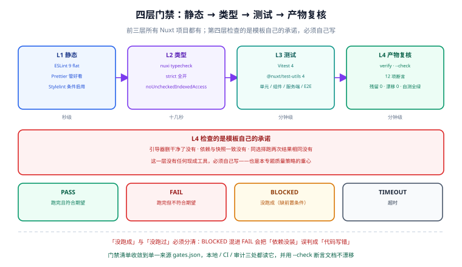

# 质量门禁与自测

模板类项目的质量问题有一个特点：**它的 bug 会以「别人项目里的 bug」的形式出现**，而作者看不到。所以这套模板的质量策略不是「多写测试」，而是**把约定变成可执行的判据**——lint 判写法、类型判接口、自测判产物、`--check` 判漂移。



## 1. 四层门禁

| 层 | 工具 | 判据 | 失败代价 |
| --- | --- | --- | --- |
| L1 静态 | ESLint 9（flat）+ Prettier + Stylelint（条件） | 退出码 0，0 error | 秒级 |
| L2 类型 | `nuxi typecheck` | 退出码 0 | 十秒级 |
| L3 测试 | Vitest 4 + `@nuxt/test-utils` 4 | 全部通过；关键路径有断言 | 分钟级 |
| L4 产物复核 | `scripts/verify.mjs` + `scripts/init.mjs --check` + 引擎自测 | 12 项断言 + 漂移 0 + 自测全绿 | 分钟级 |

::: tip 为什么 L4 是这套模板独有的
前三层是所有 Nuxt 项目都有的。L4 检查的是**模板自己的承诺**：引导器删干净了没有、依赖与快照一致没有、同选择跑两次结果相同没有。这一层没有任何现成工具，必须自己写——也是本篇的重点。
:::

## 2. L1 静态检查

### 2.1 ESLint 9 的 flat config

```js [eslint.config.mjs]
import withNuxt from './.nuxt/eslint.config.mjs';

export default withNuxt(
  {
    rules: {
      // 模板作者的偏好：模板产物要能被别人接手，风格尽量贴官方默认
      'vue/multi-word-component-names': ['error', { ignores: ['index', 'default'] }],
      '@typescript-eslint/no-explicit-any': 'warn',
    },
  },
  {
    // 引擎脚本是 Node 环境，且必须只用 node: 内置模块
    files: ['scripts/**/*.mjs'],
    rules: {
      'no-restricted-imports': ['error', {
        patterns: [{ group: ['*', '!node:*'], message: '引擎脚本必须零依赖，只允许 node: 内置模块' }],
      }],
    },
  },
);
```

::: info 为什么选 `@nuxt/eslint`
它把 Nuxt 的专属规则（自动导入、目录约定、`definePageMeta` 用法）与生成好的 flat config 一起提供，并随 Nuxt 版本更新。手工拼 `typescript-eslint` + `eslint-plugin-vue` + Nuxt 规则会快速过期。

注意 `no-restricted-imports` 那一条：它是**把「引擎零依赖」这条约定变成门禁**的写法。约定写在文档里没人记得，写成 lint 规则就跑不掉。
:::

### 2.2 Prettier 与 Stylelint

| 工具 | 何时启用 | 配置要点 |
| --- | --- | --- |
| Prettier | 始终 | 与 ESLint 分工：ESLint 管「对不对」，Prettier 管「好不好看」；用 `eslint-config-prettier` 关掉冲突规则 |
| Stylelint | 选了 `Sass` / `Less` / `Stylus` 时 | 按预处理器选对应的 config：`stylelint-config-standard-scss` / `-less`；Stylus 只有基础规则，标记为「尽力而为」 |

::: danger Stylelint 用 `stylelint-config-recommended-*` 而不是 `standard-*` 的时候要小心
`standard` 系列带大量风格规则（空行、引号、大小写），会与 Prettier 打架。正确搭配是 `stylelint-config-standard-*` + `stylelint-config-prettier`（或新版 `stylelint-config-recess-order` 关风格）。模板默认用 `standard` + Prettier 兼容层，并在 `stylelintrc` 里显式关闭与 Prettier 重叠的规则。
:::

## 3. L2 类型检查

```json [tsconfig.json]
{
  "extends": "./.nuxt/tsconfig.json",
  "compilerOptions": {
    "strict": true,
    "noUncheckedIndexedAccess": true,
    "noImplicitOverride": true
  }
}
```

| 严格度选项 | 打开后能提前发现什么 |
| --- | --- |
| `strict` | `strictNullChecks`、`noImplicitAny` 等一揽子，Nuxt 官方也推荐 |
| `noUncheckedIndexedAccess` | `arr[0]` 可能是 `undefined`——这条在 SSR 数据不全时救过很多次 |
| `noImplicitOverride` | 子类覆写方法忘写 `override` |

```shell
pnpm dlx nuxi typecheck
# 期望：0 error；首次运行会先生成 .nuxt 类型（几秒到十几秒）
```

::: warning `typecheck` 依赖 `.nuxt` 生成物
裸跑会报大片「找不到 `#imports`」。正确顺序是 `nuxt prepare`（已挂在 `postinstall`）→ `nuxi typecheck`。CI 里如果跳过了 install，就要显式加一步 `nuxi prepare`。
:::

## 4. L3 测试

### 4.1 技术栈与版本要求

| 组件 | 版本 | 关键约束 |
| --- | --- | --- |
| Vitest | 4.1.x | **`@nuxt/test-utils` 4.x 要求 Vitest ≥ 4.0**；Vitest 5 尚未发布稳定版，暂缓 |
| `@nuxt/test-utils` | 4.x | 4.0.0 起测试环境初始化从 `setupFiles` 移到 **`beforeAll`** |
| DOM 环境 | `happy-dom` ≥ 20.0.11 | 4.x 提高了 peer 下限 |

::: danger 升级到 test-utils 4 的两个必改点

1. **不能在 `describe` 顶层调用 Nuxt 组合式函数。**`useRouter()`、`useNuxtApp()` 在环境初始化前调用会抛 `[nuxt] instance unavailable`。必须移到 `beforeAll` 里：

```ts
describe('router', () => {
  let router: ReturnType<typeof useRouter>;
  beforeAll(() => {
    router = useRouter();     // ✅ 环境已就绪
  });
  it('跳转', () => { expect(router.currentRoute.value.path).toBe('/'); });
});
```

2. **mock 未显式返回的导出会抛错。**Vitest 4 起，从被 mock 的模块里取一个工厂函数没返回的导出，不再是静默 `undefined` 而是抛异常。修法是在工厂里 `...importOriginal()`。
:::

### 4.2 测试分层

| 层 | 测什么 | 工具 | 数量级 |
| --- | --- | --- | --- |
| 单元 | 纯函数（格式化、校验、令牌计算） | `vitest` | 多 |
| 组合式函数 | `useApi`、store | `vitest` + `@nuxt/test-utils/runtime` | 中 |
| 组件 | 关键交互组件（表单、列表） | `@vue/test-utils` + `@nuxt/test-utils` | 中 |
| 服务端 | `server/api/*` | `@nuxt/test-utils/e2e` + `registerEndpoint` | 少 |
| 端到端 | 初始化流程（**最关键**） | Playwright + 临时目录 | 少而精确 |

```ts [test/api.spec.ts]
import { describe, expect, it } from 'vitest';
import { registerEndpoint, mountSuspended } from '@nuxt/test-utils/runtime';

registerEndpoint('/api/health', () => ({ status: 'ok', uptime: 1 }));

describe('健康检查接口', () => {
  it('返回 ok', async () => {
    const res = await $fetch('/api/health');
    expect(res.status).toBe('ok');
  });
});
```

::: tip 端到端测试的重点不是「页面好看」
初始化流程的 E2E 只断言三件事：**进度跑到 done**、**引导器文件消失**、**首页能打开且控制台 0 error**。这三条覆盖了用户真正会遇到的失败模式；把「按钮是不是蓝色」也做成 E2E 只会让测试变脆。
:::

## 5. L4 引擎自测（本篇重点）

引擎是零依赖脚本，**不能用 Vitest**（那会引入 devDep，违反「还没装依赖就要能跑」）。所以自测也是一份零依赖 Node 脚本。

### 5.1 断言分组

| 组 | 断言数（参考） | 内容 |
| --- | --- | --- |
| A 用法与元数据 | ~20 | `--help` 输出、参数解析、未知参数报错 |
| B 计划正确性 | ~60 | 每种选择产出的 `deleteFiles` / `deps` / `modules` 与预期一致 |
| C 幂等 | ~10 | 同选择跑两次产物逐字节相同 |
| D 手写区保护 | ~12 | 手写区内容在任何组合下都不被改动 |
| E marker 与 import | ~15 | marker 缺失 / 重复 / 缩进累加三类情形 |
| F 门禁行为 | ~15 | `--check` 在干净仓库返回 0、在漂移仓库返回 1 |
| G 全矩阵 | ~176 | 176 种有效组合逐个 `--dry-run`，无异常且计划非空 |
| H 变异性 | ~10 | 见 5.3 |

### 5.2 沙箱的三条约定

自测要在临时目录里反复创建工程、跑引擎、复核产物。在受限环境（容器、CI 沙箱、部分安全策略）下有三条实测得出的约定：

| 约定 | 原因 |
| --- | --- |
| **固定沙箱根**（如 `%TEMP%/nuxt-init-selftest`）+ 每用例一个子目录 | 用例数量几十个，占用有界；避免每次 `mkdtemp` 后无法清理 |
| **全程不删除目录** | 部分环境下 `rmSync(dir, { recursive: true })` 与 `rmdirSync()` 会**挂住不返回**（进程不退出），而 `unlinkSync` 删文件正常。用「覆盖写」代替「删了重建」 |
| **自测进程内驱动引擎，不拉起子进程** | 部分环境下 `spawnSync` / `execFileSync` 一律返回 `EBUSY`。引擎因此写成 `runCli(argv)` 返回退出码 + `isDirectRun` 守卫，自测 `import` 后直接调用 |

```js [scripts/init.mjs（可测性设计）]
import { fileURLToPath } from 'node:url';
import process from 'node:process';

/** 纯函数式入口：返回退出码，不自己退出进程。 */
export async function runCli(argv = process.argv.slice(2), opts = {}) {
  try {
    const state = parseArgs(argv);
    const plan = await buildPlan(state);
    if (state.dryRun) { printPlan(plan); return 0; }
    return await execute(plan, opts);
  }
  catch (err) {
    process.stderr.write(`[init] 失败：${err.message}\n`);
    return 1;
  }
}

/** 只有被直接执行时才跑，被 import 时不退出进程。 */
const isDirectRun = process.argv[1]
  && fileURLToPath(import.meta.url) === process.argv[1];

if (isDirectRun) {
  const code = await runCli();
  process.exitCode = code;                 // 用 exitCode 而不是 process.exit()，
}                                          // 让 stdout/stderr 有机会 flush
```

::: tip `runCli` + `isDirectRun` 不只是为了自测
在这套形态下，引擎可以同时被三种方式使用：① 命令行（`isDirectRun` 命中）；② 被 `verify.mjs` / `matrix.mjs` import；③ 被接口通过 `spawn` 调用。一份实现三种入口，不需要为测试另写一份逻辑。
:::

### 5.3 门禁必须是变异测试

**「跑一遍通过」不能证明门禁有效，只能证明它没崩。** 每一条关键断言都要配一个变异实验：把被测对象改坏一格，断言必须变红。

| 变异 | 预期结果 |
| --- | --- |
| 把 `personalizeOf` 之类派生函数改成恒真 | 自测失败数从 0 变成十几个 |
| 从 `deleteFiles` 里删掉一项 | 残留检查（第 3 项断言）报红 |
| 往手写区插一行注释 | 手写区保护（第 9 项断言）报红 |
| 把 `--check` 的退出码改成恒 0 | 门禁行为组报红 |
| 缩进累加修复回退 | 幂等组报红（**只有连跑两次才暴露**） |
| 把 `expectRc` 期望值改错 | 运行器自测报红 |

::: danger 校验器崩了比校验失败危险
如果 `--check` 的实现里有一处 `matrix[sel.ui].deps` 这样的取值，那么当 `sel.ui` 是非法值时会抛 `TypeError` 而不是返回「不合法」。抛异常会让调用方（CI、接口）看到 500 而不是「校验不通过」，进而被误判成环境问题。**所有校验入口都必须先做形状断言，再取值**，并对缺字段 / 非法符号给出带位置的 FAIL。
:::

## 6. 门禁清单的单一来源

门禁一多，就会出现「文档写一套、CI 跑一套、本地跑第三套」的漂移。解法是让清单**只有一份**，三处都读它：

```json [scripts/gates.json]
{
  "gates": [
    {
      "id": "lint",
      "cmd": "pnpm lint",
      "doc": true,
      "why": "静态检查：写法与约定",
      "owner": "frontend",
      "timeoutSec": 180,
      "weight": 1
    },
    {
      "id": "typecheck",
      "cmd": "pnpm dlx nuxi typecheck",
      "doc": true,
      "why": "类型检查：接口与数据形状",
      "owner": "frontend",
      "timeoutSec": 300,
      "weight": 2
    },
    {
      "id": "verify",
      "cmd": "node scripts/verify.mjs",
      "doc": true,
      "why": "产物复核：引导器已删除、依赖与快照一致",
      "owner": "template",
      "timeoutSec": 120,
      "weight": 3
    },
    {
      "id": "drift",
      "cmd": "node scripts/init.mjs --check",
      "doc": true,
      "why": "漂移检测：仓库现状与 template.config.json 一致",
      "owner": "template",
      "timeoutSec": 60,
      "weight": 3
    },
    {
      "id": "engine-selftest",
      "cmd": "node scripts/selftest.mjs",
      "doc": true,
      "why": "引擎自测：含变异测试",
      "owner": "template",
      "timeoutSec": 300,
      "weight": 3
    }
  ]
}
```

运行器 `scripts/run-gates.mjs` 把结局拆成四种状态：

| 状态 | 含义 | 退出码 |
| --- | --- | --- |
| `PASS` | 跑完且符合期望 | 0 |
| `FAIL` | 跑完但不符合期望 | 1 |
| `BLOCKED` | **没跑成**（缺前置条件，如未 `pnpm install`） | 1 |
| `TIMEOUT` | 超时 | 1 |

::: info 为什么必须区分「没跑成」与「没跑过」
把 `BLOCKED` 混进 `FAIL`，会让「依赖没装」看起来像「代码写错了」；混进 `PASS`，则是给门禁开后门。四种状态是这套清单能被信任的前提。
:::

## 7. 与 CI 的对应

| 门禁 | CI 中的位置 | 说明 |
| --- | --- | --- |
| `lint` | 第一个 job | 秒级反馈，前置 |
| `typecheck` | 同一个 job 之后 | 十几秒 |
| `test` | 独立 job | 与 lint 并行 |
| `verify` + `drift` | 构建之后 | 依赖产物 |
| `engine-selftest` | 独立 job | 不需要装依赖（零依赖脚本） |
| E2E 初始化 | 最后一个 job | 真跑一次初始化 + 冒烟 |

完整的流水线写法见 [部署与上线](../Deployment/index.md)。

## 8. 验证方式

```shell
# L1
pnpm lint                    # 期望：0 error
pnpm lint:style              # 选了预处理器才有：0 error

# L2
pnpm dlx nuxi typecheck      # 期望：0 error

# L3
pnpm test                    # 期望：全部通过

# L4
node scripts/selftest.mjs    # 期望：自测全绿（含变异组）
node scripts/verify.mjs      # 期望：12/12 通过，引导器残留 0
node scripts/init.mjs --check # 期望：OK，退出码 0

# 门禁清单
node scripts/run-gates.mjs --list   # 打印清单：判据 / 责任人 / 权重 / 前置条件
node scripts/run-gates.mjs          # 期望：全部 PASS（缺前置则为 BLOCKED 并返回 1）
```

## 易错点与最佳实践

::: danger 六个会让门禁退化成装饰的写法

1. **`continue-on-error`**。门禁失败必须让流水线红。
2. **只断言「没崩」**。没有期望值的门禁等于日志。
3. **不给变异测试**。改坏了不报红的门禁，比没有门禁更危险（它给人虚假的安全感）。
4. **把自测写成「生成后 `--check` 通过」**。这个检查**必然成立**（生成物当然自洽），它证明不了 `--check` 能抓出漂移。
5. **校验器对非法输入抛异常**。见 5.3 的 danger 块。
6. **门禁命令在文档、CI、本地各写一份**。收敛到 `gates.json`，并用 `doc: true` + `--check` 断言「文档里真的有这条命令」。
:::

::: tip 三条经验
1. 自测的断言数不是目标，**能拦住回归的断言数**才是。275 项断言里如果有 200 项是「函数返回值等于常量」，它拦不住任何东西。
2. 变异实验要写在自测里自动跑（改坏 → 期望报红 → 复原），不要靠人手动试。
3. 引擎的每条错误信息都带上**文件 + 位置 + 期望**，否则用户拿着「FAIL」只能来问你。
:::

## 相关页面

- [初始化引擎](../InitEngine/index.md)：被自测的对象本身
- [验收与上线检查](../Acceptance/index.md)：`verify.mjs` 的断言如何进入验收清单
- [部署与上线](../Deployment/index.md)：这些门禁在 CI 里的位置
- [后端通用模板 · 统一门禁](../../BackendTemplate/Gates/index.md)：同一套「清单单一来源」思路在后端项目里的落地

## 参考资料

- Nuxt 测试指南：[nuxt.com/docs/getting-started/testing](https://nuxt.com/docs/getting-started/testing)
- `@nuxt/test-utils` 4.0 迁移说明：[github.com/nuxt/test-utils/releases](https://github.com/nuxt/test-utils/releases)
- Vitest 4 文档：[vitest.dev](https://vitest.dev/)
- Nuxt ESLint 模块与 flat config：[eslint.nuxt.com](https://eslint.nuxt.com/)
- Stylelint 配置标准：[stylelint.io/user-guide/get-started](https://stylelint.io/user-guide/get-started)
