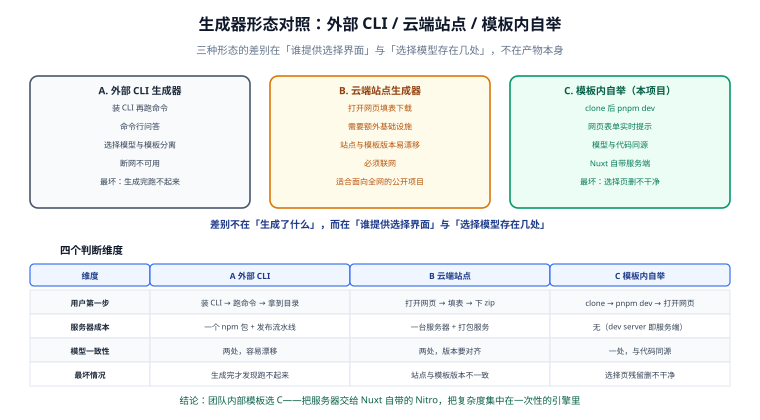

# 需求与方案定位

本篇是整条链路的第一步：先把**要解决的问题**和**不能用什么手段解决**定下来，后面九步才有判据。跳过这一步直接写代码，最典型的下场是——选择页越做越厚，最后没人敢删。

::: tip 一句话定位
这个模板要交付的不是「一套配置好的 Nuxt 工程」，而是「**一个能生产 Nuxt 工程的工程**」。它的产物是干净的项目，它自己必须能消失。
:::

## 1. 需求从哪里来

三个真实痛点，决定了模板的形态：

| # | 痛点 | 现状 | 后果 |
| --- | --- | --- | --- |
| 1 | **模板总是「过度预装」** | 官方 starter 只给最小骨架，团队自研模板则习惯把 Element Plus、UnoCSS、Pinia、i18n 全塞进去 | 用不上的依赖进了 `package.json`，升级时要跟着一起升；删掉又怕删错 |
| 2 | **团队技术栈不统一，模板要分裂成 N 份** | 后台组要 Ant Design Vue，C 端要 Nuxt UI，活动页只要纯 CSS | 维护 N 个分支，公共修复要 cherry-pick N 次 |
| 3 | **选型决策没有留痕** | 新人问「为什么这里有 sass」，没人答得上来 | 半年后没人敢动配置 |

对应的三条需求：

1. **默认什么都不装**——初始 `dependencies` 只有 `nuxt`，页面用纯 CSS 渲染。
2. **一次选择覆盖所有分支**——UI 框架 / 预处理器 / 原子化三维组合在同一个模板里表达。
3. **选择必须留在仓库里**——初始化生成 `template.config.json`，把「谁、什么时候、选了什么、为什么」变成可 diff 的文件。

## 2. 三种形态对照



| 维度 | A. 外部 CLI 生成器 | B. 云端站点（真·Initializr） | C. 模板内自举（本项目） |
| --- | --- | --- | --- |
| 用户第一步 | 装 CLI，跑 `create-xxx` | 打开 start.xxx.io，填表，下 zip | `git clone` 后 `pnpm dev` |
| 选择界面 | 命令行问答 | 网页 | 网页（**由模板自己提供**） |
| 需要额外基础设施 | 一个 npm 包 + 发布流水线 | 一台服务器 + 前端站点 + 打包服务 | **无**，Nuxt 的 dev server 就是服务端 |
| 选择模型与模板代码的关系 | 两处，容易漂移 | 两处 | **一处**，同一个仓库 |
| 断网可用 | 需要能装 npm 包 | 不行 | 可以（依赖缓存齐全时） |
| 最坏情况下的坑 | 生成完才发现跑不起来 | 站点与模板版本不一致 | 选择页删不干净，残留在产物里 |
| 适合谁 | 公开发布、要给外部人用 | 生态官方、面向全网 | 团队内部模板仓库 |

::: info 为什么不做 B
B 形态需要额外维护一个站点：站点要能拿到模板的最新版本、要在服务端渲染并打包 zip、要处理版本矩阵。对一个**团队内部模板**来说，这份基础设施的维护成本远高于收益。C 形态把服务器交给 Nuxt 自带的 Nitro——`pnpm dev` 一跑，一个只能被本机访问的「私有 Initializr」就起来了。
:::

## 3. 为什么要自删

这是本方案**唯一一个真正的技术难点**，也是最容易做脏的地方。

选择页要活到用户点击「初始化项目」为止，但它**不是项目的一部分**：

- 它带 `wizard.css`、`components/wizard/*`、`server/api/wizard/*`——这些代码在初始化后是彻底的死代码。
- 它的首页占着 `app/pages/index.vue`——初始化后这个位置应该是业务首页。
- 它包含「任意文件写入 + 依赖安装」的能力——**留在正式项目里就是一个后门**。

所以初始化引擎必须做到三件事，缺一不可：

| 必须 | 判据 | 反面案例 |
| --- | --- | --- |
| **删干净** | 初始化后全仓 grep 不到 `wizard` 相关路径；`app/pages/setup/` 不存在 | 只删了页面，`server/api/wizard` 还在，接口仍可被调用 |
| **不误删** | 删除范围是**白名单**，逐条列举而非通配 | `rm -rf app/components` 把用户已经写在里面的业务组件一起删了 |
| **有痕迹** | 删除发生在 `template.config.json` 生成**之后**，且写入 `removed` 清单 | 删完了才生成配置，用户不知道删了什么 |

::: danger 三个必须避开的写法

1. **不要用目录通配删除。**`fs.rm(dir, { recursive: true })` 看着简洁，但如果用户在主目录里已经加了文件（很常见：初始化前先手动放一个 favicon），通配删除会一起带走。正确做法是在 `options.json` 里为每个选项声明**文件清单**，引擎逐条 `unlink` + 逐条记录。
2. **不要在页面里直接执行删除。**`server/api/wizard/init.post.ts` 只负责校验与调度，真正的文件操作全部在 `scripts/init.mjs` 里。原因是引擎必须能脱离 HTTP 单独跑（本地调试、CI 复现、用户手动重跑），而接口做不到这一点。
3. **不要假设删除一定成功。**Windows 上文件被编辑器或杀毒软件占用时 `unlink` 会失败。引擎必须把失败累积成报告，而不是在中途 `throw` 掉——**半删状态比不删更危险**，因为它无法被 `--check` 判断。
:::

## 4. 三条硬约束

这三条是后续每一页都要回看的验收红线：

| 约束 | 具体含义 | 验收方式 |
| --- | --- | --- |
| **约束 1：引导期可独立运行** | `pnpm install && pnpm dev` 在**未初始化**状态下必须能跑起来，且不出现样式缺失、 hydration 报错 | 引导期冒烟脚本：打开 `/setup`，控制台 0 error |
| **约束 2：选择结果可复现** | 同一份选择在同一模板版本上，跑两次得到**逐字节相同**的产物 | `--dry-run` 输出 diff 为空；`verify.mjs` 复核 `template.config.json` 与磁盘一致 |
| **约束 3：产物里没有引导器** | 初始化后，`wizard` 相关文件数为 0，且 `package.json` 里没有引导期专用依赖 | `verify.mjs` 的「残留检查」12 项 |

::: warning 约束 2 为什么必须逐字节
「跑两次结果差不多」是不够的。构建期配置（`nuxt.config.ts`）里多一行少一行不会立刻报错，但会在半年后以「为什么这台机器上样式加载顺序不对」的形式出现。逐字节相同意味着：**选择模型 + 模板版本 = 唯一产物**，没有隐式环境依赖。
:::

## 5. 选择维度与优先级

不是所有东西都值得做成可选项。判据是**成本/收益比**：改一行配置就能切、且切了确实有区别的，才进选择器。

| 维度 | 可插拔价值 | 实现成本 | 决定 |
| --- | --- | --- | --- |
| UI 组件库 | **高**——团队差异最大，替换代价最高 | 中（依赖 + 自动导入配置 + 样式入口） | ✅ 做成选项 |
| CSS 预处理器 | **高**——影响每一个 `.vue` 文件的写法 | 中（依赖 + 组件内语言标记 + lint） | ✅ 做成选项 |
| 原子化框架 | **高**——影响模板写法与构建产物 | 中（依赖 + 配置 + 与预处理器共存规则） | ✅ 做成选项 |
| 渲染模式（SSR/SPA/SSG） | 高——决定部署形态 | **低**（改 `ssr` 与 `routeRules`） | ✅ 做成选项，但**不需装依赖** |
| 状态管理（Pinia） | 中——多数项目都要 | 低（一个模块） | ✅ 做成开关 |
| 测试栈 | 中 | 低 | ✅ 做成开关 |
| i18n / 图标 / 图片优化 | 中——按需 | 低 | ✅ 做成开关 |
| 包管理器 | 低——影响 lockfile 与脚本 | **高**（要处理 workspace 差异） | ⚠️ 只在 pnpm/npm 间切换，选项里限制 |
| Lint 规则集 | 低——团队规范统一 | 低 | ❌ 固定，不做选项（避免「同一仓库不同规范」） |
| 目录结构 | 低——Nuxt 4 已约定 `app/` | 高 | ❌ 固定 |
| 数据请求层 | 低——`$fetch` 封装是共识 | 低 | ❌ 固定为基线能力，见 [应用基线](../AppBaseline/index.md) |

::: tip 一条经验
**「不做的选项」比「做的选项」更需要写下来。** 每加一个选项，组合数乘 2 或 3，自测矩阵跟着膨胀。本模板把选项数控制在 6 个以内的原因见 [技术栈矩阵](../StackMatrix/index.md) 的组合数计算。
:::

## 6. 明确不做的事

| 不做 | 原因 |
| --- | --- |
| 不做模板的**多版本并存**（v4/v5 双目录） | 引导期只需要面向当前稳定版；跨大版本升级是独立问题，见 [Nuxt 专题的版本约定](../../../../docs/Frontend/Frame/Nuxt/index.md) |
| 不提供**业务模块脚手架**（增删改查生成器） | 那是 CRUD 生成器，与「技术栈选择」是两件事；混在一起会让选择模型膨胀 |
| 不做**远程模板源**（从 GitHub 拉子模板） | 引入网络依赖与版本一致性风险，违背「选择结果可复现」约束 |
| 不做**后端服务/数据库** | 模板边界止于前端工程；需要后端请用 [后端通用模板](../../BackendTemplate/index.md) |
| 不保留**选择页的「回退」入口** | 初始化是一次性事件。要换技术栈请重新初始化（引擎支持 `--dry-run` 预演），不做热切换 |
| 不做**自动初始化**（无人值守跳过选择） | 违背「选择必须留痕」的初衷；CI 场景用 `--template-config` 传入已有快照，见 [初始化引擎](../InitEngine/index.md) |

## 7. 验收标准

| 维度 | 目标 | 验收方式 |
| --- | --- | --- |
| 广度 | 覆盖 UI 框架 / 预处理器 / 原子化 / 渲染模式 / 模块 / 工程六类配置 | 选择页每个控件都有对应实现，见 [技术栈矩阵](../StackMatrix/index.md) |
| 深度 | 每个组合的冲突与冗余都有规则，不是「让用户自己踩」 | 组合兼容矩阵 + 引导页提交前校验 |
| 完整性 | 从 clone 到部署上线的完整链路 | 本专题 10 个步骤 + [部署](../Deployment/index.md) 与 [验收](../Acceptance/index.md) |
| 可验证 | 每一步都有可执行的验证命令 | 每页「验证方式」小节 + 引擎自测 |
| 干净 | 初始化后引导器零残留 | `pnpm verify` 的 12 项断言 |
| 可复现 | 同选择 + 同版本 = 同产物 | `--dry-run` 幂等 + `--check` 漂移检测 |

## 8. 验证方式

本篇没有代码，验证放在「约束是否被后续步骤兑现」：

```shell
# 引导期冒烟（约束 1）：未初始化状态下能跑起来
pnpm install && pnpm dev
# 期望：控制台出现 http://localhost:3000/setup，页面无样式缺失、浏览器控制台 0 error

# 产物干净（约束 3）：初始化后跑一次
pnpm verify
# 期望：verify: 12/12 通过；引导器残留 0
```

## 相关页面

- [零依赖引导期骨架](../Bootstrap/index.md)：把「默认什么都不装」落成具体目录与配置
- [引导页：信息架构与选择模型](../WizardFrontend/index.md)：选择维度如何变成一张表单
- [初始化引擎](../InitEngine/index.md)：自删范围与五阶段流水线
- [后端通用模板 · 技术栈可插拔](../../BackendTemplate/StackSelect/index.md)：另一条「可插拔」路线的完整论证

## 参考资料

- Spring Initializr 的形态与产物：[start.spring.io](https://start.spring.io/)
- Nuxt 官方 starter（最小骨架的基线）：[github.com/nuxt/starter](https://github.com/nuxt/starter)
- Nuxt 项目结构约定（`app/` 与 `server/` 分离）：[nuxt.com/docs/guide/directory-structure](https://nuxt.com/docs/guide/directory-structure/app)
