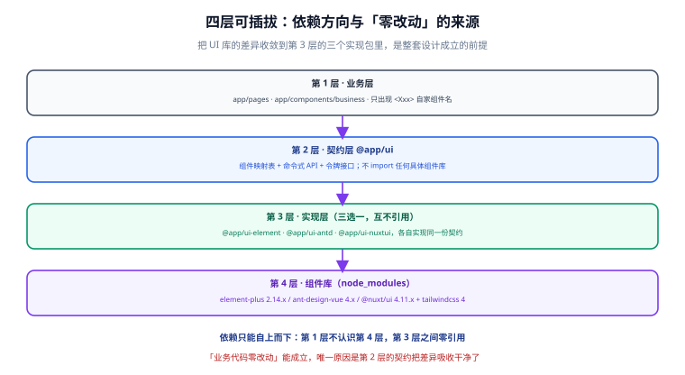

# 需求与可插拔边界

「让 UI 框架随意选择」这句话本身没有难度，难的是**说清楚哪些能换、哪些不能换**。如果这一点含糊，后面会得到两种典型结局：要么过度设计（给不可能更换的东西也加一层抽象），要么自欺欺人（文档说能换，实际换的时候业务代码全红）。

本页先把边界划出来，后面六步都建立在这张边界表上。

## 一、需求从哪来

「UI 可插拔」不是技术炫技，它对应三种真实处境：

| 处境 | 具体表现 | 不做会怎样 |
| --- | --- | --- |
| 交付型团队 | 同一套业务交付给多个客户，各客户的 UI 规范不同 | 每接一个客户 fork 一次代码，半年后没人敢合并 |
| 团队技术偏好不一 | 中后台团队习惯 Element Plus，内容团队偏好 Nuxt UI | 组件库选择变成一次「不可逆决策」，谁都不敢拍板 |
| 组件库生命周期风险 | 组件库停维、或下一个大版本带来破坏性升级 | 迁移成本被放大到「重写前端」的量级 |

::: warning 说明
需求成立的**前提**是「同一套业务要落到多种 UI 形态」。如果你的项目是单一产品、UI 规范已经定死、也没有迁移计划，那么加适配层是纯粹的额外成本——**这种场景请直接用组件库**，本模板会显得过度设计。
:::

## 二、目标与非目标

| 能力 | 验收表现 |
| --- | --- |
| 真可换 | 换 UI 库只需改一处配置 + 重跑脚本，**业务代码零改动** |
| 依赖单向 | 业务层不 import 任何组件库；实现层之间零引用 |
| 换得安全 | 实验性模块、能力降级都必须**显式接受**，不能悄悄生效 |
| 可校验 | `--check` 在不一致时非 0 退出，能直接当 CI 门禁 |
| 幂等 | 同一条命令跑两遍，`git status` 干净 |
| 零依赖 | 切换脚本只用 Node 内置模块（`node:fs` / `node:path`），不需要额外安装依赖 |
| 自证 | 有一份可运行的回归自测，覆盖全矩阵与边界行为（详见[第 6 步](../Testing/index.md)） |

**非目标**（明确不做，避免范围膨胀）：

1. **不做运行时切换。** 同一份产物里带多套组件库，会让体积翻倍、样式互相打架，且类型安全彻底失效。本模板只支持**构建时切换**。
2. **不统一数据请求层。** `useFetch` 封装、错误归一、鉴权刷新与组件库正交，本模板不涉及，见 [Nuxt 数据获取](../../../../docs/Frontend/Frame/Nuxt/DataFetching/index.md)。
3. **不追求「零抽象成本」。** 适配层是要写代码的，本模板的立场是：**用一次性的适配成本，换掉每次升级都要付的绑定成本。**

## 三、可插拔性分级

最容易做错的一步，是把所有维度都当成「可插拔」。实际上四个维度的可插拔性差异很大：

| 维度 | 可插拔性 | 依据 |
| --- | --- | --- |
| **组件库** | **高** | 业务侧真正需要的只是「按钮、表格、弹窗、提示」，差异可以被一层薄契约吸收 |
| **设计令牌** | **高** | 接口极窄：颜色、圆角、间距、字号。映射到各库变量是一张静态表 |
| **渲染模式** | **中** | SSR 与 SSG 可以切换，但 SSG 会**丢掉按请求个性化的能力**——这是能力降级，必须显式接受 |
| **数据请求层** | **低（不改）** | 与组件库正交；换库不该影响数据流，本模板不动它 |

::: tip 为什么组件库能做到「高」，而后端的 ORM 只能做到「中」
对照[后端通用模板 · 技术栈可插拔](../../BackendTemplate/StackSelect/index.md)的结论：那里 ORM 维度的可插拔性只有「中」，因为**换 ORM 不是加依赖，是改代码**（实体注解、查询构造、分页模型全都要动）。

前端 UI 库不同：业务侧对 UI 的需求集中在「语义」层面（我要一个主按钮、一张可分页的表格），而组件库之间在这些语义上高度同构。差异集中在**属性名与插槽形态**上，正好可以放进一张映射表。所以前端 UI 层可以做到「高」——但前提是**不要在契约里暴露某一家的私有结构**，见下面的第 1 条原则。
:::

## 四、换不了的部分

分级为「高」不代表没有例外。以下三类东西**不能**通过契约统一，模板的态度是承认并围起来：

| 换不了的东西 | 例子 | 处置方式 |
| --- | --- | --- |
| 组件库的独有能力 | Ant Design Vue 的高级表格、Nuxt UI 的 `CommandPalette`、Element Plus 的 `ElTree` 高级用法 | 开**逃生口**：允许业务在明确标注的页面里直接 import，并登记到「能力清单」 |
| 组件的交互模型差异 | 表单校验：Element 的 `rules` 与 Ant 的 `rules` 在触发时机、异步校验写法上不同 | 契约只承诺**共同子集**（必填/长度/正则）；复杂校验下沉到业务自己的校验函数 |
| 视觉细节 | 动效时长、阴影层级、默认间距 | 不做像素级对齐；令牌层保证**主色、圆角、字号**一致即可 |

::: danger 三种把「可插拔」做假的方式
1. **在契约里透传某一家私有 props。** 例如 `<XTable :columns="elTableColumns">`——一旦这么做，其他实现根本没法满足契约，`@app/ui-antd` 只能做「假装实现」。
2. **用运行时判断掩盖差异。** 在业务里写 `if (uiKey === 'antd') { ... }`，等于把绑定从 import 搬到了业务逻辑里，换库时照样要改。
3. **默认自动降级。** 检测到模块是 rc 版本就自动放行、日志里提一句。**日志没人看**，而这一类降级影响的是全站视觉与交互一致性。
:::

## 五、三条设计原则

后面所有实现细节，都从这三条推出来：

1. **契约的措辞来自业务，不来自框架。**
   `<XTable>` 的 props 是 `rows` / `columns` / `loading`，不是某个库的 `dataSource` / `columns` / `spinning`。判断标准很简单：把契约读给一个没用过任何组件库的人听，他能不能理解。

2. **差异必须可枚举。**
   每个实现支持哪些契约项、哪些是「共同子集」、哪些走逃生口，必须落成一张**能力清单**，并由门禁检查（缺一个实现就构建不过）。差异一旦只能靠记忆维持，三个月后就会失效。

3. **降级必须是人的决定，且要留下痕迹。**
   实验性模块（如 Vuetify 的 rc 版模块）、SSG 下的个性化能力缺失——脚本默认拒绝，必须显式加参数接受，并且**把降级结果写进生成物**，让下一个人一眼看得到。

## 六、验收清单

模板「做完了」的判据如下，第 6、7 步会逐条验证：

| # | 验收项 | 判据 |
| --- | --- | --- |
| 1 | 四个实现层都存在且接口一致 | 契约测试对四个实现跑同一组用例，全绿 |
| 2 | 换库不动业务 | 换库前后 `app/pages/` 下文件哈希不变 |
| 3 | 换库不动手写样式 | `app/assets/styles/tokens.css` 哈希不变 |
| 4 | 切换可重复 | 同一条命令跑两遍，生成物字节不变 |
| 5 | 漂移可发现 | 手改生成物后 `--check` 非 0 退出 |
| 6 | 降级被拦截 | 未加 `--allow-*` 时脚本拒绝执行且不写文件 |
| 7 | 全矩阵自洽 | 4 个库 × 2 种渲染模式 = 8 种组合全部可生成并通过 `--check` |
| 8 | 部署可复现 | 按文档从零构建，产出可访问的页面 |

## 七、下一步

边界明确之后，第 1 步先解决「工程怎么长」的问题——目录结构、TypeScript 约定、环境变量与脚本入口，这些决定了后面适配层能放在哪里。

- [第 1 步：脚手架与工程规约](../Scaffold/index.md)

## 参考资料

- [Nuxt 4 目录结构约定](https://nuxt.com/docs/4.x/guide/directory-structure/app)
- [后端通用模板 · 技术栈可插拔](../../BackendTemplate/StackSelect/index.md)：同一套「可插拔 + 选择器脚本」方法论的后端版本
- [Vue3 模板 · 组件库集成](../../Vue3Template/ComponentLibrary/index.md)：单库场景下更轻的做法
