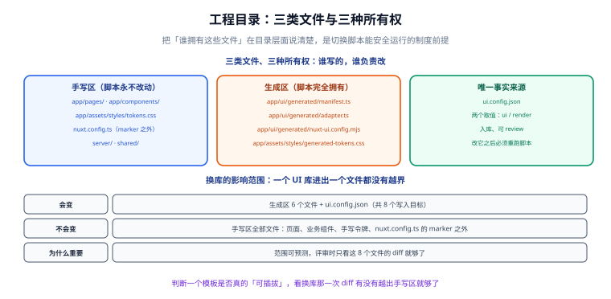

# 第 1 步：脚手架与工程规约

适配层能放在哪里、生成物往哪写、谁有权改哪些文件——这些先定下来，后面五步才有地方落。本步的产出是**一个能跑起来的空工程 + 三条目录纪律**。



## 一、创建项目

```shell
pnpm dlx nuxi@latest init nuxt-universal --packageManager pnpm --gitInit
cd nuxt-universal
pnpm install
```

预期结果：命令结束后目录里出现 `nuxt.config.ts`、`app/`、`package.json`，`pnpm dev` 可启动。

::: info 版本基线
本模板以 **Nuxt 4.5.x** 为准（2026-08-05 发布的 4.5.2 为当前稳定版）。Nuxt 4 相对 Nuxt 3 最影响目录约定的变化是：**前端代码收进 `app/`**（`app/pages`、`app/components`、`app/composables`、`app/layouts`），服务端代码留在根级 `server/`，前后端共享代码放 `shared/`。

Nuxt 3 已于 **2026-07-31 EOL**，新项目不要再从 Nuxt 3 起步。
:::

## 二、目录结构

本模板最终的目录形态如下。注意 `app/` 下多了三个不属于框架约定的目录：`components/x/`、`assets/styles/`、`ui/generated/`。

```text
nuxt-universal/
├─ app/                              # 前端代码（Nuxt 4 起收拢到这里）
│  ├─ app.vue
│  ├─ assets/
│  │  └─ styles/
│  │     ├─ tokens.css               # 手写：品牌令牌 + 语义令牌
│  │     └─ generated-tokens.css     # 生成：语义令牌 → 组件库变量
│  ├─ components/
│  │  ├─ x/                          # 契约组件：XButton / XTable / XModal…
│  │  └─ business/                   # 业务组件：只组合契约组件
│  ├─ composables/                   # useUi() / useFeedback() 等
│  ├─ pages/                         # 页面：只写契约组件名
│  └─ ui/
│     └─ generated/                  # 生成：manifest / adapter / nuxt-ui.config.mjs
├─ server/                           # Nitro 服务端代码（api / middleware / utils）
├─ shared/                           # 前后端共享的类型与常量
├─ scripts/
│  └─ ui-select.mjs                  # 切换器脚本（零依赖，见第 5 步）
├─ ui.config.json                    # 唯一事实来源（入库）
├─ nuxt.config.ts                    # 含 marker 区间
└─ package.json
```

## 三、三条目录纪律

这三条是整套设计的地基，后面所有「可校验」的性质都从它们推出来：

| 区域 | 谁拥有 | 纪律 |
| --- | --- | --- |
| **手写区** | 人 | 脚本**永不改动**。包括 `app/pages/`、`app/components/`、`server/`、`shared/`、`app/assets/styles/tokens.css`，以及 `nuxt.config.ts` 的 marker 区间之外 |
| **生成区** | 脚本 | 人**不直接改**。包括 `app/ui/generated/` 三个文件、`app/assets/styles/generated-tokens.css`、`UI.md` |
| **事实来源** | 人 | 只有 `ui.config.json` 一个。脚本从它推导生成区，`--check` 也从它推导期望值 |

::: danger 违反这三条的三种典型后果
1. **手改生成区。** 下次跑脚本会被覆盖，改动白做；`--check` 会报红，但报红时你已经在别处排查了半天。
2. **把取值写进生成区再手改生成区。** 事实来源出现两份，`--check` 永远报红——正确做法是改 `ui.config.json` 再重跑脚本。
3. **在业务代码里 `import { ElButton } from 'element-plus'`。** 这是最隐蔽的一条：当时能跑，换库时才发现漏。第 6 步会用 lint 规则把它变成构建失败。
:::

## 四、`nuxt.config.ts`

```typescript [nuxt.config.ts]
// 手写区域：本文件除 marker 区间外都由人维护，脚本永不改动。
import { uiModules, uiCss, uiBuild, uiNitroPreset, uiRouteRules, uiRuntimeConfigPublic }
  from './app/ui/generated/nuxt-ui.config.mjs'

// 与 UI 实现层无关的模块放在手写区；marker 区间只负责把 uiModules 合并进来。
const baseModules = ['@nuxt/eslint', '@pinia/nuxt', '@vueuse/nuxt']

export default defineNuxtConfig({
  compatibilityDate: '2026-09-01',
  future: { compatibilityVersion: 4 },

  // ui:modules:begin
  modules: [...baseModules, ...uiModules],
  // ui:modules:end

  css: [...uiCss],
  build: uiBuild,
  routeRules: uiRouteRules,
  nitro: { preset: uiNitroPreset },
  runtimeConfig: {
    public: uiRuntimeConfigPublic,
  },
  devtools: { enabled: true },
})
```

两个要点：

1. **`baseModules` 放在手写区。** 切换脚本只拥有 `modules` 这一行所在的 marker 区间，这样一来「模板自带的模块」和「UI 库带来的模块」各有各的出处，不会互相覆盖。
2. **生成物是 `.mjs` 而不是 `.ts`。** `nuxt.config.ts` 由 jiti 加载，`.mjs` 不需要类型检查即可直接使用；把生成物排除在类型检查之外，可以避免「生成物类型报错阻断开发」这类噪声。

::: tip `future.compatibilityVersion: 4`
Nuxt 4.2 起支持用这个开关逐项体验 Nuxt 5 的行为（Vite Environment API、页面组件名规范化等）。**Migrations 与特性尝鲜要分开做**——一次只推进一件事，出问题才好定位。本模板在 4.x 阶段保持默认。
:::

## 五、`package.json` 脚本

```json [package.json]
{
  "scripts": {
    "dev": "nuxt dev",
    "build": "nuxt build",
    "generate": "nuxt generate",
    "preview": "nuxt preview",
    "postinstall": "nuxt prepare",
    "typecheck": "nuxt typecheck",
    "lint": "eslint .",
    "ui:check": "node scripts/ui-select.mjs --check",
    "ui:set": "node scripts/ui-select.mjs"
  }
}
```

| 脚本 | 用途 |
| --- | --- |
| `ui:set` | 交互式或用参数选择 UI 实现层（第 5 步实现） |
| `ui:check` | 校验生成物与 `ui.config.json` 是否一致，**CI 与 pre-commit 都跑它** |
| `generate` | 全静态预渲染（对应 `render: "ssg"`） |
| `typecheck` | `nuxt typecheck`，检查 `app/` 与 `server/` 的类型 |

## 六、TypeScript 与 ESLint

```shell
pnpm add -D @nuxt/eslint eslint typescript vue-tsc
```

```javascript [eslint.config.mjs]
import withNuxt from './.nuxt/eslint.config.mjs'

export default withNuxt({
  rules: {
    // 第 6 步会把「禁止直接 import 组件库」写成自定义规则
  },
})
```

`tsconfig.json` 只做一件事：确认 `app/` 被纳入编译范围（Nuxt 4 生成的基础配置已包含，一般不需要手写）。

::: warning `nuxt prepare` 必须先跑
`eslint.config.mjs` 引用了 `.nuxt/eslint.config.mjs`，这个文件由 `nuxt prepare`（已挂在 `postinstall`）生成。克隆仓库后如果直接 `pnpm lint` 报「找不到模块」，先跑一次 `pnpm install` 或 `pnpm nuxt prepare`。
:::

## 七、`ui.config.json`：唯一事实来源

```json [ui.config.json]
{
  "ui": "element",
  "render": "ssr",
  "personalize": true
}
```

| 字段 | 含义 | 谁维护 |
| --- | --- | --- |
| `ui` | 当前 UI 实现层：`element` / `antd` / `nuxtui` / `vuetify` | 由脚本写入，人可改（改完必须重跑脚本） |
| `render` | 渲染模式：`ssr` / `ssg` | 同上 |
| `personalize` | 是否具备「按请求个性化」能力 | **由 `render` 派生**，人不应手改；`--check` 会校验这一点 |

第三行值得单独说：`personalize` 不是一个可调开关，而是 `render` 的**推论**（SSG 在构建期把 HTML 定死，服务端没有「按这次请求」的机会）。把它显式写进文件，是为了让「当前缺什么能力」这件事能被读到，而不是只写在文档里。

## 八、环境变量与运行时配置

```shell
# .env（不入库，见 .gitignore）
NUXT_PUBLIC_API_BASE=https://api.example.com
```

```typescript [server/api/demo/save.post.ts]
export default defineEventHandler(async (event) => {
  const { apiBase } = useRuntimeConfig(event)
  // 服务端私有变量：只在 server/ 下可读，不会进入客户端 bundle
  return { ok: true, apiBase }
})
```

::: danger 三个常见错误
1. **把密钥写进 `runtimeConfig.public`。** `public` 下的内容会被序列化进客户端 HTML，等于公开。
2. **在 `app/` 下读服务端私有变量。** 读不到是好事；读得到说明你读的是 `public` 那一份。
3. **把 `NUXT_PUBLIC_*` 写进代码默认值当兜底。** 环境变量的意义是「同一个产物在不同环境跑不同配置」，写死默认值会让构建产物失去这个能力。
:::

## 九、验证方式

```shell
pnpm dev
```

预期结果：

1. 终端输出本地地址（默认 `http://localhost:3000`），访问后页面正常渲染。
2. 浏览器控制台无报错、无 hydration mismatch 警告。
3. `pnpm typecheck` 退出码为 0。
4. `pnpm lint` 退出码为 0（首次可能提示格式化问题，按提示修复）。

```shell
pnpm typecheck && pnpm lint
```

## 十、下一步

工程骨架就绪，但此刻它还是一套「手写配置」——`modules` 里的 UI 模块是写死的。第 2 步开始设计适配层，第 5 步再把它变成可切换的生成物。

- [第 2 步：UI 适配层设计](../AdapterDesign/index.md)

## 参考资料

- [Nuxt 4 目录结构](https://nuxt.com/docs/4.x/guide/directory-structure/app)
- [Nuxt `runtimeConfig` 与环境变量](https://nuxt.com/docs/4.x/guide/going-further/runtime-config)
- [Nuxt ESLint 模块](https://eslint.nuxt.com/)
- [nuxt.com · 官方模块列表](https://nuxt.com/modules)
