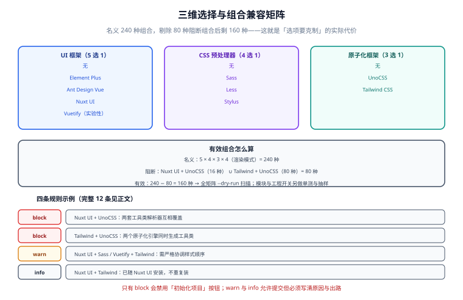

# 技术栈矩阵与组合兼容

选择器里每多一个选项，组合数就乘一次。这一篇把**每种组合对应什么**逐项列清楚——依赖、模块、文件、代价、适用场景——因为「用户选了会得到什么」如果说不清，选择器就只是把配置负担从作者转嫁给用户。



## 1. 组合数怎么算

| 维度 | 取值数 | 说明 |
| --- | --- | --- |
| UI 框架 | 5 | 无 / Element Plus / Ant Design Vue / Nuxt UI / Vuetify |
| CSS 预处理器 | 4 | 无 / Sass / Less / Stylus |
| 原子化框架 | 3 | 无 / UnoCSS / Tailwind CSS |
| 渲染模式 | 4 | SSR / SPA / SSG / 混合 |
| 模块（多选 6 项） | 64 | Pinia / VueUse / i18n / Icon / Image / SEO |
| 工程（开关 5 项） | 32 | ESLint / 测试 / TS 严格 / 包管理器 / Docker |

名义组合数是 5 × 4 × 3 × 4 × 64 × 32 = **491,520**。显然不能全测——所以设计上做了两件事：

1. **把有语义冲突的组合在模型层禁掉**，让它不进入「有效组合」集合。
2. **把自测分成两层**：三维 + 渲染模式做**全矩阵扫描**（名字空间小、覆盖强），模块与工程开关做**代表组合抽样** + **逐项单测**（因为它们彼此正交、只影响依赖清单）。

三维 + 渲染模式的有效组合数：

```text
名义：5（UI）× 4（预处理器）× 3（原子化）× 4（渲染模式） = 240
硬阻断：Nuxt UI + UnoCSS（1 × 4 × 1 × 4 = 16 种）
实验性：Vuetify（默认一并阻断，1 × 4 × 3 × 4 = 48 种）
默认阻断合计 = 64 种
默认有效：240 − 64 = 176 种
加 --force-experimental 时：阻断仅剩 16 种，有效 224 种
```

**176 种需要全矩阵扫描，其余 480 个开关组合由单测与冒烟覆盖。** 这就是 [需求与方案定位](../Requirement/index.md) 里「选项数要克制」的实际代价测算。

## 2. 维度一：UI 框架

| 选项 | 依赖 | 模块 / 配置 | 代价 | 适用 |
| --- | --- | --- | --- | --- |
| **无** | — | — | 0 | 内容型站点、少量交互的展示页 |
| **Element Plus** | `element-plus`（2.14.x） | devDep `@element-plus/nuxt`；`modules` 追加；`css` 追加 `element-plus/dist/index.css`（或按需样式）；中文语言包 | 组件齐全但包体偏大，Tree Shaking 效果一般 | 中后台、国内团队存量项目 |
| **Ant Design Vue** | `ant-design-vue`（4.2.x）+ `dayjs` | devDep `@ant-design-vue/nuxt`（若该模块版本滞后于主库，退回手动注册 `plugins/antd.ts` + 引入 `ant-design-vue/dist/reset.css`）；`modules` 追加 | 设计体系完整；SSR 下需注意样式的服务端抽取 | 企业级中后台、偏 B 端设计语言 |
| **Nuxt UI** | `@nuxt/ui`（4.11.x）+ `tailwindcss`（4.3.x，**必须显式安装**） | `modules` 追加 `@nuxt/ui`；`css` 追加 `~/assets/styles/main.css`；该文件内需 `@import "tailwindcss"; @import "@nuxt/ui";` 两行 | 需要 Nuxt ≥ 4.1；自带 Tailwind，与原子化维度存在重叠 | 面向 C 端、需要现代设计语言与深色模式 |
| **Vuetify** | `vuetify`（4.x） | devDep `vuetify-nuxt-module`（**1.0.0-rc 线，标为实验性**）；`modules` 追加；`vuetify` 配置段 | Material Design 3 体系；自带大量基础样式，与 Tailwind preflight 需手工协调 | Material 风格项目、跨端一致的视觉规范 |

::: danger Nuxt UI 的两个静默失效点
1. **必须自己装 `tailwindcss`。**`@nuxt/ui` 把 Tailwind 当 peer 依赖，只加模块不装 Tailwind 会得到「组件渲染了但完全没样式」——没有报错。
2. **必须在 CSS 入口里写两行 `@import`。**只写 `@import "tailwindcss";` 会让语义色（`text-primary`、`bg-elevated`）全部失效。正确顺序是先 tailwind 后 ui。
:::

::: warning Vuetify 模块为什么默认拒绝
`vuetify-nuxt-module` 的 npm `latest` 标签仍停在 `0.19.x`，`1.0.0-rc` 线最新为 `rc.5`（2026-08）。RC 版本在 minor 之间可能带破坏性变更，而模板承诺的是「可复现的产物」。因此计划里把它标为**实验性**：引导页上禁用该选项，需要的人用 `--force-experimental` 显式打开，并在 `template.config.json` 里记一个 `experimental: true` 标记。
:::

## 3. 维度二：CSS 预处理器

| 选项 | 依赖 | 变更 | 代价 |
| --- | --- | --- | --- |
| **无** | — | 组件内样式写在 `<style scoped>` 里，跨组件复用靠 CSS 变量与 `@import` | 没有嵌套与 mixin，复杂主题会啰嗦 |
| **Sass** | devDep `sass-embedded`（1.105.x） | `tokens.css` → `_tokens.scss`；`css` 入口替换；Stylelint 增加 `stylelint-config-standard-scss`；组件内 `<style lang="scss" scoped>` | 生态最好，Vuetify/Tailwind 都原生兼容 |
| **Less** | devDep `less`（4.x） | 同上，产物为 `.less`；Stylelint 增加 `stylelint-config-standard-less` | 国内存量多；生态活跃度低于 Sass |
| **Stylus** | devDep `stylus`（0.6x） | 同上，产物为 `.styl`；Stylelint 支持有限 | 语法最简，但工具链支持最弱 |

::: tip 预处理器选 Sass 时用 `sass-embedded` 而不是 `sass`
两者 API 相同，`sass-embedded` 走 Dart 编译出的原生进程，构建速度明显更快；Vite 会自动优先使用它。选 `sass` 不会错，但装 `sass-embedded` 是当前更优的默认。
:::

::: danger 选了预处理器 ≠ 原子化框架的配置也要改
两者是**正交**的：预处理器影响你自己写的样式，原子化引擎生成工具类。唯一需要协调的是**入口顺序**——原子化引擎的 `base`/`preflight` 必须排在自定义样式之前，否则你的样式会被工具类的 reset 覆盖。引擎在写 `TEMPLATE:CSS` 区间时，顺序固定为：
`【原子化 base】→【tokens】→【base】→【UI 库样式】→【业务入口】`。
:::

## 4. 维度三：原子化框架

| | UnoCSS | Tailwind CSS |
| --- | --- | --- |
| 版本 | 66.10.x | 4.3.x |
| 接入方式 | `@unocss/nuxt` 模块 | `@tailwindcss/vite` 插件（写进 `vite.plugins`）+ `css` 入口 `@import "tailwindcss";` |
| 预设 | `preset-wind4`（Tailwind 4 语义，推荐）/ `preset-wind3` | 内置（v4 已无 `tailwind.config.js`） |
| 配置位置 | `uno.config.ts` | CSS 内 `@theme` 块 |
| 特色 | Attributify、纯 CSS 图标、Variant Groups、按需生成 | 生态最大、文档最全、`@theme` 与 CSS 变量天然一致 |
| 代价 | 需要自己选预设，选错会让类名语义漂移 | 想表达「配置」只能写 CSS，习惯 JS 配置的人会不适应 |

::: warning `preset-uno` / `preset-wind` 已被重命名
UnoCSS 66.0.0 起，`@unocss/preset-uno` 与 `@unocss/preset-wind` 更名为 `preset-wind3`。旧包仍会发布且**不报弃用警告**，但文档已把它们列入 Deprecated。模板统一写 `preset-wind4`（Tailwind 4 语义）——这是当前默认值。
:::

## 5. Nuxt 侧配置

### 5.1 渲染模式

| 选项 | 配置变更 | 产物形态 | 适用 |
| --- | --- | --- | --- |
| **SSR**（默认） | 无需额外配置（`ssr: true`） | Node 服务或 Serverless 函数 | 需要 SEO、首屏性能、个性化内容 |
| **SPA** | `ssr: false` | 纯静态 + 客户端路由 | 后台管理系统、登录后才用 |
| **SSG** | `nitro.preset = 'static'` + `nuxi generate` | 纯静态 HTML | 文档站、营销页 |
| **混合** | `routeRules` 逐路由指定 `prerender` / `swr` / `ssr: false` | 服务 + 静态 | 大多数真实项目：首页预渲染、后台 SPA |

### 5.2 模块（多选）

| 模块 | 依赖 | 带来的配置 | 注意 |
| --- | --- | --- | --- |
| Pinia | `pinia` + `@pinia/nuxt` | `modules` 追加 | Nuxt 4 下仍需显式装 `pinia` |
| VueUse | `@vueuse/nuxt` | `modules` 追加；自动导入常用组合式函数 | 与自动导入共存无需额外配置 |
| i18n | `@nuxtjs/i18n` | `modules` 追加 + `i18n` 配置段 + `i18n/locales/*.json` | SSG 下页面数按语言成倍 |
| Icon | `@nuxt/icon` | `modules` 追加 + `icon` 配置段 | 按需拉取图标字体，注意首屏闪烁 |
| Image | `@nuxt/image` | `modules` 追加 + `image` 配置段 | 需指定 provider，默认 ipx 需服务端 |
| SEO | `@nuxtjs/seo` | `modules` 追加 + `site` 配置段 | 建议配 `runtimeConfig.public.siteUrl` |

### 5.3 工程开关

| 开关 | 依赖 | 产物 |
| --- | --- | --- |
| ESLint | `eslint` + `@nuxt/eslint` | `eslint.config.mjs`（flat config） |
| 测试 | `vitest`（4.1.x）+ `@nuxt/test-utils`（4.x）+ `happy-dom` | `vitest.config.ts` + `test/` |
| TS 严格 | — | `tsconfig.json` 追加 `strict: true` + `noUncheckedIndexedAccess` |
| 包管理器 = npm | — | `package-lock.json` 路线；引擎的 install 阶段切换命令 |
| Docker | — | `Dockerfile` + `.dockerignore` + `compose.yaml` |

::: info 包管理器为什么只给 pnpm / npm
yarn 与 bun 各有各自的 workspace 与锁定语义，做成选项意味着引擎要维护四套 install 分支。**选项的价值来自「有人真的会用」**，这两个之外的场景请手动改，改法在 [部署与上线](../Deployment/index.md) 里写了。
:::

## 6. 依赖映射总表（示例组合）

以「Element Plus + Sass + 无原子化 + SSR + Pinia + Icon + ESLint + 测试」为例：

```json
{
  "dependencies": {
    "nuxt": "^4.5.0",
    "element-plus": "^2.14.0",
    "pinia": "^3.0.0",
    "@pinia/nuxt": "^0.11.0",
    "@nuxt/icon": "^2.0.0"
  },
  "devDependencies": {
    "@element-plus/nuxt": "^1.1.0",
    "sass-embedded": "^1.105.0",
    "stylelint": "^16.0.0",
    "stylelint-config-standard-scss": "^15.0.0",
    "eslint": "^9.0.0",
    "@nuxt/eslint": "^1.0.0",
    "vitest": "^4.1.0",
    "@nuxt/test-utils": "^4.0.0",
    "happy-dom": "^20.0.0"
  }
}
```

::: warning 上表是「映射规则的结果」，不是可直接复制的版本清单
版本号会随官方补丁更新，模板的做法是**用 `^` 范围交给包管理器解析**，并在 `template.config.json` 里记录**当时解析到的实际版本**（`resolvedAt` 字段）。要精确复现请配合仓库的 lockfile，不要照抄本文的数字。
:::

## 7. 冲突与冗余规则全表

与 [引导页](../WizardFrontend/index.md) 的规则呈现一一对应，这里是完整清单：

| # | 组合 | level | 理由与出路 |
| --- | --- | --- | --- |
| 1 | Nuxt UI + UnoCSS | `block` | 两套工具类解析器互相覆盖。改为 Tailwind CSS（Nuxt UI 自带）或不选原子化 |
| 2 | Tailwind + UnoCSS | `block` | 两个原子化引擎同时生成工具类，产出重复且顺序不可预测 |
| 3 | Nuxt UI + Tailwind | `info` | Tailwind 已随 Nuxt UI 安装，此处只是确认，不会重复安装 |
| 4 | Nuxt UI + Sass | `warn` | Tailwind 4 不依赖 Sass，但两者共存时 `@import` 顺序必须严格（见 3.3） |
| 5 | Vuetify + Tailwind | `warn` | Vuetify 的组件基础样式与 Tailwind preflight 会互相影响，需手动调整顺序 |
| 6 | Vuetify + Stylus | `warn` | Vuetify 的样式体系基于 Sass，Stylus 只能用于业务样式，不能参与主题变量 |
| 7 | 无 UI + 无原子化 + 无预处理器 | `info` | 纯 CSS 方案，组件内 `<style scoped>`，适合内容站 |
| 8 | SPA + SEO 模块 | `warn` | SPA 下 SEO 能力受限，建议改 SSR 或把 SEO 模块去掉 |
| 9 | SSG + i18n | `info` | 每种语言一套静态页，构建时间与页面数成倍 |
| 10 | SSG + Image（默认 ipx provider） | `warn` | 静态部署下没有服务端处理图片，需换 provider 或预生成 |
| 11 | Vuetify 模块 | `block`（可 `--force-experimental` 解除） | 模块仍处于 1.0.0-rc 线，与「产物可复现」冲突 |
| 12 | Ant Design Vue + Less | `info` | antd 4 的样式由 CSS-in-JS 产出，业务侧用 Less 不冲突 |

::: danger 规则文案的三要素
每条 `message` 必须包含：**为什么**（冲突的机制）、**出路**（至少一条可执行的替代选择）、**影响**（不改会怎样）。只写「冲突」两个字，用户唯一的选择就是随便点一个，这比不提示更糟。
:::

## 8. 三套预设

预设是**给选择器加「一键填充」**，不是另一套实现——它们只是往同一份 `Selection` 里写值：

| 预设 | UI | 预处理器 | 原子化 | 渲染 | 模块 | 适用 |
| --- | --- | --- | --- | --- | --- | --- |
| **纯 CSS 极简** | 无 | 无 | 无 | SSG | 无 | 内容站、文档站、Landing Page |
| **后台管理** | Element Plus | Sass | 无 | SPA | Pinia、Icon | 内部系统、中后台 |
| **C 端内容站** | Nuxt UI | 无 | Tailwind | SSR | Pinia、Icon、Image、SEO | 面向用户的产品官网/内容平台 |

::: tip 预设要能「被改」
点预设后表单依然是可编辑的——预设只是省去从零开始点的力气。如果预设变成「选了就锁死」，它就退化成了又一个分支模板。
:::

## 9. 验证方式

```shell
# ① 全矩阵扫描（176 种有效组合）：dry-run 全部通过、无未捕获异常
node scripts/matrix.mjs --dry-run-all
# 期望：有效组合 160 / 通过 160 / 失败 0 / 阻断组合命中 80（预期）

# ② 抽查 6 个代表组合，真跑并 verify
for s in pure-css admin-c-end ui-tailwind ui-none-vuetify-exp less-unocss i18n-ssg; do
  node scripts/init.mjs --selection "fixtures/$s.json"
  node scripts/verify.mjs --fast || echo "FAIL $s"
  node scripts/init.mjs --rollback
done
# 期望：6/6 全部 12 项通过

# ③ 冲突规则命中率：人为构造 12 种冲突，逐条确认 level 与文案
node scripts/rules-selftest.mjs
# 期望：12/12 命中，其中 block 3 条（含 1 条实验性）
```

## 相关页面

- [引导页：信息架构与选择模型](../WizardFrontend/index.md)：规则如何呈现在界面上
- [初始化引擎](../InitEngine/index.md)：这张映射表如何被执行成文件变更
- [构建与产物形态](../Build/index.md)：渲染模式决定的产物差异
- [Nuxt 全栈开发](../../../../docs/Frontend/Frame/Nuxt/index.md)：渲染模式与服务端能力的框架层说明

## 参考资料

- Element Plus 官方文档：[element-plus.org](https://element-plus.org/zh-CN/)
- Ant Design Vue：[antdv.com](https://antdv.com/)
- Nuxt UI v4：[ui.nuxt.com](https://ui.nuxt.com/)
- Vuetify + Nuxt 模块：[github.com/vuetifyjs/nuxt-module](https://github.com/vuetifyjs/nuxt-module)
- UnoCSS 预设清单（含重命名说明）：[unocss.dev/presets](https://unocss.dev/presets/)
- Tailwind CSS v4 的 CSS-first 配置：[tailwindcss.com/docs/theme](https://tailwindcss.com/docs/theme)
- Dart Sass 版本与 `sass-embedded`：[sass-lang.com](https://sass-lang.com/)
