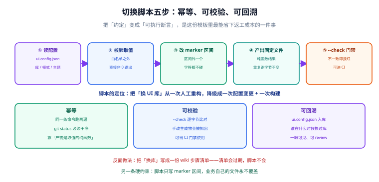
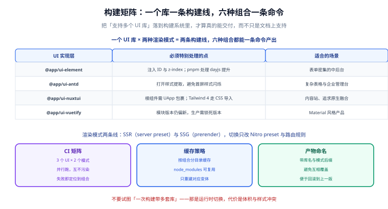

# 第 5 步：切换工具链与多形态构建

前四步把「可插拔」做成了事实，但换库还得靠人手工改六个文件。这一步把它变成**一条命令**，并且让「有没有改干净」可以由机器判断。



## 一、脚本要满足五条性质

| 性质 | 判据 | 为什么必须有 |
| --- | --- | --- |
| **幂等** | 同一条命令跑两遍，`git status` 干净 | 否则 CI 每次都会「产生」一堆无意义 diff |
| **可校验** | `--check` 逐字节比对，不一致时非 0 退出 | 让「配置与生成物漂移」变成构建失败，而不是线上事故 |
| **可回溯** | 取值落在 `ui.config.json` 并入库 | 「谁在什么时候把库换了」在 `git log` 里一眼可见 |
| **零依赖** | 只用 `node:fs` / `node:path` | 一个切换脚本不该引入依赖树；它要能在最小环境里跑 |
| **只碰生成物** | 手写文件零改动；连 `nuxt.config.ts` 也只碰 marker 区间内 | 这是「切错了也不会毁掉工程」的底线 |

::: tip 一句话概括设计
**生成物是 `(ui, render)` 两个取值的纯函数。**

不含时间戳、不含用户名、不含「当初用的哪个预设」。这条约束一旦破掉，幂等与可校验就都没了——因为 `--check` 无法复现「当时应该生成什么」。所以预设名**只用于选择入口，不写进任何生成物**。
:::

## 二、命令与用法

```shell
# 查看可选值与预设
node scripts/ui-select.mjs --list

# 按预设切换（最常用）
node scripts/ui-select.mjs --preset element-admin

# 按参数切换
node scripts/ui-select.mjs --ui antd --render ssr

# 只看会写哪些文件，不落盘
node scripts/ui-select.mjs --dry-run --ui nuxtui --render ssg

# CI 门禁
node scripts/ui-select.mjs --check

# 打印当前取值对应的命令（永不交互）
node scripts/ui-select.mjs --print
```

5 个预设覆盖常见诉求：

| 预设 | ui | render | 适用 |
| --- | --- | --- | --- |
| `element-admin` | element | ssr | 国内中后台最主流的一套 |
| `antd-enterprise` | antd | ssr | 复杂表格与企业级表单 |
| `nuxtui-content` | nuxtui | ssg | 内容站，全静态预渲染 |
| `vuetify-material` | vuetify | ssr | Material 风格（需 `--allow-experimental`） |
| `static-demo` | element | ssg | 纯静态演示壳 |

## 三、脚本实现

完整脚本放在 `scripts/ui-select.mjs`。下面是可直接复制运行的版本。

### 3.1 目录约定与元数据表

```javascript [scripts/ui-select.mjs（节选 1/2）]
#!/usr/bin/env node
import { existsSync, mkdirSync, readFileSync, writeFileSync } from 'node:fs'
import { dirname, join } from 'node:path'
import process from 'node:process'

const CONFIG_FILE = 'ui.config.json'
const NUXT_CONFIG = 'nuxt.config.ts'
const GEN_DIR = 'app/ui/generated'
const FILES = {
  manifest: `${GEN_DIR}/manifest.ts`,
  adapter: `${GEN_DIR}/adapter.ts`,
  deps: `${GEN_DIR}/deps.json`,
  fragment: `${GEN_DIR}/nuxt-ui.config.mjs`,
  tokens: 'app/assets/styles/generated-tokens.css',
  summary: 'UI.md',
}
const MARKER_BEGIN = '// ui:modules:begin'
const MARKER_END = '// ui:modules:end'
const IMPORT_MODULE = "'./app/ui/generated/nuxt-ui.config.mjs'"

// 版本口径 2026-09-30：element 2.14.x / antd 4.x / Nuxt UI 4.11.x / Vuetify 模块 1.0.0-rc.5
const CATALOG = {
  element: {
    label: 'Element Plus', version: '2.14.x',
    module: '@element-plus/nuxt', moduleVersion: '1.1.x',
    impl: '@app/ui-element', experimental: false,
    deps: { 'element-plus': '^2.14.0', '@element-plus/icons-vue': '^2.3.0' },
    devDeps: { '@element-plus/nuxt': '^1.1.0' },
    css: [], transpile: ['element-plus'], prefix: 'el',
    vars: {
      '--el-color-primary': 'var(--ui-color-primary)',
      '--el-color-danger': 'var(--ui-color-danger)',
      '--el-border-radius-base': 'var(--ui-radius-control)',
      '--el-font-size-base': 'var(--ui-font-body)',
    },
  },
  // antd / nuxtui / vuetify 三项结构完全相同，按第 3 步的版本表填写即可
}

const UI_KEYS = ['element', 'antd', 'nuxtui', 'vuetify']
const RENDER_KEYS = ['ssr', 'ssg']

// 预设只用于「怎么选」，绝不写进生成物
const PRESETS = {
  'element-admin': { ui: 'element', render: 'ssr' },
  'antd-enterprise': { ui: 'antd', render: 'ssr' },
  'nuxtui-content': { ui: 'nuxtui', render: 'ssg' },
  'vuetify-material': { ui: 'vuetify', render: 'ssr' },
  'static-demo': { ui: 'element', render: 'ssg' },
}
```

### 3.2 产物生成、marker 区间与门禁

```javascript [scripts/ui-select.mjs（节选 2/2）]
const EXIT_OK = 0
const EXIT_REJECT = 1
const EXIT_USAGE = 2

class Reject extends Error {}

const normalize = text => text.replace(/\r\n/g, '\n').replace(/\r/g, '\n')
const readText = path => normalize(readFileSync(path, 'utf8'))
const writeText = (path, text) => {
  mkdirSync(dirname(path), { recursive: true })
  writeFileSync(path, normalize(text), 'utf8')
}
const j = value => JSON.stringify(value)
const jPretty = value => `${JSON.stringify(value, null, 2)}\n`

/** 个性化能力由渲染模式派生：SSG 在构建期把 HTML 定死，没有「按这次请求」的机会。 */
const personalizeOf = render => render === 'ssr'

/** 产物是 (ui, render) 的纯函数：不含时间戳、不含用户名、不含预设名 */
function buildArtifacts(ui, render) {
  const meta = CATALOG[ui]
  const personalize = personalizeOf(render)
  const degraded = personalize ? [] : ['personalize']

  const manifest = `// 本文件由 scripts/ui-select.mjs 生成，请勿手工修改。
export const uiManifest = {
  ui: ${j(ui)},
  uiLabel: ${j(meta.label)},
  uiVersion: ${j(meta.version)},
  impl: ${j(meta.impl)},
  module: ${j(meta.module)},
  render: ${j(render)},
  experimental: ${meta.experimental},
  degraded: ${j(degraded)},
} as const
`

  const fragment = `// 本文件由 scripts/ui-select.mjs 生成，请勿手工修改。
export const uiModules = ${j([meta.module])}
export const uiCss = ${j(meta.css)}
export const uiBuild = ${j({ transpile: meta.transpile })}
export const uiNitroPreset = ${j(personalize ? 'node-server' : 'static')}
export const uiRouteRules = ${j(personalize ? {} : { '/**': { prerender: true } })}
export const uiRuntimeConfigPublic = ${j({ ui, render, personalize })}
export const uiAlias = ${j({ '#ui-impl': `./app/ui/impl/${ui}` })}
`

  const varLines = Object.entries(meta.vars).map(([k, v]) => `  ${k}: ${v};`).join('\n')
  const tokens = `/* 本文件由 scripts/ui-select.mjs 生成，请勿手工修改。 */
:root {
  /* 第 ② 层：语义令牌 */
  --ui-color-primary: var(--brand-500);
  --ui-color-danger: var(--brand-danger);
  --ui-radius-control: var(--radius-md);
  --ui-font-body: var(--font-size-base);

  /* 第 ③ 层：${meta.label} 变量映射 */
${varLines}
}
`

  return {
    files: {
      [FILES.manifest]: manifest,
      [FILES.fragment]: fragment,
      [FILES.tokens]: tokens,
      // adapter.ts / deps.json / UI.md 的结构同理，此处省略
    },
    degraded,
  }
}

/** marker 区间内容刻意与取值无关：对所有 ui 取值都完全相同 */
const markerBlock = () =>
  `  ${MARKER_BEGIN}\n  modules: [...baseModules, ...uiModules],\n  ${MARKER_END}`

/** 替换 marker 区间；区间或 import 缺失时拒绝执行（不猜位置） */
function applyMarker(existing) {
  const text = normalize(existing)
  const b = text.indexOf(MARKER_BEGIN)
  const e = text.indexOf(MARKER_END)
  if (b < 0 || e < 0 || e < b) {
    throw new Reject(`${NUXT_CONFIG} 里找不到 marker 区间，脚本不会猜位置自己去创建。`)
  }
  if (!text.includes(IMPORT_MODULE)) {
    throw new Reject(`${NUXT_CONFIG} 顶部缺少生成物的 import，脚本不会替你插入 import 语句。`)
  }
  // 从「含前置缩进的行首」开始替换、从 MARKER_END 行的行尾之后接回：
  // 否则区间前的缩进会被不断累加，每跑一次多缩进一层。
  const lineStart = text.lastIndexOf('\n', b) + 1
  const lineEnd = text.indexOf('\n', e)
  return text.slice(0, lineStart) + markerBlock() + (lineEnd >= 0 ? text.slice(lineEnd) : '')
}

/** 门禁：实验性模块与能力降级都必须显式接受 */
function gate(ui, render, args) {
  const meta = CATALOG[ui]
  let ok = true
  if (meta.experimental && !args.allowExperimental) {
    console.error(`ERROR 组合 ui=${ui} 依赖实验性模块（${meta.module} ${meta.moduleVersion}），默认拒绝。\n`
      + `  接受风险请加：--allow-experimental`)
    ok = false
  }
  if (render === 'ssg' && !args.allowDegraded) {
    console.error('ERROR render=ssg 会让「按请求个性化」能力降级，默认拒绝。\n'
      + '  接受降级请加：--allow-degraded-personalize')
    ok = false
  }
  return ok
}

/** CI 门禁：重新计算期望值并与磁盘逐字节比对 */
function cmdCheck(args) {
  const cfg = JSON.parse(readText(join(args.dir, CONFIG_FILE)))
  const { ui, render } = cfg
  if ('personalize' in cfg && cfg.personalize !== personalizeOf(render)) {
    console.error(`FAIL  ${CONFIG_FILE} 里的 personalize 由 render 派生，不应手工修改。`)
    return EXIT_REJECT
  }
  const { targets } = fullTargets(ui, render, readText(join(args.dir, NUXT_CONFIG)))
  const bad = Object.entries(targets).filter(([rel, body]) =>
    !existsSync(join(args.dir, rel)) || readText(join(args.dir, rel)) !== normalize(body))
  if (bad.length) {
    console.log('FAIL  --check 未通过：')
    for (const [rel] of bad) console.log(`      ${rel}：与 ${CONFIG_FILE} 不一致`)
    return EXIT_REJECT
  }
  console.log(`OK    --check 通过：${Object.keys(targets).length} 个生成物与 ${CONFIG_FILE} 完全一致`)
  return EXIT_OK
}

/**
 * 命令行入口：把 argv 映射为退出码，**不自己调 process.exit**。
 * 这么做是为了让自测能在同一个进程里直接驱动它（见下一节）。
 */
function runCli(argv) {
  let args
  try {
    args = parseArgs(argv)
  }
  catch (err) {
    console.error(`ERROR ${err.message}\n\n${USAGE}`)
    return EXIT_USAGE
  }

  if (args.help) {
    console.log(USAGE)
    return EXIT_OK
  }
  // 未知参数先于「没给参数」判断：拼错一个开关时，回显错在哪比甩一份用法有用。
  if (args._unknown.length) {
    console.error(`ERROR 未知参数：${args._unknown.join(' ')}\n\n${USAGE}`)
    return EXIT_USAGE
  }
  if (!args.list && !args.check && !args.print && !args.ui && !args.preset) {
    console.log(USAGE)
    return EXIT_USAGE
  }
  if (args.list) return cmdList()
  if (args.check) return cmdCheck(args)
  if (args.print) return cmdPrint(args)

  // …参数校验与 --dry-run，见完整脚本
  const [ui, render] = resolvePick(args)
  if (!gate(ui, render, args)) return EXIT_REJECT
  return cmdApply(args, ui, render)
}

// 只有「被直接执行」时才跑 CLI；被 import 时仅导出函数，供自测在进程内驱动。
const isDirectRun
  = Boolean(process.argv[1]) && resolve(process.argv[1]) === resolve(fileURLToPath(import.meta.url))

if (isDirectRun) process.exit(runCli(process.argv.slice(2)))

export {
  CATALOG, PRESETS, UI_KEYS, RENDER_KEYS, FILES,
  EXIT_OK, EXIT_REJECT, EXIT_USAGE, Reject,
  applyMarker, buildArtifacts, cmdApply, cmdCheck, cmdList, cmdPrint,
  fullTargets, gate, markerBlock, normalize, parseArgs, personalizeOf,
  readText, resolvePick, runCli, writeText,
}
```

::: tip 为什么要拆出 `runCli()` 而不是直接 `process.exit(main())`
`main()` 里调 `process.exit()` 的写法，**没法被自测复用**——一旦被 import 就会把测试进程一起杀掉。
拆成「`runCli(argv)` 返回退出码」+「`isDirectRun` 守卫」之后，自测可以在同一个进程里驱动它，
从而**不依赖子进程**。这不只是洁癖：在子进程被限制的环境（容器、受限沙箱）里，
这是自测还能跑起来的唯一办法。
:::

::: info 完整脚本在哪里
上面两段合起来就是可运行的主体；缺的部分只有「命令行参数解析」「`--dry-run` 打印」「`deps.json` / `adapter.ts` / `UI.md` 三个产物模板」以及其余三个库的元数据——都是照抄结构的机械工作。

下面给出这两份文件的完整结构与关键实现（零依赖，只用 Node 内置模块），照它写进你工程的 `scripts/` 目录即可运行：

| 文件 | 作用 |
| --- | --- |
| `scripts/ui-select.mjs` | 切换器本体（约 610 行，零依赖） |
| `scripts/selftest.mjs` | 自测（275 项断言，零依赖，进程内驱动） |
| `scripts/fixture/` | 自测用的最小工程（`nuxt.config.ts` / `ui.config.json` / 一个页面 / 一份令牌） |

拷过去之后先跑 `node scripts/selftest.mjs` 确认环境没问题，再动自己的工程。
:::

## 四、三个实现要点

### 4.1 为什么 marker 区间的内容要「与取值无关」

脚本完全可以让 marker 区间写上当前模块名：

```text
// ui:modules:begin
modules: [...baseModules, '@nuxt/ui'],
// ui:modules:end
```

但本模板刻意**不这么做**：区间内容对所有取值都是 `[...baseModules, ...uiModules]`，取值只通过生成的 `nuxt-ui.config.mjs` 生效。

好处是两条性质**天生成立**，不需要靠纪律维持：

1. **幂等**：区间内容不随取值变化，重复执行字节不变。
2. **换库时 `nuxt.config.ts` 不变**：换库的 diff 里根本不会出现这个文件。

### 4.2 marker 区间的前后缩进必须显式处理

这是本脚本开发过程中踩到的一个真实 bug：如果简单地「从 marker 关键字位置开始替换」，那么 marker 前面的空格缩进会被反复累加——跑一次多两个空格，`--check` 立刻报红。

正确做法是**从包含缩进的行首开始替换**：

```javascript
const lineStart = text.lastIndexOf('\n', b) + 1     // 含前置缩进的行首
const lineEnd = text.indexOf('\n', e)               // MARKER_END 行的行尾
```

::: warning 这类 bug 只在「重复执行」时暴露
单次执行是正常的，所以**必须把「连跑两次字节不变」写进自测**，否则它会在 CI 上以「第一次跑就报红」的形式出现，让人误以为是环境问题。
:::

### 4.3 `personalize` 是派生值，不是开关

`ui.config.json` 里的 `personalize` 由 `render` 派生（`ssr → true`、`ssg → false`），并且 `--check` 会校验这一点。手工把它改成 `false` 会被报红。

为什么不容许手工设置：**它描述的是「当前配置具备什么能力」，而不是「我们想要什么」**。把它做成可调开关，就会出现「文件里写着 `personalize: true`，实际是 SSG」这种自相矛盾的状态。

## 五、实测结果

以下输出来自真实运行（Node 22.22、Windows）：

```text
$ node scripts/ui-select.mjs --list
可选 UI 实现层：
  element   Element Plus     2.14.x     @app/ui-element
  antd      Ant Design Vue   4.x        @app/ui-antd
  nuxtui    Nuxt UI          4.11.x     @app/ui-nuxtui
  vuetify   Vuetify          3.x        @app/ui-vuetify  [实验性]

可选渲染模式：ssr / ssg

$ node scripts/ui-select.mjs --ui element --render ssr
OK    ui=element render=ssr 已写入 8 个文件，其中 6 个发生变化
      ~ UI.md
      ~ app/assets/styles/generated-tokens.css
      ~ app/ui/generated/adapter.ts
      ~ app/ui/generated/deps.json
      ~ app/ui/generated/manifest.ts
      ~ app/ui/generated/nuxt-ui.config.mjs

$ node scripts/ui-select.mjs --ui element --render ssr     # 第二次跑
OK    ui=element render=ssr 已写入 8 个文件，其中 0 个发生变化

$ node scripts/ui-select.mjs --check
OK    --check 通过：8 个生成物与 ui.config.json 完全一致
```

门禁的两种拦截（退出码均为 1，且**不写任何文件**）：

```text
$ node scripts/ui-select.mjs --ui vuetify --render ssr
ERROR 组合 ui=vuetify 依赖实验性模块，脚本默认拒绝：
  - vuetify-nuxt-module 当前版本 1.0.0-rc.5（仍是 rc，未发正式版）
  ...
  b) 明确接受风险：    --allow-experimental（生成物里 experimental=true，并在 UI.md 写清）

$ node scripts/ui-select.mjs --ui element --render ssg
ERROR 组合 render=ssg 会让以下能力降级，脚本默认拒绝：
  - 按请求个性化（按登录态 / 时区 / 地理位置决定首屏内容）
  ...
  b) 明确接受降级：    --allow-degraded-personalize（生成物里 personalize=false）
```

marker 区间被改坏时，`--check` 能定位到文件：

```text
$ node scripts/ui-select.mjs --check
FAIL  --check 未通过：
      nuxt.config.ts：内容与 ui.config.json 不一致
      共 1 个文件漂移；跑一次 --ui element --render ssr 即收敛
```

区间**外**的手改不受影响——换库时只有 6 个生成物与 `ui.config.json` 变化，`nuxt.config.ts` 连同手加的配置行都保持原样：

```text
$ node scripts/ui-select.mjs --ui antd --render ssr
OK    ui=antd render=ssr 已写入 8 个文件，其中 7 个发生变化
      ~ UI.md
      ~ app/assets/styles/generated-tokens.css
      ~ app/ui/generated/adapter.ts
      ~ app/ui/generated/deps.json
      ~ app/ui/generated/manifest.ts
      ~ app/ui/generated/nuxt-ui.config.mjs
      ~ ui.config.json
# 注意：nuxt.config.ts 不在变更列表里
```

全矩阵验证（4 个库 × 2 种渲染模式）：

```text
OK   element/ssr      OK   element/ssg
OK   antd/ssr         OK   antd/ssg
OK   nuxtui/ssr       OK   nuxtui/ssg
OK   vuetify/ssr      OK   vuetify/ssg
全矩阵结果：通过 8 / 8
```

最后，上面每一条性质都有断言兜着——`node scripts/selftest.mjs` 的实测输出：

```text
ui-select.mjs 自测（零依赖 · 进程内驱动 · 门禁断言为变异测试）

  PASS  A  用法与元数据（23 项，失败 0）
  PASS  B  生成物内容（185 项，失败 0）
  PASS  C  幂等（6 项，失败 0）
  PASS  D  手写文件保护（10 项，失败 0）
  PASS  E  marker / import 缺失（9 项，失败 0）
  PASS  F  门禁（默认拒绝）（14 项，失败 0）
  PASS  G  --check 行为（17 项，失败 0）
  PASS  H  全矩阵（1 项，失败 0）
  PASS  I  --dry-run（5 项，失败 0）
  PASS  J  --print（5 项，失败 0）

断言：通过 275 / 失败 0

结果：OK
```

::: warning 这些断言是「变异测试」而不是「冒烟测试」
275 项里有 30 多项是**主动把东西改坏、要求它必须报红**：删 marker、改坏 import、篡改生成物、
手工改 `personalize`、写非法 JSON、越过门禁取值……

判据很简单：如果把 `personalizeOf` 改成恒真（不再由 `render` 派生），
自测必须从 0 失败变成十多项失败。做不到这一点的自测，等于在给校验器发免检牌照。
:::

## 六、多形态构建



「一个 UI 库 × 两种渲染模式」= 两条构建线。切换只改 `ui.config.json`，构建命令本身不变：

```shell
pnpm build        # 按 nitro.preset 产出：SSR → .output/server，SSG → .output/public
pnpm generate     # 显式全静态预渲染
```

| 组合 | 产物位置 | 部署形态 |
| --- | --- | --- |
| `render: ssr` | `.output/server/` | Node 服务 / 容器 / Serverless |
| `render: ssg` | `.output/public/` | 对象存储 + CDN（零 Node 运行时） |

::: danger SSG 下不能假装还能做「按请求个性化」
脚本对 `render: ssg` 设门禁，正是因为它会**静默地**失去一项能力：同一份 HTML 发给所有人。

如果业务确实需要「按登录态 / 时区 / 地理位置决定首屏」，就必须用 SSR——而不是在 SSG 产物上叠加客户端请求把它补回来（那等于把首屏渲染推迟到客户端，SSR 的意义就没了）。
:::

## 七、CI 集成

```yaml [.github/workflows/ui-matrix.yml（节选）]
jobs:
  ui-matrix:
    strategy:
      matrix:
        ui: [element, antd, nuxtui]
        render: [ssr, ssg]
    steps:
      - uses: actions/setup-node@v4
        with: { node-version: 22 }
      - run: corepack enable && pnpm install

      # 1. 先确认工程里的生成物没有漂移
      - run: node scripts/ui-select.mjs --check

      # 2. 再切到矩阵这一格并构建
      - run: |
          node scripts/ui-select.mjs --ui ${{ matrix.ui }} --render ${{ matrix.render }} \
            ${{ matrix.render == 'ssg' && '--allow-degraded-personalize' || '' }}
      - run: pnpm install && pnpm build
```

::: warning `--check` 必须在切换**之前**跑
顺序反了就没有意义：先切换会覆盖漂移，`--check` 永远通过。

正确顺序是：① 用仓库当前状态跑 `--check`（守住「生成物与配置一致」）；② 再按矩阵切到目标组合做构建验证。
:::

## 八、验证方式

```shell
# 0. 先跑自测：275 项断言，五项性质全覆盖（含「把脚本改坏必须报红」的变异测试）
node scripts/selftest.mjs

# 1. 幂等：连跑两次，第二次应为 0 变化
node scripts/ui-select.mjs --preset element-admin
node scripts/ui-select.mjs --preset element-admin

# 2. 可校验：改坏一个生成物，应当被抓住
echo "// tampered" >> app/ui/generated/manifest.ts
node scripts/ui-select.mjs --check          # 期望：FAIL，退出码 1

# 3. 收敛
node scripts/ui-select.mjs --preset element-admin
node scripts/ui-select.mjs --check          # 期望：OK，退出码 0

# 4. 全矩阵
for ui in element antd nuxtui vuetify; do
  for r in ssr ssg; do
    extra=""
    [ "$ui" = "vuetify" ] && extra="$extra --allow-experimental"
    [ "$r" = "ssg" ] && extra="$extra --allow-degraded-personalize"
    node scripts/ui-select.mjs --ui "$ui" --render "$r" $extra >/dev/null && \
    node scripts/ui-select.mjs --check >/dev/null && echo "OK $ui/$r" || echo "FAIL $ui/$r"
  done
done
# 期望：8 行 OK
```

## 九、下一步

切换已经是一条命令了，但「换完之后功能有没有坏」还只能靠人点。第 6 步把它交给测试。

- [第 6 步：测试与门禁](../Testing/index.md)

## 参考资料

- [Node.js `fs` 模块](https://nodejs.org/api/fs.html)
- [Conventional Commits](https://www.conventionalcommits.org/zh-hans/)：`ui.config.json` 的变更应当单独成一次提交
- [GitHub Actions · 矩阵构建](https://docs.github.com/actions/using-jobs/using-a-matrix-for-your-jobs)
