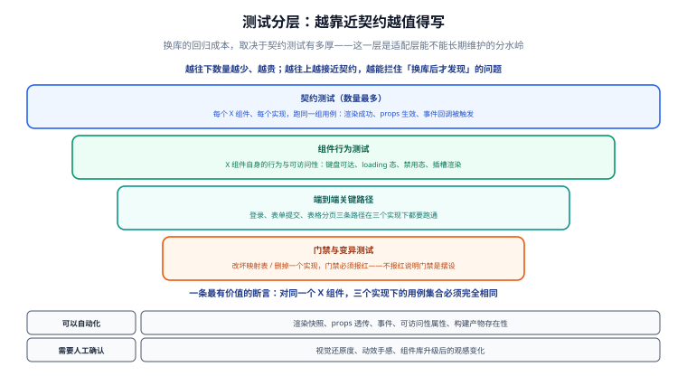

# 第 6 步：测试与门禁

前五步把「换库」做成了改一行配置加一条命令。这一步回答一个更硬的问题：**换完之后，我怎么知道功能没坏？**

换框架时编译不过就暴露了；换 UI 库恰恰相反——**编译全过，坏的是行为**。所以这一层不能靠人点，必须靠测试兜住。



## 一、换 UI 库的三种失败模式

先把「坏」具体化。换库后真实会出的问题只有三类，而它们的**发现时机完全不同**：

| 失败模式 | 典型现象 | 谁会发现 | 什么时候 |
| --- | --- | --- | --- |
| **行为断裂** | 点击没反应、`loading` 不显示、分页不翻 | 用户 | 上线后 |
| **样式失效** | 首屏无样式、闪一下、暗色主题错位 | 用户 | 上线后 |
| **水合不匹配** | 控制台 `hydration mismatch`、交互偶发失效 | 只有打开控制台的人 | 不知道什么时候 |

三类都是「跑起来才看得见」。这就是为什么第 5 步的 `--check` 远远不够——它只能保证**生成物没漂移**，不能保证**页面还能用**。

## 二、四层测试，各自管什么

| 层 | 数量 | 成本 | 职责 | 抓得住哪类失败 |
| --- | --- | --- | --- | --- |
| **契约测试** | 最多 | 低（毫秒级） | 每个 `X` 组件、每个实现跑同一组用例 | 行为断裂 |
| **组件行为测试** | 中 | 低 | 键盘可达、`loading`、禁用态、插槽 | 行为断裂 + 可访问性 |
| **端到端关键路径** | 少 | 高（分钟级） | 三条主路径在多个实现下跑通 | 水合不匹配、样式失效 |
| **门禁与变异测试** | 固定 | 极低 | 保证上面三层本身有效 | 上面三层全部失效的情况 |

::: tip 一条判断标准
越靠近契约，越值得写测试。

因为**契约层是唯一不随库变化的层**：它的用例不关心下面挂的是 Element Plus 还是 Ant Design Vue。
所以这些测试的生命周期比任何一次换库都长——写一次，三个稳定实现都在替你跑。
:::

## 三、契约测试：一套用例跑所有实现

### 3.1 用例集合必须与实现解耦

契约测试的整个价值在于：**用例只写一遍**。如果每个实现都抄一份用例，那用例集合早晚会分叉，也就测不出「换库前后行为是否一致」了。

所以目录这样分（后面 §七 的 vitest 配置就按这张表绑定环境）：

```text
test/
├─ unit/          纯函数：契约注册表结构、令牌取值      → environment: node
├─ contract/      契约测试（需要 Nuxt 环境挂载组件）    ┐
│  ├─ registry.ts    用例注册表：契约组件 → 用例集合    │
│  ├─ frozen.json    冻结的用例名清单（入库）           ├→ environment: nuxt
│  ├─ frozen.spec.ts 断言契约没有被悄悄改动             │
│  ├─ run.spec.ts    把用例跑到当前实现上               │
│  └─ cases/                                          │
│     ├─ button.ts   XButton 的用例集合                 │
│     └─ table.ts    XTable 的用例集合                  │
├─ component/     组件行为与可访问性（同样要 Nuxt 环境）┘
└─ e2e/           端到端（浏览器由 Playwright 起）      → environment: node
```

关键点：`cases/` 里**只有用例，没有实现信息**。

### 3.2 用一个用例集合描述契约

```typescript [test/contract/cases/button.ts]
import { expect } from 'vitest'
import type { MountFn } from '../registry'

/**
 * XButton 的契约用例集合。
 * 这里不写「用 el-button 还是 a-button」——那是实现层的事。
 * 这里只写「任何实现都必须满足什么」。
 */
export const buttonCases = [
  {
    name: '渲染：默认插槽文本可见',
    async run(mount: MountFn) {
      const wrapper = await mount({ slots: { default: '保存' } })
      expect(wrapper.text()).toContain('保存')
    },
  },
  {
    name: '渲染：type=primary 会引用主色令牌',
    async run(mount: MountFn) {
      const wrapper = await mount({ props: { type: 'primary' }, slots: { default: '主按钮' } })
      // 不写死类名：断言「主色被引用到了」，而不是某个库的具体 class
      expect(wrapper.html()).toMatch(/primary|--ui-color-primary/i)
    },
  },
  {
    name: '交互：点击触发一次 click',
    async run(mount: MountFn) {
      const wrapper = await mount({ slots: { default: '点我' } })
      await wrapper.trigger('click')
      expect(wrapper.emitted('click')).toHaveLength(1)
    },
  },
  {
    name: '状态：loading=true 时不可重复触发',
    async run(mount: MountFn) {
      const wrapper = await mount({ props: { loading: true }, slots: { default: '保存' } })
      await wrapper.trigger('click')
      // 各库的 loading 实现不同，但「加载中不重复提交」这条契约必须一致
      expect(wrapper.emitted('click') ?? []).toHaveLength(0)
    },
  },
  {
    name: '状态：disabled=true 时不可触发',
    async run(mount: MountFn) {
      const wrapper = await mount({ props: { disabled: true }, slots: { default: '保存' } })
      await wrapper.trigger('click')
      expect(wrapper.emitted('click') ?? []).toHaveLength(0)
    },
  },
  {
    name: '可访问性：可聚焦且 Enter 触发 click',
    async run(mount: MountFn) {
      const wrapper = await mount({ attachTo: document.body, slots: { default: '确定' } })
      const el = wrapper.get('button, [role="button"], a')
      expect(el.attributes('disabled')).toBeUndefined()
      await el.trigger('keydown.enter')
      expect(wrapper.emitted('click') ?? []).toHaveLength(1)
    },
  },
]
```

::: warning 契约用例的三条硬约束
1. **不许出现组件库名字**：不 import，也不写 `el-button`、`a-button` 这类类名。
2. **不许断言具体 DOM 结构**：断言「点击被回调」而不是「第 2 层 div 里有 span」——后者一换库就红，红得毫无意义。
3. **不许写实现专属的 props**：`size="large"` 这种命名各库不同，要落到契约层自己的命名上（第 2 步的契约组件负责翻译）。
:::

### 3.3 注册表：把组件和用例连起来

```typescript [test/contract/registry.ts]
import type { Component } from 'vue'
import XButton from '~/components/x/XButton.vue'
import XTable from '~/components/x/XTable.vue'
import { buttonCases } from './cases/button'
import { tableCases } from './cases/table'
// …每新增一个契约组件，这里加两行：import + 注册

export interface MountOptions {
  props?: Record<string, unknown>
  slots?: Record<string, string>
  attachTo?: Element
}
export type MountFn = (options?: MountOptions) => Promise<any>

export interface ContractCase {
  name: string
  run: (mount: MountFn) => Promise<void>
}

export interface ContractEntry {
  component: Component
  cases: readonly ContractCase[]
}

/** 被测对象是**契约组件**，不是实现层组件——契约组件才是业务真正用的东西。 */
export const CONTRACTS: Record<string, ContractEntry> = {
  XButton: { component: XButton, cases: buttonCases },
  XTable: { component: XTable, cases: tableCases },
}
```

::: info 这里有个循环引用，但无害
`registry.ts` import 了 `cases/*.ts`，而 `cases/*.ts` 又 `import type` 回 `registry.ts`。
因为后者是 **type-only import**（编译后整行消失），运行时不存在环。
反过来说：**一旦你把那个 `import type` 写成普通 import，就会在启动时炸**。这是这一层唯一需要留意的坑。
:::

### 3.4 把「用例集合完全相同」变成构建期事实

图里那条最有价值的断言是「对同一个 X 组件，所有实现下的用例集合必须完全相同」。

这句话不能只写在注释里。做法是**把用例名清单冻结进仓库**：

```json [test/contract/frozen.json]
{
  "XButton": [
    "渲染：默认插槽文本可见",
    "渲染：type=primary 会引用主色令牌",
    "交互：点击触发一次 click",
    "状态：loading=true 时不可重复触发",
    "状态：disabled=true 时不可触发",
    "可访问性：可聚焦且 Enter 触发 click"
  ],
  "XTable": [
    "渲染：列定义驱动表头",
    "渲染：空数据出现空态",
    "交互：翻页触发 page-change",
    "状态：loading 时显示加载态"
  ]
}
```

然后加一组「守用例集合」的测试：

```typescript [test/contract/frozen.spec.ts]
import { describe, expect, it } from 'vitest'
import { readFileSync, readdirSync } from 'node:fs'
import { CONTRACTS } from './registry'

const frozen = JSON.parse(readFileSync(new URL('./frozen.json', import.meta.url), 'utf8'))
const CONTRACT_DIR = new URL('../../app/components/x/', import.meta.url)

describe('契约用例集合', () => {
  it('契约层组件与注册表一一对应（新增组件必须补用例）', () => {
    const onDisk = readdirSync(CONTRACT_DIR)
      .filter(f => f.endsWith('.vue'))
      .map(f => f.replace(/\.vue$/, ''))
      .sort()
    expect(Object.keys(CONTRACTS).sort()).toEqual(onDisk)
  })

  it('每个契约组件的用例名清单与冻结清单一致', () => {
    const actual = Object.fromEntries(
      Object.entries(CONTRACTS).map(([k, v]) => [k, v.cases.map(c => c.name)]),
    )
    expect(actual).toEqual(frozen)
  })

  it('每个契约组件至少 4 条用例', () => {
    for (const [name, entry] of Object.entries(CONTRACTS)) {
      expect(entry.cases.length, `${name} 的用例太少`).toBeGreaterThanOrEqual(4)
    }
  })
})
```

这三条测试把三件事变成了构建期事实：

- **漏写用例**：`app/components/x/` 里加了组件却没进注册表 → 红。
- **偷偷改用例**：改了用例名却没更新 `frozen.json` → 红（而且 diff 里能看见「契约变了」）。
- **用例被删空**：`cases` 少于 4 条 → 红。

### 3.5 把用例跑到当前实现上

```typescript [test/contract/run.spec.ts]
import { describe, it } from 'vitest'
import { mountSuspended } from '@nuxt/test-utils/runtime'
import { uiKey } from '~/ui/generated/adapter'
import { CONTRACTS } from './registry'

// uiKey 由脚本生成（第 5 步的 adapter.ts），所以报告标题里的实现名不可能写错。
for (const [name, entry] of Object.entries(CONTRACTS)) {
  describe(`${name} @ ${uiKey}`, () => {
    for (const c of entry.cases) {
      it(c.name, async () => {
        await c.run(options => mountSuspended(entry.component, options as never))
      })
    }
  })
}
```

跑起来就是这样——切一次库，同一组用例换个实现再跑一遍：

```shell
node scripts/ui-select.mjs --ui element --render ssr
pnpm vitest run --project ui
#  ✓ test/contract/run.spec.ts > XButton @ element (6)
#  ✓ test/contract/run.spec.ts > XTable  @ element (4)

node scripts/ui-select.mjs --ui antd --render ssr
pnpm vitest run --project ui
#  ✓ test/contract/run.spec.ts > XButton @ antd (6)
#  ✓ test/contract/run.spec.ts > XTable  @ antd (4)
```

::: tip 为什么是「按构造相同」而不是「运行时断言相同」
一个直觉方案是：跑完三个实现，把「实际执行的用例名列表」导出来做 diff。可行，但没必要——

`cases/` 目录里**根本没有实现信息**，用例集合与实现无关是结构决定的，不是断言出来的。
再加一条冻结清单兜住「有人偷偷改」，就够了。

把力气花在结构上，比花在断言上划算：结构保证的是「不可能分叉」，断言只保证「这次没分叉」。
:::

## 四、组件行为测试

契约测试管「所有实现都得一致」，组件行为测试管「这个组件本身够不够好」——它跑在**契约组件**上，一次就够，不必乘实现数。

```typescript [test/component/XButton.a11y.spec.ts]
import { describe, expect, it } from 'vitest'
import { mountSuspended } from '@nuxt/test-utils/runtime'
import XButton from '~/components/x/XButton.vue'

describe('XButton 可访问性', () => {
  it('默认渲染为原生 button，可被键盘聚焦', async () => {
    const wrapper = await mountSuspended(XButton, { slots: { default: '保存' } })
    const el = wrapper.get('button')
    expect(el.attributes('type')).toBe('button')
    expect(el.attributes('tabindex')).not.toBe('-1')
  })

  it('loading 时给读屏器一个忙碌提示', async () => {
    const wrapper = await mountSuspended(XButton, {
      props: { loading: true },
      slots: { default: '保存' },
    })
    expect(wrapper.html()).toMatch(/aria-busy="true"|aria-disabled="true"/)
  })

  it('图标插槽与默认插槽可以同时存在', async () => {
    const wrapper = await mountSuspended(XButton, {
      slots: { default: '保存', icon: '<i data-testid="icon" />' },
    })
    expect(wrapper.find('[data-testid="icon"]').exists()).toBe(true)
    expect(wrapper.text()).toContain('保存')
  })
})
```

## 五、端到端关键路径

端到端是**唯一能抓住水合不匹配**的一层——`happy-dom` 永远不会真的去水合服务端 HTML。所以这一层不用来覆盖细节，只覆盖三条必须永远能走通的路：

| 路径 | 覆盖的典型失败 |
| --- | --- |
| **登录**：填表 → 校验 → 提交 → 跳转 | 受控组件事件、表单校验时机 |
| **表单提交**：点击 → loading → 成功提示 | 命令式 API（Message / Toast）是否可用 |
| **表格分页**：翻页 → 数据刷新 → 保持筛选 | 组件事件参数形态差异 |

```typescript [test/e2e/critical-paths.spec.ts]
import { expect, test } from '@playwright/test'

// BASE_URL 由 CI 矩阵按当前实现注入，用例本身不关心挂的是哪个库
const base = process.env.BASE_URL ?? 'http://localhost:3000'

test('关键路径 1：登录 → 校验 → 提交 → 跳转', async ({ page }) => {
  const errors: string[] = []
  page.on('console', m => m.type() === 'error' && errors.push(m.text()))

  await page.goto(`${base}/login`)
  await page.getByRole('button', { name: '登录' }).click()
  await expect(page.getByText('请输入用户名')).toBeVisible()

  await page.getByLabel('用户名').fill('demo')
  await page.getByLabel('密码').fill('demo1234')
  await page.getByRole('button', { name: '登录' }).click()
  await expect(page).toHaveURL(/\/dashboard/)

  // 水合不匹配会以控制台告警的形式出现，顺手把它变成失败
  expect(errors.filter(e => /hydrat/i.test(e))).toEqual([])
})

test('关键路径 3：表格翻页后筛选条件保持', async ({ page }) => {
  await page.goto(`${base}/orders?status=paid`)
  await page.getByRole('button', { name: '第 2 页' }).click()
  await expect(page.getByTestId('order-row')).toHaveCount(20)
  await expect(page).toHaveURL(/status=paid/)
})
```

::: info 端到端只跑三个稳定实现
`element` / `antd` / `nuxtui` 三个稳定实现进全量矩阵；`vuetify` 是实验性实现（模块仍是 rc），
只在升级它自己的模块版本时跑一次，**不进默认矩阵**。这条与第 5 步的门禁口径一致。
:::

## 六、门禁：四道，缺一不可

| 门禁 | 命令 | 拦住什么 |
| --- | --- | --- |
| **生成物一致性** | `node scripts/ui-select.mjs --check` | 有人手工改了生成物、或忘了重跑脚本 |
| **切换工具自测** | `node scripts/selftest.mjs` | 脚本本身被改坏（275 项断言） |
| **契约与组件测试** | `pnpm vitest run --project ui` | 漏补用例、偷偷改用例、行为回归 |
| **边界检查** | 见下方 grep | 业务或契约层偷偷用了某个组件库 |

第四道是第 4 步立下的规矩，这里把它变成 CI 里的一段硬失败：

```yaml [.github/workflows/ui-gates.yml（节选）]
jobs:
  gates:
    runs-on: ubuntu-latest
    steps:
      - uses: actions/setup-node@v4
        with: { node-version: 22 }
      - run: corepack enable && pnpm install

      - name: 生成物与 ui.config.json 一致
        run: node scripts/ui-select.mjs --check

      - name: 切换工具自测
        run: node scripts/selftest.mjs

      - name: 业务与契约层不得出现组件库名字
        run: |
          if grep -rnE "(element-plus|ant-design-vue|@nuxt/ui|vuetify)" \
               app/pages app/components/x app/ui/feedback.ts ; then
            echo "::error::业务或契约层出现了组件库名字，换库会随之失效"
            exit 1
          fi

      - name: 契约与组件测试
        run: pnpm vitest run --project ui
```

### 6.1 门禁自己也要被测试

这是本文最重要的一条工程纪律：**校验器一旦静默失效，比没有校验器更危险**——因为它会给人「已经守住了」的错觉。

所以每道门禁都要有一次「故意改坏、必须报红」的记录：

| 门禁 | 变异动作 | 期望 |
| --- | --- | --- |
| 生成物一致性 | 往 `manifest.ts` 追加一行注释 | `--check` 退出码 1，并指出文件名 |
| 切换工具自测 | 把 `personalizeOf` 改成恒真 | 自测从 0 失败变成十多项失败 |
| 契约冻结 | 改掉一条用例名 | `frozen.spec.ts` 报红，diff 显示契约变了 |
| 契约测试 | 把实现层的 `emit('click')` 删掉 | 用例「交互：点击触发一次 click」报红 |
| 边界检查 | 在页面里 `import { ElButton } from 'element-plus'` | grep 门禁退出码 1 |

## 七、依赖与安装

```shell
pnpm add -D @nuxt/test-utils vitest @vue/test-utils happy-dom @playwright/test
pnpm exec playwright install chromium
```

```typescript [vitest.config.ts]
import { defineConfig } from 'vitest/config'
import { defineVitestProject } from '@nuxt/test-utils/config'

export default defineConfig({
  test: {
    projects: [
      // 纯函数，跑在 Node 上，最快
      {
        test: {
          name: 'unit',
          include: ['test/unit/**/*.{test,spec}.ts'],
          environment: 'node',
        },
      },
      // 端到端：也跑在 Node 上，浏览器由 Playwright 自己起
      {
        test: {
          name: 'e2e',
          include: ['test/e2e/**/*.{test,spec}.ts'],
          environment: 'node',
        },
      },
      // 契约 + 组件测试都要真实 Nuxt 运行时（自动导入、useState、插件都得生效），
      // 所以合成一个 nuxt 环境项目：defineVitestProject 只为它而设。
      await defineVitestProject({
        test: {
          name: 'ui',
          include: [
            'test/contract/**/*.{test,spec}.ts',
            'test/component/**/*.{test,spec}.ts',
          ],
          environment: 'nuxt',
        },
      }),
    ],
  },
})
```

::: danger 三个容易踩的点
1. **用 `test.projects`，不要用 `workspace`**。`vitest.workspace.*` 自 Vitest 3.2 起已废弃；Vitest 4 用 `projects`，并且 `poolOptions` 整块被移除，改用顶层 `maxWorkers` / `isolate`。
2. **`defineVitestProject` 只给需要 Nuxt 环境的那一项**。给 `unit` 或 `e2e` 套上它会拖慢十倍，还会让 `environment: 'node'` 失去意义。
3. **`mountSuspended` 必须在 Nuxt 环境下调用**。否则自动导入的 composable 全是 `undefined`，报错是 `[nuxt] instance unavailable`——看起来像配置写错，其实是环境挂错了。
:::

::: info 版本口径（2026-09-30 核对）
| 包 | 本模板基线 | 说明 |
| --- | --- | --- |
| `vitest` | **4.1.x** | 4.1 起正式支持 Vite 8（Nuxt 4.5 用的就是 Vite 8）；peer 声明 `^6 \|\| ^7 \|\| ^8` |
| `@nuxt/test-utils` | **4.1.x** | Nuxt 4.5.2 测试指南指向的版本；peer 声明 `vitest ^4.0.2` |
| `@vue/test-utils` | 2.x | 组件挂载 |
| `happy-dom` | ≥ 20.0.11 | Nuxt 环境测试使用的 DOM 实现 |
| `@playwright/test` | 1.63.x | 2026-09-04 发布 |

**Vitest 5 先别急着上**：5.0.x（2026-09-25 发布）要求 Node ≥ 22.12 与 Vite ≥ 6.4，能力上没问题，
但 `@nuxt/test-utils` 4.x 的 peer 范围目前仍写着 `vitest ^4.0.2`。
升级前先核对一次，别让 peer 警告变成「测试跑了一半挂住」：

```shell
pnpm why vitest
pnpm ls @nuxt/test-utils vitest happy-dom --depth 0
```
:::

## 八、验证方式

```shell
# 1. 契约与组件测试（与实现无关的部分先跑）
pnpm vitest run --project ui

# 2. 全矩阵：三个稳定实现 × 同一组用例
for ui in element antd nuxtui; do
  node scripts/ui-select.mjs --ui "$ui" --render ssr
  pnpm vitest run --project ui >/dev/null \
    && echo "OK  ui @ $ui" \
    || echo "FAIL ui @ $ui"
done
# 期望：3 行 OK

# 3. 端到端（需要先起服务）
node scripts/ui-select.mjs --ui element --render ssr
pnpm build && pnpm preview &
BASE_URL=http://localhost:3000 pnpm exec playwright test test/e2e
```

验收判据：

1. 步骤 2 输出 **3 行 OK**，且三个实现下**用例条数完全相同**（`6 + 4`）。
2. 步骤 3 全绿，且控制台没有 `hydration` 相关错误。
3. 把某条用例里的 `expect(wrapper.emitted('click')).toHaveLength(1)` 改成 `toHaveLength(2)`，**只有那一条报红**——其余照常通过。这证明测试真的在跑，而不是被整体跳过。

## 九、下一步

测试守住了「行为没坏」，但还没回答「怎么交付」：SSR 出的是 `.output/server`，SSG 出的是 `.output/public`，
两种产物对应完全不同的部署方式，而换库之后这套流程**不应该有任何变化**。第 7 步收这个口。

- [第 7 步：部署与交付](../Deployment/index.md)

## 参考资料

- [Nuxt · Testing](https://nuxt.com/docs/getting-started/testing)：`@nuxt/test-utils` 官方指南（目录划分与 projects 配置的出处）
- [Vitest · Projects](https://vitest.dev/guide/projects)：用 `test.projects` 按目录绑定环境
- [Vitest · Migration Guide](https://vitest.dev/guide/migration)：`poolOptions` 移除、`cleanMocks` 默认值等破坏性变更
- [Playwright · Test](https://playwright.dev/docs/intro)：端到端用例与 CI 集成
- [happy-dom](https://github.com/capricorn86/happy-dom)：Nuxt 环境测试使用的 DOM 实现
