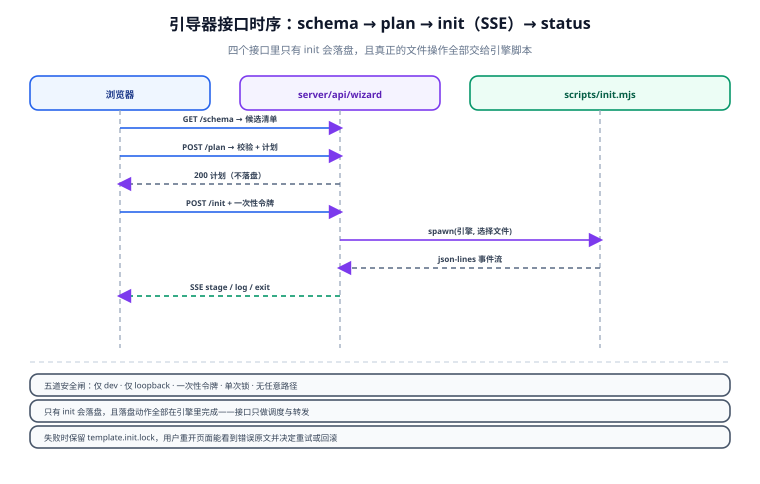

# 引导器服务端与安全边界

引导器最容易被低估的部分不是界面，而是**服务端**：它要在一个「用户自己的机器上、以用户权限运行的应用」里，接受来自浏览器的指令去**删文件、装依赖**。这类能力一旦没有边界，就是一个本地提权入口。

本篇讲四个接口的职责划分、校验怎么做成机械可判，以及五道安全闸。



## 1. 四个接口的分工

| 接口 | 方法 | 职责 | 是否落盘 | 幂等 |
| --- | --- | --- | --- | --- |
| `/api/wizard/schema` | GET | 返回候选清单（读 `options.json`） | ❌ | ✅ |
| `/api/wizard/plan` | POST | 校验选择 + 计算变更计划 | ❌ | ✅ |
| `/api/wizard/init` | POST | 调度引擎执行，SSE 推进度 | ✅（引擎负责） | ❌（单次） |
| `/api/wizard/status` | GET | 返回锁状态与上一次执行结果 | ❌ | ✅ |

::: info 为什么 `plan` 必须独立存在
如果只保留 `init`，用户点下按钮之前**永远不知道会发生什么**——而这恰好是本方案最需要透明的地方（要删 7 个文件、要装 12 个依赖、要改 3 个配置区间）。把计划计算抽成纯函数（输入选择 → 输出计划，无副作用），还能让「预览」与「执行」共用同一份逻辑，从根上杜绝「说一套做一套」。
:::

## 2. `/api/wizard/schema`：只读候选清单

```ts [server/api/wizard/schema.get.ts]
import options from '~/server/utils/wizard/options.json';

export default defineEventHandler(() => {
  // 只回传前端需要的字段，rules 也一并回传便于前端做即时反馈
  return {
    version: options.version,
    groups: options.groups,
    rules: options.rules,
  };
});
```

两个要点：

1. **回传整份规则**，前端才能做即时提示；但前端**不承担校验责任**——它只是提前告诉用户，最终判据仍在服务端（见第 4 节）。
2. **不回传任何文件系统信息**（不暴露仓库绝对路径、不暴露当前磁盘状态）。引导页不需要知道这些，回传只会扩大攻击面。

## 3. `/api/wizard/plan`：校验 + 出计划

计划的形状是固定的，字段少但每个都有用途：

```ts [shared/wizard/types.ts]
export interface InitPlan {
  selection: Selection;                 // 归一化后的选择（补全默认值）
  lockfile: 'pnpm' | 'npm';             // 包管理器
  deps: string[];                       // 去重后的运行时依赖
  devDeps: string[];                    // 去重后的开发依赖
  modules: string[];                    // 写入 TEMPLATE:MODULES 区间的模块
  cssEntries: string[];                 // 写入 TEMPLATE:CSS 区间的样式入口
  deleteFiles: string[];                // 白名单删除清单（引导器 + 选项声明文件）
  keepFiles: string[];                  // 明确保留的引导期文件（即引擎与基线）
  removeDeps: string[];                 // 需要从 package.json 移除的引导期依赖（当前为空集）
  conflicts: Array<{ level: RuleLevel; message: string }>;
}
```

```ts [server/api/wizard/plan.post.ts]
import { normalizeSelection, validateSelection, buildPlan } from '~/server/utils/wizard/validate';

export default defineEventHandler(async (event) => {
  const body = await readBody<{ selection: Selection }>(event);
  if (!body?.selection) {
    throw createError({ statusCode: 400, statusMessage: '缺少 selection' });
  }

  const selection = normalizeSelection(body.selection);
  const conflicts = validateSelection(selection);

  if (conflicts.some(c => c.level === 'block')) {
    throw createError({
      statusCode: 422,
      statusMessage: '选择存在阻断级冲突',
      data: { conflicts },
    });
  }

  return { plan: buildPlan(selection), conflicts };
});
```

### 3.1 归一化的三个动作

| 动作 | 例子 | 目的 |
| --- | --- | --- |
| 补默认值 | 未传 `ui` → 取 `options.json` 的 `default` | 防止前端漏传导致产物缺项 |
| 排序 | 多选组按 `options.json` 中的声明顺序排列 | 让计划可逐字节比较（约束：可复现） |
| 去重 | 选择间重复的依赖（如 Nuxt UI 与 Tailwind 都声明 `tailwindcss`） | 避免 `package.json` 出现重复键 |

::: danger 归一化必须由服务端做
把归一化交给前端，等于把「产物的确定性」押在浏览器上。用户换了浏览器、清了 `localStorage`、或者干脆用 `curl` 调接口，产物就会不一样。**服务的输入必须自洽，不依赖客户端做任何加工。**
:::

## 4. 校验：三层，全部机械可判

校验不是「写几条 if」，而是三层顺序执行、任一层失败即拒绝：

| 层 | 检查什么 | 失败表现 |
| --- | --- | --- |
| L1 结构 | `selection` 是对象；每个键都在 `groups` 里；单选组的值在候选集内；多选组是数组 | 400 |
| L2 类型 | 单选的值为字符串、多选的值为字符串数组；长度不超过候选数 | 400 |
| L3 规则 | 遍历 `rules`，命中 `block` 即拒绝；`warn` / `info` 随响应返回 | 422（带 `conflicts`） |

```ts [server/utils/wizard/validate.ts]
import options from './options.json';

const groupMap = new Map(options.groups.map(g => [g.key, g]));

export function normalizeSelection(raw: Selection): Selection {
  const out: Selection = {};
  for (const group of options.groups) {
    const value = raw[group.key] ?? group.default;
    if (group.multiple) {
      const list = Array.isArray(value) ? value : [value];
      const order = group.options.map(o => o.value);
      out[group.key] = [...new Set(list)].sort((a, b) => order.indexOf(a) - order.indexOf(b));
    }
    else {
      out[group.key] = Array.isArray(value) ? value[0] : value;
    }
  }
  return out;
}

/** L1 + L2：结构白名单。任何不在候选集里的值一律拒绝，不做「猜测用户意图」。 */
export function assertShape(selection: Selection) {
  for (const [key, value] of Object.entries(selection)) {
    const group = groupMap.get(key);
    if (!group) throw new Error(`未知分组：${key}`);
    const allowed = new Set(group.options.map(o => o.value));
    const values = Array.isArray(value) ? value : [value];
    if (!group.multiple && Array.isArray(value)) throw new Error(`${key} 不接受多选`);
    for (const v of values) {
      if (!allowed.has(v)) throw new Error(`${key} 的值非法：${v}`);
    }
  }
}

/** L3：规则匹配。命中即收集，由调用方按 level 决定拒绝还是提示。 */
export function validateSelection(selection: Selection) {
  const hits: Array<{ level: RuleLevel; message: string }> = [];
  for (const rule of options.rules) {
    const matched = Object.entries(rule.when).every(([key, expect]) => {
      const actual = selection[key];
      return Array.isArray(expect)
        ? (Array.isArray(actual) ? actual.some(v => expect.includes(v)) : expect.includes(actual))
        : actual === expect;
    });
    if (matched) hits.push({ level: rule.level, message: rule.message });
  }
  return hits;
}
```

::: warning `assertShape` 与 `normalizeSelection` 的顺序不能反
归一化会**补默认值**，如果先补再校验，一个非法输入可能被默认值「洗白」成一个合法组合，让人误以为校验通过了。正确顺序永远是：**先断言输入形状合法 → 再归一化 → 再跑规则**。
:::

## 5. `/api/wizard/init`：只做调度，不干活

这是全项目**最需要注意职责边界**的一个文件：

```ts [server/api/wizard/init.post.ts]
export default defineEventHandler(async (event) => {
  assertWizardAllowed(event);          // 五道安全闸，见第 6 节

  const { selection } = await readBody<{ selection: Selection }>(event);
  const normalized = normalizeSelection(selection);
  const conflicts = validateSelection(normalized);
  if (conflicts.some(c => c.level === 'block')) {
    throw createError({ statusCode: 422, statusMessage: '选择存在阻断级冲突', data: { conflicts } });
  }

  // 只调度：把归一化后的选择写进临时文件，然后拉起引擎并转发它的输出
  return streamInit(event, { selection: normalized });
});
```

```ts [server/utils/wizard/stream.ts]
import { spawn } from 'node:child_process';
import { mkdtemp, writeFile } from 'node:fs/promises';
import { tmpdir } from 'node:os';
import { join } from 'node:path';

export async function streamInit(event: H3Event, { selection }: { selection: Selection }) {
  const dir = await mkdtemp(join(tmpdir(), 'nuxt-init-'));
  const planFile = join(dir, 'selection.json');
  await writeFile(planFile, JSON.stringify(selection, null, 2), 'utf8');

  setSSEHeaders(event);
  const child = spawn(process.execPath, [
    'scripts/init.mjs',
    '--selection', planFile,
    '--json-lines',                    // 每行一条 JSON，便于前端解析
  ], { cwd: process.cwd(), stdio: ['ignore', 'pipe', 'pipe'] });

  const send = (line: string) => event.node.res.write(`data: ${line}\n\n`);
  child.stdout.on('data', chunk => String(chunk).split('\n').filter(Boolean).forEach(send));
  child.stderr.on('data', chunk => String(chunk).split('\n').filter(Boolean).forEach(
    line => send(JSON.stringify({ type: 'log', level: 'error', line })),
  ));

  await new Promise<void>((resolve) => {
    child.on('close', (code) => {
      send(JSON.stringify({ type: 'exit', code }));
      event.node.res.end();
      resolve();
    });
  });
}
```

::: danger 接口里绝不能出现的三类操作

1. **不要在 handler 里直接 `fs.rm` / `fs.writeFile` 改仓库文件。**接口是 HTTP 入口，一旦它自己动文件，「不经过界面的初始化」就无法复现、无法测试、无法审计。所有文件操作必须在 `scripts/init.mjs` 里。
2. **不要把用户输入拼进路径。**选择里只有**枚举值**（`element-plus`、`sass`），文件路径由 `options.json` 的 `files` 字段给出，永远是常量。任何形如 `join(repoRoot, body.path)` 的写法都是路径穿越漏洞。
3. **不要用 `exec` / `execSync` 拼 shell 字符串。**包管理器的调用必须是 `spawn(manager, ['add', ...deps])` 的形式，参数以数组传递。用户能控制的部分（`deps`）在服务端已经过白名单校验，但仍不应经过 shell。
:::

## 6. 五道安全闸

引导器是一个**能删文件、能装依赖**的本地服务。五道闸依次收紧：

| # | 闸门 | 判据 | 不通过的后果 |
| --- | --- | --- | --- |
| 1 | **仅开发模式** | `import.meta.dev` 为真 | 生产构建里这些接口根本不存在（被 tree-shake） |
| 2 | **仅本机访问** | 请求来源 IP 为 `127.0.0.1` / `::1` | 局域网内其他机器无法触发初始化 |
| 3 | **一次性令牌** | 页面加载时由服务端生成 token 注入 HTML，请求需带同名 header | 阻止 CSRF（恶意网页无法读取 token） |
| 4 | **单次初始化锁** | 存在 `template.init.lock` 时拒绝再次执行 | 防止并发执行导致半删状态 |
| 5 | **无任意路径** | 所有路径来自 `options.json` 常量 + 引擎内置白名单 | 杜绝路径穿越 |

```ts [server/utils/wizard/guard.ts]
import { existsSync } from 'node:fs';
import { resolve } from 'node:path';

const LOCK_FILE = resolve(process.cwd(), 'template.init.lock');

export function assertWizardAllowed(event: H3Event) {
  // 闸 1：仅开发模式
  if (!import.meta.dev) {
    throw createError({ statusCode: 404, statusMessage: 'Not Found' });
  }

  // 闸 2：仅本机
  const remote = getRequestIP(event, { xForwardedFor: false });
  if (remote && !['127.0.0.1', '::1', '::ffff:127.0.0.1'].includes(remote)) {
    throw createError({ statusCode: 403, statusMessage: '初始化只能在运行开发服务的本机执行' });
  }

  // 闸 3：一次性令牌（token 由 dev 插件生成并注入页面）
  const expected = getWizardToken();
  const actual = getHeader(event, 'x-wizard-token');
  if (!expected || actual !== expected) {
    throw createError({ statusCode: 403, statusMessage: '令牌校验失败，请刷新页面后重试' });
  }

  // 闸 4：单次锁
  if (existsSync(LOCK_FILE)) {
    throw createError({
      statusCode: 409,
      statusMessage: '检测到正在执行或已执行未清理的初始化（template.init.lock），请先查看 /api/wizard/status',
    });
  }
}
```

::: tip 闸 3 的令牌怎么进页面
在 `app/pages/setup/index.vue` 里用 `useRequestHeaders(['x-wizard-token'])`，配合一个 dev-only 的 Nitro 插件，在 HTML 首次渲染时把服务端生成的随机 token 注入到 `nuxtApp.payload` 里。这样令牌**不会被任何跨站页面读到**（CSRF 场景下攻击者读不到响应体），而正常页面能拿到。
:::

::: danger 不要用「判断 referer」代替令牌
`referer` 可以被伪造，且在 `Referrer-Policy: no-referrer` 下会是空值。同理，`Origin` 头只能防跨站表单提交，防不了「同源内的恶意 script」。真正的判据是**服务端生成的、只出现在渲染结果里的一次性随机值**。
:::

## 7. 锁、进度与失败处理

### 7.1 锁的生命周期

```text
页面加载 ──► 无锁
点「初始化」──► 引擎写入 template.init.lock（含 pid、开始时间、选择快照）
执行中 ──► /api/wizard/status 返回 { running: true, stage: 'install' }
成功 ──► 引擎删除锁，写 template.config.json
失败 ──► 引擎**保留**锁，并在锁文件里追加 error 字段
```

::: warning 失败时为什么保留锁
如果失败就删锁，用户重开页面会看到一个「什么都没发生」的界面，再次点击——而仓库可能已经处于「删了一半」的状态。保留锁 + `status` 接口回传错误原文，用户才知道该走「重试」还是「回滚」。引擎的 `--rollback` 会按锁文件里的快照恢复，见 [初始化引擎](../InitEngine/index.md)。
:::

### 7.2 进度事件协议

SSE 每行是一条独立 JSON，前端按 `type` 分派：

| `type` | 字段 | 前端表现 |
| --- | --- | --- |
| `stage` | `index`、`total`、`name` | 更新步骤条（如「3/5 删除引导器」） |
| `log` | `level`、`line` | 追加一行日志（可折叠） |
| `plan` | `plan` | 展示最终计划（用于核对与预览一致） |
| `error` | `message`、`stage` | 红条 + 原始输出 |
| `exit` | `code` | 收尾：`0` 显示完成摘要，非 `0` 显示失败与重试入口 |

## 8. 验证方式

```shell
# 先启动 dev 服务
pnpm dev

# ① 未带令牌 → 403
curl -s -o /dev/null -w '%{http_code}\n' -X POST http://localhost:3000/api/wizard/plan \
  -H 'content-type: application/json' -d '{"selection":{}}'
# 期望：403

# ② 取令牌（从页面 HTML 里抓）
TOKEN=$(curl -s http://localhost:3000/setup | grep -o 'wizardToken":"[^"]*' | cut -d'"' -f3)
echo "$TOKEN"

# ③ 正常出计划 → 200
curl -s -X POST http://localhost:3000/api/wizard/plan \
  -H 'content-type: application/json' -H "x-wizard-token: $TOKEN" \
  -d '{"selection":{"ui":"element-plus","preprocessor":"sass","atomic":"none","render":"ssr"}}' \
  | head -c 400
# 期望：JSON 里 deps 含 element-plus、devDeps 含 @element-plus/nuxt 与 sass-embedded，deleteFiles 非空

# ④ 非法枚举值 → 400
curl -s -o /dev/null -w '%{http_code}\n' -X POST http://localhost:3000/api/wizard/plan \
  -H 'content-type: application/json' -H "x-wizard-token: $TOKEN" \
  -d '{"selection":{"ui":"../../etc/passwd"}}'
# 期望：400

# ⑤ 阻断级冲突 → 422
curl -s -o /dev/null -w '%{http_code}\n' -X POST http://localhost:3000/api/wizard/plan \
  -H 'content-type: application/json' -H "x-wizard-token: $TOKEN" \
  -d '{"selection":{"ui":"nuxt-ui","atomic":"unocss"}}'
# 期望：422

# ⑥ 生产构建后这些接口应不存在
pnpm build && pnpm preview
curl -s -o /dev/null -w '%{http_code}\n' http://localhost:3000/api/wizard/schema
# 期望：404
```

## 相关页面

- [引导页：信息架构与选择模型](../WizardFrontend/index.md)：这份模型在前端怎么呈现
- [初始化引擎：自删除与依赖安装](../InitEngine/index.md)：被调度的引擎如何执行五阶段
- [验收与上线检查](../Acceptance/index.md)：把上面的验证命令固化成清单
- [Nuxt 全栈开发 · 服务端能力](../../../../docs/Frontend/Frame/Nuxt/ServerRoute/index.md)：**分工是**——那边讲 Server Routes 与中间件的框架用法（`defineEventHandler`、`runtimeConfig`、服务端中间件），本页讲怎么用这套能力做一个**只能在本机执行**的初始化调度器（五道安全闸、SSE 进度、单次锁）

## 参考资料

- Nitro / h3 事件处理与 `createError`：[h3.dev](https://h3.dev/)
- Nuxt 服务端目录与服务端工具自动导入：[nuxt.com/docs/guide/directory-structure/server](https://nuxt.com/docs/guide/directory-structure/server)
- Server-Sent Events 规范：[MDN · SSE](https://developer.mozilla.org/en-US/docs/Web/API/Server-sent_events)
- Node.js 子进程最佳实践（避免 shell 拼串）：[nodejs.org/api/child_process](https://nodejs.org/api/child_process.html)
