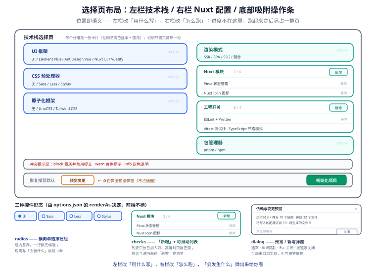
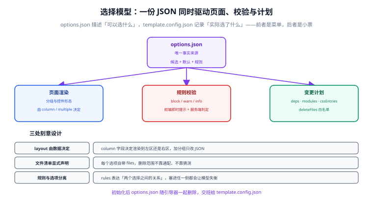

# 引导页：信息架构与选择模型

引导页要做两件事，而且必须同时做对：**看起来很直观**（用户三十秒内能选完），**模型上没有歧义**（后端拿到的选择一定能被机器校验）。前者靠布局，后者靠一份唯一的选择模型。



## 1. 信息架构

页面是严格的**三区结构**，位置即语义——左侧改变「用什么写」，右侧改变「怎么跑」：

| 区 | 分组 | 控件 | 默认值 | 影响面 |
| --- | --- | --- | --- | --- |
| 左 | UI 框架 | 单选卡片 ×5（无 / Element Plus / Ant Design Vue / Nuxt UI / Vuetify） | 无 | 依赖 + 自动导入配置 + 样式入口 |
| 左 | CSS 预处理器 | 单选 ×4（无 / Sass / Less / Stylus） | 无 | 依赖 + 组件内样式语言 + Stylelint 配置 |
| 左 | 原子化框架 | 单选 ×3（无 / UnoCSS / Tailwind CSS） | 无 | 依赖 + 构建插件 + 样式入口优先级 |
| 右 | 渲染模式 | 单选 ×4（SSR / SPA / SSG / 混合） | SSR | `ssr` 开关 + `routeRules` + 部署形态 |
| 右 | 模块 | 多选 ×6（Pinia / VueUse / i18n / Icon / Image / SEO） | Pinia、Icon | `modules` 数组 |
| 右 | 工程 | 多选 + 单选混合（ESLint、测试栈、TS 严格度、包管理器、Docker） | ESLint、测试栈、严格 TS | 依赖 + 配置文件 |

::: tip 为什么「渲染模式」放在右侧而不是左侧
左侧三个维度是**技术栈身份**——选完基本不会再改，团队之间差异最大。右侧是**运行形态与工程配置**——同一个团队的不同项目会不一样，也可能初始化后再手动调整。把「身份」和「配置」分区，用户的心智负担最小。
:::

### 1.1 每个控件的呈现规则

| 控件形态 | 用于 | 交互 |
| --- | --- | --- |
| 卡片单选 | UI 框架、预处理器、原子化、渲染模式 | 整卡可点，选中态有边框 + 底色 + 角标；卡片内含一行「会装什么」 |
| 复选行 | 模块、工程开关 | 左侧复选框，右侧标题 + 一行说明；勾选后展开「附带文件」提示 |
| 下拉单选 | 包管理器、TS 严格度 | 选项少但有 3 个以上取值时用下拉，避免卡片占位 |
| 只读预览 | 最终依赖列表 | 底部折叠区，实时汇总「将要安装的依赖」 |

### 1.2 「会装什么」必须写在卡片上

每张卡片底部显示一行小字，例如 Element Plus 卡片显示「`element-plus` + 自动导入 + 中文语言包」。原因是**选择成本主要来自不确定**——用户不是不知道该选哪个，而是不知道选了会带来什么。

## 2. 选择模型：`options.json`

所有可选项、默认值、依赖映射、冲突规则，全部写在服务端的**一个 JSON 文件**里。前端不硬编码任何选项，而是启动时 `GET /api/wizard/schema` 拿。



### 2.1 模型结构

```json [server/utils/wizard/options.json]
{
  "version": "1.0.0",
  "groups": [
    {
      "key": "ui",
      "label": "UI 框架",
      "column": "left",
      "multiple": false,
      "default": "none",
      "options": [
        {
          "value": "none",
          "label": "不使用组件库",
          "desc": "纯手写 CSS 与原生元素",
          "deps": [],
          "files": [],
          "note": "体积最小，适合内容型站点"
        },
        {
          "value": "element-plus",
          "label": "Element Plus",
          "desc": "国内生态最全的 Vue 3 组件库",
          "deps": ["element-plus"],
          "devDeps": ["@element-plus/nuxt"],
          "modules": ["@element-plus/nuxt"],
          "files": ["app/assets/styles/ui-element-plus.css"],
          "note": "会装 element-plus + 自动导入模块"
        }
      ]
    }
  ],
  "rules": [
    {
      "level": "block",
      "when": { "ui": "nuxt-ui", "atomic": "unocss" },
      "message": "Nuxt UI 自带 Tailwind CSS 与语义色系统，与 UnoCSS 同时使用会导致工具类解析冲突。请把原子化框架改为「Tailwind CSS」或「不使用」。"
    }
  ]
}
```

::: info 三处刻意设计
1. **`column` 字段决定渲染到左区还是右区**——布局不是写死在模板里的，加一个新分组只改 JSON。
2. **`files` 字段声明本选项需要额外生成/删除的文件**——引擎据此执行删除白名单，不靠通配。见 [初始化引擎](../InitEngine/index.md)。
3. **`rules` 与选项分离**——规则表达的是「两个选择之间的关系」，塞进任一侧的选项里都会让模型失衡。规则引擎实现见 [引导器服务端](../WizardBackend/index.md)。
:::

### 2.2 类型定义（前后端共享）

```ts [app/utils/wizard/option-model.ts]
export type Column = 'left' | 'right';
export type RuleLevel = 'block' | 'warn' | 'info';

export interface OptionItem {
  value: string;
  label: string;
  desc: string;
  note?: string;
  deps?: string[];
  devDeps?: string[];
  modules?: string[];
  files?: string[];
}

export interface OptionGroup {
  key: string;
  label: string;
  column: Column;
  multiple: boolean;
  default: string | string[];
  options: OptionItem[];
}

export interface Rule {
  level: RuleLevel;
  when: Record<string, string | string[]>;
  message: string;
}

export interface WizardSchema {
  version: string;
  groups: OptionGroup[];
  rules: Rule[];
}

export type Selection = Record<string, string | string[]>;
```

::: warning 这个文件是「类型 only」的
`app/utils/wizard/` 整个目录会随引导器删除，所以这里**只能放类型与常量**。一旦写入运行时函数，删除后就会留下断掉的 import。共享的运行时逻辑放 `shared/` 目录（Nuxt 4 的共享层，客户端与服务端都能用）。
:::

## 3. 从模型到表单

渲染规则很直白，不需要写复杂抽象：

| `multiple` | 选项数 | 控件 |
| --- | --- | --- |
| `false` | ≤ 6 | 卡片单选组 |
| `false` | > 6 | 原生 `<select>` |
| `true` | 任意 | 复选行列表 |

```vue [app/components/wizard/OptionGroup.vue]
<script setup lang="ts">
import type { OptionGroup, Selection } from '~/utils/wizard/option-model';

const props = defineProps<{
  group: OptionGroup;
  modelValue: Selection;
  blocked: Set<string>;   // 被 block 规则命中的选项 value 集合
}>();
const emit = defineEmits<{ 'update:modelValue': [Selection] }>();

const current = computed(() => props.modelValue[props.group.key]);

function pick(value: string) {
  if (props.blocked.has(value)) return;
  emit('update:modelValue', { ...props.modelValue, [props.group.key]: value });
}

function toggle(value: string, checked: boolean) {
  const list = Array.isArray(current.value) ? [...current.value] : [];
  const next = checked ? [...new Set([...list, value])] : list.filter(v => v !== value);
  emit('update:modelValue', { ...props.modelValue, [props.group.key]: next });
}
</script>

<template>
  <fieldset class="group">
    <legend>{{ group.label }}</legend>

    <template v-if="!group.multiple">
      <label
        v-for="opt in group.options"
        :key="opt.value"
        class="card"
        :class="{ 'is-active': current === opt.value, 'is-blocked': blocked.has(opt.value) }"
      >
        <input
          type="radio"
          :name="group.key"
          :value="opt.value"
          :checked="current === opt.value"
          :disabled="blocked.has(opt.value)"
          @change="pick(opt.value)"
        >
        <strong>{{ opt.label }}</strong>
        <span class="desc">{{ opt.desc }}</span>
        <span v-if="opt.note" class="note">{{ opt.note }}</span>
      </label>
    </template>

    <template v-else>
      <label v-for="opt in group.options" :key="opt.value" class="row">
        <input
          type="checkbox"
          :value="opt.value"
          :checked="Array.isArray(current) && current.includes(opt.value)"
          :disabled="blocked.has(opt.value)"
          @change="toggle(opt.value, ($event.target as HTMLInputElement).checked)"
        >
        <span>
          <strong>{{ opt.label }}</strong>
          <span class="desc">{{ opt.desc }}</span>
        </span>
      </label>
    </template>
  </fieldset>
</template>
```

::: tip 为什么用原生 `<input type="radio|checkbox">`
① 键盘导航、屏幕阅读器语义、表单可访问性全部白送；② 不依赖任何组件库，符合「引导期零依赖」；③ 初始化后这些组件会被删除，不值得为它引入依赖。样式靠 `:checked + 兄弟选择器` 与 `:has()` 完成。
:::

## 4. 三层规则：阻断 / 警告 / 提示

`rules` 里的 `level` 决定页面行为，**只有 `block` 会禁用「初始化项目」按钮**：

| level | 语义 | 页面表现 | 能否提交 |
| --- | --- | --- | --- |
| `block` | 组合会导致构建失败或运行冲突 | 冲突卡片置灰、卡片下方红字说明、底部按钮禁用并提示「有 N 项冲突」 | ❌ |
| `warn` | 能跑，但有冗余或体积代价 | 黄色提示条，列出「为什么冗余、建议怎么改」 | ✅ |
| `info` | 纯粹的知识性说明 | 灰色提示条 | ✅ |

### 4.1 典型规则清单

| 组合 | level | 理由 |
| --- | --- | --- |
| Nuxt UI + UnoCSS | `block` | Nuxt UI 基于 Tailwind v4，两套工具类解析器会互相覆盖 |
| Nuxt UI + Tailwind CSS | `info` | Tailwind 由 Nuxt UI 自带，显式选上只是确认，不重复安装 |
| Nuxt UI + Sass | `warn` | Tailwind 4 自身不依赖 Sass，但两者共存需注意 `@import` 顺序 |
| Vuetify + Tailwind | `warn` | Vuetify 自带大量基础样式与 Tailwind 的 preflight 会相互影响，需手动调整 |
| Tailwind + UnoCSS | `block` | 两个原子化引擎同时生效，产出重复且不可预测 |
| 预处理器 = 无 + 原子化 = 无 | `info` | 纯 CSS 方案，组件内样式写在 `<style scoped>` 里 |
| SSG + i18n | `info` | 需为每种语言生成路由，构建时间与页面数成倍 |
| SPA + SEO 模块 | `warn` | SPA 下 SEO 模块能力受限，建议改用 SSR |
| UI 框架 = 无 + Icon 模块 | `info` | Nuxt Icon 可独立使用，和组件库无关 |

::: danger 规则必须双向可读
每条 `message` 都要写清「**为什么冲突**」和「**怎么改**」，只写「不能同时选」等于让用户猜。上面 Nuxt UI + UnoCSS 的文案就是范本：说清原因（工具类解析冲突）+ 给出两条出路。
:::

## 5. 选择页状态机

引导页不是「一个表单 + 一个按钮」，它有明确的状态迁移：

```text
idle ──(加载 schema)──► selecting ──(点「预览变更」)──► planned
   ▲                        │                            │
   │                        │(改任一选项)                 │(点「初始化项目」)
   └────────────────────────┘                            ▼
                                                     running ──► done
                                                        │
                                                        └──► failed（可重试，进度保留）
```

| 状态 | 页面表现 | 可做的事 |
| --- | --- | --- |
| `selecting` | 三区表单可编辑，底部按钮为「初始化项目」但点击先出计划 | 改选项 |
| `planned` | 折叠区展开「将安装的依赖 / 将删除的文件 / 将写入的配置」 | 确认或回退 |
| `running` | 表单整体 `disabled`，进度面板接管（五阶段 + 日志行） | 只能等或中断 |
| `done` | 显示完成摘要 + 下一步命令（`pnpm dev`） | 打开首页 |
| `failed` | 显示失败的阶段、错误原文、可回滚提示 | 重试 / 联系维护者 |

::: warning 用户离开页面时必须拦
从点下「初始化项目」到跑完，中间会删除文件并安装依赖。此时若用户关闭标签页，**半成品仓库是最难排查的状态**。做法：`running` 状态下注册 `beforeunload`（导航离开警告），同时在服务端把「已开始执行」写成文件标记 `template.init.lock`——即使页面关了，重开也能看到进度与结论。
:::

## 6. 交互细节清单

这些细节不做不算错，做了体验会明显不同：

| 细节 | 做法 | 收益 |
| --- | --- | --- |
| **默认值就是推荐组合** | 默认 `无 UI / 无预处理器 / 无原子化 / SSR / Pinia + Icon / ESLint + 测试` | 直接点「初始化」也能得到能跑的工程 |
| **选择状态可分享** | 把 `Selection` 序列化进 URL query（如 `?ui=element-plus&css=sass`） | 同事之间可以发链接对齐技术栈 |
| **本地记住上次选择** | `localStorage` 存上一次的 `Selection` | 重复初始化第二个项目时省事 |
| **实时依赖预览** | 底部折叠区展示去重后的依赖清单与大致数量 | 用户对「会装多少东西」有预期 |
| **计划与实际一致** | 「预览变更」调用的接口和「初始化」是同一份 `plan` 计算 | 不会出现「说删 7 个文件、实际删了 9 个」 |
| **错误原文不美化** | 失败时展示引擎的原始输出（可折叠） | 排障时这行字比任何友好文案都有用 |
| **`prefers-reduced-motion`** | 进度动效在系统设置「减少动态效果」时关闭 | 可访问性 |
| **键盘全可达** | Tab 顺序 = 左区 → 右区 → 底部按钮；`Enter` 提交 | 可访问性 |

## 7. 组件清单

| 组件 | 职责 | 删除时机 |
| --- | --- | --- |
| `OptionGroup.vue` | 渲染一个分组的控件（卡片 / 下拉 / 复选行） | 初始化时删除 |
| `NuxtConfigPanel.vue` | 右区容器 + 模块与工程开关 | 初始化时删除 |
| `ConflictHint.vue` | 三层规则的呈现（红/黄/灰） | 初始化时删除 |
| `DependencyPreview.vue` | 实时依赖清单 | 初始化时删除 |
| `ProgressStream.vue` | 消费 SSE，渲染五阶段进度与日志 | 初始化时删除 |
| `useWizard.ts` | 状态机与接口调用 | 初始化时删除 |

## 8. 验证方式

```shell
pnpm dev
# ① 打开 http://localhost:3000/setup
#    期望：左区三个分组、右区三个分组、底部按钮齐备；未加载 schema 时显示骨架态

# ② 制造一个 block 冲突：UI 选 Nuxt UI、原子化选 UnoCSS
#    期望：两张卡片置灰 + 红字说明 + 底部按钮禁用并显示「有 1 项冲突」

# ③ 改成 UI = Nuxt UI、原子化 = Tailwind CSS
#    期望：冲突消失，提示条变为 info（说明 Tailwind 已随 Nuxt UI 安装）

# ④ 点「预览变更」
#    期望：折叠区列出 deps / devDeps / 将删除文件 / 将写入的 marker 区间键名

# ⑤ 键盘操作
#    期望：Tab 可遍历全部控件，焦点环清晰，Enter 能触发预览
```

## 相关页面

- [引导器服务端与安全边界](../WizardBackend/index.md)：这份模型由谁校验、怎么变成计划
- [技术栈矩阵与组合兼容](../StackMatrix/index.md)：规则清单背后的完整依赖映射
- [零依赖引导期骨架](../Bootstrap/index.md)：这些组件与样式的落盘位置

## 参考资料

- 表单与可访问性基线：[MDN · Form accessibility](https://developer.mozilla.org/en-US/docs/Web/Accessibility/Guides/Forms)
- `prefers-reduced-motion`：[MDN](https://developer.mozilla.org/en-US/docs/Web/CSS/@media/prefers-reduced-motion)
- Vue 3 组合式 API（`computed` / `defineProps`）：[vuejs.org](https://vuejs.org/api/sfc-script-setup.html)
