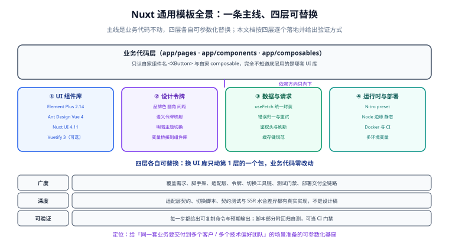

# Nuxt 通用模板

<p style="text-align:center;"></p>

一个把 **UI 组件库当作可替换零件**的 Nuxt 4 工程模板：同一套业务代码，改一个配置项就能在 **Element Plus / Ant Design Vue / Nuxt UI / Vuetify** 之间切换，业务页面**一行不改**。本文档按「从 0 到 1」的顺序把它做出来——每一步都有完整文件内容、完整命令与可验证的收尾。

::: warning 本项目只有文档，没有代码
`project/` 是**纯文档目录**：下面所有章节讲的都是「这个项目怎么做出来」——目录结构、配置内容、代码片段、命令与判据全部写在正文里，但**仓库不存放源码、脚本、SQL 与构建文件**。
正文里出现「运行 `xxx`」时，指的是**先在你的工程里按本节内容创建好该文件**，再执行。
:::



::: tip 一句话理解
传统模板把组件库焊死在业务里，换库等于全站重构。本模板在第 2 层加了一层**契约**：业务只说自己要什么（`<XButton type="primary" :loading>`），由实现层翻译成当前组件库的写法。换库改的是翻译表，不是业务。
:::

## 目录结构

### 目标与边界

- [需求与可插拔边界](Requirement/index.md)

### 从 0 到 1 的七步

- [第 1 步：脚手架与工程规约](Scaffold/index.md)
- [第 2 步：UI 适配层设计](AdapterDesign/index.md)
- [第 3 步：三套内置适配器](Adapters/index.md)
- [第 4 步：设计令牌与主题桥接](DesignToken/index.md)
- [第 5 步：切换工具链与多形态构建](SwitchTooling/index.md)
- [第 6 步：测试与门禁](Testing/index.md)
- [第 7 步：部署与交付](Deployment/index.md)

### 收尾

- [常见问题与反模式](FAQ/index.md)
- [构建进展记录](Progress/index.md)

::: info 版本基线（2026-09-30 核对）
- **Nuxt 4.5.2**（2026-08-05 发布）为当前稳定主线；Nuxt 4 于 2025-07-16 首发，Nuxt 4.5 已升级到 **Vite 8**、unhead v3、unctx v3。
- **Nuxt 3 已于 2026-07-31 结束官方支持（EOL）**，新项目直接使用 Nuxt 4；本文档不覆盖 Nuxt 3 的写法差异。
- Nuxt 4 的关键约定：前端代码收进 `app/`（`app/pages`、`app/components`、`app/composables`），服务端代码留在 `server/`，前后端共享代码放 `shared/`。
- 组件库版本：Element Plus **2.14.x**、Ant Design Vue **4.x**、Nuxt UI **4.11.x**（Nuxt ≥ 4.1 + Tailwind CSS 4）、Vuetify **3.x**（其 Nuxt 模块仍为 `1.0.0-rc.5`，本文档把它标为实验性）。
- 版本会变：升级前请以各项目官方发布页为准，本文档中的版本仅代表 2026-09 的核对结果。
:::

## 四个 UI 实现层

| 实现层 | 组件库 | Nuxt 模块 | 模块状态 | 适合的场景 |
| --- | --- | --- | --- | --- |
| `@app/ui-element` | Element Plus 2.14.x | `@element-plus/nuxt` 1.1.x | 稳定 | 表单密集的中后台 |
| `@app/ui-antd` | Ant Design Vue 4.x | `@ant-design-vue/nuxt` 1.4.x | 稳定 | 复杂表格与企业管理台 |
| `@app/ui-nuxtui` | Nuxt UI 4.11.x | `@nuxt/ui` 4.11.x | 稳定 | 内容站、追求与框架原生融合 |
| `@app/ui-vuetify` | Vuetify 3.x | `vuetify-nuxt-module` 1.0.0-rc.5 | **实验性** | Material 风格产品 |

::: warning 说明
表格里「模块状态」这一列不是装饰。Vuetify 的 Nuxt 模块仍在 rc 阶段，小版本之间可能改变 SSR 行为——而 UI 层恰恰是「换掉就要全站回归」的那一层。模板因此把它设为**默认拒绝**：想用必须显式加 `--allow-experimental`，并接受版本锁死。详见[第 5 步：切换工具链](SwitchTooling/index.md)。
:::

## 每个实现层都要满足同一份契约

业务层能「一行不改」，靠的不是约定，而是四件事在四个实现里完全一致：

| 契约 | 内容 | 换库时的验收表现 |
| --- | --- | --- |
| 组件名 | `<XButton>`、`<XTable>`、`<XModal>` 等自有前缀组件 | 业务模板里的标签一个字符都不变 |
| Props 语义 | `type` / `loading` / `rows` / `columns` 等按业务命名，不透传组件库私有 props | 业务里不出现 `el-` / `a-` / `v-` 前缀 |
| 命令式 API | `toast` / `confirm` / `loading` 从统一出口调用 | 业务不 import 任何组件库的 Message/Modal |
| 令牌 | 业务只写 `--ui-color-primary`，组件库变量在生成文件里映射 | 换库后品牌色、圆角、字号不变 |

## 与其他文档的分工

库内已有几篇相邻内容，本模板与它们的边界如下：

| 文档 | 讲什么 | 与本模板的关系 |
| --- | --- | --- |
| [Nuxt 全栈开发](../../../docs/Frontend/Frame/Nuxt/index.md) | Nuxt 框架本身：渲染模式、数据获取、Server Routes、部署 | **框架能力**来源；本模板不重复讲框架，只讲工程化装配 |
| [Vue3 模板 · 组件库集成](../Vue3Template/ComponentLibrary/index.md) | Vite + Vue 3 下的按需引入与二次封装分层 | **思路同源**；本模板把它扩展到「多库可插拔 + 运行时装配」 |
| [后端通用模板 · 技术栈可插拔](../BackendTemplate/StackSelect/index.md) | 后端安全 / ORM / 缓存三维度可插拔 + 选择器脚本 | **方法论同源**（幂等、可校验、marker 区间）；本模板是前端对应物 |
| [前端工程化](../../../docs/Frontend/Others/FrontendEngineering/index.md) | 代码规范、测试、CI 集成 | 规范细节以它为准，本模板只保留与本模板强相关的部分 |

::: danger 不要重复造这三样东西
1. **不要再写一遍 Nuxt 的路由与数据获取教程**——那是框架能力，见上面的 Nuxt 专题。
2. **不要把组件库的完整 API 抄进来**——只需要「业务契约 → 各库属性」的映射表。
3. **不要用 `runtimeConfig` 去做「运行时换 UI 库」**——同一份产物带多套库会让体积翻倍、样式互相打架，见[三种切换模式对比](AdapterDesign/index.md)。
:::

## 使用方式

```shell
# 1. 选择 UI 实现层（写入 ui.config.json 与生成物）
node scripts/ui-select.mjs --preset element-admin

# 2. 校验生成物与配置一致（可放进 CI 当门禁）
node scripts/ui-select.mjs --check

# 3. 安装依赖并启动
pnpm install
pnpm dev

# 4. 构建生产产物
pnpm build
```

预期结果：

1. `--check` 输出 `OK --check 通过：8 个生成物与 ui.config.json 完全一致` 且退出码为 0。
2. `pnpm dev` 启动后访问终端提示的地址（默认 `http://localhost:3000`），页面正常渲染、控制台无水合告警。
3. `pnpm build` 结束时产物目录中生成对应 preset 的产物（SSR 为 `.output/server`，SSG 为 `.output/public`）。

::: tip 切换器与自测要自己落地，实现写在文档第 5 步里
本站不提供可执行脚本。切换器与自测的**完整结构、关键实现与逐条判据**都在[第 5 步：切换工具链与多形态构建](SwitchTooling/index.md)，按它写进你工程的 `scripts/` 即可（零依赖，只用 Node 内置模块）：

| 文件 | 作用 |
| --- | --- |
| `scripts/ui-select.mjs` | 切换器本体：约 640 行，幂等 / 可校验 / 可回溯 |
| `scripts/selftest.mjs` | 自测：**275 项断言**，含「把脚本改坏必须报红」的变异测试 |
| `scripts/fixture/` | 自测用的最小工程，跑自测时会被复制到临时目录，**不会碰你的工程** |

```shell
node scripts/selftest.mjs        # 期望：断言 275 / 失败 0，结果 OK
```
:::

## 推荐阅读顺序

1. 先读[需求与可插拔边界](Requirement/index.md)，搞清楚**什么能换、什么不能换**——这决定了后面所有设计的取舍。
2. 再按第 1~4 步把工程与适配层搭起来，每一步都能跑起来再看下一步。
3. 然后用[第 5 步](SwitchTooling/index.md)把「换库」变成一条命令，用[第 6 步](Testing/index.md)把契约锁住。
4. 最后用[第 7 步](Deployment/index.md)交付，并把[常见问题](FAQ/index.md)当成换库当天的排障手册。

## 参考资料

- Nuxt 官方文档：https://nuxt.com/docs
- Nuxt 4 升级指南：https://nuxt.com/docs/4.x/getting-started/upgrade
- Element Plus：https://element-plus.org/zh-CN/
- Ant Design Vue：https://antdv.com/
- Nuxt UI：https://ui.nuxt.com/
- Vuetify：https://vuetifyjs.com/
