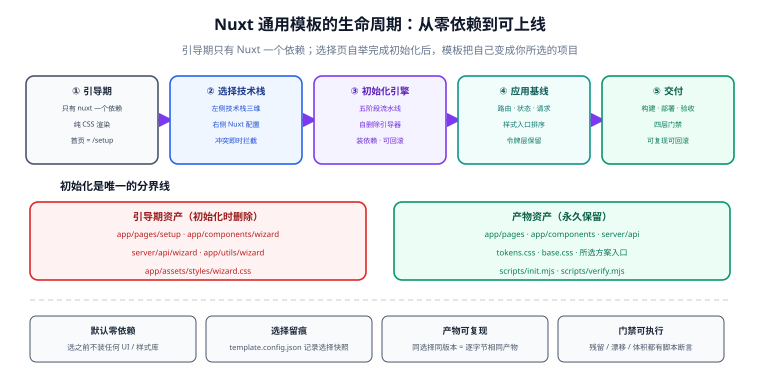

# Nuxt 通用模板

<p style="text-align:center;"></p>

一套**自带技术栈选择页**的 Nuxt 工程模板。下载下来 `pnpm install && pnpm dev`，浏览器里打开的不是业务首页，而是一个类似 **Spring Initializr** 的配置界面：左边选 UI 框架、CSS 预处理器、原子化框架，右边选渲染模式与工程配置，点「初始化项目」，模板会**把自己变成你所选的那套项目**——删掉选择页的前后端，装上你勾的依赖，留下一份干净的基线工程。

::: tip 一句话理解
市面上的模板是「先帮你选好、你再去删」；这个模板是「**先什么都不装，你自己选，它自己改**」。
:::

::: warning 本页只放文档，可运行实现在独立仓库
`project/Base/NuxtTemplate/` 下面只有 Markdown 与配图——目录结构、配置内容、代码片段、命令与判据全部写在正文里。
引导器与初始化引擎的**可运行实现**（`scripts/init.mjs`、`scripts/verify.mjs` 等）放在独立仓库里，本页不存放脚本与工程文件。
正文里出现「运行 `node scripts/xxx.mjs`」时，指的都是**你那份工程里**的文件：先按本节内容把它创建出来，再执行。
:::



## 项目定位

| 问题 | 这个模板的回答 |
| --- | --- |
| 模板里塞了用不上的依赖怎么办？ | 初始状态**只有 Nuxt 一个运行时依赖**，页面用纯 CSS 渲染，零 UI 依赖 |
| 团队技术栈不统一怎么办？ | 一个模板覆盖 UI 框架 / 预处理器 / 原子化三维组合，选择结果落进 `template.config.json` |
| 选择页本身会不会成为包袱？ | 初始化完成的一刻，选择页的**前端与后端都被删除**，仓库里不再有它的任何痕迹 |
| 初始化过程黑盒、出错了怎么办？ | 引擎是**零依赖 Node 脚本**，五阶段可 `--dry-run` 预演、可 `--check` 复核、失败可回滚 |

## 与「生成器」方案的区别

::: info 为什么不直接做一个 CLI 生成器
[后端通用模板](../BackendTemplate/TemplateCli/index.md) 走的是 CLI 生成器路线（外部工具渲染模板写新目录）。本模板**故意选择另一条路**：把选择器做进模板自身。

| | 外部 CLI 生成器 | 模板内自举（本项目） |
| --- | --- | --- |
| 用户第一步 | 装 CLI → 跑命令 → 拿到目录 | clone → `pnpm dev` → 打开网页 |
| 选择界面 | 命令行问答 | 网页表单，可实时提示冲突 |
| 谁维护选择模型 | 生成器仓库 | 模板仓库（与代码同源，天然不漂移） |
| 失败点 | 生成完才发现跑不起来 | 初始化后立刻自检，失败可回滚 |
| 代价 | 需要额外的发布与版本管理 | 选择页要在仓库里活一段时间，必须保证能自删干净 |

「自删」这条最容易被做脏的约束，在 [需求与方案定位](./Requirement/index.md) 里专门讲透。
:::

## 技术基线（2026-10-01 核对）

在**初始化之前**，仓库里只有这些东西：

| 组件 | 引导期基线 | 说明 |
| --- | --- | --- |
| 运行时 | Node.js 24 LTS（最低 22.12） | 24 为当前 Active LTS；22 已进入维护期；26 尚为 Current |
| 框架 | Nuxt 4.5.x | 当前稳定主线（Vite 8 + Nitro）；**Nuxt 3 已于 2026-07-31 EOL** |
| 包管理器 | pnpm 11.x | v11 起不再读 `package.json` 的 `pnpm` 字段，安全覆盖配置移到 `pnpm-workspace.yaml` |
| 样式 | 原生 CSS（手写令牌 + 原生布局） | 不引任何预处理器、不引任何原子化引擎 |
| 组件 | 无 | 选择页的控件是手写的原生表单元素 |
| 依赖总数 | 1（`nuxt`） | `pnpm list --prod --depth 0` 只有一行 |

**初始化之后**，依赖与配置文件由选择结果决定，见 [技术栈矩阵与组合兼容](./StackMatrix/index.md)。

## 选择维度总览

引导页左侧是**技术栈三维**，右侧是**Nuxt 与工程配置**，每一维都是「含空选项」的：

| 位置 | 维度 | 可选项 |
| --- | --- | --- |
| 左 | UI 框架 | 无 / Element Plus / Ant Design Vue / Nuxt UI / Vuetify |
| 左 | CSS 预处理器 | 无 / Sass / Less / Stylus |
| 左 | 原子化框架 | 无 / UnoCSS / Tailwind CSS |
| 右 | 渲染模式 | SSR（默认）/ SPA / SSG / 混合（routeRules） |
| 右 | 模块 | Pinia / VueUse / i18n / 图标 / 图片优化 / SEO |
| 右 | 工程 | TypeScript 严格度 / ESLint / 测试栈 / 包管理器 / 容器化文件 |

组合不是笛卡尔积全开：`Nuxt UI + 原子化框架`、`Vuetify + 自定义预处理器` 等属于冲突或冗余，引导页会**在提交前拦下来**而不是装完才报错。完整规则见 [技术栈矩阵与组合兼容](./StackMatrix/index.md)。

## 文档地图

按「从零搭建 → 初始化 → 基线 → 质量 → 构建 → 部署 → 验收」七步组织：

| 步骤 | 页面 | 回答什么问题 |
| --- | --- | --- |
| 0 | [需求与方案定位](./Requirement/index.md) | 为什么要自举式模板，红线是什么，明确不做什么 |
| 1 | [零依赖引导期骨架](./Bootstrap/index.md) | 引导期仓库长什么样，纯 CSS 基线怎么搭 |
| 2 | [引导页：信息架构与选择模型](./WizardFrontend/index.md) | 那张网页由什么驱动，选择模型如何成为唯一事实来源 |
| 3 | [引导器服务端与安全边界](./WizardBackend/index.md) | 四个接口各做什么，怎么保证只有本机能初始化 |
| 4 | [初始化引擎：自删除与依赖安装](./InitEngine/index.md) | 五阶段流水线，删哪些、留哪些、失败怎么退 |
| 5 | [技术栈矩阵与组合兼容](./StackMatrix/index.md) | 每一种组合对应哪些依赖与文件变更 |
| 6 | [初始化后的应用基线](./AppBaseline/index.md) | 初始化完的工程：目录、路由、状态、请求、样式入口 |
| 7 | [质量门禁与自测](./Quality/index.md) | lint / 类型 / 测试三层门禁，以及引擎自己的自测 |
| 8 | [构建与产物形态](./Build/index.md) | 三种产物、Nitro preset、体积预算 |
| 9 | [部署与上线](./Deployment/index.md) | Docker、环境变量、反向代理、CI/CD |
| 10 | [验收与上线检查](./Acceptance/index.md) | 可执行验收清单，初始化后的「选什么装什么」如何断言 |
| — | [进展记录](./Progress/index.md) | 逐日做了什么、如何验证、下一步 |

## 仓库结构（引导期）

```text
nuxt-universal/
├─ app/                              # 前端（Nuxt 4 约定目录）
│  ├─ app.vue
│  ├─ pages/
│  │  ├─ index.vue                   # 引导期首页 = 技术栈选择页
│  │  └─ setup/
│  │     ├─ index.vue                # 选择页主界面（左技术栈 / 右 Nuxt 配置）
│  │     └─ progress.vue             # 初始化进度面板
│  ├─ components/wizard/             # 选择页专用组件（表单、分区、冲突提示）
│  ├─ assets/styles/
│  │  ├─ tokens.css                  # 设计令牌：颜色 / 间距 / 圆角 / 字号
│  │  ├─ base.css                    # 重置 + 基础排版（纯 CSS）
│  │  └─ wizard.css                  # 选择页布局（随选择页一起删除）
│  └─ utils/wizard/
│     └─ option-model.ts             # 与 server 共享的选择模型类型
├─ server/
│  ├─ api/wizard/
│  │  ├─ schema.get.ts               # 返回可选清单（读 options.json）
│  │  ├─ plan.post.ts                # 校验 + 生成变更计划（不落盘）
│  │  └─ init.post.ts                # 执行初始化（SSE 推进度）
│  └─ utils/wizard/
│     ├─ validate.ts                 # 白名单 + 兼容矩阵校验
│     └─ options.json                # 唯一事实来源：所有可选项与冲突规则
├─ scripts/
│  ├─ init.mjs                       # 初始化引擎（零依赖）
│  └─ verify.mjs                     # 初始化后自检（零依赖）
├─ nuxt.config.ts                    # 含 marker 区间，由引擎改写
├─ package.json                      # 含 marker 区间，由引擎改写
├─ template.config.json              # 初始化后生成：选择的快照
└─ pnpm-workspace.yaml               # pnpm 11 的 allowBuilds 等安全配置
```

四条纪律（[第 1 步](./Bootstrap/index.md) 展开）：

1. **引导期的 `app/` 里没有一行业务代码**——首页就是选择页，初始化后会换成基线首页。
2. **`server/` 只有 `api/wizard/` 与 `utils/wizard/`**——初始化时整个 `server/` 目录被删除后重建为空骨架。
3. **一切会被改写的配置都带 marker 区间**——引擎只动 marker 之间的内容，手写区永不覆盖。
4. **选择模型只有一份**（`server/utils/wizard/options.json`）——前端从接口拿，引擎从文件读，杜绝两处手抄。

## 进度跟踪

| 步骤 | 阶段 | 本次产出 | 状态 |
| --- | --- | --- | --- |
| 0 | 需求与定位 | 方案取舍、三条硬约束、选择维度定义 | ✅ 见[需求与方案定位](./Requirement/index.md) |
| 1 | 引导期骨架 | 零依赖仓库结构、纯 CSS 渲染基线、最小 Nuxt 配置 | ✅ 见[零依赖引导期骨架](./Bootstrap/index.md) |
| 2 | 引导页前端 | 信息架构、选择模型、表单渲染与冲突提示 | ✅ 见[引导页设计](./WizardFrontend/index.md) |
| 3 | 引导器服务端 | 四个接口、校验、安全边界、SSE 进度 | ✅ 见[引导器服务端](./WizardBackend/index.md) |
| 4 | 初始化引擎 | 五阶段流水线、自删除范围、幂等与回滚 | ✅ 见[初始化引擎](./InitEngine/index.md) |
| 5 | 技术栈矩阵 | 三维组合、依赖映射、互斥规则 | ✅ 见[技术栈矩阵](./StackMatrix/index.md) |
| 6 | 应用基线 | 目录规约、路由与状态、请求层、样式入口 | ✅ 见[应用基线](./AppBaseline/index.md) |
| 7 | 质量门禁 | lint / 类型 / 测试与引擎自测 | ✅ 见[质量门禁与自测](./Quality/index.md) |
| 8 | 构建产物 | 三种产物形态与预设 | ✅ 见[构建与产物形态](./Build/index.md) |
| 9 | 部署上线 | Docker、环境变量、CI/CD | ✅ 见[部署与上线](./Deployment/index.md) |
| 10 | 验收交付 | 可执行验收清单与回滚 | ✅ 见[验收与上线检查](./Acceptance/index.md) |

## 快速上手

```shell
# 环境要求：Node 24 LTS（最低 22.12）、pnpm 11
node -v      # 期望：v24.x.x
pnpm -v      # 期望：11.x.x

git clone https://github.com/<you>/nuxt-universal.git my-app
cd my-app
pnpm install

# 引导期：启动后打开的是技术栈选择页
pnpm dev
# 期望：控制台打印 http://localhost:3000/setup
#       浏览器里能看到「技术栈 / Nuxt 配置 / 初始化项目」三区界面
```

在页面上选好技术栈 → 点「初始化项目」→ 等进度跑完，你会看到：

```shell
# 初始化完成后终端输出（节选）
[init] 阶段 3/5 安装依赖（element-plus@2.14.x, sass-embedded@1.105.x）
[init] 阶段 4/5 删除引导器（前端 7 个文件 / 服务端 4 个文件）
[init] 阶段 5/5 自检：12 项通过 / 0 项失败
[init] 完成。请执行：pnpm dev
```

之后 `pnpm dev` 打开的就是**你自己的**项目首页，仓库里已经没有选择页了：

```shell
pnpm verify    # 复核：引导器已删除、依赖与 template.config.json 一致
# 期望：verify: 12/12 通过，引导器残留 0
```

::: warning 关于本文的验证环境
本文按 **Nuxt 4.5.x + Node 24 LTS + pnpm 11** 编写并逐处核对官方文档，但当前编写环境没有 Node / pnpm 运行模板工程，**未实际跑过初始化流程**。请按各页「验证方式」在本地执行；版本号与官方最新补丁不一致时以官方为准。
:::

## 相关专题

- [Nuxt 全栈开发](../../../docs/Frontend/Frame/Nuxt/index.md)：**分工是**——那边讲框架本身（渲染模式、数据获取、Server Routes、部署），本模板讲**工程组织与自举初始化**，框架能力不重复。
- [后端通用模板](../BackendTemplate/index.md)：**分工是**——那边的 [技术栈可插拔](../BackendTemplate/StackSelect/index.md) 是「部署期换实现」，本模板是「**一次性选择后删掉选择器**」；两条路的取舍对照见 [需求与方案定位](./Requirement/index.md)。
- [Vue3 模板](../Vue3Template/index.md)：纯 SPA 的通用模板，与本模板构成「需不需要服务端」的两个分支。
- [Monorepo 与工程化](../../../docs/Frontend/Others/FrontendEngineering/index.md)：模板仓库的版本与发布策略。

## 参考资料

- Nuxt 官方文档：[nuxt.com/docs](https://nuxt.com/docs/getting-started/introduction)
- Nuxt 4.5 发布公告：[nuxt.com/blog/v4-5](https://nuxt.com/blog/v4-5)
- Nitro 预设清单：[nitro.build/deploy](https://nitro.build/deploy)
- Spring Initializr（形态参考）：[start.spring.io](https://start.spring.io/)
- Node.js 发布日程：[nodejs.org/about/releases](https://nodejs.org/about/releases)
