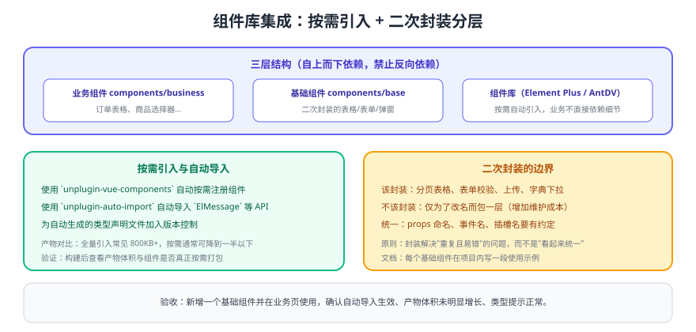

# 组件库集成

模板需要一个"开箱可用"的 UI 层。本模块以 Element Plus 为例，建立**按需引入 + 二次封装分层**的组件体系；换成 Ant Design Vue 时结构不变，只替换解析器与主题适配。



## 一、安装与按需引入

```shell
pnpm add element-plus @element-plus/icons-vue
pnpm add -D unplugin-vue-components unplugin-auto-import
```

```ts [vite.config.ts（插件配置节选）]
import AutoImport from 'unplugin-auto-import/vite'
import Components from 'unplugin-vue-components/vite'
import { ElementPlusResolver } from 'unplugin-vue-components/resolvers'

export default defineConfig({
  plugins: [
    AutoImport({
      imports: ['vue', 'vue-router', 'pinia'],
      resolvers: [ElementPlusResolver()],
      dts: 'src/types/auto-imports.d.ts',
    }),
    Components({
      resolvers: [ElementPlusResolver()],
      dirs: ['src/components'],            // 本地组件也自动注册
      dts: 'src/types/components.d.ts',
    }),
  ],
})
```

::: tip 自动生成的两个 d.ts 要提交到仓库
`auto-imports.d.ts` 与 `components.d.ts` 是类型提示的来源。加入版本控制后，CI 与同事的编辑器才能得到一致的补全；否则会出现"我这儿有提示，别人那儿全是红线"。
:::

## 二、三层结构与依赖方向

| 层 | 目录 | 职责 | 依赖 |
| --- | --- | --- | --- |
| 组件库 | `node_modules` | 提供基础能力 | — |
| 基础组件 | `src/components/base` | 二次封装（表格、表单、上传、字典下拉） | 只依赖组件库 |
| 业务组件 | `src/components/business` | 组合基础组件与业务逻辑 | 依赖基础组件与 API |

**依赖方向只能自上而下**：基础组件不允许 import 业务组件或页面，否则升级与复用都会失控。

## 三、一个值得封装的基础组件：分页表格

```vue [src/components/base/ProTable.vue]
<script setup lang="ts">
import { ref, watch } from 'vue'

interface Props {
  /** 请求函数：接收分页参数，返回 { list, total } */
  request: (params: { page: number; size: number }) => Promise<{ list: any[]; total: number }>
  pageSize?: number
}

const props = withDefaults(defineProps<Props>(), { pageSize: 10 })
const emit = defineEmits<{ (e: 'loaded', list: any[]): void }>()

const list = ref<any[]>([])
const total = ref(0)
const page = ref(1)
const size = ref(props.pageSize)
const loading = ref(false)

async function load() {
  loading.value = true
  try {
    const res = await props.request({ page: page.value, size: size.value })
    list.value = res.list
    total.value = res.total
    emit('loaded', res.list)
  } finally {
    loading.value = false
  }
}

watch([page, size], load, { immediate: true })
defineExpose({ reload: load })
</script>

<template>
  <el-table v-loading="loading" :data="list" border stripe>
    <slot />
  </el-table>
  <el-pagination
    v-model:current-page="page"
    v-model:page-size="size"
    :total="total"
    layout="total, sizes, prev, pager, next"
    class="mt-3 justify-end"
  />
</template>
```

```vue [业务页面用法]
<template>
  <ProTable :request="fetchOrders">
    <el-table-column prop="orderNo" label="订单号" />
    <el-table-column prop="amount" label="金额" />
    <el-table-column label="操作" v-slot="{ row }">
      <el-button v-permission="'order:read'" @click="openDetail(row)">查看</el-button>
    </el-table-column>
  </ProTable>
</template>
```

## 四、全局方法统一出口

消息提示、确认框、加载条这类"到处都在用"的方法，统一从 `src/utils/feedback.ts` 导出，避免每个页面各自 import 组件库：

```ts [src/utils/feedback.ts]
import { ElMessage, ElMessageBox, ElLoading } from 'element-plus'

export const toast = {
  success: (msg: string) => ElMessage.success(msg),
  error: (msg: string) => ElMessage.error(msg),
  confirm: (msg: string, title = '提示') => ElMessageBox.confirm(msg, title, { type: 'warning' }),
  loading: (text = '加载中...') => ElLoading.service({ text, background: 'rgba(0,0,0,.3)' }),
}
```

好处：将来替换组件库时只改这一处；也便于统一文案风格与埋点。

## 五、封装边界（重要）

::: danger 不要为了"统一"而封装
1. 只改名、不改变行为的包装层：增加一层心智负担，升级时还要跟着改。
2. 把业务规则写进基础组件（如"金额必须大于 0"）：基础组件会变成不可复用的特例。
3. 组件 props 命名风格不一致：`visible` / `show` / `open` 混用，调用方每次都要查文档。
:::

判断标准：**封装应该解决"重复且容易写错"的问题**（分页、校验、上传、字典映射），而不是"看起来架构整齐"。

## 验证方式

1. 构建前后对比产物体积，确认按需引入生效（全量引入通常明显更大）。
2. 新增一个业务页并使用 `ProTable`，确认无手动 import、类型提示正常。
3. 打开开发者工具的 Network，确认只加载了用到的组件样式与 JS。
4. 切换暗色主题，确认组件库与自研组件配色一致（见 [主题模块](../Theme/index.md)）。

## 参考资料

- Element Plus 快速开始：https://element-plus.org/zh-CN/guide/quickstart.html
- unplugin-vue-components：https://github.com/unplugin/unplugin-vue-components
