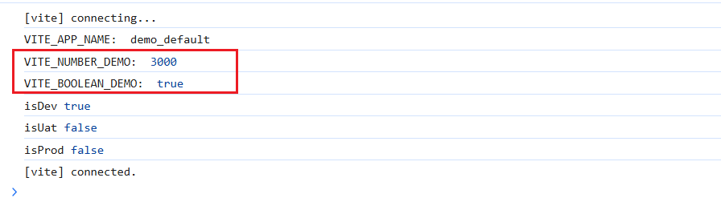

# 配置环境变量

官网：https://cn.vitejs.dev/config/#using-environment-variables-in-config

::: info 本章补充（迭代更新）
本章在原有"环境变量与模式"基础上，**追加多环境部署与配置映射**一节（见文末），用于把本地开发、预发、生产三套配置管理起来；原内容保持不变。
:::

## Vite 中的模式 mode

提到环境变量，就不得不从 **模式 mode**开始唠嗑，因为它决定了应用的构建和运行环境。

### 默认的两种模式

默认 vite 有两种模式，分别对应开发和构建：

- **development**：开发模式
- **production**：生产模式

可以通过 `import.meta.env.MODE`获取当前的模式。

在 main.ts 中测试下模式：

```typescript [main.ts]
// 获取当前模式
const currentMode = import.meta.env.MODE
console.log('当前模式:', currentMode) // 输出: development, uat 或 production
```

如果执行 `pnpm dev`启动服务，则会输出：

> 当前模式: development

如果先执行 `pnpm build`打包，再执行 `pnpm preview`，输出：

> 当前模式: production

通常模式会用来标识环境，如模式为 development，则代表着开发环境。

但真实的企业级项目中，环境不止一套，除了开发环境、生产环境，可能还有：

- 概念验证环境 poc
- 集成测试环境 sit
- 用户接受测试环境 uat
- ...

因此，需要自定义模式（即自定义环境）。

### 自定义模式

自定义模式可以通过在 vite 命令后面添加参数 `--mode`来指定。
修改 package.json 中的 scripts，咱将 `dev`和 `build`进行扩展，支持三套环境：

```json
{
  // ...
  "scripts": {
    "dev:dev": "vite --mode dev",
    "dev:uat": "vite --mode uat",
    "dev:prod": "vite --mode prod",
    "build:dev": "run-p type-check \"build-only {@} --mode dev\" --",
    "build:uat": "run-p type-check \"build-only {@} --mode uat\" --",
    "build:prod": "run-p type-check \"build-only {@} --mode prod\" --",
    // ...
  },
  // ...
}
```

上面的命令分别指定了三个模式，对应三套环境：

1. dev：模式为开发，开发环境
2. uat：模式为uat，uat 环境
3. prod：模式为生产，生产环境

通常情况下，几乎不允许本地启动 vite 服务连接生产环境，因此 `dev:prod`命令可以删除。

## 环境变量

Vite 会自动加载项目根目录下的 `.env`文件及有关变体。

Vite 会自动设置 `NODE_ENV`，这个环境变量无需像 cli 那样需要在 .env 中手动设置，Vite 会根据 mode 参数进行设置。Vite 支持自定义的环境变量，自定义环境变量必须以 `VITE_`前缀开头，否则不会被暴露到浏览器端； 所有环境变量的值都是字符串类型。

`.env`文件的变体有三种：

- `.env.local`
- `.env.[mode]`
- `.env.[mode].local`

带有 `.local`的环境变量文件，是特有的值，一定要添加到 .gitignore 中(默认 git 忽略文件已经包括 `*.local`)。

### 优先级

同一个环境变量在四种文件中都存在进行测试：

1. 在根目录下创建 `.env`文件，定义变量：

   ```properties [.env]
   VITE_APP_NAME=demo_default
   ```

2. 在 `index.vue`中访问该变量：

   ```vue
   <template>
     <div>{{ appName }}</div>
   </template>
   
   <script setup lang="ts">
   const appName = import.meta.env?.VITE_APP_NAME ?? ''
   </script>
   ```

   `pnpm dev:dev`运行项目，访问 index.vue

   这时候界面上显示：demo_default

3. 根目录下继续创建 `.env.local`：

   ```properties [.env.local]
   VITE_APP_NAME=demo_local
   ```

   界面上显示：demo_local

4. 根目录下继续创建 `.env.dev`：

   ```properties [.env.dev]
   VITE_APP_NAME=demo_dev
   ```

   界面上显示：demo_dev

5. 根目录下继续创建 `.env.dev.local`：

   ```properties [.env.dev.local]
   VITE_APP_NAME=demo_dev_local
   ```

   界面上显示：demo_dev_local

从而可以看出优先级依次为：

1. `.env.[mode].local`
2. `.env.[mode]`
3. `.env.local`
4. `.env`

### TypeScript 类型定义

使用 `import.meta.env`来获取环境变量，IDE不会自动提示自定义的 VITE_XXX 变量，没代码提示。

在根目录 `env.d.ts`文件中添加如下类型声明：

```typescript
interface ImportMetaEnv {
  readonly VITE_APP_NAME: string
}

interface ImportMeta {
  readonly env: ImportMetaEnv
}
```

这个时候就有提示了。

### 简单封装工具类

可以创建一个环境变量读取的工具类，简化代码中读取环境的代码。 创建文件：

```typescript [src/utils/env.ts]
export class Env {
  /**
   * 获取环境变量
   * @param key 环境变量名
   * @param defaultValue 默认值
   */
  static get<T>(key: keyof ImportMetaEnv, defaultValue?: T): T | string {
    const value = import.meta.env[key]
    return value ?? (defaultValue as T)
  }

  /**
   * 获取数字类型的环境变量
   */
  static getNumber(key: keyof ImportMetaEnv, defaultValue?: number): number {
    const value = import.meta.env[key]
    if (value === undefined) {
      return defaultValue as number
    }
    return Number(value)
  }

  /**
   * 获取布尔类型的环境变量
   */
  static getBoolean(key: keyof ImportMetaEnv, defaultValue?: boolean): boolean {
    const value = import.meta.env[key]
    if (value === undefined) {
      return defaultValue as boolean
    }
    return value === 'true' || value === '1'
  }

  /** 获取当前环境 */
  static get env(): 'dev' | 'uat' | 'prod' {
    return this.get('VITE_ENV', 'dev') as 'dev' | 'uat' | 'prod'
  }

  /** 是否为开发环境 */
  static get isDev(): boolean {
    return this.env === 'dev'
  }

  /** 是否为UAT环境 */
  static get isUat(): boolean {
    return this.env === 'uat'
  }

  /** 是否为生产环境 */
  static get isProd(): boolean {
    return this.env === 'prod'
  }
}
```

在 `.env`分别添加 number 和 boolean 类型的环境变量进行测试：

```properties [.env]
VITE_NUMBER_DEMO=3000
VITE_BOOLEAN_DEMO=true
```

根目录下的 `env.d.ts`也同步更新环境变量类型定义：

```typescript [env.d.ts]
// ...
interface ImportMetaEnv {
  readonly VITE_APP_NAME: string
  readonly VITE_NUMBER_DEMO: number
  readonly VITE_BOOLEAN_DEMO: boolean
}
// ...
```

在 main.ts 中测试：

```typescript [main.ts]
console.log('VITE_APP_NAME: ', Env.get('VITE_APP_NAME'))
console.log('VITE_NUMBER_DEMO: ', Env.getNumber('VITE_NUMBER_DEMO'))
console.log('VITE_BOOLEAN_DEMO: ', Env.getBoolean('VITE_BOOLEAN_DEMO'))
console.log('isDev', Env.isDev)
console.log('isUat', Env.isUat)
console.log('isProd', Env.isProd)
```

从浏览器控制台中可以看到结果，已正确识别出 number 和 boolean 类型：



### vite.config.ts 中获取环境变量

在 vite.config.ts 中通常都需要读取环境变量，如根据不同的环境或环境变量，加载不同的插件。

但在该文件中不能使用 import.meta.env 获取环境变量，这是因为：

1. vite.config.ts 是在 Node.js 环境中运行的，默认使用 CommonJS 模块规范；import.meta.nev 是 ES 模块的内置变量，运行在浏览器环境。

2. vite.config.ts 是在 Vite启动的早期阶段执行，此时 Vite 还没有完全加载和处理环境变量；而 import.meta.env 是 Vite 在构建过程中注入到最终代码中的，只能在构建后的代码中可以使用。

   两者的执行时机不同，简单来说：当 vite.config.ts 执行时， import.meta.env 还不存在，因为 Vite 还没开始处理它。

如果要在 vite.config.ts 中访问环境变量，需要使用 loadEnv 函数。该函数会根据当前模式 (mode) 手动加载对应的 .env 文件，返回解析后的环境变量对象。

修改 vite.config.ts 文件：

```typescript
import { defineConfig, loadEnv } from 'vite'
// ...
export default defineConfig(({ mode }) => {
  // 根据当前工作目录中的 `mode` 加载 .env 文件
  // 设置第三个参数为 '' 来加载所有环境变量，而不管是否有
  // `VITE_` 前缀。
  const env = loadEnv(mode, process.cwd(), 'VITE_')
  const { VITE_VERSION, VITE_API_URL } = env
  console.log(`🚀 API_URL = ${VITE_API_URL}`)
  console.log(`🚀 VERSION = ${VITE_VERSION}`)
  return {
    // ... 原有的配置内容
  }
})
```

`loadEnv`函数的第三个参数是环境变量前缀，默认为 `VITE_`。如果设置为空字符串，则会加载所有环境变量。

## 配置环境

在根目录新建.env开头的文件：

- .env 所有环境默认加载

  ```properties [.env]
  # 通用环境变量
  
  # 项目名称
  VITE_APP_TITLE = 'base-vue3-template'
  # 版本号
  VITE_VERSION = 1.0.0
  # 端口号
  # VITE_PORT = 3000
  
  # 网站地址前缀
  VITE_BASE_URL = /
  # API 地址前缀
  VITE_API_URL = http://localhost:8080
  ```

- .env.development 开发环境默认加载

  ```properties [.env.development]
  # 开发环境变量
  
  # 网站地址前缀
  VITE_BASE_URL = /
  
  # 端口号
  VITE_PORT = 9999
  
  # API 地址前缀
  VITE_API_URL = http://localhost:8080
  ```

- .env.production 生产环境默认加载

  ```properties [.env.production]
  # 生产环境变量
  
  # 网站地址前缀
  VITE_BASE_URL = /base/
  
  # 部署线上 第三方库合并为vendor.js
  VITE_BUILD_VENDOR = true
  
  # 部署线上 压缩gzip
  VITE_BUILD_GZIP = true
  
  # 端口号
  VITE_PORT = 5174
  
  # API 地址前缀
  VITE_API_URL = http://localhost:8080
  ```
