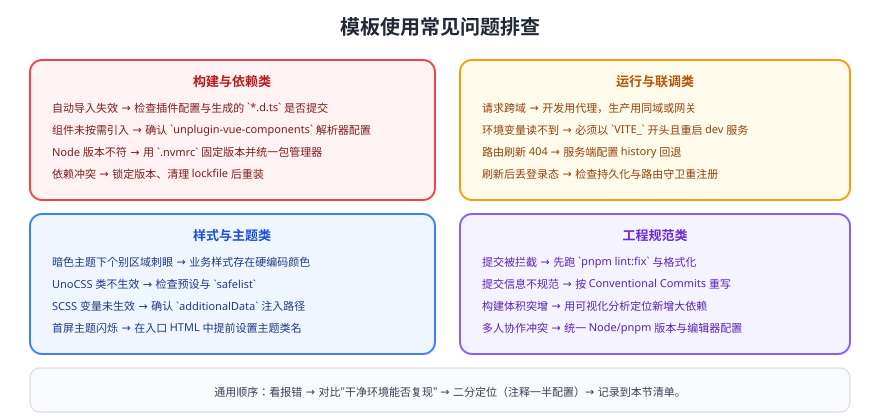

# 常见问题与最佳实践

本页汇总使用该模板时的高频问题，按「构建与依赖 → 运行与联调 → 样式与主题 → 工程规范」分类，可直接当作团队速查表使用。



## 一、构建与依赖

| 现象 | 原因 | 解决 |
| --- | --- | --- |
| 自动导入失效、`ref` 报未定义 | 自动导入插件未生效或生成的 `d.ts` 未提交 | 检查 `unplugin-auto-import` 配置，提交 `src/types/auto-imports.d.ts` |
| 组件能用但编辑器标红 | `components.d.ts` 未生成或未提交 | 重新启动 dev 服务并提交类型声明 |
| 安装依赖后构建失败 | Node / pnpm 版本不一致 | 用 `.nvmrc` + `packageManager` 字段固定版本 |
| 依赖冲突或幽灵依赖 | 未锁定版本 / 使用了未声明的依赖 | 清理 lockfile 重装，禁止直接引用未声明依赖 |

## 二、运行与联调

::: danger 联调中最容易浪费时间的四件事
1. **跨域**：开发期用 Vite 代理，生产用 Nginx 同域反代；不要在前端硬编码跨域域名。
2. **环境变量读不到**：必须以 `VITE_` 开头，且修改后要重启 dev 服务。
3. **刷新 404**：history 模式必须配置服务端回退（见 [发布模块](../Release/index.md)）。
4. **刷新丢登录态**：检查持久化与路由守卫，动态路由需要重新注册（见 [权限模块](../Permission/index.md)）。
:::

```ts [vite.config.ts（开发代理）]
server: {
  proxy: {
    '/api': {
      target: 'http://localhost:8080',
      changeOrigin: true,
      // 后端没有 /api 前缀时：
      // rewrite: (path) => path.replace(/^\/api/, ''),
    },
  },
}
```

## 三、样式与主题

| 现象 | 原因 | 解决 |
| --- | --- | --- |
| UnoCSS 类不生效 | 预设未配置或类名被动态拼接 | 检查 `uno.config.ts`；动态类名放入 `safelist` |
| SCSS 变量在组件里不可用 | 未注入全局变量 | 在 `css.preprocessorOptions.scss.additionalData` 注入 |
| 暗色下局部刺眼 | 业务样式硬编码颜色 | 改为语义变量（见 [主题模块](../Theme/index.md)） |
| 首屏主题闪烁 | 主题在挂载后才设置 | 在 `index.html` 中提前写入 `data-theme` |

## 四、工程规范

1. **提交前自检**：`pnpm lint`、`pnpm stylelint`、构建三条命令全部通过再提交。
2. **提交信息**：遵循 Conventional Commits（`feat:` / `fix:` / `chore:` / `docs:`）。
3. **代码规范**：编辑器使用项目内的 `.editorconfig` 与 ESLint/Prettier 配置，不要用个人配置覆盖。
4. **新增依赖**：先评估体积与维护活跃度，能自己写的小工具不必引入新库。

## 五、性能相关

| 现象 | 排查 | 优化 |
| --- | --- | --- |
| 首屏慢 | 构建产物体积分析 | 路由懒加载、按需引入、图片压缩 |
| 打包体积突增 | 体积可视化 | 定位新依赖，改用轻量替代或按需引入 |
| 列表卡顿 | 大数据量渲染 | 分页/虚拟列表，减少 `setData` 式的大对象更新 |
| 重复请求 | Network 面板 | 请求缓存、去重、防抖节流 |

## 最佳实践清单

::: tip 目录与分层
1. `src/components/base` 只依赖组件库，`business` 依赖 `base`，方向不可逆。
2. API 调用统一走 `src/api/`，页面里不直接写请求细节。
3. 常量、枚举集中维护，避免魔法字符串散落。
:::

::: tip 协作
1. 新增模块必须同步更新项目目录页与侧边栏。
2. 每个模块都要有"可验证的收尾"，而不是只贴代码。
3. 项目内互相引用使用相对链接，禁止死链。
:::

## 验证方式

1. 按本页清单逐项复现一次问题（至少挑选 3 条），确认解决方式有效。
2. 在一台干净环境（新克隆）执行 `pnpm install && pnpm build:prod`，确认无本地隐式依赖。
3. 用浏览器无痕模式访问部署好的站点，确认无缓存导致的旧版本问题。
4. 把本次踩到的新问题补充到本页对应分类，保持速查表更新。

## 相关专题

- [初始化项目](../InitProject/index.md)、[配置环境变量](../Env/index.md)、[配置打包构建优化](../Build/index.md)
- [网络请求封装](../Http/index.md)、[权限模块](../Permission/index.md)、[主题模块](../Theme/index.md)
- [组件库集成](../ComponentLibrary/index.md)、[发布模块](../Release/index.md)

## 参考资料

- Vite 官方文档：https://cn.vitejs.dev/
- Vue 3 官方文档：https://cn.vuejs.org/
- Element Plus 常见问题：https://element-plus.org/zh-CN/guide/faq.html
